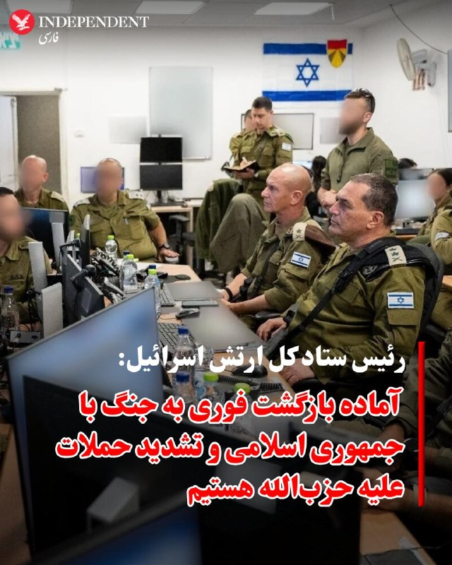
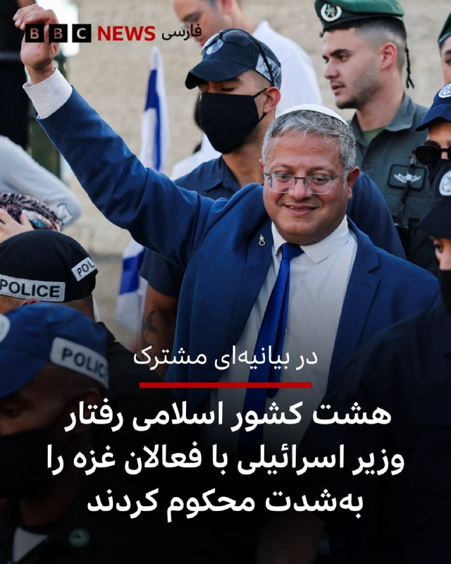
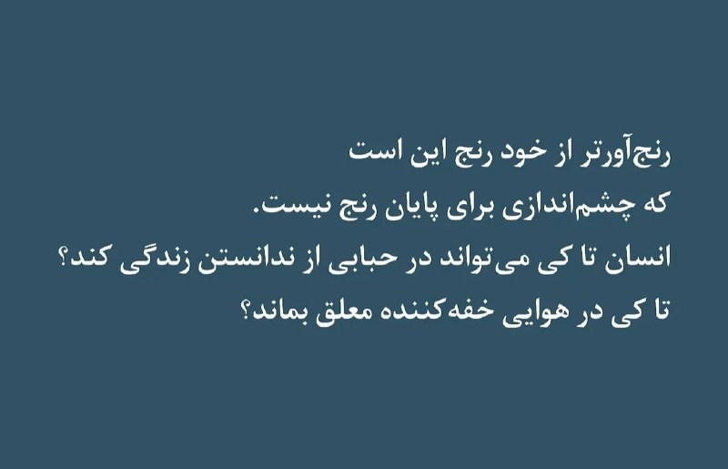
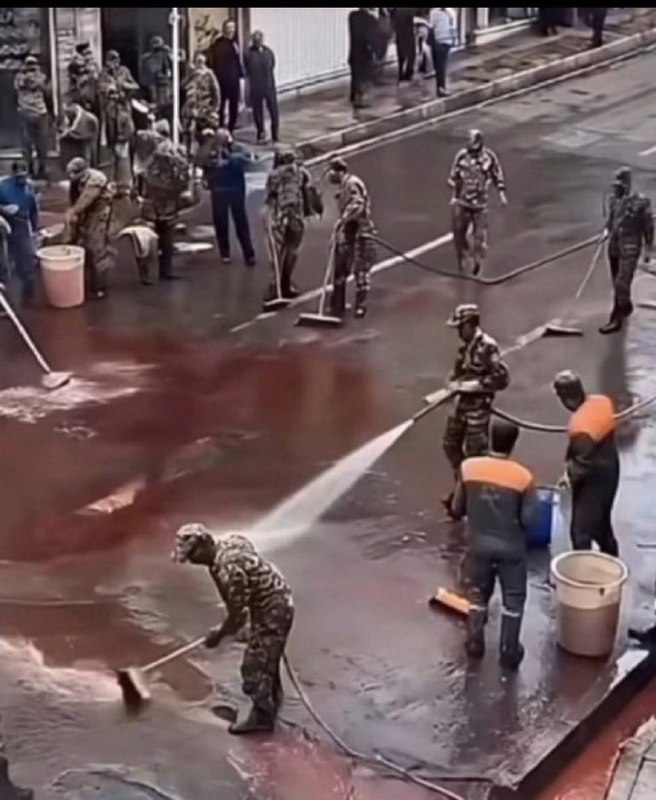
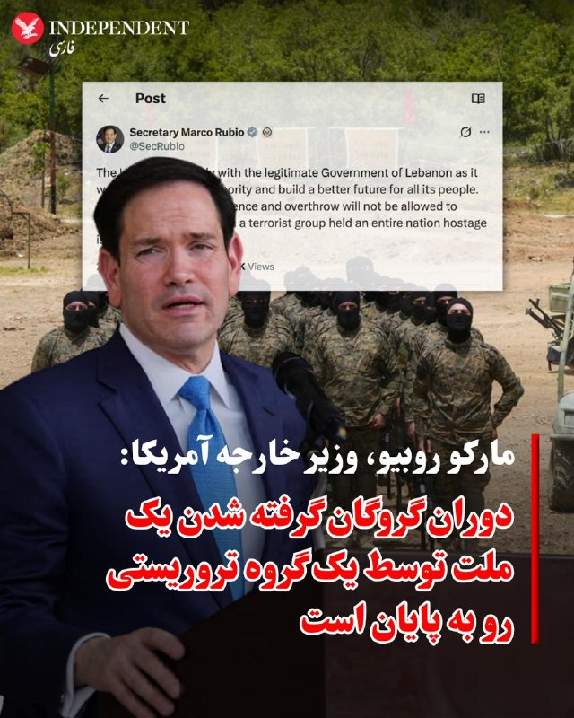
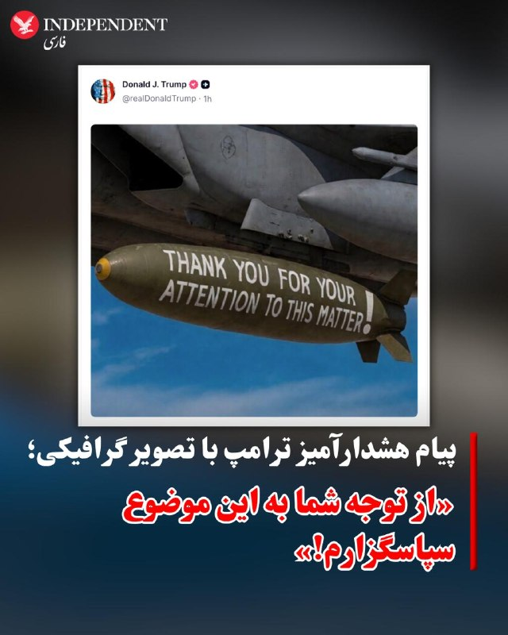
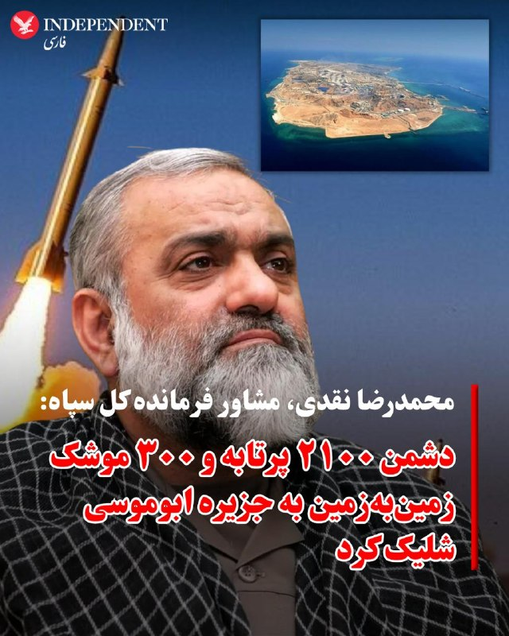
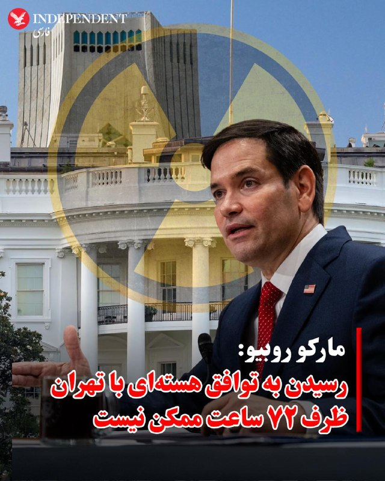
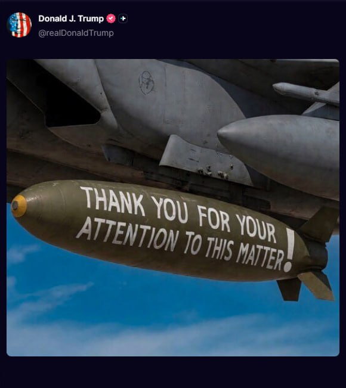
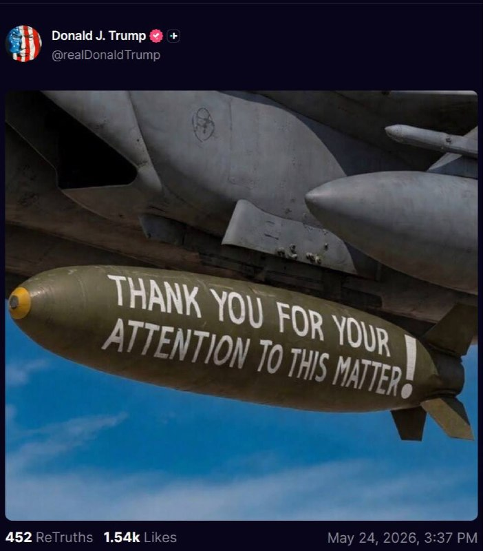

# خواننده تلگرام

<!-- TOP_NAV START -->

<a href="https://github.com/kiavash-sh/aio-downloader/blob/main/telegram/content/archive_1.md" style="display:inline-block; padding:6px 12px; margin:0 4px; background-color:#2ea44f; color:white; text-decoration:none; border-radius:4px; font-weight:bold;">صفحه بعد</a>

<!-- TOP_NAV END -->

<!-- MSG START -->

---
📅 بروزرسانی: 1405/03/04 02:54
---

## VahidOOnLine — post 242017

  <a href="telegram/content/VahidOOnLine_242017_1779665056.mp4" target="_blank">🎬 Download video</a>

♦️همزمان با افزایش تنش‌ها، حبیب‌الله سیاری، معاون هماهنگ‌کننده ارتش جمهوری اسلامی، روز یکشنبه، در پرسش خبرنگاران درباره روند مذاکرات و گزارش‌های منتشر شده پیرامون احتمال امضای یک توافق اولیه میان تهران و واشنگتن گفت: «من اصلا نمی‌دانم توافق چیست». این اظهارات در حالی مطرح شد که به گزارش کانال ۱۴ اسرائیل، نقطه اختلاف اصلی میان رژیم ایران و آمریکا در نهایی کردن توافق اولیه بر سر ۲۲ میلیارد دلاری است که مقام‌های جمهوری اسلامی خواهان دریافت فوری آن هستند. دونالد ترامپ نیز روز یکشنبه اعلام کرد اگر با ایران به توافق برسد، این توافق «خوب و درست» خواهد بود و شباهتی به توافق هسته‌ای دوره باراک اوباما نخواهد داشت.
‌🇸🇦 Indypersian

🤖 @VahidOOnLine

## VahidOOnLine — post 242016

  

مارکو روبیو، وزیر خارجه آمریکا، درخواست حزب‌الله لبنان، از گروه‌های نیابتی جمهوری اسلامی، برای سرنگونی دولت منتخب دموکراتیک لبنان را محکوم کرد و گفت: «تهدیدهای حزب‌الله مبنی بر خشونت و سرنگونی، اجازه موفقیت نخواهد داشت.»

او در بیانیه‌ای که در وب‌سایت وزارت خارجه آمریکا منتشر شد، گفت حزب‌الله درخواست‌های مکرر دولت مشروع لبنان برای توقف حملات و احترام به آتش‌بس را نادیده گرفته و به شلیک به مواضع اسرائیل و انتقال شبه‌نظامیان و سلاح به جنوب لبنان ادامه داده است.

روبیو این اقدامات را «کارزار عمدی برای بی‌ثبات کردن کشور و حفظ قدرت خود به قیمت آینده مردم لبنان» خواند و گفت حزب‌الله در تلاش است لبنان را به هرج‌ومرج و ویرانی بازگرداند.

او تاکید کرد ایالات متحده در کنار دولت مشروع لبنان برای بازگرداندن اقتدار خود و ساختن آینده‌ای بهتر برای مردم این کشور می‌ایستد و افزود: «دورانی که یک گروه تروریستی، کل یک ملت را گروگان گرفته بود، رو به پایان است.»

‌🏁 🇬🇧 IranintlTV

🤖 @VahidOOnLine

## VahidOOnLine — post 242015

♦️ وزارت دفاع عربستان سعودی روز شنبه با انتشار ویدیویی در اکس اعلام کرد نیروهای پدافند هوایی این کشور با آمادگی کامل فعالیت می‌کنند و سطح آمادگی امنیتی افزایش یافته است. این وزارتخانه اعلام کرد نیروهای پدافند هوایی با استفاده از سامانه‌های پیشرفته رصد و مقابله با تهدیدهای هوایی، امنیت و آرامش زائران حج را تامین می‌کنند. وزارت دفاع عربستان سعودی تاکید کرد این اقدامات در راستای تقویت امنیت و خدمت‌رسانی به زائران در مکه و مناطق مقدس انجام می‌شود.
‌🇸🇦 Indypersian

🤖 @VahidOOnLine

## VahidOOnLine — post 242014

  

♦️به گزارش کانال ۱۴ اسرائیل، نقطه اختلاف اصلی میان رژیم جمهوری اسلامی و آمریکا در نهایی کردن توافق اولیه بر سر ۲۲ میلیارد دلار است؛ مبلغی که مقام‌های جمهوری اسلامی خواهان دریافت فوری آن هستند، در حالی که دولت ترامپ اصرار دارد تهران ابتدا به تعهدات خود عمل کند.
این گزارش می افزاید به رژیم ایران توافقی رویایی» پیشنهاد شده که انتظار می‌رود آن را بپذیرند، اما جمهوری اسلامی در مراحل پایانی مذاکرات با رئیس‌جمهوری آمریکا در حال اتخاذ موضعی سخت‌گیرانه است.
‌🇸🇦 Indypersian

🤖 @VahidOOnLine

## VahidOOnLine — post 242013

  

شبکه خبری سی‌بی‌اس به نقل از مقام‌های آمریکایی آگاه گزارش داد اطلاعات ایالات متحده نشان می‌دهد علی خامنه‌ای، رهبر جمهوری اسلامی، عملا در مکانی نامعلوم پنهان شده و دسترسی بسیار محدودی به دنیای خارج دارد.

بر اساس این گزارش، مقام‌های حکومت ایران تنها از طریق شبکه‌ای پیچیده از پیک‌ها با او ارتباط می‌گیرند و حتی مقام‌های ارشد نیز از محل دقیق او اطلاع ندارند یا راهی برای تماس مستقیم با او ندارند.

سی‌بی‌اس نوشت این اختلال ارتباطی یکی از دلایل کندی در اعلام جزئیات توافق احتمالی تهران و واشینگتن است؛ زیرا پس از ارسال پیشنهادهای آمریکا، دسترسی دشوار به خامنه‌ای می‌تواند پاسخ تهران را با تأخیر قابل‌توجه روبه‌رو کند.

سخنگوی کاخ سفید از اظهارنظر درباره محل اقامت خامنه‌ای یا شیوه ارتباطی مقام‌های جمهوری اسلامی خودداری کرد.

این شبکه همچنین به نقل از مقام‌های آمریکایی نوشت بسیاری از مقام‌های جمهوری اسلامی هفته‌ها را در پناهگاه‌های مستحکم می‌گذرانند و جز در موارد ضروری با یکدیگر گفت‌وگو نمی‌کنند.
‌🏁 🇬🇧 IranintlTV

🤖 @VahidOOnLine

## VahidOOnLine — post 242012

  

♦️مهدی کوهیان، مدیر حقوقی خانه سینما، با تایید احضار تعدادی از سینماگران از جمله سعید روستایی و هومن سیدی به دادسرای فرهنگ و رسانه، اعلام کرد که قوه قضائیه جمهوری اسلامی این کارگردانان سرشناس را به اتهام سنگین «همکاری با دولت‌های متخاصم» متهم کرده است. پیش از این، هومن سیدی، کارگردان و بازیگر همزمان با کشتار مردم ایران در اعتراضات دی‌ماه ۱۴۰۴، در واکنش به برگزاری جشنواره حکومتی فجر در اینستاگرام نوشته بود: «هیچ جشنواره‌ای، هیچ تندیس و هیچ دیده‌شدنی ارزش ایستادن روی سکوب و عبور از جان انسان را ندارد. دیده‌شدن، وقتی به قیمت ندیدن انسان تمام می‌شود، فقط یک معامله‌ ارزان است. سینما وقتی کنار انسان می‌ایستد معنا دارد؛ وقتی از روی او رد می‌شود، دیگر فقط یک تصویر بی ارزش است».
کوهیان با انتقاد از این اقدام دستگاه قضایی جمهوری اسلامی تصریح کرد که طرح چنین عناوین کیفری سنگینی علیه هنرمندانی که سال‌ها برای تولید فرهنگ ایرانی تلاش کرده‌اند، بدون مستندات روشن تنها به تعمیق شکاف‌های اجتماعی و آسیب به انسجام داخلی منجر می‌شود و ابلاغ مداوم آن در احضاریه‌ها، متاسفانه باعث «شکسته شدن تابوی این اتهام بزرگ» شده است. مدیر حقوقی خانه سینما در بخش دیگری از گفتگو با خبرگزاری ایسنا اعلام کرد که تعدادی از این سینماگران برخلاف درخواست صنف برای حفظ سکوت، خبر احضار خود را به رسانه‌ها درز داده‌اند؛ اقدامی که به گفته او «از منظر میهن‌پرستی و تدبیر جمعی به ضرر فضای کلی سینما و کشور بوده است».
‌🇸🇦 Indypersian

🤖 @VahidOOnLine

## VahidOOnLine — post 242011

  

♦️اسرائیل تایمز یکشنبه سوم خردادماه گزارش داد ایال زمیر، رئیس ستاد کل ارتش اسرائیل، اعلام کرد ارتش این کشور آماده بازگشت فوری به جنگ با جمهوری اسلامی و تشدید حملات علیه حزب‌الله است. او همچنین پس از ارزیابی وضعیت میدانی، طرح‌های ادامه نبرد علیه حزب‌الله در لبنان را تایید کرد.

زمیر در بازدید از فرماندهی منطقه شمال و مقر تیپ زرهی ۴۰۱ گفت ارتش اسرائیل مصمم است حملات علیه حزب‌الله را عمیق‌تر کند و به حمله به این گروه «در همه ابعاد» ادامه دهد.

او تاکید کرد امنیت ساکنان و حفظ جان نیروهای اسرائیلی «بالاتر از هر چیز» است و افزود ارتش اسرائیل آماده است فورا به درگیری‌های شدید بازگردد و حکومت «تروریستی» جمهوری اسلامی و توانمندی‌های آن را بیش از پیش تضعیف کند.

اظهارات رئیس ستاد کل ارتش اسرائیل در حالی مطرح می‌شود که آمریکا و جمهوری اسلامی در حال مذاکره برای دستیابی به توافقی احتمالی هستند؛ توافقی که گزارش شده ممکن است شامل بندی درباره توقف درگیری‌ها در لبنان باشد.

زمیر همچنین از عملکرد تیپ ۴۰۱ تمجید کرد و برای مئیر بیدرمن، فرمانده این تیپ که هفته گذشته در جنوب لبنان به‌شدت زخمی شد، آرزوی بهبودی سریع کرد.
‌🇸🇦 Indypersian

🤖 @VahidOOnLine

## VahidOOnLine — post 242010

  <a href="telegram/content/VahidOOnLine_242010_1779665062.mp4" target="_blank">🎬 Download video</a>

دادگاهی در بحرین، ۹ متهم را به اتهام همکاری با سپاه پاسداران به حبس ابد محکوم کرده است.
به گزارش رویترز، این افراد به اتهام «انجام اقدامات خصمانه و تروریستی علیه بحرین» و همکاری با سپاه پاسداران محکوم شده‌اند. دو متهم دیگر نیز به سه سال زندان محکوم شده‌اند.
براساس اعلام دادستانی، این افراد متهم به جمع‌آوری اطلاعات از اماکن حساس و تسهیل انتقال‌های مالی مرتبط بوده‌اند.
این پرونده پس از آن مطرح شد که وزارت کشور بحرین اعلام کرد در ماه مه ۴۱ نفر را در ارتباط با شبکه‌ای مرتبط با سپاه پاسداران بازداشت کرده است. مقامات بحرینی مدعی شده‌اند این شبکه با هدف اقدامات امنیتی علیه کشور فعالیت داشته است.
در همین حال، تنش‌ها میان ایران و کشورهای منطقه پس از درگیری‌های اخیر و حملات متقابل در خلیج فارس افزایش یافته است؛ هرچند تهران همواره این اتهامات را رد کرده و آنها را سیاسی می‌داند.
‌🏁 🇬🇧 ManotoTV

🤖 @VahidOOnLine

## VahidOOnLine — post 242009

  <a href="telegram/content/VahidOOnLine_242009_1779665063.mp4" target="_blank">🎬 Download video</a>

خبرگزاری رویترز به نقل از یک مقام دولت آمریکا گزارش داده است که جمهوری‌اسلامی در اصل با کنار گذاشتن ذخایر اورانیوم نزدیک به سطح تسلیحاتی خود موافقت کرده است.
به گفته این مقام ارشد در دولت ترامپ، واشنگتن معتقد است رهبر جمهوری اسلامی چارچوب کلی این توافق را تایید کرده است. با این حال هنوز از سوی تهران تأیید رسمی یا توضیحی درباره معنای دقیق «موافقت اصولی» ارائه نشده است.
این مقام آمریکایی همچنین در واکنش به گزارش‌هایی مبنی بر اینکه جمهوری‌اسلامی با کنار گذاشتن ذخایر اورانیوم غنی‌شده موافقت نکرده، گفته است: «موضوع این نیست که آیا، بلکه چگونه.»
در همین حال، منابع جمهوری‌اسلامی به رویترز گفته‌اند که در مراحل بعدی مذاکرات می‌توان «فرمول‌های عملی» برای حل این مسئله پیدا کرد؛ از جمله رقیق‌سازی اورانیوم تحت نظارت آژانس بین‌المللی انرژی اتمی.
بر اساس گزارش آژانس بین‌المللی انرژی اتمی، جمهوری‌اسلامی در حال حاضر ۴۴۰.۹ کیلوگرم اورانیوم با غنای ۶۰ درصد در اختیار دارد؛ سطحی که از نظر فنی تنها یک گام کوتاه تا سطح تسلیحاتی ۹۰ درصد فاصله دارد.
‌🏁 🇬🇧 ManotoTV

🤖 @VahidOOnLine

## VahidOOnLine — post 242008

  <a href="telegram/content/VahidOOnLine_242008_1779665063.mp4" target="_blank">🎬 Download video</a>

دونالد ترامپ جونیور، پسر رئیس‌جمهور‌ آمریکا در شبکه اکس، با بازنشر پستی مرتبط با مذاکرات آمریکا با جمهوری‌اسلامی نوشته است «این یک پیروزی بسیار بزرگ برای آمریکا است. ما باید حرف کسانی را نادیده بگیریم که فقط زمانی خوشحال می‌شوند که حمله زمینی به ایران انجام شود. پدر من وعده داده بود که جلوی دست‌یابی ایران به سلاح هسته‌ای را بگیرد و دقیقاً هم دارد همین کار را انجام می‌دهد»

دونالد ترامپ جونیور، فرزند ارشد رئیس‌جمهور آمریکا، ۲۱ می با بتینا اندرسون، اینفلوئنسر ۳۹ ساله اهل پالم بیچ فلوریدا، ازدواج کرد.
این زوج ابتدا یک مراسم قانونی و کاملا خصوصی را در وست پالم بیچ برگزار کردند و سپس جشن اصلی ازدواج در ۲۳ می، در یک جزیره خصوصی در باهاما و با حضور جمعی از اعضای خانواده و دوستان نزدیک برگزار شد.
این مراسم به‌صورت محدود و دور از رسانه‌ها انجام شد.
در همین حال، دونالد ترامپ، پدر داماد، اعلام کرد که به دلیل «مسائل دولتی و تعهدات مربوط به آمریکا» قادر به حضور در مراسم نبوده است. او گفته است که شرایط حساس سیاسی و تنش‌های جاری، از جمله وضعیت مرتبط با جمهوری‌اسلامی و تحولات منطقه‌ای، مانع حضورش در این مراسم شده است.
‌🏁 🇬🇧 ManotoTV

🤖 @VahidOOnLine

## WithYashar — post 12385

شبکه خبری سی‌بی‌اس به نقل از مقام‌های آمریکایی آگاه گزارش داد اطلاعات ایالات متحده نشان می‌دهد علی خامنه‌ای، رهبر جمهوری اسلامی، عملا در مکانی نامعلوم پنهان شده و دسترسی بسیار محدودی به دنیای خارج دارد.

بر اساس این گزارش، مقام‌های حکومت ایران تنها از طریق شبکه‌ای پیچیده از پیک‌ها با او ارتباط می‌گیرند و حتی مقام‌های ارشد نیز از محل دقیق او اطلاع ندارند یا راهی برای تماس مستقیم با او ندارند.
@withyashar
سی‌بی‌اس نوشت این اختلال ارتباطی یکی از دلایل کندی در اعلام جزئیات توافق احتمالی تهران و واشینگتن است؛ زیرا پس از ارسال پیشنهادهای آمریکا، دسترسی دشوار به خامنه‌ای می‌تواند پاسخ تهران را با تأخیر قابل‌توجه روبه‌رو کند.

این شبکه همچنین به نقل از مقام‌های آمریکایی نوشت بسیاری از مقام‌های جمهوری اسلامی هفته‌ها را در پناهگاه‌های مستحکم می‌گذرانند و جز در موارد ضروری با یکدیگر گفت‌وگو نمی‌کنند.
@withyashar

## FoxNewsTwitter — post 342188

  

Fox News (Twitter/X)

WATCH LIVE: Graham Platner joins Sen. Bernie Sanders for 'Fighting Oligarchy' rally https://twitter.com/i/broadcasts/1DGLddvXkVZGm

## pm_afshaa — post 91423

  <a href="telegram/content/pm_afshaa_91423_1779665066.webm" target="_blank">🎬 Download video</a>

🔴بعد از اخبار توافق احتمالی ایران و آمریکا، نفت با قیمت 98 دلار باز شد.

💧 Rainbet.com the #1 Non-KYC Crypto Casino & Sportsbook @rainbetcom

😁 @Pm_Afshaa

## IranIntlTV — post 338822

  

مارکو روبیو، وزیر خارجه آمریکا، درخواست حزب‌الله لبنان، از گروه‌های نیابتی جمهوری اسلامی، برای سرنگونی دولت منتخب دموکراتیک لبنان را محکوم کرد و گفت: «تهدیدهای حزب‌الله مبنی بر خشونت و سرنگونی، اجازه موفقیت نخواهد داشت.»

او در بیانیه‌ای که در وب‌سایت وزارت خارجه آمریکا منتشر شد، گفت حزب‌الله درخواست‌های مکرر دولت مشروع لبنان برای توقف حملات و احترام به آتش‌بس را نادیده گرفته و به شلیک به مواضع اسرائیل و انتقال شبه‌نظامیان و سلاح به جنوب لبنان ادامه داده است.

روبیو این اقدامات را «کارزار عمدی برای بی‌ثبات کردن کشور و حفظ قدرت خود به قیمت آینده مردم لبنان» خواند و گفت حزب‌الله در تلاش است لبنان را به هرج‌ومرج و ویرانی بازگرداند.

او تاکید کرد ایالات متحده در کنار دولت مشروع لبنان برای بازگرداندن اقتدار خود و ساختن آینده‌ای بهتر برای مردم این کشور می‌ایستد و افزود: «دورانی که یک گروه تروریستی، کل یک ملت را گروگان گرفته بود، رو به پایان است.»

https://iranintl.com/202605246199

## IranIntlTV — post 338821

  

شبکه خبری سی‌بی‌اس به نقل از مقام‌های آمریکایی آگاه گزارش داد اطلاعات ایالات متحده نشان می‌دهد علی خامنه‌ای، رهبر جمهوری اسلامی، عملا در مکانی نامعلوم پنهان شده و دسترسی بسیار محدودی به دنیای خارج دارد.

بر اساس این گزارش، مقام‌های حکومت ایران تنها از طریق شبکه‌ای پیچیده از پیک‌ها با او ارتباط می‌گیرند و حتی مقام‌های ارشد نیز از محل دقیق او اطلاع ندارند یا راهی برای تماس مستقیم با او ندارند.

سی‌بی‌اس نوشت این اختلال ارتباطی یکی از دلایل کندی در اعلام جزئیات توافق احتمالی تهران و واشینگتن است؛ زیرا پس از ارسال پیشنهادهای آمریکا، دسترسی دشوار به خامنه‌ای می‌تواند پاسخ تهران را با تأخیر قابل‌توجه روبه‌رو کند.

سخنگوی کاخ سفید از اظهارنظر درباره محل اقامت خامنه‌ای یا شیوه ارتباطی مقام‌های جمهوری اسلامی خودداری کرد.

این شبکه همچنین به نقل از مقام‌های آمریکایی نوشت بسیاری از مقام‌های جمهوری اسلامی هفته‌ها را در پناهگاه‌های مستحکم می‌گذرانند و جز در موارد ضروری با یکدیگر گفت‌وگو نمی‌کنند.
https://iranintl.com/202605246291

## IranIntlTV — post 338820

  <a href="telegram/content/IranIntlTV_338820_1779665069.mp4" target="_blank">🎬 Download video</a>

دادگاه انقلاب تهران چهار نفر از متهمان اصلی پرونده شهرک اکباتان را به اتهام افساد فی‌الارض به اعدام محکوم کرد.

قاضی صلواتی با رد حکم پیشین دادگاه کیفری، بار دیگر احکام اعدام میلاد آرمون، نوید نجاران، مهدی ایمانی و محمدمهدی حسینی را صادر کرد.

گفت‌وگو با نازلی صدقی، حقوقدان
@iranintltv

## IranIntlTV — post 338819

  <a href="telegram/content/IranIntlTV_338819_1779665072.mp4" target="_blank">🎬 Download video</a>

همزمان با شدت گرفتن تورم در بازار خوراکی‌ها، وزیر کشاورزی اعلام کرد تمام محدودیت‌های واردات کالاهای اساسی لغو شده است.

یک عضو مجلس نیز گفت سیاست‌های ارزی دولت موجب افزایش شدید قیمت مواد غذایی شده و کالابرگ پرداختی پاسخگوی این گرانی‌ها نیست.

گفت‌وگو با علی دادپی، اقتصاددان
@iranintltv

## FarsiVOA — post 218573

⚡️پرزیدنت ترامپ می‌گوید آمریکا برای توافق با جمهوری اسلامی عجله‌ ندارد
@FarsiVOA

## FarsiVOA — post 218572

🔺سی‌بی‌اس به نقل از مقامات آمریکایی: بیشتر رهبران جمهوری اسلامی نور روز را نمی‌بینند؛ خامنه‌ای از طریق شبکه‌ای پیچیده از پیک‌‌ها تماس می‌گیرد

◾️شبکه سی‌بی‌اس به نقل از «مقامات آمریکایی آگاه» می‌گوید اطلاعات تشکیلات اطلاعاتی ایالات متحده نشان می‌دهد که رهبر جمهوری اسلامی عملاً در مکانی نامعلوم پنهان شده است و دسترسی بسیار محدودی به دنیای بیرون دارد و ارتباط با او تنها از طریق شبکه‌ای پیچیده از پیک‌ها و پیام‌رسان‌ها برقرار می‌شود.

⬇️ بیشتر بخوانید:
https://ir.voanews.com/a/8153368.html
@FarsiVOA

## Persian_Trend_Official — post 14900

  <a href="telegram/content/Persian_Trend_Official_14900_1779665074.mp4" target="_blank">🎬 Download video</a>

💢مهدی رحیمی

💢سپهبد نیروی زمینی شاهنشاهی ایران، آخرین رئیس شهربانی شاهنشاهی و آخرین فرماندار نظامی تهران بعد از ارتشبد غلامعلی اویسی بود.

وی از نخستین افرادی بود که پس از پیروزی انقلاب ۱۳۵۷ و در ۲۶ بهمن ۱۳۵۷ تیرباران شد. وی با حسین فاطمی وزیر امور خارجه دولت محمد مصدق و مؤسس روزنامه باختر باجناغ بوده است.

💢مهدی رحیمی در نیمه شب پنج شنبه ۲۶ بهمن ۱۳۵۷ بر روی پشت بام مدرسه رفاه واقع در خیابان ایران در تهران تیرباران شد و در بهشت زهرا (قطعه:۸۲ ردیف:۲۸ شماره:۴۰) به خاک سپرده شد(روحش شاد )

🫆:Tony

📌 @persian_trend_official
پرشین ترند | متفاوت‌ترین کانال نظامی

## BBCPersian — post 281975

‌ وزرای خارجه امارات متحده عربی، اردن، ترکیه، مصر، اندونزی، پاکستان، عربستان سعودی و قطر رفتار ایتامار بن گویر،‌ وزیر امنیت ملی اسرائیل با فعالان بازداشت شده ناوگان کمک به غزه را «وحشتناک،‌ تحقیرآمیز و غیرقابل قبول» خواندند و آن را به شدت محکوم کردند. در…

## BBCPersian — post 281974

  

‌
وزرای خارجه امارات متحده عربی، اردن، ترکیه، مصر، اندونزی، پاکستان، عربستان سعودی و قطر رفتار ایتامار بن گویر،‌ وزیر امنیت ملی اسرائیل با فعالان بازداشت شده ناوگان کمک به غزه را «وحشتناک،‌ تحقیرآمیز و غیرقابل قبول» خواندند و آن را به شدت محکوم کردند.

در یک بیانیه مشترک که وزارت خارجه امارات متحده عربی روز یکشنبه سوم خرداد ماه منتشر کرد،‌ وزرای خارجه این کشورها تاکید کردند که « تحقیر عمدی بازداشت‌شدگان» بوسیله آقای بن گویر «تجاوزی ننگین به کرامت انسانی و نقض آشکار تعهدات اسرائیل تحت قوانین بین‌المللی، از جمله قوانین بشردوستانه بین‌المللی و قوانین بین‌المللی حقوق بشر است.»

وزرای این کشورها خواستار پاسخگویی مقامات اسرائیلی در قبال رفتار آقای بن‌ گویر شدند.

در این بیانیه هشدار داده شده که اقدامات «تحریک آمیز» آقای بن‌ گویر،‌ «نفرت و افراط‌‌گرایی را دامن می‌زند و مانع تلاش‌ها برای پیشبرد صلح عادلانه و پایدار بر اساس راه‌حل دو کشور می‌شود.»

این وزرا همچنین «اقدامات غیرقانونی و افراطی تحریک‌آمیز و خشونت‌بار توسط آقای بن گویر و دیگر مقامات اسرائیلی علیه فلسطینیان» را به شدت محکوم کردند.
📷Reuters

---
📅 بروزرسانی: 1405/03/04 01:49
---

## VahidOOnLine — post 242007

  <a href="telegram/content/VahidOOnLine_242007_1779661165.mp4" target="_blank">🎬 Download video</a>

هشت تن از متهمان پرونده «شهرک اکباتان» توسط شعبه ۱۵ دادگاه انقلاب تهران به ریاست قاضی ابوالقاسم صلواتی به احکام سنگین قضایی محکوم شدند.
بر اساس این حکم، میلاد آرمون، نوید نجاران، مهدی ایمانی و سید محمدمهدی حسینی از بابت اتهام «محاربه» به اعدام محکوم شده‌اند.
همچنین امیرمحمد خوش‌اقبال، علیرضا برمرز پورناک، علیرضا کفایی و حسین نعمتی نیز هرکدام به ۵ سال حبس بابت اتهام اجتماع و تبانی، ۲ سال حبس بابت تبلیغ علیه نظام، ۲ سال منع فعالیت در فضای مجازی و همچنین ۲ سال منع اقامت در تهران و البرز محکوم شده‌اند.
شعبه ۱۳ دادگاه کیفری یک تهران چند روز پیش حکم قصاص ۶ متهم این پرونده را نقض کرد. بر اساس این رای، سه نفر به ۵ سال حبس و پرداخت دیه محکوم شدند و سه نفر دیگر نیز از اتهامات تبرئه شدند.
اما بخش امنیتی پرونده که در شعبه ۱۵ دادگاه انقلاب رسیدگی می‌شود، امروز احکام متفاوتی صادر کرد؛ به‌طوری که چهار متهم شامل میلاد آرمون، نوید نجاران، سیدمحمدمهدی حسینی و مهدی ایمانی به اعدام محکوم شدند و چهار متهم دیگر نیز مجموعاً به ۷ سال حبس محکوم شدند.
نکته جنجالی این پرونده اما نحوه ابلاغ احکام است؛ به گفته وکلای متهمان، رأی دادگاه بدون حضور وکلا و به‌صورت شفاهی به متهمان در زندان اعلام شده و تاکنون نسخه رسمی رای در اختیار آن‌ها قرار نگرفته است.
وکلای پرونده این روند را غیرقانونی و خلاف آیین دادرسی عنوان کرده و می‌گویند حتی از جزئیات دقیق اتهامات و شماره دادنامه نیز مطلع نشده‌اند؛ موضوعی که به گفته آن‌ها عملا امکان اعتراض به حکم را با ابهام جدی مواجه کرده است.
این پرونده که از دل اعتراضات ۱۴۰۱ و کشته شدن طلبه بسیجی آرمان علی‌وردی شکل گرفته، همچنان در دو مسیر جداگانه قضایی در حال رسیدگی است.
‌🏁 🇬🇧 ManotoTV

🤖 @VahidOOnLine

## VahidOOnLine — post 242006

  

مذاکره‌کنندگان ایرانی آزادسازی فوری ۱۲ میلیارد دلار از دارایی‌های مسدودشده ایران در قطر را پیش‌شرط پیشبرد مذاکرات با آمریکا اعلام کرده‌اند.

یک منبع مطلع با آگاهی مستقیم از روند گفت‌وگوها به ایران‌اینترنشنال گفت تهران اصرار دارد در مرحله اولیه یادداشت تفاهم، دسترسی واقعی و تضمین‌شده به این منابع فراهم شود و بدون آن، تفاهم دیپلماتیک مقدماتی پیش نخواهد رفت.

به گفته این منبع، این مبلغ تنها بخش فوری مورد درخواست ایران برای آغاز نقشه راه دیپلماتیک است و تهران خواهان آزادسازی کامل همه دارایی‌های مسدودشده خود در جهان در چارچوب توافق جامع نهایی است.

هم‌زمان، خبرگزاری تسنیم، وابسته به سپاه پاسداران، گزارش داد اختلافات تهران و واشینگتن بر سر یک یا دو بند یادداشت تفاهم احتمالی همچنان باقی است.

تسنیم نوشت ایران خواستار آزادسازی بخشی از دارایی‌های خود در گام نخست و تعیین سازوکاری برای آزادسازی باقی منابع در جریان مذاکرات شده است.

این رسانه افزود آمریکا تلاش کرده آزادسازی دارایی‌ها را به توافق نهایی هسته‌ای مشروط کند و مانع‌تراشی واشینگتن در این زمینه ادامه دارد که احتمال لغو توافق را همچنان زنده نگه داشته است.
http
‌🏁 🇬🇧 IranintlTV

🤖 @VahidOOnLine

## VahidOOnLine — post 242005

  <a href="telegram/content/VahidOOnLine_242005_1779661167.mp4" target="_blank">🎬 Download video</a>

ویدیوهای دریافت‌شده نشان می‌دهد جمعی از ایرانیان ساکن آتلانتا در آمریکا، روز یک‌شنبه سوم خرداد، در حمایت از مردم ایران و شاهزاده رضا پهلوی تجمع و راهپیمایی برگزار کردند. آن‌ها علیه اعدام‌های جمهوری اسلامی شعار سر دادند و از دولت آمریکا خواستند با این حکومت هیچ توافقی نکند.
‌🏁 🇬🇧 IranintlTV

🤖 @VahidOOnLine

## VahidOOnLine — post 242004

  <a href="telegram/content/VahidOOnLine_242004_1779661168.mp4" target="_blank">🎬 Download video</a>

♦️تصاویر منتشر شده در شبکه‌های اجتماعی که بسیار مورد توجه قرار گرفته است، تلاش نافرجام مردی را نشان می‌دهد که با پوشیدن لباس سفید و ایستادن در میان امواج متلاطم ساحل، سعی داشت معجزه شکافتن دریا توسط «حضرت موسی» را شبیه‌سازی کند. در ابتدای این ویدئو، جمعیتی که در ساحل نظاره‌گر این صحنه بودند با شور و هیجان زیاد و بالا بردن دست‌هایشان او را تشویق می‌کردند، اما این نمایش چندان طولی نکشید و به محض این‌که یک موج بسیار سهمگین به سمت او هجوم آورد، این مدعی پا به فرار گذاشت. انتشار این ویدئو واکنش‌های طنزآمیز و کنایه‌آمیز کاربران در شبکه‌های اجتماعی را به‌همراه داشت. بسیاری از کاربران با بازنشر این ویدئو به طنز نوشتند که «طبیعت و جاذبه زمین هیچ‌وقت با کسی شوخی ندارد».
‌🇸🇦 Indypersian

🤖 @VahidOOnLine

## WithYashar — post 12384

جنگ مارکت ها با ترامپ : نفت اومد زیر صد ! هم اکنون ۹۹$
@withyashar

## WithYashar — post 12383

  <a href="https://t.me/withyashar/12383" target="_blank">📎 Download file</a>

🌐 @withyashar

🌐 instagram.com/yashar

## WithYashar — post 12382

WarRoom with YASHAR pinned «۷ روز دیگه دوشنبه شب ۱۱:۱۱ دقیقه تهران به شاهزاده پیغام میدیم تا من با ایشون صحبت کنم ! و حرف های شما رو برسونم ! این یک فراخان اینترنتی هست ، هر شرایطی که میتوانید فراهم کنید که افراد بیشتری به ما ملحق بشوند ! حتی شما دوست عزیز که فیلترشکن میفروشی ! خواهش…»

## WithYashar — post 12381

۷ روز دیگه دوشنبه شب ۱۱:۱۱ دقیقه تهران به شاهزاده پیغام میدیم تا من با ایشون صحبت کنم ! و حرف های شما رو برسونم ! این یک فراخان اینترنتی هست ، هر شرایطی که میتوانید فراهم کنید که افراد بیشتری به ما ملحق بشوند ! حتی شما دوست عزیز که فیلترشکن میفروشی ! خواهش میکنم اکانت تست بده تا همه باشند حتی اندک تا صدای ما شنیده بشود ! همین ! انقدر این کار را انجام میدیم تا هر شخص دیگری هم پیج ایشون دستشه مجبور بشه این ارتباط رو برقرار کنه ! خیلی واضح میگم من عقب نمیکشم !

## WithYashar — post 12380

به خاطر ایران به خاطر تمام جاوید نام های میهن از روز اول این رژیم و اولین جاوید نام محمد رضاشاه پهلوی و تمام ژنرال ها به خاطر او سرباز وظیفه که اینجا خدا حافظی کرد ، اون خواهرم که پدر مادرش ۸۰ سالشونه و مریضن و تو ماشین گریه میکرد به خاطر تمام جونهایی که پیغام دادن و آرزوشون او موتور بود که هر هفته گرون میشد به خاطر حتی اون بچه هیئتی که گفت من اتاق جنگیم ! دوشنبه شب به همه بگین هر جور شده بیان ! و پیغام رو برسونیم !

## FoxNewsTwitter — post 342187

  <a href="telegram/content/FoxNewsTwitter_342187_1779661169.mp4" target="_blank">🎬 Download video</a>

Fox News (Twitter/X)

A powerful moment before the Coca-Cola 600.

Bubba Wallace seen kneeling beside the painted No. 8 on the Charlotte Motor Speedway infield honoring Kyle Busch, as the NASCAR world continues grieving the loss of the two-time Cup Series champion.

The tribute stopped fans in their tracks before one of the NASCAR's biggest nights — a reminder of just how much Busch meant to the sport, rivals included.

## IranIntlTV — post 338818

  <a href="telegram/content/IranIntlTV_338818_1779661170.mp4" target="_blank">🎬 Download video</a>

مراد ویسی، تحلیل‌گر ارشد ایران‌اینترنشنال، گفت: «هنوز توافقی بین آمریکا و جمهوری اسلامی شکل نگرفته و نباید قضاوت زودهنگام کرد. حتی در صورت توافق، جمهوری اسلامی با بحران‌ها و شکست‌های متعدد روبه‌رو است که آن را در مسیر سقوط قرار می‌دهد. قطع اینترنت و افزایش بازداشت‌ها و اعدام‌ها نشانه‌ای از نگرانی جدی جمهوری اسلامی در مورد بقای خویش است.»
@iranintltv

## IranIntlTV — post 338817

  <a href="telegram/content/IranIntlTV_338817_1779661172.mp4" target="_blank">🎬 Download video</a>

مذاکره‌کنندگان ایرانی آزادسازی فوری ۱۲ میلیارد دلار از دارایی‌های مسدودشده ایران در قطر را پیش‌شرط پیشبرد مذاکرات با آمریکا اعلام کرده‌اند.

یک منبع مطلع به ایران‌اینترنشنال گفت تهران بدون دسترسی تضمین‌شده به این منابع، تفاهم مقدماتی را پیش نخواهد برد.

گفت‌وگو با رضا گوهرزاد، نویسنده و روزنامه‌نگار
@iranintltv

## IranIntlTV — post 338816

  <a href="telegram/content/IranIntlTV_338816_1779661173.mp4" target="_blank">🎬 Download video</a>

مراد ویسی، تحلیل‌گر ارشد ایران‌اینترنشنال، گفت: «در کنار قدرت میلیونی مردم به‌عنوان پایه اصلی انقلاب ملی شیر و خورشید، تثبیت رهبری شاهزاده رضا پهلوی دومین دستاورد بزرگ مردم ایران در خیزش دی ماه است. اهمیت این دو دستاورد این است که پس از ۴۸ سال به‌دست آمده‌اند و حفظ و تثبیت آنها باید مبنای هر اقدام جدیدی برای سرنگونی جمهوری اسلامی باشد.»
@iranintltv

## IranIntlTV — post 338815

  

مذاکره‌کنندگان ایرانی آزادسازی فوری ۱۲ میلیارد دلار از دارایی‌های مسدودشده ایران در قطر را پیش‌شرط پیشبرد مذاکرات با آمریکا اعلام کرده‌اند.

یک منبع مطلع با آگاهی مستقیم از روند گفت‌وگوها به ایران‌اینترنشنال گفت تهران اصرار دارد در مرحله اولیه یادداشت تفاهم، دسترسی واقعی و تضمین‌شده به این منابع فراهم شود و بدون آن، تفاهم دیپلماتیک مقدماتی پیش نخواهد رفت.

به گفته این منبع، این مبلغ تنها بخش فوری مورد درخواست ایران برای آغاز نقشه راه دیپلماتیک است و تهران خواهان آزادسازی کامل همه دارایی‌های مسدودشده خود در جهان در چارچوب توافق جامع نهایی است.

هم‌زمان، خبرگزاری تسنیم، وابسته به سپاه پاسداران، گزارش داد اختلافات تهران و واشینگتن بر سر یک یا دو بند یادداشت تفاهم احتمالی همچنان باقی است.

تسنیم نوشت ایران خواستار آزادسازی بخشی از دارایی‌های خود در گام نخست و تعیین سازوکاری برای آزادسازی باقی منابع در جریان مذاکرات شده است.

این رسانه افزود آمریکا تلاش کرده آزادسازی دارایی‌ها را به توافق نهایی هسته‌ای مشروط کند و مانع‌تراشی واشینگتن در این زمینه ادامه دارد که احتمال لغو توافق را همچنان زنده نگه داشته است.
http

## IranIntlTV — post 338814

  <a href="telegram/content/IranIntlTV_338814_1779661175.mp4" target="_blank">🎬 Download video</a>

ویدیوهای دریافت‌شده نشان می‌دهد جمعی از ایرانیان ساکن آتلانتا در آمریکا، روز یک‌شنبه سوم خرداد، در حمایت از مردم ایران و شاهزاده رضا پهلوی تجمع و راهپیمایی برگزار کردند. آن‌ها علیه اعدام‌های جمهوری اسلامی شعار سر دادند و از دولت آمریکا خواستند با این حکومت هیچ توافقی نکند.

## IranIntlTV — post 338813

  <a href="telegram/content/IranIntlTV_338813_1779661177.mp4" target="_blank">🎬 Download video</a>

مراد ویسی، تحلیل‌گر ارشد ایران‌اینترنشنال، گفت: «حتی اگر توافقی هم میان ترامپ و جمهوری اسلامی شکل بگیرد که هنوز معلوم نیست شکل بگیرد، مردم ایران از ابتدا تکیه اصلی‌شان به خودشان بوده و طی ۹ سال گذشته پیوسته قیام کرده‌اند. خیزش‌های مردمی بدون اتکا به کمک خارجی آغاز شد و مطالبه حمایت خارجی نیز پس از سرکوب و کشتار حکومت مطرح شد و بدون حمایت خارجی نیز قابل تداوم است.»
@iranintltv

## ManotoTV — post 105822

  <a href="telegram/content/ManotoTV_105822_1779661178.mp4" target="_blank">🎬 Download video</a>

دادگاهی در بحرین، ۹ متهم را به اتهام همکاری با سپاه پاسداران به حبس ابد محکوم کرده است.
به گزارش رویترز، این افراد به اتهام «انجام اقدامات خصمانه و تروریستی علیه بحرین» و همکاری با سپاه پاسداران محکوم شده‌اند. دو متهم دیگر نیز به سه سال زندان محکوم شده‌اند.
براساس اعلام دادستانی، این افراد متهم به جمع‌آوری اطلاعات از اماکن حساس و تسهیل انتقال‌های مالی مرتبط بوده‌اند.
این پرونده پس از آن مطرح شد که وزارت کشور بحرین اعلام کرد در ماه مه ۴۱ نفر را در ارتباط با شبکه‌ای مرتبط با سپاه پاسداران بازداشت کرده است. مقامات بحرینی مدعی شده‌اند این شبکه با هدف اقدامات امنیتی علیه کشور فعالیت داشته است.
در همین حال، تنش‌ها میان ایران و کشورهای منطقه پس از درگیری‌های اخیر و حملات متقابل در خلیج فارس افزایش یافته است؛ هرچند تهران همواره این اتهامات را رد کرده و آنها را سیاسی می‌داند.

## ManotoTV — post 105821

  <a href="telegram/content/ManotoTV_105821_1779661179.mp4" target="_blank">🎬 Download video</a>

خبرگزاری رویترز به نقل از یک مقام دولت آمریکا گزارش داده است که جمهوری‌اسلامی در اصل با کنار گذاشتن ذخایر اورانیوم نزدیک به سطح تسلیحاتی خود موافقت کرده است.
به گفته این مقام ارشد در دولت ترامپ، واشنگتن معتقد است رهبر جمهوری اسلامی چارچوب کلی این توافق را تایید کرده است. با این حال هنوز از سوی تهران تأیید رسمی یا توضیحی درباره معنای دقیق «موافقت اصولی» ارائه نشده است.
این مقام آمریکایی همچنین در واکنش به گزارش‌هایی مبنی بر اینکه جمهوری‌اسلامی با کنار گذاشتن ذخایر اورانیوم غنی‌شده موافقت نکرده، گفته است: «موضوع این نیست که آیا، بلکه چگونه.»
در همین حال، منابع جمهوری‌اسلامی به رویترز گفته‌اند که در مراحل بعدی مذاکرات می‌توان «فرمول‌های عملی» برای حل این مسئله پیدا کرد؛ از جمله رقیق‌سازی اورانیوم تحت نظارت آژانس بین‌المللی انرژی اتمی.
بر اساس گزارش آژانس بین‌المللی انرژی اتمی، جمهوری‌اسلامی در حال حاضر ۴۴۰.۹ کیلوگرم اورانیوم با غنای ۶۰ درصد در اختیار دارد؛ سطحی که از نظر فنی تنها یک گام کوتاه تا سطح تسلیحاتی ۹۰ درصد فاصله دارد.

## ManotoTV — post 105820

  <a href="telegram/content/ManotoTV_105820_1779661179.mp4" target="_blank">🎬 Download video</a>

دونالد ترامپ جونیور، پسر رئیس‌جمهور‌ آمریکا در شبکه اکس، با بازنشر پستی مرتبط با مذاکرات آمریکا با جمهوری‌اسلامی نوشته است «این یک پیروزی بسیار بزرگ برای آمریکا است. ما باید حرف کسانی را نادیده بگیریم که فقط زمانی خوشحال می‌شوند که حمله زمینی به ایران انجام شود. پدر من وعده داده بود که جلوی دست‌یابی ایران به سلاح هسته‌ای را بگیرد و دقیقاً هم دارد همین کار را انجام می‌دهد»

دونالد ترامپ جونیور، فرزند ارشد رئیس‌جمهور آمریکا، ۲۱ می با بتینا اندرسون، اینفلوئنسر ۳۹ ساله اهل پالم بیچ فلوریدا، ازدواج کرد.
این زوج ابتدا یک مراسم قانونی و کاملا خصوصی را در وست پالم بیچ برگزار کردند و سپس جشن اصلی ازدواج در ۲۳ می، در یک جزیره خصوصی در باهاما و با حضور جمعی از اعضای خانواده و دوستان نزدیک برگزار شد.
این مراسم به‌صورت محدود و دور از رسانه‌ها انجام شد.
در همین حال، دونالد ترامپ، پدر داماد، اعلام کرد که به دلیل «مسائل دولتی و تعهدات مربوط به آمریکا» قادر به حضور در مراسم نبوده است. او گفته است که شرایط حساس سیاسی و تنش‌های جاری، از جمله وضعیت مرتبط با جمهوری‌اسلامی و تحولات منطقه‌ای، مانع حضورش در این مراسم شده است.

## ManotoTV — post 105819

  <a href="telegram/content/ManotoTV_105819_1779661181.mp4" target="_blank">🎬 Download video</a>

هشت تن از متهمان پرونده «شهرک اکباتان» توسط شعبه ۱۵ دادگاه انقلاب تهران به ریاست قاضی ابوالقاسم صلواتی به احکام سنگین قضایی محکوم شدند.
بر اساس این حکم، میلاد آرمون، نوید نجاران، مهدی ایمانی و سید محمدمهدی حسینی از بابت اتهام «محاربه» به اعدام محکوم شده‌اند.
همچنین امیرمحمد خوش‌اقبال، علیرضا برمرز پورناک، علیرضا کفایی و حسین نعمتی نیز هرکدام به ۵ سال حبس بابت اتهام اجتماع و تبانی، ۲ سال حبس بابت تبلیغ علیه نظام، ۲ سال منع فعالیت در فضای مجازی و همچنین ۲ سال منع اقامت در تهران و البرز محکوم شده‌اند.
شعبه ۱۳ دادگاه کیفری یک تهران چند روز پیش حکم قصاص ۶ متهم این پرونده را نقض کرد. بر اساس این رای، سه نفر به ۵ سال حبس و پرداخت دیه محکوم شدند و سه نفر دیگر نیز از اتهامات تبرئه شدند.
اما بخش امنیتی پرونده که در شعبه ۱۵ دادگاه انقلاب رسیدگی می‌شود، امروز احکام متفاوتی صادر کرد؛ به‌طوری که چهار متهم شامل میلاد آرمون، نوید نجاران، سیدمحمدمهدی حسینی و مهدی ایمانی به اعدام محکوم شدند و چهار متهم دیگر نیز مجموعاً به ۷ سال حبس محکوم شدند.
نکته جنجالی این پرونده اما نحوه ابلاغ احکام است؛ به گفته وکلای متهمان، رأی دادگاه بدون حضور وکلا و به‌صورت شفاهی به متهمان در زندان اعلام شده و تاکنون نسخه رسمی رای در اختیار آن‌ها قرار نگرفته است.
وکلای پرونده این روند را غیرقانونی و خلاف آیین دادرسی عنوان کرده و می‌گویند حتی از جزئیات دقیق اتهامات و شماره دادنامه نیز مطلع نشده‌اند؛ موضوعی که به گفته آن‌ها عملا امکان اعتراض به حکم را با ابهام جدی مواجه کرده است.
این پرونده که از دل اعتراضات ۱۴۰۱ و کشته شدن طلبه بسیجی آرمان علی‌وردی شکل گرفته، همچنان در دو مسیر جداگانه قضایی در حال رسیدگی است.

## FarsiVOA — post 218571

🔺وزیر خارجه آمریکا «درخواست‌های حزب‌الله» برای «سرنگونی دولت لبنان» را محکوم کرد

◾️مارکو روبیو، وزیر خارجه ایالات متحده، روز یکشنبه ۳ خرداد به «درخواست‌های خطرناک» حزب‌الله «برای سرنگون کردن» دولت لبنان واکنش نشان داد و گفت «حزب‌الله» با اقدامات خود تلاش می‌کند لبنان را بار دیگر به «هرج‌ومرج و ویرانی» بکشاند و ثبات دولت منتخب این کشور را تضعیف کند.

⬇️ بیشتر بخوانید:
https://ir.voanews.com/a/marco-rubio-says-hezbollah-trying-to-drag-lebanon-back-into-chaos/8153359.html
@FarsiVOA

## Persian_Trend_Official — post 14899

💢 گزارش‌های اولیه از وقوع یک انفجار نامشخص در استان صلاح‌الدین عراق خبر می‌دهند مواضع تیپ ششم حشد
الشعبی در تکریت را هدف قرار داده است.

💢بر اساس اطلاعات اولیه، در این حادثه دست‌کم یک نیروی حشد الشعبی کشته و سه نفر دیگر زخمی شده‌اند.

## Persian_Trend_Official — post 14898

  <a href="telegram/content/Persian_Trend_Official_14898_1779661181.webm" target="_blank">🎬 Download video</a>

🔴سی‌بی‌اس

💢اطلاعات آمریکا گزارش می‌دهد که رهبر عالی جمهوری اسلامی در حال حاضر از یک مکان نامعلوم فعالیت می‌کند و ارتباطات بیرونی او محدود شده و عمدتاً از طریق شبکه‌ای از پیک‌ها (پیام‌رسان‌ها) با او ارتباط برقرار می‌شود.

♦️مقام‌های آمریکایی گفته‌اند این مشکلات ارتباطی در ساختار رهبری ایران باعث کند شدن واکنش‌ها به پیشنهادها و مذاکرات با دولت ترامپ شده است.

🫆:Tony

📌 @persian_trend_official
پرشین ترند | متفاوت‌ترین کانال نظامی

## Persian_Trend_Official — post 14897

  <a href="telegram/content/Persian_Trend_Official_14897_1779661182.webm" target="_blank">🎬 Download video</a>

🔴اواکس E3 ارتش امریکا بر فراز خلیج فارس در حال گشت زنی است.

🫆:Tony

📌 @persian_trend_official
پرشین ترند | متفاوت‌ترین کانال نظامی

## Persian_Trend_Official — post 14896

  <a href="telegram/content/Persian_Trend_Official_14896_1779661182.mp4" target="_blank">🎬 Download video</a>

🔴دکتر مصطفی خوش‌چشم، تحلیلگر مسائل راهبردی:

💢 همین روبیو، کوشنر و ویتکاف از طریق واسطه به ایران پیام داده‌اند که به توییت‌های ترامپ توجهی نکنید.

🫆:Tony

📌 @persian_trend_official
پرشین ترند | متفاوت‌ترین کانال نظامی

## Persian_Trend_Official — post 14895

https://youtube.com/live/vCQOD_eWyqM?feature=share

## Persian_Trend_Official — post 14894

  

تماسِ نتانیاهو با ترامپ کافی بود تا سیاستِ جدید آمریکا به «بدون گرد و غبار (خروجِ ۴۰۰کیلوگرم‌ اورانیوم)، بدونِ دلار (مُنتفی‌شدنِ آزادسازی اموال بلوکه شده ایران)» _No Dust, No Dollars_ بازگردد!
آمریکا تصمیم گرفته دلاری از اموال بلوکه شده کشور را تا به «خواسته‌هایِ هسته ای آمریکا» تَن ندهیم، آزاد نکند!
از طرفِ دیگر ایران اخیرا خطِ قرمزِ غنی‌سازی را از ۳.۶۷ ٪ به ۲۰٪ ارتقا داده و ۴۰۰ کیلوگرم اورانیوم هم از ایران خارج نمی‌شود!
ایران احتمالا با وضعیتِ بلاتکلیفِ «رفع محاصره تنگه توسط آمریکا»، «عدم آزادسازیِ اموال بلوکه شده» و «خواست‌های حداکثریِ هسته‌ای آمریکا»، «تفاهم اسلام آباد» را امضا نکند!
علی قلهکی

پ.ن : عرض نکردم ؟!

## BBCPersian — post 281967

‌
درختان شاه‌بلوط اروپا روایت‌گر داستانی پنهانی‌اند که سرنوشت امپراطوری روم باستان و میراث به جای مانده از آن در جنگل‌های این قاره را به تصویر می‌کشند.

رومیان باستان ردپایی ماندگار بر سرزمین‌های تحت سلطه خود به جا گذاشته‌اند. جاده‌های مستقیم و طولانی که آنها ساختند، هنوز هم زیر آسفالت برخی بزرگراه‌های امروزی قابل رد‌گیری هستند. قنات‌ها، سیستم‌های فاضلاب‌، حمام‌های عمومی و زبان لاتین را در بخش عمده‌ای از اروپا، شمال آفریقا و خاورمیانه گسترش دادند. اما چیزی که شاید کمتر شناخته شده باشد، شیوه شگفت‌انگیزی است که رومی‌ها به واسطه آن جنگل‌های اروپا را متحول کردند.

به گفته پژوهشگران سوئیسی، رومی‌ها علاقه خاصی به درختان شاه بلوط شیرین داشتند و به همین دلیل آنها را در سراسر اروپا کاشتند و پرورش دادند. اما چیزی که آن‌ها به دنبالش بودند، نه میوه‌ لطیف این درختان بلکه در واقع چوب آن‌ها بود که به سرعت از نو می‌رویید و برای گسترش امپراتوری‌شان، ماده‌ اولیه‌ای ارزشمند به شمار می‌رفت.
📷Getty images

از لینک ⬇️ ادامه این مطلب را در سایت بی‌بی‌سی فارسی بخوانید.
https://bbc.in/4e0i0qe
@BBCPersian

## BBCPersian — post 281966

روبیو: حزب الله تلاش می‌کند لبنان را به هرج و مرج بکشاند

مارکو روبیو، وزیر خارجه آمریکا گفته است که حزب‌الله تلاش می‌کند لبنان را دوباره «به سمت هرج‌ومرج» بکشاند.

آقای روبیو «فراخوان غیرمسئولانه حزب‌الله برای سرنگونی دولت منتخب دموکراتیک لبنان» را محکوم کرد و گفت این گروه مسلحِ مورد حمایت ایران «به‌طور فعال در حال تلاش برای کشاندن لبنان به هرج‌ومرج و ویرانی است.»

نعیم قاسم، رهبر حزب الله پیش‌تر خلع سلاح این گروه را «غیرقابل قبول» و مقدمه‌ای برای «نابودی» خواند. او در سخنانی‌ که از تلویزیون پخش شد گفت: «خلع‌ سلاح یعنی برچیدن توانایی دفاعی لبنان و توانایی مقاومت و مردم، و هموار کردن راه برای نابودی.»

قرار است دور بعدی مذاکرات مستقیم لبنان و اسرائیل در کمتر از ۱۰ روز دیگر در واشنگتن برگزار شود. حزب‌الله با این مذاکرات مخالف است.

https://bbc.in/4f4RLQz
@BBCPersian

## BBCPersian — post 281965

  

مسعود پزشکیان، رئیس‌جمهور ایران، همزمان با افزایش امیدواری به توافق میان تهران و واشنگتن و پایان درگیری در منطقه، گفت که ایران آماده است به جهان اطمینان دهد که به دنبال سلاح هسته‌ای نیست.

آقای پزشکیان این سخنان را روز یکشنبه در خلال دیدار از سازمان صدا و سیما عنوان کرد و گفت: «در دوران امام شهیدمان اعلام کردیم، اکنون نیز اعلام می‌کنیم که آمادگی داریم به جهان اطمینان دهیم که به دنبال سلاح هسته‌ای نیستیم، به دنبال ناآرامی در منطقه نیستیم، آنکه به دنبال ناآرام کردن منطقه است، رژیم اسرائیل است که نقشه «اسرائیل بزرگ» را دنبال می‌کند.»

اظهارات رئیس‌جمهور ایران می‌تواند پاسخی صریح به اصلی‌ترین درخواست دونالد ترامپ، همتای آمریکایی او باشد که بارها تاکید کرده است «ایران نباید به سلاح هسته‌ای دست یابد».

📷Iran’s Presidential website/Reuters

آخرین تحولات مربوط به ایران و جهان را از لینک ⬇️ در سایت بی‌بی‌سی فارسی دنبال کنید.
https://bbc.in/4f4RLQz
@BBCPersian

## Dirty_Kids — post 390117

  <a href="telegram/content/Dirty_Kids_390117_1779661185.webm" target="_blank">🎬 Download video</a>

☢️خفن ترین و‌ قدیمی ترین  انالیزور  ایران ینی دکتر بت 
👍 
🔴مسابقات جذاب جام جهانی به زودی شروع میشه بیا توی کانال دکتر بت و باهاش همراه شو و پول در بیار
💵 رایگان بهترین شرط هارو براتون میذاره حتی هزار تومن هم دریافت نمیکنه روزانه میتونی از پیش بینی فوتبال باهاش…

## Dirty_Kids — post 390116

  <a href="telegram/content/Dirty_Kids_390116_1779661185.webm" target="_blank">🎬 Download video</a>

☢️خفن ترین و‌ قدیمی ترین  انالیزور  ایران ینی دکتر بت 
👍

🔴مسابقات جذاب جام جهانی به زودی شروع میشه بیا توی کانال دکتر بت و باهاش همراه شو و پول در بیار
💵

رایگان بهترین شرط هارو براتون میذاره
حتی هزار تومن هم دریافت نمیکنه
روزانه میتونی از پیش بینی فوتبال باهاش پول در بیاری 👌
A3

🌟اگ اهل پیش بینی فوتبالی این کانال اصلا از دست ندین
👇

✅https://t.me/+4_ADqwB9e-QwYjlk

✅https://t.me/+4_ADqwB9e-QwYjlk

## Dirty_Kids — post 390115

  

#بخوابیم

@Dirty_Kids 👻

## Dirty_Kids — post 390114

  <a href="telegram/content/Dirty_Kids_390114_1779661186.mp4" target="_blank">🎬 Download video</a>

دیگه به تهه انبار رسیدن، این پرستو پیر پاتالا رو فرستادن

@Dirty_Kids 👻

## Dirty_Kids — post 390113

این تنگه هم شد مثل اینترنت، بار اول بستنش سخت بود، از این به بعد هر اتفاقی تو دنیا بیفته اول تنگه بسته میشه.
اروپا آمریکا کونتون پارس

@Dirty_Kids 👻

## Dirty_Kids — post 390112

  

توافق بشه یا نشه، کل دنیا باهاتون صلح بکنن یا نکنن، ما دست از سرتون برنمی‌داریم، چون هیچی به قبل ۱۸ دی برنمی‌گرده…

@Dirty_Kids 👻

## Dirty_Kids — post 390111

  

🔴 اولین تصویر منتشر شده از شخصی که دیشب اطراف کاخ سفید شروع به تیراندازی کرد و درنهایت کشته شد

این شخص 21 ساله به اسم "نصیر بِست" که مشکلات روانی داشت، معتقد بود "عیسی مسیحه".

@Dirty_Kids 👻

## Dirty_Kids — post 390110

  <a href="telegram/content/Dirty_Kids_390110_1779661189.mp4" target="_blank">🎬 Download video</a>

زنده‌یاد مانوک خدابخشیان: «این آقای ترامپ خیلی ایرانی‌ها رو دوست داره…
شما نگاه کن؛ میتونه رژیم رو بزنه و اگر بزنه بد میزنه…
این همه فرصت‌سوزی میکنه که یک راه‌حلی پیدا کنه که اینها رو جارو کنه. اینقدر سعی میکنه مانور بده تا بدون جنگ این رژیم را مچاله کنه، باید بهش آفرین گفت...»

@Dirty_Kids 👻

## Dirty_Kids — post 390109

  <a href="telegram/content/Dirty_Kids_390109_1779661190.mp4" target="_blank">🎬 Download video</a>

🔴 پیش‌بینی‌های کاملا دقیق و حرفه‌ای نوستراداموس زمانه؛ استاد خوش‌چشم تحلیلگر صدا و سیما.

+ فقط اینطوری کار می‌کنه که هر چی گفت، باید برعکسش کنی.

@Dirty_Kids 👻

## Dirty_Kids — post 390108

  <a href="telegram/content/Dirty_Kids_390108_1779661192.mp4" target="_blank">🎬 Download video</a>

از دیشب که بی‌بی شنیده که جمهوری اسلامی تو تفاهم‌نامه‌شون با ترامپ شرط کردن که به حزبل نباید حمله شه، هر پنج دقیقه یه بار داره لبنان رو می‌گاد.

@Dirty_Kids 👻

## manototv — post 105822

  <a href="telegram/content/manototv_105822_1779661193.mp4" target="_blank">🎬 Download video</a>

دادگاهی در بحرین، ۹ متهم را به اتهام همکاری با سپاه پاسداران به حبس ابد محکوم کرده است.
به گزارش رویترز، این افراد به اتهام «انجام اقدامات خصمانه و تروریستی علیه بحرین» و همکاری با سپاه پاسداران محکوم شده‌اند. دو متهم دیگر نیز به سه سال زندان محکوم شده‌اند.
براساس اعلام دادستانی، این افراد متهم به جمع‌آوری اطلاعات از اماکن حساس و تسهیل انتقال‌های مالی مرتبط بوده‌اند.
این پرونده پس از آن مطرح شد که وزارت کشور بحرین اعلام کرد در ماه مه ۴۱ نفر را در ارتباط با شبکه‌ای مرتبط با سپاه پاسداران بازداشت کرده است. مقامات بحرینی مدعی شده‌اند این شبکه با هدف اقدامات امنیتی علیه کشور فعالیت داشته است.
در همین حال، تنش‌ها میان ایران و کشورهای منطقه پس از درگیری‌های اخیر و حملات متقابل در خلیج فارس افزایش یافته است؛ هرچند تهران همواره این اتهامات را رد کرده و آنها را سیاسی می‌داند.

## manototv — post 105821

  <a href="telegram/content/manototv_105821_1779661193.mp4" target="_blank">🎬 Download video</a>

خبرگزاری رویترز به نقل از یک مقام دولت آمریکا گزارش داده است که جمهوری‌اسلامی در اصل با کنار گذاشتن ذخایر اورانیوم نزدیک به سطح تسلیحاتی خود موافقت کرده است.
به گفته این مقام ارشد در دولت ترامپ، واشنگتن معتقد است رهبر جمهوری اسلامی چارچوب کلی این توافق را تایید کرده است. با این حال هنوز از سوی تهران تأیید رسمی یا توضیحی درباره معنای دقیق «موافقت اصولی» ارائه نشده است.
این مقام آمریکایی همچنین در واکنش به گزارش‌هایی مبنی بر اینکه جمهوری‌اسلامی با کنار گذاشتن ذخایر اورانیوم غنی‌شده موافقت نکرده، گفته است: «موضوع این نیست که آیا، بلکه چگونه.»
در همین حال، منابع جمهوری‌اسلامی به رویترز گفته‌اند که در مراحل بعدی مذاکرات می‌توان «فرمول‌های عملی» برای حل این مسئله پیدا کرد؛ از جمله رقیق‌سازی اورانیوم تحت نظارت آژانس بین‌المللی انرژی اتمی.
بر اساس گزارش آژانس بین‌المللی انرژی اتمی، جمهوری‌اسلامی در حال حاضر ۴۴۰.۹ کیلوگرم اورانیوم با غنای ۶۰ درصد در اختیار دارد؛ سطحی که از نظر فنی تنها یک گام کوتاه تا سطح تسلیحاتی ۹۰ درصد فاصله دارد.

## manototv — post 105820

  <a href="telegram/content/manototv_105820_1779661194.mp4" target="_blank">🎬 Download video</a>

دونالد ترامپ جونیور، پسر رئیس‌جمهور‌ آمریکا در شبکه اکس، با بازنشر پستی مرتبط با مذاکرات آمریکا با جمهوری‌اسلامی نوشته است «این یک پیروزی بسیار بزرگ برای آمریکا است. ما باید حرف کسانی را نادیده بگیریم که فقط زمانی خوشحال می‌شوند که حمله زمینی به ایران انجام شود. پدر من وعده داده بود که جلوی دست‌یابی ایران به سلاح هسته‌ای را بگیرد و دقیقاً هم دارد همین کار را انجام می‌دهد»

دونالد ترامپ جونیور، فرزند ارشد رئیس‌جمهور آمریکا، ۲۱ می با بتینا اندرسون، اینفلوئنسر ۳۹ ساله اهل پالم بیچ فلوریدا، ازدواج کرد.
این زوج ابتدا یک مراسم قانونی و کاملا خصوصی را در وست پالم بیچ برگزار کردند و سپس جشن اصلی ازدواج در ۲۳ می، در یک جزیره خصوصی در باهاما و با حضور جمعی از اعضای خانواده و دوستان نزدیک برگزار شد.
این مراسم به‌صورت محدود و دور از رسانه‌ها انجام شد.
در همین حال، دونالد ترامپ، پدر داماد، اعلام کرد که به دلیل «مسائل دولتی و تعهدات مربوط به آمریکا» قادر به حضور در مراسم نبوده است. او گفته است که شرایط حساس سیاسی و تنش‌های جاری، از جمله وضعیت مرتبط با جمهوری‌اسلامی و تحولات منطقه‌ای، مانع حضورش در این مراسم شده است.

## manototv — post 105819

  <a href="telegram/content/manototv_105819_1779661195.mp4" target="_blank">🎬 Download video</a>

هشت تن از متهمان پرونده «شهرک اکباتان» توسط شعبه ۱۵ دادگاه انقلاب تهران به ریاست قاضی ابوالقاسم صلواتی به احکام سنگین قضایی محکوم شدند.
بر اساس این حکم، میلاد آرمون، نوید نجاران، مهدی ایمانی و سید محمدمهدی حسینی از بابت اتهام «محاربه» به اعدام محکوم شده‌اند.
همچنین امیرمحمد خوش‌اقبال، علیرضا برمرز پورناک، علیرضا کفایی و حسین نعمتی نیز هرکدام به ۵ سال حبس بابت اتهام اجتماع و تبانی، ۲ سال حبس بابت تبلیغ علیه نظام، ۲ سال منع فعالیت در فضای مجازی و همچنین ۲ سال منع اقامت در تهران و البرز محکوم شده‌اند.
شعبه ۱۳ دادگاه کیفری یک تهران چند روز پیش حکم قصاص ۶ متهم این پرونده را نقض کرد. بر اساس این رای، سه نفر به ۵ سال حبس و پرداخت دیه محکوم شدند و سه نفر دیگر نیز از اتهامات تبرئه شدند.
اما بخش امنیتی پرونده که در شعبه ۱۵ دادگاه انقلاب رسیدگی می‌شود، امروز احکام متفاوتی صادر کرد؛ به‌طوری که چهار متهم شامل میلاد آرمون، نوید نجاران، سیدمحمدمهدی حسینی و مهدی ایمانی به اعدام محکوم شدند و چهار متهم دیگر نیز مجموعاً به ۷ سال حبس محکوم شدند.
نکته جنجالی این پرونده اما نحوه ابلاغ احکام است؛ به گفته وکلای متهمان، رأی دادگاه بدون حضور وکلا و به‌صورت شفاهی به متهمان در زندان اعلام شده و تاکنون نسخه رسمی رای در اختیار آن‌ها قرار نگرفته است.
وکلای پرونده این روند را غیرقانونی و خلاف آیین دادرسی عنوان کرده و می‌گویند حتی از جزئیات دقیق اتهامات و شماره دادنامه نیز مطلع نشده‌اند؛ موضوعی که به گفته آن‌ها عملا امکان اعتراض به حکم را با ابهام جدی مواجه کرده است.
این پرونده که از دل اعتراضات ۱۴۰۱ و کشته شدن طلبه بسیجی آرمان علی‌وردی شکل گرفته، همچنان در دو مسیر جداگانه قضایی در حال رسیدگی است.

## alonews — post 122454

  <a href="telegram/content/alonews_122454_1779661196.webm" target="_blank">🎬 Download video</a>

👈هم اکنون هر بشکه نفت برنت 99$

✅ @AloNews خبر جنگ

## alonews — post 122453

  <a href="telegram/content/alonews_122453_1779661196.webm" target="_blank">🎬 Download video</a>

👈العربیه: قیمت نفت در آغاز هفته جاری در بحبوحه امیدها به توافق بین آمریکا و ایران، 3 درصد کاهش یافت.

✅ @AloNews خبر جنگ

## alonews — post 122452

  <a href="telegram/content/alonews_122452_1779661196.webm" target="_blank">🎬 Download video</a>

👈اکنون یک هواپیمای هواشناسی و کنترل هوایی (AWACS) بوئینگ E-3 سنتری نیروی هوایی ایالات متحده نیز بر فراز خلیج فارس در حال عملیات است.

✅ @AloNews خبر جنگ

## alonews — post 122451

  <a href="telegram/content/alonews_122451_1779661196.webm" target="_blank">🎬 Download video</a>

💢فوری/پرواز جنگنده‌های آمریکایی در مرز ایران 
🚨 @AkhbareFouri

## alonews — post 122450

  <a href="telegram/content/alonews_122450_1779661196.webm" target="_blank">🎬 Download video</a>

👈نیویورک تایمز به نقل از یک مقام آمریکایی: آمریکا و ایران به توافق اولیه برای بازگشایی تنگه هرمز دست یافته‌اند.

✅ @AloNews خبر جنگ

## alonews — post 122449

  <a href="telegram/content/alonews_122449_1779661197.webm" target="_blank">🎬 Download video</a>

👈نشریه آمریکایی پانچ بول نیوز:
کاخ سفید از قانونگذاران جمهوری‌خواه خواسته بود که آخر هفته جاری در حمایت از توافق با ایران توییت کنند.

🔴به گفته دستیار ارشد یک نماینده جمهوری‌خواه، برخی این کار را کردند، اما برخی دیگر «از این هراس دارند» که پس از پایان تعطیلات مجلس، مجبور شوند از این توافق دفاع کنند.

✅ @AloNews خبر جنگ

## alonews — post 122448

  <a href="telegram/content/alonews_122448_1779661197.webm" target="_blank">🎬 Download video</a>

👈نیویورک پست:
ترامپ نظر خود را تغییر داده و احتمال توافق اکنون به طور قابل توجهی کاهش یافته است؛ تماس ترامپ با نتانیاهو تأثیر بسیار زیادی داشته است

✅ @AloNews خبر جنگ

---
📅 بروزرسانی: 1405/03/04 00:49
---

## VahidOOnLine — post 242003

  

♦️مارکو روبیو، وزیر امور خارجه ایالات متحده، روز یکشنبه، سوم خردادماه، با انتشار بیانیه‌ای رسمی در اکس، فراخوان حزب‌الله برای سرنگونی دولت لبنان را به شدت محکوم کرد و نوشت: «ایالات متحده با شدیدترین لحن، اقدام بی‌ملاحظه حزب‌الله در فراخوان برای سرنگونی دولت دموکراتیک و منتخب لبنان را محکوم می‌کند؛ این گروه با نادیده گرفتن درخواست‌های مکرر دولت قانونی لبنان برای توقف حملات و احترام به آتش‌بس، به شلیک به مواضع اسرائیل و انتقال شبه‌نظامیان و تسلیحات به جنوب لبنان ادامه داده که این یک کارزار عمدی برای بی‌ثبات کردن کشور است.» وزیر خارجه آمریکا با تاکید بر حمایت قاطع واشنگتن از بیروت افزود: «دولت لبنان با حمایت کامل ایالات متحده برای بازسازی و ایجاد آینده‌ای باثبات تلاش می‌کند، اما در مقابل، حزب‌الله در حال کشاندن کشور به سمت هرج‌ومرج و نابودی است؛ ما قاطعانه در کنار دولت قانونی لبنان ایستاده‌ایم و اجازه نخواهیم داد تهدیدهای خشونت‌آمیز حزب‌الله برای سرنگونی دولت به نتیجه برسد، چرا که دوران گروگان گرفته شدن یک ملت کامل توسط یک گروه تروریستی رو به پایان است.»
‌🇸🇦 Indypersian

🤖 @VahidOOnLine

## VahidOOnLine — post 242002

  

♦️ دونالد ترامپ، رئیس‌جمهوری آمریکا، هم‌زمان با مذاکرات فشرده دیپلماتیک میان واشنگتن و تهران، تصویری معنادار و هشدارآمیز از یک بمب نصب‌شده زیر بال یک جنگنده را در شبکه اجتماعی «تروث سوشال» منتشر کرد که روی آن عبارت «از توجه شما به این موضوع سپاسگزارم!» درج شده است. این پیام پس از آن منتشر شد که ترامپ با حمله به منتقدان و «بازنده» خواندن آن‌ها تاکید کرد برخلاف اوباما تن به یک «توافق بد» نخواهد داد و اگرچه چارچوب تفاهم با ایران بر سر ذخایر هسته‌ای و تنگه هرمز تا ۹۵ درصد پیش رفته، اما هنوز نهایی نشده است. این تصویر در واقع بازتاب‌دهنده همان موضع سرسختانه مقامات کاخ سفید و وزیر خارجه آمریکا، مارکو روبیو، در روز یکشنبه است که اعلام کردند واشنگتن برای امضای توافق عجله‌ای ندارد و در صورت عدم پایبندی تهران به اصول فنی مذاکرات و رویکرد «نه غبار، نه دلار»، گزینه‌های نظامی و ازسرگیری حملات سنگین علیه ایران کاملا روی میز باقی خواهد ماند.

#دونالد_ترامپ #ایران #آمریکا #مذاکرات #تنگه_هرمز #حمله_نظامی #ایندیپندنت_فارسی
‌🇸🇦 Indypersian

🤖 @VahidOOnLine

## VahidOOnLine — post 242001

  

♦️تسنیم، خبرگزاری وابسته به سپاه پاسداران، روز یکشنبه به نقل از «یک مقام مطلع» گزارش داد: «هیچگونه خوش‌بینی به آمریکا ندارد و رد و بدل پیامها از طریق میانجی پاکستانی نیز دائماً با در نظر گرفتن بدبینی به دولت آمریکا صورت می‌گیرد». تسنیم به نقل از این منبع در ادامه نوشت: «تا این لحظه تفاهم نهایی حاصل نشده و چالش در بعضی بندها ادامه دارد، اما حتی اگر تفاهم اولیه‌ای نیز صورت بگیرد، به معنای تغییر نگاه ایران به آمریکا و اطمینان از اجرای تعهدات این دولت نیست. آمریکایی‌ها سابقه بسیار بدی در مذاکرات دارند که بدبینی ها را تقویت و تثبیت می‌کند. پس حتی اگر تفاهمی نیز صورت بگیرد ایران در طول روند پس از اعلام تفاهم، اقدامات آمریکا را زیر نظر خواهد گرفت و در صورتی که آمریکا در آن مرحله نقض عهد کند، ایران اهرم‌های خود برای مواجهه با آن را حفظ خواهد کرد».
تسنیم پیش از این نیز از «کارشکنی‌های آمریکا» در بندهای تفاهم از جمله در آزادسازی اموال بلوکه شده ایران گزارش داده و نوشته بود: «همچنان امکان منتفی شدن تفاهم وجود دارد».
‌🇸🇦 Indypersian

🤖 @VahidOOnLine

## VahidOOnLine — post 242000

  

خبرگزاری فارس وابسته به سپاه پاسداران نوشت که دادگاه انقلاب تهران ۴ نفر از «متهمان اصلی» در پرونده شهرک اکباتان را به اتهام «افساد فی‌الارض»، به اعدام محکوم کرده است.
فارس نوشت متهمان ردیف پنجم تا نهم پرونده شهرک اکباتان به اتهام «اجتماع و تبانی برای ارتکاب جرم علیه امنیت داخلی کشور» و «فعالیت تبلیغی علیه نظام جمهوری اسلامی»، به حبس از یک تا پنج سال و مجازات‌های تکمیلی محکوم شده‌اند.
قوه قضاییه روز شنبه در اطلاعیه‌ای اعلام کرد رای صادره در پرونده شهرک اکباتان مربوط به دادگاه کیفری بوده و رسیدگی به اتهامات امنیتی مانند «محاربه» و «افساد فی‌الارض» همچنان در دادگاه انقلاب مفتوح است.
‌🏁 🇬🇧 IranintlTV

🤖 @VahidOOnLine

## VahidOOnLine — post 241999

  

♦️یک مقام رسمی ایالات متحده در گفتگو با شبکه «فاکس‌نیوز» اعلام کرد که واشنگتن هنوز به توافق نهایی با تهران دست نیافته است و هیچ توافقی امروز یا فردا امضا نخواهد شد؛ این مقام مسئول با تاکید بر این‌که آمریکا تسلیم خواسته‌های طرف مقابل نخواهد شد، افزود که تمایل و تصمیم دونالد ترامپ، رئیس‌جمهوری آمریکا، این است که یک فرصت ۵ تا ۷ روزه دیگر به مذاکره‌کنندگان بدهد تا توافق را به مرحله نهایی برسانند. بر اساس این گزارش، یک توافق چارچوبی با ایران تا روز یکشنبه تا ۹۵ درصد پیشرفت داشته است و اگرچه دو طرف بر سر کلیات مربوط به ذخایر هسته‌ای تهران و بازگشایی تنگه هرمز به توافق رسیده‌اند، اما چانه‌زنی مذاکره‌کنندگان بر سر جزئیات و «ادبیات دقیق» متن این تفاهم‌نامه همچنان ادامه دارد.
براساس این گزارش، این مقام آمریکایی با تایید این‌که سیاست اصلی کاخ سفید در این توافق بر مبنای رویکرد «نه غبار، نه دلار» هدایت می‌شود، تصریح کرد که ایران در اصول با این چارچوب موافقت کرده است؛ او خاطرنشان کرد که این تفاهم، فرصتی را برای کاهش هزینه‌های شهروندان آمریکایی فراهم می‌آورد و در عین حال تضمین می‌کند که ایرانی‌ها به سلاح هسته‌ای دست پیدا نکنند. فاکس‌نیوز افزود که ترامپ روز یکشنبه به مذاکره‌کنندگان دستور داده است که برای امضای توافق عجله نکنند چرا که زمان به نفع واشنگتن است؛ با این حال، مقامات تاکید کرده‌اند که قطعا تن به یک «توافق بد» نخواهند داد و گزینه‌های جایگزین روی میز است، به طوری که در صورت عدم دستیابی به توافق نهایی، ایالات متحده می‌تواند حملات نظامی خود را علیه ایران از سر بگیرد.
‌🇸🇦 Indypersian

🤖 @VahidOOnLine

## VahidOOnLine — post 241998

  <a href="telegram/content/VahidOOnLine_241998_1779657595.mp4" target="_blank">🎬 Download video</a>

در بحبوحه گمانه‌زنی‌ها درباره سرنوشت مذاکرات آمریکا و جمهوری اسلامی، دونالد ترامپ در پستی جدید در تروث سوشال، بدون توضیحی اضافه، تصویری از یک بمب منتشر کرد که روی آن نوشته شده بود: «از توجه شما به این موضوع سپاسگزارم»؛ جمله‌ای که او معمولا در پایان مطالبش در این شبکه اجتماعی منتشر می‌کند.
‌🏁 🇬🇧 ManotoTV

🤖 @VahidOOnLine

## VahidOOnLine — post 241997

  

♦️محمدرضا نقدی، مشاور فرمانده کل سپاه پاسداران، روز یکشنبه در مصاحبه با صداوسیما گفت: «دشمنان در جریان جنگ، ۲۱۰۰ پرتابه و نزدیک به ۳۰۰ موشک زمین‌به‌زمین به سمت جزیره ابوموسی شلیک کردند تا کنترل منطقه را از ما سلب کنند». او در ادامه مدعی شد که نیروهای دشمن حتی در ناوهای خود نیز امنیت روانی نداشتند و دائم از حملات موشکی ناگهانی جمهوری اسلامی در هراس بودند.
‌🇸🇦 Indypersian

🤖 @VahidOOnLine

## VahidOOnLine — post 241996

  

♦️ مارکو روبیو، وزیر خارجه آمریکا، روز یکشنبه سوم خرداد ماه، در گفتگو با نیویورک‌تایمز اعلام کرد مذاکرات با ایران از حمایت کشورهای منطقه برخوردار شده، اما دستیابی به توافق هسته‌ای در مدت کوتاه ممکن نیست.
روبیو گفت: «ما موضوع را به تعویق نمی‌اندازیم، اما مذاکرات هسته‌ای مسائل بسیار فنی هستند. نمی‌توان یک توافق هسته‌ای را در ۷۲ ساعت روی یک تکه کاغذ نوشت.»
این اظهارات وزیر امور خارجه آمریکا پس از آن مطرح شد که دونالد ترامپ، رئیس‌جمهوری آمریکا، به مذاکره‌کنندگان آمریکایی دستور داد «برای رسیدن به توافق با ایران عجله نکنند».
وزیر خارجه آمریکا افزود: «در حال حاضر هفت یا هشت کشور منطقه از این رویکرد حمایت می‌کنند و ما آماده‌ایم بر اساس همین مسیر پیش برویم.»
روز یکشنبه گزارش‌های متعددی درباره نزدیک شدن تهران و واشنگتن به یک تفاهم‌نامه اولیه منتشر شده، اما مقام‌های آمریکایی تاکید دارند هنوز جزئیات فنی و سیاسی مهمی باقی مانده که باید نهایی شود.
‌🇸🇦 Indypersian

🤖 @VahidOOnLine

## WithYashar — post 12379

حق گرفتنیه دادنی نیست 💪🏾

## WithYashar — post 12378

## WithYashar — post 12377

اگه تا دوشنبه دیگه زدن زدن ، نزد به بچه های ایرانم بگین تو پلتفرم های داخلی هرجور شده خودشونو برسونن ! فقط یک لحظه همه باهم یه پیفام میفرستیم برای شاهزاده رضا پهلوی ! و هر جور شده ارتباط میگیرم با شخص ایشون هر جور شده و هر کسی بیاد جلومون زمین میزنیم فقط برای ایران و شده ۲۰۰۰۰۰۰۰ پیغام بدم شبانه روز این کار رو میکنیم شده اعتصاب غذا میکنم ! محترمانه به عنوان یه جون ایرانی تبعید اجباری شده ! و نماینده همین خونوادمون !
میدونین که من شده انقدر بیدار میمونم و نیمخوابم تا جواب بگیرم ! هر پیغام هم اسکرین میزام !
خواهیم دید چه خواهد شد !

## WithYashar — post 12376

پیغام های زیاد اینچنینی گرفتم چرا با شاهزاده صحبت نمیکنی … ولی امروز شخصی نوشت تو نمیدونی ایران چجوری پشتت هستند ما با هزار بدبختی پیغام ها و صحبت هاتو میفرستیم تو پلتفرم های داخلی !! اگه میدونستی انقدر خودت رو سر حرف بعضی ها عذاب نمیدادی!!! در نتیجه این تصمیم رو گرفتم ! امروز ما نباید مانند دیروز باشد !!!

## WithYashar — post 12375

توییتِ سخنگوی فارسی زبان ارتش اسرائیل و طعنه به ترامپ : کس نخارد پشت من جز ناخن انگشت من !
@withyashar

## WithYashar — post 12374

اتاق جنگ با یاشار : حجاج امسال دو بار حاجی میشن 😃

## WithYashar — post 12373

مقام آمریکایی به سی‌ان‌ان:
آزادسازی منابع مالی ایران منوط به گشایش کامل هرمز و اجرای تعهدات هسته‌ای خود است!
@withyashar

## WithYashar — post 12372

یک مقام آمریکایی به شبکه «فاکس‌نیوز» گفت دونالد ترامپ، رئیس‌جمهوری آمریکا ممکن است به ایران هفت روز مهلت دهد تا به یک توافق «قابل‌قبول» برسند
@withyashar

## mwarmonitor — post 9660

📝 من هیچ‌وقت به این موضوعات ورود نکردم، اما لازم دونستم در مورد حواشی اخیر بین شاهین نجفی و علی کریمی بپردازم

🔰وقتی به ریشه این اختلافات مسخره و خانمان‌سوز نگاه می‌کنیم، متوجه می‌شویم که مشکل اصلی ما نداشتن هدف مشترک نیست، بلکه جابه‌جا شدن جایگاه «مبارزه» با «نمایش» است. در دنیایی که سیاستش اسیر لایک و فالوور اینستاگرام شده، یک حاشیه کوچک در کنسرت لندن یا تکل خشن جادوگر فوتبال روی پای رپر معترض، به سرعت تبدیل به یک جنگ جهانی مجازی می‌شود. چهره‌هایی که قرار بود موتور محرک یک دگرگونی بزرگ باشند، حالا چنان درگیر وزن‌کشی‌های شخصی و اثبات برتری فکری خود شده‌اند که فراموش کرده‌اند زمین بازی اصلی کجاست. جمهوری اسلامی عملاً نیازی به طراحی نقشه‌های پیچیده برای تفرقه‌افکنی ندارد؛ کافی است با یک کاسه پاپ‌کورن بنشیند و تماشا کند که چطور این پتانسیل عظیم، صرف فحاشی به یکدیگر و تحلیل زاویه نگاه فلان خواننده روی استیج می‌شود.
🔸مفهوم «رهبری واحد» نیز در این میان بیشتر به یک شوخی تلخ و کمدی سیاه شباهت دارد تا یک راهبرد نجات‌بخش. تا زمانی که مدل ذهنی جریان‌های مختلف بر پایه فرمول «همه با من» استوار باشد و نه «همه با هم»، هرگونه ائتلافی پیش از تولد محکوم به مرگ است. در این اتمسفر بیمار، تا کسی به عملکرد شاهزاده یا انحصارطلبی مشاوران و اطرافیان او کوچک‌ترین نقدی وارد می‌کند، لشکری از طرفداران متعصب و بادیگاردهای مجازیِ با چماق تکفیر و تهمت خیانت به او هجوم می‌برند. علی کریمی هم با همان روحیه سرکش و بدون پاس‌کاری‌های مصلحت‌آمیز، شوت را درست به قلب این تشکیلات می‌زند تا مرزبندی‌ها پررنگ‌تر و شکاف‌ها عمیق‌تر از همیشه شوند. این یعنی ما هنوز الفبای کار تشکیلاتی را بلد نیستیم و ترجیح می‌دهیم در جزیره‌های کوچک و مستقل خود، پادشاهی‌های خیالی بسازیم.
🔹بزرگ‌ترین تراژدی این است که مبارزه سیاسی عملاً به یک تجارت برندینگ شخصی تبدیل شده که در آن، حفظ منزلت و جایگاه فردی بر سرنوشت یک ملت ارجحیت دارد. ما یاد نگرفته‌ایم که می‌توان با کسی اختلاف نظر عمیق فرهنگی، عقیدتی یا هنری داشت، اما در یک سنگر مشترک علیه دشمنی واحد مبارزه کرد. برای ما ابتدا باید طهارت فکری، سبک زندگی و شجره‌نامه سیاسی طرف مقابل به تایید برسد تا بعد ببینیم آیا او صلاحیت دارد در کنار ما ایستادگی کند یا خیر. تا زمانی که متر و معیارِ سقوط یک رژیم، میزان سوزش استوری‌های کنایه‌آمیز، تعداد بادیگاردهای مجازی چهره‌ها و سهم‌خواهی از قدرتِ پیش‌فروش شده آینده باشد، این چرخ باطل به چرخیدن ادامه خواهد داد و ما خودمان، بزرگ‌ترین مانع پیروزی خودمان خواهیم بود.

@mwarmonitor

## pm_afshaa — post 91421

  <a href="telegram/content/pm_afshaa_91421_1779657597.webm" target="_blank">🎬 Download video</a>

🔴توییتِ کمال، سخنگوی فارسی زبان ارتش اسرائیل: کس نخارد پشت من جز ناخن انگشت من.

💧 Rainbet.com the #1 Non-KYC Crypto Casino & Sportsbook @rainbetcom

😁 @Pm_Afshaa

## pm_afshaa — post 91420

  <a href="telegram/content/pm_afshaa_91420_1779657598.webm" target="_blank">🎬 Download video</a>

🔴نیویورک‌پست:

احتمال رسیدن به توافق بین آمریکا و ایران به طور فزاینده‌ای کاهش یافته. هر دو طرف در ابتدا موافقت کردن که برخی از خواسته‌های حداکثری رو کنار بذارن، اما 24 ساعت بعد پس از فشار شدید اسرائیلی‌ها و دیگر طرفداران اسرائیل نزدیک به ترامپ، او لحن خودش رو به طور چشمگیری تغییر داده و خواستار آن شده که ایرانی‌ها برای هرگونه رفع تحریم و دارایی‌های مسدود شده، کل ذخیره اورانیوم خود را کنار بذارن، در حالی که در ابتدا قرار بود که بخشی از دارایی‌ها به عنوان بخشی از تفاهمنامه آزاد بشه.

تفاهمنامه روز جمعه، تحت فشار شدید است و احتمال فرو پاشیدن آن زیاده، مگه اینکه یکی از طرفین عقب‌نشینی کنه.

💧 Rainbet.com the #1 Non-KYC Crypto Casino & Sportsbook @rainbetcom

😁 @Pm_Afshaa

## pm_afshaa — post 91419

  <a href="telegram/content/pm_afshaa_91419_1779657599.webm" target="_blank">🎬 Download video</a>

🔴مقام آمریکایی به سی‌ان‌ان:
آزادسازی منابع مالی ایران منوط به گشایش کامل هرمز و اجرای تعهدات هسته‌ای خود است!

💧 Rainbet.com the #1 Non-KYC Crypto Casino & Sportsbook @rainbetcom

😁 @Pm_Afshaa

## pm_afshaa — post 91418

  <a href="telegram/content/pm_afshaa_91418_1779657600.webm" target="_blank">🎬 Download video</a>

🔴پست جدید ترامپ در تروث سوشال:
روی بمب نوشت شده: از توجه شما به این موضوع سپاسگزارم.

💧 Rainbet.com the #1 Non-KYC Crypto Casino & Sportsbook @rainbetcom

😁 @Pm_Afshaa

## pm_afshaa — post 91417

  <a href="telegram/content/pm_afshaa_91417_1779657600.webm" target="_blank">🎬 Download video</a>

🔴اکسیوس:
ترامپ از رهبران منطقه خواست بعد از پایان جنگ ایران به پیمان‌های ابرهیم بپیوندن.

💧 Rainbet.com the #1 Non-KYC Crypto Casino & Sportsbook @rainbetcom

😁 @Pm_Afshaa

## DEJradio — post 4928

  

😎پیام تهدید آمیز ترامپ در تروث سوشیال، یک روز پس از پررنگ تر شدن احتمال توافق با جمهوری اسلامی!

"از شما بابت توجهتون به این موضوع متشکرم!

#ترامپ #مذاکرات
@DEJradio

## VahidOnline — post 75691

یک مقام رسمی ایالات متحده در گفتگو با شبکه «فاکس‌نیوز» اعلام کرد که واشنگتن هنوز به توافق نهایی با تهران دست نیافته است و هیچ توافقی امروز یا فردا امضا نخواهد شد؛ این مقام مسئول با تاکید بر این‌که آمریکا تسلیم خواسته‌های طرف مقابل نخواهد شد، افزود که تمایل و تصمیم دونالد ترامپ، رئیس‌جمهوری آمریکا، این است که یک فرصت ۵ تا ۷ روزه دیگر به مذاکره‌کنندگان بدهد تا توافق را به مرحله نهایی برسانند.

بر اساس این گزارش، یک توافق چارچوبی با ایران تا روز یکشنبه تا ۹۵ درصد پیشرفت داشته است و اگرچه دو طرف بر سر کلیات مربوط به ذخایر هسته‌ای تهران و بازگشایی تنگه هرمز به توافق رسیده‌اند، اما چانه‌زنی مذاکره‌کنندگان بر سر جزئیات و «ادبیات دقیق» متن این تفاهم‌نامه همچنان ادامه دارد.
@VahidOOnLine
تسنیم، خبرگزاری وابسته به سپاه پاسداران، روز یکشنبه به نقل از «یک مقام مطلع» گزارش داد: «هیچگونه خوش‌بینی به آمریکا ندارد و رد و بدل پیامها از طریق میانجی پاکستانی نیز دائماً با در نظر گرفتن بدبینی به دولت آمریکا صورت می‌گیرد».

تسنیم به نقل از این منبع در ادامه نوشت: «تا این لحظه تفاهم نهایی حاصل نشده و چالش در بعضی بندها ادامه دارد، اما حتی اگر تفاهم اولیه‌ای نیز صورت بگیرد، به معنای تغییر نگاه ایران به آمریکا و اطمینان از اجرای تعهدات این دولت نیست. آمریکایی‌ها سابقه بسیار بدی در مذاکرات دارند که بدبینی ها را تقویت و تثبیت می‌کند. پس حتی اگر تفاهمی نیز صورت بگیرد ایران در طول روند پس از اعلام تفاهم، اقدامات آمریکا را زیر نظر خواهد گرفت و در صورتی که آمریکا در آن مرحله نقض عهد کند، ایران اهرم‌های خود برای مواجهه با آن را حفظ خواهد کرد».
تسنیم پیش از این نیز از «کارشکنی‌های آمریکا» در بندهای تفاهم از جمله در آزادسازی اموال بلوکه شده ایران گزارش داده و نوشته بود: «همچنان امکان منتفی شدن تفاهم وجود دارد».
@VahidOOnLine

📡 @VahidOnline

## VahidOnline — post 75690

  

خبرگزاری حکومتی تسنیم، شامگاه یکشنبه سوم خرداد ماه، به نقل از دادگاه انقلاب تهران اعلام کرد، رای اولیه پرونده موسوم به «بچه‌های اکباتان» صادر شده و طی آن چهار نفر از «متهمان اصلی» به اتهام «افساد فی‌الارض» به اعدام محکوم شده‌اند.

به گزارش تسنیم،  اتهامات ۹ نفر از متهمان این پرونده که به دلیل کشته شدن «آرمان علی‌وردی» بسیجی حامی حکومت زندانی شده‌اند مواردی چون  «وارد کردن ضربات چاقو،اخلال در نظم عمومی، اخلال گسترده در امنیت کشور، اجتماع و تبانی برای ارتکاب جرم علیه امنیت داخلی کشور، توزیع کوکتل مولوتف، وارد کردن ضربات سنگ به آرمان علی وردی، ضرب و شتم آرمان علی‌وردی و فعالیت تبلیغی علیه نظام» عنوان شده است.

بر اساس این گزارش، دادگاه انقلاب تهران متهمان ردیف اول تا چهارم پرونده را به اتهام «افساد فی‌الارض» به اعدام محکوم کرد و متهمان ردیف پنجم تا نهم نیز به حبس از یک تا پنج سال و مجازات‌های تکمیلی محکوم شدند.
@VahidOOnLine

شعبه ۱۵ دادگاه انقلاب تهران به ریاست قاضی ابوالقاسم صلواتی چهار تن از متهمان پرونده «شهرک اکباتان» را به اتهام «افسادفی‌الارض» به اعدام محکوم کرد؛ این در حالی است که دادگاه کیفری پیش‌تر اعلام کرده بود انتساب قتل به متهمان به‌صورت قطعی ثابت نشده و امکان صدور حکم قصاص وجود ندارد.

خبرگزاری میزان، وابسته به قوه قضاییه جمهوری اسلامی، روز یکشنبه در گزارشی تلاش کرد صدور این حکم را توجیه کند.
بر اساس این گزارش، رسیدگی به پرونده در دو مرجع موازی انجام شده؛ دادگاه کیفری به اتهام قتل رسیدگی کرد و دادگاه انقلاب به اتهامات امنیتی از جمله افساد فی‌الارض.
میزان مدعی شد که پس از آن‌که کمیسیون پزشکی قانونی و اداره آگاهی هر دو اعلام کردند تعیین فرد وارد کننده ضربه مرگبار به آرمان علی‌وردی ممکن نیست، دادگاه کیفری سه تن از متهمان را از اتهام مشارکت در قتل تبرئه و سه تن دیگر را به پرداخت دیه و حبس محکوم کرد. اما در مسیر موازی، دادگاه انقلاب همان متهمان را به اتهام افساد فی‌الارض به اعدام محکوم کرد.

به گزارش خبرگزاری هرانا، میلاد آرمون، نوید نجاران، مهدی ایمانی و سید محمدمهدی حسینی چهار نفری هستند که حکم اعدام برای آن‌ها صادر شده است.
چهار متهم دیگر این پرونده یعنی امیرمحمد خوش‌اقبال، علیرضا برمرزپورناک، علیرضا کفایی و حسین نعمتی نیز هر کدام به پنج سال زندان، دو سال حبس به اتهام تبلیغ علیه نظام، دو سال منع فعالیت در فضای مجازی و دو سال منع اسکان در تهران و البرز محکوم شدند.
@VahidHeadline

📡 @VahidOnline

## kianmeli1 — post 87648

  <a href="telegram/content/kianmeli1_87648_1779657602.mp4" target="_blank">🎬 Download video</a>

🔴معاون هماهنگ کننده‌ی فرمانده‌ی ارتش

نمیدونم توافق چی هست، سر چی هست
https://t.me/kianmeli1

## kianmeli1 — post 87647

🔴دونالد پتی، فضانورد آمریکایی، تصویری از شفق قطبی و طلوع زمین را از فضا منتشر کرد.

او در توضیح این تصویر نوشت: «تماشای شفق قطبی در طلوع زمین، هرگز تکراری نمی‌شود.»
https://t.me/kianmeli1

## kianmeli1 — post 87646

  <a href="telegram/content/kianmeli1_87646_1779657605.mp4" target="_blank">🎬 Download video</a>

🔴 نقدی:
اسرائیل و آمریکا ۲۱۰۰ پرتابه و ۳۰۰ موشک زمین‌به‌زمین به جزیرهٔ بوموسی شلیک کرد اما رزمندگان ما بدون هیچ ضعفی ایستادگی کردند
https://t.me/kianmeli1

## kianmeli1 — post 87645

  

🔴پست ترامپ
روی تصویر بمب نوشته: از توجه شما به این موضوع سپاسگزارم.

( اگر توجه کنید ترامپ مدام از موضع بمب صحبت میکند تا بتواند توافق مد نظرش را بگیرد )
https://t.me/kianmeli1

## IranIntlTV — post 338812

  

🔻هدایت ممبینی، دبیرکل فدراسیون فوتبال ایران، در یک برنامه تلویزیونی گفت که آمریکا پس از اعلام فهرست نهایی تیم ملی، ویزاها را صادر می‌کند: «طبق پروتکل مسابقات، باید روز ۱۱ خرداد فهرست نهایی ۲۶ بازیکن تیم ملی اعلام شود.»

🔹او همچنین گفت که آمریکا برای تیم ملی ویزای مولتی صادر خواهد کرد.

🔹ممبینی درباره ابهامات مربوط به صدور ویزا و تغییر کمپ تیم ملی از آمریکا به مکزیک گفت: «چون کمپ ما در کشور مکزیک است، ویزای ما به‌صورت مولتی خواهد بود. این موضوع با کمیته برگزاری مسابقات و وزارت خارجه آمریکا در حال هماهنگی است.»

🔹او گفت: «این‌طور نیست که ابتدا ویزا صادر شود و سپس ما فهرست را بر اساس آن تغییر دهیم. آنها منتظرند فهرست اصلی ما ارائه شود و احتمالاً پس از آن ویزاها صادر خواهد شد.»

🔹دبیرکل فدراسیون درباره وضعیت بازی تدارکاتی با پورتوریکو، که قرار بود چند روز پیش از جام جهانی و در آمریکا برگزار شود، گفت: «بازی با پورتوریکو قطعی شده بود، اما قرارداد ما برای برگزاری در شهر توسان بود. چون دیگر به آنجا نمی‌رویم، در حال مکاتبه هستیم تا بازی را در تیخوانا برگزار کنیم. امیدواریم مشکلی پیش نیاید.»

@iranintltvsport

## IranIntlTV — post 338811

  

خبرگزاری فارس وابسته به سپاه پاسداران نوشت که دادگاه انقلاب تهران ۴ نفر از «متهمان اصلی» در پرونده شهرک اکباتان را به اتهام «افساد فی‌الارض»، به اعدام محکوم کرده است.
فارس نوشت متهمان ردیف پنجم تا نهم پرونده شهرک اکباتان به اتهام «اجتماع و تبانی برای ارتکاب جرم علیه امنیت داخلی کشور» و «فعالیت تبلیغی علیه نظام جمهوری اسلامی»، به حبس از یک تا پنج سال و مجازات‌های تکمیلی محکوم شده‌اند.
قوه قضاییه روز شنبه در اطلاعیه‌ای اعلام کرد رای صادره در پرونده شهرک اکباتان مربوط به دادگاه کیفری بوده و رسیدگی به اتهامات امنیتی مانند «محاربه» و «افساد فی‌الارض» همچنان در دادگاه انقلاب مفتوح است.
https://iranintl.com/202605244171

## IranIntlTV — post 338810

  <a href="telegram/content/IranIntlTV_338810_1779657610.mp4" target="_blank">🎬 Download video</a>

🔻مهدی تاج، رییس فدراسیون فوتبال، خبر داد کمپ تیم ملی فوتبال از آریزونای آمریکا به کمپی در شهر تیخوانا مکزیک منتقل شده است. به گفته او این تغییر، مشکل ویزای برخی اعضا و همراهان تیم ملی را برطرف می‌کند.

🔹گفتگو با امید معماریان، تحلیل‌گر سیاسی

@iranintltvsport

## ManotoTV — post 105818

  <a href="telegram/content/ManotoTV_105818_1779657612.mp4" target="_blank">🎬 Download video</a>

در بحبوحه گمانه‌زنی‌ها درباره سرنوشت مذاکرات آمریکا و جمهوری اسلامی، دونالد ترامپ در پستی جدید در تروث سوشال، بدون توضیحی اضافه، تصویری از یک بمب منتشر کرد که روی آن نوشته شده بود: «از توجه شما به این موضوع سپاسگزارم»؛ جمله‌ای که او معمولا در پایان مطالبش در این شبکه اجتماعی منتشر می‌کند.

## ManotoTV — post 105817

  <a href="telegram/content/ManotoTV_105817_1779657613.mp4" target="_blank">🎬 Download video</a>

گفت‌وگو با کیوان عباسی بنیان‌گذار تلویزیون منوتو;
«می‌گفت باید فضا برای نقد کردن باز باشه…
و یاد بگیریم راحت و بدون ترس همدیگه رو نقد کنیم.»

## FarsiVOA — post 218570

🔺چهار ماه پس از دستگیری مادورو؛ نیروهای آمریکایی برای تمرین نظامی به پایتخت ونزوئلا بازگشتند

◾️تفنگداران دریایی آمریکا روز شنبه ۲ خرداد یک رزمایش گسترده «واکنش سریع» و تخلیه اضطراری را در سفارت ایالات متحده در کاراکاس، پایتخت ونزوئلا، برگزار کردند. این رزمایش تنها چهار ماه پس از عملیات خیره‌کننده آمریکا برای بازداشت نیکلاس مادورو در زمان رهبری‌اش بر ونزوئلا، انجام شد.

⬇️ بیشتر بخوانید:
https://ir.voanews.com/a/us-marines-drill-embassy-evacuation-in-venezuela/8153356.html
@FarsiVOA

## FarsiVOA — post 218569

🔺فعالان از صدور حکم اعدام برای روح‌الله کرکی خبر می‌دهند؛ اتهامات: از «همکاری با مجاهدین» تا «توهین به مقدسات»

◾️فعالان حقوق بشر می‌گویند روح‌الله کرکی، زندانی سیاسی در زندان شیبان اهواز، به اعدام محکوم شد.

⬇️ بیشتر بخوانید:
https://ir.voanews.com/a/8153360.html
@FarsiVOA

## FarsiVOA — post 218568

⚡️در حالی‌که جمهوری اسلامی سال‌ها بر «هویت اسلامی» و مقابله با نمادهای ایران باستان تأکید کرده، اسماعیل بقایی با انتشار تصویری از سنگ‌نگاره پیروزی پادشاه ساسانی شاپور بر امپراتوران روم، از «شکست مهاجمان متوهم» گفته است؛ اقدامی که منقدان آن را نشانه پناه بردن حکومت به ملی‌گرایی در میانه بحران می‌دانند
@FarsiVOA

## FarsiVOA — post 218567

🔺تغییر قانون اسکار فیلم بین‌المللی؛ پایان انحصار وزارت ارشاد

◾️با خبر تغییر قوانین آکادمی اسکار که در یکم ماه (۱۰ اردیبهشت ۱۴۰۵) اعلام شد، می‌شود گفت که یکی دیگر از اهرم‌های سانسور از چنگال جمهوری اسلامی به در آمد. سینمای مستقل ایران که از دوران خیزش «زن، زندگی، آزادی» به بعد، جریانی جدی‌تر از قبل شکل داده بود، تا همین جا هم طوری عمل کرده است که موفقیت جهانی‌اش همزمان با پذیرفته نشدن فیلم‌های دارای مجوز رسمی حکومت، توی گلوی کسانی که دهه‌ها خود را قیّم و متصدی «ارشاد» سینماگر و هنرمند می‌دانستند، گیر کرده بود.

⬇️ بیشتر بخوانید:
https://ir.voanews.com/a/8153358.html
@FarsiVOA

## Persian_Trend_Official — post 14893

  <a href="https://t.me/persian_trend_official/14893" target="_blank">📎 Download file</a>

فایل صوتی لایو اول
نسخه کم حجم - 6.44 مگابایت

اتاق جنگ یکشنبه 3 خرداد | توافق ایران و آمریکا، خیلی دور خیلی نزدیک !

📝 Nick

📌 @persian_trend_official
پرشین ترند | متفاوت‌ترین کانال نظامی

## Persian_Trend_Official — post 14892

  

🔴ایالات متحده «به شدیدترین شکل ممکن» اظهارات حزب‌الله مبنی بر «دعوت بی‌ملاحظه برای سرنگونی دولت منتخب دموکراتیک لبنان» را محکوم کرد.

💢مارکو روبیو وزیر امور خارجه آمریکا

💢حزب‌الله درخواست‌های مکرر دولت قانونی لبنان برای توقف حملات و پایبندی به آتش‌بس را نادیده گرفته و در عوض همچنان به مواضع اسرائیل حمله می‌کند و نیروها و سلاح‌ها را به جنوب لبنان منتقل می‌نماید.

او گفت: «این یک کارزار عمدی برای بی‌ثبات کردن کشور و حفظ قدرت به بهای آینده مردم لبنان است.»

♦️روبیو افزود آمریکا قاطعانه در کنار دولت لبنان ایستاده تا اقتدار خود را بازسازی کند و تأکید کرد: «دورانی که یک گروه تروریستی بتواند یک کشور را در کنترل و گروگان خود نگه دارد رو به پایان است.»

🫆:Tony

📌 @persian_trend_official
پرشین ترند | متفاوت‌ترین کانال نظامی

## IranianMinds — post 20699

  

🔴 پست جدید ترامپ : از توجه شما به این موضوع سپاسگزارم! @IranianMinds

## IranianMinds — post 20698

  <a href="telegram/content/IranianMinds_20698_1779657617.mp4" target="_blank">🎬 Download video</a>

اسرائیل هم داره حزب الله رو‌ شخم میزنه

@IranianMinds

## IranianMinds — post 20697

🔴 فاکس‌ نیوز به نقل از یک مقام آمریکایی:

ما توافق بدی امضا نخواهیم کرد و اگر مذاکرات شکست بخورد، گزینه‌های لازم برای ازسرگیری فوری حملات نظامی را داریم.

@IranianMinds

## BBCPersian — post 281964

  <a href="https://t.me/bbcpersian/281964" target="_blank">📎 Download file</a>

پادکست برنامه شصت دقیقه روز یکشنبه ۳ خرداد ۱۴۰۵ است
 
این نسخه رادیویی برنامه شصت دقیقه تلویزیون فارسی بی‌بی‌سی است که هرشب بعد از پخش، با حجم کم از اپلیکیشن‌های پادگیر و صفحه تلگرام بی‌بی‌سی فارسی در دسترس است.
 
با هشتگ BBCPersianRadio# با ما در ارتباط باشید

## Dirty_Kids — post 390107

  

پست جدید ترامپ، تصویری از بمب اتم همراه این نوشته:

از شما بابت توجهتون به این موضوع ممنونم.

@Dirty_Kids 👻

## Dirty_Kids — post 390106

  <a href="telegram/content/Dirty_Kids_390106_1779657621.mp4" target="_blank">🎬 Download video</a>

ویدیوی وایرال شده از حمله‌ی وحوش جمهوری اسلامی در خارج از کشور به معترضان

@Dirty_Kids 👻

## Dirty_Kids — post 390105

‏گیریم ساعت خوابتم درست کردی
با بیدار شدنت تو ایران میخای چیکار کنی ؟

@Dirty_Kids 👻

## Dirty_Kids — post 390104

‏عجب وضعیت قمر در مقعدی شده.

@Dirty_Kids 👻

## Dirty_Kids — post 390103

  

ختنه کردن ترامپ و یادت رفت بنویسی.

@Dirty_Kids 👻

## manototv — post 105818

  <a href="telegram/content/manototv_105818_1779657625.mp4" target="_blank">🎬 Download video</a>

در بحبوحه گمانه‌زنی‌ها درباره سرنوشت مذاکرات آمریکا و جمهوری اسلامی، دونالد ترامپ در پستی جدید در تروث سوشال، بدون توضیحی اضافه، تصویری از یک بمب منتشر کرد که روی آن نوشته شده بود: «از توجه شما به این موضوع سپاسگزارم»؛ جمله‌ای که او معمولا در پایان مطالبش در این شبکه اجتماعی منتشر می‌کند.

## manototv — post 105817

  <a href="telegram/content/manototv_105817_1779657626.mp4" target="_blank">🎬 Download video</a>

گفت‌وگو با کیوان عباسی بنیان‌گذار تلویزیون منوتو;
«می‌گفت باید فضا برای نقد کردن باز باشه…
و یاد بگیریم راحت و بدون ترس همدیگه رو نقد کنیم.»

## alonews — post 122447

  <a href="telegram/content/alonews_122447_1779657628.mp4" target="_blank">🎬 Download video</a>

👈پیش‌بینی‌های کاملا دقیق و حرفه‌ای نوستراداموس زمانه؛ استاد خوش‌چشم تحلیلگر صدا و سیما.

🔴فقط اینطوری کار می‌کنه که هر چی گفت، باید برعکسش کنی.

✅ @AloNews خبر جنگ

## alonews — post 122446

  <a href="telegram/content/alonews_122446_1779657630.webm" target="_blank">🎬 Download video</a>

👈محسن رضایی : دست روی ماشه هستیم

✅ @AloNews خبر جنگ

## alonews — post 122445

  <a href="telegram/content/alonews_122445_1779657631.webm" target="_blank">🎬 Download video</a>

👈کانال۱۲عبری: نتانیاهو در تلاشه تا توافق رو بهم بزنه

✅ @AloNews خبر جنگ

## alonews — post 122444

  <a href="telegram/content/alonews_122444_1779657631.webm" target="_blank">🎬 Download video</a>

👈تسنیم به نقل از یک منبع مطلع: تا این لحظه تفاهم نهایی حاصل نشده است و چالش در بعضی بندها ادامه دارد

✅ @AloNews خبر جنگ

## alonews — post 122443

  <a href="telegram/content/alonews_122443_1779657631.webm" target="_blank">🎬 Download video</a>

👈 توییتِ سخنگوی فارسی زبان ارتش اسرائیل !

✅ @AloNews خبر جنگ

## alonews — post 122442

  <a href="telegram/content/alonews_122442_1779657631.webm" target="_blank">🎬 Download video</a>

👈همزمان با سفر رسمی نخست وزیر پاکستان به چین، دو کشور تفاهم نامه‌های همکاری به ارزش هفت میلیارد دلار امضا کردند

✅ @AloNews خبر جنگ

## alonews — post 122441

  <a href="telegram/content/alonews_122441_1779657632.webm" target="_blank">🎬 Download video</a>

👈وزارت خارجه قطر: وزیر خارجه قطر در تماسی با وزیر خارجه عربستان، درباره تلاشهای میانجیگرانه پاکستان گفتگو کرد.

✅ @AloNews خبر جنگ

## alonews — post 122440

  <a href="telegram/content/alonews_122440_1779657632.webm" target="_blank">🎬 Download video</a>

👈 فیلمی که پیامد حملات هوایی اسرائیل را در شهر دویر نشان می‌دهد که منجر به تلفات متعدد شد. 
✅ @AloNews خبر جنگ

## alonews — post 122439

  <a href="telegram/content/alonews_122439_1779657632.mp4" target="_blank">🎬 Download video</a>

👈 فیلمی که پیامد حملات هوایی اسرائیل را در شهر دویر نشان می‌دهد که منجر به تلفات متعدد شد.

✅ @AloNews خبر جنگ

## alonews — post 122438

  <a href="telegram/content/alonews_122438_1779657634.webm" target="_blank">🎬 Download video</a>

👈یک مقام آمریکایی به شبکه «فاکس‌نیوز» گفت دونالد ترامپ، رئیس‌جمهوری آمریکا ممکن است به ایران هفت روز مهلت دهد تا به یک توافق «قابل‌قبول» برسند

✅ @AloNews خبر جنگ

---
📅 بروزرسانی: 1405/03/03 23:43
---

## VahidOOnLine — post 241995

  

اکسیوس به نقل از دو مقام آمریکایی گزارش داد دونالد ترامپ شنبه در یک کنفرانس تلفنی با رهبران چند کشور عربی و دیگر کشورهای مسلمان گفت اگر توافقی برای پایان جنگ ایران حاصل شود، می‌خواهد این کشورها توافق‌های صلح با اسرائیل امضا کنند.

اکسیوس نوشت این اظهارات نشان‌دهنده گام بعدی بزرگی است که ترامپ پس از پایان جنگ در خاورمیانه دنبال می‌کند.

ترامپ در این تماس با رهبران عربستان سعودی، امارات متحده عربی، قطر، پاکستان، ترکیه، مصر، اردن و بحرین درباره توافق در حال شکل‌گیری با جمهوری اسلامی گفت‌وگو کرد.
‌🏁 🇬🇧 IranintlTV

🤖 @VahidOOnLine

## VahidOOnLine — post 241994

  

♦️خبرگزاری حکومتی تسنیم، شامگاه یکشنبه سوم خرداد ماه، به نقل از دادگاه انقلاب تهران اعلام کرد، رای اولیه پرونده موسوم به «بچه‌های اکباتان» صادر شده و طی آن چهار نفر از «متهمان اصلی» به اتهام «افساد فی‌الارض» به اعدام محکوم شده‌اند.

به گزارش تسنیم،  اتهامات ۹ نفر از متهمان این پرونده که به دلیل کشته شدن «آرمان علی‌وردی» بسیجی حامی حکومت زندانی شده‌اند مواردی چون  «وارد کردن ضربات چاقو،اخلال در نظم عمومی، اخلال گسترده در امنیت کشور، اجتماع و تبانی برای ارتکاب جرم علیه امنیت داخلی کشور، توزیع کوکتل مولوتف، وارد کردن ضربات سنگ به آرمان علی وردی، ضرب و شتم آرمان علی‌وردی و فعالیت تبلیغی علیه نظام» عنوان شده است.

بر اساس این گزارش، دادگاه انقلاب تهران متهمان ردیف اول تا چهارم پرونده را به اتهام «افساد فی‌الارض» به اعدام محکوم کرد و متهمان ردیف پنجم تا نهم نیز به حبس از یک تا پنج سال و مجازات‌های تکمیلی محکوم شدند.
‌🇸🇦 Indypersian

🤖 @VahidOOnLine

## VahidOOnLine — post 241993

♦️ده‌ها هزار نفر روز یکشنبه سوم خرداد ماه، در سی‌امین دوره «جشن خیابانی فرهنگ‌ها» در برلین شرکت کردند. رویدادی که با حضور حدود ۷۰ گروه در لباس‌های رنگارنگ در خیابان‌های پایتخت آلمان برگزار شد.
پلیس برلین آماری از شمار شرکت‌کنندگان ارائه نکرد، اما فضای این مراسم را «آرام، پرشور و کارناوالی» توصیف کرد. دمای هوا در زمان برگزاری این رویداد به ۲۸ درجه سانتی‌گراد رسید.
برگزارکنندگان اعلام کردند این جشنواره با هدف «ارسال پیامی درباره تنوع و گشودگی» برگزار می‌شود و حدود پنج هزار و ۸۰۰ شرکت‌کننده از ۶۷ گروه بین‌المللی، رقص، موسیقی و لباس‌های سنتی فرهنگ‌های مختلف جهان را به نمایش گذاشتند.
رژه خیابانی فرهنگ‌ها از سال ۱۹۹۶ به‌صورت سالانه در تعطیلات پنطیکاست برگزار می‌شود و به یکی از نمادهای چندفرهنگی بودن برلین تبدیل شده است. شرکت‌کنندگان در این مراسم تلاش می‌کنند از طریق رقص، موسیقی و هنر، ریشه‌های فرهنگی و تنوع قومی خود را به نمایش بگذارند.
‌🇸🇦 Indypersian

🤖 @VahidOOnLine

## VahidOOnLine — post 241992

  

♦️شبکه خبری فاکس‌ روز یکشنبه سوم خرداد ماه، به نقل مقام‌هایی آمریکایی گزارش کرد چارچوب توافق میان واشنگتن و تهران تا روز یکشنبه «۹۵ درصد» نهایی شده، اما مذاکره‌کنندگان همچنان بر سر برخی «عبارت‌بندی‌ها» درباره ذخایر هسته‌ای ایران و تنگه هرمز در حال چانه‌زنی هستند.

مقام آمریکایی به فاکس گفت: «ما عقب‌نشینی نخواهیم کرد. هنوز به توافق نرسیده‌ایم و امروز یا فردا توافقی امضا نخواهد شد.» او افزود تمایل دونالد ترامپ این است که «پنج تا هفت روز دیگر» برای نهایی شدن توافق فرصت بدهد.
این مقام تاکید کرد مذاکرات بر اساس سیاست «نه گرد و غبار، نه دلار» پیش می‌رود و ایران «در اصل» با چارچوب توافق موافقت کرده است.

فاکس در ادامه به نقل از این مقام نوشت: «بر سر ذخایر هسته‌ای و تنگه هرمز به توافق رسیده‌ایم، اما هنوز در حال مذاکره درباره متن و عبارت‌ها هستیم.»
این مقام افزود: «ما فرصت دستیابی به توافقی را داریم که هزینه‌ها را برای آمریکایی‌ها کاهش دهد و همزمان مانع دستیابی ایران به سلاح هسته‌ای شود.»
‌🇸🇦 Indypersian

🤖 @VahidOOnLine

## VahidOOnLine — post 241991

  

بدر البوسعیدی، وزیر خارجه عمان گفت‌وگوی خود با کاظم غریب‌آبادی، معاون وزیر خارجه جمهوری اسلامی را «خوب» توصیف کرد.

او یکشنبه در شبکه ایکس نوشت: «ما بر اهمیت تعامل دیپلماتیک در همه زمینه‌ها تاکید کردیم. عمان به حمایت از تلاش‌ها برای کاهش تنش، پیشبرد همزیستی مسالمت‌آمیز منطقه‌ای، امنیت و آزادی دریانوردی ادامه خواهد داد.»
‌🏁 🇬🇧 IranintlTV

🤖 @VahidOOnLine

## VahidOOnLine — post 241990

  

به گزارش کانال ۱۲ اسرائیل، مقام‌های ارشد اسرائیلی نگران‌اند توافق در حال شکل‌گیری میان آمریکا و ایران ممکن است آزادی عمل اسرائیل علیه حزب‌الله در لبنان را به‌شدت محدود کند.

در این گزارش آمده است توافق پیشنهادی شامل پایان کامل درگیری‌ها در لبنان همزمان با پایان جنگ آمریکا و جمهوری اسلامی خواهد بود؛ موضوعی که باعث شد بنیامین نتانیاهو در تماس تلفنی روز گذشته خود با دونالد ترامپ نگرانی‌هایش را مطرح کند.

بر اساس این گزارش، نتانیاهو بر حفظ آزادی عملیاتی اسرائیل در لبنان تمرکز کرده و یک مقام ارشد اسرائیلی بعدا اعلام کرده است ترامپ موافقت کرده اسرائیل «آزادی عمل خود را در برابر تهدیدها در همه جبهه‌ها، از جمله لبنان، حفظ کند.»
‌🏁 🇬🇧 IranintlTV

🤖 @VahidOOnLine

## VahidOOnLine — post 241989

  <a href="telegram/content/VahidOOnLine_241989_1779653642.mp4" target="_blank">🎬 Download video</a>

یک مقام ارشد در دولت ترامپ به شبکه ان بی سی گفته:
«توافق با ایران امروز امضا نخواهد شد، اما در مسیر دستیابی به توافق پیشرفت‌هایی حاصل شده است.»
این اظهارات پس از آن مطرح شد که ترامپ پیش‌تر گفته بود به نمایندگان خود دستور داده است که «برای رسیدن به توافق عجله نکنند».
پیش از آن نیز مارکو روبیو گفته بود که ممکن است «خبرهای خوبی» در راه باشد، هرچند تأکید کرد که هنوز «پیشرفت نهایی» در گفت‌وگوها با جمهوری‌اسلامی حاصل نشده است.
‌🏁 🇬🇧 ManotoTV

🤖 @VahidOOnLine

## VahidOOnLine — post 241988

  <a href="telegram/content/VahidOOnLine_241988_1779653642.mp4" target="_blank">🎬 Download video</a>

دونالد ترامپ، رئیس‌جمهور آمریکا در پلتفرم تروث سوشال خود نوشت:
«اگر با ایران به توافق برسم، توافقی خوب و درست خواهد بود؛ نه مثل توافقی که باراک اوباما انجام داد و به ایران مقادیر عظیمی پول نقد و مسیری آشکار و باز برای دستیابی به سلاح هسته‌ای داد.»
او افزود: «توافق ما دقیقاً برعکس آن است، اما هنوز کسی آن را ندیده یا از جزئیاتش خبر ندارد. حتی هنوز به‌طور کامل نهایی و مذاکره نشده است. بنابراین به حرف بازنده‌هایی که از چیزی انتقاد می‌کنند که هیچ اطلاعی درباره‌اش ندارند گوش ندهید. برخلاف کسانی که پیش از من بودند و باید سال‌ها پیش این مشکل را حل می‌کردند، من توافق بد انجام نمی‌دهم»
‌🏁 🇬🇧 ManotoTV

🤖 @VahidOOnLine

## VahidOOnLine — post 241987

  

♦️وزیران خارجه هشت کشور عربی و اسلامی روز یکشنبه با انتشار بیانیه‌ای رفتار ایتامار بن‌گویر، وزیر امنیت ملی  اسرائیل با فعالان بازداشت‌شده کاروان دریایی عازم غزه را «هولناک، توهین‌آمیز و غیرقابل‌قبول» توصیف و آن را به‌شدت محکوم کردند.
این واکنش پس از انتشار ویدیویی از سوی بن‌گویر مطرح شد که در آن او فعالانی را که روی زمین نگه داشته شده بودند، مورد تمسخر قرار می‌داد. برخی از بازداشت‌شدگان، که قصد داشتند کمک‌های بشردوستانه به غزه منتقل کنند، بعدا اعلام کردند در بازداشتگاه مورد ضرب‌وشتم قرار گرفته‌اند، ادعایی که سازمان زندان‌های اسرائیل آن را رد کرده است.
به گزارش خبرگزاری عربستان سعودی، وزیران خارجه کشورهای عربستان سعودی، مصر، اردن، قطر، امارات متحده عربی، ترکیه، اندونزی و پاکستان، آمده است: «تحقیر علنی و عامدانه بازداشت‌شدگان از سوی بن‌گویر، تعرضی شرم‌آور به کرامت انسانی و نقض آشکار تعهدات اسرائیل طبق قوانین بین‌المللی، از جمله حقوق بشردوستانه و حقوق بین‌الملل حقوق بشر است.»
‌🇸🇦 Indypersian

🤖 @VahidOOnLine

## WithYashar — post 12371

  

ترامپ تو تروث: از شما بابت توجهتون به این موضوع متشکرم.
@withyashar 😂🤯

## WithYashar — post 12370

حوصلم سر رفت

## WithYashar — post 12369

رسانه وزارت خارجه ایران: در موضوع آزادسازی دارایی‌ها که مورد اختلاف است در حال حاضر راه‌حلی برای آن وجود ندارد
@withyashar

## WithYashar — post 12368

چرچیله زمانه را بشناس… 😃

## WithYashar — post 12367

## mwarmonitor — post 9658

  <a href="telegram/content/mwarmonitor_9658_1779653644.mp4" target="_blank">🎬 Download video</a>

📝 وقتی سرداران جیره خوار مایلند تخیلات خود را فراتر از مرزهای بالیوود ببرند، کمدی سیاهی خلق می‌شود که چشم واقعیت را کور می‌کند. در این افسانه‌های سفارشی، در حالی که پدرش، سنگین‌ترین سلاحی که لمس کرده همان تفنگِ تکیه‌گاهی خطبه‌های نماز جمعه است که مبادا تعادلش به هم بخورد، شازده‌پسرِ قندعسل، «آقا مجتبی»، در ۱۷ سالگی یک‌باره تبدیل به ترمیناتور خط مقدم می‌شود! نوجوانی که بزرگ‌ترین حماسه‌اش آمپول‌بازی با آقا سعید طوسی در کوچه‌های تحت حفاظت و امنِ پایتخت بود، در جفنگیات این کاسه لیسان، قطار فشنگ حمایل می‌کند و لشکرهای جنگ را مثل نقل و نبات نجات می‌دهد. این دست‌وپا زدن‌های مضحک برای تراشیدن کارنامه‌ای حماسی، بیش از آنکه ابهتی کاذب به همراه داشته باشد، یادآور این حقیقت تلخ و کنایه‌آمیز است که برای قهرمان جلوه دادنِ کسانی که فرسنگ‌ها دور از بوی باروت بزرگ شده‌اند، باید کلِ تاریخ را با وقاحت بازنویسی کرد.

@mwarmonitor

## FoxNewsTwitter — post 342186

  

Fox News (Twitter/X)

President Trump says critics are attacking an Iran deal that “isn’t even fully negotiated yet.”

In a lengthy statement, Trump defended ongoing talks while sharply criticizing the Obama administration’s nuclear agreement with Tehran, claiming it handed Iran “massive amounts of CASH” and enabled its nuclear ambitions.

“If I make a deal with Iran, it will be a good and proper one,” Trump wrote before insisting: “I don’t make bad deals.”

The statement comes as the White House continues negotiations amid mounting pressure over Iran’s nuclear program.

## pm_afshaa — post 91416

  <a href="telegram/content/pm_afshaa_91416_1779653648.webm" target="_blank">🎬 Download video</a>

🔴محسن رضایی:
در صورت تعرض به تنگه هرمز و ورود به خلیج‌ فارس، محاصره دریایی رو خواهیم شکست و پاسخی سخت، دردناک و کم‌نظیر به آمریکا خواهیم داد؛ ممکنه از ان‌پی‌تی هم خارج بشیم.

💧 Rainbet.com the #1 Non-KYC Crypto Casino & Sportsbook @rainbetcom

😁 @Pm_Afshaa

## pm_afshaa — post 91415

  <a href="telegram/content/pm_afshaa_91415_1779653649.webm" target="_blank">🎬 Download video</a>

🔴خبرگزاری i24NEWS: مقامات آمریکایی میگن ایران تا زمانی که انتقال ذخایر اورانیوم غنی‌شده خود را آغاز نکنه، هیچ‌گونه تسهیلاتی در زمینه تحریم‌ها یا آزادسازی وجوه مسدود شده دریافت نخواهد کرد.

💧 Rainbet.com the #1 Non-KYC Crypto Casino & Sportsbook @rainbetcom

😁 @Pm_Afshaa

## pm_afshaa — post 91414

  <a href="telegram/content/pm_afshaa_91414_1779653650.webm" target="_blank">🎬 Download video</a>

🔴کانال 12 اسرائیل:
مقام‌های ارشد اسرائیلی نگران‌ هستن توافق در حال شکل‌گیری میان آمریکا و جمهوری اسلامی ممکنه آزادی عمل اسرائیل علیه حزب‌الله در لبنان رو به‌شدت محدود کنه.

💧 Rainbet.com the #1 Non-KYC Crypto Casino & Sportsbook @rainbetcom

😁 @Pm_Afshaa

## pm_afshaa — post 91413

  <a href="telegram/content/pm_afshaa_91413_1779653651.webm" target="_blank">🎬 Download video</a>

🔴سی‌ان‌ان: ایران هیچ پولی یا لغو تحریمی رو در این توافق دریافت نخواهد کرد.

💧 Rainbet.com the #1 Non-KYC Crypto Casino & Sportsbook @rainbetcom

😁 @Pm_Afshaa

## pm_afshaa — post 91412

  <a href="telegram/content/pm_afshaa_91412_1779653652.webm" target="_blank">🎬 Download video</a>

🔴ترامپ:
اگر با ایران معامله‌ای انجام دهم، معامله‌ای خوب و درست خواهد بود، نه مانند معامله‌ای که اوباما انجام داد و به ایران مقادیر زیادی پول نقد و مسیری واضح و باز به سمت سلاح هسته‌ای داد. معامله ما دقیقاً برعکس است، اما هنوز کسی آن را ندیده یا نمی‌داند چیست. حتی هنوز به طور کامل مذاکره هم نشده است.

پس به بازنده‌هایی که از چیزی که هیچ نمی‌دانند انتقاد می‌کنند، گوش ندهید. برخلاف کسانی که قبل از من بودند و باید این مشکل را سال‌ها پیش حل می‌کردند، من معامله‌های بد انجام نمی‌دهم!

💧 Rainbet.com the #1 Non-KYC Crypto Casino & Sportsbook @rainbetcom

😁 @Pm_Afshaa

## pm_afshaa — post 91411

  <a href="telegram/content/pm_afshaa_91411_1779653652.webm" target="_blank">🎬 Download video</a>

🔴باراک راوید، خبرنگار اکسیوس:
با اینکه آمریکا خوشبینه توافق چند روز دیگه امضا بشه، هنوز نهایی نشده و ممکنه از هم بپاشه.

یک مقام ارشد گفته: وضعیت خوبه، ولی راه‌هایی هست که می‌تونه توافق رو ضعیف کنه

💧 Rainbet.com the #1 Non-KYC Crypto Casino & Sportsbook @rainbetcom

😁 @Pm_Afshaa

## DEJradio — post 4927

  <a href="telegram/content/DEJradio_4927_1779653653.mp4" target="_blank">🎬 Download video</a>

👑🎥 تجمع ایرانیان میهن دوست در شهر وین اتریش

#همبستگی #وین
@DEJradio

## VahidOnline — post 75689

  

پست ترامپ
روی تصویر بمب نوشته: از توجه شما به این موضوع سپاسگزارم.
realDonaldTrump

📡 @VahidOnline

## VahidOnline — post 75688

  

مارکو روبیو، وزیر خارجه آمریکا، در گفت‌وگویی کوتاه با نیویورک تایمز گفت: «ما موضوع را به بعد موکول نمی‌کنیم. مذاکرات هسته‌ای مسائل بسیار فنی هستند. شما نمی‌توانید یک موضوع هسته‌ای را در ۷۲ ساعت و روی یک دستمال کاغذی حل کنید.»
او افزود: «در حال حاضر، هفت یا هشت کشور منطقه از این رویکرد حمایت می‌کنند و ما آماده‌ایم این مسیر را ادامه دهیم.»

این در حالی است که آقای روبیو ساعاتی پیش گفته بود که ممکن است تا شامگاه یک‌شنبه خبری دربارهٔ توافقی با ایران اعلام شود که می‌تواند به‌طور رسمی به جنگ خاورمیانه پایان دهد.
@VahidHeadline

📡 @VahidOnline

## IranIntlTV — post 338809

  

اکسیوس به نقل از دو مقام آمریکایی گزارش داد دونالد ترامپ شنبه در یک کنفرانس تلفنی با رهبران چند کشور عربی و دیگر کشورهای مسلمان گفت اگر توافقی برای پایان جنگ ایران حاصل شود، می‌خواهد این کشورها توافق‌های صلح با اسرائیل امضا کنند.

اکسیوس نوشت این اظهارات نشان‌دهنده گام بعدی بزرگی است که ترامپ پس از پایان جنگ در خاورمیانه دنبال می‌کند.

ترامپ در این تماس با رهبران عربستان سعودی، امارات متحده عربی، قطر، پاکستان، ترکیه، مصر، اردن و بحرین درباره توافق در حال شکل‌گیری با جمهوری اسلامی گفت‌وگو کرد.
https://iranintl.com/202605246245

## IranIntlTV — post 338808

  <a href="telegram/content/IranIntlTV_338808_1779653659.mp4" target="_blank">🎬 Download video</a>

نیویورک‌تایمز به نقل از یک مقام آمریکایی گزارش داد توافق میان تهران و واشینگتن هنوز امضا نشده و برای تایید نهایی رهبران دو کشور به چند روز زمان نیاز دارد.

بر اساس این گزارش، توافق احتمالی به برنامه موشکی جمهوری اسلامی و توقف کامل غنی‌سازی اورانیوم نمی‌پردازد.

گفت‌وگو با حسین علیزاده، تحلیل‌گر مسائل بین‌الملل
@iranintltv

## IranIntlTV — post 338807

  

بدر البوسعیدی، وزیر خارجه عمان گفت‌وگوی خود با کاظم غریب‌آبادی، معاون وزیر خارجه جمهوری اسلامی را «خوب» توصیف کرد.

او یکشنبه در شبکه ایکس نوشت: «ما بر اهمیت تعامل دیپلماتیک در همه زمینه‌ها تاکید کردیم. عمان به حمایت از تلاش‌ها برای کاهش تنش، پیشبرد همزیستی مسالمت‌آمیز منطقه‌ای، امنیت و آزادی دریانوردی ادامه خواهد داد.»
https://iranintl.com/202605241490

## IranIntlTV — post 338806

  <a href="https://t.me/IranintlTV/338806" target="_blank">📎 Download file</a>

🎧نسخه صوتی چشم‌انداز: بندهای پنهان توافق ترامپ و جمهوری اسلامی
@iranintlTV

## IranIntlTV — post 338805

  

به گزارش کانال ۱۲ اسرائیل، مقام‌های ارشد اسرائیلی نگران‌اند توافق در حال شکل‌گیری میان آمریکا و ایران ممکن است آزادی عمل اسرائیل علیه حزب‌الله در لبنان را به‌شدت محدود کند.

در این گزارش آمده است توافق پیشنهادی شامل پایان کامل درگیری‌ها در لبنان همزمان با پایان جنگ آمریکا و جمهوری اسلامی خواهد بود؛ موضوعی که باعث شد بنیامین نتانیاهو در تماس تلفنی روز گذشته خود با دونالد ترامپ نگرانی‌هایش را مطرح کند.

بر اساس این گزارش، نتانیاهو بر حفظ آزادی عملیاتی اسرائیل در لبنان تمرکز کرده و یک مقام ارشد اسرائیلی بعدا اعلام کرده است ترامپ موافقت کرده اسرائیل «آزادی عمل خود را در برابر تهدیدها در همه جبهه‌ها، از جمله لبنان، حفظ کند.»
https://iranintl.com/202605247829

## IranIntlTV — post 338804

  <a href="telegram/content/IranIntlTV_338804_1779653664.mp4" target="_blank">🎬 Download video</a>

محسن رضایی، مشاور مجتبی خامنه‌ای، تهدید کرد در صورت اقدام علیه تنگه هرمز و ورود به خلیج فارس، «پاسخ سخت» داده می‌شود و با شکستن محاصره دریایی اقدامات تقابلی آغاز خواهد شد. او یکی از گزینه‌های راهبردی جمهوری اسلامی در صورت تداوم این روند را احتمال خروج از پیمان منع گسترش سلاح‌های هسته‌ای عنوان کرد.

گفت‌وگو با عطا محامد، کارشناس روابط بین‌الملل
@iranintltv

## IranIntlTV — post 338803

  <a href="telegram/content/IranIntlTV_338803_1779653666.mp4" target="_blank">🎬 Download video</a>

نیویورک‌تایمز به نقل از یک مقام آمریکایی گزارش داد آمریکا و جمهوری اسلامی بر سر چارچوبی در حال تفاهم هستند که در آن تنگه هرمز بازگشایی می‌شود و تهران متعهد خواهد شد ذخایر اورانیوم با غنای بالای خود را «نابود» کند.

ارزیابی شهرام خلدی، پژوهش‌گر تاریخ خاورمیانه و روابط بین‌الملل
@iranintltv

## Shin_Persian — post 6212

Shin ✓ @hey_itsmyturn
Sun, 24 May 2026 19:26:45 UTC

If he strikes tonight, I'll follow him to the hell and back :))

فارسی

اگر او امشب حمله کند، من تا جهنم و برگشت دنبالش خواهم رفت :))

𝕏 · @shin_persian

## ManotoTV — post 105816

  <a href="telegram/content/ManotoTV_105816_1779653669.mp4" target="_blank">🎬 Download video</a>

گفت‌وگو با کیوان عباسی بنیان‌گذار تلویزیون منوتو;
«می‌گفت بعضی تصاویر آن‌قدر هولناک بود که باور نمی‌کردیم در ایران ضبط شده باشد…
و تأکید کرد جنایت‌های دی‌ماه نباید فراموش شوند.»

## ManotoTV — post 105815

  <a href="telegram/content/ManotoTV_105815_1779653671.mp4" target="_blank">🎬 Download video</a>

گفت‌وگو با کیوان عباسی بنیان‌گذار تلویزیون منوتو
«می‌گفت هیچ حسرتی ندارد…
و هرچه توانسته برای ساختن و ادامه دادن انجام داده است.»

## ManotoTV — post 105814

  <a href="telegram/content/ManotoTV_105814_1779653675.mp4" target="_blank">🎬 Download video</a>

یک مقام ارشد در دولت ترامپ به شبکه ان بی سی گفته:
«توافق با ایران امروز امضا نخواهد شد، اما در مسیر دستیابی به توافق پیشرفت‌هایی حاصل شده است.»
این اظهارات پس از آن مطرح شد که ترامپ پیش‌تر گفته بود به نمایندگان خود دستور داده است که «برای رسیدن به توافق عجله نکنند».
پیش از آن نیز مارکو روبیو گفته بود که ممکن است «خبرهای خوبی» در راه باشد، هرچند تأکید کرد که هنوز «پیشرفت نهایی» در گفت‌وگوها با جمهوری‌اسلامی حاصل نشده است.

## ManotoTV — post 105813

  <a href="telegram/content/ManotoTV_105813_1779653675.mp4" target="_blank">🎬 Download video</a>

دونالد ترامپ، رئیس‌جمهور آمریکا در پلتفرم تروث سوشال خود نوشت:
«اگر با ایران به توافق برسم، توافقی خوب و درست خواهد بود؛ نه مثل توافقی که باراک اوباما انجام داد و به ایران مقادیر عظیمی پول نقد و مسیری آشکار و باز برای دستیابی به سلاح هسته‌ای داد.»
او افزود: «توافق ما دقیقاً برعکس آن است، اما هنوز کسی آن را ندیده یا از جزئیاتش خبر ندارد. حتی هنوز به‌طور کامل نهایی و مذاکره نشده است. بنابراین به حرف بازنده‌هایی که از چیزی انتقاد می‌کنند که هیچ اطلاعی درباره‌اش ندارند گوش ندهید. برخلاف کسانی که پیش از من بودند و باید سال‌ها پیش این مشکل را حل می‌کردند، من توافق بد انجام نمی‌دهم»

## FarsiVOA — post 218566

  <a href="telegram/content/FarsiVOA_218566_1779653676.mp4" target="_blank">🎬 Download video</a>

⚡️شهرام همایون در عمق میدان می‌گوید من نمی‌فهمم چطورالآن خانم یاسمین پهلوی پُستی می‌گذارد که «ترامپ بزن، بزن» یا بگوید «مرگ بر سه فاسد»! چون در خانواده پهلوی این چیز‌ها نبود
@FarsiVOA

## FarsiVOA — post 218565

🔺محققان آمریکایی: هکرهای مرتبط با رژیم ایران، ایالات متحده، اسرائیل و امارات را هدف قرار داده‌اند

◾️شرکت امنیت سایبری «پالو آلتو نتورکس» در گزارش جدیدی اعلام کرد یک گروه جاسوسی سایبری مرتبط با رژیم ایران در جریان یک کمپین چند ماهه همزمان با تشدید تنش‌های منطقه‌ای اخیر، نهادهایی را در ایالات متحده، اسرائیل و امارات متحده عربی بود، هدف قرار داده است.

⬇️ بیشتر بخوانید:

https://ir.voanews.com/a/8153350.html

## DW_Farsi — post 125108

  

🔶 صدور احکام سنگین در بحرین برای ۱۱ متهم به همکاری با سپاه

خبرگزاری دولتی بحرین گزارش داد که دادگاهی در این کشور ۹ نفر را به اتهام همکاری به سپاه پاسداران به حبس ابد و دو نفر دیگر در همین پرونده را به سه سال زندان محکوم کرده است.

این خبرگزاری یکشنبه ۲۴ مه اعلام کرد، اتهام این افراد همکاری با سپاه و انجام اقداماتی است که دادگاه آن را رشته "عملیات خصمانه و تروریستی" علیه بحرین خوانده است.

بر اساس بیانیه‌ای که در این زمینه در بحرین منتشر شده، این متهمان در زمینه "جمع‌آوری اطلاعات از مراکز حساس و حیاتی و به علاوه، تسهیل انتقال مبالغ مالی مرتبط با این اقدامات" فعال بوده‌اند.
@dw_farsi

## Persian_Trend_Official — post 14891

  

🔴 ترامپ

🔻نوشته ی روی بمب

💢از توجه شما به این موضوع سپاسگزارم

🫆:Tony

📌 @persian_trend_official
پرشین ترند | متفاوت‌ترین کانال نظامی

## Persian_Trend_Official — post 14890

i24NEWS⭕️

آمریکا آزادسازی پول‌های ایران را به انتقال اورانیوم غنی‌شده گره زده است

▪️ مقام‌های آمریکایی می‌گویند ایران تا زمانی که انتقال ذخایر اورانیوم غنی‌شده را آغاز نکند، هیچ کاهش تحریمی یا دسترسی به دارایی‌های بلوکه‌شده دریافت نخواهد کرد
▪️ در مقابل، ایران اصرار دارد آزادسازی بخشی از منابع مالی باید جزو توافق اولیه باشد
▪️ این اختلاف اکنون یکی از اصلی‌ترین موانع توافق میان تهران و واشینگتن محسوب می‌شود

🫆:Tony

📌 @persian_trend_official
پرشین ترند | متفاوت‌ترین کانال نظامی

## Persian_Trend_Official — post 14889

https://youtube.com/live/vCQOD_eWyqM?feature=share

## Persian_Trend_Official — post 14888

https://youtube.com/live/vCQOD_eWyqM?feature=share

## Persian_Trend_Official — post 14887

  <a href="telegram/content/Persian_Trend_Official_14887_1779653679.mp4" target="_blank">🎬 Download video</a>

🔴صیغه کوتاه مدت روزانه و ماهانه در تجمعات خیابانی همچنان برقرار است...

🫆:Tony

📌 @persian_trend_official
پرشین ترند | متفاوت‌ترین کانال نظامی

## Persian_Trend_Official — post 14886

  

سردار نقدی: دشمن اگر خطایی کند، ضربهٔ جبران‌ناپذیری می‌خورد

♦️مشاور عالی فرماندهٔ کل سپاه: ما توانستیم یک بازدارندگی در مقابل دشمن بدست بیاوریم آن هم از این جهت که دشمن متوجه شد که نمی‌تواند مقابل ما به نتیجه مطلوب خود برسد.

♦️یک بعد دیگر بازدارندگی هم این بود که دشمن بداند که اگر بخواهد خطایی کند ضربهٔ جبران‌ناپذیری را خواهد خورد.

♦️امروز این بازدارندگی برای دشمن مشخص شده بگونه‌ای که ۲۸۲ نقطه نظامی آن‌ها منهدم و نیز صدها کشته به دست دشمن باقی مانده است به نحوی که بسیاری از آن‌ها را مخفی کرده‌اند.

♦️روزانه یک هواپیمای ۴۰ تخته بیمارستانی از امارات و یک ۱۰ تخته از کویت مجروحان دشمن را برای درمان به بیمارستان‌های آمریکایی در آلمان منتقل می‌کردند.

⚠️پ ن :تعداد کشته شدگان نظامی امریکا ۱۳ نفر است.
🫆:Tony

📌 @persian_trend_official
پرشین ترند | متفاوت‌ترین کانال نظامی

## RadioFarda — post 157525

  

🔸مارکو روبیو، وزیر خارجه آمریکا، روز یکشنبه سوم خرداد به روزنامه نیویورک تایمز گفت که توافق با ایران حمایت منطقه‌ای را جلب کرده است، اما رسیدن به یک توافق هسته‌ای را نمی‌توان «طی ۷۲ ساعت» انجام داد.

🔸اظهارات او پس از آن مطرح شد که دونالد ترامپ، رئیس‌جمهور آمریکا، ساعتی پیش اعلام کرد به مذاکره‌کنندگان خود گفته برای دستیابی به توافق با ایران جهت پایان دادن به جنگ سه‌ماهه «عجله نکنند.»

🔸روبیو در گفت‌وگویی کوتاه با نیویورک تایمز گفت: «ما موضوع را به بعد موکول نمی‌کنیم. مذاکرات هسته‌ای مسائل بسیار فنی هستند. شما نمی‌توانید یک موضوع هسته‌ای را در ۷۲ ساعت و روی یک دستمال کاغذی حل کنید.»

🔸او افزود: «در حال حاضر، هفت یا هشت کشور منطقه از این رویکرد حمایت می‌کنند و ما آماده‌ایم این مسیر را ادامه دهیم.»

🔸این در حالی است که آقای روبیو ساعاتی پیش گفته بود که ممکن است تا شامگاه یک‌شنبه خبری دربارهٔ توافقی با ایران اعلام شود که می‌تواند به‌طور رسمی به جنگ خاورمیانه پایان دهد.

@RadioFarda

## IranianMinds — post 20696

🔴یک مقام آمریکایی به شبکه فاکس‌نیوز گفت:
ممکن است ترامپ به ایران یک هفته دیگر وقت بدهد تا بتوانند به یک توافق قابل قبول برسند.

@IranianMinds

## IranianMinds — post 20695

  

🔴 توئیت کمال پنحاسی، سخنگوی فارسی‌زبان ارتش اسرائیل:

کس نخارد پشت من، جز ناخن انگشت من.

@IranianMinds

## IranianMinds — post 20694

  

🔴 پست جدید ترامپ :

از توجه شما به این موضوع سپاسگزارم!

@IranianMinds

## IranianMinds — post 20693

  

این چیه دیگه 😂😂

@IranianMinds

## IranianMinds — post 20692

🔴 فاکس‌ نیوز به نقل از مقام‌های آمریکایی:

تهران به‌طور اولیه با چارچوب توافق موافقت کرده و ۹۵٪ آن تکمیل شده است و اکنون بر سر جزئیات و نحوه نگارش در حال مذاکره هستیم.

@IranianMinds

## IranianMinds — post 20691

🔴 مارکو روبیو:

دوران به گروگان گرفته شدن کشورها توسط گروه‌های تروریستی در حال نزدیک شدن به پایان است.

@IranianMinds

## BBCPersian — post 281963

  <a href="telegram/content/BBCPersian_281963_1779653685.mp4" target="_blank">🎬 Download video</a>

آخرین خبرهای مهم روز یکشنبه ۳ خرداد ماه ۱۴۰۵ از تلویزیون بی‌بی‌سی فارسی

https://bbc.in/42XnQmy

https://bbc.in/3WtLd3k
@BBCPersian

## Dirty_Kids — post 390102

وقتی کانفیگ جدید میگیرم، با ته‌مونده کانفیگ قبلی میرم اینستا که بار روانی کمتری داشته باشه! :|

@Dirty_Kids 👻

## Dirty_Kids — post 390101

  

ترامپ:

«اگه من با رژیم هزارپدر شیعه‌سانان رافضی توافق کنم، یه توافق خوب و درست‌وحسابی خواهد بود‌ نه مثه اون توافقی که اوبامای قرمساق کرد و کوهی از پول نقد داد به روافض و یه مسیر صاف و باز رو براشون گذاشت تا برسن به سلاح هسته‌ای.[کسشر نگو شیر سابق، هر توافقی با رژیم خدعه‌گر رافضی سرش گرده]

توافق ما دقیقاً برعکس اونه، اما هنوز هیچ‌کس ندیدتش و نمی‌دونه چیه. حتی هنوز مذاکراتش هم کاملاً تموم نشده.

پس به حرف این بازنده‌ها گوش ندید که دارن از چیزی انتقاد می‌کنن که اصلاً هیچی ازش نمی‌دونن.[خب خودت که می‌دونی بگو ببینیم چه کسشری توشه]

برخلاف اون قرمساق‌هایی که قبل از من بودن و باید این مشکل رو سال‌ها پیش حل می‌کردن، من توافق بد امضا نمی‌کنم. [دمت گرم، اینو راست می‌گی خدایی، تو این پنج‌سال و نیم ندیدم توافق کسشر امضا کنی]
رئیس‌جمهور، دی‌جی‌تی، سل سابق خاک‌سفید»

@Dirty_Kids 👻

## Dirty_Kids — post 390100

  <a href="telegram/content/Dirty_Kids_390100_1779653689.mp4" target="_blank">🎬 Download video</a>

خبرنگار: به توافق نزدیک شدیم؛ نظر شما چیه؟

سیاری، رئیس ستاد و معاون هماهنگ کننده ارتش: توافق؟ من اصلا نمی‌دونم توافق چیه.. توافق نَ‌مَ‌نَ‌دی

@Dirty_Kids 👻

## Dirty_Kids — post 390099

  

عموی عزیزم دونالد ترامپ
هم بابامو کشت هم خودش منتقم خون بابام شد

@Dirty_Kids 👻

## Dirty_Kids — post 390098

کاش حداقل روبیو که رفته هند، اونا رو متقاعد کنه موشک بزنن پاکستان.

@Dirty_Kids 👻

## Hranews — post 113144

  

روح الله کرکی، زندانی سیاسی به اعدام محکوم شد

❗️
❗️
❗️
❗️
❗️ – روح الله کرکی، زندانی سیاسی محبوس در زندان شیبان اهواز به اعدام محکوم شد.

به گزارش خبرگزاری هرانا، ارگان خبری مجموعه فعالان حقوق بشر در ایران، روح الله کرکی به اعدام محکوم شد.

بر اساس اطلاعات دریافتی هرانا، روح الله کرکی به اعدام محکوم شده است. چندی پیش، کیفرخواست پرونده این شهروند از بابت اتهامات «انتشار و افشای اسناد محرمانه»، «همکاری با سازمان مجاهدین خلق»، «جاسوسی برای اسرائیل و تبادل اطلاعات نظامی و امنیتی»، «توهین به مقدسات و مقامات» و «اقدام علیه امنیت ملی» صادر و به دادگاه کیفری دو اهواز ارجاع شده بود.
#روح_الله_کرکی

ادامه مطلب

↘️
@hranews_bot تماس ✉️ -  @Hranews  کانال هرانا 🆑

## Hranews — post 113143

  

گزارشی از آخرین وضعیت مهسا زیدآبادی در زندان تربت حیدریه

❗️
❗️
❗️
❗️
❗️ – مهسا زیدآبادی، شهروند اهل سبزوار هفت روز است که توسط ماموران اداره اطلاعات بازداشت شده و هم‌اکنون به‌صورت بلاتکلیف در زندان تربت حیدریه نگهداری می‌شود.

به گزارش خبرگزاری هرانا، ارگان خبری مجموعه فعالان حقوق بشر در ایران، مهسا زیدآبادی کماکان در بازداشت به‌سر می برد.

بر اساس اطلاعات دریافتی هرانا، خانم زیدآبادی روز دوشنبه ۲۸ اردیبهشت ماه، به اداره اطلاعات سبزوار احضار و پس از مراجعه به این نهاد امنیتی بازداشت شد. وی پس از دستگیری به زندان تربت حیدریه منتقل شده است.
#مهسا_زیدآبادی

ادامه مطلب

↘️
@hranews_bot تماس ✉️ -  @Hranews  کانال هرانا 🆑

## Hranews — post 113142

گزارشی از تجمع اعتراضی بازنشستگان تامین اجتماعی در ۳ شهر

❗️
❗️
❗️
❗️
❗️ – روز جاری، گروهی از بازنشستگان تامین اجتماعی در شهرهای تهران، رشت و شوش تجمعات اعتراضی برگزار کردند.
#تجمع

ادامه مطلب

↘️
@hranews_bot تماس ✉️ -  @Hranews  کانال هرانا 🆑

## Hranews — post 113141

یک مرد به اتهام قتل همسرش در دادگاه کیفری تهران محاکمه شد

❗️
❗️
❗️
❗️
❗️ – مردی که متهم است همسرش را با خوراندن قرص برنج به قتل رسانده است، در دادگاه کیفری استان تهران محاکمه شد.

#زنکشی

ادامه مطلب

↘️
@hranews_bot تماس ✉️ -  @Hranews  کانال هرانا 🆑

## manototv — post 105816

  <a href="telegram/content/manototv_105816_1779653692.mp4" target="_blank">🎬 Download video</a>

گفت‌وگو با کیوان عباسی بنیان‌گذار تلویزیون منوتو;
«می‌گفت بعضی تصاویر آن‌قدر هولناک بود که باور نمی‌کردیم در ایران ضبط شده باشد…
و تأکید کرد جنایت‌های دی‌ماه نباید فراموش شوند.»

## manototv — post 105815

  <a href="telegram/content/manototv_105815_1779653695.mp4" target="_blank">🎬 Download video</a>

گفت‌وگو با کیوان عباسی بنیان‌گذار تلویزیون منوتو
«می‌گفت هیچ حسرتی ندارد…
و هرچه توانسته برای ساختن و ادامه دادن انجام داده است.»

## manototv — post 105814

  <a href="telegram/content/manototv_105814_1779653698.mp4" target="_blank">🎬 Download video</a>

یک مقام ارشد در دولت ترامپ به شبکه ان بی سی گفته:
«توافق با ایران امروز امضا نخواهد شد، اما در مسیر دستیابی به توافق پیشرفت‌هایی حاصل شده است.»
این اظهارات پس از آن مطرح شد که ترامپ پیش‌تر گفته بود به نمایندگان خود دستور داده است که «برای رسیدن به توافق عجله نکنند».
پیش از آن نیز مارکو روبیو گفته بود که ممکن است «خبرهای خوبی» در راه باشد، هرچند تأکید کرد که هنوز «پیشرفت نهایی» در گفت‌وگوها با جمهوری‌اسلامی حاصل نشده است.

## manototv — post 105813

  <a href="telegram/content/manototv_105813_1779653699.mp4" target="_blank">🎬 Download video</a>

دونالد ترامپ، رئیس‌جمهور آمریکا در پلتفرم تروث سوشال خود نوشت:
«اگر با ایران به توافق برسم، توافقی خوب و درست خواهد بود؛ نه مثل توافقی که باراک اوباما انجام داد و به ایران مقادیر عظیمی پول نقد و مسیری آشکار و باز برای دستیابی به سلاح هسته‌ای داد.»
او افزود: «توافق ما دقیقاً برعکس آن است، اما هنوز کسی آن را ندیده یا از جزئیاتش خبر ندارد. حتی هنوز به‌طور کامل نهایی و مذاکره نشده است. بنابراین به حرف بازنده‌هایی که از چیزی انتقاد می‌کنند که هیچ اطلاعی درباره‌اش ندارند گوش ندهید. برخلاف کسانی که پیش از من بودند و باید سال‌ها پیش این مشکل را حل می‌کردند، من توافق بد انجام نمی‌دهم»

## alonews — post 122437

  <a href="telegram/content/alonews_122437_1779653700.webm" target="_blank">🎬 Download video</a>

👈نیویورک‌پست: احتمال رسیدن به توافق بین ایالات متحده و ایران به طور فزاینده‌ای کاهش یافته است

✅ @AloNews خبر جنگ

## alonews — post 122436

  <a href="telegram/content/alonews_122436_1779653700.webm" target="_blank">🎬 Download video</a>

👈بنیامین نتانیاهو، نخست‌وزیر اسرائیل، به طور خصوصی اذعان می‌کند که اسرائیل در حال حاضر توانایی محدودی برای تأثیرگذاری بر رئیس‌جمهور ترامپ دارد و فشار آوردن به رئیس‌جمهور آمریکا دشوار شده است، طبق گزارش کانال ۱۳ اسرائیل

✅ @AloNews خبر جنگ

## alonews — post 122435

  <a href="telegram/content/alonews_122435_1779653700.webm" target="_blank">🎬 Download video</a>

👈سردار نقدی: اسرائیل و آمریکا ۲۱۰۰ پرتابه و ۳۰۰ موشک زمین‌به‌زمین به جزیرهٔ بوموسی شلیک کرد اما رزمندگان ما بدون هیچ ضعفی ایستادگی کردند

✅ @AloNews خبر جنگ

## alonews — post 122434

  <a href="telegram/content/alonews_122434_1779653700.webm" target="_blank">🎬 Download video</a>

👈واکنش پسر ترامپ به منتقدان توافق با ایران:

🔴ما باید افرادی که فقط با حمله زمینی به ایران خوشحال می‌شوند را نادیده بگیریم.

✅ @AloNews خبر جنگ

## alonews — post 122433

  <a href="telegram/content/alonews_122433_1779653701.mp4" target="_blank">🎬 Download video</a>

🔴زنده یاد مانوک خدابخشیان:
خدمت دوستانی که پنیک کردن از مذاکرات

✅@AloNews

## alonews — post 122432

  <a href="telegram/content/alonews_122432_1779653704.webm" target="_blank">🎬 Download video</a>

👈سخنگوی کمیسیون امنیت ملی مجلس با تاکید بر اینکه اداره تنگه هرمز به وضعیت قبل از جنگ باز نخواهد گشت، تصریح کرد که این تنگه تحت مدیریت ایران است

✅ @AloNews خبر جنگ

## alonews — post 122431

  <a href="telegram/content/alonews_122431_1779653704.webm" target="_blank">🎬 Download video</a>

🔴فوووووری / پست جدید ترامپ!!!!!!!!!! 
✅ @AloNews خبر جنگ

## alonews — post 122429

  <a href="telegram/content/alonews_122429_1779653704.webm" target="_blank">🎬 Download video</a>

🔴فوووووری / پست جدید ترامپ!!!!!!!!!!

✅ @AloNews خبر جنگ

## alonews — post 122428

  <a href="telegram/content/alonews_122428_1779653705.webm" target="_blank">🎬 Download video</a>

👈توییتِ سخنگوی فارسی زبان ارتش اسرائیل و طعنه به ترامپ

✅ @AloNews خبر جنگ

## alonews — post 122427

  <a href="telegram/content/alonews_122427_1779653705.mp4" target="_blank">🎬 Download video</a>

🔴این ویدیوی کوتاه که توسط حکومت جمهوری اسلامی و برای ایجاد رعب و وحشت تولید و منتشر شده است، بخشی از روایت ۳ دقیقه و ۴۶ ثانیه‌ای بازجو خبرنگار،«محمد نگینی‌پور» است.

🔴این حجم از کانتینرهایی که گوینده ویدیو هم به زیاد بودن آن اذعان دارد حامل پیکر عزیزان کشته شده در اعتراضات اخیر و سندی واضح برای محاکمه عاملان و آمران این جنایت علیه بشریت است. صدا و سیما هر تولیدی که در رابطه با کشتار مردم دارد سندی روشن از قتل‌ عام شهروندان بی سلاح توسط حکومت است و باید ثبت و نگهداری و مستند شود.

🔴تاریخ انتشار این ویدیو در صفحه شخصی شبکه اجتماعی این بازجو خبرنگار ۲۴ دی ۱۴۰۴ است ولی ویدیو روز ۲۰ دی ضبط شده است.

🔴محمد نگینی‌پور، مستندساز است که پیشتر در رسانه‌های وابسته به سپاه پاسداران از جمله خبرگزاری های فارس، تسنیم و مهر و شبکه افق صداو سیمای حکومتی فعالیت داشته است.

✅@AloNews

## alonews — post 122426

  <a href="telegram/content/alonews_122426_1779653708.webm" target="_blank">🎬 Download video</a>

👈 واکنش دیوید ونس، پادکستر و تحلیلگر مشهور آمریکایی به خبر احتمال توافق ایران و آمریکا:

🔴ایران ۱ - ۰ آمریکا

✅ @AloNews خبر جنگ

## alonews — post 122425

  <a href="telegram/content/alonews_122425_1779653708.webm" target="_blank">🎬 Download video</a>

👈 یک مقام ارشد آمریکایی به شبکه فاکس نیوز گفت که هیچ توافقی «امروز یا فردا» امضا نخواهد شد و افزود که رئیس‌جمهور ترامپ تمایل دارد به فرآیند چند روز دیگر برای رسیدن به نتیجه نهایی بدهد.

🔴این مقام گفت که رویکرد دولت توسط سیاست «بدون گرد و غبار، بدون دلار» هدایت می‌شود، به این معنی که ایران بدون برآوردن کامل تعهدات خود، از تخفیف تحریم‌ها یا منافع مالی بهره‌مند نخواهد شد.

🔴تفاهماتی در مورد انبار اورانیوم غنی‌شده و بازگشایی تنگه هرمز حاصل شده است، در حالی که نگارش نهایی همچنان در حال مذاکره است.

🔴آمریکا آماده است تا در صورت شکست مذاکرات یا تولید آنچه آن را «توافق بد» می‌داند، حملات نظامی را از سر گیرد.

✅ @AloNews خبر جنگ

## alonews — post 122424

  <a href="telegram/content/alonews_122424_1779653709.webm" target="_blank">🎬 Download video</a>

👈آی ۲۴ نیوز: مقامات آمریکایی می‌گویند ایران تا زمانی که انتقال ذخایر اورانیوم غنی‌شده خود را آغاز نکند، هیچ‌گونه تسهیلاتی در زمینه تحریم‌ها یا آزادسازی وجوه مسدود شده دریافت نخواهد کرد.

🔴در عین حال، ایران بر این باور است که آزادسازی وجوه باید بخشی از هر توافق‌نامه چارچوبی باشد.

✅ @AloNews خبر جنگ

## alonews — post 122423

  <a href="telegram/content/alonews_122423_1779653709.webm" target="_blank">🎬 Download video</a>

🔴کشتی HMS Lyme Bay در حال بارگیری مهمات، تدارکات و پهپادهای دریایی شکار مین در جبل‌الطارق مشاهده شد، در حالی که در مسیر حرکت به سمت منطقه تنگه هرمز است.

✅@AloNews

## alonews — post 122422

  <a href="telegram/content/alonews_122422_1779653710.webm" target="_blank">🎬 Download video</a>

⚫
🏆 به دنیای هیجان‌انگیز فوتبال خوش اومدی!

⭐️اینجا قراره باهم لحظه‌به‌لحظه‌ی جام جهانی رو زندگی کنیم؛
از بازی‌های حساس و نتایج داغ گرفته تا حاشیه‌ها، کری‌خونی‌ها و اتفاقاتی که همه درباره‌ش حرف میزنن! 
🔥
🔥

✅ پوشش کامل مسابقات

💀 ترول تیم‌ها و بازیکن‌ها

🎥 ویدیوها و لحظه‌های فان فوتبالی

📊 آمار، ترکیب‌ها و اخبار فوری

🌍 حواشی جذاب از سراسر جام جهانی

📢اینجا فقط یک کانال خبری نیست؛
یک جمع فوتبالیه برای کسایی که فوتبال رو با هیجان، شوخی و احساس واقعی دنبال میکنن 
📛
💟

🆘
🔞 آماده باش چون قراره جام جهانی رو متفاوت تجربه کنیم!

⚡ @Vaarzesh_Plus

⚡ @Vaarzesh_Plus

## alonews — post 122421

  <a href="telegram/content/alonews_122421_1779653710.webm" target="_blank">🎬 Download video</a>

👈وزیر خارجه عمان: گفت‌و‌گو‌های خوبی با غریب‌آبادی داشتیم

🔴 همچنان به حمایت از تلاش‌ها برای کاهش تنش، پیشبرد همزیستی مسالمت‌آمیز منطقه‌ای، امنیت و آزادی کشتیرانی ادامه خواهیم داد

✅ @AloNews خبر جنگ

## alonews — post 122420

  <a href="telegram/content/alonews_122420_1779653711.webm" target="_blank">🎬 Download video</a>

👈ادعای بلومبرگ: با ادامه مذاکرات، ابرنفتکش حامل نفت خام عراق از خلیج فارس خارج شد

✅ @AloNews خبر جنگ

## alonews — post 122419

  <a href="telegram/content/alonews_122419_1779653711.webm" target="_blank">🎬 Download video</a>

👈دونالد ترامپ جونیور در اکس نوشت:
این یک پیروزی بزرگ برای آمریکاست. ما باید افرادی که فقط با حمله زمینی به ایران خوشحال می‌شوند را نادیده بگیریم.

🔴پدر من قول داده بود که جلوی دستیابی ایران به سلاح هسته‌ای را بگیرد و این دقیقاً همان چیزی است که او به آن دست می‌یابد!

✅ @AloNews خبر جنگ

## alonews — post 122418

  <a href="telegram/content/alonews_122418_1779653711.webm" target="_blank">🎬 Download video</a>

👈اکسیوس: ترامپ از چندین رهبر مسلمان و عرب خواست تا در صورت پایان یافتن جنگ ایران با یک توافق، به توافقنامه‌های ابراهیم با اسرائیل بپیوندند

✅ @AloNews خبر جنگ

## alonews — post 122417

  <a href="telegram/content/alonews_122417_1779653712.webm" target="_blank">🎬 Download video</a>

👈روبیو: ایالات متحده کاملاً از تلاش‌های دولت مشروع لبنان برای بازسازی، بهبود و ثبات حمایت می‌کند.

🔴اقدامات اخیر حزب‌الله یک کمپین عمدی برای بی‌ثبات کردن لبنان و حفظ نفوذ خود به قیمت جان مردم لبنان است.

🔴حزب‌الله در تلاش است لبنان را دوباره به هرج و مرج و ویرانی بکشاند.

🔴ایالات متحده قاطعانه در کنار دولت لبنان می‌ایستد تا اقتدار خود را بازیابد و آینده‌ای بهتر برای مردمش بسازد.

🔴دوران گروگان‌گیری کشورها توسط گروه‌های تروریستی به پایان خود نزدیک می‌شود.

✅ @AloNews خبر جنگ

---
📅 بروزرسانی: 1405/03/03 22:29
---

## VahidOOnLine — post 241986

  

♦️یک منبع آمریکایی، شامگاه یکشنبه سوم خرداد ماه در گفتگو با شبکه خبری العربیه اعلام کرد پیش‌نویس توافق میان واشنگتن و تهران شامل بندهایی درباره آتش‌بس و پایان درگیری‌ها در لبنان است.

به گفته این منبع، توافق آمریکا و ایران همان بندهای مرتبط با آتش‌بس را که در ۱۵ مه مطرح شده بود، در بر می‌گیرد و بر «پایان جنگ منطقه‌ای» تمرکز دارد.

این منبع افزود پیش‌نویس توافق شامل تعهد به پایان دادن به خصومت‌ها در لبنان است، اما بندی درباره خلع سلاح حزب‌الله و جمع‌آوری سلاح‌های این گروه در لبنان در آن وجود ندارد.

این منبع همچنین گفت توافق احتمالی میان آمریکا و ایران شامل بازگشایی تنگه هرمز و کنار گذاشتن اورانیوم غنی‌شده از سوی تهران خواهد بود.
‌🇸🇦 Indypersian

🤖 @VahidOOnLine

## VahidOOnLine — post 241985

  

♦️دونالد ترامپ، رئیس‌جمهوری آمریکا، شامگاه یکشنبه سوم خرداد در شبکه اجتماعی تروث سوشال نوشت اگر با ایران به توافق برسد، این توافق «خوب و درست» خواهد بود و شباهتی به توافق هسته‌ای دوره باراک اوباما نخواهد داشت.
ترامپ در این پیام نوشت: «اگر با ایران توافقی انجام دهم، توافقی خوب و درست خواهد بود؛ نه مانند توافقی که اوباما انجام داد و پول نقد عظیمی به ایران داد و مسیری روشن و آشکار برای دستیابی به سلاح هسته‌ای در اختیارش گذاشت.»
او افزود: «توافق ما دقیقا برعکس آن است، اما هنوز کسی آن را ندیده و نمی‌داند چیست. این توافق حتی هنوز به‌طور کامل مذاکره هم نشده است.»
رئیس‌جمهوری آمریکا همچنین منتقدان مذاکرات با ایران را «بازنده» توصیف کرد و گفت: «به بازنده‌هایی گوش ندهید که درباره چیزی انتقاد می‌کنند که هیچ اطلاعی از آن ندارند.»
ترامپ در پایان نوشت: «برخلاف کسانی که پیش از من بودند و باید سال‌ها پیش این مشکل را حل می‌کردند، من توافق بد انجام نمی‌دهم.»
‌🇸🇦 Indypersian

🤖 @VahidOOnLine

## VahidOOnLine — post 241984

  

دونالد ترامپ در تروث‌سوشال نوشت اگر با جمهوری اسلامی توافقی انجام دهد، توافقی خوب و درست خواهد بود؛ نه مانند توافق اوباما که مبالغ هنگفتی پول نقد به تهران داد و مسیری آشکار برای دستیابی این کشور به سلاح هسته‌ای فراهم کرد.

او افزود توافق دولتش دقیقا برعکس آن است، اما هنوز کسی آن را ندیده و نمی‌داند شامل چه مواردی است و این توافق هنوز به‌طور کامل نهایی نشده است.

ترامپ گفت به کسانی که درباره موضوعی که اطلاعی از آن ندارند انتقاد می‌کنند گوش ندهید و تاکید کرد برخلاف دولت‌های پیشین، توافق بد انجام نخواهد داد.
‌🏁 🇬🇧 IranintlTV

🤖 @VahidOOnLine

## VahidOOnLine — post 241983

  

♦️روزنامه نیویورک تایمز عصر یکشنبه سوم خرداد ما به نقل از یک مقام ارشد آمریکایی گزارش کرد، ایالات متحده و ایران بر سر توافقی برای کاهش تنش‌ها و پایان دادن به جنگ در خاورمیانه به تفاهم رسیده‌اند. توافقی که شامل بازگشایی تنگه هرمز و تعهد ایران به کنار گذاشتن ذخایر اورانیوم با غنای بالا می‌شود.
این مقام آمریکایی به نیویورک تایمز گفت، هنوز هیچ توافقی امضا نشده و نهایی شدن آن نیازمند تایید نهایی دونالد ترامپ، رئیس‌جمهوری آمریکا و مجتبی خامنه‌ای، رهبر جمهوری اسلامی است و این روند ممکن است چند روز طول بکشد.
با اینهمه این مقام کاخ سفید گفته است، سازوکار کنار گذاشتن اورانیوم غنی‌شده همچنان در حال مذاکره است.
ترامپ روز شنبه اعلام کرده بود دو کشور «تا حد زیادی» بر سر یک تفاهم‌نامه مرتبط با «صلح» مذاکره کرده‌اند، اما روز یکشنبه گفت به مذاکره‌کنندگان آمریکایی دستور داده «برای رسیدن به توافق عجله نکنند.»
این مقام آمریکایی همچنین به نیویورک تایمز گفت در صورت نهایی شدن توافق، آمریکا می‌تواند محاصره بنادر ایران را که برای فشار به تهران و بازگشایی تنگه هرمز اعمال کرده بود، پایان دهد.
‌🇸🇦 Indypersian

🤖 @VahidOOnLine

## VahidOOnLine — post 241982

  

♦️دونالد ترامپ جوان، پسر رئیس‌جمهوری آمریکا، روز یکشنبه با بازنشر پیامی در شبکه اجتماعی اکس، توافق احتمالی با ایران را «یک پیروزی بزرگ برای آمریکا» توصیف کرد و نوشت مخالفان این توافق فقط به‌دنبال حمله زمینی به ایران هستند.
فرزند رئیس جمهوری امریکا که به تازگی جشن ازدواجش را برگزاری کرده است، نوشت: «این یک پیروزی بزرگ برای آمریکاست. باید کسانی را که تا زمانی که حمله زمینی به ایران انجام نشود، راضی نخواهند شد نادیده بگیریم. پدرم قول داده بود مانع دستیابی ایران به سلاح هسته‌ای شود و دقیقا همین کار را انجام می‌دهد.»
ترامپ جوان این اظهارات را در بازنشر پیامی مطرح کرد که در آن گفته شده بود توافقِ در حال شکل‌گیری با ایران، بسیار فراتر از برجام است و برخلاف توافق هسته‌ای دوره باراک اوباما، می‌تواند مانع دستیابی تهران به سلاح هسته‌ای شود.
دونالد ترامپ جوان و بتینا اندرسون در تعطیلات آخر هفته آمریکا با برگزاری مراسمی خصوصی در جزیره‌ای اختصاصی در باهاما با یکدیگر ازدواج کردند.
رئیس جمهوری آمریکا پیش‌تر اعلام کرده بود برای رهبری مذاکرات با ایران، در جشن عروسی فرزندش شرکت نخواهد کرد.
‌🇸🇦 Indypersian

🤖 @VahidOOnLine

## VahidOOnLine — post 241981

  <a href="telegram/content/VahidOOnLine_241981_1779649177.mp4" target="_blank">🎬 Download video</a>

تماسی با خانواده جاویدنام مهدی اسکندریان:
«روی صحبتم با طرفداران جمهوری اسلامیه…
با کشتن جاویدنام‌ها فقط آدم‌های بیشتری را علیه خودتان ساختید؛
و خانواده‌های دادخواه این درد را فراموش نخواهند کرد.»
‌🏁 🇬🇧 ManotoTV

🤖 @VahidOOnLine

## VahidOOnLine — post 241980

  

♦️دو ورزشکار زن ایرانی با کسب عنوان نایب‌قهرمانی در «هفتمین دوره رقابت‌های ترامپولین قهرمانی آسیا»، نخستین مدال رشته ورزشی ژیمناستیک زنان ایران را بر گردن آویختند.

به گزارش خبرگزاری مهر، «یلدا حسن‌شوکتی» و «شقایق چراغی» روز یکشنبه سوم خرداد ماه، در رشته هماهنگ دو نفره بزرگسالان موفق به کسب عنوان نایب‌قهرمانی آسیا شدند.

نخستین حضور زنان ژیمناستیک کار ایرانی در رقابت‌های جهانی به در المپیک ۱۹۶۴ توکیو باز می‌گردد. جمیله سروری عضو کاروان المپیک ایران در آن دوره، با فقط ۱۴ سال به عنوان جوان‌ترین ورزشکار کاروان ایران در تاریخ المپیک شناخته شد.
‌🇸🇦 Indypersian

🤖 @VahidOOnLine

## VahidOOnLine — post 241979

  <a href="telegram/content/VahidOOnLine_241979_1779649179.mp4" target="_blank">🎬 Download video</a>

♦️در پی حمله‌ای تروریستی به قطار حامل نیروهای نظامی پاکستان در شهر کویته پاکستان، دست‌کم ۲۴ نفر کشته و بیش از ۵۰ نفر زخمی شدند. مقام‌های پاکستانی اعلام کردند تعدادی از نیروهای ارتش در میان قربانیان هستند.
به گفته یک مقام محلی استان بلوچستان پاکستان، این قطار حامل نیروهای ارتش و اعضای خانواده‌های آن‌ها بود و از کویته به سمت پیشاور در حرکت بود که در منطقه «چمن پاتک» هدف خودرویی بمب‌گذاری‌شده قرار گرفت. در نتیجه این انفجار، یکی از واگن‌ها واژگون شد و خودروهای اطراف نیز آسیب دیدند.
گروه جدایی‌طلب «ارتش آزادی‌بخش بلوچستان» مسئولیت این حمله را بر عهده گرفته است. این گروه که آمریکا آن را سازمانی تروریستی می‌داند، در سال‌های اخیر حملات خود علیه نیروهای امنیتی و شرکت‌های خارجی فعال در بلوچستان را افزایش داده است.
شهباز شریف، نخست‌وزیر پاکستان، این حمله را «اقدامی تروریستی و بزدلانه» توصیف کرد و گفت چنین حملاتی اراده مردم پاکستان را تضعیف نخواهد کرد.
‌🇸🇦 Indypersian

🤖 @VahidOOnLine

## VahidOOnLine — post 241978

  <a href="telegram/content/VahidOOnLine_241978_1779649180.mp4" target="_blank">🎬 Download video</a>

کاخ سفید می‌گوید مذاکرات با جمهوری اسلامی به مرحله حساسی رسیده اما هنوز توافق نهایی نشده و ممکن است چند روز دیگر طول بکشد. بر اساس پیش‌نویس توافق، جمهوری اسلامی درباره محدودیت غنی‌سازی و کنار گذاشتن ذخایر اورانیوم مذاکره می‌کند و در مقابل احتمال کاهش تحریم‌ها وجود دارد. ترامپ تأکید کرده آمریکا برای توافق عجله ندارد و محاصره دریایی فعلاً ادامه خواهد داشت. همزمان اسرائیل نسبت به توافق احتمالی ابراز نگرانی کرده و خواستار حذف کامل برنامه غنی‌سازی جمهوری اسلامی شده است.
‌🏁 🇬🇧 ManotoTV

🤖 @VahidOOnLine

## WithYashar — post 12366

وزیر امور خارجه ایالات متحده مارکو روبیو گفت که توافق احتمالی با ایران حمایت منطقه‌ای دریافت کرده است، اما هشدار داد که یک توافق هسته‌ای نمی‌تواند «در ۷۲ ساعت روی پشت یک دستمال کاغذی» به دست آید.
@withyashar

## WithYashar — post 12365

## WithYashar — post 12364

  

ترامپ در شبکه Truth Social:

اگر من با ایران به توافق برسم، آن یک توافق خوب و اصولی خواهد بود؛ نه مثل توافقی که اوباما انجام داد و به ایران مقادیر زیادی پول نقد داد و یک مسیر کاملاً باز برای دستیابی به سلاح هسته‌ای فراهم کرد.

توافق ما دقیقاً برعکس آن است، اما هنوز کسی آن را ندیده و نمی‌داند دقیقاً چیست. حتی به طور کامل هم نهایی نشده است. پس به افراد شکست‌خورده‌ای که درباره چیزی که از آن هیچ اطلاعی ندارند انتقاد می‌کنند، گوش ندهید.

برخلاف کسانی که قبل از من بودند و باید سال‌ها پیش این مشکل را حل می‌کردند، من توافق‌های بد امضا نمی‌کنم.
@withyashar

## WithYashar — post 12363

ترامپ:محاصره دریایی علیه ایران به صورت کامل ادامه دارد
@withyashar

## WithYashar — post 12362

## WithYashar — post 12361

## WithYashar — post 12360

نیویورک تایمز: یک مقام آمریکایی می‌گوید ایالات متحده و ایران در اصول برای بازگشایی تنگه هرمز توافق کرده‌اند
@withyashar

## WithYashar — post 12359

## WithYashar — post 12358

مقام آمریکایی به CNN:

تحریم‌ها علیه ایران نمی‌تواند قبل از مهار برنامه هسته‌ای آن کاهش یابد

وی گفت: ما در مورد آزادسازی وجوه ایران به عنوان بخشی از توافق مذاکره نکرده‌ایم.

@withyashar

## WithYashar — post 12357

رسانه‌های داخلی: آمریکا مانع آزادسازی پول‌های مسدود شدست، احتمال لغو توافق وجود دارد
@withyashar

## WithYashar — post 12356

به قول مانوک اگه الان آشمز شدید این رو هم ببینید…
@withyashar

## WithYashar — post 12355

طبق گزارش فاکس نیوز، ترامپ می‌خواهد توافق پیشنهادی توسط مذاکره‌کنندگان او، از جمله استیو ویتکوف و جرد کوشنر، اجرا شود؛ اگر این شرایط برآورده نشوند، هیچ توافقی صورت نخواهد گرفت.
@withyashar

## mwarmonitor — post 9657

🔴وزیر خارجه ایالات متحده، می‌گوید که یک توافق با ایران از حمایت منطقه‌ای برخوردار شده است، اما تأکید می‌کند که دستیابی به یک توافق هسته‌ای «در ۷۲ ساعت و روی پشت یک دستمال کاغذی» ممکن نیست.

@mwarmonitor

## mwarmonitor — post 9656

  

🔴اگر من با ایران توافقی کنم، توافقی خوب و مناسب خواهد بود؛ نه مثل توافقی که اوباما انجام داد، که مقادیر انبوهی پول نقد و یک مسیر واضح و باز برای رسیدن به سلاح هسته‌ای در اختیار ایران قرار داد.
توافق ما دقیقاً برعکس آن است، اما هیچ‌کس هنوز آن را ندیده و نمی‌داند چیست. این توافق حتی هنوز به طور کامل مذاکره نشده است. بنابراین به بازنده‌هایی که از چیزی که هیچ اطلاعی درباره‌اش ندارند انتقاد می‌کنند، گوش ندهید. برخلاف کسانی که قبل از من بودند و باید این مشکل را سال‌ها پیش حل می‌کردند، من توافق بد امضا نمی‌کنم!

رئیس‌جمهور دونالد جی ترامپ (DJT)

@mwarmonitor

## pm_afshaa — post 91410

🔴ترامپ:محاصره دریایی علیه ایران به صورت کامل ادامه دارد

💧 Rainbet.com the #1 Non-KYC Crypto Casino & Sportsbook @rainbetcom

😁 @Pm_Afshaa

## pm_afshaa — post 91409

🔴علی هاشم، خبرنگار الجزیره:کمتر از 24 ساعت پس از آنکه خوش‌بینی‌هایی درباره احتمال تفاهم ایران و آمریکا مطرح شد،نشانه‌های منفی از راه رسیده است و امضای توافق نامشخص است

💧 Rainbet.com the #1 Non-KYC Crypto Casino & Sportsbook @rainbetcom

😁 @Pm_Afshaa

## pm_afshaa — post 91408

رسانه‌های داخلی: آمریکا مانع آزادسازی پول‌های مسدود شدست، احتمال لغو توافق وجود دارد

💧 Rainbet.com the #1 Non-KYC Crypto Casino & Sportsbook @rainbetcom

😁 @Pm_Afshaa

## DEJradio — post 4926

👑🎥 تجمع ایرانیان مقیم هانوفر آلمان در حمایت از انقلاب شیر و خورشید ایران.

#همبستگی #هانوفر
@DEJradio

## DEJradio — post 4925

  <a href="telegram/content/DEJradio_4925_1779649181.webm" target="_blank">🎬 Download video</a>

🔸
🚨 خبر ۲۱
یکشنبه ۳ خرداد ۱۴۰۵

#خبر۲۱

@DEJradio

## VahidOnline — post 75687

  

ترامپ: اگر توافق کنم توافقی خوب خواهد بود

ترجمه ماشین:
اگر با ایران توافقی انجام بدهم، توافقی خوب و درست خواهد بود؛ نه مثل توافقی که اوباما انجام داد و مبالغ عظیمی پول نقد به ایران داد و مسیری روشن و باز به سوی سلاح هسته‌ای پیش پای ایران گذاشت.

توافق ما دقیقا برعکس آن است، اما هیچ‌کس آن را ندیده و نمی‌داند چیست.
حتی هنوز به‌طور کامل هم مذاکره و نهایی نشده است.
بنابراین به بازنده‌هایی که درباره چیزی انتقاد می‌کنند که هیچ اطلاعی از آن ندارند گوش نکنید.
برخلاف کسانی که پیش از من بودند و باید سال‌ها پیش این مشکل را حل می‌کردند، من توافق‌های بد انجام نمی‌دهم!

رئیس‌جمهور دی‌جی‌تی
realDonaldTrump

📡 @VahidOnline

## kianmeli1 — post 87644

🔴سی‌ان‌ان: انتظار نمی‌رود توافقی میان ایران و آمریکا امروز به امضا برسد

با وجود ادعای ترامپ مبنی بر «مذاکره‌یِ بخش اعظمِ توافق»، منابع ارشد در دولت آمریکا تأکید کردند امروز هیچ توافقی امضا نخواهد شد. اختلاف‌ها بر سر جزئیاتِ نحوه امحای اورانیوم و مدت‌زمانِ تعلیقِ غنی‌سازی همچنان پابرجاست.

طبق این گزارش، کاهشِ تحریم‌ها و آزادسازیِ دارایی‌های مسدودشده، مشروط به دو گامِ حیاتی است:

بازگشاییِ کاملِ تنگه هرمز و پایبندیِ ایران به محدودیت‌های جدیدِ هسته‌ای.
مبلغِ دقیقِ آزادسازیِ دارایی‌ها نیز هنوز تعیین نشده است. هرچند طرفین به پیشرفتِ صلح اشاره دارند، اما واشنگتن هشدار داده که در این روندِ پیچیده، تعجیل نخواهد کرد.
https://t.me/kianmeli1

## kianmeli1 — post 87643

  

🔴شبکه سی‌بی‌اس گزارش داده که دولت ترامپ معتقد است مجتبی خامنه‌ای با چارچوب کلی پیش‌نویس توافق میان ایران و آمریکا موافقت کرده است.
بر اساس این گزارش، ایران در اصل پذیرفته ذخایر اورانیوم با غنای بالای خود را کنار بگذارد و در مقابل، محاصره دریایی آمریکا لغو شود.
با این حال، پیش‌نویس توافق هنوز باید در ساختار رهبری ایران، از جمله شورای عالی امنیت ملی و فرماندهی سپاه پاسداران، بررسی و تأیید شود.
https://t.me/kianmeli1

## kianmeli1 — post 87642

  <a href="telegram/content/kianmeli1_87642_1779649183.mp4" target="_blank">🎬 Download video</a>

🔴 طبق گزارش فاکس نیوز، ترامپ می‌خواهد توافق پیشنهادی توسط مذاکره‌کنندگان او، از جمله استیو ویتکوف و جرد کوشنر، اجرا شود؛ اگر این شرایط برآورده نشوند، هیچ توافقی صورت نخواهد گرفت
https://t.me/kianmeli1

## kianmeli1 — post 87641

  <a href="telegram/content/kianmeli1_87641_1779649184.mp4" target="_blank">🎬 Download video</a>

🔴تهران و واشینگتن هنوز امضای توافق را اعلام نکرده‌اند. جزئیات توافق احتمالی هم هنوز به طور رسمی اعلام نشده است. گرچه گمانه‌زنی‌ها بر این بود که رسیدن به توافق امروز اعلام خواهد شد، اما کاخ سفید گفته است امضای توافق ممکن است چند روز دیگر انجام شود.
https://t.me/kianmeli1

## kianmeli1 — post 87640

  

🔴رسانه آکسیوس، روز یکشنبه سوم خرداد ماه، به نقل از یک مقام ارشد دولت دونالد ترامپ گزارش داد، «چند مورد جزئیات حل‌نشده» میان تهران و واشنگتن باقی‌مانده است و به همین دلیل توافق میان ایران و آمریکا احتمالا امروز امضا نخواهد شد.

این مقام آمریکایی به آکسیوس گفت هنوز بر سر برخی بخش‌های توافق «رفت‌وبرگشت» وجود دارد و اختلاف‌ها بیشتر بر سر عباراتی است که برای هر یک از دو طرف اهمیت دارد: «برخی کلمات برای ما مهم هستند و برخی کلمات برای آن‌ها.»

آکسیوس به نقل از این مقام ارشد کاخ سفید نوشت، ساختار تصمیم‌گیری در جمهوری اسلامی «سریع عمل نمی‌کند» و روند دریافت همه تاییدیه‌های لازم چند روز زمان خواهد برد.

به گفته این مقام، ارزیابی واشنگتن این است که «مجتبی خامنه‌ای»، رهبر جمهوری اسلامی، چارچوب کلی توافق را تایید کرده، اما اینکه این روند به توافق نهایی منجر شود، «همچنان یک سوال باز» است.
https://t.me/kianmeli1

## IranIntlTV — post 338802

  

دونالد ترامپ در تروث‌سوشال نوشت اگر با جمهوری اسلامی توافقی انجام دهد، توافقی خوب و درست خواهد بود؛ نه مانند توافق اوباما که مبالغ هنگفتی پول نقد به تهران داد و مسیری آشکار برای دستیابی این کشور به سلاح هسته‌ای فراهم کرد.

او افزود توافق دولتش دقیقا برعکس آن است، اما هنوز کسی آن را ندیده و نمی‌داند شامل چه مواردی است و این توافق هنوز به‌طور کامل نهایی نشده است.

ترامپ گفت به کسانی که درباره موضوعی که اطلاعی از آن ندارند انتقاد می‌کنند گوش ندهید و تاکید کرد برخلاف دولت‌های پیشین، توافق بد انجام نخواهد داد.
https://iranintl.com/202605243731

## IranIntlTV — post 338801

  <a href="https://t.me/IranintlTV/338801" target="_blank">📎 Download file</a>

🎧نسخه صوتی تیتراول با نیوشا صارمی: تهران و واشینگتن در آستانه تصمیم نهایی توافق؛ هشدار نتانیاهو:آزادی عمل داریم
@iranintlTV

## IranIntlTV — post 338800

بخش مهمی از تفاهم‌نامه تهران و واشینگتن مربوط به مسائل و امتیازهای اقتصادی است. آمریکا در ازای بازگشایی تنگه هرمز، محاصره بنادر ایران را به تدریج لغو خواهد کرد و معافیت‌های تحریمی برای فروش آزاد نفت ایران صادر می‌شود. اگرچه تهران خواستار آزادسازی فوری منابع مالی و رفع دائمی تحریم‌‌ها بود، اما آزادسازی دارایی‌های بلوکه‌شده و رفع کامل تحریم‌ها به توافق نهایی موکول شده است.

گفت‌وگو با سارا بازوبندی، کارشناس اقتصادی
@iranintltv

## IranIntlTV — post 338799

تهران و واشینگتن هنوز امضای توافق را اعلام نکرده‌اند. جزئیات توافق احتمالی هم هنوز به طور رسمی اعلام نشده است. گرچه گمانه‌زنی‌ها بر این بود که رسیدن به توافق امروز اعلام خواهد شد، اما کاخ سفید گفته است امضای توافق ممکن است چند روز دیگر انجام شود.

گفت‌وگو با نوید محبی، تحلیل‌گر سیاسی
@iranintltv

## Shin_Persian — post 6211

  

Shin ✓ @hey_itsmyturn Sun, 24 May 2026 18:20:14 UTC President Trump @POTUS: "If I make a deal with Iran, it will be a good and proper one, not like the one made by Obama, which gave Iran massive amounts of CASH, and a clear and open path to a Nuclear Weapon.…

## Shin_Persian — post 6210

Shin ✓ @hey_itsmyturn
Sun, 24 May 2026 18:20:14 UTC

President Trump @POTUS:
"If I make a deal with Iran, it will be a good and proper one, not like the one made by Obama, which gave Iran massive amounts of CASH, and a clear and open path to a Nuclear Weapon. Our deal is the exact opposite, but nobody has seen it, or knows what it is. It isn’t even fully negotiated yet. So don’t listen to the losers, who are critical about something they know nothing about. Unlike those before me who should have solved this problem many years ago, I don’t make bad deals! President DJT"

فارسی

رئیس‌جمهور ترامپ @POTUS:

«اگر من با ایران بر سر توافقی مذاکره کنم، آن توافق خوب و مناسب خواهد بود، نه مانند توافقی که اوباما منعقد کرد، که مقادیر عظیمی پول نقد به ایران داد و مسیری شفاف و باز برای دستیابی به سلاح هسته‌ای فراهم کرد. توافق ما دقیقاً برعکس است، اما هیچ‌کس آن را ندیده و نمی‌داند چیست. هنوز حتی به طور کامل مذاکره نشده است. بنابراین به بازنده‌هایی که از چیزی که هیچ اطلاعی از آن ندارند انتقاد می‌کنند، گوش ندهید. برخلاف کسانی که پیش از من بودند و باید این مشکل را سال‌ها پیش حل می‌کردند، من توافق بد امضا نمی‌کنم! رئیس‌جمهور دی‌جی‌تی (دونالد جی. ترامپ)»

𝕏 · @shin_persian

## ManotoTV — post 105812

  <a href="telegram/content/ManotoTV_105812_1779649189.mp4" target="_blank">🎬 Download video</a>

تماسی با خانواده جاویدنام مهدی اسکندریان:
«روی صحبتم با طرفداران جمهوری اسلامیه…
با کشتن جاویدنام‌ها فقط آدم‌های بیشتری را علیه خودتان ساختید؛
و خانواده‌های دادخواه این درد را فراموش نخواهند کرد.»

## ManotoTV — post 105811

  <a href="telegram/content/ManotoTV_105811_1779649190.mp4" target="_blank">🎬 Download video</a>

کاخ سفید می‌گوید مذاکرات با جمهوری اسلامی به مرحله حساسی رسیده اما هنوز توافق نهایی نشده و ممکن است چند روز دیگر طول بکشد. بر اساس پیش‌نویس توافق، جمهوری اسلامی درباره محدودیت غنی‌سازی و کنار گذاشتن ذخایر اورانیوم مذاکره می‌کند و در مقابل احتمال کاهش تحریم‌ها وجود دارد. ترامپ تأکید کرده آمریکا برای توافق عجله ندارد و محاصره دریایی فعلاً ادامه خواهد داشت. همزمان اسرائیل نسبت به توافق احتمالی ابراز نگرانی کرده و خواستار حذف کامل برنامه غنی‌سازی جمهوری اسلامی شده است.

## FarsiVOA — post 218564

🔺حکم جدید قاضی صلواتی برای پرونده «شهرک اکباتان»: تخفیف لازم نیست، اعدامشان کنید

◾️ابوالقاسم صلواتی، قاضی بدنام قوه قضائیه جمهوری اسلامی، معروف به «قاضی مرگ»، حکم صادره توسط دادگاه کیفری، مبنی بر «نقض اعدام» متهمان پرونده «شهرک اکباتان» را رد، و برای چهار متهم این پرونده دوباره حکم اعدام صادر کرد.

⬇️ بیشتر بخوانید:

https://ir.voanews.com/a/8153336.html

## FarsiVOA — post 218563

🔺دونالد ترامپ: توافق بد نمی‌کنم

◾️دونالد ترامپ رئیس جمهوری آمریکا، اعلام کرد که اگر با [رژیم] ایران توافقی انجام دهد، توافقی خوب و مناسب خواهد بود، «نه مانند توافقی که اوباما انجام داد و به [رژیم] ایران مقادیر زیادی پول نقد و مسیری روشن و باز به سوی سلاح هسته‌ای داد.»

⬇️ بیشتر بخوانید:

https://ir.voanews.com/a/8153347.html

## FarsiVOA — post 218562

تشدید تنش‌ها در عراق؛ حملات تازه به اقلیم همزمان با بحران خلع سلاح گروه‌های مسلح

## FarsiVOA — post 218561

فقط ۱۸ روز تا آغاز جام جهانی باقی مانده اما تیم ملی جمهوری اسلامی همچنان درگیر بحران ویزا، تحریم، جابه‌جایی کمپ و مشکلات مالی است. از انتقال کمپ از آریزونا به مرز مکزیک گرفته تا گزارش‌هایی درباره صادر نشدن ویزای بعضی بازیکنان و آماده‌باش بازیکنان خط‌خورده برای جایگزینی احتمالی.

## FarsiVOA — post 218560

گزارش نرگس صبا از ذخیره اورانیوم با غنای بالای ایران در برنامه تفسیر خبر

## FarsiVOA — post 218559

در گفت‌وگو با علی دادپی، اقتصاددان ساکن تگزاس، به تنگنای اقتصادی جمهوری اسلامی در شرایط محاصره دریایی برای امضای توافق پایان جنگ پرداختیم و بررسی کردیم چرا زمان به سود آمریکا در حرکت است و جمهوری اسلامی، همانند تجربه برجام، توان استفاده مؤثر از این فرصت را ندارد.

## FarsiVOA — post 218558

خبرگزاری میزان، وابسته به قوه قضائیه جمهوری اسلامی، اعلام کرد مجتبی کیان، شهروند بازداشتی به اتهام ارسال اطلاعات مراکز تولید صنایع دفاعی به آمریکا و اسرائیل اعدام شده است

## FarsiVOA — post 218557

گزارش مایکل لیپین، خبرنگار صدای آمریکا، از کاخ سفید

## FarsiVOA — post 218556

دیدگاه های قانون گذران آمریکا و تفاهم نامه دولت ترامپ با جمهوری اسلامی

## FarsiVOA — post 218555

بررسی امنیت ملی، انگیزه ترور، و تحولات جاری خاورمیانه

## FarsiVOA — post 218554

🔺گزارش زنده مایکل لیپین، خبرنگار صدای آمریکا از نزدیک کاخ سفید

## FarsiVOA — post 218551

اسپیس‌ایکس تصاویری از دوربین‌های نصب‌شده روی استارشیپ و فضاپیمای وی۳ منتشر کرد.

اسپیس‌ایکس می‌گوید این دوربین‌های ارتقا یافته قادرند در تمام مراحل پرواز، ویدیوی 4K را از طریق استارلینک پخش کنند.

@FarsiVOA

## DW_Farsi — post 125107

  

🔶 نتانیاهو: با ترامپ توافق کردیم اورانیوم غنی‌شده باید از ایران خارج شود

نخست‌وزیر اسرائيل در پستی تازه در شبکه اجتماعی ایکس با اشاره به این که شامگاه شنبه ۲۳ مه تلفنی با دونالد ترامپ، رئيس‌ جمهور آمریکا گفت‌وگو کرد نوشت، با او به توافق رسیده که هر گونه توافق نهایی با ایران باید خطر هسته‌ای این کشور را "ریشه‌کن" کند.

بنیامین نتانیاهو در این پیام که یکشنبه ۲۴ مه نوشته شده در این مورد توضیح داد: «این به معنای برچیدن سایت‌های غنی‌سازی هسته‌ای ایران و خارج کردن مواد هسته‌ای غنی‌شده از خاک این کشور است.»

نتانیاهو با ابراز قدردانی از همکاری آمریکا در حملات نظامی اخیر به جمهوری اسلامی نوشت: «سیاست من، همانند پرزیدنت ترامپ، بدون تغییر باقی می‌ماند: ایران به سلاح هسته‌ای دست نخواهد یافت.»

او همچنین بار دیگر بر حق اسرائیل برای دفاع از خود در برابر همه تهدیدها، از جمله تهدید لبنان، تأکید کرد.
@dw_farsi

## DW_Farsi — post 125106

  

🔶 ترامپ: محاصره دریایی ایران تا رسیدن به توافق نهایی پابرجاست

رئیس‌جمهور آمریکا در پیامی تازه مذاکرات جاری توافق‌محور میان ایران و کشورش را "سازنده" خواند و نوشت، اما محاصره دریایی بنادر ایران توسط نیروی دریایی آمریکا تا رسیدن به توافق نهایی به قوت خود باقی خواهد ماند.

دونالد ترامپ در تروث سوشال یادآور شد: «من به نمایندگانم ابلاغ کرده‌ام که برای رسیدن به توافق عجله نکنند، چرا که زمان به نفع ماست... هر دو طرف باید زمان بگذارند و کار را درست انجام دهند. هیچ اشتباهی نباید رخ دهد.»

او با تکرار این که هر توافقی با ایران بهتر از توافق موسوم به برجام در سال ۲۰۱۵ در دوران ریاست جمهوری باراک اوباما در آمریکاست مدعی شد: «رابطه ما با ایران در حال تبدیل شدن به رابطه‌ای بسیار حرفه‌ای‌تر و سازنده‌تر است. با این حال، آن‌ها باید درک کنند که نمی‌توانند سلاح یا بمب هسته‌ای تولید یا تهیه کنند.»

رئیس‌ جمهور آمریکا در ادامه از کشورهای خاورمیانه بابت "حمایت و همکاری" با ایالات متحده تشکر کرد و افزود که این همکاری‌ها با پیوستن آن‌ها به "پیمان‌های تاریخی ابراهیم" که همانا عادی‌سازی روابط با اسرائيل است تقویت خواهد شد.
@dw_farsi

## DW_Farsi — post 125105

  <a href="telegram/content/DW_Farsi_125105_1779649192.mp4" target="_blank">🎬 Download video</a>

🎥 ادعای مدیرعامل سروش‌پلاس؛ "هیچ نظارت پیشینی روی پیام‌ها و تماس‌های کاربران وجود ندارد"

امین شریفی، مدیرعامل سروش‌پلاس، مدعی شده پیام‌رسان‌های داخلی "نظارت پیشینی" بر پیام‌ها و تماس‌های کاربران ندارند؛ یعنی به گفته او، پیام‌ها پیش از ارسال یا دریافت، کنترل و سانسور نمی‌شوند.

با این حال کارشناسان امنیت دیجیتال می‌گویند این موضوع، احتمال نظارت نهادهای امنیتی پس از ارسال پیام‌ها را رد نمی‌کند.

شریفی در یک مصاحبه گفته دسترسی به اطلاعات کاربران فقط با حکم قضایی و در پرونده‌های مشخص انجام می‌شود.
اما کارشناسان امنیت سایبری هشدار می‌دهند پیام‌رسان‌های داخلی مانند "بله"، "روبیکا" و "سروش" از استانداردهای لازم برای حفاظت از حریم خصوصی برخوردار نیستند و امکان نظارت و سانسور در آن‌ها وجود دارد.
 
این نگرانی‌ها پس از آن شدت گرفت که جمهوری اسلامی در دوره محدودیت گسترده اینترنت، شهروندان را به استفاده از پیام‌رسان‌های داخلی تشویق کرد.
 
محققان امنیت دیجیتال نیز "بله" را ابزاری برای نظارت دولتی معرفی کرده‌اند که از پیام‌های کاربران در برابر شنود محافظت نمی‌کند.
@dw_farsi

## Persian_Trend_Official — post 14884

ساعت 23 به وقت تهران لایو شروع میشه

## Persian_Trend_Official — post 14883

  

این رو مبنای شکست و پیروزی جمهوری اسلامی در نظر میگیریم

و هر توافقی رو با این متن مقایسه میکنیم
از توجه شما به این موضوع متشکرم
الیاس فرخ

## Persian_Trend_Official — post 14882

🔴 روبیو: توافق هسته‌ای با ایران را نمی‌توان «در ۷۲ ساعت روی یک تکه کاغذ» نهایی کرد

♦️مارکو روبیو، وزیر خارجه آمریکا، اعلام کرد توافق احتمالی با ایران از حمایت کشورهای منطقه برخوردار شده است، اما هشدار داد:

▪️ «توافق هسته‌ای را نمی‌شود ظرف ۷۲ ساعت و روی پشت یک دستمال کاغذی نهایی کرد»
▪️ او گفت مذاکرات پیچیده است و هنوز کار زیادی باقی مانده
▪️ روبیو همچنین از «پیشرفت قابل‌توجه اما نه نهایی» در گفت‌وگوها خبر داد
🫆:Tony

📌 @persian_trend_official
پرشین ترند | متفاوت‌ترین کانال نظامی

## Persian_Trend_Official — post 14881

  

#طنز

بیو ترامپ چند روز دیگه:

📝 Nick

📌 @persian_trend_official
پرشین ترند | متفاوت‌ترین کانال نظامی

## Persian_Trend_Official — post 14879

  

🔴 ترامپ:

اگر با ایران توافقی انجام دهم، توافقی خوب و درست خواهد بود؛ نه مثل توافق اوباما که به ایران حجم عظیمی پول نقد داد و مسیر آشکار دستیابی به سلاح هسته‌ای را برایش باز کرد.
توافق ما دقیقاً برعکس آن است، اما هنوز کسی آن را ندیده و از جزئیاتش خبر ندارد. این توافق حتی هنوز کاملاً نهایی هم نشده است.
پس به حرف بازنده‌هایی که درباره چیزی که هیچ اطلاعی از آن ندارند انتقاد می‌کنند گوش ندهید.
برخلاف کسانی که قبل از من بودند و باید سال‌ها پیش این مسئله را حل می‌کردند، من توافق بد انجام نمی‌دهم.

🫆:Tony

📌 @persian_trend_official
پرشین ترند | متفاوت‌ترین کانال نظامی

## Persian_Trend_Official — post 14878

🔴العربی الجديد:

♦️انفجار انتحاری در قطاری در ایالت بلوچستان پاکستان؛ بیش از ۲۰ کشته و بیش از ۵۰ زخمی / انتخاب

🫆:Tony

📌 @persian_trend_official
پرشین ترند | متفاوت‌ترین کانال نظامی

## Persian_Trend_Official — post 14877

  <a href="telegram/content/Persian_Trend_Official_14877_1779649195.webm" target="_blank">🎬 Download video</a>

🔴 کانال ۱۳ اسرائیل: نفوذ نتانیاهو بر ترامپ به‌شدت کاهش یافته است

▪️ نتانیاهو در جلسات اخیر گفته توان اسرائیل برای تأثیرگذاری بر ترامپ اکنون بسیار محدود شده است
▪️ مقام‌های اسرائیلی معتقدند ترامپ به‌سمت توافق موقت با ایران حرکت می‌کند
▪️ اسرائیل فعلاً تلاش می‌کند فقط بر محتوای توافق اثر بگذارد؛ به‌ویژه درباره لبنان، شمال اسرائیل و خروج اورانیوم غنی‌شده از ایران

همزمان:

▪️ نتانیاهو امشب جلسه جدید کابینه امنیتی محدود برگزار کرده است
▪️ اسرائیلی‌ها می‌گویند جرد کوشنر و استیو ویتکاف نقش مهمی در منصرف‌کردن ترامپ از گزینه جنگ داشته‌اند
▪️ با وجود تماس‌های ادامه‌دار میان ترامپ و نتانیاهو، در تل‌آویو این باور در حال تقویت است که تغییر نظر ترامپ بعید شده است

🫆:Tony

📌 @persian_trend_official
پرشین ترند | متفاوت‌ترین کانال نظامی

## RadioFarda — post 157524

پرویز قلیچ‌خانی؛ فوتبالیستی که به میدان سیاست رفت

🔸پرویز قلیچ‌خانی، کاپیتان پیشین تیم ملی فوتبال ایران، فعال سیاسی و مدیرمسئول مجله «آرش»، پس از یک دوره بیماری روز دوم خرداد در هشتاد سالگی در پاریس درگذشت.

🔸آقای قلیچ‌خانی که بود؟ چه جایگاهی در ورزش ایران داشت؟ و سرنوشت او در دنیای سیاست چگونه رقم خورد؟

🔸ستاره‌ای که «از فقر برآمد»
پرویز قلیچ‌خانی در ۱۳ آذر ۱۳۲۴ در محلهٔ صابون‌پزخانه نزدیک میدان شوش تهران در خانواده‌ای کم‌درآمد متولد شد و در همان نوجوانی وارد دنیای ورزش شد. کارشناسان ورزشی قلیچ‌خانی را به دلیل قابلیت‌ها و مهارت‌های برجسته اش در تکنیک‌های فوتبال، به عنوان یکی از بهترین بازیکنان تاریخ فوتبال ایران ستوده‌اند.

🔸مهدی اصلانی، نویسنده و زندانی سیاسی پیشین که آقای قلیچ‌خانی را از نزدیک می‌شناخت، به رادیوفردا می‌گوید که این چهره ورزشی، از فقر برآمد و به ستاره فوتبال تبدیل شد: «پرویز قلیچ‌خانی از سر سفره فقر برخاست، تهیدستی را نفس کشید و پس از آن‌که در ۱۸ سالگی، در المپیک توکیو، به ستاره اول فوتبال ایران بدل شد، غم سفره‌های خالی تا پایان عمر با او ماند.»

🔸قلیچ‌خانی تنها بازیکنی بود که با تیم ملی فوتبال ایران سه بار قهرمان جام ملت‌های آسیا شد. گلی که او نزدیک به شصت سال پیش، در ورزشگاه امجدیه تهران در جریان فینال یکی از دوره‌های این جام وارد دروازه تیم ملی اسرائیل کرد، برای خیلی‌ها ماندگارترین تصویر از قلیچ‌خانی است.

کامل این مطلب را در وب‌سایت رادیوفردا بخوانید.

@RadioFarda

## IranianMinds — post 20690

  

🔴 ترامپ :

اگه با ایران معامله کنم، یه معامله درست و حسابی می‌کنم، نه مثل اون آشغالی که اوباما کرد و کلی پول نقد بهشون داد و راه رو برای ساخت سلاح هسته‌ای کاملاً باز گذاشت. معامله ما دقیقاً برعکسه، ولی هنوز هیچ‌کس ندیدنش و نمیدونه چیه. حتی هنوز کامل مذاکره هم نشده. پس به این بازنده‌ها گوش نکنید که دارن درباره چیزی نظر میدن که هیچی ازش بلد نیستن. برخلاف اونایی که قبل از من بودن و باید سال‌ها پیش این مشکل رو حل میکردن، من معامله بد نمی‌کنم!

@IranianMinds

## BBCPersian — post 281962

  

‏⭕️با گذشت ۱۸ هفته از بازداشت آرتین غضنفری، عکاس خبری نگرانی‌ها از وضعیت پرونده و سلامتی او افزایش یافته است.

‏یک منبع آگاه درباره او که ۱۲۶ روز بدون دسترسی به وکیل در بازداشت به‌سر می‌برد، به بی‌بی‌سی گفت: بازداشت موقت او چندبار تمدید شده و او امکان دسترسی به وکیل را «در مرحله دادسرا نیافته و کیفرخواست او به شعبه ۱۵ دادگاه انقلاب به ریاست قاضی ابوالقاسم صلواتی ارسال شده است.»

‏بازداشت طولانی، محدود کردن دسترسی بازداشتی به حقوق قانونی، بازداشت‌های متداوم بهائیان در ماه‌های اخیر، موجب ابراز نگرانی سازمان‌های حقوق‌بشری و فدراسیون بین‌المللی روزنامه‌نگاران و پارلمان اروپا از «پرونده‌سازی» علیه آرتین غضنفری و دیگر شهروندان بهائی در ایران شده است.

‏آرتین غضنفری، عکاس خبری، تهیه‌کننده پادکست «ماه سیزدهم» و شهروند بهائی پس از یورش ماموران به محل زندگی او در تهران در ۲۹ دی ۱۴۰۴ و تفتیش و ضبط بعضی وسایل شخصی و تجهیزات کاری بازداشت شد.

‏بیشتر:
instagram.com/p/DYuz4MKiLKn/
@bbcpersian

## Dirty_Kids — post 390096

  

‏عزیزان، یه قرمساقی به اسم علی‌هاشم خبرنگار الجزیره که دیروز گفته بود کار تمومه و تفاهم‌نامه امروز امضا می‌شه نوشته که :

«کمتر از ۲۴ ساعت بعد از احتمال تفاهم روافض قحبه و آمریکا، نشونه‌های منفی از راه رسیدن.

منبع آگاه رافضی می‌گه نشونه‌هایی از عقب‌نشینی آمریکا در دو موضوع اصلی دیده می‌شه: سازوکار آزادسازی دارایی‌ها و دامنه آتش‌بس در لبنان.»

روافض به همه‌ی میانجی‌های قرمپف از جمله پاکستان قرمدنگ اطلاع داده که اگه همه‌ی بندهای تفاهم کاملاً مورد توافق و تضمین واقع نشن، تفاهم‌نامه رو امضا نخواهند کرد.

پاکستان قرمساق پیشنهاد کرده که حداقل فعلاً بندهای مورد توافق جلو بره و مسائل اختلافی به تعویق بیفته تا این قرمساق‌های کیری پاکستانی بتونن این وسط یه چیزی به‌نام‌خودشون ثبت کنن، اما روافض کیرشون رو‌ گذاشتن کف دستشون [احسنت بهشون] و گفتن کسشر نگید بابا این بندهای مورد اختلاف، اساسی و غیرقابل مصالحه هستند.

@Dirty_Kids 👻

## Dirty_Kids — post 390095

وقتی دم جام‌جهانی میخوای هم از فوتبالی‌ها ویو بگیری هم مبارزا رو بکشونی سمتت و هم میخوای جقی‌هارو راضی نگه‌داری:

@Dirty_Kids 👻

## Hranews — post 113140

مرگ و مصدومیت ۴ کارگر در سایه فقدان ایمنی کار

❗️
❗️
❗️
❗️
❗️ – در سایه فقدان ایمنی محیط و شرایط نامناسب کار، امروز یکشنبه ۳ خردادماه، چهار #کارگر در شهرهای کاشان و پرند دچار حادثه شدند. در این حوادث سه کارگر مصدوم و یک تن دیگر جان خود را از دست داد.

ادامه مطلب

↘️
@hranews_bot تماس ✉️ -  @Hranews  کانال هرانا 🆑

## Hranews — post 113139

یک زن در بجنورد توسط پسرش به قتل رسید

❗️
❗️
❗️
❗️
❗️ – مردی در بجنورد مادر خود را با استفاده از سلاح سرد به قتل رساند. متهم پس از بازداشت و به مرجع قضایی معرفی شده است.

ادامه مطلب

↘️
@hranews_bot تماس ✉️ -  @Hranews  کانال هرانا 🆑

## manototv — post 105812

  <a href="telegram/content/manototv_105812_1779649197.mp4" target="_blank">🎬 Download video</a>

تماسی با خانواده جاویدنام مهدی اسکندریان:
«روی صحبتم با طرفداران جمهوری اسلامیه…
با کشتن جاویدنام‌ها فقط آدم‌های بیشتری را علیه خودتان ساختید؛
و خانواده‌های دادخواه این درد را فراموش نخواهند کرد.»

## manototv — post 105811

  <a href="telegram/content/manototv_105811_1779649198.mp4" target="_blank">🎬 Download video</a>

کاخ سفید می‌گوید مذاکرات با جمهوری اسلامی به مرحله حساسی رسیده اما هنوز توافق نهایی نشده و ممکن است چند روز دیگر طول بکشد. بر اساس پیش‌نویس توافق، جمهوری اسلامی درباره محدودیت غنی‌سازی و کنار گذاشتن ذخایر اورانیوم مذاکره می‌کند و در مقابل احتمال کاهش تحریم‌ها وجود دارد. ترامپ تأکید کرده آمریکا برای توافق عجله ندارد و محاصره دریایی فعلاً ادامه خواهد داشت. همزمان اسرائیل نسبت به توافق احتمالی ابراز نگرانی کرده و خواستار حذف کامل برنامه غنی‌سازی جمهوری اسلامی شده است.

## alonews — post 122414

  <a href="telegram/content/alonews_122414_1779649199.webm" target="_blank">🎬 Download video</a>

👈رسانه‌های داخلی: آمریکا مانع آزادسازی پول‌های مسدود شدست، احتمال لغو کلی توافق وجود داره!

✅ @AloNews خبر جنگ

## alonews — post 122413

  <a href="telegram/content/alonews_122413_1779649199.mp4" target="_blank">🎬 Download video</a>

👈معاون هماهنگ کننده‌ی فرمانده‌ی ارتش : نمیدونم توافق چی هست، سر چی هست

✅ @AloNews خبر جنگ

## alonews — post 122412

  <a href="telegram/content/alonews_122412_1779649200.webm" target="_blank">🎬 Download video</a>

👈 منبع آمریکایی به الحدث درباره لبنان: توافق آمریکا و ایران شامل همان بندهای ۱۵ مه مربوط به آتش‌بس است.

🔴 پیش‌نویس توافق آمریکا و ایران شامل تعهد به پایان دادن به خصومت‌ها در لبنان است.

🔴 اسرائیل به واشنگتن اعلام کرده که هر توافقی با تهران باید آزادی عمل آن را در لبنان تضمین کند.

🔴 پیش‌نویس توافق بین واشنگتن و تهران شامل خلع سلاح «حزب‌الله» در لبنان نیست.

✅ @AloNews خبر جنگ

## alonews — post 122411

  <a href="telegram/content/alonews_122411_1779649201.webm" target="_blank">🎬 Download video</a>

👈 ادعای منبع آمریکایی به الحدث: مخالفت‌های درونی در حزب جمهوری‌خواه با برخی بندهای توافق با ایران، اعلام رسمی آمریکا را به تأخیر انداخته است

✅ @AloNews خبر جنگ

## alonews — post 122410

  <a href="telegram/content/alonews_122410_1779649201.webm" target="_blank">🎬 Download video</a>

👈وزیر امور خارجه ایالات متحده مارکو روبیو گفت که توافق احتمالی با ایران حمایت منطقه‌ای دریافت کرده است، اما هشدار داد که یک توافق هسته‌ای نمی‌تواند «در ۷۲ ساعت روی پشت یک دستمال کاغذی» به دست آید.

✅ @AloNews خبر جنگ

## alonews — post 122409

  <a href="telegram/content/alonews_122409_1779649201.webm" target="_blank">🎬 Download video</a>

👈نیویورک تایمز به نقل از مقامات آمریکایی: محاصره دریایی بنادر ایران امروز با سرعت بیشتری ادامه یافت

✅ @AloNews خبر جنگ

## alonews — post 122408

  <a href="telegram/content/alonews_122408_1779649201.webm" target="_blank">🎬 Download video</a>

👈 ترامپ: اگر با ایران معامله‌ای انجام دهم، معامله‌ای خوب و درست خواهد بود، نه مانند معامله‌ای که اوباما انجام داد و به ایران مقادیر زیادی پول نقد و مسیری واضح و باز به سمت سلاح هسته‌ای داد. معامله ما دقیقاً برعکس است، اما هنوز کسی آن را ندیده یا نمی‌داند چیست. حتی هنوز به طور کامل مذاکره هم نشده است.

🔴پس به بازنده‌هایی که از چیزی که هیچ نمی‌دانند انتقاد می‌کنند، گوش ندهید. برخلاف کسانی که قبل از من بودند و باید این مشکل را سال‌ها پیش حل می‌کردند، من معامله‌های بد انجام نمی‌دهم!

✅ @AloNews خبر جنگ

## alonews — post 122407

  <a href="telegram/content/alonews_122407_1779649201.webm" target="_blank">🎬 Download video</a>

👈نیویورک تایمز: یک مقام آمریکایی می‌گوید ایالات متحده و ایران در اصول برای بازگشایی تنگه هرمز توافق کرده‌اند

✅ @AloNews خبر جنگ

## alonews — post 122406

  <a href="telegram/content/alonews_122406_1779649201.mp4" target="_blank">🎬 Download video</a>

👈ترامپ:هند می‌تواند ۱۰۰٪ به من و کشورمان اعتماد کند.

🔴اگر به کمک نیاز دارند، می‌دانند به کجا تماس بگیرند — همین‌جا تماس می‌گیرند.

✅ @AloNews خبر جنگ

## alonews — post 122405

  <a href="telegram/content/alonews_122405_1779649203.webm" target="_blank">🎬 Download video</a>

👈العربی الجديد: تلفات انفجار انتحاری در قطار در ایالت بلوچستان بیش از ۶۰ کشته و بیش از ۱۰۰ زخمی است

✅ @AloNews خبر جنگ

## alonews — post 122404

  <a href="telegram/content/alonews_122404_1779649204.webm" target="_blank">🎬 Download video</a>

👈 رسانه وزارت خارجه ایران: در موضوع آزادسازی دارایی‌ها که مورد اختلاف است در حال حاضر راه‌حلی برای آن وجود ندارد

✅ @AloNews خبر جنگ

<!-- MSG END -->

<!-- NAV START -->

<a href="https://github.com/kiavash-sh/aio-downloader/blob/main/telegram/content/archive_1.md" style="display:inline-block; padding:6px 12px; margin:0 4px; background-color:#2ea44f; color:white; text-decoration:none; border-radius:4px; font-weight:bold;">صفحه بعد</a>

<!-- NAV END -->
