# خواننده تلگرام

<!-- TOP_NAV START -->

<a href="https://github.com/kiavash-sh/aio-downloader/blob/main/telegram/content/archive_1.md" style="display:inline-block; padding:6px 12px; margin:0 4px; background-color:#2ea44f; color:white; text-decoration:none; border-radius:4px; font-weight:bold;">صفحه بعد</a>

<!-- TOP_NAV END -->

<!-- MSG START -->

---
📅 بروزرسانی: 1405/02/30 19:42
---

## VahidOOnLine — post 241175

  <a href="telegram/content/VahidOOnLine_241175_1779293569.mp4" target="_blank">🎬 Download video</a>

♦️دونالد ترامپ، رئیس‌جمهوری آمریکا، روز چهارشنبه ۳۰ اردیبهشت پیش از سفر به کانتیکت، در پاسخ به پرسشی درباره میزان هماهنگی با بنیامین نتانیاهو پیرامون حمله به ایران گفت: «او هر کاری که من از او بخواهم انجام خواهد داد. ما درباره ایران کاملا هم‌نظر هستیم.»

ترامپ با انتقاد از نحوه برخوردها با نتانیاهو در اسرائیل، او را یک «نخست‌وزیر دوران جنگ» نامید و اسحاق هرتزوگ، رئیس‌جمهوری اسرائیل را به «بدرفتاری» با نتانیاهو متهم کرد.

رئیس‌جمهوری آمریکا در ادامه به شوخی، به نظرسنجی‌های محبوبیتش در اسرائیل اشاره کرد و افزود: «محبوبیت من در اسرائیل ۹۹ درصد است و حتی می‌توانم نامزد نخست‌وزیری شوم؛ پس شاید بعد از پایان کارم در آمریکا، به اسرائیل بروم و آنجا نامزد شوم!»
‌🇸🇦 Indypersian

🤖 @VahidOOnLine

## VahidOOnLine — post 241174

  <a href="telegram/content/VahidOOnLine_241174_1779293571.mp4" target="_blank">🎬 Download video</a>

یک شهروند در پیامی به ایران اینترنشنال با اشاره به دوگانگی شیوه زندگی و سخنان مسئولان جمهوری اسلامی می‌گوید: «من هم یک زندگی معمولی می‌خواهم اما مادرم معصومه ابتکار نیست.» پیام مخاطب با هوش مصنوعی خوانده شده است.
‌🏁 🇬🇧 IranintlTV

🤖 @VahidOOnLine

## VahidOOnLine — post 241173

  <a href="telegram/content/VahidOOnLine_241173_1779293574.mp4" target="_blank">🎬 Download video</a>

وزیر خارجه عربستان از تصمیم ترامپ برای تعویق حمله به ایران استقبال کرد.

فیصل بن فرحان، وزیر خارجه عربستان سعودی، در پیامی در شبکه اکس نوشت کشورش از تصمیم دونالد ترامپ برای دادن زمان بیشتر به مذاکرات با تهران استقبال می‌کند و ریاض از «فرصت دادن به دیپلماسی» برای پایان جنگ و بازگرداندن امنیت و آزادی کشتیرانی در تنگه هرمز حمایت می‌کند.

بن فرحان همچنین از جمهوری اسلامی خواست «فوراً» به تلاش‌ها برای پیشبرد مذاکرات و دستیابی به توافقی جامع پاسخ دهد.
‌🏁 🇬🇧 ManotoTV

🤖 @VahidOOnLine

## VahidOOnLine — post 241172

  <a href="telegram/content/VahidOOnLine_241172_1779293575.mp4" target="_blank">🎬 Download video</a>

انفجار خودروی متعلق به سازمان حمل‌ونقل نیویورک در نزدیکی وال‌استریت، باعث وحشت و فرار عابران شد.

ویدیوهای منتشرشده نشان می‌دهد این خودرو پس از آتش‌گرفتن، مقابل ساختمان مرکزی «ام‌تی‌ای» در منهتن به گلوله‌ای از آتش تبدیل شد.

آتش‌نشانی نیویورک اعلام کرد این حادثه تلفاتی نداشته و علت آن در دست بررسی است.
‌🏁 🇬🇧 ManotoTV

🤖 @VahidOOnLine

## VahidOOnLine — post 241171

  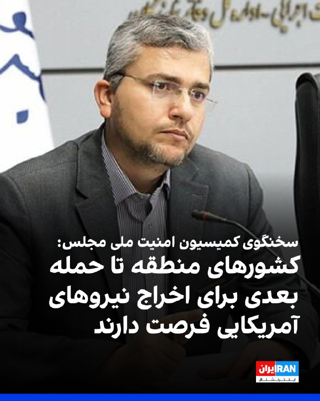

ابراهیم رضایی، سخنگوی کمیسیون امنیت ملی مجلس، گفت کشورهای منطقه به همان اندازه مهلتی که ترامپ برای حمله بعدی تعیین کرده، فرصت دارند نیروهای آمریکایی را به‌طور دائم اخراج کنند و بعدا گلایه‌ای نداشته باشند.

رضایی افزود برنامه جمهوری اسلامی برای «ورشکستگی سیاسی و اقتصادی» ترامپ، از مسیر برخی کشورهای منطقه دنبال می‌شود.
‌🏁 🇬🇧 IranintlTV

🤖 @VahidOOnLine

## VahidOOnLine — post 241170

  <a href="telegram/content/VahidOOnLine_241170_1779293578.mp4" target="_blank">🎬 Download video</a>

⭕️ نخست‌وزیر هند و بازی با کلمات؛
مودی به ملونی، شیرینی «ملودی» داد

♦️نارندرا مودی، نخست‌وزیر هند، در جریان سفر رسمی خود به ایتالیا با جورجیا ملونی، نخست‌وزیر این کشور، در مجموعه تاریخی «ویلا دوریا پامفیلی» در رم دیدار و گفتگو کرد، دیداری که علاوه بر مباحث سیاسی و اقتصادی، با لحظه‌ای صمیمی و شوخی جالب مودی نیز همراه شد.
در جریان این دیدار، مودی بسته‌ای از شیرینی هندی «ملودی» (تافی، نرم‌نبات) را به جورجیا ملونی هدیه داد و با اشاره به شباهت نام این شیرینی با نام خانوادگی نخست‌وزیر ایتالیا، با او شوخی کرد.
نخست‌وزیر ایتالیا نیز ویدیوی این لحظه را در شبکه‌های اجتماعی منتشر کرد و از هدیه مودی قدردانی کرد.
این سفر، نخستین سفر رسمی یک نخست‌وزیر هند به ایتالیا طی ۲۶ سال گذشته با هدف دیدار دوجانبه رهبران دو کشور محسوب می‌شود.
گسترش همکاری‌های اقتصادی، فناوری، انرژی و امنیتی از مهم‌ترین محورهای گفتگو میان رم و دهلی‌نو عنوان شده است.
مودی در پایان تور اروپایی خود به ایتالیا سفر کرده و پیش از این نیز برای نشست گروه ۲۰ در سال ۲۰۲۱ و اجلاس گروه ۷ در سال ۲۰۲۴ به این کشور رفته بود.
‌🇸🇦 Indypersian

🤖 @VahidOOnLine

## VahidOOnLine — post 241169

  <a href="telegram/content/VahidOOnLine_241169_1779293580.mp4" target="_blank">🎬 Download video</a>

‌
الجزیره به نقل از «منابع دیپلماتیک» گزارش داد شمار کشورهای حامی پیش‌نویس قطعنامه درباره تنگه هرمز به ۱۳۶ کشور رسیده است.

پیش‌نویس این قطعنامه از جمهوری اسلامی می‌خواهد حملات و مین‌گذاری در تنگه هرمز را متوقف کند، اما دیپلمات‌ها می‌گویند در صورت مطرح شدن برای رأی‌گیری، احتمالاً با وتوی چین و روسیه روبه‌رو خواهد شد.

چین و روسیه ماه گذشته نیز قطعنامه مشابهی را که با حمایت آمریکا ارائه شده بود، وتو کرده بودند و آن را جانبدارانه علیه جمهوری اسلامی دانستند.
‌🏁 🇬🇧 ManotoTV

🤖 @VahidOOnLine

## VahidOOnLine — post 241168

  

♦️اسماعیل بقایی، سخنگوی وزارت امور خارجه جمهوری اسلامی، روز چهارشنبه ۳۰ اردیبهشت در گفتگو با روزنامه برزیلی «فولیا د سائوپائولو» اعلام کرد که مذاکرات میان تهران و واشنگتن «از طریق میانجی‌های پاکستانی همچنان ادامه دارد».

به گزارش ایرنا، بقایی در خصوص مواضع تهران تاکید کرد: «آنچه ما می‌خواهیم در اصل یک تقاضا نیست، بلکه حق ماست.»

سخنگوی وزارت امور خارجه تصریح کرد که این مطالبات شامل لغو تحریم‌های ایالات متحده علیه ایران می‌شود و این موضوع «بخشی از حقوق ما» به شمار می‌رود.
‌🇸🇦 Indypersian

🤖 @VahidOOnLine

## VahidOOnLine — post 241167

  

فیصل بن فرحان، وزیر خارجه عربستان سعودی، نوشت ریاض از تصمیم رییس‌جمهوری آمریکا برای دادن فرصت دوباره به مذاکرات با جمهوری اسلامی به‌منظور دستیابی به توافقی که به پایان جنگ و بازگشت امنیت و آزادی کشتیرانی در تنگه هرمز به وضعیت پیش از ۹ اسفند ۱۴۰۴ منجر شود، قدردانی می‌کند.

او همچنین از تلاش‌های مستمر پاکستان برای میانجی‌گری در این زمینه تقدیر کرد و در شبکه ایکس نوشت عربستان سعودی امیدوار است جمهوری اسلامی از این فرصت برای جلوگیری از «پیامدهای خطرناک تشدید تنش» استفاده کرده و فورا به تلاش‌ها برای پیشبرد مذاکرات پاسخ دهد.

وزیر خارجه عربستان سعودی افزود هدف از این تلاش‌ها، دستیابی به توافقی جامع است که صلح پایدار در منطقه و جهان را محقق کند.
‌🏁 🇬🇧 IranintlTV

🤖 @VahidOOnLine

## VahidOOnLine — post 241166

  

بر اساس گزارش‌های رسیده به ایران‌اینترنشنال، مهدی مهمدی کرتلائی، ۱۶ ساله، در شامگاه ۱۹ دی و هم‌زمان با فراخوان شاهزاده، در محدوده شوشتر و روستای عقیلی در استان خوزستان، با شلیک گلوله جنگی نیروهای حکومتی کشته شد.

بنا بر این گزارش، پیکر او پس از دریافت پول و گرفتن تعهد از خانواده تحویل داده شد و صبح شنبه ۲۰ دی، در شرایط امنیتی و با حضور شمار محدودی از بستگان به خاک سپرده شد
‌🏁 🇬🇧 IranintlTV

🤖 @VahidOOnLine

## VahidOOnLine — post 241165

  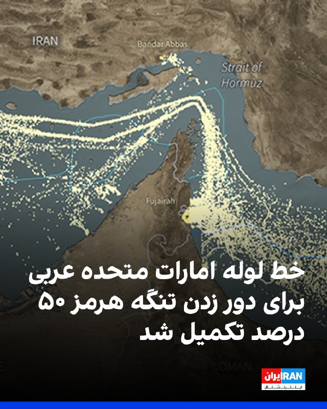

خبرگزاری رویترز گزارش داد سلطان الجابر، مدیرعامل شرکت ملی نفت ابوظبی، اعلام کرد امارات متحده عربی در سال ۲۰۲۵ ساخت خط لوله جدیدی را که برای دور زدن تنگه هرمز طراحی شده، پیش برده و این پروژه اکنون ۵۰ درصد تکمیل شده است.

به گفته الجابر، امارات متحده عربی اجرای این پروژه را برای بهره‌برداری تا سال ۲۰۲۷ تسریع کرده است.

دفتر رسانه‌ای ابوظبی نیز هفته گذشته اعلام کرده بود این خط لوله قرار است ظرفیت صادرات نفت امارات از طریق بندر فجیره را تا سال ۲۰۲۷ دو برابر کند.

الجابر گفت بخش زیادی از انرژی جهان همچنان از چند گلوگاه محدود عبور می‌کند و امارات به همین دلیل بیش از یک دهه پیش تصمیم گرفت در زیرساخت‌هایی سرمایه‌گذاری کند که تنگه هرمز را دور می‌زنند.
‌🏁 🇬🇧 IranintlTV

🤖 @VahidOOnLine

## VahidOOnLine — post 241164

  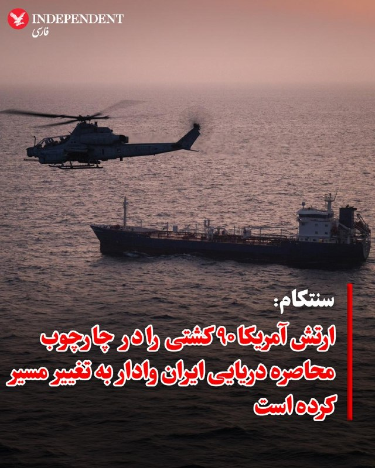

♦️فرماندهی مرکزی ایالات متحده (سنتکام) روز چهارشنبه ۳۰ اردیبهشت در شبکه اجتماعی ایکس اعلام کرد که ارتش آمریکا در جریان اجرای طرح محاصره بنادر ایران، تاکنون مسیر ۹۰ کشتی را تغییر داده است.

سنتکام در ادامه افزود نیروهای آمریکایی «برای تضمین پایبندی به این محاصره»، چهار شناور دیگر را نیز «زمین‌گیر و غیرفعال» کرده‌اند.
‌🇸🇦 Indypersian

🤖 @VahidOOnLine

## VahidOOnLine — post 241163

  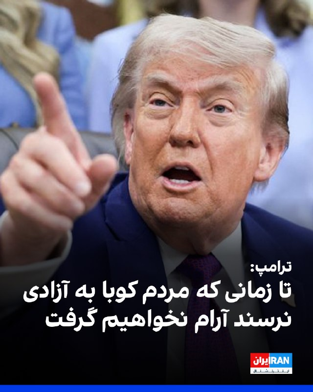

دونالد ترامپ روز چهارشنبه گفت آمریکا «تحمل نخواهد کرد که یک دولت یاغی میزبان عملیات نظامی، اطلاعاتی و تروریستی خصمانه خارجی تنها در فاصله ۹۰ مایلی از خاک آمریکا باشد.»

او افزود واشینگتن تا زمانی که مردم کوبا دوباره آزادی داشته باشند آرام نخواهد گرفت.
‌🏁 🇬🇧 IranintlTV

🤖 @VahidOOnLine

## VahidOOnLine — post 241162

  <a href="telegram/content/VahidOOnLine_241162_1779293586.mp4" target="_blank">🎬 Download video</a>

♦️چین و روسیه روز چهارشنبه ۳۰ اردیبهشت با امضای چندین توافق‌نامه راهبردی در پکن، بر گسترش اتحاد و هماهنگی سیاسی خود تاکید کردند؛ اقدامی که همزمان با هشدار شی جین‌پینگ درباره بازگشت جهان به «قانون جنگل» انجام شد.
رئیس‌جمهوری چین در مراسم امضای اسناد همکاری مشترک با ولادیمیر پوتین اعلام کرد که جهان امروز با افزایش یک‌جانبه‌گرایی و سلطه‌طلبی روبه‌رو است و خطر بازگشت به «قانون جنگل» بیش از گذشته احساس می‌شود.
او همچنین تاکید کرد چین و روسیه به‌عنوان دو عضو دائم شورای امنیت سازمان ملل باید در برابر «زورگویی یک‌جانبه» بایستند و برای ایجاد نظام جهانی «عادلانه‌تر و برابرتر» همکاری کنند.
رئیس‌جمهوری چین در ادامه، مخالفت خود را با اقداماتی که به گفته او «دستاوردهای پیروزی در جنگ جهانی دوم را انکار می‌کند» اعلام کرد و هشدار داد که احیای فاشیسم و نظامی‌گری نباید اجازه ظهور دوباره پیدا کند.
در این دیدار، شی و پوتین اسناد متعددی در زمینه همکاری‌های راهبردی، اقتصادی و سیاسی امضا کردند و مقام‌های دو کشور نیز توافق‌نامه‌های جداگانه‌ای را به امضا رساندند.
‌🇸🇦 Indypersian

🤖 @VahidOOnLine

## VahidOOnLine — post 241161

  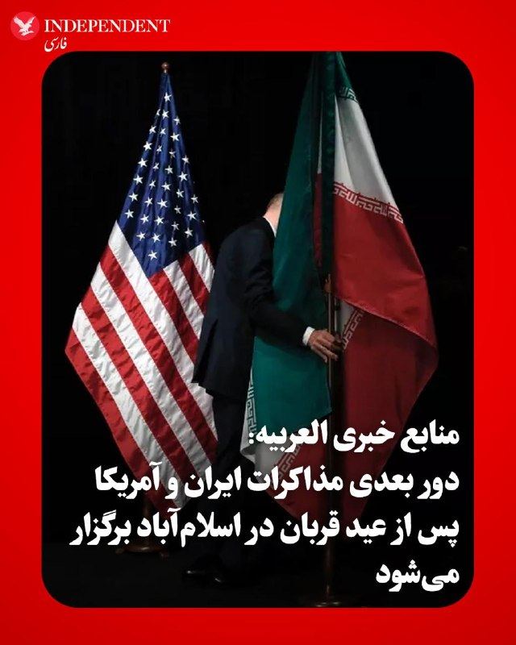

♦️العربیه روز چهارشنبه ۳۰ اردیبهشت، به نقل از منابع خود گزارش داد که تلاش‌های جدی برای نهایی کردن پیش‌نویس توافق میان ایران و آمریکا در جریان است. به گفته این منابع، احتمال دارد فرمانده ارتش پاکستان روز پنجشنبه برای اعلام نهایی شدن این پیش‌نویس به ایران سفر کند. بر اساس این گزارش، دور بعدی مذاکرات میان فرستادگان تهران و واشنگتن نیز پس از عید قربان در اسلام‌آباد برگزار خواهد شد.
‌🇸🇦 Indypersian

🤖 @VahidOOnLine

## VahidOOnLine — post 241160

  <a href="telegram/content/VahidOOnLine_241160_1779293589.mp4" target="_blank">🎬 Download video</a>

فرانسه پس از انتشار ویدیویی از برخورد با فعالان ناوگان امدادی عازم غزه، سفیر اسرائیل را احضار می‌کند. ایتالیا نیز پیش‌تر اقدام مشابهی انجام داده بود.
ژان‌نوئل بارو، وزیر خارجه فرانسه، رفتار ایتامار بن‌گویر، وزیر امنیت ملی اسرائیل از جناح راست افراطی، با فعالان بین‌المللی را «غیرقابل قبول» توصیف کرد و گفت پاریس خواهان توضیح رسمی از اسرائیل است.
این واکنش‌ها پس از انتشار ویدیویی از سوی بن‌گویر مطرح شد که او را در محل نگهداری فعالان «فلوتیلا گلوبال سومود» نشان می‌دهد؛ کاروانی متشکل از ده‌ها قایق و صدها فعال از کشورهای مختلف که چند روز پیش در آب‌های بین‌المللی، حدود ۲۵۰ مایل دریایی از غزه، توسط نیروی دریایی اسرائیل متوقف شد.
اسرائیل این کاروان را «تحریک‌آمیز» و حامی حماس توصیف کرده و فعالان را به بندر اشدود منتقل کرده است.
در ویدیوی منتشرشده، بن‌گویر در حالی که پرچم اسرائیل در دست دارد، مقابل فعالان دست‌بندزده می‌گوید: «به اسرائیل خوش آمدید، ما صاحب‌خانه‌ایم» و آن‌ها را «حامی تروریسم» می‌خواند. او همچنین از بنیامین نتانیاهو خواسته این افراد «برای مدت طولانی» در زندان نگهداری شوند.
این ویدیو در چند ساعت نخست بیش از ۱.۷ میلیون بار دیده شد و موجی از واکنش‌های تند را در اسرائیل و خارج از این کشور به‌دنبال داشت.
برخی مقام‌های اسرائیلی، از جمله گیدئون ساعر، وزیر خارجه اسرائیل، رفتار بن‌گویر را آسیب‌زننده به وجهه اسرائیل دانسته‌اند. دفتر نتانیاهو نیز با دفاع از توقیف ناوگان، اعلام کرده نحوه برخورد بن‌گویر «با ارزش‌ها و هنجارهای اسرائیل همخوانی ندارد» و خواستار اخراج سریع فعالان شده است.
‌🏁 🇬🇧 ManotoTV

🤖 @VahidOOnLine

## VahidOOnLine — post 241159

  <a href="telegram/content/VahidOOnLine_241159_1779293591.mp4" target="_blank">🎬 Download video</a>

ویدیویی که به تازگی به ایران اینترنشنال رسیده نشان می‌دهد خانواده و بستگان جاویدنام پیام رخ‌بخش، جوان معترض کشته‌شده در انقلاب دی‌ماه، در شیراز بر سر مزارش جشن تولد برایش برگزار کردند. پیام رخ‌بخش، ۳۲ ساله و اهل شیراز، ۱۹ دی ۱۴۰۴ با شلیک مستقیم نیروهای سرکوبگر حکومت به پهلو کشته شد.
‌🏁 🇬🇧 IranintlTV

🤖 @VahidOOnLine

## VahidOOnLine — post 241158

  <a href="telegram/content/VahidOOnLine_241158_1779293593.mp4" target="_blank">🎬 Download video</a>

‌
دونالد ترامپ، رئیس‌جمهوری آمریکا، با اشاره به وضعیت داخلی ایران گفت مطمئن نیست مقام‌های جمهوری اسلامی «خیر و صلاح مردم» را بخواهند.

ترامپ گفت: «بعضی از کارهایی که با من می‌کنند نشان می‌دهد که خیر مردم را نمی‌خواهند، در حالی که باید خیر مردم را بخواهند.»

او همچنین از افزایش نارضایتی عمومی در ایران سخن گفت و افزود: «الان خشم زیادی در ایران وجود دارد، چون مردم در شرایط بسیار بدی زندگی می‌کنند.»

رئیس‌جمهوری آمریکا همچنین گفت در ایران «ناآرامی و التهاب زیادی» وجود دارد که به گفته او، مشابه آن پیش‌تر دیده نشده است.
‌🏁 🇬🇧 ManotoTV

🤖 @VahidOOnLine

## VahidOOnLine — post 241157

  <a href="telegram/content/VahidOOnLine_241157_1779293595.mp4" target="_blank">🎬 Download video</a>

دونالد ترامپ، رئیس‌جمهوری آمریکا، پیش از ترک واشنگتن به مقصد کانتیکت، در گفتگو با خبرنگاران در فرودگاه به تشریح وضعیت تقابل با ایران و گزینه‌های روی میز پرداخت. او با اشاره به وضعیت داخلی ایران مدعی شد: «در حال حاضر خشم زیادی در ایران وجود دارد، زیرا مردم در شرایط بسیار بدی زندگی می‌کنند. ناآرامی و تلاطمی در آنجا جریان دارد که قبلا نظیرش را ندیده‌ایم؛ باید دید چه پیش می‌آید.»

ترامپ در پاسخ به سوال خبرنگار درباره احتمال انجام یک «توافق محدود برای تمدید آتش‌بس» گفت: «ما این شانس را امتحان می‌کنیم. من عجله‌ای ندارم؛ هرچند موضوع انتخابات میان‌دوره‌ای مطرح است، اما در حالت ایده‌آل ترجیح می‌دهم به جای افراد زیاد، آدم‌های کمتری کشته شوند.»

رئیس‌جمهوری آمریکا همچنین با ابراز تردید درباره نیت مقامات تهران گفت: «من متعجبم که آیا آن‌ها واقعا خیر و صلاح مردم خود را می‌خواهند یا خیر؛ رفتار آن‌ها نشان می‌دهد که به فکر مردم نیستند، در حالی که باید خیر و صلاح کل منطقه را در نظر بگیرند.»
‌🇸🇦 Indypersian

🤖 @VahidOOnLine

## VahidOOnLine — post 241156

  <a href="telegram/content/VahidOOnLine_241156_1779293598.mp4" target="_blank">🎬 Download video</a>

محمدباقر قالیباف، رئیس مجلس شورای اسلامی، در آنچه رسانه‌های حکومتی «سومین فایل صوتی» توصیف کرده‌اند از جمله گفته «تحرکات آشکار و پنهان دشمن نشان می‌دهد که طرف مقابل به‌دنبال آغاز دور جدیدی از جنگ است.»
‌🏁 🇬🇧 ManotoTV

🤖 @VahidOOnLine

## WithYashar — post 11765

  <a href="telegram/content/WithYashar_11765_1779293599.mp4" target="_blank">🎬 Download video</a>

ترامپ برای هزارمین باز: همه چیز از بین رفته تو ایران
تنها سوال من اینه که آیا ما میریم و کار رو تمام می‌کنیم؟ ، یا اونا قراره سندیو امضا کنن؟ خواهیم دید چه خواهد شد
@withyashar

## WithYashar — post 11764

## WithYashar — post 11763

  <a href="telegram/content/WithYashar_11763_1779293601.mp4" target="_blank">🎬 Download video</a>

🎬 Video

## WithYashar — post 11762

  <a href="telegram/content/WithYashar_11762_1779293603.mp4" target="_blank">🎬 Download video</a>

پوتین پکن رو ترک کرد

@withyashar

## WithYashar — post 11761

طبق ادعای تایید نشده رسانه الحدث: احتمالاً توافق تهران و واشنگتن برای شکل دادن دور دیگه‌ای از مذاکرات، طی ساعات آینده نهایی می‌شه. این مذاکرات احتمالاً پس از پایان حج تو اسلام‌آباد برگزار می‌شه.
@withyashar

## WithYashar — post 11760

دونالد ترامپ دربارهٔ خودش:

شما در نهایت خواهید گفت: او بزرگ‌ترین رئیس‌جمهوری بود که تاکنون زندگی کرده است.
@withyashar

## WithYashar — post 11759

ترامپ درباره ایران: الان خشم زیادی در ایران وجود دارد، چون مردم در شرایط بسیار بدی زندگی می‌کنند.

التهاب و ناآرامی زیادی به‌وجود آمده که تا این حد قبلاً ندیده بودیم.
@withyashar

## WithYashar — post 11758

خبرنگار: درباره جنگ ایران چی میگید؟

ترامپ: بذار اینجوری بگم، شما تو ویتنام 19 سال توی جنگ بودید، جنگ جهانی دوم 4 سال بودید؛ من 3 ماهه تو ایران درگیرم، خیلیاش هم آتش‌بس بوده. تو دوتا جنگ، ونزوئلا و اینجا، ما 13 نفر از دست دادیم، تو جنگ‌های دیگه صدها هزار نفر کشته دادید. ما عملاً ونزوئلا رو گرفتیم تقریباً هم ایران رو هم گرفتیم.
@withyashar

## WithYashar — post 11757

دونالد ترامپ دربارهٔ ایران:
من هیچ عجله‌ای ندارم. همه می‌گویند: «انتخابات میان‌دوره‌ای.» من هیچ عجله‌ای ندارم.
@withyashar

## WithYashar — post 11756

خبرنگار: «آیا شما و بنیامین نتانیاهو دربارهٔ ایران هم‌نظر هستید؟»

دونالد ترامپ: «بله.»

«بی بی نتانیاهو پسر خیلی خوبی است»

@withyashar 😃🤣

## WithYashar — post 11755

  <a href="telegram/content/WithYashar_11755_1779293605.mp4" target="_blank">🎬 Download video</a>

ترامپ : الان میزان محبوبیت من در اسرائیل ۹۹ درصد است. من می‌توانم برای نخست‌وزیری نامزد شوم؛ شاید بعد از اینکه این کار را انجام دادم، به اسرائیل بروم و برای نخست‌وزیری نامزد شوم.
@withyashar

## WithYashar — post 11753

  <a href="telegram/content/WithYashar_11753_1779293607.mp4" target="_blank">🎬 Download video</a>

بازم تکرار میکنم نفرستید این ویدیو ها فیک هستند !!!
@withyashar
جدا از جعلی بودن روسیه الان برف ‌نیسن !
علی گدام مارکت بورو نیست یه عمری خودش خودشو نشسته ! حمام هم کس دیگه لیف زده ! 😂

## WithYashar — post 11752

قالیباف: آمریکا دوباره در جنگی بی‌پایان که در آن امکان پیروزی ندارد گیر خواهد افتاد
@withyashar

## WithYashar — post 11751

  <a href="telegram/content/WithYashar_11751_1779293609.mp4" target="_blank">🎬 Download video</a>

تنها فیلم موجود از جعفر شفیع زاده

«در پشت پرده های انقلاب» عنوان کتاب خاطرات جعفر شفيع زاد، بچه قصاب قهدری‌جانی است که نخستین بار در سال ۲۰۰۰ در آلمان منتشر شد.

او یکی از اعضای بادی گارد خمينی بود که در سال ۵۶ در سوريه بدستور قطب زاده؛ ابراهيم يزدی؛ بنی صدر و.... دوره آموزش نظامی مخصوص و چريکی گذرانده و از زندان اصفهان و روستای قهدريجان به فرانسه و دمشق و ليبی (طرابلس) فرستاده میشود.

برای اندکی ممکن است که سبک نگارش خاطرات شفیع زاده در کتاب «در پشت پرده های انقلاب» به صورت مستند نباشد و یا اینکه اسم افراد و یا مکانها بنا بر ملاحظاتی با آنچه که واقعا اتفاق افتاده باشد دقیقا همخوانی نداشته باشد. اما تجربیات، مدارک موجود و اطلاعاتی که بعد از انتشار این کتاب به دست آمد نشان داد که همه مطالب بیان شده در این کتاب بخصوص دخالت کشورها در به پایان رساندن انقلاب ۵۷ و دستنشاندگی محافل اسلامی و رایطه شخص خمینی، کاملا واقعی است.
@withyashar

## WithYashar — post 11750

  

poshte-pardehaye-enghelab (@withyashar).pdf

## mwarmonitor — post 9357

🔴دموکرات‌های مجلس نمایندگان آمریکا از مارکو روبیو، وزیر امور خارجه، خواسته‌اند راهبرد پشت آنچه «شکاف‌های بی‌سابقه» در کمک‌های اروپایی می‌نامند را توضیح دهد. آن‌ها هشدار داده‌اند که تعطیل شدن آژانس توسعه بین‌المللی آمریکا (USAID) و اخراج‌های گسترده، متحدان آسیب‌پذیر را در برابر نفوذ روسیه بی‌دفاع گذاشته است.

@mwarmonitor

## mwarmonitor — post 9356

  

🇫🇷ناو هواپیمابر فرانسوی Charles de Gaulle (R91) در حال حاضر در جنوب عمان، در دریای عرب در حال حرکت است؛ این ناو چند روز پیش از خلیج عدن عبور کرده است.

@mwarmonitor

## mwarmonitor — post 9355

## mwarmonitor — post 9354

🔴 منابع دیپلماتیک به الجزیره: تعداد کشورهایی که از پیش‌نویس قطعنامه مربوط به تنگه هرمز در شورای امنیت حمایت می‌کنند به ۱۳۶ کشور رسیده است.

@mwarmonitor

## mwarmonitor — post 9353

  

🇺🇸✈️نیروی هوایی ایالات متحده (USAF) – فرماندهی عملیات ویژه نیروی هوایی (AFSOC)

✈️دورنیه C-146A وولف‌هاوند ۱ فروند
AE68BF 16-3020 – BEAGLE 99

📌شناسهBEAGLE 99 پس از چند ماه دوری، در حال بازگشت به پایگاه RAF میلدنهال است.

@mwarmonitor

## mwarmonitor — post 9352

‼️منبع این خبر مربوط به «توافق احتمالی» که برخی رسانه‌ها مانند العربیه، ایران اینترنشنال منتشر شده توسط کانال‌های تلگرامی و واتساپی مرتبط با پاکستان بازنشر شده، تاکنون از سوی منابع رسمی پاکستان تأیید نشده است. بنابراین در حال حاضر در حد شایعه و گمانه‌زنی است و زمان صحت یا عدم صحت آن را مشخص خواهد کرد.

@mwarmonitor

## mwarmonitor — post 9351

🇺🇸 ترامپ درباره کوبا: آمریکا تحمل یک دولت یاغی را نخواهد داشت که عملیات نظامی، اطلاعاتی و تروریستی خارجیِ خصمانه را تنها در فاصله نود مایلی از ما انجام می‌دهد.

@mwarmonitor

## mwarmonitor — post 9350

  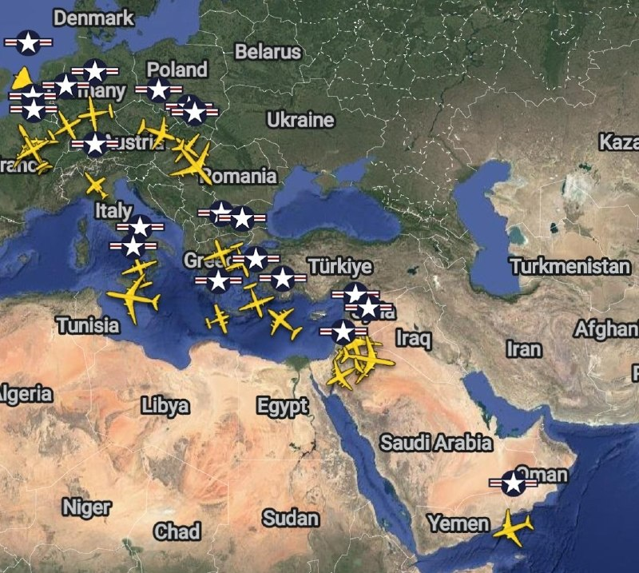

✈️🇺🇸تحرکات سنگین نظامی آمریکا به سمت خاورمیانه همچنان ادامه دارد.

@mwarmonitor

## mwarmonitor — post 9349

  <a href="telegram/content/mwarmonitor_9349_1779293614.mp4" target="_blank">🎬 Download video</a>

🔹خبرنگار: آیا این موضوع بیشتر از اون چیزی که انتظار داشتید طول کشیده که بخواهید با ایران به توافق برسید؟
🔸دونالد ترامپ: خب، بذار این‌طوری بهش نگاه کنیم؛ شما ۱۹ سال در ویتنام بودید، درسته؟ شما ۱۰ سال در افغانستان و این جاهای دیگه بودید. شما در عراق بودید؛ چقدر در عراق بودید؟ ۱۲ سال؟ ۱۲ سال. شما برای ۷ سال در کره بودید. جنگ جهانی دوم متفاوته، اون ۴ سال بود.
من برای ۳ ماهه که وارد شدم، و بخش زیادی از اون هم آتش‌بس بوده، بنابراین... و می‌دونی چیه؟ شما صدها هزار سرباز رو در این جنگ‌های مختلف از دست دادید. در دو جنگ؛ ونزوئلا، که ما هیچ‌کس رو از دست ندادیم، و اینجا، ما ۱۳ نفر رو از دست دادیم.
حالا، ۱۳ نفر، ۱۳ نفر هم زیاده، اما ما ۱۳ نفر رو از دست دادیم. در جنگ‌های دیگه، شما صدها هزار نفر رو از دست دادید.

@mwarmonitor

## mwarmonitor — post 9348

  <a href="telegram/content/mwarmonitor_9348_1779293616.mp4" target="_blank">🎬 Download video</a>

🔹خبرنگار: درباره ایران، آیا یک توافق محدود، فقط برای یک آتش‌بس طولانی‌تر [ممکنه]؟
🔸دونالد ترامپ: آن‌ها باید تنگه را باز کنند، این کار باید فوراً انجام شود. بنابراین ما به این [موضوع] یک فرصت می‌دهیم. من هیچ عجله‌ای ندارم. می‌دانید، مردم فکر می‌کنند «اوه، انتخابات میان‌دوره‌ای در پیش است، پس او عجله دارد»؛ من هیچ عجله‌ای ندارم. من فقط... از نظر ایده‌آل دوست دارم آدم‌های کمتری کشته شوند تا اینکه تعداد زیادی کشته شوند. ما می‌توانیم این کار را از هر دو طریق انجام دهیم، اما... اما من ترجیح می‌دهم آدم‌های کمتری کشته شوند.
من فقط در این فکرم که آیا آن‌ها خیر و صلاح مردم را می‌خواهند یا نه، چون برخی از کارهایی که دارند انجام می‌دهند به نظر من یعنی آن‌ها خیر و صلاح مردم را نمی‌خواهند، در حالی که باید صلاح مردم را بخواهند.
اممم... در حال حاضر خشم زیادی در ایران وجود دارد چون مردم در وضعیت بسیار بدی زندگی می‌کنند. ناآرامی و تلاطم زیادی وجود دارد که ما قبلاً تا این حد شاهدش نبوده‌ایم. و حالا باید ببینیم چه می‌شود.

@mwarmonitor

## mwarmonitor — post 9347

🇮🇱‏سخنگوی ارتش اسرائیل:

🔸رئیس ستاد کل ارتش اسرائیل خطاب به فرماندهان لشکرها: «در تمامی جبهه‌ها آماده هستیم و در مناطق دفاعی خط مقدم مستقر شده‌ایم، تهدیدها را خنثی کرده و با ابتکار، پایداری و قاطعیت واقعیت را شکل می‌دهیم. دستاوردهای ارتش اسرائیل حاصل نبرد و فداکاری بی‌سابقه شما فرماندهان و رزمندگان در نیروهای وظیفه و ذخیره است. در این لحظات، ارتش اسرائیل در بالاترین سطح آماده‌باش قرار دارد و برای هر تحولی آماده است. در کنار نبرد شدید و مستمر، باید سطح بالایی از ارزش‌ها، حرفه‌ای‌گری و انضباط عملیاتی را حفظ کنیم؛ این‌ها شرط آمادگی رزمی و انسجام ارتش اسرائیل است.»

رئیس ستاد کل ارتش اسرائیل، سپهبد ایال زامیر، امروز (چهارشنبه) با تمامی فرماندهان لشکرها گفت‌وگو کرد.

در این گفت‌وگو، رئیس ستاد کل ارتش اسرائیل ارزیابی وضعیت عملیاتی را با فرماندهان انجام داد و به چالش‌های عملیاتی در تمامی جبهه‌ها، میزان آمادگی نیروها و ادامه نبرد در جبهه‌های مختلف پرداخت.

بخشی از سخنان رئیس ستاد کل ارتش اسرائیل، سپهبد ایال زامیر: «شما نسل منحصربه‌فردی از فرماندهان لشکر در تاریخ ارتش اسرائیل و کشور اسرائیل هستید. اقدامات شما در دو سال و نیم گذشته در کتاب‌های تاریخ ثبت خواهد شد. توانمندی ارتش، حفظ ارزش‌ها و دستاوردهای عملیاتی آن—در دستان شماست.

در تمامی جبهه‌های نبرد در مرزها، ما آماده هستیم و در مناطق دفاع پیشرو مستقر شده‌ایم، تهدیدها را خنثی کرده و با ابتکار، پایداری و قاطعیت واقعیت را شکل می‌دهیم. دستاوردهای ارتش اسرائیل نتیجه نبرد و فداکاری بی‌سابقه شما فرماندهان و رزمندگان در نیروهای وظیفه و ذخیره است.

در این لحظات، ارتش اسرائیل در بالاترین سطح آماده‌باش قرار دارد و برای هر تحول احتمالی آماده است. در کنار نبرد شدید و مداوم، باید سطح بالایی از ارزش‌ها، حرفه‌ای‌گری و انضباط عملیاتی را حفظ کنیم. این‌ها شروط آمادگی رزمی و انسجام ارتش اسرائیل هستند.

در هر جبهه، ما تهدیدها را برطرف کرده و در درجه نخست برای تعمیق ضربه به دشمن و حفظ امنیت شهروندان و نیروهای خود عمل می‌کنیم.

به‌عنوان رئیس ستاد کل ارتش اسرائیل، تمامی جبهه‌ها را مدنظر دارم—ما به‌طور نظام‌مند، قدرتمند و مبتنی بر برنامه، به ایران و کل محور ضربه زده و آن را تضعیف کرده‌ایم. به نبرد در جبهه‌های نزدیک و دور به هر میزان که لازم باشد ادامه خواهیم داد. برای انجام تمامی مأموریت‌ها و کاهش بار غیرقابل‌تصور بر نیروهای ذخیره، نیازمند گسترش دایره خدمت‌کنندگان هستیم؛ این یک موضوع اساسی و حیاتی برای توان عملیاتی ارتش اسرائیل است.

🔹در این میان، شما فرماندهان لشکرها کار فوق‌العاده‌ای انجام می‌دهید؛ این فقط در نتایج میدانی نیست، بلکه در توانایی هدایت نیروها، پرورش آن‌ها و در نهایت—پیروزی است.»

@mwarmonitor

## mwarmonitor — post 9346

🔸ترامپ می‌گوید او دیدار پوتین با شی جین‌پینگ در چین را تماشا کرده و مدعی است که خودش استقبال باشکوه‌تری دریافت کرده است.

🔹«نمی‌دانم مراسم آن‌ها به اندازه مراسم من درخشان بود یا نه. من دیدم، فکر می‌کنم ما از آن‌ها بهتر بودیم. فکر می‌کنم ما از آن‌ها بهتر بودیم.»

@mwarmonitor

## mwarmonitor — post 9345

🇸🇦وزیر خارجه عربستان سعودی:

🔸پادشاهی عربستان سعودی از تصمیم رئیس‌جمهور آمریکا، دونالد ترامپ، برای دادن فرصت به دیپلماسی جهت دستیابی به یک توافق قابل‌قبول برای پایان دادن به جنگ، و بازگرداندن امنیت و آزادی کشتیرانی در تنگه هرمز به وضعیت پیش از ۲۸ فوریه ۲۰۲۶، و نیز رسیدگی به تمامی نقاط اختلاف به شکلی که در خدمت امنیت و ثبات منطقه باشد، به‌طور بسیار مثبت قدردانی می‌کند.

🔸همچنین عربستان سعودی از تلاش‌های میانجی‌گرانه جاری پاکستان در این زمینه نیز قدردانی می‌کند. عربستان امیدوار است ایران از این فرصت استفاده کند تا از پیامدهای خطرناک تشدید تنش‌ها جلوگیری کرده و به‌طور فوری به تلاش‌ها برای پیشبرد مذاکراتی که به یک توافق جامع برای دستیابی به صلح پایدار در منطقه و جهان منجر می‌شود، پاسخ دهد.

@mwarmonitor

## mwarmonitor — post 9344

🔴ترامپ می‌گوید نخست‌وزیر اسرائیل، نتانیاهو، درباره ایران «هر کاری که من بخواهم انجام خواهد داد».

@mwarmonitor

## FoxNewsTwitter — post 341999

  <a href="telegram/content/FoxNewsTwitter_341999_1779293619.mp4" target="_blank">🎬 Download video</a>

Fox News (Twitter/X)

NOW: President Trump kicks off his historic commencement speech at the Coast Guard Academy by congratulating the class of 2026.

"It's a true honor to be here and this magnificent day and one of the most prestigious military academies anywhere in the world."

"I'm thrilled to become the first president to ever give a second keynote address to this storied institution. I am very proud of that honor. We'll have to try it a third time."

## FoxNewsTwitter — post 341998

  <a href="telegram/content/FoxNewsTwitter_341998_1779293621.mp4" target="_blank">🎬 Download video</a>

Fox News (Twitter/X)

NOW: President Trump receives a grand entrance at the U.S. Coast Guard Academy in New London ahead of delivering the commencement address.

## FoxNewsTwitter — post 341997

  <a href="telegram/content/FoxNewsTwitter_341997_1779293623.mp4" target="_blank">🎬 Download video</a>

Fox News (Twitter/X)

Rep. Ilhan Omar stays silent when pressed about her alleged ties to Minnesota’s massive fraud scandal.

Fox News Digital repeatedly asked Omar about individuals connected to the “Feeding Our Future” case and whether she had concerns about fraud tied to pandemic-era programs in her state.

She refused to answer and walked away without responding.

The scandal — described by federal prosecutors as one of the largest COVID fraud schemes in the country — allegedly involved hundreds of millions in taxpayer money meant to feed children.

In a statement Rep. Omar wrote, “Any claim that I had knowledge of this scheme is flat-out false. The MEALS Act was signed into law by President Trump and passed with bipartisan support as part of a broader legislative package.”

## FoxNewsTwitter — post 341996

  

Fox News (Twitter/X)

WATCH LIVE: Trump delivers the commencement address at the US Coast Guard Academy
https://twitter.com/i/broadcasts/1mxPaLyqEzdKN

## FoxNewsTwitter — post 341995

  <a href="telegram/content/FoxNewsTwitter_341995_1779293627.mp4" target="_blank">🎬 Download video</a>

Fox News (Twitter/X)

JUST NOW: President Trump arrives at Groton–New London Airport as he prepares to give the commencement speech at this year's United States Coast Guard Academy graduation.

## FoxNewsTwitter — post 341994

  <a href="telegram/content/FoxNewsTwitter_341994_1779293630.mp4" target="_blank">🎬 Download video</a>

Fox News (Twitter/X)

BREAKING: Jim Jordan outlines the case against the Southern Poverty Law Center following a bombshell federal indictment charging the group with fraud and money laundering.

“He was part of the planning group for the Charlottesville rally. He was paid to coordinate transportation. He was paid to attend the event.”

“After the event, where a young lady is killed, the Southern Poverty Law Center almost tripled their income. It all worked.”

"Turned out for them creating hate was more profitable than fighting it.”

## FoxNewsTwitter — post 341993

  <a href="telegram/content/FoxNewsTwitter_341993_1779293632.mp4" target="_blank">🎬 Download video</a>

Fox News (Twitter/X)

NOW: President Trump boards Air Force One en route to Connecticut, where he will deliver remarks at the U.S. Coast Guard Academy graduation ceremony.

## FoxNewsTwitter — post 341992

Fox News (Twitter/X)

BREAKING: Iran’s Revolutionary Guard warns that if the U.S. and Israel resume attacks on Tehran, the conflict would spread “beyond the region” and bring “crushing blows” in unexpected places.

This comes after President Trump announced that the United States could end the conflict “very quickly” and claimed Iran was eager to negotiate.

## FoxNewsTwitter — post 341991

‌Fox News (Twitter/X)

https://www.foxnews.com/politics/fmr-dem-rep-barney-frank-sharp-tongued-liberal-trailblazer-dodd-frank-co-author-dies

## FoxNewsTwitter — post 341990

  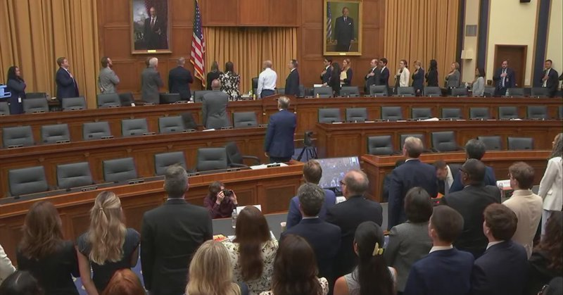

Fox News (Twitter/X)

WATCH LIVE: House Judiciary hearing on the Southern Poverty Law Center https://twitter.com/i/broadcasts/1rGmqoPmNLBGy

## FoxNewsTwitter — post 341989

  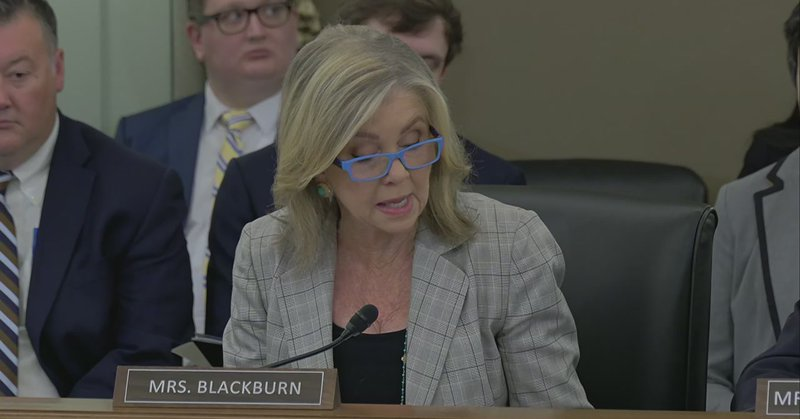

Fox News (Twitter/X)

WATCH LIVE: Senate hearing examining sports betting in America. https://twitter.com/i/broadcasts/1qxoNeomOpEJv

## FoxNewsTwitter — post 341988

  <a href="telegram/content/FoxNewsTwitter_341988_1779293636.mp4" target="_blank">🎬 Download video</a>

Fox News (Twitter/X)

BREAKING: President Trump comes out in support of former reality TV star Spencer Pratt’s and his political rise in the race to be the next mayor of Los Angeles.

When asked if he sees any similarities between himself and the fellow reality-television-star-turned-politician, Trump noted Pratt's unique personality and popular appeal.

"Oh, I'd like to see him do well... He's a character."

## FoxNewsTwitter — post 341987

Fox News (Twitter/X)

BREAKING: Former Rep. Barney Frank, D-Mass., coauthor of sweeping Dodd-Frank Act after 2008 financial crisis, dead at 86

## FoxNewsTwitter — post 341986

  <a href="telegram/content/FoxNewsTwitter_341986_1779293638.mp4" target="_blank">🎬 Download video</a>

Fox News (Twitter/X)

NEW: President Trump celebrates a clean sweep in last night's primary races while taking aim at Democrat James Talarico's Senate campaign in Texas:

"We won all races last night. Every one of them."

"I believe the Texas candidate who's Ken Paxton, I think he'll win... I think he'll go on to defeat a very defective candidate, a candidate that believes in six genders. And he takes hits at Jesus Christ and he's wearing a mask six months ago. Anyone wearing a mask six months ago doesn't get it."

"And he's a vegan. He's a vegan in Texas. And you can't get elected as a vegan in Texas."

## FoxNewsTwitter — post 341985

  <a href="telegram/content/FoxNewsTwitter_341985_1779293641.mp4" target="_blank">🎬 Download video</a>

Fox News (Twitter/X)

President Trump isn't choosing favorites when it comes to Vance and Rubio leading the White House press briefings.

REPORTER: "Do you think Vance or Rubio did better in the press briefings?"

PRESIDENT TRUMP: "I think they both did great. What do you want me to say?

"I watched both of them. They're both very good men."

## FoxNewsTwitter — post 341984

  <a href="telegram/content/FoxNewsTwitter_341984_1779293643.mp4" target="_blank">🎬 Download video</a>

Fox News (Twitter/X)

NEW: President Trump jokes that he could run for Prime Minister of Israel after his current term since he's so well-liked there.

"Maybe after I do this I'll go to Israel and run for prime minister. I had a poll this morning, I'm 99%."

## FoxNewsTwitter — post 341983

Fox News (Twitter/X)

NEW: President Trump leaves the White House for Joint Base Andrews, as he heads to New London, Connecticut, where he’ll deliver the commencement address at the U.S. Coast Guard Academy.

## FoxNewsTwitter — post 341982

  <a href="telegram/content/FoxNewsTwitter_341982_1779293645.mp4" target="_blank">🎬 Download video</a>

Fox News (Twitter/X)

NEW: MPD and the FBI are asking the public to help identify the faces behind the viral Chipotle assault in D.C.’s Navy Yard neighborhood.

Authorities say a combined reward of up to $6,000 is now being offered for information leading to arrests and convictions in the case.

## FoxNewsTwitter — post 341981

  <a href="telegram/content/FoxNewsTwitter_341981_1779293648.mp4" target="_blank">🎬 Download video</a>

Fox News (Twitter/X)

“He was the absolute best dad in the world.”

The daughter of Amin Abdullah — the hero security guard killed during the deadly shooting at a San Diego mosque — remembers her father through tears as the community mourns the three men killed in the attack.

Police say Abdullah helped lock down the Islamic Center and confronted the shooters, actions authorities believe saved lives with nearly 140 children inside the building at the time.

Investigators are treating the massacre as a hate crime after officials say the teenage suspects arrived heavily armed and left behind extremist writings.

## pm_afshaa — post 91116

🔥تخفیف ویژه فقط به مدت 2 روز
🔥 
🚀با بالاترین سرعت و کمترین قطعی 
💰هر گیگ فقط و فقط 170 هزار تومان 
⚡️پینگ عالی 
⚡️دارای لینک ساب 
⚡️پشتیبانی 24 ساعته 
⚡️ بدون محدودیت کاربر و زمان و ضریب 
⚡️مخصوص استفاده روزمره، هوش مصنوعی، گیم و ... 
✅جهت خرید با تحویل آنی فقط…

## pm_afshaa — post 91115

  

🔥تخفیف ویژه فقط به مدت 2 روز
🔥

🚀با بالاترین سرعت و کمترین قطعی

💰هر گیگ فقط و فقط 170 هزار تومان

⚡️پینگ عالی

⚡️دارای لینک ساب

⚡️پشتیبانی 24 ساعته

⚡️ بدون محدودیت کاربر و زمان و ضریب

⚡️مخصوص استفاده روزمره، هوش مصنوعی، گیم و ...

✅جهت خرید با تحویل آنی فقط به بات مراجعه کنید

✅ @Lex_Server 
👾 @LexVipBot

## pm_afshaa — post 91114

🔴ترامپ: ما در «مراحل نهایی» مذاکرات با ایران هستیم

شبکه الحدث: احتمالا طی ساعات آینده، متن توافق ایران و آمریکا نهایی میشه؛ دور بعدی مذاکرات هم باز تو پاکستانه.

💧 Rainbet.com the #1 Non-KYC Crypto Casino & Sportsbook @rainbetcom

😁 @Pm_Afshaa

## pm_afshaa — post 91113

سخنگوی وزارت خارجه : ما اورانیوم خودمونو به کسی تحویل نمیدیم و مسئله ی هسته ای ما کاملا صلح آمیزه

💧 Rainbet.com the #1 Non-KYC Crypto Casino & Sportsbook @rainbetcom

😁 @Pm_Afshaa

## pm_afshaa — post 91112

خالیباف:تحرکات آشکار و پنهان «دشمن» نشان می‌دهد که آنها به دنبال دور جدیدی از جنگ هستن

💧 Rainbet.com the #1 Non-KYC Crypto Casino & Sportsbook @rainbetcom

😁 @Pm_Afshaa

## pm_afshaa — post 91111

🔴سفیر آمریکا در سازمان ملل:
پول حکومت ایران رو به اتمام و اقتصادش درحال فروپاشیه

💧 Rainbet.com the #1 Non-KYC Crypto Casino & Sportsbook @rainbetcom

😁 @Pm_Afshaa

## pm_afshaa — post 91110

نسخه کامل گفتگو در نشست آینده تکنولوژی ایران

این نشست روز ۱۶ مه (۲۶ اردیبهشت) در محل دفتر مرکزی شرکت «اوبر» در شهر سان‌فرانسیسکو در ایالت کالیفرنیای آمریکا برگزار شد.

@OfficialRezaPahlavi

## pm_afshaa — post 91109

  <a href="telegram/content/pm_afshaa_91109_1779293651.mp4" target="_blank">🎬 Download video</a>

🎙️خبرنگار: درباره جنگ ایران چی میگید؟

ترامپ: بذار اینجوری بگم، شما تو ویتنام 19 سال توی جنگ بودید، جنگ جهانی دوم 4 سال بودید؛ من 3 ماهه تو ایران درگیرم، خیلیاش هم آتش‌بس بوده. تو دوتا جنگ، ونزوئلا و اینجا، ما 13 نفر از دست دادیم، تو جنگ‌های دیگه صدها هزار نفر کشته دادید. ما عملاً ونزوئلا رو گرفتیم تقریباً هم ایران رو هم گرفتیم.

💧 Rainbet.com the #1 Non-KYC Crypto Casino & Sportsbook @rainbetcom

😁 @Pm_Afshaa

## pm_afshaa — post 91108

  <a href="telegram/content/pm_afshaa_91108_1779293654.webm" target="_blank">🎬 Download video</a>

🔴ترامپ: برای توافق و موضوع تنگه هرمز به این روند فرصت میدیم؛ عجله‌ای ندارم، چون نمیخوام افراد زیادی کشته بشن.

در ایران وضعیت زندگی مردم بده و «خشم و ناآرامی بی‌سابقه‌ای» وجود داره و باید دید در ادامه چه اتفاقی رخ خواهد داد.

💧 Rainbet.com the #1 Non-KYC Crypto Casino & Sportsbook @rainbetcom

😁 @Pm_Afshaa

## pm_afshaa — post 91107

  <a href="telegram/content/pm_afshaa_91107_1779293654.mp4" target="_blank">🎬 Download video</a>

🔴دونالد ترامپ: من عجله‌ای ندارم، همه میگن انتخابات میان‌دوره‌ای و اینا، ولی من برای جنگ اصلاً عجله ندارم.

💧 Rainbet.com the #1 Non-KYC Crypto Casino & Sportsbook @rainbetcom

😁 @Pm_Afshaa

## pm_afshaa — post 91106

  <a href="telegram/content/pm_afshaa_91106_1779293656.mp4" target="_blank">🎬 Download video</a>

🔴ترامپ: الان تو اسرائیل 99 درصد طرفدار دارم و میتونم برای نخست‌وزیری کاندید شم؛ شاید بعد این ماجرا برم اسرائیل واسه نخست‌وزیری. از نتانیاهو هر کاری بخوام درباره ایران انجام میده.

💧 Rainbet.com the #1 Non-KYC Crypto Casino & Sportsbook @rainbetcom

😁 @Pm_Afshaa

## pm_afshaa — post 91105

  <a href="telegram/content/pm_afshaa_91105_1779293658.webm" target="_blank">🎬 Download video</a>

🔴عباس عراقچی: هر جا لازم باشه بجنگیم می‌جنگیم و هر جا لازم باشه مذاکره کنیم مذاکره می‌کنیم.

‌
💧 Rainbet.com the #1 Non-KYC Crypto Casino & Sportsbook @rainbetcom

😁 @Pm_Afshaa

## pm_afshaa — post 91104

  <a href="telegram/content/pm_afshaa_91104_1779293659.webm" target="_blank">🎬 Download video</a>

🔴قالیباف: رئیس جمهور آمریکا بین دو گزینه دچار تردید است اولین گزینه اولویت دادن به پایان جنگ است که هزینه های آن را بعنوان بازنده جنگ بدهد و دومین گزینه شروع مجدد جنگ یا ادامه محاصره دریایی برای فشار و مجبور کردن ایران به پذیرش تسلیم است. واقعیت این است که رصد دقیق شرایط آمریکا این احتمال را تقویت می کند آنها هنوز به تسلیم شدن ملت ایران امیدوار هستند و به غلط فکر می کند که می توانند با تداوم محاصره و فشاراقتصادی از یک طرف و تشدید فشار در میدان نظامی و به راه انداختن دور جدیدی از حملات، ایران را مجاب کنند تا در میدان دیپلماسی به زیاده خواهی های آنان پاسخ مثبت دهد.

💧 Rainbet.com the #1 Non-KYC Crypto Casino & Sportsbook @rainbetcom

😁 @Pm_Afshaa

## pm_afshaa — post 91103

  <a href="telegram/content/pm_afshaa_91103_1779293660.webm" target="_blank">🎬 Download video</a>

🔴نیروی دریایی سپاه: 26 کشتی با هماهنگی نیرودریایی سپاه عبور کردن.

💧 Rainbet.com the #1 Non-KYC Crypto Casino & Sportsbook @rainbetcom

😁 @Pm_Afshaa

## iaghapour — post 2621

⭕️ اعتراف رسمی دولت: ۷۰ درصد مطالبات مردم، رفع محدودیت‌های اینترنت است

معاون اجرایی رئیس‌جمهور صراحتاً اعلام کرد که طبق نظرسنجی‌های نهاد ریاست‌جمهوری، بیش از ۷۰ درصد گلایه‌ها و خواسته‌های مردم به محدودیت‌های اینترنت مربوط می‌شود. او تأکید کرد که سیاست پایدار کشور نباید بر مبنای فیلترینگ باشد.

نکات کلیدی سخنان معاون رئیس‌جمهور درباره وضعیت اینترنت:

🔹 تصمیمات اضطراری باید تمام شوند: محدودیت‌های اخیر به دلیل شرایط خاص امنیتی و جنگی بوده، اما تصمیمات دوران اضطرار نباید دائمی شوند و سیاست پایدار کشور نمی‌تواند بر محدودسازی بنا شود.

🔸 اعتراف به شکست فیلترینگ: تجربه عملی نشان داد محدودیت‌های فراگیر ارتباطی به نتایج مورد انتظار منجر نشده و استفاده گسترده از فیلترشکن‌ها اثربخشی این محدودیت‌ها را از بین برده است.

🔹 حق آگاهی مردم: اعتماد عمومی مهم‌ترین سرمایه است و مردم حق دارند بدانند محدودیت‌ها بر چه مبنایی اعمال می‌شود، چه دامنه‌ای دارد و تا چه زمانی ادامه خواهد داشت.

به گفته قائم‌پناه، کشور به یک تفاهم ملی در حوزه ارتباطات نیاز دارد؛ چرا که آینده ایران متصل و فناورانه است و دسترسی پایدار به اینترنت، پیش‌شرط تحقق این آینده خواهد بود./ زومیت

🆔 @iaghapour

## DEJradio — post 4788

  <a href="telegram/content/DEJradio_4788_1779293660.mp4" target="_blank">🎬 Download video</a>

🔺🎥 حضور سنگین هواپیماهای نظامی آمریکا در فرودگاه بن‌گوریون اسرائیل.

#جنگ #حمله_نظامی
@DEJradio

## DEJradio — post 4787

  <a href="telegram/content/DEJradio_4787_1779293662.webm" target="_blank">🎬 Download video</a>

🚨
🔸 بر اساس گزارش منابع آمریکایی نیروهای سـ.ـپاه و ارتش در برخی مناطق ایران از جمله تهران، تبریز و حومه اهواز در چند منطقه درگیری شدند و به سمت حمل آتش گشودند.

شهرام سبزواری، کارشناس نظامی، در این باره توضیحاتی می‌دهد.

#ارتش #IRGCterrorists
@DEJradio

## DEJradio — post 4786

  <a href="telegram/content/DEJradio_4786_1779293663.mp4" target="_blank">🎬 Download video</a>

🔺📢 اعتراض به تهدید جنسی دختران مدرسه "شرافت" توسط ماموران امنیتی

#مدرسه_شرافت #تهدید_جنسی
@DEJradio

## DEJradio — post 4785

  <a href="telegram/content/DEJradio_4785_1779293665.webm" target="_blank">🎬 Download video</a>

🔺📌 خبرچین‌های نظام؛ کبک‌هایی با سر در برف
#یادداشت: فریبرز کرمی زند

در نهادهای اطلاعاتی جمهوری اسلامی، اعم از وزارت اطلاعات، اطلاعات سپاه، اطلاعات بسیج، حراست ادارات، حفاظت اطلاعات نیروهای مسلح و اطلاعات فراجا، قسمتی تحت عنوان «منابع و مخبرین» وجود دارد در این قسمت، پرونده افرادی نگهداری می‌شود که برای همکاری خبری و اطلاعاتی جذب شده‌اند.
در این پرونده‌ها، مشخصات کامل فردی و شغلی، حوزه فعالیت و محل نفوذ یا همان «نشانگاه» افراد ثبت می‌شود.

هر پرونده شامل بخش‌های مختلفی است، اما دو بخش آن از اهمیت ویژه‌ای برخوردار است: بخش «محصولی» و بخش «مالی» در بخش محصولی، تمامی اخبار، گزارش‌ها و اطلاعاتی که مخبر ارائه داده ثبت می‌شود و در بخش مالی، جزئیات مبالغ پرداخت‌ شده و نوع آن در قبال همان اطلاعات درج می‌گردد. برخی از مخبران در نشانگاه‌های خاص تصور می‌کنند زرنگ هستند و نمی‌خواهند مستقیماً پول نقد دریافت کنند، اما به هر شیوه ای که دریافت کنند جزئیات آن نیز در پرونده ثبت می‌شود.

حتی فرم‌های ملاقات، نحوه ارتباط، شیوه هدایت مخبر توسط افسر هادی و گزارش جلسات نیز در بخش های دیگر پرونده بایگانی می‌شود.

خلاصه اینکه مخبران نظام باید بدانند تمام جزئیات همکاری آن‌ها مو به مو ثبت و نگهداری می‌شود؛ از اخبار و گزارش‌ها گرفته تا محل ملاقات و حتی فاکتور رستورانی که جلسه در آن برگزار شده است این موارد شامل مخبران و آدم‌ فروشان خارج از کشور نیز می‌شود.

#وزارت_اطلاعات #اطلاعاتی #مخبر
@DEJradio

## DEJradio — post 4784

  <a href="telegram/content/DEJradio_4784_1779293665.webm" target="_blank">🎬 Download video</a>

🔺🎤 انتقاد از حضور جمهوری اسلامی در نهادهای حقوق بشری سازمان ملل؛

گفت‌وگو با هیلل نویر، مدیر اجرایی دیده‌بان در سازمان ملل.

#حقوق_بشر #سازمان_ملل
@DEJradio

## DEJradio — post 4783

نسخه کامل گفتگو در نشست آینده تکنولوژی ایران

این نشست روز ۱۶ مه (۲۶ اردیبهشت) در محل دفتر مرکزی شرکت «اوبر» در شهر سان‌فرانسیسکو در ایالت کالیفرنیای آمریکا برگزار شد.

@OfficialRezaPahlavi

## DEJradio — post 4782

⭕️ تظاهرات پاریس در پشتیبانی از شاهزاده و علیه حکومت سرکوبگر اسلامی

شماری از ایرانیان، فرانسوی‌ها و اسرائیلی‌ها در پاریس، در پشتیبانی از شاهزاده رضا پهلوی و همچنین علیه سرکوب و ادامۀ قطعی اینترنت در ایران، تظاهرات کردند.
در این تظاهرات بارها شعارهایی علیه جمهوری اسلامی اسلامی سرداده شد و شرکت‌کنندگان خواستار توقف اعدام‌ها و پشتیبانی بین‌المللی از شاهزاده، برای رهبری دوران گذار شدند.
برگزاری پرفورمنس‌ و اعلام همبستگی مردم ایران و اسرائیل، از دیگر برنامه‌های شرکت‌کنندگان در این تظاهرات بود.

#شاهزاده_رضا_پهلوی #همبستگی #پاریس
@DEJradio

## DEJradio — post 4781

⭕️ اقرار پزشکیان به ناتوانی در در تأمین بنزین و حامل‌های انرژی

مسعود پزشکیان، رئیس‌ دولت جمهوری اسلامی اعلام کرد نظام در تأمین بنزین و برخی حامل‌های انرژی با محدودیت روبه‌رو است.
او خواستار صرفه‌جویی، اصلاح الگوی مصرف و تدوین نظام سهمیه‌بندی استانی شد.
پزشکیان ادعا کرد مردم باید از وضعیت موجود آگاه باشند تا به گفتۀ او «عبور از شرایط کنونی ممکن شود».
علاوه بر آسیب دیدن بخشی از زیرساخت‌های انرژی و انبارهای سوخت، محاصرۀ دریایی توسط آمریکا، واردات بنزین و سایر فرآورده‌های سوختی را مختل کرده است.

#بنزین
@DEJradio

## DEJradio — post 4780

⭕️ وزیر کشور پاکستان برای دومین بار در یک هفته به تهران رفت

رسانه‌های حکومتی در ایران گزارش دادند محسن نقوی، وزیر کشور پاکستان، وارد تهران شده است.
این دومین سفر او به ایران در کمتر از یک هفته است.
خبرگزاری‌های جمهوری اسلامی از جزئیات و اهداف این سفر اظهار بی‌اطلاعی کردند.
این سفر همزمان با ادامۀ مذاکرات تهران و واشینگتن و تهدیدهای تازۀ دونالد ترامپ علیه جمهوری اسلامی انجام می‌شود.
اسلام‌آباد در ماه‌های اخیر میانجی واشینگتن و تهران بوده است.

#مذاکرات #پاکستان
@DEJradio

## DEJradio — post 4779

⭕️ سفیر آمریکا در سازمان ملل: اقتصاد ایران در حال فروپاشی است

مایک والتز، سفیر آمریکا در سازمان ملل گفت منابع مالی جمهوری اسلامی در حال پایان یافتن و اقتصاد ایران در وضعیت فروپاشی است.
او جمهوری اسلامی را متهم کرد که به‌جای حرکت به سمت صلح، همچنان به دنبال برنامۀ هسته‌ای و حمله به زیرساخت‌های غیرنظامی است.
اسکات بسنت، وزیر خزانه‌داری آمریکا نیز گفت واشینگتن ده‌ها میلیارد دلار از درآمدهای نفتی جمهوری اسلامی را مختل کرده است.

#فروپاشی #فشار_حداکثری
@DEJradio

## DEJradio — post 4778

⭕️ آمار ازدواج در ایران طی ۱۵ سال نصف شد

مرضیه وحید دستجردی، دبیر ستاد ملی جمعیت گفت میزان ازدواج در ایران نسبت به سال ۱۳۸۹ حدودا پنجاه درصد کاهش یافته است.
او اعلام کرد شمار ازدواج‌ها از حدود ۸۹۱ هزار مورد در سال ۱۳۸۹ به حدود ۴۳۱ هزار مورد در سال ۱۴۰۴ رسید.
دستجردی همچنین کاهش تولدها را «زنگ خطر جدی» برای آیندۀ ایران توصیف کرد. او گفت اشتغال، مسکن و امید اجتماعی، نقشی اساسی در فرزندآوری دارند.

#جمعیت #فرزندآوری
@DEJradio

## DEJradio — post 4777

⭕️ وکیل نوکیشان مسیحی در شیراز بازداشت شد

بنا بر گزارش‌ها بهار صحرائیان، وکیل دادگستری و فعال حقوق بشر، در شیراز بازداشت شده است.
سازمان «مادۀ ۱۸» اعلام کرد خانم صحرائیان با اتهام‌هایی از جمله «اجتماع و تبانی علیه امنیت ملی»، «فعالیت تبلیغی علیه نظام» و «نشر اکاذیب» روبه‌رو شده است.
بهار صحرائیان وکالت شماری از نوکیشان مسیحی را برعهده داشت و پیش‌تر نیز در بازداشت بوده است.

#وکیل #نوکیشان #شیراز
@DEJradio

## DEJradio — post 4776

⭕️ کایا کالاس: اجرای تحریم‌های سپاه در اروپا یکدست نیست

کایا کالاس، مسئول سیاست خارجی اتحادیۀ اروپا گفت چگونگی اجرای تحریم سپاه، بر عهدۀ کشورهای عضو اتحادیه اروپا است. به گفتۀ او، میان این کشورها تفاوت‌ بسیاری در شیوۀ اجرا وجود دارد.
کایا کالاس، همچنین تاکید کرد رسانه‌های آزاد نقشی مهم را در افشای کشورهایی دارند که امکان فعالیت سپاه را فراهم می‌کنند.
هانا نویمن، نمایندۀ آلمان در پارلمان اروپا می‌گوید شبکه‌های وابسته به سپاه همچنان در اروپا فعال هستند و اعضای آن از طریق کنسولگری‌ها و فعالیت‌های اقتصادی، ایرانیان و اسرائیلی‌های ساکن اروپا را تحت فشار قرار می‌دهند.

#اروپا #تحریم #سپاه_تروریستی_پاسداران
@DEJradio

## DEJradio — post 4775

⭕️ ادعای سپاه: ۲۶ کشتی در ۲۴ ساعت گذشته از تنگۀ هرمز عبور کرد

نیروی دریایی سپاه پاسداران مدعی شد در ۲۴ ساعت پیشین، ۲۶ کشتی تجاری و نفتکش با هماهنگی این نیرو از تنگۀ هرمز عبور کردند.
بنا بر ادعای سپاه، تردد کشتی‌ها از تنگۀ هرمز با اخذ مجوز و هماهنگی نیروی دریایی سپاه انجام می‌شود.
این در حالی است که بنادر ایران تحت محاصرۀ دریایی ارتش آمریکا قرار دارد و کشتی‌های مرتبط با جمهوری اسلامی نمی‌توانند از تنگۀ هرمز عبور کنند.
سپاه پاسداران انقلاب اسلامی در سیاهۀ تروریستی اتحادیۀ اروپا و ایالات متحدۀ آمریکا قرار دارد.

#سپاه_تروریستی_پاسداران #تنگه_هرمز
@DEJradio

## DEJradio — post 4774

⭕️ امارات از پیشرفت خط لولۀ دور زدن تنگۀ هرمز خبر داد

سلطان الجابر، مدیرعامل شرکت ملی نفت ابوظبی، اعلام کرد پروژۀ خط لولۀ تازۀ امارات برای دور زدن تنگۀ هرمز تاکنون پنجاه درصد پیشرفت داشته است.
او گفت این پروژه در سال ۲۰۲۵ با هدف کاهش وابستگی به تنگۀ هرمز دنبال شده است.
این مقام اماراتی همچنین از گسترش همکاری‌های ابوظبی و واشینگتن خبر داد. او تأکید کرد امارات پس از خروج از اوپک نیز نقشی تثبیت‌کننده در بازار انرژی برعهده می‌گیرد.

#امارات #تنگه_هرمز
@DEJradio

## VahidOnline — post 75579

  

فیصل بن فرحان، وزیر خارجه عربستان سعودی، نوشت ریاض از تصمیم رییس‌جمهوری آمریکا برای دادن فرصت دوباره به مذاکرات با جمهوری اسلامی به‌منظور دستیابی به توافقی که به پایان جنگ و بازگشت امنیت و آزادی کشتیرانی در تنگه هرمز به وضعیت پیش از ۹ اسفند ۱۴۰۴ منجر شود، قدردانی می‌کند.

او همچنین از تلاش‌های مستمر پاکستان برای میانجی‌گری در این زمینه تقدیر کرد و در شبکه ایکس نوشت عربستان سعودی امیدوار است جمهوری اسلامی از این فرصت برای جلوگیری از «پیامدهای خطرناک تشدید تنش» استفاده کرده و فورا به تلاش‌ها برای پیشبرد مذاکرات پاسخ دهد.

وزیر خارجه عربستان سعودی افزود هدف از این تلاش‌ها، دستیابی به توافقی جامع است که صلح پایدار در منطقه و جهان را محقق کند.
@VahidOOnLine

📡 @VahidOnline

## VahidOnline — post 75578

  <a href="telegram/content/VahidOnline_75578_1779293667.mp4" target="_blank">🎬 Download video</a>

محمدباقر قالیباف، رئیس مجلس ایران گفت که «تحرکات آشکار و پنهان دشمن نشان می‌دهد که به موازات فشارهای اقتصادی و سیاسی از اهداف نظامی خود دست نکشیده و به دنبال دور جدیدی از جنگ و ماجراجویی جدید است.»

او این اظهارات را در سومین پیام صوتی خود مطرح کرد و با اشاره به گذشت یک ماه از آتش‌بس، فضای سیاسی پیرامون دونالد ترامپ، رئیس‌جمهور ایالات متحده را از عوامل تأثیرگذار بر تصمیم‌گیری‌های او در قبال ایران دانست.

قالیباف در این پیام، با تاکید بر تداوم فشارهای اقتصادی و سیاسی، گفت که هدف این فشارها واداشتن ایران به عقب‌نشینی است، اما به ادعای او ساختار نظامی کشور برای بازسازی توان عملیاتی خود از فرصت این دوره یک‌ماهه آتش‌بس استفاده کرده است.

در بخش دیگری از این پیام صوتی ۱۲ دقیقه‌ای، رئیس مجلس ایران با انتقاد از برخی جریان‌های سیاسی، آنان را به «نادیده گرفتن شرایط امنیتی» و تمرکز بیش از حد بر نقد دولت متهم کرد و گفت که طرح این انتقادات می‌تواند به انسجام ملی آسیب بزند.
@VahidHeadline

📡 @VahidOnline

## VahidOnline — post 75577

  <a href="telegram/content/VahidOnline_75577_1779293668.mp4" target="_blank">🎬 Download video</a>

دونالد ترامپ، رئیس‌جمهوری آمریکا، پیش از ترک واشنگتن به مقصد کانتیکت، در گفتگو با خبرنگاران در فرودگاه به تشریح وضعیت تقابل با ایران و گزینه‌های روی میز پرداخت.

او با اشاره به وضعیت داخلی ایران مدعی شد: «در حال حاضر خشم زیادی در ایران وجود دارد، زیرا مردم در شرایط بسیار بدی زندگی می‌کنند. ناآرامی و تلاطمی در آنجا جریان دارد که قبلا نظیرش را ندیده‌ایم؛ باید دید چه پیش می‌آید.»

ترامپ در پاسخ به سوال خبرنگار درباره احتمال انجام یک «توافق محدود برای تمدید آتش‌بس» گفت: «ما این شانس را امتحان می‌کنیم. من عجله‌ای ندارم؛ هرچند موضوع انتخابات میان‌دوره‌ای مطرح است، اما در حالت ایده‌آل ترجیح می‌دهم به جای افراد زیاد، آدم‌های کمتری کشته شوند.»

رئیس‌جمهوری آمریکا همچنین با ابراز تردید درباره نیت مقامات تهران گفت: «من متعجبم که آیا آن‌ها واقعا خیر و صلاح مردم خود را می‌خواهند یا خیر؛ رفتار آن‌ها نشان می‌دهد که به فکر مردم نیستند، در حالی که باید خیر و صلاح کل منطقه را در نظر بگیرند.»
@VahidOOnLine

📡 @VahidOnline

## VahidOnline — post 75574

  <a href="telegram/content/VahidOnline_75574_1779293668.mp4" target="_blank">🎬 Download video</a>

اسماعیل بقائی، سخنگوی وزارت امور خارجه جمهوری اسلامی، روز چهارشنبه ۳۰ اردیبهشت‌ماه درباره گمانه‌زنی‌ها راجع به سفر عباس عراقچی به نیویورک گفت:  «وزیر خارجه ایران برای شرکت در نشست شورای امنیت سازمان ملل درباره صلح و امنیت بین‌المللی دعوت شده، اما حضور او هنوز قطعی نیست.»

به گفته سخنگوی وزارت امور خارجه جمهوری اسلامی «این نشست به ریاست دوره‌ای چین در شورای امنیت، روز پنجم خرداد برگزار خواهد شد، اما با توجه به برنامه کاری فشرده وزیر امور خارجه»، تصمیم نهایی درباره سفر هنوز گرفته نشده است.»

این اظهارات پس از آن مطرح شد که علی خضریان، عضو کمیسیون امنیت ملی مجلس، در یک برنامه تلویزیونی نسبت به احتمال سفر عراقچی به نیویورک برای مذاکره درباره تنگه هرمز انتقاد کرده بود.
@VahidOOnLine

📡 @VahidOnline

## VahidOnline — post 75572

خبرگزاری قوه‌قضائیه گزارش داد رشید مظاهری، دروازه‌بان پیشین تیم ملی فوتبال و استقلال تهران، «هنگام تلاش برای خروج غیرقانونی از مرزهای غربی ایران بازداشت شده است.»
میزان در این گزارش رشید مظاهری را متهم کرده که «قصد داشته با تغییر چهره و پرداخت رشوه به ماموران مرزبانی از کشور خارج شود.»

قوه قضائیه به زمان بازداشت این بازیکن پیشین تیم ملی فوتبال ایران اشاره نکرده است.

رشید مظاهری پس از کشتار معترضان در ۱۸ و ۱۹ دی، با انتشار ویدیویی در پنجم اسفند، علی خامنه‌ای را مسئول کشته‌شدن معترضان معرفی کرده بود. پس از انتشار آن ویدیو، تا مدت‌ها خبری از وضعیت او منتشر نشده بود.
خبرگزاری میزان گزارش کرده که مظاهری در «بند عمومی زندان» به سر می‌برد و قرار است به اتهام‌های «پرداخت رشوه به مامور دولت»، «فعالیت تبلیغی برخلاف امنیت ملی در شرایط جنگی» و «اقدام به عبور غیرمجاز از مرز» محاکمه شود.
@VahidOOnLine

📡 @VahidOnline

## VahidOnline — post 75571

  

در میانه اختلال در مسیرهای رسمی تجارت و فشار بر زنجیره تأمین صنایع، سازمان توسعه تجارت ایران واردات برخی مواد اولیه پتروشیمی و پلیمری را از طریق رویه‌های کولبری و ملوانی مجاز اعلام کرد.

این تصمیم نشان می‌دهد بحران تأمین مواد اولیه در صنایع پایین‌دستی به مرحله‌ای رسیده که حکومت برای جبران کمبود، به مسیرهای مرزی و غیرمتعارف متوسل شده است.

اما این تصمیم پرسش‌های جدی ایجاد می‌کند. مواد اولیه پلیمری و پتروشیمی کالای مصرفی ساده نیستند؛ واردات آنها نیازمند حجم بالا، کنترل کیفیت، استاندارد، ردیابی منشأ، بیمه، حمل‌ونقل تخصصی و تسویه تجاری منظم است.
@VahidHeadline

📡 @VahidOnline

## VahidOnline — post 75570

  

سپاه پاسداران با انتشار بیانیه‌ای تهدید کرده که در صورت آغاز دوباره جنگ آمریکا و اسرائیل علیه ایران، جنگ «به فراتر از منطقه کشیده خواهد شد.»

در این بیانیه با اشاره به تهدیدهای دونالد ترامپ و مقام‌های اسرائیل برای حمله مجدد به ایران آمده: «اگر تجاوز به ایران تکرار شود جنگ منطقه‌ای که وعده داده شده بود، این بار به فراتر از منطقه کشیده خواهد شد و ضربات کوبنده ما در جاهایی که تصور آن را ندارید شما را به خاک سیاه خواهد نشاند.»

عباس عراقچی، وزیر خارجه ایران هم در واکنش به اظهارات تهدیدآمیز دونالد ترامپ، رئیس‌جمهور آمریکا، درباره احتمال از سرگیری حمله نظامی به ایران، در شبکه ایکس نوشته «با درس‌هایی که آموخته‌ایم و دانشی که به دست آورده‌ایم، مطمئن باشید بازگشت به میدان جنگ با شگفتی‌های بسیار بیشتری همراه خواهد بود.»
@VahidHeadline

📡 @VahidOnline

## VahidOnline — post 75569

  

رسانه‌های ایران روز چهارشنبه ۳۰ اردیبهشت خبر دادند که محسن نقوی، وزیر کشور پاکستان، وارد تهران شده است. او روز ۲۶ اردیبهشت نیز به ایران سفر کرده بود.

خبرگزاری ایسنا اعلام کرده که برنامه و اهداف سفر این مقام ارشد پاکستانی در ایران «مشخص نیست». خبرگزاری تسنیم نیز گزارش داده که آقای نقوی در بدو ورود به تهران با وزیر کشور ایران دیدار کرده است.
@VahidHeadline

📡 @VahidOnline

## VahidOnline — post 75568

  

رسانه‌ها در ایران از اجرای حکم اعدام قاتل الهه حسین‌نژاد، که جسد او اوایل خرداد سال گذشته در بیابان‌های اطراف تهران پیدا شد، خبر می‌دهند.

عصر چهارم خرداد ۱۴۰۴ الهه حسین‌نژاد ۲۴ ساله از سالن زیبایی که در آنجا مشغول به کار بود، بیرون آمد تا به خانه‌اش در اسلامشهر برود، اما ناپدید شد و وقتی خانواده‌اش اعلام شکایت کردند بررسی‌های تیم جنایی نشان می‌داد الهه از میدان آزادی سوار یک خودروی عبوری شده است.

جست و جوها برای یافتن الهه سرانجام پس از ۱۱ روز نتیجه داد و با دستگیری راننده خودرو به نام بهمن ۳۷ ساله و اعتراف به قتل الهه، جسد او در بیابان‌های اطراف تهران پیدا شد. متهم نیز پس از محاکمه به اعدام محکوم شد.

این قتل جنجال زیادی درباره امنیت زنان در ایران به پا کرد و تا مدت‌ها رسانه‌ها درباره آن مطالب مختلفی منتشر می‌کردند.

@VahidHeadline

📡 @VahidOnline

## VahidOnline — post 75567

  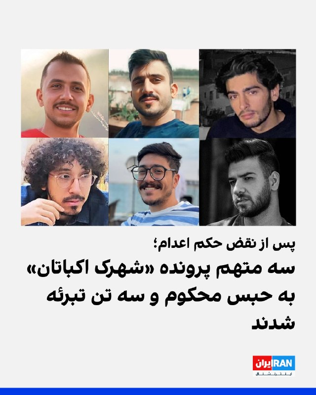

رسانه‌های حقوق بشری گزارش دادند دادگاه کیفری تهران پس از رسیدگی دوباره به پرونده شهرک اکباتان، سه معترض بازداشت‌شده در این پرونده را به دیه و پنج سال حبس محکوم و سه معترض دیگر را از اتهام مشارکت در «قتل عمد» تبرئه کرد. حکم اعدام این شش تن پیش‌تر در دیوان عالی کشور نقض شده بود.

سایت هرانا چهارشنبه ۳۰ اردیبهشت گزارش داد شعبه ۱۳ دادگاه کیفری یک استان تهران، میلاد آرمون، علیرضا کفایی و امیرمحمد خوش‌اقبال را بابت اتهام «مشارکت در قتل عمد» آرمان علی‌وردی، از نیروهای بسیج، محکوم کرد. هر یک از آن‌ها به پرداخت سهم مساوی از دیه کامل یک انسان و پنج سال حبس محکوم شده‌اند.

طبق گزارش هرانا، نوید نجاران، حسین نعمتی و علیرضا برمرزپورناک، سه متهم دیگر این پرونده، به دلیل «فقدان مدارک دال بر وارد کردن ضربه به ناحیه مشخصی از بدن علی‌وردی» از اتهام مشارکت در قتل عمد تبرئه شدند.

این حکم ۱۵ بهمن سال گذشته صادر و سه‌شنبه ۲۹ اردیبهشت به وکلای این افراد ابلاغ شده است.

این شش شهروند معترض در آبان ۱۴۰۳ از سوی همین شعبه به اعدام محکوم شده بودند.
@VahidOOnLine

📡 @VahidOnline

## IranIntlTV — post 338107

  <a href="telegram/content/IranIntlTV_338107_1779293673.mp4" target="_blank">🎬 Download video</a>

یک شهروند در پیامی به ایران اینترنشنال با اشاره به دوگانگی شیوه زندگی و سخنان مسئولان جمهوری اسلامی می‌گوید: «من هم یک زندگی معمولی می‌خواهم اما مادرم معصومه ابتکار نیست.» پیام مخاطب با هوش مصنوعی خوانده شده است.

## IranIntlTV — post 338106

  

ابراهیم رضایی، سخنگوی کمیسیون امنیت ملی مجلس، گفت کشورهای منطقه به همان اندازه مهلتی که ترامپ برای حمله بعدی تعیین کرده، فرصت دارند نیروهای آمریکایی را به‌طور دائم اخراج کنند و بعدا گلایه‌ای نداشته باشند.

رضایی افزود برنامه جمهوری اسلامی برای «ورشکستگی سیاسی و اقتصادی» ترامپ، از مسیر برخی کشورهای منطقه دنبال می‌شود.
https://iranintl.com/202605208322

## IranIntlTV — post 338105

  

فیصل بن فرحان، وزیر خارجه عربستان سعودی، نوشت ریاض از تصمیم رییس‌جمهوری آمریکا برای دادن فرصت دوباره به مذاکرات با جمهوری اسلامی به‌منظور دستیابی به توافقی که به پایان جنگ و بازگشت امنیت و آزادی کشتیرانی در تنگه هرمز به وضعیت پیش از ۹ اسفند ۱۴۰۴ منجر شود، قدردانی می‌کند.

او همچنین از تلاش‌های مستمر پاکستان برای میانجی‌گری در این زمینه تقدیر کرد و در شبکه ایکس نوشت عربستان سعودی امیدوار است جمهوری اسلامی از این فرصت برای جلوگیری از «پیامدهای خطرناک تشدید تنش» استفاده کرده و فورا به تلاش‌ها برای پیشبرد مذاکرات پاسخ دهد.

وزیر خارجه عربستان سعودی افزود هدف از این تلاش‌ها، دستیابی به توافقی جامع است که صلح پایدار در منطقه و جهان را محقق کند.
https://iranintl.com/202605208600

## IranIntlTV — post 338104

  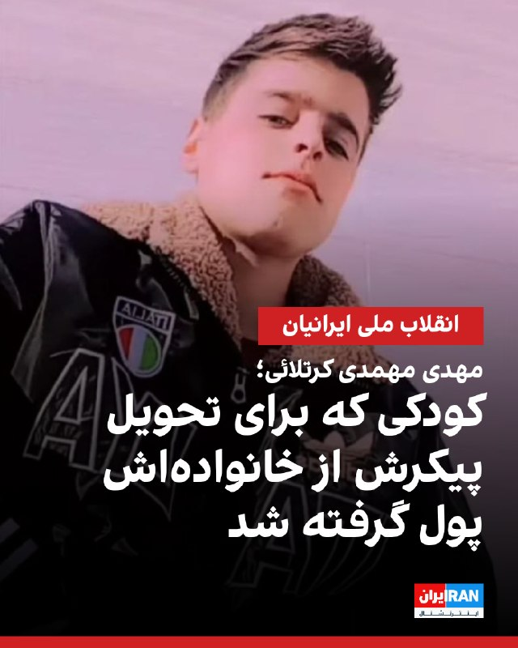

بر اساس گزارش‌های رسیده به ایران‌اینترنشنال، مهدی مهمدی کرتلائی، ۱۶ ساله، در شامگاه ۱۹ دی و هم‌زمان با فراخوان شاهزاده، در محدوده شوشتر و روستای عقیلی در استان خوزستان، با شلیک گلوله جنگی نیروهای حکومتی کشته شد.

بنا بر این گزارش، پیکر او پس از دریافت پول و گرفتن تعهد از خانواده تحویل داده شد و صبح شنبه ۲۰ دی، در شرایط امنیتی و با حضور شمار محدودی از بستگان به خاک سپرده شد
https://iranintl.com/202605209075

## IranIntlTV — post 338103

  

خبرگزاری رویترز گزارش داد سلطان الجابر، مدیرعامل شرکت ملی نفت ابوظبی، اعلام کرد امارات متحده عربی در سال ۲۰۲۵ ساخت خط لوله جدیدی را که برای دور زدن تنگه هرمز طراحی شده، پیش برده و این پروژه اکنون ۵۰ درصد تکمیل شده است.

به گفته الجابر، امارات متحده عربی اجرای این پروژه را برای بهره‌برداری تا سال ۲۰۲۷ تسریع کرده است.

دفتر رسانه‌ای ابوظبی نیز هفته گذشته اعلام کرده بود این خط لوله قرار است ظرفیت صادرات نفت امارات از طریق بندر فجیره را تا سال ۲۰۲۷ دو برابر کند.

الجابر گفت بخش زیادی از انرژی جهان همچنان از چند گلوگاه محدود عبور می‌کند و امارات به همین دلیل بیش از یک دهه پیش تصمیم گرفت در زیرساخت‌هایی سرمایه‌گذاری کند که تنگه هرمز را دور می‌زنند.
https://iranintl.com/202605201938

## IranIntlTV — post 338102

  <a href="telegram/content/IranIntlTV_338102_1779293678.mp4" target="_blank">🎬 Download video</a>

به گزارش شبکه‌ی اسناد حقوق بشر بلوچستان، دانشجویان بلوچ مقطع دکتری، متوجه شده‌اند که برای آن‌ها ممنوعیت خروج از کشور صادر شده‌ است. این نگرانی وجود دارد که ادامه تحصیل این دانشجویان نیز با محدودیت‌هایی مواجه شود.

گفت‌وگو با مهدی نخل‌احمدی، روزنامه‌نگار و فعال سیاسی
@iranintltv

## IranIntlTV — post 338101

  

دونالد ترامپ روز چهارشنبه گفت آمریکا «تحمل نخواهد کرد که یک دولت یاغی میزبان عملیات نظامی، اطلاعاتی و تروریستی خصمانه خارجی تنها در فاصله ۹۰ مایلی از خاک آمریکا باشد.»

او افزود واشینگتن تا زمانی که مردم کوبا دوباره آزادی داشته باشند آرام نخواهد گرفت.
https://iranintl.com/202605208182

## IranIntlTV — post 338100

  <a href="telegram/content/IranIntlTV_338100_1779293681.mp4" target="_blank">🎬 Download video</a>

سازمان اطلاعات و امنیت کانادا اعلام کرد، نبود چارچوب دسترسی قانونی به داده‌های دیجیتال، توان این نهاد را برای همکاری موثر با شرکای اطلاعاتی خارجی در مقابله با تهدیدهای فراملی تضعیف کرده است.

گزارش مهسا مرتضوی، خبرنگار ایران‌اینترنشنال
@iranintltv

## IranIntlTV — post 338099

  <a href="telegram/content/IranIntlTV_338099_1779293683.mp4" target="_blank">🎬 Download video</a>

🔻علیرضا دبیر، رییس فدراسیون کشتی درباره احتمال صادر نشدن ویزای آمریکا برای برخی اعضای تیم ملی کشتی امید ایران گفت: «اگر به تیم ما ویزا ندهند، یک‌سری فدراسیون‌ها جمع می‌شویم و میزبان را عوض می‌کنیم.»

@iranintltvsport

## IranIntlTV — post 338098

  <a href="telegram/content/IranIntlTV_338098_1779293686.mp4" target="_blank">🎬 Download video</a>

دولت کالابرگ الکترونیکی را راهی برای حمایت از معیشت خانوارها معرفی می‌کند، اما بسیاری از شهروندان می‌گویند اعتبار یک میلیون تومانی این طرح در برابر گرانی کالاهای اساسی، خیلی زود تمام می‌شود و تاثیر چندانی بر کاهش فشار اقتصادی ندارد.
آیه دریس، عضو تحریریه ایران‌اینترنشنال، در «پیوست» به این موضوع می‌پردازد
@iranintltv

## IranIntlTV — post 338097

  <a href="telegram/content/IranIntlTV_338097_1779293688.mp4" target="_blank">🎬 Download video</a>

ویدیویی که به تازگی به ایران اینترنشنال رسیده نشان می‌دهد خانواده و بستگان جاویدنام پیام رخ‌بخش، جوان معترض کشته‌شده در انقلاب دی‌ماه، در شیراز بر سر مزارش جشن تولد برایش برگزار کردند. پیام رخ‌بخش، ۳۲ ساله و اهل شیراز، ۱۹ دی ۱۴۰۴ با شلیک مستقیم نیروهای سرکوبگر حکومت به پهلو کشته شد.

## IranIntlTV — post 338096

  

الحدث به نقل از منابع خود گزارش داد دور بعدی مذاکرات پس از حج در اسلام‌آباد برگزار خواهد شد.
الحدث افزود فرمانده ارتش پاکستان ممکن است فردا برای اعلام نهایی شدن متن توافق به ایران سفر کند. همچنین گفته شده اگر فرمانده ارتش پاکستان به ایران نرود، احتمال دارد طی ساعات آینده نهایی شدن متن توافق اعلام شود.
به گفته این منابع، کار بر روی نهایی‌سازی متن توافق میان واشینگتن و تهران با جدیت در حال انجام است.
https://iranintl.com/202605206023

## IranIntlTV — post 338095

  <a href="telegram/content/IranIntlTV_338095_1779293691.mp4" target="_blank">🎬 Download video</a>

سرخط خبرهای چهارشنبه ۳۰ اردیبهشت
@iranintltv

## IranIntlTV — post 338094

  <a href="telegram/content/IranIntlTV_338094_1779293693.mp4" target="_blank">🎬 Download video</a>

سومین روز رسیدگی به پرونده حمله به پوریا زراعتی، مجری ایران‌اینترنشنال، در دادگاه وولیچ برگزار شد. دادستان این دادگاه گفت، حمله کنندگان به نیابت از جمهوری اسلامی، به قصد آسیب رساندن به پوریا زراعتی این حمله را انجام دادند.

تاج‌الدین سروش، خبرنگار ایران‌اینترنشنال، گزارش می‌دهد
@iranintltv

## IranIntlTV — post 338093

  

عباس عراقچی، وزیر خارجه جمهوری اسلامی، اعلام کرد: هرجا لازم باشد می‌جنگیم و هرجا لازم باشد مذاکره می‌کنیم. ما کاملا در خدمت منافع نظام هستیم.

عراقچی افزود که ارتباط و هماهنگی مستمر و روزانه میان وزارت خارجه و فرماندهان نیروهای مسلح در سطوح مختلف برقرار است.
https://iranintl.com/202605208263

## IranIntlTV — post 338092

  <a href="telegram/content/IranIntlTV_338092_1779293695.mp4" target="_blank">🎬 Download video</a>

سپاه پاسداران با انتشار بیانیه‌ای در واکنش به تهدیدهای اخیر دونالد ترامپ، هشدار داد در صورت حمله دوباره آمریکا و اسرائیل به جمهوری اسلامی، دامنه جنگ از منطقه فراتر خواهد رفت. سپاه همچنین اعلام کرد «ضربات کوبنده» را در مکان‌هایی وارد می‌کند که به گفته این نهاد نظامی، طرف مقابل «تصورش را هم نمی‌کند.»
گفت‌وگو با شایان سمیعی، کارشناس امنیت ملی
@iranintltv

## IranIntlTV — post 338091

  <a href="telegram/content/IranIntlTV_338091_1779293698.mp4" target="_blank">🎬 Download video</a>

شران هسکل، معاون وزیر خارجه اسرائیل، به بابک اسحاقی، خبرنگار ایران‌اینترنشنال، گفت جنگ اسرائیل با سپاه و ایدئولوژی افراطی است، نه با مردم ایران.
@iranintltv

## IranIntlTV — post 338090

  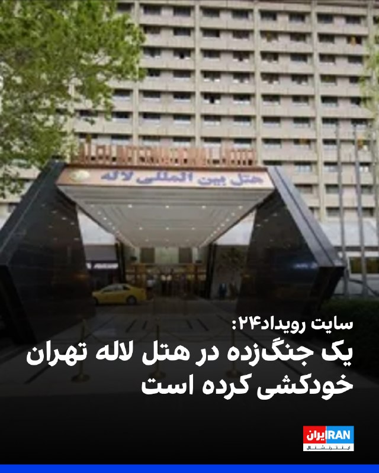

سایت رویداد۲۴ گزارش داد یک مرد جوان مجرد از جنگ‌زدگان ساکن هتل لاله تهران، در روزهای ابتدایی جنگ و در پی فشار شدید روانی ناشی از جنگ، آوارگی و بی‌خانمانی خودکشی کرده و جان باخته است.

بر اساس این گزارش، علیرضا رئیسی، معاون وزیر بهداشت، گفته بود وزارت بهداشت برای ارائه مشاوره‌های روان‌شناختی به آوارگان آمادگی کامل داشته، اما شهرداری تهران از ورود تیم‌های متخصص این وزارتخانه جلوگیری کرده است.

در مقابل، محمد صاحب، مدیرکل سلامت شهرداری تهران، این صحبت‌ها را رد کرد و گفت پیشنهاد همکاری وزارت بهداشت «بسیار دیر» و پس از آتش‌بس ارائه شد؛ زمانی که به گفته او، شهرداری از قبل مقدمات خدمات‌رسانی را فراهم کرده بود.

(به توصیه کارشناسان، اگر با فردی روبه‌رو شدید که از جملات یا عباراتی حاکی از افسردگی یا تمایل به پایان زندگی استفاده می‌کند، از او بخواهید با یک پزشک متخصص معتمد، نهادهای فعال در این زمینه یا فردی مورد اعتماد درباره نگرانی‌هایش صحبت کند. اگر خودتان به خودکشی فکر می‌کنید، در ایران می‌توانید با اورژانس اجتماعی با شماره ۱۲۳ تماس بگیرید.)
https://iranintl.com/202605200313

## IranIntlTV — post 338089

  <a href="telegram/content/IranIntlTV_338089_1779293701.mp4" target="_blank">🎬 Download video</a>

دونالد ترامپ، رییس‌جمهوری آمریکا، گفت: «در ایران خشم زیادی وجود دارد و ناآرامی بی‌سابقه‌ای شکل گرفته است و خواهیم دید چه اتفاقی می‌افتد.» او همچنین تاکید کرد درباره توافق محدود مرتبط با تنگه هرمز عجله‌ای ندارد.
@iranintltv

## IranIntlTV — post 338088

  

دونالد ترامپ درباره توافق با جمهوری اسلامی و موضوع تنگه هرمز گفت: «ما یک فرصت به این موضوع می‌دهیم. عجله‌ای ندارم. نمی‌خواهم افراد زیادی کشته شوند؛ ترجیح می‌دهم تعداد کمی کشته شوند.»

او گفت در ایران خشم و ناآرامی زیادی وجود دارد زیرا مردم در شرایط بدی زندگی می‌کنند و باید دید چه اتفاقی می‌افتد.
https://iranintl.com/202605201857

## Shin_Persian — post 6114

  

سردار مادرجنده بی جنبه :( بلاک کرد

## Shin_Persian — post 6113

📦 mhrv-rs v1.9.33 released

• In Full Tunnel mode, fully idle sessions now use a stronger empty-keepalive backoff, and when every deployment is detected as legacy they stop sending repeated empty polls after going idle
• For mixed fleets where at least one deployment still has healthy long-poll support, the client keeps emitting empty polls so round-robin can still reach that healthy peer and remote→client data doe…

Files (Android APKs, Windows, macOS, Linux, OpenWRT) on the files channel:

👉 v1.9.33 — all files with SHA-256

Channel:
https://t.me/mhrv_rs
or: https://t.me/+R1OyoHX2boA1ZDgx

#v1933

## ManotoTV — post 105691

  <a href="telegram/content/ManotoTV_105691_1779293704.mp4" target="_blank">🎬 Download video</a>

وزیر خارجه عربستان از تصمیم ترامپ برای تعویق حمله به ایران استقبال کرد.

فیصل بن فرحان، وزیر خارجه عربستان سعودی، در پیامی در شبکه اکس نوشت کشورش از تصمیم دونالد ترامپ برای دادن زمان بیشتر به مذاکرات با تهران استقبال می‌کند و ریاض از «فرصت دادن به دیپلماسی» برای پایان جنگ و بازگرداندن امنیت و آزادی کشتیرانی در تنگه هرمز حمایت می‌کند.

بن فرحان همچنین از جمهوری اسلامی خواست «فوراً» به تلاش‌ها برای پیشبرد مذاکرات و دستیابی به توافقی جامع پاسخ دهد.

## ManotoTV — post 105690

  <a href="telegram/content/ManotoTV_105690_1779293705.mp4" target="_blank">🎬 Download video</a>

انفجار خودروی متعلق به سازمان حمل‌ونقل نیویورک در نزدیکی وال‌استریت، باعث وحشت و فرار عابران شد.

ویدیوهای منتشرشده نشان می‌دهد این خودرو پس از آتش‌گرفتن، مقابل ساختمان مرکزی «ام‌تی‌ای» در منهتن به گلوله‌ای از آتش تبدیل شد.

آتش‌نشانی نیویورک اعلام کرد این حادثه تلفاتی نداشته و علت آن در دست بررسی است.

## ManotoTV — post 105689

  <a href="telegram/content/ManotoTV_105689_1779293707.mp4" target="_blank">🎬 Download video</a>

‌
الجزیره به نقل از «منابع دیپلماتیک» گزارش داد شمار کشورهای حامی پیش‌نویس قطعنامه درباره تنگه هرمز به ۱۳۶ کشور رسیده است.

پیش‌نویس این قطعنامه از جمهوری اسلامی می‌خواهد حملات و مین‌گذاری در تنگه هرمز را متوقف کند، اما دیپلمات‌ها می‌گویند در صورت مطرح شدن برای رأی‌گیری، احتمالاً با وتوی چین و روسیه روبه‌رو خواهد شد.

چین و روسیه ماه گذشته نیز قطعنامه مشابهی را که با حمایت آمریکا ارائه شده بود، وتو کرده بودند و آن را جانبدارانه علیه جمهوری اسلامی دانستند.

## ManotoTV — post 105688

  <a href="telegram/content/ManotoTV_105688_1779293707.mp4" target="_blank">🎬 Download video</a>

فرانسه پس از انتشار ویدیویی از برخورد با فعالان ناوگان امدادی عازم غزه، سفیر اسرائیل را احضار می‌کند. ایتالیا نیز پیش‌تر اقدام مشابهی انجام داده بود.
ژان‌نوئل بارو، وزیر خارجه فرانسه، رفتار ایتامار بن‌گویر، وزیر امنیت ملی اسرائیل از جناح راست افراطی، با فعالان بین‌المللی را «غیرقابل قبول» توصیف کرد و گفت پاریس خواهان توضیح رسمی از اسرائیل است.
این واکنش‌ها پس از انتشار ویدیویی از سوی بن‌گویر مطرح شد که او را در محل نگهداری فعالان «فلوتیلا گلوبال سومود» نشان می‌دهد؛ کاروانی متشکل از ده‌ها قایق و صدها فعال از کشورهای مختلف که چند روز پیش در آب‌های بین‌المللی، حدود ۲۵۰ مایل دریایی از غزه، توسط نیروی دریایی اسرائیل متوقف شد.
اسرائیل این کاروان را «تحریک‌آمیز» و حامی حماس توصیف کرده و فعالان را به بندر اشدود منتقل کرده است.
در ویدیوی منتشرشده، بن‌گویر در حالی که پرچم اسرائیل در دست دارد، مقابل فعالان دست‌بندزده می‌گوید: «به اسرائیل خوش آمدید، ما صاحب‌خانه‌ایم» و آن‌ها را «حامی تروریسم» می‌خواند. او همچنین از بنیامین نتانیاهو خواسته این افراد «برای مدت طولانی» در زندان نگهداری شوند.
این ویدیو در چند ساعت نخست بیش از ۱.۷ میلیون بار دیده شد و موجی از واکنش‌های تند را در اسرائیل و خارج از این کشور به‌دنبال داشت.
برخی مقام‌های اسرائیلی، از جمله گیدئون ساعر، وزیر خارجه اسرائیل، رفتار بن‌گویر را آسیب‌زننده به وجهه اسرائیل دانسته‌اند. دفتر نتانیاهو نیز با دفاع از توقیف ناوگان، اعلام کرده نحوه برخورد بن‌گویر «با ارزش‌ها و هنجارهای اسرائیل همخوانی ندارد» و خواستار اخراج سریع فعالان شده است.

## ManotoTV — post 105687

  <a href="telegram/content/ManotoTV_105687_1779293709.mp4" target="_blank">🎬 Download video</a>

‌
دونالد ترامپ، رئیس‌جمهوری آمریکا، با اشاره به وضعیت داخلی ایران گفت مطمئن نیست مقام‌های جمهوری اسلامی «خیر و صلاح مردم» را بخواهند.

ترامپ گفت: «بعضی از کارهایی که با من می‌کنند نشان می‌دهد که خیر مردم را نمی‌خواهند، در حالی که باید خیر مردم را بخواهند.»

او همچنین از افزایش نارضایتی عمومی در ایران سخن گفت و افزود: «الان خشم زیادی در ایران وجود دارد، چون مردم در شرایط بسیار بدی زندگی می‌کنند.»

رئیس‌جمهوری آمریکا همچنین گفت در ایران «ناآرامی و التهاب زیادی» وجود دارد که به گفته او، مشابه آن پیش‌تر دیده نشده است.

## ManotoTV — post 105686

  <a href="telegram/content/ManotoTV_105686_1779293711.mp4" target="_blank">🎬 Download video</a>

محمدباقر قالیباف، رئیس مجلس شورای اسلامی، در آنچه رسانه‌های حکومتی «سومین فایل صوتی» توصیف کرده‌اند از جمله گفته «تحرکات آشکار و پنهان دشمن نشان می‌دهد که طرف مقابل به‌دنبال آغاز دور جدیدی از جنگ است.»

## ManotoTV — post 105685

  <a href="telegram/content/ManotoTV_105685_1779293711.mp4" target="_blank">🎬 Download video</a>

مدیرعامل شرکت ملی نفت ابوظبی، اعلام کرده است امارات متحده عربی اجرای طرح ساخت یک خط لوله جدید برای دور زدن تنگه هرمز را پیش برده و این پروژه اکنون ۵۰ درصد پیشرفت داشته است.
در حال حاضر خط لوله عملیاتی امارات، خط لوله حبشان–فجیره است که از میادین نفتی حبشان در جنوب‌غرب ابوظبی تا بندر فجیره در دریای عمان امتداد دارد.
این خط لوله در حال حاضر توان انتقال تا ۱.۸ میلیون بشکه نفت در روز را دارد. تاسیسات نفتی فجیره از زمان آغاز جنگ چندین بار هدف حملات پهپادی منتسب به ایران قرار گرفته است.
بر اساس اعلام مقامات اماراتی، خط لوله جدید قرار است ظرفیت کل صادرات نفت این کشور را تا سال آینده دو برابر کند.

## ManotoTV — post 105684

  <a href="telegram/content/ManotoTV_105684_1779293712.mp4" target="_blank">🎬 Download video</a>

دادبان پیرامون پرونده اکباتان گزارش داده شعبه ۱۳ دادگاه کیفری یک استان تهران در رای جدید خود، اعلام کرده که در این پرونده امکان صدور حکم قصاص وجود ندارد. بر اساس حکم جدید، میلاد آرمون، علیرضا کفایی و امیرمحمد خوش‌اقبال به اتهام مشارکت در قتل عمد، هر کدام به پرداخت دیه کامل به‌صورت مساوی و تحمل ۵ سال حبس محکوم شده‌اند.
در همین پرونده، علیرضا برمرزپورناک، حسین نعمتی و نوید نجاران از اتهام مشارکت در قتل عمد تبرئه شده‌اند. دادگاه دلیل این تصمیم را نبود ادله کافی درباره این موضوع عنوان کرده که ضربه مرگبار دقیقا توسط چه فردی وارد شده است.
در رای صادر شده تاکید شده که هر چند متهمان در درگیری و ضرب‌وشتم آرمان علی‌وردی، بسیجی کشته‌شده در جریان اعتراضات سراسری ۱۴۰۱ حضور داشته‌اند، اما به دلیل مشخص نبودن عامل ضربه منجر به فوت، شرایط صدور حکم قصاص فراهم نیست.
این در حالی است که پیش‌تر همین شعبه در رای متفاوت، این شش متهم را به قصاص محکوم کرده بود؛ حکمی که بعدا با نظر دیوان عالی کشور نقض و برای رسیدگی مجدد به دادگاه بدوی بازگردانده شد.

## FarsiVOA — post 218231

  <a href="telegram/content/FarsiVOA_218231_1779293713.mp4" target="_blank">🎬 Download video</a>

ارتش اسرائیل تصاویری از «سواستفاده‌ سازمان تروریستی حماس از جمعیت غیرنظامی و کودکان» در غزه منتشر کرده است.

در ویدیوهای منتشر شده از دوربین پهپاد ارتش اسرائیل، یک نیروی حماس دیده می‌شود که در محوطه یک مدرسه در نوار غزه به کودکان سلاح داده و کودکان با این سلاح‌ها بازی می‌کنند

ارتش اسرائیل در بیانیه خود اعلام کرد «این مستندات نشان‌دهنده سواستفاده‌ نظام‌مند و بی‌رحمانه سازمان تروریستی حماس از جمعیت غیرنظامی به‌عنوان سپر انسانی است، در حالی که این اقدامات نقض قوانین بین‌المللی به شمار می‌رود.»

این ویدیو بی‌صدا است.

## FarsiVOA — post 218225

📷نیروی دریایی ایالات متحده تصاویری از کهکشان راه شیری بر فراز عرشه کشتی فرماندهی و کنترل یواس‌اس مونت ویتنی (ال‌سی‌سی ۲۰) منتشر کرده که در دریای مدیترانه در حرکت است.

مونت ویتنی در حال انجام ماموریت در منطقه عملیات ناوگان ششم ایالات متحده برای آمادگی نیروی دریایی این کشور در اروپا-آفریقا و دفاع از منافع آمریکا و متحدانش در این منطقه است.

## FarsiVOA — post 218224

دونالد ترامپ، رئیس‌ جمهوری آمریکا، روز چهارشنبه ۳۰ اردیبهشت گفت که قصد او در مورد مساله ایران این است که افراد کمتری کشته شوند. او با این‌حال تاکید کرد که مطمئن نیست رژیم جمهوری اسلامی تا چه اندازه به فکر مردم ایران است.

## FarsiVOA — post 218223

🔺پرزیدنت ترامپ: در ایران شرایط زندگی بسیار بد و میزان خشم و نارضایتی بی‌سابقه است؛ تنگه هرمز باز خواهد شد

▪️پرزیدنت ترامپ گفت: «الان در ایران خشم زیادی وجود دارد چون مردم وضعیت زندگی بسیار بدی دارند. ناآرامی زیادی هست که قبلاً این‌قدر ندیده بودیم و خواهیم دید چه اتفاقی می‌افتد.»

⬇️ بیشتر بخوانید:

https://ir.voanews.com/a/iran-trump-us-people-hormuz/8152001.html/?nocach=1

## FarsiVOA — post 218222

  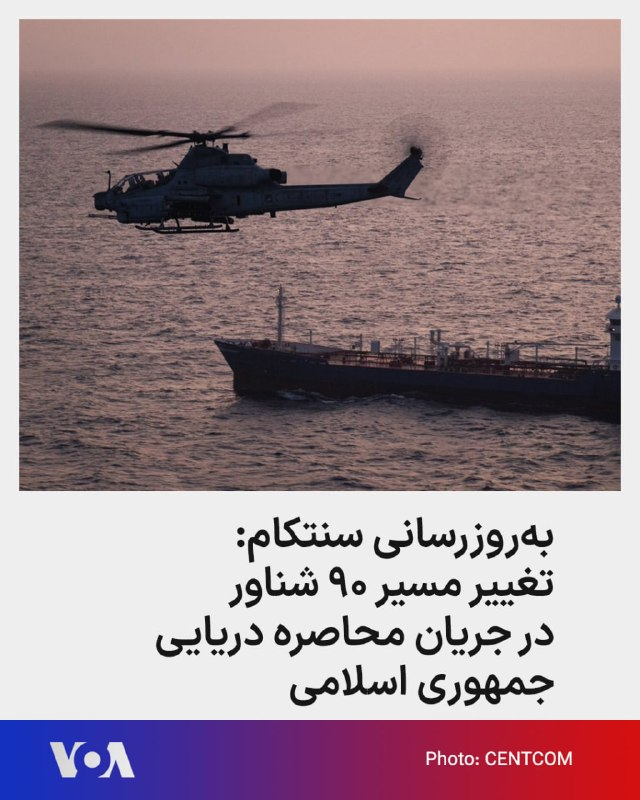

فرماندهی مرکزی ایالات متحده، سنتکام، در یک به‌روز‌رسانی تازه اعلام کرد که از زمان اجرای محاصره دریایی جمهوری اسلامی تا ۳۰ اردیبهشت، نیروهای آمریکایی ۹۰ کشتی را وادار به تغییر مسیر کرده‌اند و ۴ کشتی را غیرفعال کرده‌اند.

سنتکام همچنین تصویری از یک هلیکوپتر تهاجمی (ای‌اچ-۱زد وایپر) در حال گشت‌زنی نزدیک یک کشتی تجاری در آب‌های منطقه منتشر کرده است.

## FarsiVOA — post 218221

  <a href="telegram/content/FarsiVOA_218221_1779293716.mp4" target="_blank">🎬 Download video</a>

کشورهای میانجی می‌گویند مذاکرات میان آمریکا و ایران به زمان بیشتری نیاز دارد. در میدان پرسیدیم اگر در نهایت توافقی در کار نباشد، با چه سناریوهایی رو‌به‌رو می‌شویم و هر طرف چه برگ‌های برنده‌ای دارد؟

## FarsiVOA — post 218220

  <a href="telegram/content/FarsiVOA_218220_1779293717.mp4" target="_blank">🎬 Download video</a>

سخنگوی ارتش اسرائیل در بیانیه‌ای اعلام کرد ارتش اسرائیل یک سایت تولید تسلیحات متعلق به سازمان تروریستی حزب‌الله را که در ساختمانی با کاربری درمانگاه احداث شده بود، در منطقه صور در جنوب لبنان هدف قرار داد.

بنابر بیانیه ارتش، این سایت در ساختمانی احداث شده بود که به‌عنوان یک درمانگاه غیرنظامی مورد استفاده قرار می‌گرفت و در فاصله‌ای بسیار نزدیک از یک مسجد قرار داشت. پس از حمله، انفجارهای ثانویه در این محل شناسایی شد که نشان‌دهنده وجود تسلیحات در داخل ساختمان است.

## FarsiVOA — post 218219

  <a href="telegram/content/FarsiVOA_218219_1779293719.mp4" target="_blank">🎬 Download video</a>

ارتش اسرائیلی ویدیویی از هدف‌گیری و انهدام یکی از مواضع دیده‌بانی متعلق به حزب‌الله در جنوب لبنان منتشر کرده است.

بنابر بیانیه ارتش اسرائیل این تجهیزات رصد، داخل یک ساختمان غیرنظامی قرار داشت و توسط سازمان تروریستی حزب‌الله برای نظارت و هدایت عملیات علیه نیروهای ارتش اسرائیل استفاده می‌شد.

علاوه بر این، نیروهای ارتش اسرائیل «یک تروریست را داخل انبار ذخایر تسلیحاتی» هدف قرار دادند. انفجارهای ثانویه پس از حمله نشان‌دهنده وجود مهمات در انبار بود.

## FarsiVOA — post 218218

  <a href="telegram/content/FarsiVOA_218218_1779293722.mp4" target="_blank">🎬 Download video</a>

ارتش اسرائیل با انتشار این ویدیو اعلام کرد شب گذشته یک انبار تسلیحات متعلق به حماس را در مرکز نوار غزه منهدم کرد. به گفته ارتش اسرائیل این تسلیحات علیه نیروهای فعال ارتش در نزدیکی خط زرد و شهروندان اسرائیل استفاده می‌شدند.

## FarsiVOA — post 218217

برگزاری نشست «آینده ایران: وضعیت و چشم‌انداز ملیت‌ها در ایران» به میزبانی بامبوس چارالامبوس نماینده پارلمان بریتانیا

## DW_Farsi — post 124933

  

🔶 امارات از عراق خواست فورا جلوی حملات از خاک خود را بگیرد

امارات متحده عربی روز چهارشنبه ۲۰ مه از عراق خواست فورا مانع هرگونه اقدام خصمانه از خاک خود شود.

وزارت خارجه امارات در بیانیه‌ای اعلام کرد ابوظبی بر این باور است که پهپادی که یکشنبه به یک ژنراتور برق در نزدیکی نیروگاه هسته‌ای براکه در اطراف ابوظبی اصابت کرد، از خاک عراق به پرواز درآمده بود.

وزارت خارجه امارات تاکید کرد عراق باید بدون شرط و در کوتاه‌ترین زمان ممکن از هرگونه اقدام خصمانه‌ای که از خاک این کشور منشأ می‌گیرد جلوگیری کند. در این بیانیه آمده است تهدیدهای موجود باید "سریع، فوری و مسئولانه" مهار شوند.

در حمله روز یکشنبه، یک پهپاد به یک ژنراتور برق در نزدیکی نیروگاه هسته‌ای براکه اصابت کرد.

این حمله که هیچ گروهی مسئولیت آن را به عهده نگرفت، باعث آتش‌سوزی شد، اما هیچ زخمی یا نشت پرتوی در پی نداشت. مقام‌های اماراتی همچنین گفتند دو پهپاد دیگر نیز رهگیری شده‌اند.

@dw_farsi

## DW_Farsi — post 124932

  

🔶 فرانسه: هنوز شواهد قطعی از مین‌گذاری در تنگه هرمز وجود ندارد

به گزارش خبرگزاری رویترز، کاترین ووترن، وزیر دفاع فرانسه، روز چهارشنبه ۲۰ مه (۳۰ اردیبهشت) گفت، هیچ "قطعیتی" درباره گزارش‌های مربوط به مین‌گذاری در تنگه هرمز وجود ندارد، اما پاریس خود را برای احتمال اعزام توان مین‌روبی آماده می‌کند.

او گفت فرانسه در حال آماده‌سازی برای سناریویی است که در آن، پاکسازی مین‌ها در قالب یک ماموریت احتمالی به رهبری فرانسه و بریتانیا انجام شود.

ووترن گفت فرانسه ناچار است برای ضرورت احتمالی پاکسازی مین‌ها آماده باشد و در صورت لزوم، شناورهای مین‌روب می‌توانند به منطقه اعزام شوند. رویترز پیش‌تر نیز گزارش داده بود که فرانسه، هلند و بلژیک از توان مین‌روبی برخوردارند و این ظرفیت می‌تواند برای امن‌سازی عبور و مرور در هرمز به کار گرفته شود.

این موضع پس از آن مطرح شد که برخی گزارش‌های رسانه‌ای در آمریکا، به نقل از مقام‌هایی که نامشان فاش نشد، مدعی شده بودند دست‌کم ۱۰ مین در منطقه شناسایی شده است. با این حال، مقام‌های فرانسوی گفته‌اند هنوز نمی‌توان درباره وجود مین‌ها با اطمینان سخن گفت.

@dw_farsi

## DW_Farsi — post 124931

🔶 کاهش تعهدات نظامی آمریکا به ناتو در شرایط بحران‌ و جنگ

تصمیم آمریکا درباره کاهش نیروها و تجهیزات خود برای حمایت از ناتو در شرایط بحران قرار است روز جمعه، ۱ خرداد (۲۱ مه)، به‌طور رسمی در بروکسل به متحدان ناتو اعلام شود.

این تغییر در قالب سازوکار "مدل نیروهای ناتو" انجام می‌شود؛ سازوکاری که در آن کشورهای عضو مشخص می‌کنند چه نیروهایی در صورت جنگ یا بحران بزرگ فعال خواهند شد.

پنتاگون تصمیم گرفته سهم خود از این نیروهای قابل‌استفاده را به‌طور قابل توجهی کاهش دهد، هرچند جزئیات دقیق آن هنوز اعلام نشده است.

وزارت دفاع آمریکا اما تاکید کرده است که "چتر هسته‌ای" این کشور برای دفاع از اعضای ناتو همچنان پابرجا خواهد ماند.

اقدام کاهش نیروهای آمریکایی در شرایط جنگ و بحران در راستای سیاست دونالد ترامپ، رئیس‌جمهور آمریکا انجام می‌شود که بارها تاکید کرده کشورهای اروپایی باید مسئولیت اصلی امنیت قاره خود را بر عهده بگیرند.

مارک روته، دبیر کل ناتو در بروکسل گفته است که تصمیم آمریکا قابل انتظار بوده و بخشی از تلاش برای کاهش وابستگی بیش از حد ائتلاف به یک متحد خاص است.

با این حال، این تغییر نگرانی‌هایی را در اروپا ایجاد کرده است؛ به‌ویژه در شرایطی که برخی کشورها احتمال کاهش تعهدات آمریکا و حتی عقب‌نشینی گسترده‌تر نظامی را مطرح می‌کنند.

در ماه‌های اخیر دولت ترامپ حدود ۵ هزار نیروی آمریکایی را از اروپا خارج کرده و اعزام یک تیپ نظامی به لهستان را نیز لغو کرده است؛ تصمیمی که با انتقاد برخی قانون‌گذاران آمریکایی مواجه شده است.

در مجموع، این تحولات نشان‌دهنده فشارهای فزاینده بر پیمان ناتو و اختلاف نظر میان آمریکا و متحدان اروپایی درباره تقسیم مسئولیت‌های دفاعی است.

دونالد ترامپ در آخرین دیدار خود با مارک روته، دبیرکل ناتو، در کاخ سفید اعلام کرد که از این پیمان "کاملا ناامید" است. در این دیدار همچنین درباره جنگ آمریکا و اسرائیل علیه ایران گفت‌وگو شد؛ جنگی که اعضای ناتو در آن مشارکت فعال نداشتند.

ترامپ پس از این ملاقات در شبکه اجتماعی "تروث سوشال" نوشت ناتو در زمان نیاز کنار آمریکا نبوده و در صورت نیاز دوباره نیز همراه نخواهد بود.

ترامپ بارها ناتو را "ببر کاغذی" توصیف کرده و حتی تهدید به خروج آمریکا از این پیمان کرده است. پیمان آتلانتیک شمالی (ناتو) ۳۲ عضو دارد و ایالات متحده یکی از بنیان‌گذاران آن به شمار می‌رود.

@dw_farsi

## DW_Farsi — post 124930

  <a href="telegram/content/DW_Farsi_124930_1779293726.mp4" target="_blank">🎬 Download video</a>

🎥 تاکسی‌های پرنده؛ آینده حمل‌ونقل یا رویایی دوردست؟

شرکت‌های چینی، آمریکایی و بریتانیایی وارد رقابت ساخت تاکسی‌های پرنده شده‌اند.
این هواپیماهای برقی که می‌توانند به طور عمودی از زمین بلند شوند، حالا به‌دنبال ورود به خیابان‌های هوایی هستند.
آیا آسمان شهرها واقعاً به‌زودی پر از تاکسی‌های هوایی می‌شود؟
@dw_farsi

## DW_Farsi — post 124929

  

🔶 تهدید سپاه: در صورت تکرار حمله، دامنه جنگ از منطقه فراتر خواهد رفت

سپاه پاسداران انقلاب اسلامی روز چهارشنبه ۳۰ اردیبهشت (۲۰ ماه مه) در بیانیه‌ای تهدید کرد اگر ایالات متحده بار دیگر حملات را آغاز کند، جنگ را فراتر از خاورمیانه گسترش خواهد داد.

این تهدید پس از آن مطرح شد که دونالد ترامپ، رئيس‌جمهور آمریکا گفت تنها یک ساعت با صدور دستور آغاز دوباره عملیات نظامی فاصله داشته است.

سپاه همچنین آمریکا و اسرائیل را خطاب قرار داد و مدعی شد که در صورت تکرار حمله، ضربات جمهوری اسلامی در نقاطی وارد خواهد شد که دشمنان "تصور آن را ندارند".

سپاه در بخش دیگری از بیانیه خود گفت با وجود آن‌که آمریکا و اسرائیل با همه توان دو ارتش "پرهزینه" خود به ایران حمله کردند، جمهوری اسلامی همه ظرفیت‌های خود را علیه آن‌ها وارد عمل نکرد.

به نظر می رسد این بیانیه در واکنش به اظهارات مقامات آمریکایی صادر شده است.

@dw_farsi

## DW_Farsi — post 124928

  

🔶 قوه قضاییه اظهارات همسر رشید مظاهری درباره زندان انفرادی را رد کرد

به گزارش خبرگزاری مهر، قوه قضائيه جمهوری اسلامی اعلام کرد رشید مظاهری هنگام تلاش برای خروج غیرقانونی از کشور از مرزهای غربی، پس از آن‌که به گفته این نهاد قصد داشت با تغییر چهره و پرداخت رشوه به ماموران مرزبانی از کشور خارج شود، بازداشت شده است.

قوه قضائيه همچنین اخبار منتشر شده در خصوص انتقال دروازه‌بان پیشین تیم ملی فوتبال ایران و باشگاه استقلال تهران به سلول انفرادی در زندان مرکزی ارومیه را رد کرد و مدعی شد که او اکنون در بند عمومی نگهداری می‌شود.

قوه قضائیه گفته است رسیدگی به این اتهام‌ها در حال انجام است و ادعاهای منتشرشده در فضای مجازی درباره وضعیت او با واقعیت تطابق ندارد.

پیش‌تر مریم عبدالهی، همسر رشید مظاهری، در یک پست اینستاگرامی نوشته بود که او به زندان مرکزی ارومیه منتقل شده و در شرایط سخت در سلول انفرادی نگهداری می‌شود.

او همچنین گفته بود ماه‌هاست برای آزادی همسرش تلاش می‌کند و از جامعه ورزش، رسانه‌ها و مردم خواسته بود صدای رشید مظاهری باشند و خواستار شفافیت و رسیدگی فوری و عادلانه شده بود.

@dw_farsi

## DW_Farsi — post 124927

🔶 اجرای توافق گمرکی اروپا و آمریکا پس از تهدیدهای ترامپ

نمایندگان کشورهای عضو اتحادیه اروپا و پارلمان اروپا روز چهارشنبه ۲۰ مه (۳۰ اردیبهشت) درباره اجرای توافق گمرکی آمریکا و اتحادیه اروپا به تفاهم رسیدند. طبق این توافق، قرار است دسترسی محصولات کشاورزی و دریایی آمریکا به بازار اروپا تسهیل شود.

با این حال، مقام‌های اروپایی تاکید کرده‌اند که این امتیازها تنها در صورتی ادامه خواهد داشت که آمریکا نیز به تعهدات خود پایبند بماند.

در متن توافق پیش‌بینی شده است که اگر واشنگتن مفاد توافق تجاری را نقض کند، اتحادیه اروپا می‌تواند امتیازهای گمرکی را تعلیق کرده و حتی دوباره تعرفه‌ها را افزایش دهد.

موضوع این "سازوکارهای حفاظتی"، یکی از اصلی‌ترین اختلاف‌ها میان کشورهای اروپایی در جریان مذاکرات داخلی بود.

پیش‌تر ترامپ به اتحادیه اروپا تا چهارم ژوئیه فرصت داده بود تا اجرای توافق را نهایی کند در غیر این صورت، او تعرفه واردات خودروهای اروپایی به آمریکا را از ۱۵ به ۲۵ درصد افزایش خواهد داد؛ اقدامی که می‌توانست به‌ویژه به خودروسازان آلمانی آسیب جدی وارد کند.

اورزولا فون‌ درلاین، رئیس کمیسیون اتحادیه اروپا ابراز امیدواری کرد توافق جدید به کاهش تنش‌های تجاری میان اروپا و آمریکا منجر شود. او خواستار اجرای سریع کاهش تعرفه‌ها شد.

برند لانگه، مذاکره‌کننده ارشد پارلمان اروپا نیز گفت پارلمان موفق شده است خواسته خود برای ایجاد "شبکه امنیتی" در برابر تخلف احتمالی آمریکا را در توافق بگنجاند.

مایکل دامیانوس، وزیر انرژی، تجارت و صنعت قبرس که کشورش ریاست دوره‌ای اتحادیه اروپا را بر عهده دارد، گفت "حفظ یک شراکت باثبات، قابل پیش‌بینی و متوازن میان دو سوی آتلانتیک به سود هر دو طرف است". او همچنین افزود اتحادیه اروپا با این تصمیم به تعهدات خود عمل می‌کند.

مارتین شیردوان، رئیس فراکسیون چپ در پارلمان اروپا، از این توافق انتقاد کرد و گفت اتحادیه اروپا در برابر فشارها و "باج‌خواهی" ترامپ عقب‌نشینی کرده است.

بر اساس این توافق، تعرفه‌های گمرکی اتحادیه اروپا بر کالاهای صنعتی آمریکا از زمان اجرایی شدن قانون آغاز می‌شود و تا پایان سال ۲۰۲۹ ادامه خواهد داشت.

این توافق بخشی از تفاهمی است که فون‌در لاین و ترامپ در اوت سال گذشته برای جلوگیری از تشدید جنگ تجاری میان دو طرف به آن دست یافته بودند. در مقابل آمریکا نیز متعهد شده بود تعرفه بیشتر کالاهای اروپایی را حداکثر در سطح ۱۵ درصد نگه دارد.

@dw_farsi

## DW_Farsi — post 124926

🎥 روغن‌های مصرف‌شده؛ راه‌حل جدید برای بحران سوخت جهانی؟
 
با افزایش قیمت نفت خام در پی تنش‌های خاورمیانه، سوخت‌های زیستی تجدیدپذیر بیش از پیش مورد توجه قرار گرفته‌اند. روغن‌های پخت‌وپز مصرف‌شده و دیگر منابع تجدیدپذیر حالا به‌عنوان گزینه‌ای جایگزین مطرح هستند؛ اما به نظر می‌رسد که چشم‌انداز این صنعت به روند قیمت نفت و سیاست‌های انرژی دولت‌ها  وابسته باشد.
@dw_farsi

## Persian_Trend_Official — post 14534

  

خداروشکر دارن توافق میکنن 😄 درجریانید که ... دلمون برای توافق های پر هیجان عراقچی با ویتکاف تنگ شده ! از توجه شما به این موضوع متشکرم الیاس فرخ

## Persian_Trend_Official — post 14533

  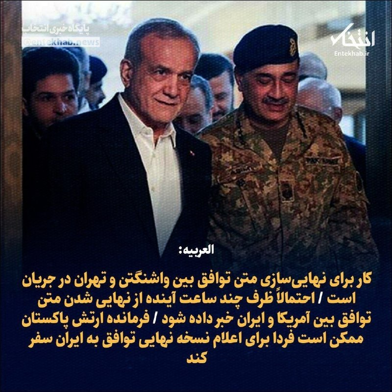

خداروشکر دارن توافق میکنن 😄

درجریانید که ...

دلمون برای توافق های پر هیجان عراقچی با ویتکاف تنگ شده !

از توجه شما به این موضوع متشکرم
الیاس فرخ

## Persian_Trend_Official — post 14532

💢سخنگوی وزارت امور خارجه : ما نمی‌توانیم به ایالات متحده و اسرائیل اجازه عبور از هرمز را بدهیم 💢وقتی ما خواستار آزادی دارایی‌های مسدود شده خود هستیم، منظورمان دسترسی به آنها به عنوان حق ماست. 💢استفاده صلح‌آمیز از انرژی هسته‌ای یک مطالبه نیست، بلکه حقی است…

## Persian_Trend_Official — post 14531

💢سخنگوی وزارت امور خارجه : ما نمی‌توانیم به ایالات متحده و اسرائیل اجازه عبور از هرمز را بدهیم

💢وقتی ما خواستار آزادی دارایی‌های مسدود شده خود هستیم، منظورمان دسترسی به آنها به عنوان حق ماست.

💢استفاده صلح‌آمیز از انرژی هسته‌ای یک مطالبه نیست، بلکه حقی است که توسط پیمان منع گسترش سلاح‌های هسته‌ای تضمین شده است.

💢وقتی در مورد تحریم‌های یکجانبه آمریکا صحبت می‌کنیم، این یک مطالبه نیست، بلکه بخشی از حقوق ماست.

💢ما با عمان، دیگر کشور ساحلی، همکاری می‌کنیم تا عبور ایمن کشتی‌ها از تنگه هرمز را تضمین کنیم.

💢ما نمی‌توانیم به ایالات متحده و اسرائیل اجازه عبور از هرمز را بدهیم، زیرا این امر بر امنیت ملی ما تأثیر خواهد گذاشت.

💢ما با چندین کشور در تماس نزدیک هستیم تا اطمینان حاصل کنیم که کشتی‌های آنها می‌توانند بدون هیچ حادثه‌ای از تنگه هرمز عبور کنند.

💢ما برای صادرات و واردات خود به تنگه هرمز متکی هستیم، بنابراین انگیزه داریم که از امنیت آن اطمینان حاصل کنیم.

🫆:Tony

📌 @persian_trend_official
پرشین ترند | متفاوت‌ترین کانال نظامی

## Persian_Trend_Official — post 14530

  <a href="telegram/content/Persian_Trend_Official_14530_1779293731.mp4" target="_blank">🎬 Download video</a>

💢ترامپ :

الان تو اسرائیل ۹۹٪ طرفدار دارم.

▪️می‌تونم برای نخست‌وزیری کاندید شم، شاید بعد این ماجرا برم اسرائیل واسه نخست‌وزیری

🫆:Tony

📌 @persian_trend_official
پرشین ترند | متفاوت‌ترین کانال نظامی

## Persian_Trend_Official — post 14529

  <a href="telegram/content/Persian_Trend_Official_14529_1779293733.webm" target="_blank">🎬 Download video</a>

⭕️ادعای العربیه:

💢کار برای نهایی‌سازی متن توافق بین واشنگتن و تهران در حال انجام است.

💢فرمانده ارتش پاکستان ممکن است فردا برای اعلام نسخه نهایی توافق از ایران دیدار کند.

💢ممکن است طی ساعات آینده از نهایی شدن نسخه نهایی توافق بین آمریکا و ایران خبر داده شود.

▪️دور جدیدی از مذاکرات بعد از فصل حج در اسلام‌آباد برگزار خواهد شد.

🫆:Tony

📌 @persian_trend_official
پرشین ترند | متفاوت‌ترین کانال نظامی

## RadioFarda — post 157393

🔸دونالد ترامپ، رئیس‌جمهور آمریکا، روز چهارشنبه به خبرنگاران گفت که برای پایان دادن به جنگ با ایران هیچ عجله‌ای ندارد. 🔸او درباره آتش‌بس شکننده فعلی و چشم‌انداز توافق پایان جنگ گفت: «ما باید تنگه هرمز را باز کنیم. تنگه باید فورا باز شود. به همین دلیل این مسیر…

## RadioFarda — post 157392

  

🔸دونالد ترامپ، رئیس‌جمهور آمریکا، روز چهارشنبه به خبرنگاران گفت که برای پایان دادن به جنگ با ایران هیچ عجله‌ای ندارد.

🔸او درباره آتش‌بس شکننده فعلی و چشم‌انداز توافق پایان جنگ گفت: «ما باید تنگه هرمز را باز کنیم. تنگه باید فورا باز شود. به همین دلیل این مسیر را امتحان می‌کنیم.»

🔸ترامپ با اشاره به انتخابات میاندوره‌ای کنگره آمریکا و تأثیر احتمالی آن بر تصمیمات او درباره ایران تأکید کرد: «من هیچ عجله‌ای ندارم... ترجیحم آن است که افراد کمتری کشته شوند.»

🔸رئیس‌جمهور آمریکا در ادامه گفت که برای او کامل کردن مأموریت درباره ایران مهم‌تر از تعیین زمان برای خاتمه دادن به درگیری است.

@RadioFarda

## RadioFarda — post 157391

🔸محمدباقر قالیباف، رئیس مجلس شورای اسلامی، ادعا کرد که آمریکا به دنبال دور جدید جنگ علیه ایران است و باید واشینگتن را از تسلیم شدن تهران ناامید کرد. 🔸او در یک فایل صوتی که رسانه‌های ایران روز چهارشنبه ۳۰ اردیبهشت منتشر کردند، با اشاره به برقراری آتش‌بس میان…

## RadioFarda — post 157390

  

🔸محمدباقر قالیباف، رئیس مجلس شورای اسلامی، ادعا کرد که آمریکا به دنبال دور جدید جنگ علیه ایران است و باید واشینگتن را از تسلیم شدن تهران ناامید کرد.

🔸او در یک فایل صوتی که رسانه‌های ایران روز چهارشنبه ۳۰ اردیبهشت منتشر کردند، با اشاره به برقراری آتش‌بس میان ایران و آمریکا گفت: «تحرکات آشکار و پنهان دشمن نشان می‌دهد که دشمن به موازات فشارهای اقتصادی و سیاسی از اهداف نظامی خود دست نکشیده و به دنبال دور جدیدی از جنگ و ماجراجویی جدید است.»

🔸دونالد ترامپ، رئیس‌جمهور آمریکا، روز دوشنبه گفت که ارتش این کشور قرار بود روز سه‌شنبه حملاتی علیه ایران انجام دهد اما او به درخواست شماری از کشورهای منطقه و برای رسیدن به توافق پایان جنگ با ایران، دستور لغو این حملات را داده است.

🔸آقای ترامپ در عین حال روز سه‌شنبه هشدار داد که ایران تنها چند روز برای رسیدن به توافق با آمریکا وقت دارد و در غیر این‌صورت شاید لازم شود «ضربه بزرگ» دیگری به آن وارد شود.

@RadioFarda

## RadioFarda — post 157389

  

🔸مایک والتز، سفیر آمریکا در سازمان ملل، می‌گوید منابع مالی حکومت ایران «در حال تمام شدن» و اقتصاد این کشور «در وضعیت فروپاشی» است.

🔸او افزوده که با این حال جمهوری اسلامی «به‌جای روی آوردن به رویکردی تازه و صلح‌آمیز، دست به حملات مکرر و گستاخانه‌ای علیه زیرساخت‌های غیرنظامی برق زده و همچنان به راهبرد دستیابی به سلاح هسته‌ای چنگ زده که می‌تواند جهان را در تاریکی فرو ببرد.»

🔸او تأکید کرده که «ما نمی‌توانیم این را تحمل کنیم و هرگز تحمل نخواهیم کرد.»

🔸اسکات بسنت، وزیر خزانه‌داری ایالات متحده، هم روز سه‌شنبه ۲۹ اردیبهشت در یک نشست مبارزه با تأمین مالی تروریسم در پاریس، گفت که این وزارتخانه، حکومت ایران را از درآمدهایی که برای «برنامه‌های تسلیحاتی، گروه‌های نیابتی تروریستی و جاه‌طلبی‌های هسته‌ای خود استفاده می‌کرد، محروم کرده است.»

🔸او افزود که واشینگتن «ده‌ها میلیارد دلار از درآمد پیش‌بینی‌شده نفتی» جمهوری اسلامی را مختل کرده است.

@RadioFarda

## RadioFarda — post 157388

  

🔸دبیر ستاد ملی جمعیت ایران می‌گوید میزان ازدواج و تولد در کشور به اندازه‌ای کاهش یافته که بر اساس آمارها میزان ازدواج در کشور نسبت به سال ۱۳۸۹ «نصف» شده است.

🔸مرضیه وحید دستجردی در همایش روز ملی جمعیت گفت: «بالاترین میزان ازدواج در سال ۱۳۸۹ با ۸۹۱ هزار و ۶۲۷ مورد ثبت شده، اما این رقم در سال ۱۴۰۴ به ۴۳۱ هزار و ۲۱ مورد کاهش یافته که بیانگر افت ۵۰ درصدی ازدواج‌ها است.»

🔸دستجردی با استناد به آمار سازمان ثبت احوال، تعداد تولدها در سال ۱۴۰۴ را نیز ۸۹۲ هزار و ۲۷۸ مورد اعلام کرد و افزود که وقوع دو جنگ علیه کشور به فاصله هشت تا ۹ ماه، «تأثیر مستقیم و غیرقابل انکاری» بر فرزندآوری داشته است.

🔸او در اظهاراتش به دغدغه‌های علی خامنه‌ای، رهبر پیشین جمهوری اسلامی درباره فرزندآوری اشاره کرد و کاهش جمعیت را «زنگ خطر جدی» برای آینده ایران دانست.

🔸دستجردی تأکید کرد که برای افزایش فرزندآوری، «مؤلفه‌های کلیدی نظیر اشتغال پایدار، تأمین مسکن و ایجاد امید در دل جوانان نقش اساسی دارند که متأسفانه در قانون فعلی به برخی از این زیرساخت‌ها به طور کامل و جامع پرداخته نشده است.»

@RadioFarda

## RadioFarda — post 157387

  

🔸نیروی دریایی سپاه پاسداران روز چهارشنبه اعلام کرد که در شبانه‌روز گذشته ۲۶ کشتی تجاری با «هماهنگی و تامین امنیت» از سوی این نیرو از تنگه هرمز عبور کردند.

🔸در اطلاعیه کوتاهی که در شبکه ایکس منتشر شده، آمده است: «طی شبانه روز گذشته ۲۶ فروند کشتی اعم از نفتکش، کانتینربر و سایر کشتی‌های تجاری با هماهنگی و تامین امنیت نیروی دریایی سپاه از تنگه هرمز عبور کردند.»

🔸سپاه پاسداران مشخص نکرده است که این کشتی‌ها متعلق به کدام کشورها هستند.

🔸ایران از روز نهم اسفند و همزمان با آغاز حملات آمریکا و اسرائیل، اقدام به اختلال در رفت‌وآمد کشتی‌ها در تنگه هرمز کرد و سپس این آبراه استراتژیک را مسدود کرد.

🔸با برقراری آتش‌بس و بعد از یک دور مذاکره میان نمایندگان ایران و آمریکا در پاکستان که به نتیجه نرسید، دونالد ترامپ دستور محاصره دریایی ایران را صادر کرد که همچنان ادامه دارد.

🔸همزمان با سفر رئیس‌جمهور آمریکا به چین در هفته گذشته، مقام‌های ایرانی از عبور چند کشتی چینی از تنگه هرمز خبر داده بودند. همچنین در روزهای اخیر گزارش شد که دو نفتکش حامل گاز مایع متعلق به قطر نیز از این آبراه گذشته است.

@RadioFarda

## RadioFarda — post 157386

  

🔸رسانه‌های ایران روز چهارشنبه ۳۰ اردیبهشت خبر دادند که محسن نقوی، وزیر کشور پاکستان، وارد تهران شده است. او روز ۲۶ اردیبهشت نیز به ایران سفر کرده بود.

🔸خبرگزاری ایسنا اعلام کرده که برنامه و اهداف سفر این مقام ارشد پاکستانی در ایران «مشخص نیست». خبرگزاری تسنیم نیز گزارش داده که آقای نقوی در بدو ورود به تهران با وزیر کشور ایران دیدار کرده است.

🔸وزیر کشور پاکستان در سفر قبلی به تهران که ابتدای این هفته انجام شد، درباره «ازسرگیری مذاکرات» بین ایران و آمریکا با همتای ایرانی خود گفت‌وگو کرد و سپس به دیدار رئیس‌جمهور و رئیس مجلس ایران رفت.

🔸دومین سفر این مقام پاکستانی در حالی انجام می‌شود که دونالد ترامپ، رئیس‌جمهور آمریکا، گفته است یک حمله نظامی برنامه‌ریزی‌شده به اهدافی در ایران برای روز سه‌شنبه را لغو کرده و جی‌دی ونس، معاون او، نیز رروز سه‌شنبه از «پیشرفت زیاد» مذاکرات بین واشینگتن و تهران برای رسیدن به توافق پایان جنگ خبر داد.

🔸ترامپ روز سه‌شنبه تأکید کرد که ایران تنها چند روز برای تصمیم‌گیری درباره توافق وقت دارد و افزود شاید لازم باشد ضربات نظامی دیگری به ایران وارد شود.

@RadioFarda

## IranianMinds — post 20454

  <a href="telegram/content/IranianMinds_20454_1779293738.mp4" target="_blank">🎬 Download video</a>

🔴آمریکا تعداد زیادی هواپیمای سوخت‌رسان را به فرودگاه بن‌گوریون اسرائیل منتقل کرد.

@IranianMinds

## IranianMinds — post 20453

  

🔴 ترامپ درباره کوبا :

ایالات متحده یک رژیم تروریستی را در نود مایلی خود تحمل نمیکند ، بنظر من وقت آن رسیده که مردم کوبا هم به آزادی که ۱۰۰ سال پیش برای آن جنگیده بودند برسند.

@IranianMinds

## IranianMinds — post 20452

نسخه کامل گفتگو در نشست آینده تکنولوژی ایران

این نشست روز ۱۶ مه (۲۶ اردیبهشت) در محل دفتر مرکزی شرکت «اوبر» در شهر سان‌فرانسیسکو در ایالت کالیفرنیای آمریکا برگزار شد.

@OfficialRezaPahlavi

## IranianMinds — post 20451

🔴 سخنگوی وزارت خارجه :

ما اورانیوم خودمونو به کسی تحویل نمیدیم و مسئله ی هسته ای ما کاملا صلح آمیزه.

@IranianMinds

## IranianMinds — post 20450

🔴 الحدث : دور بعدی مذاکرات پس از حج در اسلام آباد برگزار خواهد شد. @IranianMinds

## IranianMinds — post 20449

🔴 الحدث : احتمالا توافق ایران‌ و آمریکا تا ساعات آینده نهایی میشه. منظور متن توافق برای مذاکرات هست @IranianMinds

## IranianMinds — post 20448

🔴 الحدث :

دور بعدی مذاکرات پس از حج در اسلام آباد برگزار خواهد شد.

@IranianMinds

## IranianMinds — post 20447

🔴 الحدث : احتمالا توافق ایران‌ و آمریکا تا ساعات آینده نهایی میشه. منظور متن توافق برای مذاکرات هست @IranianMinds

## IranianMinds — post 20446

🔴 الحدث :

احتمالا توافق ایران‌ و آمریکا تا ساعات آینده نهایی میشه.

منظور متن توافق برای مذاکرات هست

@IranianMinds

## IranianMinds — post 20445

  

🔴 العربیه:

فرمانده ارتش پاکستان احتمالا فردا برای اعلام نسخه نهایی توافق از ایران دیدار کنه.

@IranianMinds

## IranianMinds — post 20444

🔴 سخنگوی وزارت خارجه جمهوری اسلامی :

مذاکرات با آمریکا از طریق پاکستان ادامه دارد و آنچه ما می‌خواهیم، درخواست نیست بلکه حقوق ماست.

@IranianMinds

## IranianMinds — post 20443

  <a href="telegram/content/IranianMinds_20443_1779293741.mp4" target="_blank">🎬 Download video</a>

🔴 ترامپ درباره ایران:

«الان خشم زیادی در ایران وجود دارد چون مردم شرایط زندگی بسیار بدی دارند.»

@IranianMinds

## IranianMinds — post 20442

  <a href="telegram/content/IranianMinds_20442_1779293743.mp4" target="_blank">🎬 Download video</a>

🔴 خبرنگار: آیا شما و نتانیاهو در مورد ایران هم‌نظر هستید؟

ترامپ: بله.

@IranianMinds

## IranianMinds — post 20441

  <a href="telegram/content/IranianMinds_20441_1779293745.mp4" target="_blank">🎬 Download video</a>

🔴 ترامپ درباره خودش:

«آخرش می‌گید: «او بزرگ‌ترین رئیس‌جمهوری است که تا به حال وجود داشته.»

@IranianMinds

## IranianMinds — post 20440

  <a href="telegram/content/IranianMinds_20440_1779293748.mp4" target="_blank">🎬 Download video</a>

🔴 ترامپ درباره نتانیاهو:

«نتانیاهو هر کاری که من بخواهم انجام می‌دهد.»

@IranianMinds

## IranianMinds — post 20439

  <a href="telegram/content/IranianMinds_20439_1779293750.mp4" target="_blank">🎬 Download video</a>

🔴 ترامپ درباره ایران:

«من عجله‌ای ندارم. همه می‌گویند: «انتخابات میان‌دوره‌ای». من عجله‌ای ندارم.»

@IranianMinds

## IranianMinds — post 20438

  <a href="telegram/content/IranianMinds_20438_1779293752.mp4" target="_blank">🎬 Download video</a>

🔴 ترامپ:

«ما ونزوئلا را تصرف کردیم. عملاً ایران را هم تصرف کرده‌ایم.

تا حالا ۱۳ نفر را از دست داده‌ایم. اگر شخص دیگری بود، ۱۰۰,۰۰۰ نفر از دست می‌رفت، باشه؟»

@IranianMinds

## IranianMinds — post 20437

  <a href="telegram/content/IranianMinds_20437_1779293754.mp4" target="_blank">🎬 Download video</a>

🔴 ترامپ:

«الان توی اسرائیل ۹۹٪ محبوبیت دارم. شاید برای نخست‌وزیری هم کاندید بشم، پس ممکنه بعد از این کار برم اسرائیل و برای نخست‌وزیری نامزد بشم.

@IranianMinds

## IranianMinds — post 20436

🔴مهدی رسولی( مداح):

به من لقب موشک هایپر‌سونیک دادند.

لانچر هم حتما سعید طوسی😂😂

@IranianMinds

## IranianMinds — post 20435

🔴وزارت نیروهای مسلح فرانسه:

ناو هواپیما‌بر شارل دوگل، به منطقه عملیاتی سواحل شبه‌جزیره عربستان رسید.

@IranianMinds

## BBCPersian — post 281621

🔻وزیر خارجه اسرائیل ویدئوی جنجالی بن‌گویر درباره فعالان غزه را «شرم‌آور» خواند

گیدئون ساعر، وزیر خارجه اسرائیل، به‌طور علنی از وزیر امنیت ملی راست‌افراطی کشورش به دلیل انتشار ویدیوی تحقیرآمیز فعالان بین‌المللی بازداشت‌شده کاروان کمک‌رسانی به غزه، انتقاد کرده است.

او این اقدام را «نمایشی شرم‌آور» توصیف کرد و گفت ایتامار بن‌گویر «مایانگر چهره واقعی اسرائیل نیست.»

در این ویدیو ده‌ها فعال دیده می‌شوند که با دستان بسته روی زمین زانو زده‌اند.

بن‌گویر در حالی که پرچم بزرگی از اسرائیل را در دست دارد، به زبان عبری به آن‌ها می‌گوید: «به اسرائیل خوش آمدید، این ما هستیم که صاحب اختیاریم.»

انتشار این ویدئو واکنش‌های زیادی را در پی داشت از جمله جورجا ملونی، نخست‌وزیر ایتالیا، نیز این اقدام را محکوم کرده و خواستار عذرخواهی شده است.

https://bbc.in/3PtqVqU
@BBCPersian

## BBCPersian — post 281620

🔻قدردانی عربستان از ترامپ برای دادن زمان بیشتر به ایران

شاهزاده فیصل بن فرحان، وزیر امور خارجه عربستان سعودی، روز چهارشنبه گفت که کشورش از تصمیم دونالد ترامپ برای دادن زمان بیشتر به مذاکرات با ایران برای رسیدن به توافق، قدردانی می‌کند.

دونالد ترامپ، رئیس‌جمهوری آمریکا، اوایل این هفته گفت که عربستان سعودی، امارات متحده عربی و قطر از او خواسته‌اند که حمله برنامه‌ریزی شده آمریکا به ایران را به تعویق بیندازد تا زمان بیشتری برای مذاکرات فراهم شود.

پیش از این سپاه پاسداران با انتشار بیانیه‌ای تهدید کرد که در صورت آغاز دوباره جنگ آمریکا و اسرائیل علیه ایران، جنگ «به فراتر از منطقه کشیده خواهد شد.»

https://bbc.in/3PtqVqU
@BBCPersian

## BBCPersian — post 281619

🔻وزیر ارتباطات ایران: شبکه ملی اطلاعات در امتداد اینترنت جهانی است، نه جایگزینش

ستار هاشمی، وزیر ارتباطات و فناوری اطلاعات ایران، در مراسمی به مناسبت روز جهانی ارتباطات گفت: «اینکه گفته می‌شود شبکه ملی اطلاعات قرار است جایگزین اینترنت جهانی و دسترسی آزاد به اطلاعات شود، برداشت نادرستی است.»

او تاکید کرد: «شبکه ملی اطلاعات، در امتداد دسترسی بین‌الملل به اینترنت است، نه جایگزین آن.»

آقای هاشمی گفت: «استقلال شبکه به معنای قطع ارتباط با جهان نیست و نمی‌توان جامعه را از دسترسی به دانش، خدمات و ظرفیت‌های بین‌المللی محروم کرد.»

او در این جلسه با اشاره به کارکرد شبکه ملی اطلاعات در دوران جنگ گفت که به دلیل «توسعه زیرساخت‌های شبکه ملی اطلاعات و گسترش مویرگی ارتباطی در سراسر کشور»، خدمات بانکی، بهداشتی و درمانی، آموزشی و خدمات عمومی کشور «متوقف نشد.»

به گفته وزیر ارتباطات، در طول جنگ اخیر، «بیش از ۵۰۰ سایت ارتباطی کشور آسیب دید اما مردم اختلال گسترده‌ای در دریافت خدمات احساس نکردند.»

این در حالی است که در طول جنگ اخیر آمریکا و اسرائیل با ایران، گزارش‌هایی مبنی بر اختلال در دسترسی به خدمات بانکی و اداری منتشر شد.

ستار هاشمی با اشاره به قطع اینترنت جهانی که بیش از ۸۰ روز از آن می‌گذرد گفت: «برخی محدودیت‌ها در شرایط خاص و با تصمیم مراجع ذی‌صلاح اعمال شد، اما استمرار این وضعیت به‌تدریج می‌تواند به شبکه ملی اطلاعات نیز آسیب وارد کند.»

با شروع حملات آمریکا و اسرائیل به ایران، دسترسی عمومی به اینترنت جهانی در کشور قطع شد و تاکنون ادامه دارد. قطع دسترسی عمومی به اینترنت خسارت‌های بسیاری را به اقتصاد ایران وارد کرده است و مسئولان و کارشناسان بارها درباره آسیب‌های غیرقابل جبران آن هشدار داده‌اند.

https://bbc.in/3PtqVqU
@BBCPersian

## BBCPersian — post 281618

  <a href="telegram/content/BBCPersian_281618_1779293756.mp4" target="_blank">🎬 Download video</a>

دانشجویان دانشگاه هنگ‌کنگ که برترین دانشکده حقوق این شهر است، در گفت‌وگو با بی‌بی‌سی فاش کرده‌اند که متوجه شده‌اند از عکس‌هایشان برای تولید تصاویر هرزه‌نگاری با استفاده از هوش مصنوعی استفاده شده و این موضوع به شدت آنها را شوکه کرده است.
 
این دانشجویان زن تصمیم گرفته‌اند این موضوع را علنی کنند تا به این شکل، این رنج و تجربه شخصی را به تلاشی گسترده‌تر برای پاسخ‌گویی و اصلاحات قانونی تبدیل کنند.

@bbcpersian

## BBCPersian — post 281617

  

🔻محمدباقر قالیباف، رئیس مجلس ایران گفت که «تحرکات آشکار و پنهان دشمن نشان می‌دهد که به موازات فشارهای اقتصادی و سیاسی از اهداف نظامی خود دست نکشیده و به دنبال دور جدیدی از جنگ و ماجراجویی جدید است.»

او این اظهارات را در سومین پیام صوتی خود مطرح کرد و با اشاره به گذشت یک ماه از آتش‌بس، فضای سیاسی پیرامون دونالد ترامپ، رئیس‌جمهور ایالات متحده را از عوامل تأثیرگذار بر تصمیم‌گیری‌های او در قبال ایران دانست.

آقای قالیباف در این پیام، با تاکید بر تداوم فشارهای اقتصادی و سیاسی، گفت که هدف این فشارها واداشتن ایران به عقب‌نشینی است، اما به ادعای او ساختار نظامی کشور برای بازسازی توان عملیاتی خود از فرصت این دوره یک‌ماهه آتش‌بس استفاده کرده است.

در بخش دیگری از این پیام صوتی ۱۲ دقیقه‌ای، رئیس مجلس ایران با انتقاد از برخی جریان‌های سیاسی، آنان را به «نادیده گرفتن شرایط امنیتی» و تمرکز بیش از حد بر نقد دولت متهم کرد و گفت که طرح این انتقادات می‌تواند به انسجام ملی آسیب بزند.

قالیباف برای مذاکرات با آمریکا روز ۱۱ آوریل ۲۰۲۶ به پاکستان رفت و هیئت ایرانی را در گفت‌وگوهای اسلام‌آباد، هدایت کرد.

📷ISNA
@BBCPersian

## BBCPersian — post 281616

🔻نیروی دریایی سپاه: تردد از تنگه هرمز با کسب هماهنگی ما در حال انجام است

🔻روابط عمومی نیروی دریایی سپاه پاسداران در اطلاعیه‌ای اعلام کرد که «طی شبانه روز گذشته ۲۶ فروند کشتی اعم از نفتکش، کانتینر بر و سایر کشتی‌های تجاری با هماهنگی و تامین امنیت نیروی دریایی سپاه از تنگه هرمز عبور کردند.»

در این اطلاعیه تاکید شده است که «تردد از تنگه هرمز با کسب مجوز و با هماهنگی نیروی دریایی سپاه در حال انجام است.»

با شروع جنگ آمریکا و اسرائیل علیه ایران، تهران عملا تنگه هرمز را بست و عبور و مرور از این آبراه حیاتی به‌شدت محدود شد. سپس آمریکا محاصره دریایی و فشار بر بنادر ایران را آغاز کرد. در نتیجه تعداد زیادی نفتکش هفته‌ها در خلیج فارس گیر افتادند و فقط برخی از آن‌ها بعدا از مسیرهای مورد تایید ایران عبور کردند.

داده‌های کشتیرانی شرکت‌های ال‌اس‌ای‌جی و کپلر نشان داد که سه نفتکش غول‌پیکر امروز در حال عبور از تنگه هرمز به مقصد بازارهای آسیایی بودند؛ نفتکش‌هایی که بیش از دو ماه در خلیج فارس با حدود شش میلیون بشکه نفت خام خاورمیانه معطل مانده بودند.

هم‌زمان گزارش‌ها حاکیست که یک نفتکش دیگر نیز وارد تنگه هرمز شده است و قصد عبور از این آبراه را دارد.

https://bbc.in/3RgsPf3
@BBCPersian

## BBCPersian — post 281615

  <a href="telegram/content/BBCPersian_281615_1779293759.mp4" target="_blank">🎬 Download video</a>

🔻سرخط خبرهای روز چهارشنبه ۳۰ اردیبهشت ۱۴۰۵

@BBCPersian

## BBCPersian — post 281614

🔻ناتو سامانه موشکی جدیدی را برای تقویت دفاع هوایی در ترکیه مستقر می‌کند

🔻ترکیه روز چهارشنبه اعلام کرد که آلمان از ماه ژوئن یک سامانه دفاع موشکی پاتریوت را برای استقرار شش ماهه به آن کشور ارسال خواهد کرد.

این سپر دفاع موشکی قرار است جایگزین سامانه‌ای شود که به عنوان بخشی از اقدامات ناتو در جنوب شرقی ترکیه، برای تقویت دفاع هوایی در بحبوحه جنگ آمریکا و اسرائیل با ایران مستقر شده بود.

در ماه مارس، ترکیه اعلام کرد که یک سامانه پاتریوت آمریکایی در جنوب شرقی ترکیه، در نزدیکی پایگاه راداری ناتو، برای مواجهه با تهدیدهای موشکی ایران مستقر شده است.

پدافندهای ناتو در طول جنگ، چهار موشک بالستیک را که از جانب ایران شلیک شده بود، سرنگون کردند.

وزارت دفاع ترکیه در بیانیه‌ای گفته است: «علاوه بر سامانه دفاع هوایی پاتریوت اسپانیا که در حال حاضر در کشور ما مستقر است، یکی از دو سامانه پاتریوت اضافی که ناتو به دلیل درگیری‌های بین ایالات متحده، اسرائیل و ایران مستقر کرده است، با یک سیستم آلمانی جایگزین خواهد شد.»

در این بیانیه همچنین آمده است: «قرار است این جایگزینی در ماه ژوئن تکمیل شود و انتظار می‌رود این سیستم تقریبا شش ماه عملیاتی باقی بماند.»

وزارت دفاع ترکیه افزود که ارزیابی‌های امنیتی با هماهنگی متحدان ادامه خواهد یافت.

ترکیه که دومین ارتش بزرگ ناتو را داراست، در سال‌های اخیر گام‌های مهمی برای کاهش وابستگی خود به تامین‌کنندگان خارجی در صنعت دفاعی برداشته است.

با این حال ترکیه هنوز پدافند هوایی کاملی ندارد و برای پشتیبانی به سیستم‌های مستقر ناتو در منطقه، متکی است.

https://bbc.in/4uT0biq
@BBCPersian

## BBCPersian — post 281613

🔻امارات از عراق خواست از اقدامات خصمانه از خاکش جلوگیری کند

🔻وزارت امور خارجه امارات متحده عربی اعلام کرد که از عراق خواسته است تا چند روز پس از حمله پهپادی به نیروگاه هسته‌ای براکه، از اقدامات خصمانه‌ای جلوگیری کند که «از خاک عراق سرچشمه می‌گیرد.»

وزارت دفاع امارات دیروز اعلام کرد که حمله پهپادی روز یکشنبه که باعث آتش‌سوزی در نیروگاه هسته‌ای شد، از عراق شلیک شده بود.

https://bbc.in/3PtqVqU
@BBCPersian

## BBCPersian — post 281612

  

🖊بن میلن, بی‌بی‌سی

🔻یک قاچاقچی رده‌بالا که در تحقیقات مخفی بی‌بی‌سی درمورد قاچاق انسان به بریتانیا شناسایی شده بود، در کردستان عراق دستگیر شد.

شبکه‌ای که کاردو جاف با نام مستعار «کاردو رانیه» اداره می‌کرده است، گمان می‌رود که در سال‌های اخیر هزاران مهاجر غیرقانونی را با قایق‌های کوچک از طریق کانال مانش به بریتانیا منتقل کرده باشد.

کاردو جاف از سوی ماموران آژانس امنیت منطقه‌ای اقلیم کردستان در عراق به ظن جرایم قاچاق انسان دستگیر شد؛ او اکنون در بازداشت است و تحقیقات همچنان ادامه دارد.

این مرد ۲۸ ساله که کرد عراقی است، چندین سال با نام‌های مستعار مختلف فعالیت می‌کرد. آقای جاف با مخفی نگه داشتن نام واقعی خود، صدور حکم بازداشت بین‌المللی را برای سازمان‌های اجرای قانون دشوارتر کرده بود.

هفته گذشته، نام واقعی او توسط گزارشگران بی‌بی‌سی، سو میچل و راب لاوری، فاش شد و روایت تعقیب این قاچاقچی در پادکست برنامه رادیو ۴ بی‌بی‌سی منتشر شد.

برای خواندن مطلب کامل به لینک موجود زیر مراجعه کنید:

https://bbc.in/4nGMQrg
📷BBC
@BBCPersian

## BBCPersian — post 281611

🔻تصویب طرحی که راه برگزاری انتخابات زودهنگام در اسرائیل را هموار می‌کند

🔻در اسرائیل نمایندگان کنست، لایحه‌ای را تصویب کرده‌اند که بر اساس آن پارلمان منحل می‌شود و احتمالا انتخابات سراسری زودتر از موقع برگزار می‌شود.

این لایحه توسط احزاب ائتلاف حاکم راست‌گرا ارائه شده است که می‌گویند بنیامین نتانیاهو، نخست وزیر، را دیگر شریک قابل اعتمادی برای خود نمی‌بینند.

این به معنای برگزاری انتخابات چند هفته زودتر از مهلت ۲۷ اکتبر است، اگرچه تاریخ دقیق آن قرار است در مرحله بعدا مشخص شود.

نظرسنجی‌ها حاکی از آن است که آقای نتانیاهو احتمالا در انتخابات بعدی شکست خواهد خورد.

https://bbc.in/4ulwfeR
@BBCPersian

## BBCPersian — post 281610

  

🔻میزان، خبرگزاری قوه قضائیه ایران گزارش داد که رشید مظاهری، دروازه‌بان پیشین تیم ملی فوتبال ایران، هنگام تلاش برای خروج «غیرقانونی» از کشور بازداشت شده است و ادعای همسر او را مبنی بر «نگهداری‌اش در انفرادی در شرایط خیلی سخت»، تکذیب کرد.

پیش‌تر مریم عبدالهی، همسر آقای مظاهری، در صفحه اینستاگرامش نوشت: «رشید همیشه برای حق ایستاد و هزینه‌ همین ایستادگی را حالا با حبس در انفرادی می‌دهد به زندان مرکزی ارومیه منتقل شده و در سلول انفرادی نگهداری می‌شود.» او همچنین از«جامعه ورزش، رسانه‌ها و مردم وطن‌پرست» خواسته بود که بیشتر از قبل «صدای رشید مظاهری باشند.»

قوه قضائیه ایران، با رد ادعای خانم عبداللهی برای نگهداری رشید مظاهری در انفرادی، می‌گوید که این بازیکن سابق فوتبال در بند عمومی زندان نگهداری می‌شود.

در این گزارش همچنین ادعا شده است که آقای مظاهری «قصد داشته با تغییر چهره و پرداخت رشوه به ماموران مرزبانی از مرز‌های غربی به صورت غیرقانونی از کشور خارج شود که در هنگام خروج بازداشت می‌شود.»
رشید مظاهری بعد از انتشار ویدیویی علی خامنه‌ای را مسئول کشته‌شدن معترضان دی ۱۴۰۴ معرفی کرده بود.

📷Hamshahri
@BBCPersian

## idfinfarsi — post 11613

  <a href="telegram/content/idfinfarsi_11613_1779293763.mp4" target="_blank">🎬 Download video</a>

‼️ارتش اسرائیل افشا می‌کند: سازمان‌های تروریستی در نوار غزه چگونه از کودکان به‌عنوان سپر انسانی برای تروریسم استفاده می‌کنند

⭕️در چارچوب فعالیت‌های معمول پهپادی نیروهای ارتش اسرائیل در منطقه خط زرد، مشخص شد که سازمان‌های تروریستی فعال در نوار غزه به‌شکل بی‌رحمانه و سوءاستفاده‌گرانه از کودکان به‌عنوان سپر انسانی برای اقدامات تروریستی استفاده می‌کنند.

⭕️در یکی از این فعالیت‌ها، ارتش اسرائیل شناسایی کرد که سازمان‌های تروریستی در غزه در حال انتقال تسلیحات از مکانی به مکان دیگر هستند، در حالی که تلاش می‌کنند این تسلیحات را پنهان کنند.
⭕️در فعالیتی دیگر، یک تروریست از سازمان تروریستی حماس شناسایی شد که در محوطه یک مدرسه در نوار غزه به کودکان سلاح می‌داد و مشاهده شد که کودکان با این سلاح‌ها «بازی» می‌کنند.

⭕️این مستندات به موارد دیگری می‌پیوندد که نشان‌دهنده سوءاستفاده‌ نظام‌مند و بی‌رحمانه سازمان تروریستی حماس از جمعیت غیرنظامی به‌عنوان سپر انسانی است، در حالی که این اقدامات نقض قوانین بین‌المللی به شمار می‌رود.

## idfinfarsi — post 11612

  

📷 Photo

## idfinfarsi — post 11611

سخنگوی ارتش اسرائیل:

رئیس ستاد کل ارتش اسرائیل خطاب به فرماندهان لشکرها: «در تمامی جبهه‌ها آماده هستیم و در مناطق دفاعی خط مقدم مستقر شده‌ایم، تهدیدها را خنثی کرده و با ابتکار، پایداری و قاطعیت واقعیت را شکل می‌دهیم. دستاوردهای ارتش اسرائیل حاصل نبرد و فداکاری بی‌سابقه شما فرماندهان و رزمندگان در نیروهای وظیفه و ذخیره است. در این لحظات، ارتش اسرائیل در بالاترین سطح آماده‌باش قرار دارد و برای هر تحولی آماده است. در کنار نبرد شدید و مستمر، باید سطح بالایی از ارزش‌ها، حرفه‌ای‌گری و انضباط عملیاتی را حفظ کنیم؛ این‌ها شرط آمادگی رزمی و انسجام ارتش اسرائیل است.»

رئیس ستاد کل ارتش اسرائیل، سپهبد ایال زامیر، امروز (چهارشنبه) با تمامی فرماندهان لشکرها گفت‌وگو کرد.

در این گفت‌وگو، رئیس ستاد کل ارتش اسرائیل ارزیابی وضعیت عملیاتی را با فرماندهان انجام داد و به چالش‌های عملیاتی در تمامی جبهه‌ها، میزان آمادگی نیروها و ادامه نبرد در جبهه‌های مختلف پرداخت.

بخشی از سخنان رئیس ستاد کل ارتش اسرائیل، سپهبد ایال زامیر: «شما نسل منحصربه‌فردی از فرماندهان لشکر در تاریخ ارتش اسرائیل و کشور اسرائیل هستید. اقدامات شما در دو سال و نیم گذشته در کتاب‌های تاریخ ثبت خواهد شد. توانمندی ارتش، حفظ ارزش‌ها و دستاوردهای عملیاتی آن—در دستان شماست.

در تمامی جبهه‌های نبرد در مرزها، ما آماده هستیم و در مناطق دفاع پیشرو مستقر شده‌ایم، تهدیدها را خنثی کرده و با ابتکار، پایداری و قاطعیت واقعیت را شکل می‌دهیم. دستاوردهای ارتش اسرائیل نتیجه نبرد و فداکاری بی‌سابقه شما فرماندهان و رزمندگان در نیروهای وظیفه و ذخیره است.

در این لحظات، ارتش اسرائیل در بالاترین سطح آماده‌باش قرار دارد و برای هر تحول احتمالی آماده است. در کنار نبرد شدید و مداوم، باید سطح بالایی از ارزش‌ها، حرفه‌ای‌گری و انضباط عملیاتی را حفظ کنیم. این‌ها شروط آمادگی رزمی و انسجام ارتش اسرائیل هستند.

در هر جبهه، ما تهدیدها را برطرف کرده و در درجه نخست برای تعمیق ضربه به دشمن و حفظ امنیت شهروندان و نیروهای خود عمل می‌کنیم.

به‌عنوان رئیس ستاد کل ارتش اسرائیل، تمامی جبهه‌ها را مدنظر دارم—ما به‌طور نظام‌مند، قدرتمند و مبتنی بر برنامه، به ایران و کل محور ضربه زده و آن را تضعیف کرده‌ایم. به نبرد در جبهه‌های نزدیک و دور به هر میزان که لازم باشد ادامه خواهیم داد. برای انجام تمامی مأموریت‌ها و کاهش بار غیرقابل‌تصور بر نیروهای ذخیره، نیازمند گسترش دایره خدمت‌کنندگان هستیم؛ این یک موضوع اساسی و حیاتی برای توان عملیاتی ارتش اسرائیل است.

در این میان، شما فرماندهان لشکرها کار فوق‌العاده‌ای انجام می‌دهید؛ این فقط در نتایج میدانی نیست، بلکه در توانایی هدایت نیروها، پرورش آن‌ها و در نهایت—پیروزی است.»

## Dirty_Kids — post 389817

  <a href="telegram/content/Dirty_Kids_389817_1779293766.mp4" target="_blank">🎬 Download video</a>

ترامپ:
الان ایران نیروی دریایی، نیروی هوایی و همه چیزشو از دست داده تقریبا.
تنها سوال اینه که بریم کار رو تموم کنیم یا توافق رو امضا میکنن؟
ببینیم چه اتفاقی میفته.

@Dirty_Kids 👻

## Dirty_Kids — post 389816

  <a href="telegram/content/Dirty_Kids_389816_1779293769.mp4" target="_blank">🎬 Download video</a>

اجرای آهنگ "Delalım" توسط ایلکا حسابی سر و صدا به پا کرد

@Dirty_Kids 👻

## Dirty_Kids — post 389815

  

🌪وقتی اینترنت طوفانیه... کافیه بادبان ها رو بکشی تا

⚫️با بالاترین کیفیت ممکن
⚡️ 

⚫️100 هزار تومان شارژ هدیه 
🎁

⚫️پایین ترین قیمت گیگی 250
🌐 

⚫️و ارائه پورسانت %10 در ازای هر معرفی
💼

بتونی یه اتصال پایدار با پشتیبانی 24 ساعته داشته باشی
🚀

بادبان راهتو باز می‌کنه
⛵️

G30

🛡@BadBan_VPN | کانال 

🤖@BadBan_VPNBot | ربات 

📞@BadBan_VPNSupport | پشتیبانی

## Dirty_Kids — post 389814

#فوری قیمت نفت آمریکا بیش از ۷٪ کاهش یافته و به ۹۷ دلار در هر بشکه رسیده است پس از آنکه رئیس‌جمهور ترامپ گفت آمریکا در «مراحل نهایی» مذاکرات با ایران است. @Dirty_Kids 👻

## Dirty_Kids — post 389813

  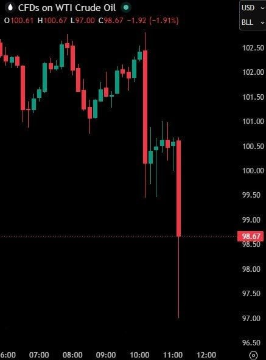

#فوری

قیمت نفت آمریکا بیش از ۷٪ کاهش یافته و به ۹۷ دلار در هر بشکه رسیده است پس از آنکه رئیس‌جمهور ترامپ گفت آمریکا در «مراحل نهایی» مذاکرات با ایران است.

@Dirty_Kids 👻

## Dirty_Kids — post 389812

  <a href="telegram/content/Dirty_Kids_389812_1779293772.mp4" target="_blank">🎬 Download video</a>

مصباح: اطاعت از احمدی‌نژاد اطاعت از خداست.🙂 پ‌ن: جنگ قدرت یا چی؟ 😉 @Dirty_Kids 👻

## Dirty_Kids — post 389811

  

مصباح: اطاعت از احمدی‌نژاد اطاعت از خداست.🙂

پ‌ن: جنگ قدرت یا چی؟ 😉

@Dirty_Kids 👻

## Dirty_Kids — post 389810

  <a href="telegram/content/Dirty_Kids_389810_1779293773.mp4" target="_blank">🎬 Download video</a>

“من الان تو اسرائیل ۹۹٪ محبوبیت دارم. می‌تونم برای نخست‌وزیری کاندیدا بشم. شاید بعد از اینکه [ریاست جمهوریم تموم شد]، برم اسرائیل و برای نخست‌وزیری نامزد بشم!”

@Dirty_Kids 👻

## Dirty_Kids — post 389809

  <a href="telegram/content/Dirty_Kids_389809_1779293774.mp4" target="_blank">🎬 Download video</a>

عرزشیا زدن به سیم آخر
چند روز دیگه رقص میله هم برامون میرن

@Dirty_Kids 👻

## Dirty_Kids — post 389808

  

اکانت رسمی تلگرام داخل اپلیکیشن ایکس، تو یه اقدام خیلی منطقی عکس مارک زاکربرگ (مالک فیسبوک و اینستاگرام) رو پست کرده نوشته:

من میتونم از متاورس (جهان مجازی) اینو سفارش بدم؟

@Dirty_Kids 👻

## Dirty_Kids — post 389807

قدیم فقط طالبی و خربزه و هندونه داشتیم
این ملون و شاه‌پسند و جانان یهو از کجا پیداشون شد حاجی؟

@Dirty_Kids 👻

## Dirty_Kids — post 389806

  

آقای پپ گواردیولا، مربی با دانش و مادرقحبه‌ی چپولِ جزامی!
همین که قهرمان نشدی و بعد از کلی هزینه نجومی مجبوری سیتی رو با ناکامی ترک کنی، برای من یک دنیا ارزش داره.

با آرزوی شکست های بیشتر و ناکامی های بزرگتر برای جنابعالی.

@Dirty_Kids 👻

## Dirty_Kids — post 389804

کولر آبی بوی امتحان نهایی میده.

@Dirty_Kids 👻

## Dirty_Kids — post 389803

  <a href="telegram/content/Dirty_Kids_389803_1779293777.mp4" target="_blank">🎬 Download video</a>

در سالگرد آنگوزمان شدن شهیدِ خدمت رئیسی بد نیست این ویدئو رو دوباره ببینیم…

راستی کسی از حلقوم رهبری خبری داره؟ اتفاقی براش افتاده؟ 😂

@Dirty_Kids 👻

## Hranews — post 113064

ضبط تجهیزات استارلینک؛ یک شهروند در هرمزگان بازداشت شد

❗️
❗️
❗️
❗️
❗️– فرماندهی انتظامی شهرستان خمیر واقع در استان هرمزگان در اطلاعیه‌ای از بازداشت یک شهروند در این شهرستان و ضبط تجهیزات اینترنت ماهواره‌ای استارلینک از وی خبر داد.

ادامه مطلب

↘️
@hranews_bot تماس ✉️ - @Hranews کانال هرانا 🆑

## Hranews — post 113063

بازماندگان از تحصیل بیشترین سهم از آمار خودکشی در خراسان شمالی را دارند

❗️
❗️
❗️
❗️
❗️– معاون اجتماعی و پیشگیری از وقوع جرم دادگستری خراسان شمالی اعلام کرد که طی پنج سال اخیر، بازماندگان از تحصیل، بالاترین سهم را در میان موارد #خودکشی در این استان به خود اختصاص داده‌اند.

ادامه مطلب

↘️
@hranews_bot تماس ✉️ - @Hranews کانال هرانا 🆑

## Hranews — post 113062

  

در نهمین روز بازداشت؛ خانواده مهدی شفاخواه همچنان از وضعیت او بی خبرند

❗️
❗️
❗️
❗️
❗️– کماکان از سرنوشت مهدی شفاخواه، فعال حوزه آموزش و حمایت از کودکان کار و ساکنان مناطق محروم که ۹ روز پیش در تهران بازداشت شد، اطلاعی حاصل نشده است. این وضعیت منجر به افزایش نگرانی‌های خانواده آقای شفاخواه شده است.

به گزارش خبرگزاری هرانا، ارگان خبری مجموعه فعالان حقوق بشر در ایران، مهدی شفاخواه، فعال اجتماعی کماکان در بازداشت به‌سر می‌برد.

یک منبع مطلع از وضعیت این فعال اجتماعی ضمن تایید این خبر به هرانا گفت: ۹ روز است که از بازداشت آقای شفاخواه می‌گذرد و وی همچنان از دسترسی به وکیل محروم مانده است. با وجود مراجعه برادر او، رضا شفاخواه، که خود وکیل دادگستری است، به خانواده اعلام شده که وی تنها امکان استفاده از وکلای مورد تأیید تبصره ماده ۴۸ را دارد.
همچنین، مراجعات مکرر خانواده این شهروند به مراجع قضایی و امنیتی برای کسب اطلاع از سرنوشت وی، تاکنون بی نتیجه بوده است.

#مهدی_شفاخواه

ادامه مطلب

↘️
@hranews_bot تماس ✉️ - @Hranews کانال هرانا 🆑

## Hranews — post 113061

زندان اوین؛ گزارشی از اعتصاب کریگ و لیندزی فورمن، زوج بریتانیایی

❗️
❗️
❗️
❗️
❗️– کریگ فورمن و لیندزی فورمن، دو شهروند بریتانیایی محبوس در زندان اوین، در اعتراض به شرایط نگهداری‌شان در زندان و قطع امکان برقراری تماس تلفنی با خانواده، دست به اعتصاب زده‌اند.

#کریگ_فورمن #لیندزی_فورمن

ادامه مطلب

↘️
@hranews_bot تماس ✉️ - @Hranews کانال هرانا 🆑

## officialrezapahlavi — post 1834

نسخه کامل گفتگو در نشست آینده تکنولوژی ایران

این نشست روز ۱۶ مه (۲۶ اردیبهشت) در محل دفتر مرکزی شرکت «اوبر» در شهر سان‌فرانسیسکو در ایالت کالیفرنیای آمریکا برگزار شد.

@OfficialRezaPahlavi

## manototv — post 105691

  <a href="telegram/content/manototv_105691_1779293780.mp4" target="_blank">🎬 Download video</a>

وزیر خارجه عربستان از تصمیم ترامپ برای تعویق حمله به ایران استقبال کرد.

فیصل بن فرحان، وزیر خارجه عربستان سعودی، در پیامی در شبکه اکس نوشت کشورش از تصمیم دونالد ترامپ برای دادن زمان بیشتر به مذاکرات با تهران استقبال می‌کند و ریاض از «فرصت دادن به دیپلماسی» برای پایان جنگ و بازگرداندن امنیت و آزادی کشتیرانی در تنگه هرمز حمایت می‌کند.

بن فرحان همچنین از جمهوری اسلامی خواست «فوراً» به تلاش‌ها برای پیشبرد مذاکرات و دستیابی به توافقی جامع پاسخ دهد.

## manototv — post 105690

  <a href="telegram/content/manototv_105690_1779293780.mp4" target="_blank">🎬 Download video</a>

انفجار خودروی متعلق به سازمان حمل‌ونقل نیویورک در نزدیکی وال‌استریت، باعث وحشت و فرار عابران شد.

ویدیوهای منتشرشده نشان می‌دهد این خودرو پس از آتش‌گرفتن، مقابل ساختمان مرکزی «ام‌تی‌ای» در منهتن به گلوله‌ای از آتش تبدیل شد.

آتش‌نشانی نیویورک اعلام کرد این حادثه تلفاتی نداشته و علت آن در دست بررسی است.

## manototv — post 105689

  <a href="telegram/content/manototv_105689_1779293782.mp4" target="_blank">🎬 Download video</a>

‌
الجزیره به نقل از «منابع دیپلماتیک» گزارش داد شمار کشورهای حامی پیش‌نویس قطعنامه درباره تنگه هرمز به ۱۳۶ کشور رسیده است.

پیش‌نویس این قطعنامه از جمهوری اسلامی می‌خواهد حملات و مین‌گذاری در تنگه هرمز را متوقف کند، اما دیپلمات‌ها می‌گویند در صورت مطرح شدن برای رأی‌گیری، احتمالاً با وتوی چین و روسیه روبه‌رو خواهد شد.

چین و روسیه ماه گذشته نیز قطعنامه مشابهی را که با حمایت آمریکا ارائه شده بود، وتو کرده بودند و آن را جانبدارانه علیه جمهوری اسلامی دانستند.

## manototv — post 105688

  <a href="telegram/content/manototv_105688_1779293783.mp4" target="_blank">🎬 Download video</a>

فرانسه پس از انتشار ویدیویی از برخورد با فعالان ناوگان امدادی عازم غزه، سفیر اسرائیل را احضار می‌کند. ایتالیا نیز پیش‌تر اقدام مشابهی انجام داده بود.
ژان‌نوئل بارو، وزیر خارجه فرانسه، رفتار ایتامار بن‌گویر، وزیر امنیت ملی اسرائیل از جناح راست افراطی، با فعالان بین‌المللی را «غیرقابل قبول» توصیف کرد و گفت پاریس خواهان توضیح رسمی از اسرائیل است.
این واکنش‌ها پس از انتشار ویدیویی از سوی بن‌گویر مطرح شد که او را در محل نگهداری فعالان «فلوتیلا گلوبال سومود» نشان می‌دهد؛ کاروانی متشکل از ده‌ها قایق و صدها فعال از کشورهای مختلف که چند روز پیش در آب‌های بین‌المللی، حدود ۲۵۰ مایل دریایی از غزه، توسط نیروی دریایی اسرائیل متوقف شد.
اسرائیل این کاروان را «تحریک‌آمیز» و حامی حماس توصیف کرده و فعالان را به بندر اشدود منتقل کرده است.
در ویدیوی منتشرشده، بن‌گویر در حالی که پرچم اسرائیل در دست دارد، مقابل فعالان دست‌بندزده می‌گوید: «به اسرائیل خوش آمدید، ما صاحب‌خانه‌ایم» و آن‌ها را «حامی تروریسم» می‌خواند. او همچنین از بنیامین نتانیاهو خواسته این افراد «برای مدت طولانی» در زندان نگهداری شوند.
این ویدیو در چند ساعت نخست بیش از ۱.۷ میلیون بار دیده شد و موجی از واکنش‌های تند را در اسرائیل و خارج از این کشور به‌دنبال داشت.
برخی مقام‌های اسرائیلی، از جمله گیدئون ساعر، وزیر خارجه اسرائیل، رفتار بن‌گویر را آسیب‌زننده به وجهه اسرائیل دانسته‌اند. دفتر نتانیاهو نیز با دفاع از توقیف ناوگان، اعلام کرده نحوه برخورد بن‌گویر «با ارزش‌ها و هنجارهای اسرائیل همخوانی ندارد» و خواستار اخراج سریع فعالان شده است.

## manototv — post 105687

  <a href="telegram/content/manototv_105687_1779293784.mp4" target="_blank">🎬 Download video</a>

‌
دونالد ترامپ، رئیس‌جمهوری آمریکا، با اشاره به وضعیت داخلی ایران گفت مطمئن نیست مقام‌های جمهوری اسلامی «خیر و صلاح مردم» را بخواهند.

ترامپ گفت: «بعضی از کارهایی که با من می‌کنند نشان می‌دهد که خیر مردم را نمی‌خواهند، در حالی که باید خیر مردم را بخواهند.»

او همچنین از افزایش نارضایتی عمومی در ایران سخن گفت و افزود: «الان خشم زیادی در ایران وجود دارد، چون مردم در شرایط بسیار بدی زندگی می‌کنند.»

رئیس‌جمهوری آمریکا همچنین گفت در ایران «ناآرامی و التهاب زیادی» وجود دارد که به گفته او، مشابه آن پیش‌تر دیده نشده است.

## manototv — post 105686

  <a href="telegram/content/manototv_105686_1779293786.mp4" target="_blank">🎬 Download video</a>

محمدباقر قالیباف، رئیس مجلس شورای اسلامی، در آنچه رسانه‌های حکومتی «سومین فایل صوتی» توصیف کرده‌اند از جمله گفته «تحرکات آشکار و پنهان دشمن نشان می‌دهد که طرف مقابل به‌دنبال آغاز دور جدیدی از جنگ است.»

## manototv — post 105685

  <a href="telegram/content/manototv_105685_1779293787.mp4" target="_blank">🎬 Download video</a>

مدیرعامل شرکت ملی نفت ابوظبی، اعلام کرده است امارات متحده عربی اجرای طرح ساخت یک خط لوله جدید برای دور زدن تنگه هرمز را پیش برده و این پروژه اکنون ۵۰ درصد پیشرفت داشته است.
در حال حاضر خط لوله عملیاتی امارات، خط لوله حبشان–فجیره است که از میادین نفتی حبشان در جنوب‌غرب ابوظبی تا بندر فجیره در دریای عمان امتداد دارد.
این خط لوله در حال حاضر توان انتقال تا ۱.۸ میلیون بشکه نفت در روز را دارد. تاسیسات نفتی فجیره از زمان آغاز جنگ چندین بار هدف حملات پهپادی منتسب به ایران قرار گرفته است.
بر اساس اعلام مقامات اماراتی، خط لوله جدید قرار است ظرفیت کل صادرات نفت این کشور را تا سال آینده دو برابر کند.

## manototv — post 105684

  <a href="telegram/content/manototv_105684_1779293788.mp4" target="_blank">🎬 Download video</a>

دادبان پیرامون پرونده اکباتان گزارش داده شعبه ۱۳ دادگاه کیفری یک استان تهران در رای جدید خود، اعلام کرده که در این پرونده امکان صدور حکم قصاص وجود ندارد. بر اساس حکم جدید، میلاد آرمون، علیرضا کفایی و امیرمحمد خوش‌اقبال به اتهام مشارکت در قتل عمد، هر کدام به پرداخت دیه کامل به‌صورت مساوی و تحمل ۵ سال حبس محکوم شده‌اند.
در همین پرونده، علیرضا برمرزپورناک، حسین نعمتی و نوید نجاران از اتهام مشارکت در قتل عمد تبرئه شده‌اند. دادگاه دلیل این تصمیم را نبود ادله کافی درباره این موضوع عنوان کرده که ضربه مرگبار دقیقا توسط چه فردی وارد شده است.
در رای صادر شده تاکید شده که هر چند متهمان در درگیری و ضرب‌وشتم آرمان علی‌وردی، بسیجی کشته‌شده در جریان اعتراضات سراسری ۱۴۰۱ حضور داشته‌اند، اما به دلیل مشخص نبودن عامل ضربه منجر به فوت، شرایط صدور حکم قصاص فراهم نیست.
این در حالی است که پیش‌تر همین شعبه در رای متفاوت، این شش متهم را به قصاص محکوم کرده بود؛ حکمی که بعدا با نظر دیوان عالی کشور نقض و برای رسیدگی مجدد به دادگاه بدوی بازگردانده شد.

## alonews — post 121356

  <a href="telegram/content/alonews_121356_1779293788.mp4" target="_blank">🎬 Download video</a>

👈ترامپ : برای موفقیت هیچ وقت احساس گناه نکن

✅ @AloNews خبر جنگ

## alonews — post 121355

  <a href="telegram/content/alonews_121355_1779293791.webm" target="_blank">🎬 Download video</a>

👈افراد مسلح در خودرویی به سمت یک خودروی پلیس در جاده‌ای در شهرستان سراوان در جنوب شرق ایران تیراندازی کردند که منجر به کشته شدن یک افسر پلیس شد، گزارش تسنیم.

🔴 عملیات امنیتی و انتظامی در منطقه در جریان است

✅ @AloNews خبر جنگ

## alonews — post 121354

  <a href="telegram/content/alonews_121354_1779293791.mp4" target="_blank">🎬 Download video</a>

👈ترامپ درباره ایران: همه چیز از بین رفته است.

🔴تنها سوال این است که آیا ما می‌رویم و کار را تمام می‌کنیم، یا آنها قرار است سندی را امضا کنند؟ ببینیم چه پیش می‌آید.

✅ @AloNews خبر جنگ

## alonews — post 121353

  <a href="telegram/content/alonews_121353_1779293793.webm" target="_blank">🎬 Download video</a>

👈معاون وزیر خارجه روسیه: مسکو آماده است برای مذاکرات بین ایران و آمریکا «دست یاری» دراز کند، اما قصد ندارد خدمات خود را تحمیل کند

🔴 سرگئی ریابکوف، معاون وزیر امور خارجه روسیه، می‌گوید مسکو در صورت لزوم آماده است برای مذاکرات بین ایران و آمریکا «دست یاری» دراز کند، اما قصد ندارد خدمات خود را تحمیل نماید.

✅ @AloNews خبر جنگ

## alonews — post 121352

  <a href="telegram/content/alonews_121352_1779293793.webm" target="_blank">🎬 Download video</a>

👈بن‌گیور، وزیر امنیت ملی اسرائیل، از فعالان بازداشت‌شده در کاروان جهانی صمود غزه در بندر آشدود بازدید کرد. 
🔴به اسرائیل خوش آمدید، ما اینجا در کنترل هستیم. این همان چیزی است که باید باشد. 
✅ @AloNews خبر جنگ

## alonews — post 121351

  <a href="telegram/content/alonews_121351_1779293793.webm" target="_blank">🎬 Download video</a>

👈الجزیره به نقل از منابع دیپلماتیک: تعداد کشورهای حامی پیش نویس قطعنامه تنگه هرمز در شورای امنیت به ۱۳۶ کشور رسیده است

✅ @AloNews خبر جنگ

## alonews — post 121350

  <a href="telegram/content/alonews_121350_1779293794.webm" target="_blank">🎬 Download video</a>

👈سفیر اسرائیل در واشنگتن: هر توافقی با ایران لزوماً باید بر پایۀ اصل عدم اعتماد باشد.

✅ @AloNews خبر جنگ

## alonews — post 121349

  <a href="telegram/content/alonews_121349_1779293794.webm" target="_blank">🎬 Download video</a>

👈رئیس‌جمهور سابق کوبا، رائول کاسترو، طبق گزارش رویترز و به نقل از یک مقام ارشد دولت ترامپ، در ایالات متحده متهم شده است

✅ @AloNews خبر جنگ

## alonews — post 121348

  <a href="telegram/content/alonews_121348_1779293794.webm" target="_blank">🎬 Download video</a>

👈لارنس نورمن خبرنگار وال استریت ژورنال، با اشاره به خبر العربیه: حس من این است که اتفاق مهمی در جریان است.

✅ @AloNews خبر جنگ

## alonews — post 121347

🚀 فروش کانفیگ استارلینک و VIP با سرعت بالا و اتصال پایدار 
💎 پلن‌های VIP 
📍 1 گیگ — 200 هزار تومان 
📍 3 گیگ — 600 هزار تومان 
⭐️ پلن‌های Starlink 
🔸 5 گیگ — 1.500 میلیون تومان 
🔸 10 گیگ — 2.900 میلیون تومان 
✅️ آی‌پی ثابت 
✅️ پشتیبانی ۲۴ ساعته 
✅️ کیفیت تضمینی…

## alonews — post 121346

  

🚀 فروش کانفیگ استارلینک و VIP با سرعت بالا و اتصال پایدار

💎 پلن‌های VIP

📍 1 گیگ — 200 هزار تومان

📍 3 گیگ — 600 هزار تومان

⭐️ پلن‌های Starlink

🔸 5 گیگ — 1.500 میلیون تومان

🔸 10 گیگ — 2.900 میلیون تومان

✅️ آی‌پی ثابت

✅️ پشتیبانی ۲۴ ساعته

✅️ کیفیت تضمینی

✅️ دارای ساب باقیمانده لحظه ای

✅️ متصل در تمامی دستگاه ها و اپراتور ها

🛫 خرید و پشتیبانی:

🏠 @expressuport

🤖 ربات خرید:

💻 @vpn_express_sup_bot

## alonews — post 121345

  <a href="telegram/content/alonews_121345_1779293795.webm" target="_blank">🎬 Download video</a>

👈ادعای سفیر اسرائیل در واشنگتن: هرگونه توافق احتمالی با ایران باید بر اساس اصل بی‌اعتمادی کامل و راستی‌آزمایی باشد

✅ @AloNews خبر جنگ

## alonews — post 121344

  <a href="telegram/content/alonews_121344_1779293795.webm" target="_blank">🎬 Download video</a>

👈ترامپ: شگفت‌آور است که جمهوری‌خواهان موقعیت بسیار مهم «پارلمانی» را در دست زنی به نام الیزابت مک‌دونو نگه داشته‌اند، کسی که مدت‌ها پیش توسط باراک حسین اوباما و دیوانه شرور شناخته‌شده به نام سناتور هری رید، که مجلس سنا را برای دموکرات‌ها با «مشت آهنین» اداره می‌کرد، منصوب شده بود. در طول سال‌ها، او برای جمهوری‌خواهان بی‌رحم بود، اما برای دموکرات‌ها این‌گونه نبود - پس چرا جایگزینش نکردند؟ افراد عادل زیادی وجود دارند که برای آن موقعیت حیاتی واجد شرایط هستند.

🔴جمهوری‌خواهان بازی بسیار نرم‌تری نسبت به دموکرات‌ها انجام می‌دهند. این بزرگ‌ترین عیب در سیاست است. دموکرات‌ها تقلب می‌کنند، دروغ می‌گویند و می‌دزدند، به‌ویژه وقتی که موضوع آرا در انتخابات است، اما به هم وفادارند، در حالی که جمهوری‌خواهان اجازه می‌دهند الیزابت مک‌دونو در قدرت بماند و بی‌رحمی ما ادامه یابد. ما باید قانون نجات آمریکا را تصویب کنیم، و همین حالا - و همچنین باید تعلل را از بین ببریم، که همه چیز را به ما خواهد داد! اگر حداقل یکی از این دو قانون را سریع تصویب نکنیم، دیگر هرگز رئیس‌جمهور جمهوری‌خواهی نخواهید دید. دموکرات‌ها دو ایالت اضافی، پایتخت و پورتوریکو، و همه پیامدهای آن، از جمله

🔴۴ عضو در مجلس سنا، چندین عضو کنگره، چندین رای انتخاباتی اضافی، و همچنین رویای خود را برای دادگاه عالی ایالات متحده با ۲۱ قاضی مورد علاقه‌شان به دست خواهند آورد.

🔴دموکرات‌ها در اولین روزی که فرصت داشته باشند، تعلل را از بین خواهند برد.

🔴جمهوری‌خواهان این کار را نمی‌کنند چون می‌گویند دموکرات‌ها هرگز این کار را نخواهند کرد، اما جمهوری‌خواهان اشتباه می‌کنند. هوشمند و سخت باشید، وگرنه خیلی زودتر از آنچه فکر می‌کنید همه‌تان دنبال کار خواهید گشت!



✅ @AloNews خبر جنگ

## alonews — post 121343

  <a href="telegram/content/alonews_121343_1779293796.webm" target="_blank">🎬 Download video</a>

🔴فوری / ترامپ: آمریکا در «مراحل نهایی» مذاکرات با ایران است

✅ @AloNews خبر جنگ

## alonews — post 121342

  <a href="telegram/content/alonews_121342_1779293796.webm" target="_blank">🎬 Download video</a>

👈 تحرکات سنگین نظامی آمریکا به سمت خاورمیانه همچنان ادامه دارد.

✅ @AloNews خبر جنگ

## alonews — post 121341

  <a href="telegram/content/alonews_121341_1779293796.webm" target="_blank">🎬 Download video</a>

👈مارک روته، دبیرکل ناتو، روز چهارشنبه گفت که کاهش تدریجی نیروهای آمریکایی در اروپا به صورت ساختاریافته انجام خواهد شد که برنامه‌های دفاعی ناتو را تحت تأثیر قرار نخواهد داد و این تعدیلات را پاسخی منطقی به افزایش هزینه‌های دفاعی توسط متحدان اروپایی و کانادا توصیف کرد، به گزارش رویترز.

🔴 روت افزود که بحث‌ها درباره سهم آمریکا در ناتو در مواقع بحران بیش از یک سال پیش آغاز شده است

✅ @AloNews خبر جنگ

## alonews — post 121340

  <a href="telegram/content/alonews_121340_1779293796.webm" target="_blank">🎬 Download video</a>

👈معاون وزیر خارجه روسیه: مسکو آماده است برای مذاکرات بین ایران و آمریکا «دست یاری» دراز کند، اما قصد ندارد خدمات خود را تحمیل کند

🔴 سرگئی ریابکوف، معاون وزیر امور خارجه روسیه، می‌گوید مسکو در صورت لزوم آماده است برای مذاکرات بین ایران و آمریکا «دست یاری» دراز کند، اما قصد ندارد خدمات خود را تحمیل نماید

✅ @AloNews خبر جنگ

## alonews — post 121339

  <a href="telegram/content/alonews_121339_1779293796.webm" target="_blank">🎬 Download video</a>

👈وزیر امور خارجه عربستان سعودی:
ما از واکنش رئیس جمهور آمریکا در اعطای فرصت به مذاکرات برای دستیابی به توافقی که به جنگ پایان دهد، بسیار قدردانی می‌کنیم.

✅ @AloNews خبر جنگ

## alonews — post 121338

  <a href="telegram/content/alonews_121338_1779293797.webm" target="_blank">🎬 Download video</a>

👈نیروهای دفاعی اسرائیل هشدار تخلیه برای حبوبش و دیر الزهرانی در جنوب لبنان صادر کرده‌اند پیش از حملات اسرائیل در پاسخ به «نقض آتش‌بس توسط حزب‌الله».

🔴 از ساکنان خواسته شده حداقل ۱ کیلومتر از روستا فاصله بگیرند

✅ @AloNews خبر جنگ

## alonews — post 121337

  <a href="telegram/content/alonews_121337_1779293797.webm" target="_blank">🎬 Download video</a>

👈ترامپ درباره کوبا: آمریکا تحمل یک دولت سرکش که عملیات نظامی، اطلاعاتی و تروریستی خصمانه را تنها نود مایل از خاک آمریکا پناه می‌دهد، نخواهد داشت و تا زمانی که مردم کوبا دوباره آزادی‌ای را که اجدادشان بیش از ۱۰۰ سال پیش با شجاعت برای آن جنگیدند به دست نیاورند، آرام نخواهیم نشست

🔴رژیم هاوانا امروز خیانت مستقیم به ملتی است که پدران بنیان‌گذار آن برایش خون دادند و جان باختند

✅ @AloNews خبر جنگ

---
📅 بروزرسانی: 1405/02/30 16:02
---

## VahidOOnLine — post 241133

  <a href="telegram/content/VahidOOnLine_241133_1779280331.mp4" target="_blank">🎬 Download video</a>

امارات متحده عربی، چند روز پس از حمله پهپادی به نیروگاه هسته‌ای براکه در ابوظبی، از عراق خواست فوراً مانع هرگونه «اقدام خصمانه» از خاک خود شود.
وزارت خارجه امارات در بیانیه‌ای تأکید کرد دولت عراق باید بدون قید و شرط از انجام حملات از خاک این کشور جلوگیری کرده و تهدیدها را سریع و مسئولانه مهار کند.
ابوظبی همچنین از عراق خواست برای حفظ امنیت و ثبات منطقه نقش فعال‌تری ایفا کند و جایگاه خود را به‌عنوان «شریکی مسئول» در منطقه تقویت کند.
‌🏁 🇬🇧 ManotoTV

🤖 @VahidOOnLine

## VahidOOnLine — post 241132

  <a href="telegram/content/VahidOOnLine_241132_1779280332.mp4" target="_blank">🎬 Download video</a>

هم‌زمان با قهرمانی آرسنال، کاربران شبکه‌های اجتماعی از عارف جعفرزاده، هوادار این تیم و از جاویدنام‌های رشت، یاد کردند.

عارف جعفرزاده، اهل رشت، در جریان اعتراضات دی‌ماه ۱۴۰۴ جان باخت. بنیاد عبدالرحمن برومند سن او را ۳۴ سال، محل کشته‌شدن را رشت در استان گیلان و تاریخ جان‌باختن او را ۲۰ دی ۱۴۰۴ ثبت کرده و نحوه کشته‌شدن را «اعدام خودسرانه» عنوان کرده است.

علاقه عارف به آرسنال پیش‌تر نیز مورد توجه کاربران قرار گرفته بود. حالا با قهرمانی این تیم، نام او بار دیگر در شبکه‌های اجتماعی بازتاب یافته و کاربران با انتشار تصویری از مزارش نوشته‌اند: «جا دارد قهرمانی آرسنال را به جاویدنام عارف جعفرزاده تبریک بگوییم.»
‌🏁 🇬🇧 ManotoTV

🤖 @VahidOOnLine

## VahidOOnLine — post 241131

  

سنتکام، فرماندهی مرکزی آمریکا، اعلام کرد از زمان آغاز محاصره دریایی جنوب ایران، تا روز چهارشنبه نیروهای این کشور ۹۰ کشتی را تغییر مسیر داده‌اند. سنتکام نوشت: «چهار کشتی نیز برای تضمین اجرای محاصره دریایی از کار انداخته‌ شده‌اند.»

سنتکام همچنین با انتشار همچنین تصویری از یک بالگرد تهاجمی «ای‌اچ-۱ زد وایپر» متعلق به نیروی تفنگداران دریایی آمریکا منتشر کرد و نوشت که در جریان عملیات این محاصره دریایی، این بالگرد در نزدیکی یک کشتی تجاری در حال عبور از آب‌های منطقه‌ای گشت‌زنی می‌کند.
‌🏁 🇬🇧 IranintlTV

🤖 @VahidOOnLine

## VahidOOnLine — post 241130

  <a href="telegram/content/VahidOOnLine_241130_1779280334.mp4" target="_blank">🎬 Download video</a>

رویترز گزارش داد سه نفتکش غول‌پیکر چینی و کره‌جنوبی حامل حدود ۶ میلیون بشکه نفت خاورمیانه، پس از بیش از دو ماه توقف در خلیج فارس، از ۷تنگه هرمز عبور کرده و راهی بازارهای آسیایی شده‌اند.
بر اساس این گزارش، دو نفتکش چینی حامل نفت عراق و قطر و یک نفتکش کره‌جنوبی حامل نفت کویت، از مسیر تعیین‌شده از سوی جمهوری‌اسلامی عبور کرده‌اند.
‌🏁 🇬🇧 ManotoTV

🤖 @VahidOOnLine

## VahidOOnLine — post 241129

⭕️ملاقات ملونی و مودی در رم؛ نخستین سفر رسمی نخست وزیر هند به ایتالیا در ۲۶ سال گذشته

♦️جورجا ملونی، نخست‌وزیر ایتالیا روز چهارشنبه ۳۰ اردیبهشت ماه از نارندرا مودی، نخست وزیر هند در مجموعه تاریخی «ویلا دوریا پامفیلی» دیدار و گفت‌وگو کرد. این سفر، نخستین سفر یک نخست‌وزیر هند به ایتالیا در ۲۶ سال گذشته برای سفری رسمی با هدف ملاقات رهبران دو کشور به شمار می‌رود.

مودی که در حال پایان‌دادن به سفر دوره‌ای اروپایی خود است، پیش‌تر برای نشست گروه ۲۰ در سال ۲۰۲۱ و اجلاس گروه ۷ در سال ۲۰۲۴ به ایتالیا سفر کرده بود.

گسترش همکاری‌های اقتصادی، فناوری و امنیتی از محورهای اصلی گفت‌وگوهای دو طرف عنوان شده است.
‌🇸🇦 Indypersian

🤖 @VahidOOnLine

## VahidOOnLine — post 241128

  

♦️رسانه‌های داخلی ایران و کانال‌های ارتباطی منسوب به مجتبی خامنه‌ای، رهبر جمهوری اسلامی روز چهارشنبه ۳۰ اردیبهشت ماه پیامی منتسب به او را به مناسبت دومین سالگرد کشته شدن ابراهیم رئیسی، رئیس جمهوری پیشین جمهوری اسلامی ایران را منتشر کردند.

در این پیام، مجتبی خامنه‌ای با تقدیر از عملکرد ابراهیم رئیسی، دوره ناتمام ریاست او بر دولت جمهوری اسلامی را «مقیاسی از تلاش و دلسوزی برای ملت و کشور در عین حفظ استقلال» توصیف کرده است.
از زمان انتصاب مجتبی خامنه‌ای به رهبری در بحبوحه جنگ، هیچ صدا و تصویری از او منتشر نشده است. دو روز پیش، حسین کرمان‌پور، مدیر مرکز روابط عمومی و اطلاع‌رسانی وزارت بهداشت گفته بود که نه صورت مجتبی خامنه‌ای آسیب دیده و نه پای او قطع شده است.
‌🇸🇦 Indypersian

🤖 @VahidOOnLine

## VahidOOnLine — post 241127

  

♦️نمایندگان کنست، پارلمان اسرائیل روز چهارشنبه ۳۰ اردیبهشت در شور اول به لایحه قانونی  انحلال مجلس و برگزاری انتخابات زودهنگام رای مثبت دادند.

به گزارش خبرگزاری فرانسه، ۱۱۰ نماینده از مجموع ۱۲۰ عضو کنست به این لایحه که از طرف ائتلاف حاکم، حزب لیکود به رهبری نتانیاهو و دیگر احزاب راست و راست‌گرا، ارائه شده بود، رای مثبت دادند.

در صورت موافقت نمایندگان با این لایحه، پارلمان اسرائیل احتمالا در هفته‌های آینده و برای برگزاری انتخابات زودهنگام، منحل خواهد شد.
‌🇸🇦 Indypersian

🤖 @VahidOOnLine

## VahidOOnLine — post 241126

  

♦️روسیه و چین در یک بیانیه مشترک که در جریان سفر ولادیمیر پوتین به پکن صادر شد، با تاکید بر «دوستی عمیق دو کشور» از آنچه «ماجراجویی‌های نظامی و ترور رهبران کشورهای مستقل» خواندند، انتقاد کردند.

در بیانیه مشترک شی و پوتین که در پایگاه‌های اطلاع‌رسانی دولت‌های دو کشور منتشر شده، پکن و مسکو بدون اشاره مستقیم به آمریکا «ماجراجویی‌های نظامی» را محکوم کرده‌اند و از آنچه  «حملات نظامی غافلگیرانه به کشورهای دیگر»، «استفاده مزورانه از مذاکرات برای آماده‌سازی حملات»، «ترور رهبران کشورهای مستقل»، «بی‌ثبات کردن اوضاع داخلی کشورها» و «تلاش برای تغییر حکومت» انتقاد کردند.

شی و پوتین بدون اشاره به عملیات بازداشت نیکلاس مادورو، رئیس جمهوری پیشین ونزوئلا «ربودن آشکار رهبران کشورها برای محاکمه» را محکوم کردند.

رهبران چین و روسیه این رویه را به‌عنوان «نقض فاحش منشور ملل متحد» توصیف کرده‌اند.
‌🇸🇦 Indypersian

🤖 @VahidOOnLine

## VahidOOnLine — post 241125

  

♦️اسماعیل بقائی، سخنگوی وزارت امور خارجه جمهوری اسلامی، روز چهارشنبه ۳۰ اردیبهشت‌ماه درباره گمانه‌زنی‌ها راجع به سفر عباس عراقچی به نیویورک گفت:  «وزیر خارجه ایران برای شرکت در نشست شورای امنیت سازمان ملل درباره صلح و امنیت بین‌المللی دعوت شده، اما حضور او هنوز قطعی نیست.»

به گفته سخنگوی وزارت امور خارجه جمهوری اسلامی «این نشست به ریاست دوره‌ای چین در شورای امنیت، روز پنجم خرداد برگزار خواهد شد، اما با توجه به برنامه کاری فشرده وزیر امور خارجه»، تصمیم نهایی درباره سفر هنوز گرفته نشده است.»

این اظهارات پس از آن مطرح شد که علی خضریان، عضو کمیسیون امنیت ملی مجلس، در یک برنامه تلویزیونی نسبت به احتمال سفر عراقچی به نیویورک برای مذاکره درباره تنگه هرمز انتقاد کرده بود.
‌🇸🇦 Indypersian

🤖 @VahidOOnLine

## VahidOOnLine — post 241124

  <a href="telegram/content/VahidOOnLine_241124_1779280339.mp4" target="_blank">🎬 Download video</a>

سخنگوی وزارت خارجه جمهوری‌اسلامی اعلام کرده با توجه به ریاست دوره‌ای چین بر شورای امنیت سازمان ملل و برنامه پکن برای برگزاری «نشست ویژه وزیران خارجه درباره صلح و امنیت بین‌المللی»، از عباس عراقچی، وزیر خارجه نظام اسلامی، برای حضور در این نشست در نیویورک دعوت شده است.
‌🏁 🇬🇧 ManotoTV

🤖 @VahidOOnLine

## VahidOOnLine — post 241123

  <a href="telegram/content/VahidOOnLine_241123_1779280340.mp4" target="_blank">🎬 Download video</a>

کناره گیری محمدباقر قالیباف از ریاست هیئت‌ مذاکره کننده جمهوری‌اسلامی در مذاکرات با آمریکا،‌ از سوی رییس مرکز ارتباطات، رسانه و امور فرهنگی مجلس شورای اسلامی تکذیب شده است.
‌🏁 🇬🇧 ManotoTV

🤖 @VahidOOnLine

## VahidOOnLine — post 241122

  <a href="telegram/content/VahidOOnLine_241122_1779280341.mp4" target="_blank">🎬 Download video</a>

خبرگزاری رسمی اردن گزارش داد که نیروهای مسلح این کشور صبح امروز یک پهپاد ناشناس را که وارد حریم هوایی اردن شده بود، سرنگون کردند.
ارتش اردن این پهپاد را در استان جرش، در منطقه بلیلا در شمال کشور، هدف قرار داد. این حادثه تلفات جانی نداشت، اما خسارت‌های جزئی مادی بر جای گذاشت.
‌🏁 🇬🇧 ManotoTV

🤖 @VahidOOnLine

## VahidOOnLine — post 241121

  <a href="telegram/content/VahidOOnLine_241121_1779280342.mp4" target="_blank">🎬 Download video</a>

خبرگزاری رسمی اردن گزارش داد که نیروهای مسلح این کشور صبح امروز یک پهپاد ناشناس را که وارد حریم هوایی اردن شده بود، سرنگون کردند.
ارتش اردن این پهپاد را در استان جرش، در منطقه بلیلا در شمال کشور، هدف قرار داد. این حادثه تلفات جانی نداشت، اما خسارت‌های جزئی مادی بر جای گذاشت.
‌🏁 🇬🇧 ManotoTV

🤖 @VahidOOnLine

## VahidOOnLine — post 241120

  

رسانه رهبر جمهوری اسلامی پیامی منتسب به مجتبی خامنه‌ای به مناسبت دومین سالگرد ابراهیم رئیسی منتشر کرد.

در این پیام آمده است «خصوصیات رئیسی موجب دلگرم شدن دوستان ایران از جمله مجاهدان جبهه قدرتمند مقاومت و بسیاری از دلسوزان نظام می‌شد.»

ویژگی‌های ابراهیم رئیسی در این پیام «مسئولیت‌پذیری، جوانگرایی، توجه به عدالت، دیپلماسی فعال و نافع و به‌ویژه مردمی بودن» عنوان شده است.
‌🏁 🇬🇧 IranintlTV

🤖 @VahidOOnLine

## VahidOOnLine — post 241119

  <a href="telegram/content/VahidOOnLine_241119_1779280343.mp4" target="_blank">🎬 Download video</a>

♦️همزمان با تشدید گمانه‌زنی‌ها درباره حمله مجدد آمریکا به ایران و از سرگیری جنگ، خبرگزاری رویترز روز چهارشنبه ۳۰ اردیبهشت‌ماه تصاویری از حضور تعداد زیادی از هواپیماهای سوخت‌رسان ارتش ایالات متحده در فرودگاه بین‌المللی بن‌گوریون تل آویو را منتشر کرد.

دونالد ترامپ با اینکه گفته است به زودی به جنگ با ایران خاتمه خواهد داد، روز سه‌شنبه بار دیگر اعلام کرد که ممکن است بار دیگر حمله‌ای سخت به ایران را انجام دهد.

مذاکرات پایان دادن به جنگ، با میانجیگری پاکستان از هفته‌ها پیش به بن‌بست رسیده است. بنیامین نتانیاهو، نخست وزیر اسرائیل هم از آمادگی کامل این کشور برای ورود دوباره به جنگ سخن گفته است.
‌🇸🇦 Indypersian

🤖 @VahidOOnLine

## VahidOOnLine — post 241118

  

ایمان شمسایی، رییس مرکز ارتباطات، رسانه و امور فرهنگی مجلس، خبر استعفای محمدباقر قالیباف از ریاست هیات مذاکره‌کننده جمهوری اسلامی را «کذب محض و دروغی آشکار» خواند و منتشرکنندگان آن را به «خیانت» متهم کرد.

او در پیامی نوشت ادعای این جریان «امتداد همان خط تخریبی است که تا دیروز فرماندهان را نشانه می‌رفت و امروز شهدای والامقام را».

شمسایی افزود این جریان سابقه «هجمه» به فرماندهان نظامی، دفتر رهبر جمهوری اسلامی، مراجع تقلید و شورای عالی امنیت ملی را در کارنامه دارد.

در ادامه پیام او آمده است: «شایسته است این آقایان برای توجیه خیانت خود در شرایط جنگی پشت ژست‌های انقلابی پنهان نشوند و بیش از این به توجیه رفتارهای آسیب‌زای خود در شرایط حساس کنونی نپردازند.»

شمسایی تاکید کرد قالیباف همچنان ریاست هیات مذاکره‌کننده حکومت را بر عهده دارد و به‌تازگی نیز به پیشنهاد مسعود پزشکیان و تایید مجتبی خامنه‌ای، به‌عنوان نماینده ویژه جمهوری اسلامی در امور چین منصوب شده است.

در هفته‌های اخیر، گزارش‌های متعددی درباره اختلاف در ساختار حاکمیت جمهوری اسلامی منتشر شده است.
‌🏁 🇬🇧 IranintlTV

🤖 @VahidOOnLine

## VahidOOnLine — post 241117

  <a href="telegram/content/VahidOOnLine_241117_1779280347.mp4" target="_blank">🎬 Download video</a>

خبرگزاری حکومتی تسنیم گزارش داد که محسن نقوی، وزیر کشور پاکستان، برای دیدار و گفت‌وگو با مقام‌های جمهوری‌اسلامی راهی تهران شده است. این دومین سفر نقوی به تهران در طول یک هفته گذشته و در راستای تلاش‌های اسلام‌آباد برای میانجی‌گری میان جمهوری‌اسلامی و آمریکا است.
‌🏁 🇬🇧 ManotoTV

🤖 @VahidOOnLine

## VahidOOnLine — post 241116

  <a href="telegram/content/VahidOOnLine_241116_1779280348.mp4" target="_blank">🎬 Download video</a>

خبرگزاری رسمی اردن گزارش داد که نیروهای مسلح این کشور صبح امروز یک پهپاد ناشناس را که وارد حریم هوایی اردن شده بود، سرنگون کردند.
ارتش اردن این پهپاد را در استان جرش، در منطقه بلیلا در شمال کشور، هدف قرار داد. این حادثه تلفات جانی نداشت، اما خسارت‌های جزئی مادی بر جای گذاشت.
‌🏁 🇬🇧 ManotoTV

🤖 @VahidOOnLine

## VahidOOnLine — post 241115

  <a href="telegram/content/VahidOOnLine_241115_1779280349.mp4" target="_blank">🎬 Download video</a>

دیروز، هم‌زمان با زادروز جاویدنام پیام رخ‌بخش، خانواده و نزدیکان او بر سر مزارش در شیراز حاضر شدند و یادش را گرامی داشتند.

پیام رخ‌بخش، جوان ۳۲ ساله اهل شیراز، در ۱۹ دی‌ماه ۱۴۰۴ در جریان اعتراضات مردمی با شلیک مستقیم نیروهای حکومتی جان باخت.

حضور بر سر مزار جان‌باختگان، برای خانواده‌ها فقط سوگواری نیست؛ ادامه همان دادخواهی‌ای است که جمهوری اسلامی از آن هراس دارد.

#خانه_دوست_کجاست
‌🏁 🇬🇧 ManotoTV

🤖 @VahidOOnLine

## VahidOOnLine — post 241114

  <a href="telegram/content/VahidOOnLine_241114_1779280351.mp4" target="_blank">🎬 Download video</a>

بر اساس یک نظرسنجی جدید، اکثریت بزرگی از جمهوری‌خواهان همچنان عملکرد دونالد ترامپ در مدیریت جنگ ایران را تأیید می‌کنند.
طبق نظرسنجی انجام‌شده توسط خبرگزاری آسوشیتدپرس و مرکز پژوهش‌های امور عمومی نورک، در حالی که تنها یک‌سوم بزرگسالان آمریکایی از رویکرد رئیس‌جمهور حمایت می‌کنند، حدود دو‌سوم جمهوری‌خواهان با نحوه عملکرد او موافق هستند.
با این حال، بر اساس نظرسنجی ماه گذشته، جمهوری‌خواهان جوان‌تر بیشتر احتمال دارد که از عملکرد ترامپ در این موضوع ناراضی باشند.
علاوه بر این، تنها ۶ نفر از هر ۱۰ جمهوری‌خواه (در مقایسه با ۸ نفر از هر ۱۰ نفر در ماه فوریه) از نحوه مدیریت اقتصاد توسط رئیس‌جمهور حمایت می‌کنند؛ اقتصادی که تحت تأثیر جنگ قرار گرفته است.
‌🏁 🇬🇧 ManotoTV

🤖 @VahidOOnLine

## WithYashar — post 11749

العربیه: آمریکا به پاکستان اطلاع داده که در موضوع هسته‌ای و تنگه هرمز هیچ امتیازی نخواهد داد.
@withyashar

## WithYashar — post 11748

شبکه الحدث: جمهوری اسلامی و پاکستان در خصوص مذاکرات دچار اختلاف‌نظر شده‌اند
الحدث گزارش داد در دو هفته گذشته، همکاری میان حکومت ایران و پاکستان با چالش‌هایی روبه‌رو شده و فضای بی‌اعتمادی بر سطح هماهنگی‌های دو طرف سایه انداخته است.
این رسانه افزود میان تهران و اسلام‌آباد درباره کانال‌های مذاکره و محل برگزاری گفت‌وگوها اختلاف‌نظر وجود دارد.
بر اساس این گزارش، پاکستان از ایجاد کانال‌های ارتباطی جدید میان تهران و واشینگتن ابراز نارضایتی کرده است.
@withyashar

## WithYashar — post 11747

## WithYashar — post 11746

## WithYashar — post 11743

فال حافظ محمد رضا پهلوی…
فلک به مردم نادان دهد زمام مراد
تو اهل فضلی و دانش همین گناهت بس
@withyashar
عکس اون روز هم به دقیق ترین حالت ممکن براتون بازسازی کردم
@withyashar

## WithYashar — post 11742

من رفیق نیمه راه نیستم! مرسی از پیغام های زیباتون 😃 تازه خلیلی هم خوش مسافرتم اینو همه دوستام میدونن ، شما هم دیگه متوجه شدید 🤣🙌🏾

## WithYashar — post 11741

## WithYashar — post 11740

## WithYashar — post 11739

## mwarmonitor — post 9343

  

🇺🇸یک بالگرد تهاجمی AH-1Z وایپر نیروی تفنگداران دریایی ایالات متحده در نزدیکی یک کشتی تجاری که در آب‌های منطقه‌ای در حال عبور است، گشت‌زنی می‌کند؛ هم‌زمان نیروهای آمریکایی در حال اجرای محاصره دریایی علیه ایران هستند.
تا تاریخ ۲۰ مه، نیروهای آمریکا برای اطمینان از رعایت این محاصره، مسیر ۹۰ کشتی را تغییر داده و ۴ کشتی را از کار انداخته‌اند.

@mwarmonitor

## mwarmonitor — post 9342

  

🔴ایران تهدید کرد در صورت عملی شدن تهدید «ضربهٔ بزرگ» ترامپ، به کشورهایی خارج از خاورمیانه حمله خواهد کرد. نیویورک پست

@mwarmonitor

## mwarmonitor — post 9341

  

🚢چند نفتکش امروز از تنگه هرمز عبور کردند، از مسیر عوارضی ایران:

🇰🇷 UNIVERSAL WINNER (IMO: 9837602)
از کویت به کره جنوبی

🇭🇰 OCEAN LILY (IMO: 9284960)
از امارات به چین

🇵🇦 DEEPBLUE (IMO: 9350862)
از عمان به امارات

🇨🇾 GRAND LADY (IMO: 9406166)
از چین مقصد نامشخص در خلیج فارس

@mwarmonitor

## mwarmonitor — post 9340

🔴ناو جنگی ترامپ مانند ناو هواپیمابر فورد با سوخت هسته‌ای کار خواهد کرد

📝کالین دمارست AXIOS

🔰به گفته دریاسالار داریل کاودل (Daryl Caudle)، فرمانده عملیات نیروی دریایی، ناو جنگی کلاس ترامپ که هزینه ساخت اولین فروند از آن بیش از ۱۷ میلیارد دلار برآورد شده است، مجهز به پیشران هسته‌ای خواهد بود.

🔸چرا این موضوع اهمیت دارد؟
این اعلامیه به ماه‌ها بحث و گمانه‌زنی درباره نحوه حرکت و سرعت جابه‌جایی این ناو جنگی پایان می‌دهد.
رهبری نیروی دریایی تا اواخر آوریل، پیشران هسته‌ای را «بعید» توصیف کرده بود. مشخصاتی که برای نخستین بار ماه‌ها پیش منتشر شد، مدام در حال تغییر و تحول بوده‌اند.
🔹اظهار نظرها
کاودل در جریان شهادت خود در کنگره گفت: «من بسیار هیجان‌زده‌ام که سرانجام روی این موضوع به توافق رسیدیم که این ناو هسته‌ای خواهد بود.»
او افزود: «ما برای تحویل سریع‌تر، گزینه‌های مختلف از جمله سوخت‌های متعارف را بررسی کردیم و در نهایت دوباره به نقطه اول برگشتیم تا آن را هسته‌ای کنیم. این دقیقاً پاسخ درست است.»
🔸جزئیات بیشتر
این ناو جنگی به همان نیروگاهی مجهز خواهد شد که در ناو هواپیمابر جرالد آر. فورد (Gerald R. Ford) — بزرگترین کشتی جنگی جهان — به کار رفته است؛ یعنی راکتور A1B.
کاودل گفت: «تمام فناوری‌هایی که از منظر بخش راکتور در طراحی ناو جنگی هسته‌ای به کار می‌روند، همگی فناوری‌های انتقالی و اقتباس‌شده از کلاس فورد هستند؛ همان‌طور که بیشتر سیستم‌های رزمی، سیستم‌های راداری و سیستم‌های موشکی نیز همین‌گونه‌اند. آنچه جدید است، شکل بدنه (Hull form) آن است.»
نکته جالب توجه
ناوهای هواپیمابر در حال حاضر تنها کشتی‌های سطحی با پیشران هسته‌ای در ناوگان نیروی دریایی ایالات متحده هستند.
🔹گام بعدی چیست؟
به گزارش نشریه بریکینگ دیفنس (Breaking Defense)، نیروی دریایی خواهان ساخت ۱۵ فروند از این ناوهای جنگی تا سال ۲۰۵۶ است. هزینه ساخت سه فروند اول آن بیش از ۴۳ میلیارد دلار خواهد بود.

@mwarmonitor

## mwarmonitor — post 9339

  

📝 واقعاً مبارکه! بالاخره با اقتدار رسیدیم به قله؛ جایی که خریدن یک رول کیسه فریزر ۵۰۰ عددی، دیگر یک خرید معمولی نیست، بلکه با قیمت یک میلیون و صد و هشتاد و پنج هزار تومان، رسماً یک سرمایه‌گذاری استراتژیک و فوق‌لاکچری حساب می‌شه. اگر این رسیدن به قله نیست پس چیه؟ آدم دلش خون می‌شه وقتی می‌بینه تو همین وضعیت، یه مشت حرومزاده شب‌ها وسط میدان پرچم‌گردانی می‌کنن و شعار شبانه می‌دن، یا اونایی که بی‌خیالِ دنیا، در حال دور دور کردن، کافه‌گردی و شرکت در کلاس‌های جورواجور ادای هستن. مگه میشه یک رول پلاستیک ۱,۱۸۵,۰۰۰ تومان باشه و جگر آدم خون نشه؟ توی این قله‌ای که برای ما ساختید، تف و لعنت کمترین میزان نفرت برای شماست؛ بفرمایید کاپوچینویتان را بنوشید و دور دور کنید، تا می‌تونید کثافت‌کاریاتون رو ادامه بدید و به ریش این مردم بخندید، ولی این نفرتِ انباشته‌شده بالاخره یه جا خفت همه‌تون رو می‌چسبه!

@mwarmonitor

## FoxNewsTwitter — post 341980

  <a href="telegram/content/FoxNewsTwitter_341980_1779280356.mp4" target="_blank">🎬 Download video</a>

Fox News (Twitter/X)

WATCH: New video shows U.S. combat operations in the Middle East unfolding in real time.

CENTCOM enforces the American naval blockade against Iran, sharing that U.S. forces have now redirected 89 commercial vessels to stop traffic in and out of Iranian ports as the operation escalates across the region.

## FoxNewsTwitter — post 341979

‌Fox News (Twitter/X)

Read more:

## FoxNewsTwitter — post 341978

  

Fox News (Twitter/X)

“Dumb motherf****** didn’t deserve to live.”

Far-left Democrat Senate candidate Graham Platner mocking a U.S. soldier who was shot four times in Afghanistan in a resurfaced Reddit comment.

The post made fun of Purple Heart recipient Pfc. Ted Daniels after he took incoming fire during a 2012 clash with the Taliban.

Platner’s now deleted comment went on to say:

"At least his stupidity and fat ass wheezing are available for all future infantrymen to witness and hold in contempt. Poor marksmanship on the Taliban's part is the only reason this mouthbreather made it home, he managed to make every possible s*** decision possible when it comes to small unit combat."

## FoxNewsTwitter — post 341977

  

Fox News (Twitter/X)

NEW: Trump-backed Republicans rack up major primary victories across the country.

Nearly 30 candidates endorsed by President Trump secure wins in congressional and statewide races across Kentucky, Georgia, Pennsylvania, and Alabama, including high-profile Senate and governor contests.

Trump-backed Ed Gallrein defeated incumbent Kentucky GOP Rep. Thomas Massie in what turned out to be the most expensive House primary in U.S. history.

Also in Kentucky, Congressman Andy Barr won the GOP Senate primary and is seen as the heavy favorite to replace outgoing Senator Mitch McConnell.

Alabama Senator Tommy Tuberville had an easy win securing the GOP gubernatorial nomination in his state.

## pm_afshaa — post 91102

  <a href="telegram/content/pm_afshaa_91102_1779280360.webm" target="_blank">🎬 Download video</a>

🔴العربیه: آمریکا به پاکستان اطلاع داده که در موضوع هسته‌ای و تنگه هرمز هیچ امتیازی نخواهد داد.

💧 Rainbet.com the #1 Non-KYC Crypto Casino & Sportsbook @rainbetcom

😁 @Pm_Afshaa

## pm_afshaa — post 91101

  <a href="telegram/content/pm_afshaa_91101_1779280361.webm" target="_blank">🎬 Download video</a>

🔴سی‌بی‌اس به نقل از منابع دیپلماتیک:
اسلام‌آباد تلاش‌های خود را برای حل مناقشه دوچندان کرده است و معتقد است که شروع مجدد جنگ برای همه فاجعه خواهد بود.

💧 Rainbet.com the #1 Non-KYC Crypto Casino & Sportsbook @rainbetcom

😁 @Pm_Afshaa

## pm_afshaa — post 91100

  <a href="telegram/content/pm_afshaa_91100_1779280362.webm" target="_blank">🎬 Download video</a>

🔴نیویورک پست: جمهوری اسلامی تهدید کرده در صورت عملی شدن تهدید «ضربهٔ بزرگ» ترامپ، به کشورهایی خارج از خاورمیانه حمله خواهد کرد.

💧 Rainbet.com the #1 Non-KYC Crypto Casino & Sportsbook @rainbetcom

😁 @Pm_Afshaa

## pm_afshaa — post 91099

  <a href="telegram/content/pm_afshaa_91099_1779280362.webm" target="_blank">🎬 Download video</a>

🔴هاآرتص به نقل از منابع امنیتی:
از حرف‌های ترامپ که گفت تا حمله به ایران چند ساعت دیگه مونده، خیلی تعجب کردیم. حمله دوباره آمریکا به ایران تقریباً باعث میشه اسرائیل هم وارد جنگ بشه. منتظر بودیم حمله به ایران مستقیم و گسترده با اسرائیل هماهنگ بشه.

💧 Rainbet.com the #1 Non-KYC Crypto Casino & Sportsbook @rainbetcom

😁 @Pm_Afshaa

## pm_afshaa — post 91098

  <a href="telegram/content/pm_afshaa_91098_1779280363.webm" target="_blank">🎬 Download video</a>

🔴محسن نقوی، وزیر کشور پاکستان برای دیدار با مسئولان جمهوری اسلامی، برای بار دوم در این هفته عازم تهران شده.

💧 Rainbet.com the #1 Non-KYC Crypto Casino & Sportsbook @rainbetcom

😁 @Pm_Afshaa

## pm_afshaa — post 91097

🔴قوه قضائیه: رشید مظاهری، بازیکن سابق فوتبال، هنگام خروج غیرقانونی از کشور دستگیر شده.

این فرد قصد داشته با تغییر چهره و پول دادن به ماموران مرزبانی، از مرزهای غربی به صورت غیرقانونی از کشور فرار کنه، ولی موقع خروجش دستگیر شده

💧 Rainbet.com the #1 Non-KYC Crypto Casino & Sportsbook @rainbetcom

😁 @Pm_Afshaa

## pm_afshaa — post 91096

🔴وای نت: امارات هماهنگی‌های امنیتی و عملیاتی با اسرائیل را تشدید کرده

💧 Rainbet.com the #1 Non-KYC Crypto Casino & Sportsbook @rainbetcom

😁 @Pm_Afshaa

## pm_afshaa — post 91095

🔴کانال 14 اسرائیل:فرودگاه بن گوریون حتی در صورت از سرگیری جنگ با جمهوری اسلامی تروریست به دلیل کاهش توان موشکی ج.ا به فعالیت خود ادامه خواهد داد

💧 Rainbet.com the #1 Non-KYC Crypto Casino & Sportsbook @rainbetcom

😁 @Pm_Afshaa

## pm_afshaa — post 91094

  

🚨اشتراک استارز ⭐️ فیلترشکن ایران وی پی ان
تخفیف ها تا ساعت ۱۲ امشب هستن و هیچ وقت دیگر بر نمیگردن❌

تعرفه های باور نکردنی🔮

سرورا بدون ضریب هستن و ساب دارن😎🔋

1 gig= 195t🚀

3 gig= 570t 🚀

5 gig= 950t🚀

7 gig = 1300t 🚀

10 gig= 1800t 🚀

قبل خرید میتونید تست بگیرید 🛜
بهترین و ارزون ترین سرور ایران دست ماست

🚨تمامی سرور ها کاربر نامحدود هستن و تاریخ انقضا ندارن✅

جهت خرید به ایدی زیر پیام بدین 👇

@IRAN_VPNADMIN

کانال. و رضایت مشتری ها👇

https://t.me/IRAN_VPNON

## pm_afshaa — post 91093

🔴وای نت:در رویدادی بسیار غیر عادی و عجیب نتانیاهو به دلیل بحث امنیتی اضطراری در رأی‌گیری امروز برای انحلال پارلمان اسرائیل شرکت نخواهد کرد،
همچنین جلسه دادگاه نتانیاهو نیز امروز لغو شده

💧 Rainbet.com the #1 Non-KYC Crypto Casino & Sportsbook @rainbetcom

😁 @Pm_Afshaa

## pm_afshaa — post 91092

🔴وزارت خارجه آمریکا تا سقف 15 میلیون دلار پاداش برای اطلاعات در مورد شبکه مالی سپاه پاسداران تعیین کرد

💧 Rainbet.com the #1 Non-KYC Crypto Casino & Sportsbook @rainbetcom

😁 @Pm_Afshaa

## pm_afshaa — post 91091

🔴ترامپ و نتانیاهو دیشب تماس تلفنی "طولانی و دراماتیک" داشتن

💧 Rainbet.com the #1 Non-KYC Crypto Casino & Sportsbook @rainbetcom

😁 @Pm_Afshaa

## DEJradio — post 4773

⭕️ جمهوری اسلامی واردات مواد پتروشیمی از طریق کولبری و ملوانی را آزاد کرد

وزارت صمت، جمهوری اسلامی واردات مواد اولیه صنایع پتروشیمی و پلیمری از طریق رویه‌های کولبری و ملوانی را مجاز اعلام کرد.
خبرگزاری حکومتی تسنیم، نزدیک به نیروهای امنیتی، نوشت این تصمیم در پی کمبود مواد اولیه در برخی واحدهای تولیدی گرفته شده است.
در سال‌های اخیر کولبران بارها مورد هدف نیروهای مسلح جمهوری اسلامی قرار گرفته و کشته شده‌اند.

#تحریم #قاچاق
@DEJradio

## DEJradio — post 4772

⭕️ عروس و پسر معصومه ابتکار در جست‌وجوی یک زندگی «عادی» در آمریکا بودند

مریم طهماسبی، عروس معصومه ابتکار، در گفت‌وگو با آسوشیتدپرس از درون بازداشتگاه مهاجرتی در تگزاس، گفت خانواده‌اش تنها به‌دنبال «زندگی عادی» در آمریکا بوده‌اند.
او و همسرش عیسی هاشمی مدعی شدند که قصد داشتند تدریس را از سر بگیرند و تصور نمی‌کردند بازداشت شوند.
به گزارش آسوشیتدپرس، این خانواده پس از بازداشت در لس‌آنجلس به‌دلیل ارتباط خانوادگی با معصومه ابتکار، اکنون خواستار آزادی‌اند.
یک قاضی فدرال موقتا دولت آمریکا را از اخراج این خانواده منع کرده است.
وزارت امور خارجۀ ایالات متحده، کارزاری را برای اخراج وابستگان رژیم از آمریکا به راه اندخته است.
معصومه ابتکار، رئیس پیشین سازمان محیط زیست، از کسانی بود که با گروگانگیران اعضای سفارت آمریکا در تهران همکاری کرده بود.

#آقازاده‌ها #صادراتی‌ها #معصومه_ابتکار
@DEJradio

## DEJradio — post 4771

⭕️ اکسیوس: ترامپ به تهران تا آدینه یا ابتدای هفتۀ آینده فرصت داد

وبسایت آمریکایی اکسیوس، به نقل از دو مقام آمریکایی گزارش داد ترامپ تنها «دو تا سه روز، شاید تا آدینه یا شنبه و اوایل هفتۀ آینده» به تهران فرصت داد تا به پیشرفت دیپلماتیک برسد.
به گزارش این وبسایت آمریکایی، دونالد ترامپ پس از تعلیق حملۀ برنامه‌ریزی‌شده به جمهوری اسلامی، نشستی با تیم امنیت ملی خود دربارۀ گزینه‌های نظامی برگزار کرده است.
اکسیوس نوشت بررسی دوباره طرح‌های نظامی نشان می‌دهد ترامپ به‌طور جدی احتمال ازسرگیری جنگ را درنظر دارد.
مقام‌های آمریکایی همچنین گفته‌اند ترامپ پیش از تعلیق حمله، هنوز تصمیم پایانی را برای اقدام نظامی نگرفته بود، اما آمادۀ آن بود.

#ترامپ #توافق #مذاکرات
@DEJradio

## DEJradio — post 4770

⭕️ آمریکا یک نفتکش مرتبط با جمهوری اسلامی را در اقیانوس هند توقیف کرد

وال‌استریت ژورنال گزارش داد آمریکا یک نفتکش دیگر مرتبط با جمهوری اسلامی را در اقیانوس هند توقیف کرده است.
این نفتکش با نام اسکای ویو، پیش‌تر از سوی واشینگتن تحریم شده بود. اسکای ویو در انتقال نفت از مبدأ ایران نقش داشت.
براساس داده‌های رهگیری دریایی، این کشتی احتمالا بیش از یک میلیون بشکه نفت خام حمل می‌کرد.
سنتکام، ستاد فرماندهی مرکزی ارتش آمریکا اعلام کرد مانع حرکت ۸۹ کشتی به مبدأ یا از مقصد بنادر ایران شده است.
به گزارش سنتکام، همۀ این شناورهای مرتبط با جمهوری اسلامی در جریان محاصرۀ دریایی ناگزیر به تغییر مسیر شدند.

#سنتکام #محاصره_دریایی
@DEJradio

## DEJradio — post 4769

⭕️ کره جنوبی یک نفتکش را با هماهنگی جمهوری اسلامی از تنگۀ هرمز عبور می‌دهد

چو هیون، وزیر امور خارجۀ کره جنوبی، اعلام کرد یک نفتکش حامل نفت خام این کشور با هماهنگی مقام‌های جمهوری اسلامی در حال عبور از تنگۀ هرمز است.
این مقام کره‌ای جزئیات بیشتری دربارۀ این نفتکش و شیوۀ هماهنگی ارائه نکرد.
این اظهارات چند هفته پس از حملۀ پهپادی به یک کشتی باری کره جنوبی مطرح می‌شود.
جمهوری اسلامی در حملۀ پیشین به کشتی کره‌ای، متهم شناخته شده بود.
کرۀ جنوبی پس از آن حمله اعلام کرده بود مشارکت در عملیات بازگشایی تنگۀ هرمز به رهبری آمریکا را بررسی می‌کند.

#کره_جنوبی #خلیج_فارس #تنگه_هرمز
@DEJradio

## DEJradio — post 4768

⭕️ جمهوری اسلامی نفت را روی نفتکش‌های فرسوده ذخیره می‌کند

فایننشال تایمز گزارش داد جمهوری اسلامی به‌دلیل محدود شدن صادرات نفت در پی محاصرۀ آمریکا، ناچار شده نفت خود را روی نفتکش‌های فرسوده در خلیج فارس ذخیره کند.
براساس داده‌های سازمان اتحاد علیه ایران هسته‌ای، شمار نفتکش‌های حامل نفت و محصولات پتروشیمی ایران در خلیج فارس به ۳۹ فروند رسید.
بنا بر این گزارش، بخش قابل توجهی از این کشتی‌ها در نزدیکی پایانۀ نفتی جزیرۀ خارگ مستقراند.
فایننشال تایمز همچنین از شناسایی ۱۳ نفتکش دیگر در نزدیکی بندر چابهار خبر داد. این شناورها در امتداد خط محاصرۀ دریایی آمریکا قرار دارند.

#محاصره_دریایی #نفت
@DEJradio

## DEJradio — post 4767

⭕️ عراقچی آمریکا و اسرائیل را به «غافلگیری‌های بیشتر» تهدید کرد

عباس عراقچی، وزیر امور خارجۀ جمهوری اسلامی، با ادعا به «تجربیات» به‌دست‌آمده از جنگ، هشدار داد در صورت ازسرگیری درگیری‌ها، حکومت با «غافلگیری‌های بیشتری» وارد میدان می‌شود.

او همچنین ادعا کرد جمهوری اسلامی نخستین طرفی بوده که موفق به سرنگونی جنگندۀ اف-۳۵ شد.
عراقچی مدعی شد آمریکا در جریان درگیری‌های اخیر ده‌ها هواپیمای نظامی خود را از دست داده است.

#عراقچی #جنگ
@DEJradio

## DEJradio — post 4766

⭕️ نیویورک‌پست: فیفا پرچم شیر و خورشید را در جام جهانی ۲۰۲۶ ممنوع می‌کند

نیویورک‌پست گزارش داد فدراسیون جهانی فوتبال تصمیم گرفته ورود پرچم‌ها و نمادهای شیر و خورشید، به ورزشگاه‌های برگزارکنندۀ جام جهانی ۲۰۲۶ ممنوع شود.
براساس این گزارش، فیفا این نمادها را مغایر قوانین مربوط به اقلام سیاسی و تبعیض‌آمیز دانسته است.
نیویورک‌پست نوشت برخی فعالان ایرانی-آمریکایی هشدار داده‌اند اجرای این ممنوعیت می‌تواند با اعتراض گستردۀ هواداران ایرانی همراه شود.
فدراسیون فوتبال جمهوری اسلامی به‌تازگی با هدف ایجاد محدودیت علیه ایرانیان مخالف رژیم، به فیفا فشار آورده و شروطی را برای حضور در جام جهانی تعیین کرده است.

#شیروخورشید #فوتبال #جام_جهانی
@DEJradio

## DEJradio — post 4765

⭕️ حملۀ مستقیم به نیروگاه برکت امارات می‌تواند فاجعۀ هسته‌ای ایجاد کند

رافائل گروسی، مدیرکل آژانس جهانی انرژی اتمی، دربارۀ پیامدهای حمله به نیروگاه هسته‌ای برکت در امارات هشدار داد.
گروسی در نشست شورای امنیت سازمان ملل گفت هرگونه اصابت مستقیم به این نیروگاه، ممکن است به نشت شدید مواد رادیواکتیو منجر شود.
به گفتۀ گروسی، آسیب به خطوط برق نیروگاه، خطر ذوب شدن قلب راکتورها و تخلیۀ گستردۀ مناطق پیرامونی را افزایش می‌دهد.
مدیرکل آژانس جهانی هسته‌ای تاکید کرد حمله نظامی به تاسیسات هسته‌ای صلح‌آمیز به هیچ عنوان قابل قبول نیست.
محوطه‌ای نزدیک به تأسیسات نیروگاه هسته‌ای برکت امارات، در روزهای پیشین هدف حملۀ پهپادی قرار گرفت.

#پهپاد #امارات
@DEJradio

## DEJradio — post 4764

⭕️ سنتکام: محاصرۀ کامل دریایی علیه جمهوری اسلامی ادامه دارد

سنتکام با انتشار ویدیویی اعلام کرد نیروهای آمریکا همچنان عملیات دریایی و هوایی خود را در منطقۀ خاورمیانه ادامه می‌دهند.
ستاد فرماندهی مرکزی ارتش آمریکا اعلام کرد نیروهای این کشور محاصره‌ای کامل را علیه جمهوری اسلامی را اجرا می‌کنند و مانع انجام تجارت نفتی از بنادر ایران می‌شوند.
براساس این بیانیه، تاکنون ۸۹ کشتی تجاری در سایۀ این محاصره ناگزیر به تغییر مسیر شده‌اند.

#سنتکام #تنگه_هرمز
@DEJradio

## DEJradio — post 4763

🚨 پوتین برای دیدار با شی جین‌پینگ وارد پکن شد

ولادیمیر پوتین، رئیس جمهوری روسیه، برای سفری رسمی و دو روزه وارد پکن شد.
پوتین با شی جین‌پینگ، دربارۀ همکاری‌های اقتصادی، انرژی و مسائل منطقه‌ای و بین‌المللی گفت‌وگو می‌کند.او در فرودگاه پکن مورد استقبال رسمی مقام‌های چینی و گارد تشریفات «ارتش آزادی‌بخش خلق» قرار گرفت.
این سفر همزمان با بیست‌وپنجمین سالگرد پیمان دوستی چین و روسیه انجام می‌شود.

#پوتین #چین #روسیه
@DEJradio

## IranIntlTV — post 338071

  

سنتکام، فرماندهی مرکزی آمریکا، اعلام کرد از زمان آغاز محاصره دریایی جنوب ایران، تا روز چهارشنبه نیروهای این کشور ۹۰ کشتی را تغییر مسیر داده‌اند. سنتکام نوشت: «چهار کشتی نیز برای تضمین اجرای محاصره دریایی از کار انداخته‌ شده‌اند.»

سنتکام همچنین با انتشار همچنین تصویری از یک بالگرد تهاجمی «ای‌اچ-۱ زد وایپر» متعلق به نیروی تفنگداران دریایی آمریکا منتشر کرد و نوشت که در جریان عملیات این محاصره دریایی، این بالگرد در نزدیکی یک کشتی تجاری در حال عبور از آب‌های منطقه‌ای گشت‌زنی می‌کند.
https://iranintl.com/202605209458

## IranIntlTV — post 338070

  <a href="telegram/content/IranIntlTV_338070_1779280366.mp4" target="_blank">🎬 Download video</a>

اویگدور لیبرمن، وزیر دفاع سابق و نماینده فعلی کنست اسرائیل، به بابک اسحاقی، خبرنگار ایران‌اینترنشنال، گفت تغییر حکومت در ایران را برای پایان تنش‌ها در منطقه ضروری می‌داند.
@iranintltv

## IranIntlTV — post 338069

  <a href="telegram/content/IranIntlTV_338069_1779280368.mp4" target="_blank">🎬 Download video</a>

پنتاگون اعلام کرده مشارکت خود در هیات مشترک دفاعی با کانادا را به حالت تعلیق درآورده است. تصمیمی که به گفته مقام‌های آمریکایی در واکنش به کوتاهی اتاوا در عمل به تعهدات مالی و دفاعی اتخاذ شده است.
مهسا مرتضوی، خبرنگار ایران‌اینترنشنال، گزارش می‌دهد
@iranintltv

## IranIntlTV — post 338068

  <a href="telegram/content/IranIntlTV_338068_1779280370.mp4" target="_blank">🎬 Download video</a>

وزارت خارجه آلمان به ایران‌اینترنشنال گفت بررسی بخشی از پرونده‌های ویزای ایرانیان، به‌ویژه متقاضیان کار و دانشجویان را از سفارت آلمان در تهران به سفارت این کشور در ایروان منتقل کرده است.

جزییات بیشتر با احمد صمدی، خبرنگار ایران‌اینترنشنال
@iranintltv

## IranIntlTV — post 338067

  <a href="telegram/content/IranIntlTV_338067_1779280372.mp4" target="_blank">🎬 Download video</a>

مروری بر روزنامه‌های ایران، چهارشنبه ۳۰ اردیبهشت، با مجتبی هاشمی، روزنامه‌نگار
@iranintltv

## IranIntlTV — post 338066

  <a href="telegram/content/IranIntlTV_338066_1779280375.mp4" target="_blank">🎬 Download video</a>

پیام‌های رسیده از سوی شهروندان به ایران‌اینترنشنال، به‌طور گسترده از افزایش حس ناامیدی، بلاتکلیفی و سرخوردگی حکایت دارد.
جزییات بیشتر با سبا حیدرخانی، عضو تحریریه ایران‌اینترنشنال
@Iranintltv

## IranIntlTV — post 338065

  <a href="telegram/content/IranIntlTV_338065_1779280377.mp4" target="_blank">🎬 Download video</a>

شهروندان در پیام‌هایی به ایران‌اینترنشنال از احساس بلاتکلیفی، سرخوردگی و افسردگی در زندگی روزمره خود می‌گویند. آن‌ها وضعیت اقتصادی رو به وخامت را عامل اصلی افزایش ناامیدی و نگرانی درباره آینده عنوان می‌کنند.
@iranintltv

## IranIntlTV — post 338064

  <a href="telegram/content/IranIntlTV_338064_1779280380.mp4" target="_blank">🎬 Download video</a>

پیام‌های ارسالی شهروندان به ایران‌اینترنشنال نشان می‌دهد تلاش جوانان برای مهاجرت، در شرایط نه جنگ و نه صلح، تشدید شده است.

گفت‌وگو با فرزاد فتاحی، عضو تحریریه ایران‌اینترنشنال
@iranintltv

## IranIntlTV — post 338063

کلیات لایحه انحلال پارلمان اسرائیل تصویب شد و در صورت تصویب نهایی، انتخابات زودهنگام برگزار خواهد شد.
هم‌زمان با غیبت بنیامین نتانیاهو و یسرائیل کاتز در پارلمان، کانال ۱۲ اسرائیل از گفت‌وگوی تلفنی دونالد ترامپ و نتانیاهو خبر داد و این تماس را «طولانی و دراماتیک» توصیف کرد.

بابک اسحاقی، خبرنگار ایران‌اینترنشنال، گزارش می‌دهد
@iranintltv

## IranIntlTV — post 338062

  

رسانه رهبر جمهوری اسلامی پیامی منتسب به مجتبی خامنه‌ای به مناسبت دومین سالگرد ابراهیم رئیسی منتشر کرد.

در این پیام آمده است «خصوصیات رئیسی موجب دلگرم شدن دوستان ایران از جمله مجاهدان جبهه قدرتمند مقاومت و بسیاری از دلسوزان نظام می‌شد.»

ویژگی‌های ابراهیم رئیسی در این پیام «مسئولیت‌پذیری، جوانگرایی، توجه به عدالت، دیپلماسی فعال و نافع و به‌ویژه مردمی بودن» عنوان شده است.
https://iranintl.com/202605205759

## IranIntlTV — post 338061

  <a href="telegram/content/IranIntlTV_338061_1779280383.mp4" target="_blank">🎬 Download video</a>

سرخط خبرهای چهارشنبه ۳۰ اردیبهشت
@iranintltv

## IranIntlTV — post 338060

  

ایمان شمسایی، رییس مرکز ارتباطات، رسانه و امور فرهنگی مجلس، خبر استعفای محمدباقر قالیباف از ریاست هیات مذاکره‌کننده جمهوری اسلامی را «کذب محض و دروغی آشکار» خواند و منتشرکنندگان آن را به «خیانت» متهم کرد.

او در پیامی نوشت ادعای این جریان «امتداد همان خط تخریبی است که تا دیروز فرماندهان را نشانه می‌رفت و امروز شهدای والامقام را».

شمسایی افزود این جریان سابقه «هجمه» به فرماندهان نظامی، دفتر رهبر جمهوری اسلامی، مراجع تقلید و شورای عالی امنیت ملی را در کارنامه دارد.

در ادامه پیام او آمده است: «شایسته است این آقایان برای توجیه خیانت خود در شرایط جنگی پشت ژست‌های انقلابی پنهان نشوند و بیش از این به توجیه رفتارهای آسیب‌زای خود در شرایط حساس کنونی نپردازند.»

شمسایی تاکید کرد قالیباف همچنان ریاست هیات مذاکره‌کننده حکومت را بر عهده دارد و به‌تازگی نیز به پیشنهاد مسعود پزشکیان و تایید مجتبی خامنه‌ای، به‌عنوان نماینده ویژه جمهوری اسلامی در امور چین منصوب شده است.

در هفته‌های اخیر، گزارش‌های متعددی درباره اختلاف در ساختار حاکمیت جمهوری اسلامی منتشر شده است.
https://iranintl.com/202605204370

## IranIntlTV — post 338059

  <a href="telegram/content/IranIntlTV_338059_1779280385.mp4" target="_blank">🎬 Download video</a>

تیم فوتبال آرسنال عنوان قهرمانی لیگ برتر انگلستان را به دست آورد. در حاشیه این موفقیت، در شبکه‌های اجتماعی و میان هواداران، توجه ویژه‌ای به یاد جاویدنامان انقلاب ملی ایران دیده شد؛ هوادارانی که نام و تصویرشان در میان طرفداران این تیم زنده نگه داشته شده است. از جمله عارف جعفرزاده، ۳۲ ساله اهل رشت، که تصویر او توسط یک هنرمند انگلیسی بر دیوار ستاره‌های آرسنال در شمال لندن نقش بسته است.
جزییات بیشتر با آیدین مقیمی، خبرنگار ایران‌اینترنشنال
@iranintltv

## IranIntlTV — post 338058

  <a href="telegram/content/IranIntlTV_338058_1779280388.mp4" target="_blank">🎬 Download video</a>

مسعود پزشکیان، رییس دولت جمهوری اسلامی، با هشدار درباره تشدید بحران در صورت عدم مدیریت مصرف آب، برق، گاز و بنزین، از مردم خواست صرفه‌جویی را جدی بگیرند.
گفت‌وگو با علی شیرازی، عضو تحریریه ایران‌اینترنشنال
@iranintltv

## Shin_Persian — post 6112

↩️ Quoted tweet: العربية عاجل ✓ @AlArabiya_Brk Wed, 20 May 2026 11:53:13 UTC مصادر العربية: أميركا أبلغت باكستان بأنها لن تقدم تنازلات في المطالب النووية ومضيق هرمز #العربية_عاجل ↩️ Quoted tweet — see the post below for the reply. English Al Arabiya sources:…

## Shin_Persian — post 6111

↩️ Quoted tweet:
العربية عاجل ✓ @AlArabiya_Brk
Wed, 20 May 2026 11:53:13 UTC

مصادر العربية: أميركا أبلغت باكستان بأنها لن تقدم تنازلات في المطالب النووية ومضيق هرمز #العربية_عاجل

↩️ Quoted tweet — see the post below for the reply.

English

Al Arabiya sources: The United States has informed Pakistan that it will not make concessions regarding nuclear demands and the Strait of Hormuz. #AlArabiya_Breaking

𝕏 · @shin_persian

## Shin_Persian — post 6109

  <a href="telegram/content/Shin_Persian_6109_1779280391.mp4" target="_blank">🎬 Download video</a>

ارتش دفاعی اسرائیل | IDF Farsi ✓ @IDFFarsi Wed, 20 May 2026 12:09:36 UTC سخنگوی ارتش اسرائیل: در فاصله چند متری از یک مسجد: ارتش اسرائیل یک سایت تولید تسلیحات متعلق به سازمان تروریستی حزب‌الله را که در ساختمانی با کاربری درمانگاه احداث شده بود، هدف قرار…

## Shin_Persian — post 6108

ارتش دفاعی اسرائیل | IDF Farsi ✓ @IDFFarsi
Wed, 20 May 2026 12:09:36 UTC

سخنگوی ارتش اسرائیل:

در فاصله چند متری از یک مسجد: ارتش اسرائیل یک سایت تولید تسلیحات متعلق به سازمان تروریستی حزب‌الله را که در ساختمانی با کاربری درمانگاه احداث شده بود، هدف قرار داد

نیروهای ارتش اسرائیل پریروز (دوشنبه)، یک سایت تولید تسلیحات متعلق به سازمان تروریستی حزب‌الله را در منطقه صور در جنوب لبنان هدف قرار دادند.

این سایت در ساختمانی که به‌عنوان یک درمانگاه غیرنظامی مورد استفاده قرار می‌گرفت و در فاصله‌ای بسیار نزدیک از یک مسجد قرار داشت، احداث شده بود. پس از حمله، انفجارهای ثانویه در این محل شناسایی شد که نشان‌دهنده وجود تسلیحات در داخل ساختمان است.

سازمان تروریستی حزب‌الله همچنان به فعالیت در مجاورت و از درون زیرساخت‌های غیرنظامی، از جمله اماکن مذهبی و مراکز درمانی ادامه می‌دهد و از آن‌ها به‌صورت سوءاستفاده‌آمیز برای پیشبرد طرح‌های تروریستی علیه شهروندان کشور اسرائیل و نیروهای ارتش اسرائیل بهره می‌برد.

English

IDF (Israel Defense Forces) Spokesperson:

A few meters from a mosque: The IDF targeted a weapons production site belonging to the Hezbollah terrorist organization, which was established in a building used as a clinic.

The day before yesterday (Monday), IDF forces targeted a weapons production site belonging to the Hezbollah terrorist organization in the Tyre region of southern Lebanon.

This site was established in a building used as a civilian clinic, located in very close proximity to a mosque. Following the strike, secondary explosions were identified at the scene, indicating the presence of weapons inside the building.

The Hezbollah terrorist organization continues to operate adjacent to and from within civilian infrastructure, including religious sites and medical centers, exploitatively utilizing them to advance terrorist plots against citizens of the State of Israel and IDF forces.

𝕏 · @shin_persian

## Shin_Persian — post 6107

  

U.S. Central Command ✓ @CENTCOM Wed, 20 May 2026 11:52:29 UTC A U.S. Marine Corps AH-1Z Viper attack helicopter patrols near a commercial vessel transiting regional waters as American forces enforce the maritime blockade against Iran. As of May 20, U.S.…

## Shin_Persian — post 6106

U.S. Central Command ✓ @CENTCOM
Wed, 20 May 2026 11:52:29 UTC

A U.S. Marine Corps AH-1Z Viper attack helicopter patrols near a commercial vessel transiting regional waters as American forces enforce the maritime blockade against Iran. As of May 20, U.S. forces have redirected 90 ships and disabled 4 to ensure compliance.

فارسی

یک بالگرد تهاجمی AH-1Z وایپر متعلق به سپاه تفنگداران دریایی ایالات متحده (U.S. Marine Corps) در حال گشت‌زنی در نزدیکی یک کشتی تجاری است که از آب‌های منطقه عبور می‌کند، این در حالی است که نیروهای آمریکایی محاصره دریایی علیه ایران را اجرا می‌کنند. تا تاریخ ۲۰ مه، نیروهای آمریکایی برای اطمینان از رعایت قوانین، ۹۰ کشتی را تغییر مسیر داده و ۴ کشتی را از کار انداخته‌اند.

𝕏 · @shin_persian

## Shin_Persian — post 6105

📦 mhrv-rs v1.9.32 released

• Full Tunnel batch protocol now supports zstd compression
• Compression negotiation is backward compatible
• To use this in Full mode, update the app, redeploy CodeFull.gs as a new Apps Script version, and redeploy tunnel-node / the Docker image on your VPS or Cloud Run.
• Compressed batch logging is kept safer
• Thanks to @yyoyoian-pixel for the implementation and empirical testing in PR #1314.

Files (Android APKs, Windows, macOS, Linux, OpenWRT) on the files channel:

👉 v1.9.32 — all files with SHA-256

Channel:
https://t.me/mhrv_rs
or: https://t.me/+R1OyoHX2boA1ZDgx

#v1932

## ManotoTV — post 105683

  <a href="telegram/content/ManotoTV_105683_1779280394.mp4" target="_blank">🎬 Download video</a>

امارات متحده عربی، چند روز پس از حمله پهپادی به نیروگاه هسته‌ای براکه در ابوظبی، از عراق خواست فوراً مانع هرگونه «اقدام خصمانه» از خاک خود شود.
وزارت خارجه امارات در بیانیه‌ای تأکید کرد دولت عراق باید بدون قید و شرط از انجام حملات از خاک این کشور جلوگیری کرده و تهدیدها را سریع و مسئولانه مهار کند.
ابوظبی همچنین از عراق خواست برای حفظ امنیت و ثبات منطقه نقش فعال‌تری ایفا کند و جایگاه خود را به‌عنوان «شریکی مسئول» در منطقه تقویت کند.

## ManotoTV — post 105682

  <a href="telegram/content/ManotoTV_105682_1779280395.mp4" target="_blank">🎬 Download video</a>

یکی از مخاطبان منوتو تصویری از یک فروشگاه در ایران فرستاده که در آن روی بطری روغن خوراکی دزدگیر نصب شده است.

این تصویر در حالی ارسال شده که افزایش قیمت کالاهای اساسی، تورم و کاهش قدرت خرید، فشار معیشتی بر خانوارها را بیشتر کرده است.

مخاطبی که این تصویر را فرستاده، نوشته است نصب دزدگیر روی کالایی مانند روغن، نشان می‌دهد گرانی و بحران اقتصادی تا سفره روزمره مردم پیش رفته است.

## ManotoTV — post 105681

  <a href="telegram/content/ManotoTV_105681_1779280395.mp4" target="_blank">🎬 Download video</a>

هم‌زمان با قهرمانی آرسنال، کاربران شبکه‌های اجتماعی از عارف جعفرزاده، هوادار این تیم و از جاویدنام‌های رشت، یاد کردند.

عارف جعفرزاده، اهل رشت، در جریان اعتراضات دی‌ماه ۱۴۰۴ جان باخت. بنیاد عبدالرحمن برومند سن او را ۳۴ سال، محل کشته‌شدن را رشت در استان گیلان و تاریخ جان‌باختن او را ۲۰ دی ۱۴۰۴ ثبت کرده و نحوه کشته‌شدن را «اعدام خودسرانه» عنوان کرده است.

علاقه عارف به آرسنال پیش‌تر نیز مورد توجه کاربران قرار گرفته بود. حالا با قهرمانی این تیم، نام او بار دیگر در شبکه‌های اجتماعی بازتاب یافته و کاربران با انتشار تصویری از مزارش نوشته‌اند: «جا دارد قهرمانی آرسنال را به جاویدنام عارف جعفرزاده تبریک بگوییم.»

## ManotoTV — post 105680

  <a href="telegram/content/ManotoTV_105680_1779280396.mp4" target="_blank">🎬 Download video</a>

رویترز گزارش داد سه نفتکش غول‌پیکر چینی و کره‌جنوبی حامل حدود ۶ میلیون بشکه نفت خاورمیانه، پس از بیش از دو ماه توقف در خلیج فارس، از ۷تنگه هرمز عبور کرده و راهی بازارهای آسیایی شده‌اند.
بر اساس این گزارش، دو نفتکش چینی حامل نفت عراق و قطر و یک نفتکش کره‌جنوبی حامل نفت کویت، از مسیر تعیین‌شده از سوی جمهوری‌اسلامی عبور کرده‌اند.

## ManotoTV — post 105679

  <a href="telegram/content/ManotoTV_105679_1779280397.mp4" target="_blank">🎬 Download video</a>

سخنگوی وزارت خارجه جمهوری‌اسلامی اعلام کرده با توجه به ریاست دوره‌ای چین بر شورای امنیت سازمان ملل و برنامه پکن برای برگزاری «نشست ویژه وزیران خارجه درباره صلح و امنیت بین‌المللی»، از عباس عراقچی، وزیر خارجه نظام اسلامی، برای حضور در این نشست در نیویورک دعوت شده است.

## ManotoTV — post 105678

  <a href="telegram/content/ManotoTV_105678_1779280398.mp4" target="_blank">🎬 Download video</a>

کناره گیری محمدباقر قالیباف از ریاست هیئت‌ مذاکره کننده جمهوری‌اسلامی در مذاکرات با آمریکا،‌ از سوی رییس مرکز ارتباطات، رسانه و امور فرهنگی مجلس شورای اسلامی تکذیب شده است.

## ManotoTV — post 105675

  <a href="telegram/content/ManotoTV_105675_1779280399.mp4" target="_blank">🎬 Download video</a>

خبرگزاری حکومتی تسنیم گزارش داد که محسن نقوی، وزیر کشور پاکستان، برای دیدار و گفت‌وگو با مقام‌های جمهوری‌اسلامی راهی تهران شده است. این دومین سفر نقوی به تهران در طول یک هفته گذشته و در راستای تلاش‌های اسلام‌آباد برای میانجی‌گری میان جمهوری‌اسلامی و آمریکا است.

## ManotoTV — post 105674

  <a href="telegram/content/ManotoTV_105674_1779280399.mp4" target="_blank">🎬 Download video</a>

خبرگزاری رسمی اردن گزارش داد که نیروهای مسلح این کشور صبح امروز یک پهپاد ناشناس را که وارد حریم هوایی اردن شده بود، سرنگون کردند.
ارتش اردن این پهپاد را در استان جرش، در منطقه بلیلا در شمال کشور، هدف قرار داد. این حادثه تلفات جانی نداشت، اما خسارت‌های جزئی مادی بر جای گذاشت.

## ManotoTV — post 105673

  <a href="telegram/content/ManotoTV_105673_1779280400.mp4" target="_blank">🎬 Download video</a>

دیروز، هم‌زمان با زادروز جاویدنام پیام رخ‌بخش، خانواده و نزدیکان او بر سر مزارش در شیراز حاضر شدند و یادش را گرامی داشتند.

پیام رخ‌بخش، جوان ۳۲ ساله اهل شیراز، در ۱۹ دی‌ماه ۱۴۰۴ در جریان اعتراضات مردمی با شلیک مستقیم نیروهای حکومتی جان باخت.

حضور بر سر مزار جان‌باختگان، برای خانواده‌ها فقط سوگواری نیست؛ ادامه همان دادخواهی‌ای است که جمهوری اسلامی از آن هراس دارد.

#خانه_دوست_کجاست

## ManotoTV — post 105672

  <a href="telegram/content/ManotoTV_105672_1779280403.mp4" target="_blank">🎬 Download video</a>

بر اساس یک نظرسنجی جدید، اکثریت بزرگی از جمهوری‌خواهان همچنان عملکرد دونالد ترامپ در مدیریت جنگ ایران را تأیید می‌کنند.
طبق نظرسنجی انجام‌شده توسط خبرگزاری آسوشیتدپرس و مرکز پژوهش‌های امور عمومی نورک، در حالی که تنها یک‌سوم بزرگسالان آمریکایی از رویکرد رئیس‌جمهور حمایت می‌کنند، حدود دو‌سوم جمهوری‌خواهان با نحوه عملکرد او موافق هستند.
با این حال، بر اساس نظرسنجی ماه گذشته، جمهوری‌خواهان جوان‌تر بیشتر احتمال دارد که از عملکرد ترامپ در این موضوع ناراضی باشند.
علاوه بر این، تنها ۶ نفر از هر ۱۰ جمهوری‌خواه (در مقایسه با ۸ نفر از هر ۱۰ نفر در ماه فوریه) از نحوه مدیریت اقتصاد توسط رئیس‌جمهور حمایت می‌کنند؛ اقتصادی که تحت تأثیر جنگ قرار گرفته است.

## FarsiVOA — post 218216

  <a href="telegram/content/FarsiVOA_218216_1779280404.mp4" target="_blank">🎬 Download video</a>

پرسش میدان: ادامه‌ آتش‌بس؟‌جنگ دوباره؟ صلح ناپایدار؟ تعلیقی که بر زندگی مردم در ایران سایه افکنده چه زمان و چگونه به پایان می‌رسد؟‌ آیا چشم‌اندازی برای ثبات هست؟

## FarsiVOA — post 218215

🔺کپلر: ایران تا دو ماه دیگر نفتی برای تحویل به چین نخواهد داشت

▪️شرکت اطلاعات کالا، کپلر، می‌گوید ذخایر نفت شناور ایران در آب‌های آسیایی در حال تخلیه شدن است و اگر محاصره دریایی آمریکا علیه جمهوری اسلامی ادامه یابد، تا دو ماه دیگر نفتی برای تحویل به چین نخواهد داشت.

▪️بر اساس این گزارش ذخایر نفت شناور ایران در آب‌های آسیایی از زمان آغاز محاصره دریایی ۳۳ میلیون بشکه افت کرده و به ۸۹ میلیون بشکه رسیده است.

▪️کارشناس ارشد کپلر می‌گوید از زمان آغاز محاصره دریایی، هیچ نفتی از ایران نتوانسته از خط محاصره عبور کند و بارگیری روزانه نفت ایران نیز با سقوطی نزدیکی به ۱.۵ میلیون بشکه‌ای به ۶۴۰ هزار بشکه رسیده است.

⬇️ بیشتر بخوانید:
https://ir.voanews.com/a/iran-will-not-have-oil-to-deliver-to-china-in-two-months/8151979.html

## FarsiVOA — post 218214

🔺ناتو: کاهش نیروهای آمریکا در اروپا «تدریجی و ساختارمند» خواهد بود

▪️مارک روته، دبیرکل ناتو، می‌گوید هرگونه تغییر در آرایش نیروهای آمریکا در اروپا «به‌صورت تدریجی و ساختارمند» انجام خواهد شد که به گفته او، بر برنامه‌های دفاعی ناتو اثر منفی نخواهد گذاشت.

▪️این اظهارات پس از گزارش‌هایی مطرح شد که نشان می‌دهد دولت دونالد ترامپ قصد دارد بخشی از نیروهای در دسترس آمریکا برای کمک به ناتو در شرایط بحران را کاهش دهد.

▪️بر این اساس آمریکا قصد دارد شمار نیروهایی را که در یک بحران بزرگ در اختیار مدل نیرویی ناتو قرار می‌دهد، کاهش دهد.

▪️هم‌زمان، فایننشال تایمز گزارش داده وزارت جنگ آمریکا شمار تیپ‌های رزمی آمریکا در اروپا را از چهار به سه کاهش می‌دهد.

⬇️ بیشتر بخوانید:
https://ir.voanews.com/a/8151976.html

## FarsiVOA — post 218213

  

امارات متحده عربی منشأ حملات پهپادی اخیر به نزدیکی نیروگاه اتمی این کشور را عراق عنوان کرد.

امارات روز سه‌شنبه اعلام کرد طی ۴۸ ساعت گذشته شش پهپاد از خاک عراق به این کشور شلیک شده که یکی از آنها منجر به آتش‌سوزی در نزدیکی نیروگاه اتمی براکه در روز یکشنبه شده است.

وزارت دفاع امارات گفت پنج پهپاد رهگیری شدند، اما یکی از آنها به نزدیکی نیروگاه اتمی برخورد کرد. در مجموع هدف نیمی از پهپادهای شلیک شده از عراق، نیروگاه براکه بوده است.
@FarsiVOA

## FarsiVOA — post 218212

  

نیروهای مسلح اردن اعلام کردند صبح چهارشنبه یک پهپاد ناشناس را که وارد حریم هوایی این کشور شده بود، در استان جرش، در شمال اردن، ساقط کرده‌اند.

خبرگزاری رسمی اردن، بترا، به نقل از نیروهای مسلح این کشور گزارش داد که این پهپاد در منطقه بلیلا رهگیری و ساقط شد. بنا بر این گزارش، حادثه تلفات انسانی نداشته و خسارت‌ها به آسیب‌های مادی جزئی محدود بوده است. مقام‌های اردنی درباره مبدأ این پهپاد توضیحی نداده‌اند.

این حادثه در حالی رخ داده که طی روزهای گذشته چند کشور منطقه از رهگیری یا اصابت پهپادهایی خبر داده‌اند که مبدأ یا مسیر آنها به عراق نسبت داده شده است.

امارات متحده عربی روز سه‌شنبه اعلام کرد بررسی‌های فنی و ردیابی‌ها نشان داده پهپادهایی که تأسیسات نیروگاه هسته‌ای براکه را هدف قرار داده بودند، از خاک عراق برخاسته‌اند.

عربستان سعودی هم روز یکشنبه اعلام کرد پدافند هوایی این کشور سه پهپاد را پس از ورود از حریم هوایی عراق رهگیری و منهدم کرده است.

عراق در سال‌های اخیر به یکی از پایگاه‌های اصلی گروه‌های مسلح همسو با جمهوری اسلامی تبدیل شده است.
@FarsiVOA

## FarsiVOA — post 218211

  

وزارت امور خارجه کره جنوبی اعلام کرد یک نفتکش تحت مدیریت یک شرکت کره‌ای، پس از هماهنگی با مقام‌های جمهوری اسلامی، از تنگه هرمز عبور کرده است.

به گفته وزیر خارجه کره جنوبی، این کشتی حامل دو میلیون بشکه نفت خام بود و پس از پایان مشورت‌ها با تهران، مسیر خود را با احتیاط از آبراه هرمز آغاز کرد. مقام‌های سئول گفته‌اند این نفتکش در مسیر تعیین‌شده از سوی ایران حرکت کرده و برای عبور، هزینه‌ای به جمهوری اسلامی پرداخت نشده است.

هم‌زمان، رویترز بر اساس داده‌های کشتیرانی گزارش داد سه ابرنفتکش که بیش از دو ماه در خلیج فارس متوقف مانده بودند، در مجموع با شش میلیون بشکه نفت خام خاورمیانه در حال خروج از تنگه هرمز هستند.

این گزارش شامل نفتکش کره‌ای یونیورسال وینر با دو میلیون بشکه نفت کویت و دو نفتکش مرتبط با چین است که هر کدام حدود دو میلیون بشکه نفت عراق، قطر یا ترکیبی از آن را حمل می‌کنند.

تنگه هرمز همچنان یکی از حساس‌ترین مسیرهای انرژی جهان است؛ آبراهی که در شرایط عادی حدود یک‌پنجم عرضه نفت و انرژی جهان از آن عبور می‌کند.
@FarsiVOA

## FarsiVOA — post 218210

🔺ترامپ در نشست گروه هفت در فرانسه شرکت می‌کندد

▪️دونالد ترامپ، رئیس‌جمهوری آمریکا، در نشست سران گروه هفت در فرانسه شرکت خواهد کرد؛ نشستی که انتظار می‌رود تنش‌ها بر سر ایران و تنگه هرمز از محورهای اصلی آن باشد.

▪️اکسیوس به نقل از یک مقام کاخ سفید گزارش داد که ترامپ قصد دارد در این نشست درباره هوش مصنوعی، تجارت، مبارزه با جرائم سازمان‌یافته، کاهش وابستگی به چین در زنجیره تأمین مواد معدنی حیاتی، و پیوند دادن کمک‌های خارجی آمریکا با اهداف تجاری گفت‌وگو کند.

▪️نشست امسال گروه هفت در شرایطی برگزار می‌شود که روابط واشنگتن با چند متحد اروپایی بر سر جنگ با جمهوری اسلامی و امنیت کشتیرانی در تنگه هرمز دچار تنش شده است.

⬇️ بیشتر بخوانید:
https://ir.voanews.com/a/trump-to-attend-g7-summit-in-france/8151975.html

## FarsiVOA — post 218209

  

وزارت دادگستری آمریکا چهار غول سازنده کانتیتر چینی به همراه هفت مدیر ارشد آنها را را به تبانی برای محدود کردن تولید برای سودجویی بیشتر در دوران همه‌گیری کرونا متهم کرد.

بر اساس اعلامیه دادگستری آمریکا این شرکت‌ها که سهمی ۹۵ درصدی در تولید کانتینر کشتی‌ها در جهان دارند، با تبانی و به قصد سودجویی در سال‌های دوران کرونا، تولید خود را کاهش دادند و قیمت کانتینر کشتی در فاصله سال‌های ۲۰۱۹ تا ۲۰۲۱ دو برابر شد.

اقدام دادگستری آمریکا یکی از مهم‌ترین پرونده‌های ضدانحصار علیه شرکت‌های چینی در سال‌های اخیر محسوب می‌شود، آن هم در شرایطی که دو کشور در تلاش برای تثبیت روابط دوجانبه هستند.
@FarsiVOA

## DW_Farsi — post 124925

  

🔶 قطع اینترنت در ایران وارد هشتادودومین روز شد؛ انتقاد سرافراز از "مدیریت ضعیف"
 
نت‌بلاکس اعلام کرد قطع اینترنت در ایران اکنون وارد هشتادودومین روز شده و پس از ۱۹۴۴ ساعت، کشور همچنان تا حد زیادی از اینترنت جهانی جدا مانده است.
 
نت‌بلاکس می‌گوید در دورانی که قطع چنددقیقه‌ای اینترنت می‌تواند "بحران" تلقی شود، ایران با ادامه این خاموشی دیجیتال رکوردهای تازه‌ای ثبت کرده است. این نهاد هشدار داده که ادامه این وضعیت، هم معیشت مردم را تخریب می‌کند و هم حقوق شهروندی را بیشتر فرسایش می‌دهد.
 
در همین رابطه، محمد سرافراز، عضو شورای عالی فضای مجازی، به روزنامه "شرق" گفته است که "مشکل اصلی، ساختار ناکارآمد، مدیریت ضعیف و دخالت نهادهای دیگر در شورای عالی فضای مجازی است. او تأکید کرده که تصمیم‌های مربوط به قطع اینترنت در خود این شورا گرفته نشده و کارنامه ۱۵ ساله شورا هم نشان می‌دهد این نهاد نتوانسته در جهت هدف اولیه‌اش، یعنی بهره‌گیری حداکثری از فرصت‌های اینترنت، گام‌های بلندی بردارد."
 
@dw_farsi

## DW_Farsi — post 124924

  

🔶 سامانه پاتریوت آلمان به مدت ۶ ماه در اختیار ترکیه قرار خواهد گرفت
 
ترکیه روز چهارشنبه ۳۰ اردیبهشت‌ماه اعلام کرد که آلمان از ماه ژوئن یک سامانه دفاع موشکی پاتریوت را به مدت شش ماه در اختیار این کشور قرار خواهد داد تا جایگزین سامانه‌ قبلی شود.
 
سامانه دفاعی پیشین در چارچوب تدابیر ناتو در جنوب شرقی ترکیه برای تقویت پدافند هوایی در بحبوحه جنگ ایران مستقر شده بود.
 
پدافندهای ناتو در جریان جنگ، چهار موشک بالستیک شلیک‌شده از ایران را سرنگون کرده بودند.
 
وزارت دفاع ترکیه در بیانیه‌ای اعلام کرد: «علاوه بر سامانه پدافند هوایی پاتریوت اسپانیا که هم‌اکنون در کشور ما مستقر است، یکی از دو سامانه پاتریوت اضافی که ناتو به دلیل درگیری‌های میان ایالات متحده، اسرائیل و ایران مستقر کرده بود، با یک سامانه آلمانی جایگزین خواهد شد.»
 
این وزارتخانه افزود: «برنامه‌ریزی شده است که این جایگزینی در ماه ژوئن تکمیل شود و انتظار می‌رود این سامانه حدود شش ماه عملیاتی باقی بماند.»
 
@dw_farsi

## DW_Farsi — post 124923

  

🔶 اردن از سرنگون کردن یک "پهپاد مهاجم" در حریم هوایی خود خبر داد
 
ارتش اردن اعلام کرد که روز چهارشنبه ۳۰ اردیبهشت‌ماه یک پهپاد با خاستگاه "نامشخص" را در حریم هوایی این کشور سرنگون کرده است. گزارشی از تلفات منتشر نشده است.
 
ارتش اردن در بیانیه‌ای اعلام کرد: «صبح امروز، نیروهای مسلح اردن با یک پهپاد با خاستگاه نامشخص که وارد حریم هوایی اردن شده بود، درگیر شدند و آن را در استان جرش سرنگون کردند؛ هیچ‌ موردی از مجروح‌شدن افراد گزارش نشده است.»
 
استان جرش در حدود ۵۰ کیلومتری شمال امان، پایتخت اردن، قرار دارد.
@dw_farsi

## DW_Farsi — post 124922

  

🔶 "نفتکش کره جنوبی در حال عبور از تنگه هرمز است"
 
چو هیون، وزیر امور خارجه کره جنوبی، روز چهارشنبه ۳۰ اردیبهشت‌ماه اعلام کرد که یک نفتکش این کشور هم‌اکنون در حال عبور از تنگه هرمز است. این نخستین مورد از عبور یک کشتی با پرچم کره جنوبی از این آبراه از زمان آغاز جنگ ایران به شمار می‌رود.
 
افزون بر این، یک مقام وزارت امور خارجه کره جنوبی نیز به خبرگزاری فرانسه گفت: «این نخستین کشتی با پرچم کره جنوبی است که از زمان آغاز جنگ ایران از تنگه هرمز عبور می‌کند.»
 
همزمان، وب‌سایت رهگیری کشتی‌ها MarineTraffic نشان می‌دهد که نفتکش Universal Winner با پرچم کره جنوبی در بخش شرقی تنگه هرمز، نزدیک ورودی خلیج عمان، قرار دارد و پس از ترک بندر مینا الاحمدی کویت، به سمت شهر اولسان در جنوب شرقی کره جنوبی در حرکت است.
 
عبور این نفتکش، چند هفته پس از آن انجام می‌شود که یک کشتی تحت مدیریت کره جنوبی در نزدیکی تنگه هرمز هدف شیء ناشناس پرنده قرار گرفت. این حادثه‌ نگرانی‌ها در سئول درباره امنیت کشتیرانی کره جنوبی در منطقه را افزایش داد.
 
@dw_farsi

## DW_Farsi — post 124921

🔶 قوه قضائیه از اجرای حکم اعدام قاتل الهه حسین‌نژاد خبر داد

مرکز رسانه قوه قضائیه روز چهارشنبه ۳۰ اردیبهشت (۲۰ مه) اعلام کرد حکم قصاص نفس قاتل الهه حسین‌نژاد، پس از درخواست اولیای دم و طی کامل مراحل قانونی و تائید در دیوان عالی کشور، اجرا شده است.
 
بر اساس این گزارش، پرونده این قتل در خرداد سال ۱۴۰۴ و پس از گزارش مفقود شدن الهه حسین‌نژاد در محدوده میدان آزادی تهران تشکیل شد.
 
پس از آغاز تحقیقات ویژه قضایی در دادسرای جنایی تهران، بررسی‌های گسترده برای یافتن او در دستور کار قرار گرفت.
 
الهه حسین‌نژاد در روز حادثه برای بازگشت به منزل سوار یک خودرو شده بود. بنا بر اعلام مقام‌های قضایی، راننده این خودرو به عنوان متهم به قتل بازداشت شد. طبق گزارش مقامات و رسانه‌های دولتی در ایران، این متهم پس از آنکه الهه حسین‌نژاد را به قتل رساند، پیکر او را در بیابان‌های اطراف تهران رها کرد.
 
خبر گم شدن الهه حسین‌نژاد در آن‌زمان پس از مراجعه خانواده او به کلانتری و تشکیل پرونده از طرف پلیس، به سرعت در شبکه‌های اجتماعی و خبرگزاری‌های داخلی و خارجی منتشر شده و ناپدید شدن این دختر جوان افکار عمومی را به خود مشغول کرده بود.
 
در اکانت اینستاگرامی که به اسم الهه حسین‌نژاد موجود بود این دختر جوان از خیزش مردمی "زن، زندگی، آزادی" حمایت می‌کرده و پست‌ها و استوری‌هایی در حمایت از برخی هنرمندان حامی جنبش "زن، زندگی، آزادی" از جمله توماج صالحی و مهدی یراحی منتشر کرده بود.
@dw_farsi

## DW_Farsi — post 124920

🔶 پژمان جمشیدی به "۹۹ ضربه شلاق تعزیری" محکوم شد
 
به گزارش پایگاه خبری امتداد، شاکی پرونده پژمان جمشیدی از صدور حکم برای این فوتبالیست سابق و بازیگر کنونی سینما خبر داد. به گفته او جمشیدی به "۹۹ ضربه شلاق تعزیری" محکوم شده است.
 
در این گزارش آمده است که شاکی پرونده، با بیان اینکه "تمام مدارکی که به نفع او است در پرونده وجود دارد"، گفته است: «او را هرگز نمی‌بخشم.»
 
او همچنین گفته است: «یک سال است بدون وکیل تنهایی تمام جلسات دادگاه را شرکت کردم.»
 
شاکی این پرونده همچنین با ادعای این که خود پژمان جمشیدی و وکلای او "بارها پیشنهاد پول دادند" اما او این پیشنهاد را نپذیرفته، افزود: «در جلسه آخر خودش به من گفت آخرین زورت را هم بزن، آخرش فقط همین، واقعا او را نمی‌بخشم.»
 
پاییز سال ۱۴۰۴ خبر متهم شدن پژمان جمشیدی، فوتبالیست سابق و بازیگر کنونی سینما، به "تجاوز جنسی" و در پی آن، بازداشت موقت او، جنجال‌برانگیز شد. سپس وکیل مدافع او در سوم آبان‌ماه اعلام کرد که موکلش با تودیع وثیقه از زندان آزاد شده است.
 
روز ۲۹ مهرماه ۱۴۰۴ قوه قضائیه جمهوری اسلامی با انتشار خبر بازداشت "یک بازیگر مشهور" اعلام کرده بود: «چندی پیش خانمی با مراجعه به مرجع قضایی از یک بازیگر سینما به اتهام تجاوز به عنف شکایت کرد. در پی شکایت شاکی خصوصی و بررسی‌های تخصصی و علمی انجام‌شده، این بازیگر مشهور سینما با احضار به مرجع قضایی تفهیم اتهام و بازداشت شد.»
 
علی القاصی، رئیس کل دادگستری استان تهران نیز پیش‌تر خبر داده بود که دادگاه تجدیدنظر قرار بازداشت موقت پژمان جمشیدی را "نقض کرد تا قرار متناسب صادر شود".
 
@dw_farsi

## DW_Farsi — post 124918

🎥 از ازدواج اجباری تا سکوی قهرمانی

رویا کریمی، بدنساز افغان، در ۱۴ سالگی مجبور به ازدواج شد و در ۱۷ سالگی همراه پسر کوچکش از افغانستان گریخت. او حالا در نروژ، پس از سال‌ها مبارزه با محدودیت‌ها، به قهرمانی در بدنسازی رسیده و صدای زنانی شده است که هنوز از ابتدایی‌ترین حقوق خود محروم‌اند.

@dw_farsi

## DW_Farsi — post 124917

🔶 پوتین در پکن؛ شی: آتش‌بس فوری در خاورمیانه ضروری است
 
شی جین‌پینگ روز چهارشنبه ۲۰ مه (۳۰ اردیبهشت) در تالار بزرگ خلق از ولادیمیر پوتین استقبال رسمی کرد؛ دیداری که تنها چند روز پس از ملاقات او با دونالد ترامپ انجام شد.
 
پوتین و شی در ۱۰ سال اخیر ۴۲ بار باهم ملاقات کرده‌اند. رهبران دو کشور یکدیگر را "دوست عزیز" خطاب می‌کنند.
 
پوتین در این دیدار در تالار بزرگ خلق بر ادامه تماس‌های نزدیک میان دو کشور تاکید کرد و گفت که روابط میان مسکو و پکن هم در سطح شخصی و هم از طریق نهادهای دولتی به‌طور مستمر ادامه دارد.
 
شی جین‌پینگ نیز بر سطح بالای اعتماد سیاسی و همکاری راهبردی میان دو کشور تاکید کرد. پیش‌تر نیز او روابط خود با پوتین را بسیار نزدیک توصیف کرده و از او به عنوان یکی از مهم‌ترین دوستان خود یاد کرده بود.
 
به گفته تحلیلگران، نزدیکی زمان دیدار رهبران آمریکا و روسیه از چین نشان‌دهنده افزایش نقش پکن در معادلات قدرت جهانی است.
 
در دستور کار اصلی این مذاکرات، موضوعات انرژی، امنیت و روابط اقتصادی قرار دارد و درباره مسائل بین‌المللی و منطقه‌ای از جمله جنگ ایران و همچنین اوکراین تبادل نظر خواهد شد.
@dw_farsi

## DW_Farsi — post 124916

  

🔶 وزارت خارجه آمریکا: شهاب دلیلی پس از آزادی از زندان در ایران، به آمریکا بازگشت
 
وزارت امور خارجه ایالات متحده آمریکا روز سه‌شنبه تایید کرد که یک شهروند ایرانی دارای اقامت دائم آمریکا، پس از آزادی از زندان در ایران، به ایالات متحده بازگشته است.
 
یک سخنگوی این وزارتخانه اعلام کرد: «وزارت خارجه با خوشحالی از بازگشت امن شهاب دلیلی پس از بازداشتش در ایران استقبال می‌کند.»
 
او با تاکید بر این که حکومت ایران "باید فورا همه افرادی را که به‌ناحق در ایران بازداشت شده‌اند، آزاد کند"، افزود که دونالد ترامپ، رئیس‌ جمهور ایالات متحده آمریکا و مارکو روبیو، وزیر خارجه آمریکا، "به تلاش برای آزادی همه آمریکایی‌هایی که به‌ناحق بازداشت شده‌اند، ادامه خواهند داد".
 
ارگان خبری مجموعه فعالان حقوق بشر در ایران (هرانا) پیش‌تر اعلام کرده بود که شهاب دلیلی، شهروند ایرانی و دارای اقامت دائم آمریکا که در زندان اوین زندانی بود، پس از گذراندن ۱۰ سال حبس آزاد شد و پس از آزادی، به ایالات متحده بازگشت.
 
@dw_farsi

## Persian_Trend_Official — post 14528

  <a href="telegram/content/Persian_Trend_Official_14528_1779280413.mp4" target="_blank">🎬 Download video</a>

🔴 تسنیم ویدیوی حمله پهپادی به یک نفتکش در تنگه هرمز را منتشر کرد

بر اساس ادعای این رسانه:

▪️ نفتکش قصد داشته بدون هماهنگی با مقام‌های ایرانی از تنگه هرمز عبور کند
▪️ پهپادهای ایرانی این شناور را هدف قرار داده‌اند

تاکنون هیچ منبع مستقل یا مقام بین‌المللی این ویدیو و ادعاهای مطرح‌شده درباره آن را تأیید نکرده است.

🫆:Tony

📌 @persian_trend_official
پرشین ترند | متفاوت‌ترین کانال نظامی

## Persian_Trend_Official — post 14527

  <a href="telegram/content/Persian_Trend_Official_14527_1779280415.mp4" target="_blank">🎬 Download video</a>

💢حزب الله لبنان مجددا تصاویری از حمله با FPV به پرتاب گرهای گنبد آهنین را منتشر کرده است.

▪️این امکان وجود دارد که لانچر ها ماکت بوده باشند.

🫆:Tony

📌 @persian_trend_official
پرشین ترند | متفاوت‌ترین کانال نظامی

## Persian_Trend_Official — post 14526

  

⭕️ احتمالا بخشی از اینترنت زیر ساخت ها در حال اتصال است!

💢بر اساس آماری که چارت های رادار کلادفلیر نمایش می دهند، طی ساعات گذشته پهنای باند اینترنت کشور افزایش چشمگیری داشته و احتمالا این بدین معناست که اینترنت دیتا سنتر های ایرانی در حال اتصال است.

💢هنوز مشخص نیست این اقدام جهت شناسایی باگ های سیستم فیلترینگ و آپدیت فایروال هست یا احتمالا تا ساعات آینده شاهد وصل شدن بخشی از فیلترشکن های قدیمی در داخل ایران خواهیم بود.

🫆:Tony

📌 @persian_trend_official
پرشین ترند | متفاوت‌ترین کانال نظامی

## Persian_Trend_Official — post 14524

  <a href="telegram/content/Persian_Trend_Official_14524_1779280419.webm" target="_blank">🎬 Download video</a>

💢رسانه‌های جمهوری اسلامی عکس‌هایی از مجتبی خامنه‌ای با ابراهیم رئیسی، رئیس‌جمهور سابق ، منتشر کردند.

🫆:Tony

📌 @persian_trend_official
پرشین ترند | متفاوت‌ترین کانال نظامی

## Persian_Trend_Official — post 14523

  <a href="telegram/content/Persian_Trend_Official_14523_1779280419.webm" target="_blank">🎬 Download video</a>

💢کره جنوبی اعلام کرد یکی از نفتکش‌هایش پس از هماهنگی با ایران، با ایمنی از تنگه هرمز عبور کرده است.

💢وزیر امور خارجه چو هیون گفت این نفتکش که حامل ۲ میلیون بشکه نفت خام است، با احتیاط از تنگه عبور می‌کند.

🫆:Tony

📌 @persian_trend_official
پرشین ترند | متفاوت‌ترین کانال نظامی

## Persian_Trend_Official — post 14522

  <a href="telegram/content/Persian_Trend_Official_14522_1779280420.webm" target="_blank">🎬 Download video</a>

🔴خضریان،عضو کمیسیون امنیت ملی مجلس: 💢امیدوارم خبر سفر عراقچی به نیویورک برای مذاکره در خصوص تنگه هرمز دروغ باشد! 💢چرا ما در خصوص موضوع تنگه هرمز باید در خاک دشمن مذاکره کنیم؟ 🫆:Tony 📌 @persian_trend_official پرشین ترند | متفاوت‌ترین کانال نظامی

## Persian_Trend_Official — post 14521

  <a href="telegram/content/Persian_Trend_Official_14521_1779280421.webm" target="_blank">🎬 Download video</a>

💢هم اکنون پخش و بازخوانی پیام از مجتبی خامنه ای به مناسبت درگذشت ابراهیم رئیسی بازهم بدون هیچ نشانه ای از حیات و هویت خودش در صداوسیما ‼️

🫆:Tony

📌 @persian_trend_official
پرشین ترند | متفاوت‌ترین کانال نظامی

## Persian_Trend_Official — post 14520

  <a href="telegram/content/Persian_Trend_Official_14520_1779280421.mp4" target="_blank">🎬 Download video</a>

🔴 نخستین پرواز نسخه دو نفره جنگنده سوخو-۵۷ انجام شد

💢شرکت هواپیماسازی متحد روسیه اعلام کرد نمونه اولیه نسخه دو نفره جنگنده نسل پنجم «سوخو-۵۷» نخستین پرواز آزمایشی خود را با موفقیت انجام داده است.

بر اساس گزارش‌ها:

▪️ این نسخه برای آموزش خلبانان طراحی شده است

▪️ همچنین قرار است نقش هواپیمای فرماندهی برای هدایت عملیات مشترک جنگنده‌ها و پهپادها را ایفا کند

▪️ روسیه به‌دنبال توسعه مفهوم عملیات «سرنشین‌دار ـ بدون‌سرنشین» با استفاده از سوخو-۵۷ است

سوخو-۵۷ پیشرفته‌ترین جنگنده پنهانکار عملیاتی روسیه محسوب می‌شود.

🫆:Tony

📌 @persian_trend_official
پرشین ترند | متفاوت‌ترین کانال نظامی

## Persian_Trend_Official — post 14519

تا لحظاتی دیگر؛ سومین پیام صوتی قالیباف خطاب به مردم 

پ.ن : بوی مشکوکی به مشام میرسه !

## RadioFarda — post 157385

  

📷 Photo

## RadioFarda — post 157384

  <a href="https://t.me/radiofarda/157384" target="_blank">📎 Download file</a>

📻بشنوید: ساعت ۱۴ با رادیوفردا،۳۰ اردیبهشت ۱۴۰۵‌

@Radiofarda

## RadioFarda — post 157383

  

🔸سازمان حقوق بشر ایران از محاکمه دوباره احمدرضا حائری، فعال مدنی محبوس در زندان قزل‌حصار کرج، به‌دلیل فعالیت‌هایش‌ علیه مجازات اعدام خبر داد.

🔸آقای حائری از نخستین اعضای کارزار «سه‌شنبه‌های نه به‌ اعدام» است که روز سه‌شنبه، ۲۹ اردیبهشت‌، بار دیگر محاکمه شده است.

🔸بر اساس این گزارش، این فعال حقوق بشر، به‌دلیل انتشار روایت‌های مختلف درخصوص اعدام و مبارزه با این مجازات و نقض حق دادرسی منصفانه متهمان، در شعبه یک دادسرای عمومی و انقلاب کرج به صورت ویدئو کنفرانس به «تبلیغ علیه نظام» متهم شد.

🔸این محاکمه درحالی انجام شد که احمدرضا حائری اکنون چهارمین سال حبس خود را سپری می‌کند و نهادهای امنیتی و سازمان زندان‌ها در این مدت برای پنجمین بار علیه او پرونده‌ای جدید تشکیل داده‌اند.

🔸او پیش از این به‌دلیل افشاگری درباره نقض حقوق بشر در زندان‌های ایران به اتهام «اجتماع و تبانی به قصد ارتکاب جرم علیه امنیت کشور» به سه سال و هشت ماه حبس و به اتهام «فعالیت‌ تبلیغی علیه نظام» به هشت ماه حبس محکوم شده بود.

@RadioFarda

## RadioFarda — post 157382

دولت واردات مواد اولیه پتروشیمی و پلیمری از طریق کولبری و ملوانی را مجاز اعلام کرد

🔸وزارت صنعت، معدن و تجارت، برای نخستین بار، واردات برخی مواد اولیه مرتبط با حوزهٔ پتروشیمی و پلیمری از طریق رویه‌های ملوانی و کولبری را مجاز اعلام کرد.

🔸خبرگزاری تسنیم، نزدیک به سپاه، روز چهارشنبه ۳۰ اردیبهشت، دلیل صدور این مجوز را مشکل تأمین برخی مواد اولیه در «ماه‌های اخیر» اعلام و هدف آن را «کمک به استمرار فعالیت صنایع پایین‌دستی پتروشیمی و پلیمری» عنوان کرد.

🔸در طی جنگ ۴۰ روزه، آمریکا و اسرائیل خسارت‌های قابل توجهی به زیرساخت‌های نظامی و همچنین غیرنظامی مانند کارخانه‌های فولاد و مراکز پتروشیمی ایران وارد کردند. برخی تأسیسات راهبردی انرژی در مجتمع‌های صنعتی در منطقهٔ ویژهٔ اقتصادی پتروشیمی ماهشهر و عسلویه در میان این اهداف بودند.

🔸این حملات با تمرکز بر مختل‌کردن زیرساخت‌های تأمین یوتیلیتی (آب، برق، بخار و اکسیژن)، خسارات سنگینی به روند تولید صنعت پتروشیمی ایران وارد کرد.

🔸این برای نخستین‌بار است که به‌طور مشخص «مواد اولیه مرتبط با صنایع پتروشیمی و پلیمری» در فهرست کالاهای قابل ورود از مسیر کولبری و ملوانی قرار گرفته است. موارد قبلی عمدتاً مربوط به کالاهای مصرفی، لوازم خانگی، پوشاک، مواد غذایی، لوازم الکترونیک و اقلام اصطلاحاً مرزنشینی بوده است.

@RadioFarda

## RadioFarda — post 157380

🔸پس از واکنش‌ها به انتشار تصاویر سارا کنعانی، هنرمند ساکن تهران، در خبرگزاری ایرنا، عکاس این مجموعه توضیحاتی درباره هدف این گزارش منتشر کرد.

🔸مرضیه موسوی، عکاس این پروژه، در صفحه اینستاگرام خود نوشت موضوع اصلی این مجموعه نه پوشش و ظاهر سارا کنعانی، بلکه روایت نگهداری موقت از نوزادی رهاشده در بیمارستان بوده است؛ کودکی که او در روزهای جنگ برای ۴۰ روز سرپرستی‌اش را برعهده گرفت و نام «آهو» را برایش انتخاب کرد.

🔸ایرنا، خبرگزاری دولت ایران، روز سه‌شنبه گزارشی تصویری از سارا کنعانی منتشر کرده بود؛ هنرمندی که در جریان جنگ ۴۰ روزه، به طور موقت از این نوزاد بی‌سرپرست نگهداری کرده بود.

🔸این خبرگزاری ساعاتی بعد تصاویر منتشرشده از منزل شخصی کنعانی را که به دلیل نوع پوشش او واکنش‌هایی را در شبکه‌های اجتماعی برانگیخته بود، از وب‌سایت خود حذف کرد.

🔸به گفته عکاس این مجموعه، هدف این گزارش پرداختن به مسئله کودکان بی‌سرپرست و زنانی بوده که با وجود دشواری عاطفی جدایی، مسئولیت مراقبت و نگهداری از این کودکان را می‌پذیرند.

@RadioFarda

## RadioFarda — post 157379

سنای آمریکا با پیشبرد قطعنامه محدود کردن اختیارات جنگی رئیس‌جمهور موافقت کرد

🔸سنای آمریکا روز گذشته به پیشبرد قطعنامه‌ای رأی داد که هدف آن محدود کردن اختیارات دونالد ترامپ، رئیس‌جمهور آمریکا، برای «اقدام نظامی علیه ایران بدون مجوز کنگره» است.

🔸این هشتمین بار بود که دموکرات‌های سنا تلاش می‌کردند این طرح را در «رأی‌گیری آیین‌نامه‌ای» پیش ببرند و این بار به‌دلیل حمایت چهار جمهوری‌خواه و شرکت نکردن شماری دیگر در رأی‌گیری موفق شدند. نتیجهٔ این رأی‌گیری ۵۰ رأی موافق در برابر ۴۷ رأی مخالف بود.

🔸این اقدام در حالی صورت گرفت که دونالد ترامپ در روزهای اخیر تأکید کرده اگر جمهوری اسلامی تن به توافق ندهد، به‌طور جدی در حال بررسی حملات دیگری علیه ایران است.

🔸این طرح همچنان باید در رأی‌گیری‌های بعدی در سنا و مجلس نمایندگان تصویب شود و حتی در آن صورت نیز ممکن است با خود رئیس‌جمهور آن را وتو کند.

🔸هدف این قطعنامه جلوگیری از صدور دستور حملات بیشتر از سوی ترامپ بر اساس «قانون اختیارات جنگی» مصوب سال ۱۹۷۳ است. بر اساس این قانون، رؤسای‌جمهور آمریکا برای اعزام نیروهای مسلح به درگیری نظامی برای بیش از ۶۰ روز نیازمند مجوز کنگره هستند.

🔸حامیان این طرح می‌گویند با توجه به آغاز جنگ آمریکا و اسرائیل با ایران از نهم اسفند پارسال، این مهلت به پایان رسیده است. دولت ترامپ اما می‌گوید با توجه به آتش‌بس برقرارشده از ۱۹ فروردین، درگیری‌ها عملاً پایان یافته است.

@RadioFarda

## IranianMinds — post 20432

  <a href="telegram/content/IranianMinds_20432_1779280427.mp4" target="_blank">🎬 Download video</a>

🔴عکس ترامپ روی بیلبورد در اسرائیل:

کار را تمام کن.

@IranianMinds

## IranianMinds — post 20431

  

🔴 خبرگزاری قوه قضائیه:

رشید مظاهری، بازیکن سابق فوتبال، هنگام خروج غیرقانونی از کشور دستگیر شده.

این فرد قصد داشته با تغییر چهره و پول دادن به ماموران مرزبانی، از مرزهای غربی به صورت غیرقانونی از کشور فرار کنه، ولی موقع خروجش دستگیر شده.

@IranianMinds

## IranianMinds — post 20430

🔴 رادار کلودفلر نشون میده امروز سطح دسترسی و‌ ترافیک اینترنت ایرانیا بیشتر شده! @IranianMinds

## IranianMinds — post 20429

  

🔴 رادار کلودفلر نشون میده امروز سطح دسترسی و‌ ترافیک اینترنت ایرانیا بیشتر شده!

@IranianMinds

## IranianMinds — post 20428

  <a href="telegram/content/IranianMinds_20428_1779280431.webm" target="_blank">🎬 Download video</a>

💥 با هر ثبت نام 
🅰️
🅰️
🅰️  هزار تومن جایزه بگیرید

✔️ میتونید شرط‌بندی کنید و بونوس را به موجودی واقعی تبدیل کنید

⚽️  پوشش کامل مسابقات ورزشی 

💯  پیش‌بینی با بهترین ضرایب 

⭐️ تجربه سریع و حرفه‌ای

💰پرداخت مستقیم و سریع بدون واسطه، بدون دردسر، واریز و برداشت در سریع‌ترین زمان ممکن

☑️ کانال تلگرام: 

➡️ @winro_io  

🎁 هدیه خود را با ثبت نام در سایت دریافت کنید: 

➡️ Winro.io
R30
سایت اصلی در روزهای آینده بازگشایی خواهد شد A
💎

## BBCPersian — post 281609

🔻چین و روسیه اختلال در زنجیره تامین و تجارت جهانی را محکوم کردند

🔻چین و روسیه در بخش دیگری از بیانیه مشترکی که از سوی کرملین منتشر شد، از کشورها خواستند به‌صورت «یک‌جانبه» در تجارت بین‌المللی و زنجیره‌های تامین دخالت نکنند؛ اظهاراتی که به نظر می‌رسد اشاره‌ای به بسته شدن تنگه هرمز باشد.

در این بیانیه آمده است: «دو طرف با نگرانی یادآور می‌شوند که اقدامات یک‌جانبه برخی کشورها، اتحادیه‌های بین‌دولتی و متحدان آن‌ها که مانع کشتیرانی بین‌المللی می‌شود، تمامیت زنجیره‌های تامین جهانی و تجارت دریایی را به طور کلی تهدید می‌کند.»

در این بیانیه نامی از تنگه هرمز برده نشده، اما در ادامه تاکید شده است که همکاری در زیرساخت‌های دریایی، از جمله بنادر، باید بر پایه اصول بازار و ملاحظات تجاری باشد تا از سیاسی شدن و تمرکز بیش از حد بر مسائل امنیتی جلوگیری شود.

https://bbc.in/4ulwfeR
@BBCPersian

## BBCPersian — post 281608

  

🔻مسعود پزشکیان، رئیس‌جمهور ایران در اظهاراتی محدودیت‌های عرضه بنزین و حامل‌های دیگر انرژی را تائید کرده و خواستار اعلام آن به شهروندان ایرانی شده است.

او گفت: «مردم باید بدانند که کشور در حوزه تامین بنزین و برخی حامل‌های انرژی با محدودیت‌هایی مواجه است و عبور موفق از این شرایط، نیازمند همراهی عمومی و اصلاح الگوی مصرف است.»

آقای پزشکیان همچنین خواستار «تدوین نظام سهمیه‌بندی و تخصیص استانی بر اساس نیاز واقعی هر منطقه» و همچنین صرفه‌جویی شد.

در این نشست وزیر نفت ایران هم حضور داشت و گزارشی از وضعیت تاسیسات آسیب‌دیده در طول جنگ هم ارائه داد اما جزئیات آن در رسانه‌های ایران هنوز منتشر نشده است.

در جریان جنگ اخیر، چندین زیرساخت مرتبط با انرژی و انبارهای سوخت هدف قرار گرفتند ولی گزارش دقیقی از میزان خسارت و روند بازسازی آن در دست نیست؛ هر چند کاهش منابع مالی روند بازسازی را هم متاثر کرده است.

همزمان محاصره دریایی آمریکا هم، واردات را با اختلال روبرو کرده است.

لینک خبر کامل:

https://bbc.in/4eXJHRE
📷EPA

@BBCPersian

## BBCPersian — post 281600

🔻‌خانواده یک زوج بریتانیایی که به اتهام جاسوسی در ایران زندانی هستند، می‌گویند که این دو نفر برای آزادی خود اعتصاب غذا کرده‌اند.

لیندسی و کریگ فورمن، اهل ساسکس شرقی، در ژانویه سال گذشته هنگام عبور از ایران در یک سفر با موتورسیکلت به دور دنیا دستگیر شدند.

این زوج در فوریه به اتهام جاسوسی به ۱۰ سال زندان محکوم شدند، اتهامی که آن را رد می‌کنند.

وزارت امور خارجه بریتانیا می‌گوید که برای بازگرداندن آنها به بریتانیا تلاش خواهد کرد و حبس آنها را «وحشتناک و غیرقابل توجیه» خوانده است.

گفته می‌شود که کریگ فورمن ۱۲ روز است در اعتصاب غذا به‌سر می‌برد که پس از قطع دسترسی تلفنی این زوج در اوایل ماه مه آغاز شد.

منابع دیگر به خانواده آنها گفته‌اند که لیندسی فورمن، ۵۳ ساله، پس از اینکه به او گفته شد می‌تواند با خانواده‌اش تماس بگیرد، اعتصاب غذا را متوقف کرده بود، اما دوباره آن را از سر گرفته است.

جو بنت، پسر لیندسی، امتناع آنها از خوردن غذا را یک وضعیت فوری که نیازمند رسیدگی سریع است، توصیف کرد.

متن کامل خبر در لینک زیر:

https://bbc.in/4wGvdvM
📷Handout

@BBCPersian

## BBCPersian — post 281599

🔻پیام منتسب به مجتبی خامنه‌ای به مناسبت دومین سال کشته‌شدن رئیسی

🔻رسانه‌های حکومتی ایران امروز پیام منتسب به مجتبی خامنه‌ای، رهبر جمهوری اسلامی را به مناسبت دومین سال کشته‌شدن ابراهیم رئیسی، رئیس جمهور سابق آن کشور منتشر کرده‌اند.

در بخشی از این پیام، پس از تجلیل از رئیسی و اشاره به ویژگی‌هایش، با اشاره به جنگ اخیر آمده است: «اینک ما در برابر حماسه‌آفرینی‌های ملت ایران در مقاومت منحصر به فرد تاریخی مقابل دو ارتش تروریست جهانی هستیم.»

در ادامه این پیام آمده: «این امر، بار تکلیف مسئولان جمهوری اسلامی ـ از رهبری و رؤسای قوا تا همه‌ی سطوح مدیران ـ را سنگین‌تر از گذشته می‌کند.»

او در ادامه این نامه ابراز امیدواری کرده است که از مسائل و دغدغه‌های مردم خصوصا در عرصه اقتصادی و معیشتی، «گره‌گشایی» شود.

https://bbc.in/4tOAHC6
@BBCPersian

## BBCPersian — post 281598

🔻وزیر دفاع فرانسه: از وجود مین در تنگه هرمز مطمئن نیستم

🔻کاترین وترین، وزیر دفاع فرانسه، پس از گزارش رسانه‌های آمریکایی مبنی بر شناسایی حداقل ۱۰ مین در حوالی تنگه هرمز، گفت که فرانسه در حال حاضر هیچ اطمینانی ندارد که در تنگه هرمز مین کار گذاشته شده باشد.

او به رادیو فرانس اینفو گفت: «در حال حاضر، من هیچ اطمینانی در این مورد ندارم، اما در هر صورت، ما در حال آماده شدن برای لزوم پاکسازی احتمالی مین‌ها هستیم.»

او گفت که کشتی‌های مین‌روب به عنوان بخشی از یک ماموریت احتمالی آینده به رهبری فرانسه و بریتانیا به منطقه اعزام شده‌اند و فرانسه یکی از این کشتی‌ها را در پایگاه خود در جیبوتی دارد.

https://bbc.in/4v0II7P
@BBCPersian

## BBCPersian — post 281597

  <a href="telegram/content/BBCPersian_281597_1779280432.mp4" target="_blank">🎬 Download video</a>

🔻فرماندهی مرکزی ایالات متحده آمریکا (سنتکام) ویدیویی منتشر کرده که حضور نیروهای هوایی و دریایی این کشور را در عملیات محاصره دریایی ایران نشان می‌دهد.

حساب ایکس سنتکام گفته اجرای این محاصره توسط ایالات متحده آمریکا ادامه دارد و «جریان تجارت از بنادر ایران» متوقف شده‌است.

سنتکام هم‌چنین می‌گوید تا حالا «۸۹ کشتی تجاری تغییر مسیر داده شده‌اند.»

آمریکا از ۱۳ آوریل (۲۴ فروردین) و در واکنش به اقدام ایران در بستن تنگه هرمز، دست به محاصره دریایی بنادر ایران زده است و اجازه نمی‌دهد هیچ کشتی‌ای با مبدا یا مقصد بنادر ایرانی از تنگه هرمز عبور کند.

@BBCPersian

## BBCPersian — post 281596

  

🔻روسیه و چین در بیانیه مشترک خود درباره «تعمیق روابط همسایگی، دوستی و همکاری»، به‌طور ضمنی از اقدامات نظامی آمریکا انتقاد کردند.

در این بیانیه، دو کشور «ماجراجویی‌های نظامی» در جهان را محکوم کرده‌اند؛ عبارتی که به نظر می‌رسد اشاره‌ای به اقدامات آمریکا در ایران و ونزوئلا در ماه‌های اخیر باشد.

شی جین‌پینگ و ولادیمیر پوتین در این بیانیه از «حملات نظامی غافلگیرانه به کشورهای دیگر»، «استفاده ریاکارانه از مذاکرات برای آماده‌سازی چنین حملاتی»، «ترور رهبران کشورهای مستقل»، «بی‌ثبات کردن اوضاع داخلی کشورها» و «تلاش برای تغییر حکومت» انتقاد کردند.

آن‌ها همچنین از «ربودن آشکار رهبران کشورها برای محاکمه» سخن گفتند؛ عبارتی که ظاهرا به بازداشت نیکلاس مادورو، رئیس‌جمهور ونزوئلا، اشاره دارد.

در بیانیه آمده است که این اقدامات «به‌طور فاحش» اصول منشور سازمان ملل، حقوق بین‌الملل و نظم جهانی پس از جنگ جهانی دوم را نقض می‌کند.

لینک خبر کامل:
https://bbc.in/4tHKVUz
📷U.S. Central Command-Farsi

@BBCPersian

## BBCPersian — post 281595

  

🔻محسن نقوی، وزیر کشور پاکستان برای دومین بار در کمتر از یک هفته بار دیگر وارد تهران شده است.

پاکستان میانجی مذاکرات اخیر میان ایران و آمریکا در اسلام‌آباد بود که بدون نتیجه به پایان رسید.

دوشنبه گذشته وزیر کشور پاکستان در تهران ابراز امیدواری کرد که تلاش کشورش در برقراری صلح و ثبات در منطقه موثر واقع شود.

عباس عراقچی، وزیر خارجه ایرن هم در آن دیدار به آقای نقوی گفت: «رفتارها و مواضع متناقض و زیاده‌خواهانه آمریکا مانعی جدی در مسیر دیپلماسی» است.

📷ICC via Getty Images
https://bbc.in/4uYdZbq

@BBCPersian

## Dirty_Kids — post 389802

  

اونی خبر کسشر رهبر شدن احمدی‌نژا نیویورک تایمز داده بیرون

دیگه فرناز فصیحی و ارباباش وقتی یه خبر رو تولید میکنن قطعا درسته. 😂😂

میگن با موشک زدنش تا اونایی که اسیر کردنش تو خونه بمیرن
احمدی نژادم قهر کرده چرا با موشک منو محکم زدید نزدیک بود خودمم بمیرم برای همین دیگه رهبر نمیشم، اصن قهرم :)))))

اصن آزادش کردنش بعد میخواست چه گهی بخوری مثل رمبو تکی سپاه شکست بده 😂😂

سپاه تروریستی پاسداران، حامی اصلی تریتا پارسی، سخت مشغول کاره تا تبلیغاتش رو توسط فرناز فصیحی در نیویورک تایمز منتشر کنه.😂

@Dirty_Kids 👻

## Dirty_Kids — post 389801

  

‏یک بسته کیسه فریزر رولی
یک میلیون و صد و هشتاد وپنج !
۲۹ اردیبهشت ۱۴۰۵

@Dirty_Kids 👻

## Dirty_Kids — post 389800

  <a href="https://t.me/Dirty_Kids/389800" target="_blank">📎 Download file</a>

📱 اپلیکیشن اندروید بدون فیلتر ریتزوبت

➖➖➖➖➖

🔹 ثبت نام آسان 
✅
🔹 رابط کاربری بسیار راحت و سریع 
✅
🔹 درگاه پرداخت کارت به کارت 
✅
🔹 درگاه پرداخت دلاری سریع 
✅
🔹 بونوس ۱۰۰ درصدی اولین واریز 
✅
🔹 بونوس ۱۰۰ درصدی واریز یکشنبه ها 
✅

➖➖➖➖➖
🌐 https://RitzoBet.com

⚡️ @RitzoBet_ir

## Dirty_Kids — post 389799

  <a href="telegram/content/Dirty_Kids_389799_1779280438.webm" target="_blank">🎬 Download video</a>

⚠️ برای #شرطبندی های فوتبال از سایت معتبر و بین المللی استفاده کنید ✅

🇩🇪 فرایبورگ 
🔢
🔢 
🏴󠁧󠁢󠁥󠁮󠁧󠁿 استون ویلا

سایت #ریتزوبت ، چهار سال هستش داخل ایران فعالیت میکنه 
✅

لایسنس بین المللی داره ، روش های شارژ و برداشت متنوع داره و بونوس 100% ورزشی و کش بک های جذاب
💎

⏪ اپلیکیشن بدون فیلتر ریتزوبت 
📱
⏩
R30

✅ لینک بدون‌ فیلتر ریتزوبت
🤣

🆔 @RitzoBet_ir 
🇮🇷

## Dirty_Kids — post 389798

  

شبکه آمریکایی الحره: میان نیروهای ارتش و سپاه توی ایران درگیری داخلی و مسلحانه رخ داده.

داستان از اینجا شروع میشه که سازمان اطلاعات سپاه، افسران و نیروهای ارتش رو از پایگاه های مشترک نظامی اخراج و اونارو به خیانت و انتقال اطلاعات به اسرائیل و آمریکا متهم کرد!
این اتهامات شامل لو دادن محل استقرار موشک‌های بالستیک و پهپادهای حکومت بوده.
حالا سپاه و ارتش سر این داستان باهم به مشکل خوردن و درگیر شدن

@Dirty_Kids 👻

## Dirty_Kids — post 389797

  <a href="telegram/content/Dirty_Kids_389797_1779280439.mp4" target="_blank">🎬 Download video</a>

🔴 فیلم وایرال شده از آمریکا که حامیان فلسطین و خامنه‌ای تجمع کردن و یه ایرانی میره اون وسط و یه تنه همشونو میگاد.

@Dirty_Kids 👻

## Hranews — post 113060

  

پس از نقض حکم اعدام در دیوان عالی کشور؛ حکم جدید متهمان پرونده “شهرک اکباتان” صادر شد

❗️
❗️
❗️
❗️
❗️– حکم شش تن از متهمان پرونده موسوم به “#شهرک_اکباتان” توسط شعبه ۱۳ دادگاه کیفری یک استان تهران صادر شد. بر اساس رای صادره، میلاد آرمون، علیرضا کفایی و امیرمحمد خوش‌اقبال به اتهام مشارکت در قتل، هر یک به پرداخت دیه و حبس محکوم شدند. همچنین نوید نجاران، حسین نعمتی و علیرضا برمرزپورناک از اتهام مشارکت در قتل تبرئه شدند. حکم اعدام این افراد پیشتر در دیوان عالی کشور نقض شده بود.

به گزارش خبرگزاری هرانا، ارگان خبری مجموعه فعالان حقوق بشر در ایران، حکم متهمان پرونده موسوم به “شهرک اکباتان” توسط شعبه ۱۳ دادگاه کیفری یک استان تهران صادر شد.

بر اساس حکم صادره، میلاد آرمون، علیرضا کفایی و امیرمحمد خوش‌اقبال از بابت اتهام مشارکت در قتل عمد، هر یک به پرداخت سهمی مساوی از دیه کامل یک انسان و تحمل ۵ سال حبس محکوم شدند. همچنین علیرضا برمرزپورناک، حسین نعمتی و نوید نجاران، سه متهم دیگر این پرونده، به دلیل فقدان مدارک دال بر وارد کردن ضربه به ناحیه مشخصی از بدن آرمان علی‌وردی، از اتهام مشارکت در قتل عمد تبرئه شدند.
حکم مذکور در تاریخ ۱۵ بهمن ماه سال گذشته صادر و روز گذشته به وکلای این متهمان ابلاغ شده است.

#میلاد_آرمون #علیرضا_کفایی #امیرمحمد_خوش‌اقبال #علیرضا_برمرزپورناک #حسین_نعمتی #نوید_نجاران

ادامه مطلب

↘️
@hranews_bot تماس ✉️ - @Hranews کانال هرانا 🆑

## Hranews — post 113059

  

گزارشی از بازداشت و آزادی مجید کریمی در تهران

❗️
❗️
❗️
❗️
❗️– روز جمعه ۲۵ اردیبهشت ماه، مجید کریمی، با قرار وثیقه آزاد شد. وی، مورخ ۲۴ اردیبهشت ماه توسط نیروهای امنیتی در تهران بازداشت شده بود.

به گزارش خبرگزاری هرانا، ارگان خبری مجموعه فعالان حقوق بشر در ایران، مجید کریمی آزاد شد.

بر اساس این گزارش، آزادی مجید کریمی روز جمعه ۲۵ اردیبهشت ماه پس از اتمام مراحل بازجویی با قرار وثیقه از یکی از بازداشتگاه های امنیتی تهران صورت گرفته است.

#مجید_کریمی

ادامه مطلب

↘️
@hranews_bot تماس ✉️ - @Hranews کانال هرانا 🆑

## Hranews — post 113057

قوه قضاییه؛ رشید مظاهری به اتهام “فعالیت تبلیغی بر خلاف امنیت ملی” در زندان است

❗️
❗️
❗️
❗️
❗️– مرکز رسانه قوه قضاییه اعلام کرد که رشید مظاهری، بازیکن سابق فوتبال، از بابت اتهاماتی از جمله «فعالیت تبلیغی بر خلاف امنیت ملی» بازداشت و به زندان منتقل شده است.

#رشید_مظاهری

ادامه مطلب

↘️
@hranews_bot تماس ✉️ - @Hranews کانال هرانا 🆑

## manototv — post 105683

  <a href="telegram/content/manototv_105683_1779280443.mp4" target="_blank">🎬 Download video</a>

امارات متحده عربی، چند روز پس از حمله پهپادی به نیروگاه هسته‌ای براکه در ابوظبی، از عراق خواست فوراً مانع هرگونه «اقدام خصمانه» از خاک خود شود.
وزارت خارجه امارات در بیانیه‌ای تأکید کرد دولت عراق باید بدون قید و شرط از انجام حملات از خاک این کشور جلوگیری کرده و تهدیدها را سریع و مسئولانه مهار کند.
ابوظبی همچنین از عراق خواست برای حفظ امنیت و ثبات منطقه نقش فعال‌تری ایفا کند و جایگاه خود را به‌عنوان «شریکی مسئول» در منطقه تقویت کند.

## manototv — post 105682

  <a href="telegram/content/manototv_105682_1779280444.mp4" target="_blank">🎬 Download video</a>

یکی از مخاطبان منوتو تصویری از یک فروشگاه در ایران فرستاده که در آن روی بطری روغن خوراکی دزدگیر نصب شده است.

این تصویر در حالی ارسال شده که افزایش قیمت کالاهای اساسی، تورم و کاهش قدرت خرید، فشار معیشتی بر خانوارها را بیشتر کرده است.

مخاطبی که این تصویر را فرستاده، نوشته است نصب دزدگیر روی کالایی مانند روغن، نشان می‌دهد گرانی و بحران اقتصادی تا سفره روزمره مردم پیش رفته است.

## manototv — post 105681

  <a href="telegram/content/manototv_105681_1779280445.mp4" target="_blank">🎬 Download video</a>

هم‌زمان با قهرمانی آرسنال، کاربران شبکه‌های اجتماعی از عارف جعفرزاده، هوادار این تیم و از جاویدنام‌های رشت، یاد کردند.

عارف جعفرزاده، اهل رشت، در جریان اعتراضات دی‌ماه ۱۴۰۴ جان باخت. بنیاد عبدالرحمن برومند سن او را ۳۴ سال، محل کشته‌شدن را رشت در استان گیلان و تاریخ جان‌باختن او را ۲۰ دی ۱۴۰۴ ثبت کرده و نحوه کشته‌شدن را «اعدام خودسرانه» عنوان کرده است.

علاقه عارف به آرسنال پیش‌تر نیز مورد توجه کاربران قرار گرفته بود. حالا با قهرمانی این تیم، نام او بار دیگر در شبکه‌های اجتماعی بازتاب یافته و کاربران با انتشار تصویری از مزارش نوشته‌اند: «جا دارد قهرمانی آرسنال را به جاویدنام عارف جعفرزاده تبریک بگوییم.»

## manototv — post 105680

  <a href="telegram/content/manototv_105680_1779280446.mp4" target="_blank">🎬 Download video</a>

رویترز گزارش داد سه نفتکش غول‌پیکر چینی و کره‌جنوبی حامل حدود ۶ میلیون بشکه نفت خاورمیانه، پس از بیش از دو ماه توقف در خلیج فارس، از ۷تنگه هرمز عبور کرده و راهی بازارهای آسیایی شده‌اند.
بر اساس این گزارش، دو نفتکش چینی حامل نفت عراق و قطر و یک نفتکش کره‌جنوبی حامل نفت کویت، از مسیر تعیین‌شده از سوی جمهوری‌اسلامی عبور کرده‌اند.

## manototv — post 105679

  <a href="telegram/content/manototv_105679_1779280447.mp4" target="_blank">🎬 Download video</a>

سخنگوی وزارت خارجه جمهوری‌اسلامی اعلام کرده با توجه به ریاست دوره‌ای چین بر شورای امنیت سازمان ملل و برنامه پکن برای برگزاری «نشست ویژه وزیران خارجه درباره صلح و امنیت بین‌المللی»، از عباس عراقچی، وزیر خارجه نظام اسلامی، برای حضور در این نشست در نیویورک دعوت شده است.

## manototv — post 105678

  <a href="telegram/content/manototv_105678_1779280447.mp4" target="_blank">🎬 Download video</a>

کناره گیری محمدباقر قالیباف از ریاست هیئت‌ مذاکره کننده جمهوری‌اسلامی در مذاکرات با آمریکا،‌ از سوی رییس مرکز ارتباطات، رسانه و امور فرهنگی مجلس شورای اسلامی تکذیب شده است.

## manototv — post 105675

  <a href="telegram/content/manototv_105675_1779280448.mp4" target="_blank">🎬 Download video</a>

خبرگزاری حکومتی تسنیم گزارش داد که محسن نقوی، وزیر کشور پاکستان، برای دیدار و گفت‌وگو با مقام‌های جمهوری‌اسلامی راهی تهران شده است. این دومین سفر نقوی به تهران در طول یک هفته گذشته و در راستای تلاش‌های اسلام‌آباد برای میانجی‌گری میان جمهوری‌اسلامی و آمریکا است.

## manototv — post 105674

  <a href="telegram/content/manototv_105674_1779280449.mp4" target="_blank">🎬 Download video</a>

خبرگزاری رسمی اردن گزارش داد که نیروهای مسلح این کشور صبح امروز یک پهپاد ناشناس را که وارد حریم هوایی اردن شده بود، سرنگون کردند.
ارتش اردن این پهپاد را در استان جرش، در منطقه بلیلا در شمال کشور، هدف قرار داد. این حادثه تلفات جانی نداشت، اما خسارت‌های جزئی مادی بر جای گذاشت.

## manototv — post 105673

  <a href="telegram/content/manototv_105673_1779280450.mp4" target="_blank">🎬 Download video</a>

دیروز، هم‌زمان با زادروز جاویدنام پیام رخ‌بخش، خانواده و نزدیکان او بر سر مزارش در شیراز حاضر شدند و یادش را گرامی داشتند.

پیام رخ‌بخش، جوان ۳۲ ساله اهل شیراز، در ۱۹ دی‌ماه ۱۴۰۴ در جریان اعتراضات مردمی با شلیک مستقیم نیروهای حکومتی جان باخت.

حضور بر سر مزار جان‌باختگان، برای خانواده‌ها فقط سوگواری نیست؛ ادامه همان دادخواهی‌ای است که جمهوری اسلامی از آن هراس دارد.

#خانه_دوست_کجاست

## manototv — post 105672

  <a href="telegram/content/manototv_105672_1779280452.mp4" target="_blank">🎬 Download video</a>

بر اساس یک نظرسنجی جدید، اکثریت بزرگی از جمهوری‌خواهان همچنان عملکرد دونالد ترامپ در مدیریت جنگ ایران را تأیید می‌کنند.
طبق نظرسنجی انجام‌شده توسط خبرگزاری آسوشیتدپرس و مرکز پژوهش‌های امور عمومی نورک، در حالی که تنها یک‌سوم بزرگسالان آمریکایی از رویکرد رئیس‌جمهور حمایت می‌کنند، حدود دو‌سوم جمهوری‌خواهان با نحوه عملکرد او موافق هستند.
با این حال، بر اساس نظرسنجی ماه گذشته، جمهوری‌خواهان جوان‌تر بیشتر احتمال دارد که از عملکرد ترامپ در این موضوع ناراضی باشند.
علاوه بر این، تنها ۶ نفر از هر ۱۰ جمهوری‌خواه (در مقایسه با ۸ نفر از هر ۱۰ نفر در ماه فوریه) از نحوه مدیریت اقتصاد توسط رئیس‌جمهور حمایت می‌کنند؛ اقتصادی که تحت تأثیر جنگ قرار گرفته است.

## alonews — post 121292

  <a href="telegram/content/alonews_121292_1779280453.mp4" target="_blank">🎬 Download video</a>

👈ویدیوهای که داخل رسانه‌ها وایرال شده، یه فرد شبیه چهره علی خامنه‌ای، هست و دست راستش هم آسیب دیده

😂میدونم AI هست ولی دلیلش چیه که دارن اینارو رو نشر میدن؟

✅ @AloNews خبر جنگ

## alonews — post 121291

  <a href="telegram/content/alonews_121291_1779280455.webm" target="_blank">🎬 Download video</a>

👈نیروی دریایی سپاه: ۲۶ کشتی با هماهنگی نیرودریایی سپاه عبور کردند

🔴تردد از تنگه هرمز با کسب مجوز و با هماهنگی نیروی دریایی سپاه درحال انجام است

✅ @AloNews خبر جنگ

## alonews — post 121290

  <a href="telegram/content/alonews_121290_1779280455.webm" target="_blank">🎬 Download video</a>

👈 عقاب‌های دفاعی جمهوری‌خواه در حال بحث درباره راه‌هایی برای مقابله با خروج برنامه‌ریزی‌شده نیروهای نظامی پنتاگون از آلمان هستند، طبق گزارش NOTUS.

🔴 قانون‌گذاران در حال بررسی درج مقرراتی در قوانین آینده مربوط به بودجه و سیاست‌های دفاعی هستند که می‌تواند تأمین مالی کاهش نیروها را مسدود کند یا نیاز به بازگشت تغییرات اخیر در استقرار نیروها را ایجاد نماید.

🔴 گزینه دیگری که در حال بحث است، اعمال تعلیق بر نامزدهای وزارت جنگ است که نیاز به تأیید سنا دارند.

✅ @AloNews خبر جنگ

## alonews — post 121289

  <a href="telegram/content/alonews_121289_1779280456.webm" target="_blank">🎬 Download video</a>

👈منابع دیپلماتیک به سی‌بی‌اس نیوز گفتند که سفر وزیر کشور پاکستان به تهران بخشی از تلاشهای فشرده اسلام‌آباد برای میانجیگری برای توافق صلح با افزایش تنش بین آمریکا و ایران است.

🔴یک دیپلمات ارشد پاکستانی گفت پاکستان برای یافتن راه‌حل، تلاش‌های خود را دوچندان کرده است

🔴او افزود: اسلام‌آباد کلافگی‌ها را درک می‌کند، «اما از سرگیری جنگ برای همه یک فاجعه کامل خواهد بود.

✅ @AloNews خبر جنگ

## alonews — post 121288

  <a href="telegram/content/alonews_121288_1779280456.webm" target="_blank">🎬 Download video</a>

👈منابع شبکه العربیه: آمریکا به پاکستان اطلاع داده است که در مسئله هسته‌ای و مسئله تنگه هرمز هیچ امتیازی نخواهد داد

🔴منابع افزودند که ایران تضمین‌های آمریکایی برای پایان جنگ را «کافی نمی‌داند»

🔴آمریکا به پاکستان اطلاع داده است که در مسئله هسته‌ای و مسئله تنگه هرمز هیچ امتیازی نخواهد داد

🔴منابع افزودند که ایران تضمین‌های آمریکایی برای پایان جنگ را «کافی نمی‌داند»

🔴پاکستان از «انعطاف‌پذیری محدود آمریکا» در برخی از نکات اقتصادی مطلع شده است.

🔴آمریکا درخواست‌های خود را در مورد مسئله هسته‌ای و امنیت دریایی در تنگه هرمز تشدید کرده است.

🔴ایران هنوز معتقد است که تضمین‌های آمریکا در مورد یک جنگ جدید کافی نیست

✅ @AloNews خبر جنگ

## alonews — post 121287

  <a href="telegram/content/alonews_121287_1779280456.webm" target="_blank">🎬 Download video</a>

👈سی‌بی‌اس به نقل از منابع دیپلماتیک:
اسلام‌آباد تلاش‌های خود را برای حل مناقشه دوچندان کرده است و معتقد است که شروع مجدد جنگ برای همه فاجعه خواهد بود

✅ @AloNews خبر جنگ

## alonews — post 121286

  <a href="telegram/content/alonews_121286_1779280457.webm" target="_blank">🎬 Download video</a>

👈الحدث درمورد مذاکرات ایران و آمریکا: پاکستان از انعطاف محدود آمریکا در برخی موارد اقتصادی مطلع شده

🔴آمریکا خواسته‌های خود را در بخش هسته‌ای و تنگه هرمز تشدید کرده است.

🔴ایران همچنان معتقد است که تضمین‌های آمریکا درمورد عدم ازسرگیری جنگ کافی نیست

✅ @AloNews خبر جنگ

## alonews — post 121285

  <a href="telegram/content/alonews_121285_1779280457.mp4" target="_blank">🎬 Download video</a>

👈نخست‌وزیر بریتانیا، کیر استارمر، اشتباه کرد و گفت که بریتانیا با کره شمالی توافق تجاری امضا کرده است به جای کره جنوبی.

🔴 او پس از دریافت یادداشتی متوجه اشتباه خود شد و سریعاً آن را اصلاح کرد

✅ @AloNews خبر جنگ

## alonews — post 121284

  <a href="telegram/content/alonews_121284_1779280460.webm" target="_blank">🎬 Download video</a>

👈وزیر نیروهای مسلح فرانسه: ناو هواپیمابر شارل دوگل به منطقه عملیاتی شبه جزیره عربستان رسیده است

✅ @AloNews خبر جنگ

## alonews — post 121283

  <a href="telegram/content/alonews_121283_1779280460.webm" target="_blank">🎬 Download video</a>

👈فرماندهی مرکزی ایالات متحده:
از امروز، نیروهای ایالات متحده ۹۰ کشتی را تغییر مسیر داده و ۴ کشتی را غیرفعال کرده‌اند تا اطمینان حاصل شود که قوانین رعایت می‌شوند

✅ @AloNews خبر جنگ

## alonews — post 121282

  <a href="telegram/content/alonews_121282_1779280460.mp4" target="_blank">🎬 Download video</a>

👈نخست‌وزیر مجارستان، پتر ماجار:
اوکراین قربانی است و حق دارد با هر وسیله‌ای که در اختیار دارد از حاکمیت و تمامیت ارضی خود دفاع کند.

🔴هدف همه، دستیابی به آتش‌بس پایدار و صلحی پایدار است که توسط جامعه بین‌المللی تضمین شود

✅ @AloNews خبر جنگ

## alonews — post 121281

  <a href="telegram/content/alonews_121281_1779280463.webm" target="_blank">🎬 Download video</a>

👈صداو‌سیما: سرریز نفت در خارگ صحت ندارد و دریا سالم است

🔴عبور شناورهای ملیت‌های مختلف به‌ویژه شرق آسیا از تنگۀ هرمز بیشتر شد

✅ @AloNews خبر جنگ

## alonews — post 121280

  <a href="telegram/content/alonews_121280_1779280463.webm" target="_blank">🎬 Download video</a>

👈نیروهای دفاعی اسرائیل: پس از هشدار درباره یک حادثه امنیتی مشکوک که در منطقه نوفیم اعلام شد، نیروهای امنیتی در آن منطقه جستجو کردند و یک ساکن اسرائیلی از جامعه را در نزدیکی حصار شناسایی کردند.

🔴نگرانی از بابت حادثه امنیتی وجود ندارد

✅ @AloNews خبر جنگ

## alonews — post 121279

  <a href="telegram/content/alonews_121279_1779280464.mp4" target="_blank">🎬 Download video</a>

👈دبیرکل ناتو: می‌دانیم که چین در دور زدن تحریم‌ها و تحویل کالاهای دو منظوره فعال بوده است.

🔴من هرگز در مورد نقش چین در جنگ روسیه علیه اوکراین ساده‌لوح نبوده‌ام

✅ @AloNews خبر جنگ

## alonews — post 121278

  <a href="telegram/content/alonews_121278_1779280467.webm" target="_blank">🎬 Download video</a>

👈امارات متحده عربی حملات تروریستی «خیانت‌آمیز» را محکوم کرد، اشاره به پهپادهایی که از خاک عراق پرتاب شده‌اند، از جمله یکی که روز یکشنبه به نیروگاه هسته‌ای باراکه در ابوظبی هدف گرفته شد، و از بغداد خواست فوراً و بدون قید و شرط از تمامی اقدامات خصمانه‌ای که از خاک آن نشأت می‌گیرد جلوگیری کند و فوراً به این تهدیدات رسیدگی نماید.

✅ @AloNews خبر جنگ

## alonews — post 121277

  <a href="telegram/content/alonews_121277_1779280467.webm" target="_blank">🎬 Download video</a>

👈ناتو : رزمایش‌‌های هسته‌ای روسیه رو زیر نظر داریم

✅ @AloNews خبر جنگ

## alonews — post 121276

  <a href="telegram/content/alonews_121276_1779280467.webm" target="_blank">🎬 Download video</a>

👈امارات به عراق هشدار داده جلوی اقدام یا حمله‌ای که از خاکش علیه دیگر کشورها انجام میشه رو بگیره

✅ @AloNews خبر جنگ

## alonews — post 121274

  <a href="telegram/content/alonews_121274_1779280468.mp4" target="_blank">🎬 Download video</a>

👈حزب‌الله از داخل ساختمونای غیرنظامی نیروها رو زیر نظر داشته

🔴 نیروهای یگان چندبعدی اسرائیل هم به تجهیزات دیده‌بانی حمله کردن

✅ @AloNews خبر جنگ

<!-- MSG END -->

<!-- NAV START -->

<a href="https://github.com/kiavash-sh/aio-downloader/blob/main/telegram/content/archive_1.md" style="display:inline-block; padding:6px 12px; margin:0 4px; background-color:#2ea44f; color:white; text-decoration:none; border-radius:4px; font-weight:bold;">صفحه بعد</a>

<!-- NAV END -->
