# خواننده تلگرام

<!-- TOP_NAV START -->

<a href="https://github.com/kiavash-sh/aio-downloader/blob/main/telegram/content/archive_1.md" style="display:inline-block; padding:6px 12px; margin:0 4px; background-color:#2ea44f; color:white; text-decoration:none; border-radius:4px; font-weight:bold;">صفحه بعد</a>

<!-- TOP_NAV END -->

<!-- MSG START -->

---
📅 بروزرسانی: 1405/03/04 20:09
---

## VahidOOnLine — post 242143

  

علیرضا رحیمی، معاون امور جوانان وزارت ورزش و جوانان، در اختتامیه جشنواره «نسل امید» گفت: اگر واقعا به آینده ایران فکر می‌کنیم، باید به نهاد اصلی جامعه یعنی تشکیل خانواده بها بدهیم. فرزندآوری در این شرایط نوعی فداکاری و ایثار است و شاید بزرگ‌ترین ازخودگذشتگی برای آینده ایران محسوب شود.

وزارت ورزش و جوانان جمهوری اسلامی هدف از برگزاری این جشنواره را «توسعه کمی و کیفی آثار هنری در حوزه خانواده و جوانی جمعیت» عنوان کرده است.

جشنواره «نسل امید» با همکاری حوزه هنری سازمان تبلیغات اسلامی برگزار می‌شود.
‌🏁 🇬🇧 IranintlTV

🤖 @VahidOOnLine

## VahidOOnLine — post 242142

♦️اسماعیل بقایی، سخنگوی وزارت امور خارجه ایران،  روز دوشنبه چهارم خرداد ماه به خبرنگاران گفت جمهوری اسلامی در حال حاضر درباره «جزئیات هسته‌ای» با آمریکا مذاکره نخواهد کرد و «تمرکز یادداشت تفاهم ۱۴ بندی بر پایان جنگ است.»
بقایی در پاسخ به پرسشی درباره مذاکرات ۶۰ روزه گفت قرار است طی این بازه زمانی درباره برخی جزئیات یادداشت تفاهم و چند موضوع دیگر گفتگو شود و «یکی از موضوعات قاعدتا مرتبط با هسته‌ای است.»
این اظهارات در گرماگرم گمانه‌زنی‌ها درباره نهایی شدن توافق تهران و واشنگتن برای پایان جنگ مطرح می‌شود. موضوع اورانیوم‌های غنی شده ایران از مهمترین مجادلات دوطرف توصیف شده است.
دونالد ترامپ روز دوشنبه با انتشار متنی در تروث سوشال اعلام کرد، نتیجه مذاکرات یا «توافقی بزرگ برای همه» خواهد بود یا در غیر این صورت، منطقه به «میدان نبرد و تیراندازی» بازخواهد گشت؛ آن هم در ابعادی «بزرگ‌تر و قدرتمندتر از همیشه».
‌🇸🇦 Indypersian

🤖 @VahidOOnLine

## VahidOOnLine — post 242141

  

♦️پس از ابقای محمدباقر قالیباف در ریاست مجلس شورای اسلامی، مسعود پزشکیان، رئیس‌جمهوری و غلامحسین محسنی اژه‌ای، رئیس قوه قضائیه جمهوری اسلامی ایران، در پیام‌هایی جداگانه انتخاب مجدد او را تبریک گفتند.
مجلس شورای اسلامی روز دوشنبه چهارم خرداد نخستین جلسه علنی و حضوری خود را از زمان آغاز حملات اسرائیل و آمریکا در نهم اسفند سال گذشته برگزار کرد. در این جلسه، محمدباقر قالیباف، رئیس هیئت مذاکره‌کننده جمهوری اسلامی با آمریکا، برای یک سال دیگر به ریاست مجلس انتخاب شد.
پزشکیان در پیامی که خبرگزاری دولتی ایرنا منتشر کرد، نوشت اعتماد دوباره نمایندگان به قالیباف «حاصل سال‌ها مدیریت جهادی و حضور مستمر و موثر» او در عرصه‌های حساس خدمت به جمهوری اسلامی و ملت ایران است.
محسنی اژه‌ای نیز در پیامی در شبکه اجتماعی اکس، قالیباف را «مدیری جهادی و نستوه و میدان‌دیده» توصیف کرد و نوشت او در جنگ‌های ۱۲ روزه، جنگ اخیر و «پس از آن» در عرصه‌های «میدان» و «دیپلماسی» جهاد کرده است.
‌🇸🇦 Indypersian

🤖 @VahidOOnLine

## VahidOOnLine — post 242140

  

محمدباقر ذوالقدر، دبیر شورای عالی امنیت ملی، در پیامی با اشاره به «میدان نظامی، میدان دیپلماسی و مردم مبعوث‌شده حاضر در خیابان» نوشت: عقب‌نشینی در کار نخواهد بود.

او تاکید کرد: بیش از هر زمان دیگری به وحدت و انسجام نیاز داریم تا آمریکایی‌ها و اسرائیلی‌ها مایوس شوند.
‌🏁 🇬🇧 IranintlTV

🤖 @VahidOOnLine

## VahidOOnLine — post 242139

  

♦️حسین کرمانپور، رییس مرکز روابط عمومی وزارت بهداشت در مصاحبه‌ای که روز دوشنبه چهارم خرداد در ایلنا منتشر شد، درباره وضعیت مجتبی خامنه‌ای، سومین رهبر جمهوری اسلامی گفت او در جریان بمباران بیت رهبری فقط  بر صورت، سر و پاها دچار جراحت جزئی شده بود.

این مقام وزارت بهداشت دولت مسعود پزشکیان گفت: «استنباط ما این بود که کسی که زیر چنین بمبارانی باشد نباید بدن سالمی داشته باشد، اما به جز جراحت سطحی بر صورت، سر و پاها که منجر به هیچ قطع عضو و ناراحتی خاصی نشده بود، اتفاق خاصی نیفتاده بود و از دید من پزشک جزو مجروحیت‌های مهمی تلقی نمی‌شد و نیاز به اقدامات خاصی نداشت، جز یک الی دو بخیه که به ایشان زده شد. اگر اشتباه نکنم تا ساعت ۲ بامداد دهم اسفند [کمتر از ۲۴ ساعت پس از بمباران] هم ایشان مهمان ما بودند.»

کرمانپوربه ایلنا گفت: «همکارانم گفتند هرکاری کردیم ایشان روزه‌شان را باز کنند، نکردند و تا افطار ایشان روزه‌شان را نگه داشتند که این هم نشان از سلامت ایشان دارد که اگر مجروحیت زیاد بود نمی‌توانستند به حرف ما گوش ندهند. دوستان هم سخت‌گیری نکردند ایشان هم تا افطار ماندند؛ بخیه‌ها هم زده شد و ساعت ۲ بامداد دهم اسفند ترخیص شدند و به محلی که باید می‌رفتند؛ منتقل شدند.»

از زمان بمباران مجموعه موسوم به بیت رهبری در جریان نخستین موج حملات آمریکا و اسرائیل، هیچ صدا یا تصویری از مجتبی خامنه‌ای منتشر نشده است.
‌🇸🇦 Indypersian

🤖 @VahidOOnLine

## VahidOOnLine — post 242138

  

♦️حساب رسمی کنسولگری جمهوری اسلامی ایران در حیدرآباد هند، در واکنش به بازدید مارکو روبیو، وزیر امور خارجه آمریکا، از تاج محل، دولت آمریکا را به تهدید تمدن ایران متهم کرد.

مارکو روبیو روز دوشنبه چهارم خرداد به همراه همسرش ژانت دوسدبس از تاج محل، بنای مشهور شهر آگرا در هند، بازدید کرد و در برابر این اثر تاریخی عکس گرفت.
پس از انتشار تصاویر این بازدید، حساب رسمی کنسولگری ایران در حیدرآباد در شبکه اجتماعی اکس نوشت: «اگر روبیو تاریخ یا معماری را می‌شناخت، اینجا برای عکس گرفتن نمی‌ایستاد.»
کنسولگری ایران در حیدرآباد هند با یادآوری آنکه تاج محل «به عشق همسر ایرانی یک امپراتور» ساخته شده و حاصل «نبوغ معماران ایرانی» است، افزود دولت آمریکا امروز «تمدن ایران را تهدید به نابودی می‌کند و به دیگر تمدن‌ها توهین می‌کند.»
‌🇸🇦 Indypersian

🤖 @VahidOOnLine

## VahidOOnLine — post 242137

حساب رسمی کنسولگری جمهوری اسلامی ایران در حیدرآباد هند، در واکنش به بازدید مارکو روبیو، وزیر امور خارجه آمریکا، از تاج محل، دولت آمریکا را به تهدید تمدن ایران متهم کرد.

مارکو روبیو روز دوشنبه چهارم خرداد به همراه همسرش ژانت دوسدبس از تاج محل، بنای مشهور شهر آگرا در هند، بازدید کرد و در برابر این اثر تاریخی عکس گرفت.
پس از انتشار تصاویر این بازدید، حساب رسمی کنسولگری ایران در حیدرآباد در شبکه اجتماعی اکس نوشت: «اگر روبیو تاریخ یا معماری را می‌شناخت، اینجا برای عکس گرفتن نمی‌ایستاد.»
کنسولگری ایران در حیدرآباد هند با یادآوری آنکه تاج محل «به عشق همسر ایرانی یک امپراتور» ساخته شده و حاصل «نبوغ معماران ایرانی» است، افزود دولت آمریکا امروز «تمدن ایران را تهدید به نابودی می‌کند و به دیگر تمدن‌ها توهین می‌کند.»
‌🇸🇦 Indypersian

🤖 @VahidOOnLine

## VahidOOnLine — post 242136

  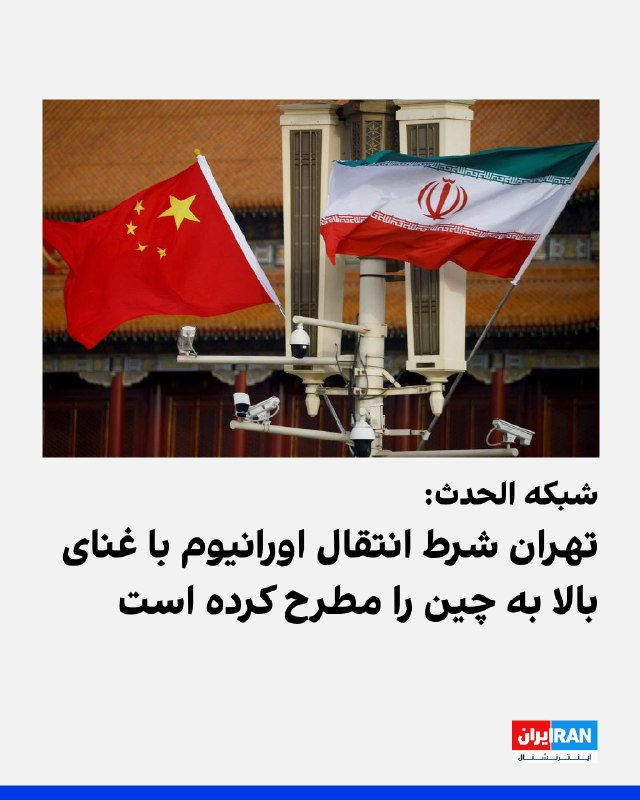

الحدث به نقل از منابع آگاه گزارش داد جمهوری اسلامی شرط انتقال اورانیوم با غنای بالا به چین را مطرح کرده است.

بر اساس این گزارش، تهران آمادگی دارد اورانیوم با غنای بالای خود را از کشور خارج کند، اما پیش از نهایی شدن هرگونه توافق با واشینگتن، به دنبال دریافت تضمین‌هایی از چین است.

الحدث همچنین اعلام کرد احتمال دارد فرمانده ارتش پاکستان به دوحه سفر کند.
‌🏁 🇬🇧 IranintlTV

🤖 @VahidOOnLine

## VahidOOnLine — post 242135

  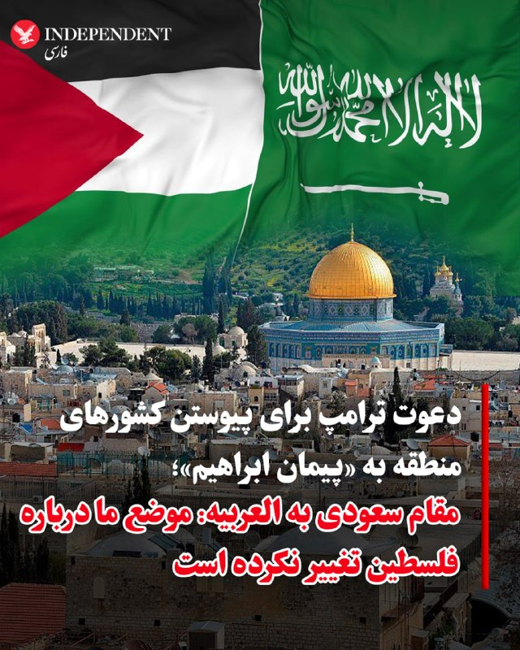

♦️در حالی که دونالد ترامپ، رئیس‌جمهوری آمریکا، در پیامی در تروث سوشال از دعوت از کشورهای منطقه برای پیوستن به «پیمان ابراهیم» سخن گفته بود، یک مقام عربستان سعودی، روز دوشنبه چهارم خرداد ماه به العربیه انگلیسی گفت موضع ریاض درباره مسئله فلسطین تغییری نکرده است.
به گزارش العربیه این منبع تاکید کرد: «باید مسیری برگشت‌ناپذیر برای تشکیل کشور فلسطین وجود داشته باشد.»
ترامپ پیش‌تر در پیامی در شبکه اجتماعی تروث سوشال از کشورهای عربستان سعودی، قطر، ترکیه، پاکستان، مصر و اردن خواسته بود به «پیمان ابراهیم» بپیوندند. توافقی که در دوره نخست ریاست‌جمهوری او به عادی‌سازی روابط اسرائیل با امارات متحده عربی، بحرین، مراکش و سودان منجر شد. او همچنین گفته بود خاورمیانه می‌تواند وارد مرحله‌ای تازه از صلح و همکاری شود.
‌🇸🇦 Indypersian

🤖 @VahidOOnLine

## VahidOOnLine — post 242134

  

یائیر لاپید، رهبر اپوزیسیون اسرائیل، دوشنبه گفت توافق در حال شکل‌گیری میان واشینگتن و تهران هیچ‌یک از اهداف اسرائیل در جنگ را تامین نمی‌کند و بنیامین نتانیاهو را به ناتوانی در اعمال نفوذ برای دستیابی به توافقی بهتر متهم کرد.
لاپید در جمع خبرنگاران در اورشلیم گفت: این توافق برای اسرائیل، برای منطقه و برای مردم ایران بد است.
‌🏁 🇬🇧 IranintlTV

🤖 @VahidOOnLine

## VahidOOnLine — post 242133

  <a href="telegram/content/VahidOOnLine_242133_1779727162.mp4" target="_blank">🎬 Download video</a>

♦️محمد نوری ارسوی، وزیر فرهنگ و گردشگری ترکیه، روز دوشنبه چهارم خرداد اعلام کرد یکی دیگر از قطعات گمشده تابلوی موزاییکی مشهور «دختر کولی» از آمریکا به ترکیه بازگردانده شده است.
ارسوی در پیامی در شبکه‌های اجتماعی گفت پس از بازگرداندن ۱۲ قطعه پیشین، سیزدهمین قطعه این مجموعه نیز در نتیجه پژوهش‌های علمی و تلاش‌های دیپلماتیک دوباره به سرزمین اصلی خود بازگشته است.
وزیر فرهنگ ترکیه تاکید کرد آنکارا همچنان رد آثار فرهنگی و تاریخی خود را در هر نقطه جهان دنبال خواهد کرد و از میراث تمدنی‌اش حفاظت می‌کند.
این قطعه بخشی از ترکیب بزرگ موزاییکی معروف «دختر کولی» متعلق به شهر باستانی زئوگما است. اثری مربوط به سده دوم میلادی در دوره امپراتوری روم که حدود هزار و ۸۰۰ سال قدمت دارد و به‌دلیل نگاه نافذ و جزئیات هنری‌اش به یکی از شناخته‌شده‌ترین نمادهای فرهنگی ترکیه تبدیل شده است.
مقام‌های ترکیه می‌گویند این تابلو از نظر سبک هنری و ترکیب‌بندی، شباهت زیادی با دیگر قطعات نگهداری‌شده در موزه موزاییک زئوگما در شهر غازی‌آنتپ ترکیه دارد و پس از بررسی‌های علمی و حقوقی، از آمریکا به ترکیه تحویل داده شده است.
‌🇸🇦 Indypersian

🤖 @VahidOOnLine

## VahidOOnLine — post 242132

  

وب‌سایت سمافور گزارش داد یک سرمایه‌گذاری مشترک میان یک استارتاپ دفاعی آمریکایی و یک شرکت عربستان سعودی در حال ساخت کارخانه‌ای در نزدیکی ریاض برای تولید پهپادهای رزمی مشابه سامانه شاهد جمهوری اسلامی است.
سمافور افزود این پهپاد با برد ۱۵۰۰ کیلومتر برای تقویت بازدارندگی عربستان سعودی طراحی شده و تولید آن هم برای بازار داخلی و هم صادرات به کشورهای متحد برنامه‌ریزی شده است.
‌🏁 🇬🇧 IranintlTV

🤖 @VahidOOnLine

## VahidOOnLine — post 242131

  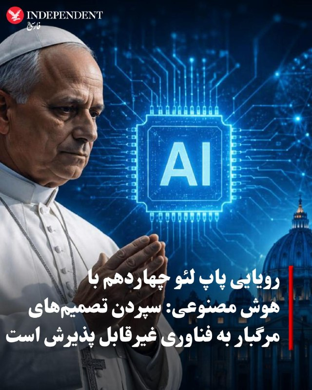

♦️پاپ لئو چهاردهم، رهبر کاتولیک‌های جهان، در نخستین منشور رسمی خود درباره هوش مصنوعی خواستار «خلع سلاح» این فناوری شد و هشدار داد گسترش سریع آن می‌تواند به «گونه‌های تازه برده‌داری» منجر شود.

پاپ که روز دوشنبه منشور «انسانیت باشکوه» را در واتیکان ارائه کرد، نسبت به رقابت جهانی برای توسعه الگوریتم‌های قدرتمندتر و انباشت داده‌های بیشتر با هدف دستیابی به برتری سیاسی و بازرگانی هشدار داد.

او تاکید کرد هوش مصنوعی باید از «منطق سلطه، حذف و مرگ» رها شود و سپردن تصمیم‌های مرگبار به فناوری «غیرقابل پذیرش» است. لئو همچنین استفاده از هوش مصنوعی در جنگ‌افزارهای خودکار را محکوم کرد.

پاپ لئو در بخش دیگری از این سند نسبت به بهره‌کشی انسانی در روند توسعه هوش مصنوعی هشدار داد و گفت پاسخ‌های ظاهرا «بی‌نقص و فوری» این فناوری بر کار خاموش میلیون‌ها نفر، از ناظران محتوای آسیب‌زا تا کودکانی که مواد معدنی مورد نیاز فناوری را استخراج می‌کنند، متکی است.

به گزارش خبرگزاری فرانسه، در آیین رونمایی از این منشور، کریستوفر اولاه، از بنیان‌گذاران شرکت آمریکایی آنتروپیک، نیز حضور داشت.
‌🇸🇦 Indypersian

🤖 @VahidOOnLine

## VahidOOnLine — post 242130

  

علیرضا سلیمی، عضو هیات‌رییسه مجلس گفت با توجه به شرایط جدید، از مجتبی خامنه‌ای اجازه خواستیم تا جلسات مجلس را به‌صورت وبیناری با امکان رای‌گیری برگزار کنیم.

او افزود به محض دریافت پاسخ از «رهبری»، هیات‌رییسه تصمیمات لازم را برای آغاز جدی فعالیت‌های عادی مجلس خواهد گرفت.
‌🏁 🇬🇧 IranintlTV

🤖 @VahidOOnLine

## WithYashar — post 12437

ادعای الحدث به نقل از منابع: ایران آماده‌ست تا اورانیوم با غنای بالا رو به چین انتقال بده !
@withyashar

## WithYashar — post 12436

## WithYashar — post 12435

  <a href="telegram/content/WithYashar_12435_1779727164.mp4" target="_blank">🎬 Download video</a>

🎬 Video

## WithYashar — post 12433

ترامپ با مسخره کردن اوباما و بایدن عکسهایی منتشر کرد که آنها به ایران پول میدهند و مذاکره میکنند، ولی او آنها را منهدم میکند.
@withyashar

## WithYashar — post 12428

## WithYashar — post 12427

رئیس جمهور مکزیک رسما از میزبانی تیم ملی فوتبال ایران در جام جهانی خبر داد

«کلودیا شین‌بام» رئیس‌جمهور مکزیک، رسماً اعلام کرد که تیم ملی فوتبال ایران به دلیل محدودیت‌های حضور در خاک آمریکا، در ایالت «باخا کالیفرنیا» مستقر خواهد شد.
با تایید دولت مکزیک، تیم ملی ایران شهر «تیخوانا» را به عنوان مقر اصلی و محل تمرینات خود در طول مسابقات جام جهانی ۲۰۲۶ انتخاب کرده است.
@withyashar

## WithYashar — post 12426

## WithYashar — post 12425

کانال ۱۴ اسرائیل: اختلاف نتانیاهو با ترامپ عملیات فریب است

طبق گفته یک تحلیلگر ارشد امنیتی اسرائیل، گزارش‌های درز کرده درباره تماس‌های تلفنی پرتنش میان ترامپ و نتانیاهو بر سر ایران واقعی نبودند، بلکه بخشی از یک راهبرد حساب‌شده برای گمراه‌کردن تهران بودند.

بر اساس گزارش کانال ۱۴ اسرائیل، این جنجال با گزارشی از پایگاه خبری آکسیوس آغاز شد که مدعی بود یک تماس تلفنی به‌ ویژه دشوار میان ترامپ و نتانیاهو درباره یک پیشنهاد جدید آمریکایی که از طریق پاکستان برای ایران ارسال شده، صورت گرفته است.

کوبی مایکل، پژوهشگر ارشد در مؤسسه مطالعات امنیت داخلی (INSS) و مؤسسه میسگاو، توضیح می‌دهد که این یک فریب تاکتیکی درخشان بوده است: «نه رئیس‌جمهور ترامپ و نه نخست‌وزیر نتانیاهو هیچ علاقه‌ای به یک بحران واقعی ندارند. با درز داستان درباره یک بحران جدی ادعایی میان آن‌ها، ایرانی‌ها ممکن است از زمان‌بندی حمله نظامی بعدی کاملاً غافلگیر شوند.»
@withyashar

## WithYashar — post 12424

وال استریت ژورنال ادعا کرده روند توافق بین ایران و آمریکا به خاطر اختلاف نظر شدید تو موضوع هسته‌ای و آزادسازی پول‌های بلوکه شده ایران خیلی کند شده (به بن‌بست نزدیک شده)
@withyashar

## WithYashar — post 12423

  <a href="telegram/content/WithYashar_12423_1779727166.mp4" target="_blank">🎬 Download video</a>

یک خلبان کلمبیایی که در ارتفاع ۱۲۵۰۰ پایی پرواز می‌کرد، تصویری را ثبت کرد که به عنوان بهترین فیلم ثبت شده از بشقاب پرنده‌ها تا به حال توصیف شده است و بنا به گزارش‌ها، اصالت آن تأیید شده است.
@withyashar

## WithYashar — post 12422

  <a href="telegram/content/WithYashar_12422_1779727167.mp4" target="_blank">🎬 Download video</a>

اتاق جنگ با یاشار : بار جدید نخود رسید
@withyashar

## mwarmonitor — post 9700

  

📝 همان ثانیه اول شروع جنگ، مثل موش‌های غافلگیرشده پریدید روی سیم و در کسری از ثانیه کل اینترنت کشور را قطع کردید؛ اما حالا یک ماه است که این انگل‌زاده‌های کت‌شلواری و دایناسورهای عهد بوق، اندر خم وصل کردن مجدد آن مانده‌اند. خنده‌دار اینجاست که رسانه‌ها با بوق و کرنا از مصوبه «جدید و مهم» ستاد ساماندهی برای بازگشت اینترنت به وضعیت قبل از دی‌ماه ۱۴۰۴ خبر می‌دهند؛ مصوبه‌ای که بعد از کلی چای خوردن با ۹ رای موافق تصویب شده و حالا لنگِ تایید نهایی مسعود پزشکیان است. واقعاً کدام حیوانی به این رئیس‌جمهور رای داده؟ موجودی که تنها شباهتش به رئیس، به خط کردن آفتابه‌های توالت‌های پادگان است و حالا برای چهار تا پورت اینترنت که خودشان قطع کرده‌اند، باید منتظر امضای ولایتمدارانه‌اش ماند. این کمدیِ مضحک نشان می‌دهد که حق بدیهی میلیون‌ها انسان، گروگانِ مشتی بی‌خاصیت است که برای بدیهی‌ترین کارها هم یک ماه جلسات پوچ برگزار می‌کنند.

@mwarmonitor

## mwarmonitor — post 9699

  <a href="telegram/content/mwarmonitor_9699_1779727170.mp4" target="_blank">🎬 Download video</a>

🔴ارتش اسرائیل (IDF) اعلام کرده است که حملات خود را به اهداف حزب‌الله در منطقه صور و سایر مناطق جنوب لبنان آغاز کرده است.

@mwarmonitor

## mwarmonitor — post 9698

📌 رئیس‌جمهور مکزیک، شینباوم، اعلام کرده است که دولتش موافقت کرده به تیم ملی فوتبال ایران اجازه دهد در جریان جام جهانی در مکزیک اقامت داشته باشد، پس از آنکه ایالات متحده اعلام کرده بود تمایلی به میزبانی آن‌ها ندارد.

@mwarmonitor

## mwarmonitor — post 9697

🔴عربستان سعودی اعلام کرده است که روابط خود را با اسرائیل عادی‌سازی نخواهد کرد، مگر اینکه مسیری غیرقابل بازگشت به سمت تشکیل یک دولت فلسطینی وجود داشته باشد. CNN

@mwarmonitor

## mwarmonitor — post 9696

🔴گفت‌وگوهای ایران درباره برنامه هسته‌ای و کاهش تحریم‌ها به بن‌بست خورده است.

🔸با این حال، هر دو طرف انگیزه‌هایی برای رسیدن به توافق دارند، اما هر کدام بر مواضع خود پافشاری می‌کنند؛ ترامپ نیز گفته است که «یک توافق بد را نخواهد پذیرفت».

@mwarmonitor

## mwarmonitor — post 9695

  <a href="telegram/content/mwarmonitor_9695_1779727170.mp4" target="_blank">🎬 Download video</a>

✈️نقل و انتقالات هوایی نیروی هوایی آمریکا به خاورمیانه با حجم بالا همچنان ادامه دارد، با وجود صحبت‌هایی که درباره نزدیک بودن نهایی شدن مذاکرات مطرح شده است.

@mwarmonitor

## mwarmonitor — post 9694

🔸وزیر امور خارجه امارات متحده عربی، شیخ عبدالله بن زاید آل نهیان، هشدار داده است که اروپا در نهایت به دلیل نبود اقدامات قاطع از سوی رهبران اروپایی و «وسواس نسبت به اصلاحات سیاسیِ افراطی (woke political correctness)»، ممکن است حتی بیشتر از خاورمیانه تولیدکننده افراط‌گرایان و اسلام‌گرایان تندرو باشد.

🔹او به‌طور مشخص به وجود هسته‌های افراط‌گرای اسلام‌گرا در شهرهای اروپایی مانند لندن، و همچنین در آلمان، اسپانیا و ایتالیا اشاره کرده و هشدار داده است که کشورهایی که در برخورد با این موضوع کوتاهی کنند ممکن است به‌عنوان «پرورشگاه‌های تروریسم» طبقه‌بندی شوند.

🔹بخش قابل توجهی از افرادی که در اروپا به‌دلیل طراحی یا تلاش برای حملات اسلام‌گرایانه بازداشت یا متوقف می‌شوند، نوجوانان محلی با تابعیت اروپایی (سنین ۱۴ تا ۱۹ سال) هستند که به‌طور کامل از طریق شبکه‌های اجتماعی و پلتفرم‌های بازی آنلاین رادیکال شده‌اند، بدون اینکه هرگز به خاورمیانه سفر کرده باشند.

🔸شیخ عبدالله بن زاید آل نهیان گفته است:
«روزی خواهد رسید که ما شاهد خواهیم بود افراط‌گرایان و تروریست‌های بسیار بیشتری از اروپا خارج می‌شوند، به دلیل نبود تصمیم‌گیری قاطع، تلاش برای سیاسی‌کاری بیش از حد، یا این تصور که آن‌ها اسلام و خاورمیانه و دیگران را بهتر از خودشان می‌شناسند. و متأسفم، اما این چیزی جز ناآگاهی نیست.»

@mwarmonitor

## mwarmonitor — post 9693

  

✈️دو فروند هواپیمای گشت دریایی بوئینگ P-8 پوسایدون نیروی دریایی آمریکا امروز در آن منطقه بین دریای عرب و خلیج عمان در حال عملیات بوده‌اند.

⁉️سؤال این است که آیا گروه رزمی ناو هواپیمابر یو‌اس‌اس جورج اچ. دبلیو. بوش در نزدیکی آن منطقه قرار دارد یا نه.

@mwarmonitor

## mwarmonitor — post 9692

مذاکرات با جمهوری اسلامی ایران به خوبی در حال پیشرفت است! این یا یک «توافق بزرگ» برای همه خواهد بود، یا هیچ توافقی در کار نخواهد بود — بازگشت به جبهه جنگ و شلیک، اما بزرگتر و قوی‌تر از هر زمان دیگری — و هیچ‌کس این را نمی‌خواهد! من در طول گفتگوهایم در روز شنبه…

## FoxNewsTwitter — post 342222

  <a href="telegram/content/FoxNewsTwitter_342222_1779727172.mp4" target="_blank">🎬 Download video</a>

Fox News (Twitter/X)

JUST NOW: President Trump lays a wreath at the Tomb of the Unknown Soldier as part of Memorial Day observance at Arlington National Cemetery.

## FoxNewsTwitter — post 342221

Fox News (Twitter/X)

NOW: President Trump, Vice President JD Vance, and Secretary of War Pete Hegseth arrive at Arlington National Cemetery to honor fallen troops on Memorial Day.

## FoxNewsTwitter — post 342220

  

Fox News (Twitter/X)

WATCH LIVE: President Trump honors fallen troops at Arlington National Cemetery https://twitter.com/i/broadcasts/1qKDzzzpewEJV

## FoxNewsTwitter — post 342219

  

Fox News (Twitter/X)

Dramatic video shows first responders in Texas rescuing a baby from a car trapped in raging floodwaters.

Officers say the child was inside the stranded vehicle as water levels quickly rose around the scene during severe storms in the region.

At one point, officers can be seen fighting the current while trying to safely reach the car before conditions got even worse.

According to police, nobody was hurt during the operation.

## FoxNewsTwitter — post 342218

Fox News (Twitter/X)

BREAKING: Orange County Fire Authority officials announce that the threat of a vapor explosion has been eliminated after crews confirmed the cracked chemical tank’s pressure has been released and temperatures have dropped from 100 to 93 degrees.

Although conditions have improved significantly, officials are emphasizing that evacuation zones remain in effect and ask residents to continue following evacuation orders.

## FoxNewsTwitter — post 342217

  

Fox News (Twitter/X)

"Nothing says, I want attention more than disparaging a national hero who's also dead."

Taya Kyle is unloading on Maine Senate candidate Graham Platner after he accused her late husband, 'American Sniper' Chris Kyle, of inflating his kill count by shooting innocent civilians.

Kyle called the comments "cowardly" and a "cheap political trick," saying Platner is trying to build notoriety by attacking someone "beloved" who can no longer defend himself.

"For me he would be out of the running immediately," she added.

## FoxNewsTwitter — post 342216

  

Fox News (Twitter/X)

This Memorial Day, we honor the brave men and women who made the ultimate sacrifice for our freedom, their courage and service will never be forgotten.

"The greatest fighting force the world has ever known is built upon the extraordinary service of selfless men and women who safeguard our liberty and preserve our way of life. Since the birth of our Nation nearly 250 years ago, countless souls have lost their lives in this noble and righteous pursuit. On Memorial Day, we honor these American heroes." — The White House

## FoxNewsTwitter — post 342212

Fox News (Twitter/X)

Pizza Hut franchises across the country are rolling out "Pizza Hut Classic" remodels to bring back the iconic '80s and '90s dining experience.

Franchisees are reviving beloved staples like the red cups, checkered tablecloths, salad bars, and classic Tiffany-style lamps to draw families back into dining rooms.

After years of sleek modern redesigns, the old-school dine-in feel is suddenly making a comeback.

## FoxNewsTwitter — post 342211

  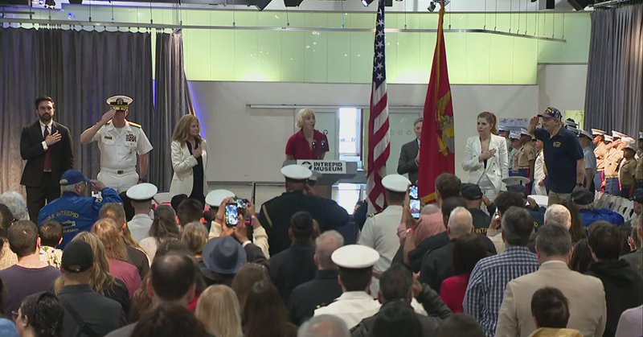

Fox News (Twitter/X)

WATCH LIVE: Intrepid Museum marks Memorial Day with tribute to fallen troops https://twitter.com/i/broadcasts/1AKEmmmZMmYKL

## pm_afshaa — post 91468

🔴منابع آگاه به العربیه: ایران در مذاکرات شرط کرده اورانیوم غنی‌ شده با درصد بالا فقط به چین منتقل شود

💧 Rainbet.com the #1 Non-KYC Crypto Casino & Sportsbook @rainbetcom

😁 @Pm_Afshaa

## pm_afshaa — post 91467

🔴الحدث : منابع نزدیک میگن ایران آماده‌ست اورانیوم با غنای بالا رو از کشور خارج کنه

💧 Rainbet.com the #1 Non-KYC Crypto Casino & Sportsbook @rainbetcom

😁 @Pm_Afshaa

## pm_afshaa — post 91464

  <a href="telegram/content/pm_afshaa_91464_1779727177.mp4" target="_blank">🎬 Download video</a>

تلمبه های سنگین اسراییل به لبنان

💧 Rainbet.com the #1 Non-KYC Crypto Casino & Sportsbook @rainbetcom

😁 @Pm_Afshaa

## pm_afshaa — post 91463

درود هموطنان عزیزم یک دختر 26 سال داره بجرم کشتن یکنفر که وارد خونش شده که بهش تعرض و تجاوز بکنه صبح 5 خرداد اعدام میشه، باید ۱۰ میلیارد جمع بشه که رضایت بدن تا حالا ۹ میلیارد جمع شده  همه چی داخل تصویر هست کسی خواست استعلام بگیره میدونم ایرانی ها آدم با…

## pm_afshaa — post 91462

درود مجدد داداش نوکرتم خیلی دمت گرم برای این خانوم ۸۰۰ میلیون جمع شد به لطف شما عزیزان و بقیه و ۲۰۰ میلیون مونده خیلی خوشحال شدم

## pm_afshaa — post 91461

  <a href="telegram/content/pm_afshaa_91461_1779727178.webm" target="_blank">🎬 Download video</a>

🔴سناتور لیندسی گراهام:

پیشنهاد اخیر ترامپ که گسترش توافقنامه‌های ابراهیم رو به عنوان بخشی از یک توافق مذاکره‌شده در مورد مناقشه ایران الزامی میکنه، به سادگی درخشان است و منجر به مهم‌ترین تغییر در خاورمیانه در هزاران سال خواهد شد.

با صلح عربستان سعودی و دیگر کشورهایی مانند پاکستان با اسرائیل، منطقه شاهد سطحی از ثبات خواهد بود که پیش از رئیس‌جمهور ترامپ هرگز تصور نمیشد و در نهایت به یکپارچگی منطقه‌ای منجر خواهد شد که خاورمیانه رو به یک قدرت اقتصادی و منبع فرصت‌های خوب تبدیل میکنه، به جای اینکه یک انبار باروت باشه.

انتظار دارم متحدان عرب ما این رو بپذیرند، همچنین دوستان ما در اسرائیل، با تمرکز بر این وظیفه، زیرا شکست گزینه‌ای نیست - که تحلیلی درست خواهد بود.

💧 Rainbet.com the #1 Non-KYC Crypto Casino & Sportsbook @rainbetcom

😁 @Pm_Afshaa

## pm_afshaa — post 91460

  <a href="telegram/content/pm_afshaa_91460_1779727178.webm" target="_blank">🎬 Download video</a>

🔴وال استریت ژورنال:
مذاکرات ایران رو بحث برنامه هسته‌ای و لغو تحریم‌ها به بن‌بست خورده.

💧 Rainbet.com the #1 Non-KYC Crypto Casino & Sportsbook @rainbetcom

😁 @Pm_Afshaa

## pm_afshaa — post 91459

  <a href="telegram/content/pm_afshaa_91459_1779727179.mp4" target="_blank">🎬 Download video</a>

🔴خوش چشم، کارشناس صداوسیما:
روبیو، ویتکاف و کوشنر از طریق واسطه‌ها بهمون گفتن به توییت‌های ترامپ توجه نکنید.

💧 Rainbet.com the #1 Non-KYC Crypto Casino & Sportsbook @rainbetcom

😁 @Pm_Afshaa

## DEJradio — post 4951

  <a href="telegram/content/DEJradio_4951_1779727180.webm" target="_blank">🎬 Download video</a>

🛩️
🚨 فعال شدن پدافند در قشم
منابع داخلی: یک پهپاد سرنگون شد

عصر دوشنبه، حوالی ساعت ۱۶:۱۵ دقیقه به وقت ایران پدافند جزیره قشم فعال شد. ساعاتی بعد اعلام شد که نیروهای مسلح یک «پهپاد متخاصم» را بر فراز آب‌های خلیج فارس با استفاده از سامانه «آرش» مورد هدف قرار دادند.

در روزهای اخیر بارها مواردی از پرواز پهپادها بر فرار ایران گزارش شد اما مشخص نیست متعلق به کدام کشور بودند. برخی منابع ادعا کردند پهپاد ساقط شده اسرائیلی بود.

#پهپاد #قشم #خلیج_فارس
@DEJradio

## DEJradio — post 4950

⭕️ ترامپ گفت توافق با جمهوری اسلامی باید به گسترش پیمان ابراهیم منجر شود

دونالد ترامپ، رئیس‌ جمهوری آمریکا، روز دوشنبه گفت توافق احتمالی با تهران باید به گسترش پیمان ابراهیم در خاورمیانه بینجامد.
او در پیامی در شبکۀ «تروث سوشال اعلام کرد مذاکرات با جمهوری اسلامی «به خوبی پیش می‌رود».
ترامپ هشدار داد اگر مذاکرات شکست بخورد، منطقه دوباره به یک میدان جنگ بزرگ‌تر و شدیدتر از پیش تبدیل می‌شود.
رئیس جمهوری آمریکا تأکید کرد توافق یا باید برای همه بزرگ و معنادار باشد، یا توافقی در کار نیست.
ترامپ افزود عربستان سعودی و قطر باید بی‌درنگ به پیمان ابراهیم بپیوندند و دیگر کشورهای منطقه نیز از آنها پیروی کنند.
به گفتۀ ترامپ اگر جمهوری اسلامی توافق مورد نظر آمریکا را امضا کند، پیوستن تهران به پیمان ابراهیم می‌تواند بخشی از یک ائتلاف جهانی بی‌سابقه، باشد.
رئیس‌ جمهوری آمریکا اعلام کرد با رهبران پادشاهی سعودی، امارات، قطر، پاکستان، ترکیه، مصر، اردن و بحرین درمورد آیندۀ خاورمیانه و توافق احتمالی با جمهوری اسلامی گفت‌وگو کرده است.
ترامپ توافق احتمالی را «مهم‌ترین توافق تاریخ خاورمیانه» عنوان کرد.

#پیمان_ابراهیم #خاورمیانه
@DEJradio

## DEJradio — post 4949

⭕️ سی‌بی‌اس خبر زندگی پنهانی و پیکی مجتبی خامنه‌ای را تأیید کرد

شبکۀ خبری سی‌بی‌اس به نقل از مقام‌های آگاه در دولت آمریکا گزارش داد مجتبی خامنه‌ای، رهبر جمهوری اسلامی، در مکانی نامعلوم پنهان شده و دسترسی بسیار محدودی به دنیای خارج دارد.
بر پایۀ این گزارش، ارتباطات او تنها از طریق شبکه‌ای پیچیده از پیک‌ها و نامه‌برها انجام می‌شود.
نهادهای اطلاعاتی آمریکا گفتند حتا مقام‌های بلندپایۀ حکومت نیز از محل پنهان شدن خامنه‌ای آگاهی ندارند.
مقام‌های آمریکایی گفته‌اند مسئولان جمهوری اسلامی که مجوز مذاکره با دولت آمریکا را دارند، برای ارتباط‌گیری در داخل ساختار حکومت با مشکلات جدی روبه‌رو شده‌اند. آنها می‌گویند همین موضوع روند مذاکرات را کند کرده است.
دو مقام آمریکایی به سی‌بی‌اس گفتند هر بار که واشینگتن جزئیات پیشنهادی را ارسال می‌کند، دسترسی نداشتن به مجتبی خامنه‌ای، پاسخ تهران را با تاخیری طولانی همراه می‌کند.
مجتبی خامنه‌ای از زمان آغاز حملات آمریکا و اسرائیل به جمهوری اسلامی، به‌شدت زخمی و سپس ناپدید شده است.
با وجود معرفی مجتبی خامنه‌ای به عنوان رهبر سوم جمهوری اسلامی، تاکنون هیچ تصویر یا صدایی از او منتشر نشده است.
منابع آگاه همچنین گزارش دادند بسیاری از رهبران جمهوری اسلامی هفته‌های بسیاری را در پناهگاه‌های بسیار مستحکم سپری می‌کنند و فقط در موارد بسیار ضروری با یکدیگر ارتباط دارند.
مسعود پزشکیان در هفته‌های پیشین از دیداری دو ساعت و نیمه با مجتبی خامنه‌ای خبر داده و از «ویژگی‌های شخصیتی» او تمجید کرده بود.
برخی منابع آگاه بر این باورند که مجتبی خامنه‌ای کشته شده و تنها شبحی از او در نزد مقامات سپاه به بیانیه نویسی مشغول است.

#موشتبا
@DEJradio

## DEJradio — post 4948

⭕️ بهای نفت در پی احتمال توافق جمهوری اسلامی و آمریکا سقوط کرد

بهای نفت روز دوشنبه در پی افزایش احتمال توافق میان آمریکا و جمهوری اسلامی برای پایان دادن به جنگ، حدودا شش درصد کاهش یافت.
قیمت‌ها در این روز به پایین‌ترین سطح در دو هفتۀ اخیر رسیده است.
بر پایۀ گزارش خبرگزاری رویترز، بهای نفت برنت با کاهش ۵.۷ درصدی به ۹۷ دلار و ۶۹ سنت برای هر بشکه رسید.
نفت خام وست‌تگزاس آمریکا نیز که شاخص قیمت نفت در این کشور به شمار می‌رود، با کاهش شش درصدی ۹۰ دلار و ۸۵ سنت معامله شد.
پیش از آغاز جنگ چهل روزه، درحدود بیست درصد از صادرات نفت و گاز طبیعی مایع در دنیا، از تنگۀ هرمز عبور می‌کرد.

#نفت
@DEJradio

## DEJradio — post 4947

⭕️ روبیو: یا با تهران به توافقی خوب می‌رسیم یا از راهی دیگر برخورد می‌کنیم

مارکو روبیو، وزیر امور خارجۀ آمریکا، روز دوشنبه گفت برای پایان دادن به جنگ با جمهوری اسلامی ممکن است «امروز» توافقی به‌دست بیاید.
او در دهلی‌نو، پایتخت هندوستان گفت شامگاه گذشته ممکن بود خبری برسد، اما شاید هم امروز چیزی در راه باشد.
روبیو افزود آمریکا یا به یک توافق خوب با جمهوری اسلامی می‌رسد، یا از راهی دیگری با آنها برخورد می‌کند.
وزیر امور خارجۀ آمریکا تأکید کرد واشینگتن پیش از بررسی گزینه‌های دیگر، به دیپلماسی کاملا فرصت می‌دهد.
او افزود طرح باز نگه داشتن تنگۀ هرمز از پشتیبانی گسترده‌ای در خلیج فارس برخوردار است و کشورهای منطقه آن را «معقول و ضروری» می‌دانند.
روبیو اطمینان داد جمهوری اسلامی وارد مذاکراتی «واقعی، مهم و زمان‌بر» درباره پرونده هسته‌ای می‌شود.
او تصریح کرد دونالد ترامپ عجله‌ای ندارد و هیچ توافق بدی را امضا نمی‌کند.

#مارکو_روبیو #مذاکرات
@DEJradio

## DEJradio — post 4946

  <a href="telegram/content/DEJradio_4946_1779727180.webm" target="_blank">🎬 Download video</a>

⭕️
🚨 یکی دیگر از معترضان انقلاب شیر و خورشید اعدام شد؛ صدور حکم اعدام برای چهار متهم پروندۀ اکباتان

قوۀ قضائیۀ جمهوری اسلامی اعلام کرد عباس اکبری فیض‌آبادی، از معترضان دی‌ماه ۱۴۰۴ را اعدام کرده است.
خبرگزاری میزان، وابسته به دستگاه قضائی مدعی شد عباس اکبری فیض‌آبادی، یکی از «لیدرهای مسلح» اعتراض‌ها در نائین بوده است. بنا بر این ادعا، او در حمله به فرمانداری نائین و تیراندازی به سوی مأموران نقش داشت.
هیچ جزئیاتی دربارۀ روند دادرسی، شرایط دادگاه و دسترسی این مخالف سیاسی رژیم به وکیل، منتشر نشده است.
جمهوری اسلامی از شکنجۀ روحی و جسمی بر بازداشت‌شدگان برای گرفتن اعتراف اجباری از آنها علیه خودشان استفاده می‌کند.
از سویی قوه قضائیه از صدور حکم اعدام برای چهار متهم پروندۀ کشته‌شدن یک بسیجی در شهرک اکباتان تهران در جریان اعتراض‌های ۱۴۰۱ خبر داد.
شعبۀ ۱۵ دادگاه انقلاب این افراد را با اتهام «افساد فی‌الارض» به اعدام محکوم کرد.
در روزهای پیشین شعبۀ ۱۳ دادگاه کیفری تهران حکم قصاص متهمان این پرونده را نقض و آن‌ها را به حبس و پرداخت دیه محکوم کرده بود.
وکلای متهمان گفتند احکام اعدام به‌صورت ناگهانی و شفاهی، بدون طی مراحل قانونی، از سوی قاضی صلواتی اعلام شده است.
قاضی صلواتی یکی از بدنام‌ترین افراد دستگاه قضائی است که به صدور فله‌ای حکم اعدام برای متهمان سیاسی شهرت دارد.

#اعدام #زندانیان_سیاسی
@DEJradio

## DEJradio — post 4945

⭕️ یک عضو فعال حماس در فاجعۀ کشتار هفتم اکتبر، توسط اسرائیل حذف شد

ارتش اسرائیل اعلام کرد طی عملیاتی لؤی هشام محمود بصل، عضو حماس را که در حملۀ هفتم اکتبر به پایگاه زیکیم نقش داشت، حذف کرد.
بر پایۀ بیانیه ارتش اسرائیل، بصل به‌عنوان تک‌تیرانداز در گردان زیتون حماس فعالیت می‌کرد.
اسرائیل گزارش داد که این فرد در روزهای اخیر نیز برای اجرای حملات علیه نیروهای اسرائیلی برنامه‌ریزی می‌کرد.
عملیات ارتش اسرائیل با هدف رفع یک تهدید فوری، انجام شد.
در جریان فاجعۀ هفتم اکتبر 2023 بیش از هزار تن از شهروندان اسرائیل کشته شده بودند.
حماس که توسط جمهوری اسلامی پشتیبانی می‌شود، در سیاهۀ تروریستی اروپا و آمریکا قرار دارد.

#اسرائیل #حماس
@DEJradio

## DEJradio — post 4944

⭕️پاکستان از چین خواست برای توافق احتمالی تهران و واشینگتن وارد عمل شود

منابع آگاه گفتند شهباز شریف، نخست‌وزیر پاکستان، در گفت‌وگو با مقام‌های چینی دربارۀ مذاکرات جمهوری اسلامی و آمریکا رایزنی کرد.
بر اساس گزارش‌ها، اسلام‌آباد خواستارنقش فعال و ضمانت چین در توافق احتمالی میان جمهوری اسلامی و آمریکا شد.
شهباز شریف که همراه با عاصم منیر، فرماندۀ ارتش پاکستان به پکن سفر کرده است، ادعا کرد مذاکرۀ تهران و واشینگتن «در مسیر درست در حال پیش‌روی است».
نخست‌وزیر پاکستان همچنین از پشتیبانی چین از تلاش‌های میانجی‌گرانۀ اسلام‌آباد برای برقراری آتش‌بس و کاهش تنش در منطقه خبر داد.

#مذاکرات #چین #پاکستان
@DEJradio

## DEJradio — post 4943

⭕️معاون پزشکیان خواهان بازگشت سردار آزمون به تیم ملی شد

عبدالکریم حسین‌زاده، معاون رئیس‌ جمهوری در امور توسعۀ روستایی و مناطق محروم، خواستار دعوت دوبارۀ سردار آزمون به تیم ملی فوتبال جمهوری اسلامی ایران شد.
او در شبکۀ اجتماعی اکس مدعی شد «نیاز وطن» حفظ نخ‌های پیوند بین فرزندانش است.
بنا بر ادعای این مقام دولتی، بازگرداندن آزمون پیامی به نفع انسجام ملی، قلمداد می‌شود.
نام سردار آزمون در فهرست ۳۰ نفرۀ تیم ملی برای جام جهانی ۲۰۲۶ که به‌تازگی اعلام شد، دیده نمی‌شود.
پشتیبانی سردار آزمون از اعتراضات مردمی و انتشار تصاویرش در کنار حاکم دوبی، از دلایل غیررسمی کنار گذاشته شدن او از تیم ملی عنوان شد.
قوۀ قضائیه پیش‌تر دستور به توقیف اموال این بازیکن معترض تیم ملی داده بود.
سردار آزمون با ۵۷ گل زدۀ ملی، دومین گلزن برتر تاریخ تیم ملی فوتبال ایران است.

#سردار_آزمون #فوتبال #جام_جهانی
@DEJradio

## DEJradio — post 4942

⭕️ کلاس‌های دانشگاه آریامهر تا اطلاع بعدی مجازی می‌ماند

معاونت آموزشی دانشگاه آریامهر که پس از 57 با نام صنعتی شریف شناخته می‌شود، اعلام کرد کلاس‌های همۀ مقاطع تحصیلی این دانشگاه تا اطلاع بعدی همچنان به‌صورت مجازی برگزار می‌شود.
بر اساس ادعای مسئولان دانشگاه، با وجود تصمیم پیشین برای حضوری شدن کلاس‌های تحصیلات تکمیلی از نهم خردادماه، هنوز «امکان ارائۀ پایدار خدمات اینترنت و امکانات رفاهی» فراهم نیست.
تداوم اختلال گستردۀ اینترنت در ایران طی هفته‌های اخیر، فعالیت بسیاری از دانشگاه‌ها و مراکز آموزشی را تحت تاثیر قرار داده است.
از سویی در زمان بازگشایی حضوری دانشگاه‌ها، چندین تجمع دانشجویی در پشتیبانی از شاهزاده رضا پهلوی و انقلاب شیر و خورشید برگزار شده بود.

#دانشجویان #دانشگاه
@DEJradio

## DEJradio — post 4941

⭕️ آمادگی نیروی دریایی بریتانیا برای مین‌روبی احتمالی در تنگۀ هرمز

کشتی بریتانیایی آر.اف.ای لایم بی، در تنگۀ جبل‌الطارق برای مأموریت احتمالی مین‌روبی در تنگۀ هرمز آماده می‌شود.

رویترز گزارش داد این شناور قرار است همراه با ناوشکن اچ‌ام‌اس دراگون، و سایر کشتی‌های متحدان، برای عملیات احتمالی به رهبری بریتانیا و فرانسه راهی خلیج فارس شود.
نیروی دریایی بریتانیا از سویی پهپادهای دریایی مین‌شکار و تجهیزات ویژۀ شناسایی مین در این کشتی بارگیری می‌کند.
به گفتۀ مقام‌های بریتانیایی از ابتدای جنگ چهل روزه، دستکم شش هزار کشتی از عبور از تنگۀ هرمز منع شدند.
بریتانیا می‌گوید هنوز مشخص نیست جمهوری اسلامی واقعاً در آبراه هرمز مین‌گذاری کرده باشد.
شرکت‌های بیمه برای ازسرگیری کامل تردد دریایی خواهان یقین مطلق، درمورد امنیت مسیر شده‌اند.
برخی ناظران می‌گویند جمهوری اسلامی از «ادعای» مین‌گذاری برای ترساندن نفتکش‌ها و برهم زدن نظم بازار جهانی استفاده کرده است.

#بریتانیا #تنگه_هرمز
@DEJradio

## mamlekate — post 103582

📝 قالیباف و عراقچی در سفری غیرمنتظره وارد قطر شدند

@mamlekate

## VahidOnline — post 75707

محمدباقر ذوالقدر، دبیر شورای عالی امنیت ملی، در پیامی با اشاره به «میدان نظامی، میدان دیپلماسی و مردم مبعوث‌شده حاضر در خیابان» نوشت: عقب‌نشینی در کار نخواهد بود.
او تاکید کرد: بیش از هر زمان دیگری به وحدت و انسجام نیاز داریم تا آمریکایی‌ها و اسرائیلی‌ها مایوس شوند.
@VahidOOnLine

📡 @VahidOnline

## VahidOnline — post 75705

تصاویری که ترامپ از اکانت بقیه بازنشر کرده.
realDonaldTrump

📡 @VahidOnline

## VahidOnline — post 75703

دونالد ترامپ، رئیس جمهور آمریکا، روز دوشنبه در تازه‌ترین پیام خود در شبکه اجتماعی‌اش ضمن خبر دادن از پیشرفت «خوب» در مذاکره با ایران، از تمام کشورهای دخیل در این مذاکرات خواست پس از حصول توافق با ایران، بلافاصله به پیمان‌های ابراهیم بپیوندند.

پیمان یا پیمان‌های ابراهیم طرحی بود که دونالد ترامپ در دوره اول خود برای تلاش در راه عادی‌سازی روابط میان اعراب و اسرائیل آغاز کرد و موفق شد تا چندین کشور از جمله بحرین و امارات متحده عربی را هم به این کار ترغیب کند.

حال رئیس جمهور آمریکا روند توافق با جمهوری اسلامی را به این طرح پیوند زده و به گفته خود این «خواسته اجباری» را با دیگر کشورهای عرب خلیج فارس و همین طور ترکیه مطرح کرده که به‌فوریت و همزمان به پیمان ابراهیم بپیوندند.
@VahidHeadline
دونالد ترامپ در شبکه تروث سوشال نوشت که پیوستن جمهوری اسلامی به پیمان ابراهیم، می‌تواند به «اتفاقی تاریخی» تبدیل شود.
او افزود که در گفت‌وگو با سران عربستان سعودی، امارات متحده عربی، قطر، ترکیه، مصر، اردن و بحرین، تاکید کرده لازم است همه این کشورها به‌طور هم‌زمان پیمان ابراهیم را برای عادی‌سازی روابط با اسرائیل امضا کنند.

ترامپ نوشت: ««کشورهایی که درباره آن‌ها صحبت شد عبارت‌اند از عربستان سعودی، امارات متحده عربی (که هم‌اکنون عضو است)، قطر، پاکستان، ترکیه، مصر، اردن و بحرین (که هم‌اکنون عضو است). ممکن است یکی دو کشور دلیلی برای انجام ندادن این کار داشته باشند و این پذیرفته خواهد شد، اما بیشتر آن‌ها باید آماده، مایل و قادر باشند که این توافق با ایران را به رویدادی بسیار تاریخی‌تر از آنچه در غیر این صورت می‌بود تبدیل کنند.»
@VahidOOnLine

📡 @VahidOnline

## VahidOnline — post 75701

خبرگزاری‌های رویترز و فرانسه به نقل از یک مقام آگاه، از سفر غیر‌منتظره محمد باقر قالیباف و عباس عراقچی، مذاکره‌کنندگان ارشد ایران، به دوحه خبر داده‌اند.

بر اساس این گزارش‌ها، رئیس مجلس و وزیر خارجه ایران برای گفت‌وگو با نخست‌وزیر قطر به دوحه سفر کرده‌اند.

رویترز نوشت که این گفت‌و‌گوها عمدتا درباره «تنگه هرمز و ذخایر اورانیوم غنی‌شده» ایران است.

رسانه‌های ایران گزارش داده بودند که عبدالناصر همتی، رئیس کل بانک مرکزی ایران، برای «بررسی آزادسازی اموال بلوکه‌شده و در راستای کمیسیون اقتصادی مذاکرات» به قطر سفر کرده است.

هیئتی از قطر هفته پیش به ایران سفر کرده بود.

یکی از خواسته‌های ایران در مذاکره با آمریکا آزاد شدن منابع مالی مسدودشده‌اش است.
@VahidHeadline

📡 @VahidOnline

## VahidOnline — post 75700

  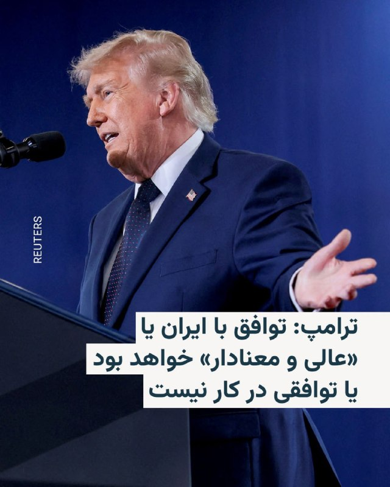

دونالد ترامپ، رئیس‌جمهور آمریکا، در پیامی در شبکه اجتماعی تروث سوشال گفت توافق احتمالی با ایران یا «عالی و معنادار» خواهد بود یا اساساً توافقی در کار نخواهد بود.

آقای ترامپ در این پیام، منتقدان خود در میان دموکرات‌ها و برخی جمهوری‌خواهان را به باد انتقاد گرفت و گفت آنان «هیچ چیز» دربارهٔ توافق احتمالی او با ایران نمی‌دانند و حتی دربارهٔ موضوعاتی اظهار نظر می‌کنند که به گفتهٔ او «هنوز مذاکره نشده‌اند».

ترامپ تأکید کرد توافق مورد نظر او با ایران «دقیقاً نقطهٔ مقابل» توافق هسته‌ای برجام خواهد بود؛ توافقی که او بار دیگر آن را «فاجعه» خواند و دولت باراک اوباما را به گشودن «مسیر مستقیم و آشکار» ایران به سوی جنگ‌افزار هسته‌ای متهم کرد.

او در پایان پیام خود نوشت: «من چنین توافق‌هایی نمی‌کنم.»
@VahidHeadline

📡 @VahidOnline

## VahidOnline — post 75699

  

رسانه‌های ایران از تصویب مصوبه‌ای «جدید و مهم» دربارهٔ اتصال دوباره اینترنت کشور به اینترنت بین‌الملل در «ستاد ویژه ساماندهی فضای مجازی» خبر داده‌اند؛ مصوبه‌ای که هنوز برای اجرا نیازمند تأیید نهایی مسعود پزشکیان، رئیس‌جمهور ایران، است.

خبرگزاری فارس روز دوشنبه چهارم خرداد گزارش داد چهارمین جلسه این ستاد به ریاست محمدرضا عارف، معاون اول رئیس‌جمهور، برگزار شد و در آن «مصوبات مهمی» دربارهٔ اتصال به اینترنت بین‌الملل به تصویب رسید.

فارس به نقل از یک منبع نوشت که «برقراری اتصال اینترنت بین‌الملل» با ۹ رأی موافق و سه رأی مخالف تصویب شده و برای تأیید به دفتر رئیس‌جمهور ارسال شده است.

خبرگزاری تسنیم نیز با انتشار گزارشی مشابه نوشت مصوبات این جلسه پس از تأیید نهایی رئیس‌جمهور، برای اجرا به وزارت ارتباطات و فناوری اطلاعات ابلاغ خواهد شد.

در همین حال، سیتنا، رسانه تخصصی حوزه ارتباطات و فناوری اطلاعات، به نقل از «یک منبع آگاه» گزارش داد که در جلسه صبح دوشنبه «بازگشت اینترنت به وضعیت قبل از دی‌ماه ۱۴۰۴» مصوب شده و در صورت تأیید مسعود پزشکیان، جهت اجرا به وزارت ارتباطات ابلاغ خواهد شد.
@VahidHeadline

📡 @VahidOnline

## VahidOnline — post 75698

  

رسانه‌های ایران به نقل از «حسین کرمانپور»، رییس مرکز روابط عمومی وزارت بهداشت، گزارش دادند که جراحت‌های وارد شده به «مجتبی خامنه‌ای»، رهبر جمهوری اسلامی، در جریان حملات اخیر «سطحی» بوده و مشکل جدی برای او ایجاد نکرده است.

کرمانپور گفت رهبر جمهوری اسلامی تنها از ناحیه صورت، سر و پاها دچار جراحت شده و این آسیب‌ها «منجر به قطع عضو یا ناراحتی خاصی نشده است.»او همچنین مدعی شد که هنگام انتقال خامنه‌ای به بیمارستان، پزشکان از او خواسته‌اند روزه خود را بشکند، اما او تا زمان افطار روزه‌اش را ادامه داده است.
@VahidHeadline

📡 @VahidOnline

## VahidOnline — post 75697

  

ایران می‌گوید که سفر وزیر خارجه به نیویورک برای شرکت در نشست شورای امنیت «منتفی» شده است.

اسماعیل بقایی، سخنگوی وزارت خارجه ایران، دلیل انجام نشدن سفر عباس عراقچی را «مشکل روادید» عنوان کرد.

آقای بقایی چهارشنبه هفته پیش درمورد حضور آقای عراقچی در این نشست گفته بود: «این سفر به نیویورک احتمال دارد انجام شود و البته ممکن هم هست انجام نشود، چون هنوز قطعی نیست. دلیلش هم این است که هم باید روادید صادر شود و هم ممکن است اولویت‌های دیگری داشته باشیم.»

چین به‌عنوان رئیس دوره‌ای شورای امنیت، سه‌شنبه ۲۶ مه یک بحث آزاد در سطح بالا با موضوع «حفظ اهداف و اصول منشور سازمان ملل و تقویت نظام بین‌المللی متمرکز بر سازمان ملل» برگزار خواهد کرد.

این جلسه به ریاست وانگ یی، عضو دفتر سیاسی کمیته مرکزی حزب کمونیست و وزیر امور خارجه چین، برگزار می‌شود.

چین این نشست را «فرصتی» برای همبستگی و اجماع کشورهای عضو توصیف کرد تا «تعهد راسخ خود را به حفظ اهداف و اصول منشور سازمان ملل متحد مجددا تصریح و نقش محوری این سازمان را در نظام بین‌المللی احیا کنند.»
@VahidHeadline

📡 @VahidOnline

## VahidOnline — post 75696

  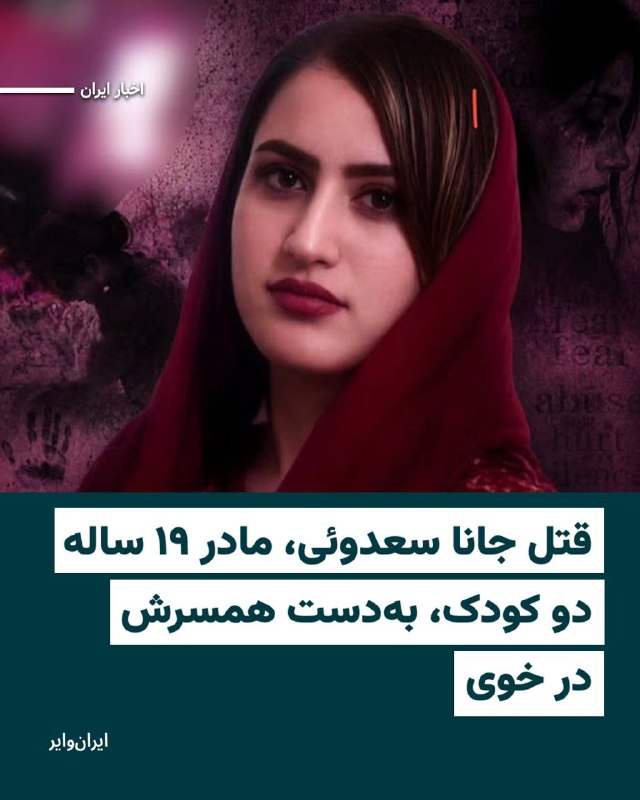

روز سه‌شنبه ۲۶ اردیبهشت‌ماه ۱۴۰۵، «جانا سعدوئی»، زن ۱۹ ساله، مادر دو کودک و اهل روستای تاریمیش از توابع بخش قطور شهرستان خوی، به دست همسر خود به قتل رسیده است.

به گفته منابع آگاه، همسر این زن پس از وارد کردن ضربات مرگبار، تلاش کرده است ماجرا را به‌عنوان «خودکشی» جلوه دهد.
با این حال، نتایج بررسی‌های پزشکی قانونی و تناقض‌های موجود در روایت‌ها و اظهارات مطرح‌شده، ابعاد این قتل و تلاش برای صحنه‌سازی را آشکار کرده است.
@VahidHeadline

📡 @VahidOnline

## IranIntlTV — post 338947

  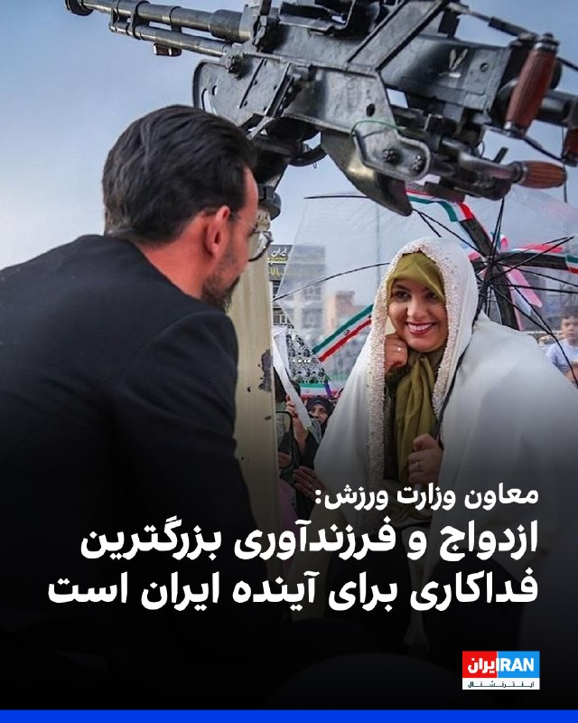

علیرضا رحیمی، معاون امور جوانان وزارت ورزش و جوانان، در اختتامیه جشنواره «نسل امید» گفت: اگر واقعا به آینده ایران فکر می‌کنیم، باید به نهاد اصلی جامعه یعنی تشکیل خانواده بها بدهیم. فرزندآوری در این شرایط نوعی فداکاری و ایثار است و شاید بزرگ‌ترین ازخودگذشتگی برای آینده ایران محسوب شود.

وزارت ورزش و جوانان جمهوری اسلامی هدف از برگزاری این جشنواره را «توسعه کمی و کیفی آثار هنری در حوزه خانواده و جوانی جمعیت» عنوان کرده است.

جشنواره «نسل امید» با همکاری حوزه هنری سازمان تبلیغات اسلامی برگزار می‌شود.
https://iranintl.com/202605258379

## IranIntlTV — post 338946

  <a href="telegram/content/IranIntlTV_338946_1779727184.mp4" target="_blank">🎬 Download video</a>

تیتر اول با نیوشا صارمی، دوشنبه ۴ خرداد
@iranintltv

## IranIntlTV — post 338945

  <a href="telegram/content/IranIntlTV_338945_1779727185.mp4" target="_blank">🎬 Download video</a>

تیتر اول با نیوشا صارمی، دوشنبه ۴ خرداد
@iranintltv

## IranIntlTV — post 338944

🔻شکایت از فیفا به دلیل ممنوعیت پرچم شیر و خورشید در جام جهانی ۲۰۲۶

نیویورک تایمز گزارش داده که فیفا از سوی یک گروه غیرانتفاعی در آمریکا به دلیل ممنوعیت پرچم شیر و خورشید در جام جهانی ۲۰۲۶، تهدید به اقدام حقوقی و قضایی شده است؛ این نهاد غیرانتفاعی خواستار آن شده که برگزارکننده جام جهانی ممنوعیت نمایش پرچم پیش از انقلاب اسلامی را لغو کند.

«مؤسسه صداهای آزادی» نامه‌ای حاوی نگرانی‌های خود را از طریق شاهرخ مختارزاده، مشاور حقوقی‌اش، برای فیفا ارسال کرده است.

مختارزاده به نشریه اتلتیک گفته است که بسته به پاسخ یا عدم پاسخ فیفا، «تصمیم برای آغاز روند رسمی دادرسی در دادگاه عالی ایالت کالیفرنیا یا دادگاه‌های فدرال در کالیفرنیا اتخاذ خواهد شد.»

مشاور حقوقی این گروه گفت که سه روز پس از ارسال نامه به فیفا، هنوز هیچ پاسخی دریافت نکرده‌اند: «در صورت هرگونه تلاش فیفا برای حذف پرچم شیر و خورشید، در حال آماده‌سازی برای آغاز اقدامات حقوقی مقتضی هستیم.»
هفته گذشته، اتلتیک به نقل از منابعی که از برنامه‌ریزی‌های فیفا برای این تورنمنت آگاهی داشتند، گزارش داد که راهنمای رسمی فیفا برای ورزشگاه‌ها در جام جهانی، ممنوعیت این پرچم خواهد بود.

علاوه بر این، فیفا در این باره، فهرست اقلام ممنوعه مندرج در آیین‌نامه رفتاری ورزشگاه‌های خود را ارسال کرد.

این فهرست شامل «هرگونه اقلام، از جمله اما نه محدود به بنرها، پرچم‌ها، اعلامیه‌ها، پوشاک و سایر وسایل، که ماهیتی سیاسی، توهین‌آمیز و یا تبعیض‌آمیز داشته باشند و حاوی نوشته‌ها، نمادها یا هر ویژگی دیگری باشند که متوجه تبعیض علیه هر کشور، شخص خصوصی یا گروهی بر اساس نژاد، رنگ پوست، قومیت، منشأ ملی یا اجتماعی، هویت و بیان جنسیتی، ناتوانی، زبان، مذهب، عقیده سیاسی یا هر عقیده دیگر، تولد، ثروت یا هر وضعیت دیگر، گرایش جنسی یا هر مبنای دیگری باشد.»

فیفا به‌صراحت اعلام نکرد که پرچم پیش از انقلاب کدام معیار را نقض می‌کند، اما این فرض وجود دارد که آن را «سیاسی» تلقی خواهد کرد.

آمریکا، قطر نیست

فیفا نسبت به گزارش منتشرشده واکنشی نشان نداده. اما در میان ایرانیان خارج از کشور خشم زیادی شکل گرفته است؛ از جمله در نامه مؤسسه صداهای آزادی در اول خرداد.

این نامه خواستار لغو هرگونه سیاستی است که نمایش پرچم شیر و خورشید را در جام جهانی ۲۰۲۶ در آمریکا و کالیفرنیا ممنوع کند.

در نامه آمده است: «کالیفرنیا و ایالات متحده، قطر نیستند و چنین محدودیت‌هایی بر آزادی بیان را نمی‌پذیرند.»

در جام جهانی ۲۰۲۲ قطر، بسیاری از هواداران ایرانی پرچم شیر و خورشید را برای دیدارهای تیم ملی مقابل انگلیس، ولز و آمریکا به ورزشگاه آوردند.
با این حال، هنگام ورود به ورزشگاه‌ها، برخی از هواداران اجازه ورود با این پرچم یا پیام‌های انتقادی علیه جمهوری اسلامی را نیافتند. همچنین گزارش‌هایی از بازداشت تعدادی از هواداران منتشر شد.

فضای پیرامون جام جهانی قطر برای ایرانیان به‌شدت سیاسی بود. اعتراضات سراسری پس از قتل حکومتی مهساژینا امینی، چند ماه پیش از تورنمنت آغاز شد. او پس از بازداشت توسط «گشت ارشاد» به‌دلیل ادعای رعایت نکردن حجاب اجباری، جان باخت.

اما نامه مؤسسه صداهای آزادی تأکید می‌کند نمایش پرچم نوعی بیان سیاسی محافظت‌شده تحت متمم اول قانون اساسی آمریکاست و ممنوعیت آن تبعیض دیدگاه سیاسی محسوب می‌شود.
همچنین هشدار داده شده که ورزشگاه‌هایی که مالکیت یا مدیریت عمومی دارند در صورت مشارکت در توقیف پرچم‌ها ممکن است با پیامدهای حقوقی روبه‌رو شوند.

نامه تهدید می‌کند در صورت عدم ارائه تضمین کتبی از سوی فیفا، اقدامات قانونی در دادگاه‌های ایالتی و فدرال کالیفرنیا آغاز خواهد شد.

این مؤسسه خود را سازمانی غیرحزبی معرفی می‌کند و اعضای شورای مشورتی آن شامل مشاوران پیشین دولت‌های جمهوری‌خواه و دموکرات، از جمله جاشوا چارلز، استوارت ایزنستات و آلن درشویتز هستند.
🔗وبسایت ایران‌اینترنشنال
@iranintltv

## IranIntlTV — post 338943

🔻توافق احتمالی، واگذاری و رقیق‌سازی اورانیوم با غنای ۶۰ درصد تهران را شامل می‌شود

آسوشیتدپرس و سی‌بی‌اس به نقل از دو مقام منطقه‌ای آگاه به مذاکرات و یک مقام آمریکایی گزارش دادند که واشینگتن و تهران به توافقی نزدیک شده‌اند که بازگشایی تنگه هرمز، معافیت تحریمی برای فروش نفت ایران و واگذاری ذخایر اورانیوم غنی‌شده جمهوری اسلامی را شامل می‌شود.

این دو رسانه دوشنبه چهارم خرداد در گزارش‌هایی جداگانه به نقل از مقام‌هایی که نخواستند نام‌شان فاش شود، جزئیاتی مشابه از محتوای تفاهم‌نامه‌ای که اکنون میان طرف‌ها در دست بررسی است، منتشر کردند.

سی‌بی‌اس نوشت این تفاهم‌نامه شامل «تعیین تکلیف ذخایر اورانیوم با غنای بالای ایران» بر اساس ساز و کاری خواهد بود که هر دو طرف در مذاکرات آتی بر سر آن به توافق برسند.

این منابع همچنین تایید کردند که تفاهم‌نامه کنونی بازگشایی فوری تنگه هرمز از سوی جمهوری اسلامی و تعهد تهران به خودداری دائمی از تولید سلاح هسته‌ای را شامل می‌شود.

یکی دیگر از مفاد این تفاهم‌نامه به نوشته سی‌بی‌اس «بررسی مسائل مربوط به دارایی‌های مالی مسدودشده ایران و تحریم‌ها علیه حکومت» در مذاکرات آتی «بر اساس پایبندی ایران به موارد پیشین» اعلام شده است.

دو مقام منطقه‌ای آگاه همچنین اعلام پایان تمام تنش‌های نظامی در تمام جبهه‌ها از جمله لبنان و تمدید ۶۰ روزه آتش‌بس را دیگر بندهای تفاهم‌نامه کنونی عنوان کردند، اما این دو مورد مورد تایید مقام ارشدی که با سی‌بی‌اس گفت‌وگو کردند، قرار نگرفت.

محل اختلاف: لبنان

در گزارش آسوشیتدپرس نیز یکی از محورهای اصلی توافق، پایان کامل جنگ در همه جبهه‌ها، از جمله لبنان، عنوان شد.

هر دو مقام منطقه‌ای به این رسانه گفتند که پیش‌نویس توافق شامل پایان درگیری میان اسرائیل و حزب‌الله و همچنین تعهد جمهوری اسلامی به خودداری از دخالت در امور داخلی کشورهای منطقه است؛ موضوعی که به نوشته آسوشیتدپرس به حمایت تهران از نیروهای نیابتی، از جمله شورشیان حوثی در یمن، حماس در غزه و گروه‌های مسلح شیعه در عراق اشاره دارد.
یکی از این مقام‌های منطقه‌ای به آسوشیتدپرس گفت که آمریکا می‌خواهد اسرائیل برای پاسخ دادن به آنچه تهدیدهایی در لبنان می‌داند، دست باز داشته باشد، اما جمهوری اسلامی در برابر این خواسته مقاومت می‌کند. مقام آمریکایی نیز در این باره گفت که تفاهم‌نامه کنونی حق اسرائیل برای اقدام در برابر تهدیدهای فوری در چارچوب دفاع از خود را تضمین خواهد کرد.

این اختلاف در حالی گزارش شده است که دونالد ترامپ، رییس‌جمهوری ایالات متحده، دوشنبه چهارم خرداد روند مذاکرات با جمهوری اسلامی را «به‌خوبی در حال پیشرفت» توصیف کرد که یا به یک «توافق بزرگ برای همه» منجر می‌شود یا «اصلا هیچ توافقی در کار نخواهد بود».

او در پستی در شبکه اجتماعی تروث سوشال نوشت: «اگر توافق در کار نباشد، به بزرگ‌تر و قدرتمندتر از هر زمان دیگری به میدان نبرد باز می‌گردیم اما هیچ‌کس چنین چیزی را نمی‌خواهد.»
بازگشایی هرمز و فروش نفت در مرکز تفاهم

مقام‌های منطقه‌ای به آسوشیتدپرس گفتند که بر اساس توافق در حال شکل‌گیری، تنگه هرمز هم‌زمان با پایان دادن آمریکا به محاصره بندرهای ایران، به‌تدریج بازگشایی خواهد شد. این محاصره که از ۷ اردیبهشت آغاز شده، صادرات نفت ایران و ورود ارز به اقتصاد این کشور را محدود کرده است.

🔗ادامه این گزارش را اینجا بخوانید
@iranintltv

## IranIntlTV — post 338942

  <a href="telegram/content/IranIntlTV_338942_1779727186.mp4" target="_blank">🎬 Download video</a>

۴۸ روز پس از آتش‌بس موقت، دو فرمانده ارشد سپاه با ماسک و لباس مبدل در فضای عمومی حاضر شدند تا مشخص شود نظام همچنان نگران حذف فیزیکی رهبرانش به دست اسرائیل است. همزمان یک تحلیلگر نزدیک به حکومت از نفوذ اطلاعاتی در عالی‌ترین سطح بیت خامنه‌ای پرده برداشت.

گزارشی از مجتبا پورمحسن
@iranintltv

## IranIntlTV — post 338941

  

محمدباقر ذوالقدر، دبیر شورای عالی امنیت ملی، در پیامی با اشاره به «میدان نظامی، میدان دیپلماسی و مردم مبعوث‌شده حاضر در خیابان» نوشت: عقب‌نشینی در کار نخواهد بود.

او تاکید کرد: بیش از هر زمان دیگری به وحدت و انسجام نیاز داریم تا آمریکایی‌ها و اسرائیلی‌ها مایوس شوند.
https://iranintl.com/202605254014

## IranIntlTV — post 338940

  <a href="telegram/content/IranIntlTV_338940_1779727188.mp4" target="_blank">🎬 Download video</a>

تصاویر جدید ماهواره‌ای نشان می‌دهد ناو هواپیمابر فرانسوی شارل دوگل بسیار نزدیک به خط محاصره دریایی آمریکا و در دریای عرب مستقر شده است. ژان نوئل بارو، وزیر خارجه فرانسه، پیش‌تر اعلام کرده بود ماموریت این ناو هواپیمابر تامین امنیت کشتیرانی در تنگه هرمز است.

گفت‌وگو با محمدرضا شاهید، روزنامه‌نگار
@iranintltv

## IranIntlTV — post 338939

  

الحدث به نقل از منابع آگاه گزارش داد جمهوری اسلامی شرط انتقال اورانیوم با غنای بالا به چین را مطرح کرده است.

بر اساس این گزارش، تهران آمادگی دارد اورانیوم با غنای بالای خود را از کشور خارج کند، اما پیش از نهایی شدن هرگونه توافق با واشینگتن، به دنبال دریافت تضمین‌هایی از چین است.

الحدث همچنین اعلام کرد احتمال دارد فرمانده ارتش پاکستان به دوحه سفر کند.
https://iranintl.com/202605252722

## IranIntlTV — post 338938

  

یائیر لاپید، رهبر اپوزیسیون اسرائیل، دوشنبه گفت توافق در حال شکل‌گیری میان واشینگتن و تهران هیچ‌یک از اهداف اسرائیل در جنگ را تامین نمی‌کند و بنیامین نتانیاهو را به ناتوانی در اعمال نفوذ برای دستیابی به توافقی بهتر متهم کرد.
لاپید در جمع خبرنگاران در اورشلیم گفت: این توافق برای اسرائیل، برای منطقه و برای مردم ایران بد است.

## IranIntlTV — post 338937

  

وب‌سایت سمافور گزارش داد یک سرمایه‌گذاری مشترک میان یک استارتاپ دفاعی آمریکایی و یک شرکت عربستان سعودی در حال ساخت کارخانه‌ای در نزدیکی ریاض برای تولید پهپادهای رزمی مشابه سامانه شاهد جمهوری اسلامی است.
سمافور افزود این پهپاد با برد ۱۵۰۰ کیلومتر برای تقویت بازدارندگی عربستان سعودی طراحی شده و تولید آن هم برای بازار داخلی و هم صادرات به کشورهای متحد برنامه‌ریزی شده است.

## IranIntlTV — post 338936

  <a href="telegram/content/IranIntlTV_338936_1779727191.mp4" target="_blank">🎬 Download video</a>

یک شهروند با ارسال پیامی به ایران‌اینترنشنال درباره مذاکره آمریکا و جمهوری اسلامی می‌گوید: «ترامپ کاری کرد که در خواب هم نمی‌دیدیم. حالا بدهکار ما شده؟ نجات ما وظیفه او نیست. هموطن، به پا خیز. جمهوری اسلامی را ما باید پایین بیاوریم.»

## IranIntlTV — post 338935

  <a href="telegram/content/IranIntlTV_338935_1779727192.mp4" target="_blank">🎬 Download video</a>

دونالد ترامپ بار دیگر با اشاره به توافق احتمالی میان تهران و واشینگتن، گفت‌وگوها با جمهوری اسلامی را در حال پیشرفت توصیف کرد. او افزود در گفت‌وگو با رهبران عربستان سعودی، امارات متحده عربی، قطر، پاکستان، ترکیه، مصر، اردن و بحرین تاکید کرده پیوستن به‌موقع به پیمان ابراهیم، شرط اصلی برای تحول تاریخی در خاورمیانه است.

سمیرا قرایی، خبرنگار ایران‌اینترنشنال، گزارش می‌دهد

@iranintltv

## IranIntlTV — post 338934

  <a href="telegram/content/IranIntlTV_338934_1779727194.mp4" target="_blank">🎬 Download video</a>

سرخط خبرهای دوشنبه ۴ خرداد
@iranintltv

## IranIntlTV — post 338933

  

🔻نجمه موسوی-پیمبری، از نزدیکان پرویز قلیچ‌خانی خبر داده که اسطوره فوتبال ایران پیش‌تر تصمیم گرفته بود پیکرش را به مراکز علمی اهدا کند: «پرویز قلیچ‌خانی، بر اساس باورهای شخصی خود تصمیم گرفته بود پیکرش را به مراکز علمی اهدا کند، به همین خاطر مراسم خاک‌سپاری برگزار نخواهد شد.»

🔹او که با انتشار یک پیام صوتی، این خبر را اعلام کرد، گفت: «پرویز، به دلیل فروتنی و برای جلوگیری از زحمت دیگران، تمایلی به برپایی مراسم یادبود رسمی نداشت. با این حال، دوستداران او می‌توانند، برای بزرگداشت جایگاه مردمیِ پرویز قلیچ‌خانی در هر کجای جهان برنامه‌هایی داوطلبانه برگزار کنند.»

🔹پرویز قلیچ‌خانی، کاپیتان پیشین تیم ملی فوتبال ایران، شنبه دوم خرداد ۱۴۰۵، در ۸۱ سالگی در حومه پاریس درگذشت. او تنها بازیکنی بود که سه بار با تیم ملی، قهرمان جام ملت‌های آسیا شد. قلیچ‌خانی پس از انقلاب به فعالیت سیاسی و روزنامه‌نگاری در خارج از کشور روی آورد.

@iranintltvsport

## FarsiVOA — post 218628

  <a href="telegram/content/FarsiVOA_218628_1779727195.mp4" target="_blank">🎬 Download video</a>

اسپیس‌ایکس ویدیویی از مانور چرخش و مرحله فرود استارشیپ در پایان دوازدهمین پرواز آزمایشی منتشر کرد.

@FarsiVOA

## FarsiVOA — post 218627

  <a href="telegram/content/FarsiVOA_218627_1779727196.mp4" target="_blank">🎬 Download video</a>

مجموعه «سور اطلس» تصاویر ماهواره‌ای جدیدی را منتشر کرده که نشان‌دهنده تخریب گسترده در «تاسیسات کلیدی دریایی بوشهر» است.

بررسی تصاویر قبل و بعد نشان می‌دهد که بعد از حملات هوایی آمریکا و اسرائیل در ۱۴ اسفند ۱۴۰۴ چند ساختمان در این منطقه «برای تضعیف توانایی ایران در ادامه عملیات دریایی» هدف‌گیری شدند.

دونالد ترامپ، رئیس‌جمهوری آمریکا، از آغاز جنگ چند مرتبه اشاره کرد که در همان هفته اول «نیروی دریایی جمهوری اسلامی از بین رفته است.»

این ویدیو بی‌صدا است.

## FarsiVOA — post 218626

در گفت‌وگو با مهدی عربشاهی به انتقادها از نادیده‌گرفتن نقش مردم ایران در گفت‌وگوهای احتمالی، پنهان‌بودن رهبر جمهوری اسلامی و مقایسه آن با سال‌های پایانی اسامه بن‌لادن در پاکستان پرداختیم و پرسیدیم در این معادله قدرت، جامعه معترض چه جایگاهی دارد و چه تاثیری بر سرنوشت خود خواهد گذاشت؟

## FarsiVOA — post 218625

ترامپ: توافق با تهران کاملا بر خلاف برجام است، و پیمان ابراهیم را با توافق تهران مرتبط می‌دانم

## FarsiVOA — post 218624

🔺هشدار جدید ارتش اسرائیل به چند روستا در جنوب لبنان: فورا تخلیه کنید

▪️ارتش اسرائیل روز دوشنبه ۴ خرداد هشداری فوری برای تخلیه روستای العباسیه در اطراف شهر صور در جنوب لبنان صادر کرد.

⬇️ بیشتر بخوانید:

https://ir.voanews.com/a/israel-lebanon-iran-hezbollah-war-ceasfire/8153680.html/?nocach=1

## FarsiVOA — post 218623

  <a href="telegram/content/FarsiVOA_218623_1779727197.mp4" target="_blank">🎬 Download video</a>

ارتش اسرائیل مواضع حزب‌الله را در نزدیکی منطقه صور در جنوب لبنان هدف قرار داد.

ارتش اسرائیل پیشتر به ساکنان ۱۰ منطقه شامل شهر و روستا در جنوب لبنان هشدار داده بود که پیش از حملات هوایی علیه مواضع گروه حزب‌الله لبنان، این مناطق را تخلیه کنند.

## FarsiVOA — post 218622

  <a href="telegram/content/FarsiVOA_218622_1779727199.mp4" target="_blank">🎬 Download video</a>

ارتش اسرائیل اعلام کرد روز گذشته یک نیروی کلیدی از ستاد تولید سازمان تروریستی حماس را از بین برد.

بنابر بیانیه ارتش اسرائیل، «محمد ابو ملوح»، یکی از منابع اصلی دانش در سازمان تروریستی حماس بود که در طول دوره آتش‌بس نیز به تولید تسلیحاتی مشغول بود که تهدیدی برای نیروهای ارتش در منطقه و شهروندان محسوب می‌شد. او با حمله نیروهای ارتش اسرائیل تحت فرماندهی جنوب در مرکز نوار غزه حذف شد.

ارتش اسرائیل تاکید کرد نیروهایش تحت فرماندهی جنوب مطابق با توافق در منطقه مستقر هستند و به فعالیت خود برای رفع هرگونه تهدید فوری ادامه می‌دهند.

## FarsiVOA — post 218621

در گفت‌وگو با مئیر جاودانفر، تحلیلگر مسائل خاورمیانه در اسرائیل، به هم‌زمانی سیگنال‌های مثبت درباره پیشرفت مذاکرات میان حکومت ایران و آمریکا پرداختیم و پرسیدیم آیا مسیر کنونی به توافقی واقعی منتهی می‌شود یا صرفاً بازیِ سیگنال‌ها و مدیریت انتظارات است؟

## FarsiVOA — post 218620

  <a href="telegram/content/FarsiVOA_218620_1779727200.mp4" target="_blank">🎬 Download video</a>

چیزی که در این مدت آموخته‌ایم این است که هیچ چیز هنوز قطعی نیست و همه چیز در تعلیق است. اما آیا فضای تازه‌ای که در مذاکرات ایران و آمریکا باز شده می‌‌تواند آغازی باشد برای یک پایان؟ کارشناسان میدان پاسخ می‌دهند

## FarsiVOA — post 218619

  <a href="telegram/content/FarsiVOA_218619_1779727201.mp4" target="_blank">🎬 Download video</a>

ارتش اسرائیل یک ساختمان حزب‌الله را در رشیدیه، جنوب لبنان، هدف قرار داد. این حمله پس از هشدار تخلیه انجام شد.

ارتش اسرائیل پیشتر به ساکنان ۱۰ منطقه شامل شهر و روستا در جنوب لبنان هشدار داده بود که پیش از حملات هوایی علیه مواضع گروه حزب‌الله لبنان، این مناطق را تخلیه کنند.

## FarsiVOA — post 218618

🔺نوبت به اهالی سینما رسید؛ هومن سیدی و سعید روستایی احضار شدند

▪️قوه قضائیه جمهوری اسلامی با پرونده‌سازی علیه شماری از اهالی سینما، از جمله هومن سیدی و سعید روستایی، آنها را به اتهام واهی «همکاری با دولت متخاصم» به «دادسرای فرهنگ و رسانه» احضار کرده است.

⬇️ بیشتر بخوانید:

https://ir.voanews.com/a/filing-a-case-against-cinema-workers-saeed-roustaei-hooman-seydi-judiciary-legal-director-of-the-cinema-house/8153614.html/?nocach=1

## FarsiVOA — post 218614

مارکو روبیو، وزیر امور خارجه آمریکا، و همسرش در جریان سفر به هند از تاج محل در شهر آگرا دیدار کرد.

@FarsiVOA

## DW_Farsi — post 125138

🔶 رسانه‌ها‌ی ایران از تصویب بازگشایی اینترنت بین‌الملل خبر دادند

رسانه‌های ایران از تصویب مصوبه‌ای تازه در راستای اتصال مجدد اینترنت بین‌الملل در این کشور خبر داده‌اند.

خبرآنلاین به نقل از یک منبع آگاه نوشت ستاد راهبردی و ساماندهی فضای مجازی صبح دوشنبه چهارم خرداد به ریاست محمدرضا عارف، معاون‌ اول مسعود پزشکیان، رئیس‌جمهور کشور جلسه‌ای تشکیل داد و بازگشت اینترنت به وضعیت قبل از دی‌‌ماه ۱۴۰۴ را تصویب کرد.

در جریان اعتراضات ضدحکومتی دی‌ماه اینترنت قطع و  دسترسی به شبکه جهانی تقریبا به طور کامل ناممکن شد.

قطع اینترنت بین‌الملل در خلال جنگ اسرائيل و آمریکا علیه جمهوری اسلامی نیز پی گرفته شد و تا کنون ادامه دارد.

محمدرضا عارف در جلسه روز دوشنبه بر لزوم رفع محدودیت‌های اینترنتی و حمایت از جوانان تأکید کرد و خواستار پاسخگویی به مطالبات مردم و جامعه علمی شد.

به گزارش خبرگزاری مهر، او گفت: «نمی‌شود شعار کمک به مردم سر دهیم ولی در عمل به مردم اعتماد نکرده و اینترنت را بر روی مردم ببندیم و با این کار خود، سرمایه‌های اجتماعی را سوزانده و فرصت طی کردن مسیر فناوری‌ها از دست بدهیم.»

پایگاه خبری تخصصی سیتنا در حوزه فناوری و اطلاعات ایران خبر داده که مصوبه بازگشایی اینترنت برای پزشکیان ارسال شده و "در صورت تأیید رئیس‌جمهور جهت اجرا برای وزارت ارتباطات ارسال خواهد شد."

در همین رابطه نیز یک منبع به خبرگزاری فارس گفت، در جلسه‌ روز دوشنبه، برقراری اینترنت بین‌الملل با ۹ رأی موافق در برابر سه رأی مخالف تصویب و برای تأیید به دفتر رئیس‌جمهور ارسال شد.

@dw_farsi

## DW_Farsi — post 125137

🔶 ترامپ: یا به توافقی عالی با ایران می‌رسیم یا اصلا توافقی در کار نیست

دونالد ترامپ، رئیس‌جمهور آمریکا در پیامی تازه با قید این که گفت‌وگوها با ایران "به‌خوبی پیش می‌رود" نوشت، این مذاکرات یا به یک "توافق عالی" برای همگان منجر می‌شود یا اصلا توافقی در کار نخواهد بود.

در این پیام که دوشنبه ۴ خرداد (۲۵ مه) در شبکه اجتماعی تروث سوشال به نگارش درآمده هشدار داده شده که در غیر این صورت درگیری نظامی دوباره آغاز خواهد شد و همچنین "تیراندازی بزرگ‌تر و قوی‌تر از همیشه ـ و کسی چنین چیزی نمی‌خواهد."

ترامپ با یادآوری دیدار و گفت‌وگوهای اخیر خود با رهبران عربستان، امارات، قطر، پاکستان، ترکیه، مصر، اردن و بحرین گفت، اظهار کرده که پس از تمامی تلاش‌های انجام‌شده توسط ایالات متحده برای حل این مسئله پیچیده (در مورد ایران) باید برای این کشورها دست کم به صورت همزمان امضای پیمان ابراهیمکه همانا عادی‌سازی روابط با اسرائیل است الزامی باشد.  

ترامپ با اشاره به این که پیمان ابراهیم برای کشورهایی که آن را امضا کرده‌اند مانند امارات متحده عربی و بحرین "شکوفایی مالی، اقتصادی و اجتماعی" به بار آورده از عربستان، قطر و سایر کشورها نیز خواست که این روند را ادامه دهند و این پیمان را امضا کنند.

او تصریح کرد: «من قاطعانه از همه کشورها می‌خواهم که فورا پیمان ابراهیم را امضا کنند و اگر ایران هم با من، رئیس‌جمهور آمریکا، توافقش را امضا کند، مایه افتخار خواهد بود که آن‌ها نیز بخشی از این ائتلاف بی‌نظیر جهانی باشند.»

دونالد ترامپ در اولین دور ریاست جمهوری‌اش طرحی را به منظور صلح کشورهای عربی با اسرائیل به نام توافق یا پیمان صلح ابراهیم تهیه کرد. در اولین قدم از این طرح، امارات متحده عربی و بحرین به این توافق پیوسته و برای اولین بار روابط دیپلماتیک‌شان با اسرائیل را در سال ۲۰۲۰ از سر گرفتند.

@dw_farsi

## DW_Farsi — post 125136

🔶 چین سه فضانورد را راهی ایستگاه فضایی تیانگونگ کرد

سه فضانورد سفر خود به سمت ایستگاه فضایی تیانگونگ چین را در روز یکشنبه ۲۴ مه (۳ خرداد) آغاز کردند. فضاپیمای "شنژو-۲۳" در این روز با این سه فضانورد از پایگاه فضایی جیوکوان در بخش چینی صحرای گُبی (Gobi) به پرواز درآمد.

موشک "لانگ مارچ ۲ـ اف" فضاپیمای یادشده را در این روز به فضا فرستاد تا در نهایت به ایستگاه فضایی تیانگونگ چین در مدار زمین متصل شود.

در چارچوب این مأموریت، برای نخستین بار قرار است یک فضانورد چینی به‌مدت یک سال کامل در این ایستگاه فضایی اقامت داشته باشد؛ این در حالی است که به‌طور معمول، خدمه سه‌نفره این ایستگاه هر شش ماه یک‌بار تعویض می‌شوند.

پکن این اقدام را گامی اساسی در راستای تلاش‌های خود برای اعزام انسان به کره ماه تا سال ۲۰۳۰ قلمداد می‌کند.

@dw_farsi

## DW_Farsi — post 125135

🔶 کی‌یف زیر آتش؛ اوکراین خواستار واکنش جهانی شد

یک روز پس از حمله گسترده روسیه به کی‌یف، پایتخت اوکراین، بار دیگر حملات متقابل میان دو کشور در مناطق مرزی ادامه یافت.

مقام‌های روسیه در کانال تلگرام اعلام کردند که در منطقه بلگورود یک مرد در جریان حمله موشکی و پهپادی کشته و فرد دیگری زخمی شده است. همچنین به گفته آنها، زیرساخت‌های انرژی آسیب دیده‌اند که به قطع برق و آب در شهر بلگورود منجر شده است.

سرپرست فرمانداری منطقه بریانسک نیز اعلام کرد یک مرد دیگر در حمله اوکراین به شهرک "بلایا بریوزکا" در نزدیکی بریانسک کشته شده است.

به گزارش تلویزیون دولتی روسیه، در شهر "هورلیفکا" در شرق اوکراین که تحت اشغال روسیه است، پنج نفر در حملات پهپادی زخمی شده‌اند.

@dw_farsi

## DW_Farsi — post 125134

  <a href="telegram/content/DW_Farsi_125134_1779727203.mp4" target="_blank">🎬 Download video</a>

🎥 مخترعان آلمان کجا هستند؟

شرکت‌های بزرگ در آلمان سرمایه فراوانی دریافت می‌کنند. اما اقتصاد این کشور در رکود است. آیا آلمان روی گزینه درستی سرمایه‌گذاری می‌کند؟

@dw_farsi

## Persian_Trend_Official — post 14956

  <a href="telegram/content/Persian_Trend_Official_14956_1779727205.webm" target="_blank">🎬 Download video</a>

🔴اولین پیام دبیر شورای عالی امنیت ملی جمهوری اسلامی

▪️"عقب نشینی در‌ کار نخواهد بود".

♦️این را میدان نظامی، میدان دیپلماسی و مردم مبعوث شده حاضر در خیابان با مقاومت جانانه خود نشان دادند و دشمن را زمین گیر کردند.

♦️حالا بیش از هر زمان دیگر کشور نیاز به وحدت و انسجام دارد تا آمریکایی‌ها و صهیونیست‌ها در این زمینه هم مأیوس شوند.

♦️میدان وحدت و انسجام هم یک میدان دیگر در مبارزه است. تلاش همگانی برای جلوگیری از هر سخن و اقدام وحدت‌شکن، ایرانِ عزیز را به پیروزی نهایی خواهد رساند؛ ان‌شاءالله.

🫆:Tony

📌 @persian_trend_official
پرشین ترند | متفاوت‌ترین کانال نظامی

## Persian_Trend_Official — post 14955

  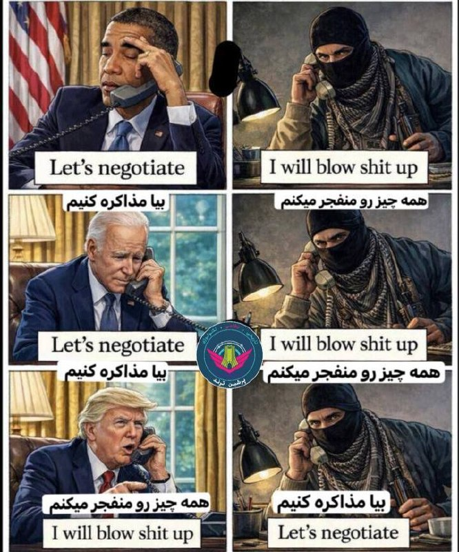

⭕️پست جدید دونالد ترامپ

⚠️ترجمه فارسی در تحریریه پرشین ترند به تصویر اصلی اضافه شده است .

🫆:Tony

📌 @persian_trend_official
پرشین ترند | متفاوت‌ترین کانال نظامی

## Persian_Trend_Official — post 14953

  <a href="telegram/content/Persian_Trend_Official_14953_1779727206.webm" target="_blank">🎬 Download video</a>

ویدیو لو رفته از مذاکرات آمریکا با جمهوری اسلامی 😒

📝 Nick

📌 @persian_trend_official
پرشین ترند | متفاوت‌ترین کانال نظامی

## Persian_Trend_Official — post 14952

  

🔹 دونالد ترامپ در پیامی مفصل اعلام کرد از کشورهایی که طی آخر هفته با آن‌ها گفت‌وگو داشته، از جمله پاکستان، ترکیه، مصر، اردن، بحرین، امارات، عربستان سعودی و قطر خواسته است هرچه سریع‌تر به توافقنامه‌های ابراهیم بپیوندند.

## Persian_Trend_Official — post 14951

  <a href="telegram/content/Persian_Trend_Official_14951_1779727207.webm" target="_blank">🎬 Download video</a>

🚨 فوری:
وال استریت ژورنال: مذاکرات ایران رو بحث برنامه هسته‌ای و رفع تحریم‌ها به بن بست رسیده.

📝 Nick

📌 @persian_trend_official
پرشین ترند | متفاوت‌ترین کانال نظامی

## Persian_Trend_Official — post 14950

🔴 یک منبع سعودی به CNN:

▪️ عربستان تنها در صورتی روابط خود با اسرائیل را عادی‌سازی خواهد کرد که «مسیر غیرقابل بازگشت» برای تشکیل کشور فلسطین وجود داشته باشد
▪️ ریاض تأکید کرده موضعش «همان موضع همیشگی» است
▪️ این اظهارات پس از آن مطرح شد که ترامپ از احتمال گسترش شناسایی اسرائیل در منطقه پس از توافق احتمالی با ایران صحبت کرده بود

🫆:Tony

📌 @persian_trend_official
پرشین ترند | متفاوت‌ترین کانال نظامی

## RadioFarda — post 157544

خاویار دریای خزر به دوران اوج خود بازمی‌گردد؟

🔸خاویار دریای خزر که زمانی یکی از منابع ثروت بزرگ منطقه بود، به‌خاطر دهه‌ها صید بی‌رویه، آلودگی، احداث سدها و کاهش جریان رودها و همچنین تخریب زیستگاه‌ها تقریبا در آستانه نابودی قرار گرفته است.

🔸اکنون کشورهای حاشیه این دریا مثل قزاقستان و ایران تلاش می‌کنند پرورش خاوریار را دوباره زنده کنند و به آن رونقی دوباره بدهند.

🔸محصول خاویار دریای خزر که از قرن هفدهم میلادی مورد بهره‌برداری قرار گرفته، در ابتدا، جشن‌های تزارهای روس را زینت می‌داد و در قرن بیستم از سوی جمهوری‌های اتحاد شوروی به یک تولید استراتژیک برای صادرات و ایجاد ارز خارجی تبدیل شد.

🔸در گذشته، تقریباً تمام خاویار سیاه جهان از کشورهای حاشیه دریای خزر، شامل قزاقستان، روسیه، ایران، ترکمنستان و جمهوری آذربایجان تأمین می‌شد، اما اکنون کشورهایی چون چین، بلاروس، ژاپن، آلمان و دانمارک و نروژ جایگزین کشورهای دریای خزر شده‌اند.

🔸ماهیان خاویاری می‌توانند تا ۱۰۰ سال در آب شور دریا زندگی کنند و برای تولیدمثل به آب شیرین رودخانه‌ها باز‌گردند. اکنون دست‌کم سه دهه است که همه گونه‌های ماهیان خاویاری از سوی اتحادیه بین‌المللی حفاظت از طبیعت در وضعیت «در معرض انقراض بحرانی» طبقه‌بندی شده‌اند.

🔸در این شرایط، دولت‌ها و همچنین شرکت‌ها در حاشیه دریای خزر می‌خواهند که این محصول ارزشمند را با کمک پرورش مصنوعی نجات، و تولید آن را دوباره افزایش دهند.

🔸 گزارش کامل را در وب‌سایت رادیوفردا بخوانید.

@RadioFarda

## RadioFarda — post 157543

🔸دونالد ترامپ، رئیس جمهور آمریکا، روز دوشنبه در تازه‌ترین پیام خود در شبکه اجتماعی‌اش ضمن خبر دادن از پیشرفت «خوب» در مذاکره با ایران، از تمام کشورهای دخیل در این مذاکرات خواست پس از حصول توافق با ایران، بلافاصله به پیمان‌های ابراهیم بپیوندند. 🔸پیمان یا پیمان‌های…

## RadioFarda — post 157542

  

🔸دونالد ترامپ، رئیس جمهور آمریکا، روز دوشنبه در تازه‌ترین پیام خود در شبکه اجتماعی‌اش ضمن خبر دادن از پیشرفت «خوب» در مذاکره با ایران، از تمام کشورهای دخیل در این مذاکرات خواست پس از حصول توافق با ایران، بلافاصله به پیمان‌های ابراهیم بپیوندند.

🔸پیمان یا پیمان‌های ابراهیم طرحی بود که دونالد ترامپ در دوره اول خود برای تلاش در راه عادی‌سازی روابط میان اعراب و اسرائیل آغاز کرد و موفق شد تا چندین کشور از جمله بحرین و امارات متحده عربی را هم به این کار ترغیب کند.

🔸حال رئیس جمهور آمریکا روند توافق با جمهوری اسلامی را به این طرح پیوند زده و به گفته خود این «خواسته اجباری» را با دیگر کشورهای عرب خلیج فارس و همین طور ترکیه مطرح کرده که به‌فوریت و همزمان به پیمان ابراهیم بپیوندند.

@RadioFarda

## IranianMinds — post 20739

  

پدر تنگسیری منظورشه.

@IranianMinds

## IranianMinds — post 20738

  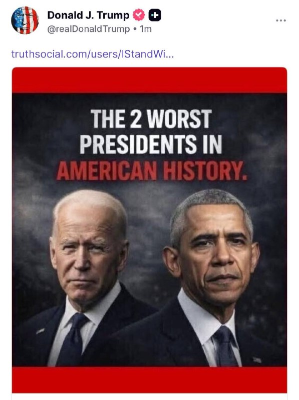

🔴 گاییدی این بدبختارو ولشون کن

نوشته : دوتا از بدترین رئیس جمهور های تاریخ آمریکا.

@IranianMinds

## IranianMinds — post 20736

🔴 پست های جدید ترامپ :

@IranianMinds

## IranianMinds — post 20734

🔴 الحدث : ایران قبول کرد که اورانیوم خودشو از کشور خارج کنه و آماده ی اینکاره. @IranianMinds

## IranianMinds — post 20733

🔴 الحدث :

ایران قبول کرد که اورانیوم خودشو از کشور خارج کنه و آماده ی اینکاره.

@IranianMinds

## IranianMinds — post 20732

  <a href="telegram/content/IranianMinds_20732_1779727208.mp4" target="_blank">🎬 Download video</a>

🔴 تحلیلگر صداوسیما :

هر موقع که پولا اومد تو‌ حسابمون میریم پای میز مذاکره

+ رهبر موشلمین جهان رو به‌ پول فروختید ؟

@IranianMinds

## IranianMinds — post 20731

  

🔴 رویترز به نقل از منابع اسرائیلی:

نتانیاهو گفته فعلا نمی‌تواند روی تصمیمات ترامپ درباره ایران تاثیر بگذارد

اسرائیل تا حد زیادی از مذاکرات آمریکا و ایران کنار گذاشته شده
نتانیاهو نگران توافق احتمالی واشنگتن و تهران است

نتانیاهو می‌خواهد آزادی عمل نظامی برای حمله به ایران داشته باشد!

@IranianMinds

## IranianMinds — post 20730

🔴 سخنگوی اقلیم کردستان :

ترامپ هیچ سلاحی اصلا برای استفاده و رسوندن به گروهای مخالف جمهوری اسلامی به ما ارسال نکرده و اگه کرده باشه هم به دست ما نرسیده

آمریکا بیاد اعلام کنه که سلاح هارو برای کی فرستاده چون ما چیزی دریافت نکردیم.

@IranianMinds

## IranianMinds — post 20729

🔴 یک منبع ایرانی به المیادین:

هیئت ایرانی در دوحه پس از پایان دیدار‌های خود، امشب به تهران بازمی‌گردند.

@IranianMinds

## IranianMinds — post 20728

  

🔴 وال استریت ژورنال :

در مذاکرات ایران و آمریکا دو طرف سر مسئله هسته ای و لغو‌ تحریم ها به بن بست خوردن.

@IranianMinds

## IranianMinds — post 20727

💯 اگر هنوز ۵۰۰ هزارتومان رو نگرفتی همین الان عضو شو‌ و جایزتو بگیر
نیازی هم به واریز نیست

👍 تنها سایت مورد #تایید ما با بونوس های واقعی

🌐 Winro.io

## IranianMinds — post 20726

  <a href="telegram/content/IranianMinds_20726_1779727210.webm" target="_blank">🎬 Download video</a>

⭕️ تنها جایی که در لحظه عضویت بهت 500 هزارتومان موجودی میده اینجاس 
❌

🎉 کافیه فقط عضو بشی تا #وینرو بهت 
🤩 
🤩 
🤩 هزارتومان جایزه بده ، نیازی هم به واریز نیست.

⌛ پشتیبانی 24 ساعته

🍆تنها سایت مورد اعتماد ما با بونوس های کاملا واقعی و رویایی:

🌐 Winro.io

🌐 Winro.io
کانال بونوس های رایگان g4

📱 @winro_io

## IranianMinds — post 20725

  

🔴 رویترز:

قالیباف و عراقچی در دوحه با نخست‌وزیر قطر درباره توافق احتمالی با آمریکا برای پایان جنگ گفت‌وگو کردند.

محور اصلی مذاکرات تنگه هرمز و ذخایر اورانیوم غنی‌شده ایران بود ، رئیس بانک مرکزی ایران هم در این نشست حضور داشت

درباره آزادسازی دارایی‌های بلوکه‌شده ایران در توافق احتمالی نیز صحبت شده است.

@IranianMinds

## BBCPersian — post 282031

🔻در پی اعتراضات دانشجویی در ترکیه، رجب طیب اردوغان، رئیس جمهور ترکیه، دستورش برای تعطیلی یکی از قدیمی‌ترین دانشگاه‌های آن کشور را پس گرفت.

رئیس‌جمهور ترکیه سه روز پیش دستور داده بود که دانشگاه «استانبول بیلگی» که به داشتن گرایش‌های سیاسی لیبرال شناخته می‌شود، تعطیل شود.

دولت در هشت ماه گذشته مدیریت این دانشگاه را بر عهده داشته است.

شرکت «جان هولدینگ»، مالک دانشگاه، به اتهام «پول‌شویی و فرار مالیاتی» تحت تحقیق قرار داشت.

این شرکت همچنین مالک شبکه‌های عمده تلویزیونی و چندین مدرسه در ترکیه است.

📸AFP via Getty Images
@BBCPersian

## BBCPersian — post 282030

  

🔻شبکه تلویزیونی و اینترنتی «منوتو» بعد از ۱۶ سال به کار خود پایان داد.

این رسانه فارسی‌زبان از سال ۲۰۱۰ در لندن با مدیریت کیوان و مرجان عباسی به روی آنتن ماهواره رفت و به یکی از پربیننده‌ترین تلویزیون‌های فارسی‌زبان تبدیل شد.

اما حدود دو سال و نیم پیش، به دلیل «مشکلات مالی» پخش تلویزیونیش را متوقف کرد و مدتی بعد، فعالیتش را محدودتر از سر گرفت.

مدیران این شبکه، علاوه بر محدودیت‌های مالی، این بار به «دگرگونی‌های بنیادین در عرصه رسانه‌ای و سیاسی» ایران اشاره کرده و گفته‌اند که فضا خصمانه‌تر و قطبی‌تر شده و مجموعه این شرایط، ادامه فعالیت را برای منوتو غیرممکن کرده است.

https://bbc.in/43uDwNI
@BBCPersian

## BBCPersian — post 282029

  

🔻بتسالل اسموتریچ، وزیر دارایی اسرائیل، خواستار تخریب ساختمان‌ها در بیروت برای مقابله با «تهدید پهپادهای انفجاری حزب‌الله» شد.

این وزیر راست افراطی اسرائیل در پستی در شبکه اجتماعی ایکس به کشته شدن یک سرباز اسرائیلی در حمله پهپادی امروز حزب‌الله در جنوب لبنان اشاره کرد و نوشت: «برای هر پهپاد انفجاری، ۱۰ ساختمان باید در بیروت فرو بریزد.»

او تاکید کرد که «پاسخ به یک تهدید قابل توجه باید قابل توجه باشد.»

آقای اسموتریچ نوشت: «شما با یک تهدید استراتژیک تنها با سپر دفاعی مقابله نمی‌کنید، بلکه باید با تغییر قوانین و معادله با آن مقابله کنید.»

📸AFP via Getty Images
https://bbc.in/43uAYz6
@BBCPersian

## BBCPersian — post 282028

🔻خبرگزاری فارس: پهپاد متخاصم در حریم خلیج فارس سرنگون شد

خبرگزاری فارس می‌گوید که پهپادهای رهگیر موسوم به آرش کمانگیر یک «پهپاد متخاصم» را بر فراز آب‌های خلیج فارس سرنگون کرده‌اند.

این خبرگزاری که به نهادهای امنیتی و نظامی نزدیک است نوشت: «این عملیات که با به‌کارگیری سامانه‌ای با قابلیت‌های پنهان انجام شد، پیامی روشن و قاطع از سوی ایران به شمار می‌رود. مقامات مربوطه تصریح کرده‌اند که این نشانه از طرف ماست تا دیگر هیچ پهپاد رادارگریزی نتواند بر آسمان خلیج فارس نفوذ کند.»

در این گزارش به نوع یا مبدا یا کشور سازنده پهپاد اشاره نشده است.

ایالات متحده می‌گوید که که محاصره دریایی ایران ادامه دارد اما نیروی دریایی سپاه امروز گفت که ۳۲ کشتی نفتکش، کانتینری یا تجاری پس از «اخذ مجوز با هماهنگی» این نیروها از تنگه هرمز عبور کرده‌اند.

سپاه دیروز هم گفت ۳۳ کشتی عبور کرده‌اند.

https://bbc.in/4v8Jxf0
@BBCPersian

## BBCPersian — post 282027

🔻نخست‌وزیر پاکستان با رئیس جمهور چین دیدار کرد

خبرگزاری دولتی شینهوا چین گزارش کرده که شهباز شریف، نخست‌وزیر پاکستان، در سفر خود به چین با شی جین پینگ، رئیس جمهور چین، دیدار کرده است.

سفر نخست‌وزیر پاکستان و فرمانده ارتش این کشور به چین در ادامه تلاش‌های دیپلماتیک چندین کشور برای پایان رسمی جنگ آمریکا و اسرائیل با ایران است.

پیش از این گزارش داده بود که فیلد مارشال عاصم منیر، مذاکره کننده ارشد پاکستان هم به پکن سفر کرده است.

آقای شریف پیش از این با لی چیانگ، نخست وزیر چین، دیدار کرده بود.

https://bbc.in/49hnc6r
@BBCPersian

## BBCPersian — post 282025

🔻ویشکا آسایش، بازیگر سینما، مجموعه مجسمه‌های برنزی ساخته و برای نخستین بار در نیویورک آنها را به نمایش گذاشته است.

نمایشگاه مجسمه‌های ویشکا آسایش از روز چهارشنبه (۲۰ مه / ۳۱ اردیبهشت) در گالری بیرند گکلر نیویورک افتتاح شده است.

بهمن کلباسی، خبرنگار بی‌بی‌سی در نیویورک با او در مورد مجسمه‌هایش گفتگو کرده است.

@BBCPersian

## idfinfarsi — post 11643

‼️برای رفع تهدید: ارتش اسرائیل روز گذشته (یکشنبه) یک تروریست کلیدی از ستاد تولید سازمان تروریستی حماس را به هلاکت رساند

⭕️نیروهای ارتش اسرائیل تحت فرماندهی جنوب، روز گذشته (یکشنبه) در مرکز نوار غزه حمله کرده و محمد ابو ملوح، یکی از تروریست‌های کلیدی در ستاد تولید سازمان تروریستی حماس را به هلاکت رساندند.

⭕️ابو ملوح یکی از منابع اصلی دانش در سازمان تروریستی حماس بود و در طول دوره آتش‌بس، اقدام به تولید تسلیحاتی کرده بود که تهدیدی برای نیروهای ارتش اسرائیل در منطقه و شهروندان این کشور محسوب می‌شد.

⭕️نیروهای ارتش اسرائیل تحت فرماندهی جنوب مطابق با توافق در منطقه مستقر هستند و به فعالیت خود برای رفع هرگونه تهدید فوری ادامه خواهند داد.

## Dirty_Kids — post 390162

  

خبرگزاری الحدث:
منابع ایرانی به ما گفتن؛ ایران ظاهراً آمادست اورانیوم غنی‌شده‌ی سطح بالاشو از کشور خارج کنه!

@Dirty_Kids 👻

## Dirty_Kids — post 390161

قهوه‌ی جدید گرفتم. مامانم خورده می‌گه مثل قهوه‌ی خودمون نیست. قهوه‌ی خودمون آخه؟ مزرعه داریم تو کنیا؟

@Dirty_Kids 👻

## Dirty_Kids — post 390160

  <a href="telegram/content/Dirty_Kids_390160_1779727213.mp4" target="_blank">🎬 Download video</a>

این چه سمّیه دیگه؟😐😂
این چادریا میرن تجمعات شبونه شعارمیدن یه برده شکار میکنن میارن خونه

@Dirty_Kids 👻

## Dirty_Kids — post 390159

  

بادبان با همراهی شما 90 هزار نفری شد!
🎉

🛒به این مناسبت، قیمت سرویس‌ها تا گیگی 150 هزار تومان کاهش پیدا کرد! 
🚀

🎁 کد تخفیف خرید اول دوباره ریست شد و همه میتونن ازش استفاده کنن:
BadBan4k

💸 با این کد، 50 هزار تومان تخفیف روی اولین خریدت بگیر!

🔥و مهم‌تر از همه...
سیستم معرفی بادبان فعال‌تر از همیشه‌ست!
از تمام خریدهای کاربرانی که معرفی میکنی، 10% خریدشون رو پورسانت دائمی دریافت کن و موجودی کیف پولت رو افزایش بده 
💼

وقتی بادبان داری،
هیچ بادی مانع نیست… حتی وقتی اینترنت ملیه
⛵️
G4

🛡@BadBan_VPN | کانال 

🤖@BadBan_VPNBot | ربات 

📞@BadBan_VPNSupport | پشتیبانی

## Dirty_Kids — post 390155

پست‌های رگباری لحظاتی پیش شیر AIبه‌باسن در تروث‌سوشال که نیاز به توضیح نداره و تصاویر گویاست:

@Dirty_Kids 👻

## Dirty_Kids — post 390154

  

«ریچارد گلدبرگ» مشاور ارشد بنیاد دفاع از دموکراسی‌ها در خصوص اون توییت طولانی ترامپ که به کشورهای قرمساق مسلمون منطقه گفته بود اگه می‌خواید من با جمهوی‌اسلامی تفاهم‌نامه امضا کنم اول باید شما به پیمان ابراهیم و صلح با اسرائیل بپیوندید، نوشته که:

«کشورهایی که ترامپ برای پیوستن به پیمان ابراهیم تحت فشارشون گذاشته دقیقاً همون پدرقحبه‌هایی هستند که حالا رامپ رو تحت فشار گذاشتن تا از پروژه‌ی آزادی دست بکشه و به جاش با رژیم قحبه‌ی روافض معامله کنه.

واکنش ترامپ در این شرایط کاملاً منطقی به نظر می‌رسه.
واقعاً اگر این کار انجام شه، یک دستاورد تاریخی خواهد بود و ضربه‌‌ی استراتژیک بسیار سنگین به رژیم کس‌پدر روافض وارد می‌کنه.»

@Dirty_Kids 👻

## Dirty_Kids — post 390153

  

جالب اینکه هیچ کسمغز رافضی این سؤال به مغز نداشته‌ش خطور نمی‌کنه که،

چطور ممدباقر سوار هواپیما می‌شه تا کشور قرمساق قطر می‌ره، اما سه ماهه پاشو تو طویله‌ی بهارستان نذاشته و تو بانکر قایم شده.

@Dirty_Kids 👻

## Dirty_Kids — post 390152

  

🔴 وال استریت ژورنال:
مذاکرات ایران بر سر برنامه هسته‌ای و لغو تحریم‌ها به بن‌بست خورده.

@Dirty_Kids 👻

## Dirty_Kids — post 390151

  

ترامپ :
مذاکرات با ایران داره خوب پیش میره؛

یا یه توافق خفن درمیاد که به نفع همه‌ست، یا اصلاً توافقی در کار نیست و دوباره برمی‌گردیم به جنگ، اونم شدیدتر از قبل؛
من با رهبرای عربستان، قطر، امارات، ترکیه، مصر، پاکستان و بقیه حرف زدم و گفتم وقتشه همتون وارد توافق ابراهیم بشید.
اگه ایرانم با من توافق کنه، خیلی اتفاق بزرگی میشه که اونا هم به این جمع اضافه بشن.
به نظرم این میتونه بزرگ‌ترین و تاریخی‌ترین توافق خاورمیانه باشه؛ یه چیزی که منطقه رو قوی، پولدار و متحد کنه.

@Dirty_Kids 👻

## Dirty_Kids — post 390150

  <a href="telegram/content/Dirty_Kids_390150_1779727216.mp4" target="_blank">🎬 Download video</a>

مامانا با بچه هاشونم دارن این چالشو میرن

@Dirty_Kids 👻

## Dirty_Kids — post 390149

  <a href="telegram/content/Dirty_Kids_390149_1779727217.mp4" target="_blank">🎬 Download video</a>

کلیپ وایرال شده تو اینستاگرام فارسی

یه قر بدیم با دوغ آبعلی و تو جایی که شاه ساخته یعنی خوشبختیم همه‌چی اوکیه

@Dirty_Kids 👻

## Hranews — post 113158

  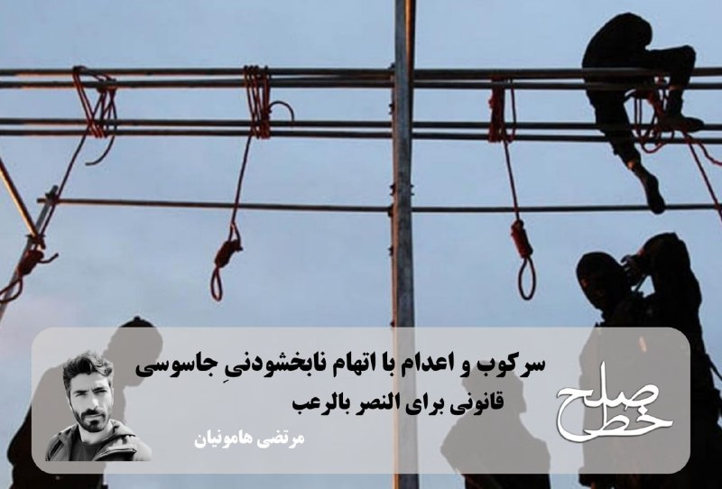

سرکوب و اعدام با اتهام نابخشودنیِِ جاسوسی/ مرتضی هامونیان

📡
📡
📡
📡
📡– هر بار حکومت بهانه‌ای تازه برای گرفتن جان انسان‌ها پیدا می‌کند؛ حکومتی که در تمام عمر خود نشان داده ارزشی برای حیات شهروندان قائل نیست. تازه‌ترین نمونه‌اش در جریان #جنگ آمریکا و اسرائیل با ایران آشکار شد؛ جایی که روشن شد سال‌ها بودجه‌های کلان پدافند غیرعامل یا صرف اموری نامعلوم شده یا اساساً کارکردی برای حفاظت از مردم نداشته است. نتیجه این شد که شهروندان زیر موشک‌باران، حتی از ابتدایی‌ترین امکان یعنی پناهگاهی امن برای حفظ جان خود نیز محروم بودند. حسام‌الدین آشنا، مقام امنیتی پیشین و رئیس مرکز بررسی‌های استراتژیک (زیر مجموعه‌ی نهاد ریاست جمهوری) در دولت‌های یازدهم و دوازدهم در نخستین برنامه‌ی «اسپرسو» با مجری‌گری محمد دلاوری –که از پلت‌فرم روبیکا پخش می‌شود—، با ارجاع به کشور سوئیس و وجود پناهگاه بزرگ اتمی در آن کشور می‌گوید که ما باید به حفظ جان مردم توجه می‌کردیم. اما آن‌چه در عمل رخ داد، درست نقطه‌ی مقابل حفاظت از جان مردم بود. نه تنها اراده‌ای برای حفظ جان شهروندان دیده نشد، بلکه حکومت هم‌زمان مسیر قانونی تازه‌ای نیز برای گرفتن جان انسان‌ها ایجاد کرد. حاصل آن، تصویب «قانون تشدید مجازات جاسوسی و همکاری با رژیم صهیونیستی و کشورهای متخاصم علیه امنیت و منافع ملی» بود؛ قانونی که در ظاهر با نام امنیت معرفی می‌شود، اما در عمل ابزار سرکوب دیگری در اختیار حاکمیت قرار می‌دهد تا به بهانه‌ی اتهام جاسوسی، دامنه‌ی اعدام و حذف مخالفان را گسترش دهد.(۱)

اگر در مقطع تابستان ۱۳۶۷، کشتار زندانیان سیاسی به صورت اعدام‌های فراقضایی رخ داد (تعبیری که عفو بین‌الملل در گزارش خود در آذر ۱۳۹۷ به دلیل خارج از رویه‌های قضایی بودن آن اعدام‌ها، به آن نسبت داد)، این بار قرار است با ابزاری قانونی و اتهامی که حیثیت و آبروی متهم را هدف قرار می‌دهد، مخالفین سیاسی را #اعدام و یا مرعوب کنند: اتهام جاسوسی و همکاری با اسرائیل و کشورهای متخاصم علیه امنیت و منافع ملی ایران. بر اساس تبصره‌ی اول ماده‌ی یک این قانون، آمریکا و اسرائیل به عنوان «دولت متخاصم» شناخته می‌شوند و تعیین متخاصم بودن سایر کشورها نیز به تشخیص شورای عالی امنیت ملی (شعام) واگذار شده است. این یعنی دست باز برای شعام که هر وقت بخواهد، کشوری را متخاصم اعلام کند و با این قانون، کم‌ترین مراوده با آن کشور می‌تواند حکم اعدام به همراه داشته باشد. بماند که اصولاً برای اعدام و اتهام‌زنی، نیازی به مراوده هم نیست. دستگاه‌های اطلاعاتی رنگارنگ جمهوری اسلامی با اتکا به اعترافات اخذشده تحت فشار و شکنجه، سناریوهای امنیتی خود را تولید می‌کنند و در غیاب دادرسی عادلانه، همان روایت‌ها مبنای صدور حکم قرار می‌گیرد. در چنین فضایی، رئیس دستگاه قضای نظام هم به مخالفین اعدام می‌گوید که تو غلط می‌کنی که می‌گویی فلانی اعدام نشود.

ادامه مطلب

ادامه و لینک به مطلب در وبسایت خط صلح

#مرتضی_هامونیان

↘️
@hranews_bot تماس ✉️ - @Hranews کانال هرانا 🆑

## Hranews — post 113157

  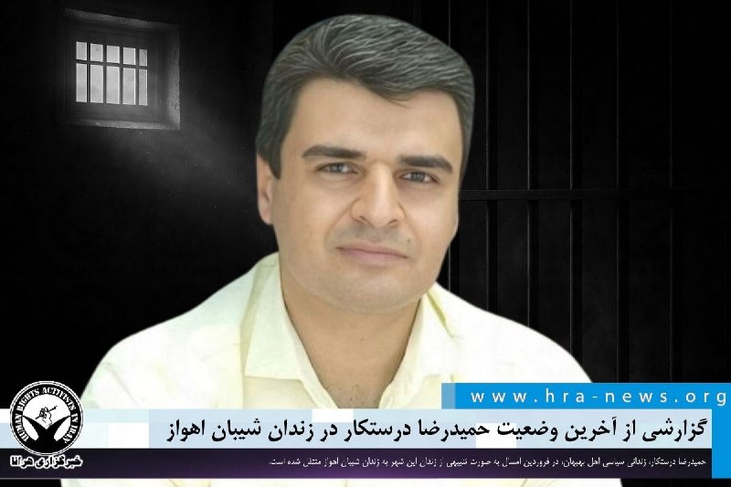

گزارشی از آخرین وضعیت حمیدرضا درستکار در زندان شیبان اهواز

❗️
❗️
❗️
❗️
❗️– حمیدرضا درستکار، زندانی سیاسی اهل بهبهان، در حال تحمل دوران محکومیت خود در زندان شیبان اهواز است. وی در فروردین‌ماه امسال به صورت تنبیهی از زندان بهبهان به زندان شیبان منتقل شد.

به گزارش خبرگزاری هرانا، ارگان خبری مجموعه فعالان حقوق بشر در ایران، حمیدرضا درستکار در زندان شیبان اهواز محبوس است.

یک منبع نزدیک به خانواده این زندانی سیاسی به هرانا گفت: در جریان جنگ، حمیدرضا به‌دلیل طرح مطالبه تخلیه زندان، به «ایجاد آشوب و شورش در زندان» متهم و در ۱۵ فروردین‌ماه به‌صورت تنبیهی به زندان شیبان منتقل شد. این در حالی است که درخواست تخلیه زندان در آن شرایط، مطالبه‌ای مشترک میان تمامی زندانیان بوده است.

ادامه مطلب

#حمیدرضا_درستکار

↘️
@hranews_bot تماس ✉️ -  @Hranews  کانال هرانا 🆑

## alonews — post 122615

  <a href="telegram/content/alonews_122615_1779727220.webm" target="_blank">🎬 Download video</a>

👈سی ان ان:
مذاکرات به خوبی درحال پیش رفتن است

✅ @AloNews خبر جنگ

## alonews — post 122614

  <a href="telegram/content/alonews_122614_1779727220.webm" target="_blank">🎬 Download video</a>

👈وال استریت ژورنال به نقل از واسطه‌ها:
واشنگتن و تهران به مواضع خود در مورد مسائل هسته‌ای و دارایی‌های مسدود شده پایبند هستند..

✅ @AloNews خبر جنگ

## alonews — post 122613

  <a href="telegram/content/alonews_122613_1779727220.webm" target="_blank">🎬 Download video</a>

👈‏سی‌ان‌ان از مسئولان آمریکایی:
اختلافاتی درباره نگارش مربوط به برنامه هسته‌ای ایران و رفع تحریم‌ها مانع از نهایی شدن توافق شده است

✅ @AloNews خبر جنگ

## alonews — post 122612

  <a href="telegram/content/alonews_122612_1779727220.webm" target="_blank">🎬 Download video</a>

👈 کانال ۱۵ اسرائیل به نقل از یک منبع:
اسرائیل در پی تشدید حملات پهپادی حزب‌الله، در حال بررسی تغییر رویکرد نظامی خود در لبنان است.

✅ @AloNews خبر جنگ

## alonews — post 122611

  <a href="telegram/content/alonews_122611_1779727220.webm" target="_blank">🎬 Download video</a>

👈یک منبع مطلع به i24NEWS: مذاکرات بین ایران و آمریکا پیشرفت دارد اما مشکلاتی وجود دارد، تغییرات و "ارتقاءهایی" که هر طرف در زبان یادداشت درخواست می‌کند.

🔴 هیئت ایرانی که به قطر آمده است، تلاشی برای پر کردن شکاف‌های جدی است - مانند مسئله آزادسازی وجوهی که ایرانی‌ها درخواست می‌کنند.

✅ @AloNews خبر جنگ

## alonews — post 122610

  <a href="telegram/content/alonews_122610_1779727221.webm" target="_blank">🎬 Download video</a>

👈محمدباقر ذوالقدر، دبیر شورای عالی امنیت ملی: هیچ عقب‌نشینی وجود نخواهد داشت. این موضوع در میدان نظامی، میدان دیپلماتیک و مردم حاضر در خیابان‌ها با مقاومت شجاعانه‌شان که دشمن را ناتوان کرده است، به اثبات رسیده است.

🔴اکنون بیش از هر زمان دیگری، کشور به وحدت و انسجام نیاز دارد تا آمریکایی‌ها و اسرائیلی ها نیز در این زمینه ناامید شوند. میدان وحدت و انسجام، عرصه‌ای دیگر در مبارزه است.

🔴تلاش جمعی برای جلوگیری از هرگونه سخنان و اقدامات تفرقه‌انگیز، ایران عزیز را به پیروزی نهایی خواهد رساند.

✅ @AloNews خبر جنگ

## alonews — post 122609

  <a href="telegram/content/alonews_122609_1779727221.webm" target="_blank">🎬 Download video</a>

👈خبرنگار الجزیره در تهران: به نظر می‌رسد گره مذاکرات ایران و آمریکا در مسیر حل شدن قرار دارد و ابتکار قطر برای حل اختلاف میان تهران و واشنگتن نقش اساسی در این روند ایفا کرده است؛ به‌طوری که دوحه عملاً یک میانجی بوده، نه صرفاً کمک‌کننده به روند میانجی‌گری.
‌

🔴 تنها چند ساعت باقی مانده است.

✅ @AloNews خبر جنگ

## alonews — post 122608

  <a href="telegram/content/alonews_122608_1779727221.webm" target="_blank">🎬 Download video</a>

👈فایننشال تایمز: دو نفتکش حامل گاز طبیعی مایع (LNG) از تنگه هرمز عبور کردند

✅ @AloNews خبر جنگ

## alonews — post 122607

  <a href="telegram/content/alonews_122607_1779727221.webm" target="_blank">🎬 Download video</a>

👈شبکه CNN: توافق احتمالی ترامپ با ایران می‌تواند تقریباً به اندازه تصمیم او برای آغاز جنگ اختلاف‌برانگیز شود

🔴طرح کلی توافق پیشنهادی، بسیار کمتر از «تسلیم بی‌قید و شرط» است که ترامپ در مارس از ایران مطالبه می‌کرد. برخی از جمهوری‌خواهان می‌ترسند که بالعکس این ترامپ باشد که تسلیم ایران می‌شود

✅ @AloNews خبر جنگ

## alonews — post 122605

  <a href="telegram/content/alonews_122605_1779727221.webm" target="_blank">🎬 Download video</a>

👈ترامپ عکس‌هایی را که به جو بایدن و باراک اوباما درباره ایران تمسخر می‌کند، دوباره منتشر می‌کند

✅ @AloNews خبر جنگ

## alonews — post 122604

  <a href="telegram/content/alonews_122604_1779727221.mp4" target="_blank">🎬 Download video</a>

👈پاپ لئو چهاردهم : هوش مصنوعی باید خلع سلاح شه

✅ @AloNews خبر جنگ

## alonews — post 122603

  <a href="telegram/content/alonews_122603_1779727223.webm" target="_blank">🎬 Download video</a>

🔴فوری / الحدث : منابع نزدیک میگن ایران آماده‌ست اورانیوم با غنای بالا رو از کشور خارج کنه

✅ @AloNews خبر جنگ

## alonews — post 122602

  <a href="telegram/content/alonews_122602_1779727223.webm" target="_blank">🎬 Download video</a>

👈 الحدث به نقل از منابع عالی‌رتبه:
به احتمال زیاد فرمانده ارتش پاکستان به دوحه سفر خواهد کرد.

✅ @AloNews خبر جنگ

## alonews — post 122601

  <a href="telegram/content/alonews_122601_1779727223.webm" target="_blank">🎬 Download video</a>

👈 جنگنده‌های اسرائیلی در آسمان جنوب لبنان دیوار صوتی را شکستند.

✅ @AloNews خبر جنگ

## alonews — post 122600

  <a href="telegram/content/alonews_122600_1779727223.webm" target="_blank">🎬 Download video</a>

👈 ارتش اسرائیل (IDF): نیروهای دفاعی اسرائیل آغاز به حمله به سایت‌های زیرساختی حزب‌الله در منطقه صور و مناطق اضافی در جنوب لبنان کرده‌اند.

✅ @AloNews خبر جنگ

## alonews — post 122597

  <a href="telegram/content/alonews_122597_1779727223.mp4" target="_blank">🎬 Download video</a>

👈صحنه‌هایی از حملات اسرائیل به صور در جنوب لبنان

✅ @AloNews خبر جنگ

## alonews — post 122596

  <a href="telegram/content/alonews_122596_1779727225.webm" target="_blank">🎬 Download video</a>

👈کانال تلگرامی Fighterbomber که وابسته به نیروهای هوافضای روسیه است، قول می‌دهد که روسیه «کی‌یف را تمام خواهد کرد.»

✅ @AloNews خبر جنگ

<!-- MSG END -->

<!-- NAV START -->

<a href="https://github.com/kiavash-sh/aio-downloader/blob/main/telegram/content/archive_1.md" style="display:inline-block; padding:6px 12px; margin:0 4px; background-color:#2ea44f; color:white; text-decoration:none; border-radius:4px; font-weight:bold;">صفحه بعد</a>

<!-- NAV END -->
