# خواننده تلگرام

<!-- TOP_NAV START -->

<a href="https://github.com/kiavash-sh/aio-downloader/blob/main/telegram/content/archive_1.md" style="display:inline-block; padding:6px 12px; margin:0 4px; background-color:#2ea44f; color:white; text-decoration:none; border-radius:4px; font-weight:bold;">صفحه بعد</a>

<!-- TOP_NAV END -->

<!-- MSG START -->

---
📅 بروزرسانی: 1405/03/02 17:39
---

## VahidOOnLine — post 241726

  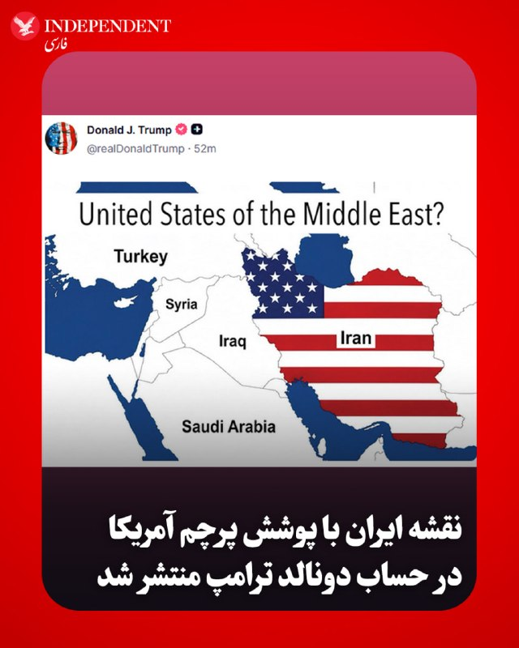

♦️ دونالد ترامپ، رئیس‌جمهوری ایالات متحده، همزمان با تلاش گسترده و فشرده میانجی‌های پاکستانی برای امضای تفاهم‌نامه میان تهران و واشنگتن، تصویری از نقشه ایران را که با پرچم آمریکا پوشانده شده، در شبکه اجتماعی تروث سوشال منتشر کرد. روی این نقشه نوشته شده است: «ایالات متحده خاورمیانه؟»

ترامپ توضیح بیشتری در این‌باره ارائه نکرده است.
‌🇸🇦 Indypersian

🤖 @VahidOOnLine

## VahidOOnLine — post 241725

♦️مارکو روبیو، وزیر امور خارجه ایالات متحده، روز شنبه دوم خردادماه در جریان بازگشایی سفارت آمریکا، از یک لوح طلایی آمریکا رونمایی کرد. روبیو در مراسم افتتاح ساختمان الحاقی پشتیبانی سفارت آمریکا در دهلی‌نو شرکت کرد.
او در این مراسم با لحنی طنزآمیز گفت این نخستین لوحی است که نصب کرده و افزود: «شاید ۱۰۰ سال دیگر، نوه‌های من وقتی به اینجا بیایند، این لوح را ببینند.»
روبیو این اقدام را نمادی از تداوم حضور و روابط آمریکا در این کشور توصیف کرد؛ مراسمی که با هدف تقویت روابط دیپلماتیک و نمایش همکاری‌های دوجانبه برگزار شد.
‌🇸🇦 Indypersian

🤖 @VahidOOnLine

## VahidOOnLine — post 241724

  

عباس عراقچی، وزیر خارجه جمهوری اسلامی، در پیامی به شیخ نعیم قاسم، دبیرکل حزب‌الله لبنان، گفت: «جمهوری اسلامی دست از حمایت حزب‌الله نخواهد کشید و همچنان از جنبش‌های مطالبه‌گر حق و آزادی پشتیبانی می‌کند. تهران پیوند آتش‌بس لبنان با هر توافق احتمالی را به‌عنوان شرط مطرح کرده است.»
‌🏁 🇬🇧 IranintlTV

🤖 @VahidOOnLine

## VahidOOnLine — post 241722

  <a href="telegram/content/VahidOOnLine_241722_1779545364.mp4" target="_blank">🎬 Download video</a>

بر اساس گزارش منابع محلی که به ایران اینترنشنال رسیده، اکبر محمدی، متولد ۱۴ شهریور ۱۳۶۴ و ساکن محله دهنوی اصفهان، پس از بازداشت و انتقال به زندان دستگرد جان خود را از دست داده است. بر اساس این گزارش، او سوم اردیبهشت‌ماه همراه برادرش بازداشت شد. منابع محلی می‌گویند اکبر در تماس با خانواده از بیماری و محرومیت از رسیدگی پزشکی در زندان خبر داده و گفته بود اجازه مراجعه به بهداری یا دریافت دارو نداشته است. به گفته این منابع، حال او پس از مدتی وخیم شد و بعد از دو هفته به بیمارستان الزهرای اصفهان منتقل شد، اما پس از چند روز به کما رفت و در نهایت بر اثر عفونت شدید ریه جان باخت. منابع محلی می‌گویند اکبر محمدی از پیگیران اخبار اعتراضات و انتشار تصاویر جان‌باختگان محله دهنو بود، و نیروهای بسیجی محله با او درگیر شده و سپس در خانه‌اش بازداشت شد.
‌🏁 🇬🇧 IranintlTV

🤖 @VahidOOnLine

## VahidOOnLine — post 241721

  <a href="telegram/content/VahidOOnLine_241721_1779545366.mp4" target="_blank">🎬 Download video</a>

بر اساس گزارش ان‌بی‌سی، دونالد ترامپ جونیور، پسر بزرگ رئیس‌جمهور آمریکا، با بتینا اندرسون در فلوریدا ازدواج کرده است، اما دونالد ترامپ احتمالاً در مراسم این آخر هفته شرکت نخواهد کرد.
ترامپ در گفت‌وگو با خبرنگاران گفته مراسم «یک رویداد کوچک و خصوصی» است و به دلیل شرایط کاری در کاخ سفید و مسائل سیاسی از جمله وضعیت جمهوری‌اسلامی، امکان حضور ندارد. او تأکید کرده که در این مقطع زمانی نمی‌تواند از واشنگتن خارج شود و مسئولیت‌های دولت را اولویت می‌داند.
ترامپ همچنین با اشاره به فشارهای رسانه‌ای گفته است که چه در صورت حضور و چه عدم حضور در مراسم، مورد انتقاد قرار خواهد گرفت. او در شبکه اجتماعی خود نیز ازدواج پسرش را تبریک گفته اما تأکید کرده که به دلیل «مسائل دولت و شرایط حساس فعلی» در مراسم حاضر نخواهد شد.
‌🏁 🇬🇧 ManotoTV

🤖 @VahidOOnLine

## VahidOOnLine — post 241720

  

العربیه گزارش داد جمهوری اسلامی دو پیشنهاد به میانجی پاکستانی ارائه کرده که بر اساس آن، در ازای پرداخت غرامت از سوی آمریکا، تنگه هرمز را باز کند و پیش از امضای هرگونه توافقی، پرونده تحریم‌ها و دارایی‌های مسدود شده مورد بحث قرار گیرد.

دونالد ترامپ، رییس‌جمهوری آمریکا، پیش‌تر گفته بود که حاضر به پرداخت غرامت به تهران نیست.
‌🏁 🇬🇧 IranintlTV

🤖 @VahidOOnLine

## VahidOOnLine — post 241719

  

اسماعیل بقائی، سخنگوی وزارت امور خارجه جمهوری اسلامی، گفت: «ما به توافق خیلی دور و خیلی نزدیک هستیم.» او افزود: «ما تجربه ضد و نقیض گویی طرف آمریکایی را داریم و دیدگاه‌های خود را بارها تغییر داده‌اند.»

سخنگوی وزارت خارجه جمهوری اسلامی درباره سفر عاصم منیر، رییس ستاد کل ارتش پاکستان، به تهران، گفت: «پاکستان به عنوان میانجی نقش مهمی را ایفا کرده و هدف از این سفر ادامه تبادل پیام‌ها بین ایران و آمریکا بود.»

بقائی درباره مذاکرات گفت: «تمرکز ما در این مرحله بر خاتمه جنگ است براساس پیشنهاد ۱۴ بندی تهران که چندین بار رفت و برگشت شده و در خصوص بندهای مختلف آن دیدگاه‌های طرفین تبادل شده است.»
‌🏁 🇬🇧 IranintlTV

🤖 @VahidOOnLine

## VahidOOnLine — post 241718

  

سنتکام، فرماندهی مرکزی ایالات متحده، اعلام کرد که در شش هفته گذشته، بیش از ۱۵ هزار سرباز، ملوان، تفنگدار دریایی و نیروی هوایی آمریکا مسیر حرکت ۱۰۰ شناور را تغییر داده‌اند، چهار شناور را از کار انداخته‌اند و اجازه عبور به ۲۶ کشتی حامل کمک‌های بشردوستانه داده‌اند.

سنتکام افزود: «بیش از ۲۰۰ هواگرد و ناو جنگی آمریکا از این مأموریت پشتیبانی می‌کنند.»

فرماندهی مرکزی ایالات متحده نوشت: «این محاصره علیه شناورهای متعلق به تمامی کشورها که وارد بنادر و مناطق ساحلی ایران می‌شوند یا از آنها خارج می‌شوند، از جمله تمامی بنادر ایران در خلیج فارس و دریای عمان، اعمال می‌شود.»
‌🏁 🇬🇧 IranintlTV

🤖 @VahidOOnLine

## VahidOOnLine — post 241717

  

فداحسین مالکی، عضو کمیسیون امنیت ملی و سیاست خارجی مجلس، گفت در صورت ازسرگیری جنگ، چین و روسیه جمهوری اسلامی را تنها نخواهند گذاشت و آمریکا «با یک آرایش دفاعی نوین مواجه خواهد شد.»

او گفت: «تداوم سفرهای دیپلماتیک و رایزنی‌های فشرده میان ایران، چین و روسیه نشان‌دهنده یک واقعیت راهبردی است؛ اینکه اگر آمریکا مرتکب خطای محاسباتی شود و شعله جنگ مجددی را بیفروزد، قطعا با یک آرایش دفاعی نوین مواجه خواهد شد و جمهوری اسلامی در این تقابل هرگز تنها نخواهد بود.»

مالکی افزود در شرایط کنونی که بحران میان جمهوری اسلامی و آمریکا به دلیل روحیه تهاجمی و رفتارهای خارج از عرف دونالد ترامپ، رییس‌جمهوری آمریکا، پیچیده‌تر شده، تهدید امنیت تنگه هرمز عملا معادلات انرژی، تجاری و اقتصادی جهان را با چالشی جدی مواجه کرده است.
‌🏁 🇬🇧 IranintlTV

🤖 @VahidOOnLine

## VahidOOnLine — post 241716

  <a href="telegram/content/VahidOOnLine_241716_1779545369.mp4" target="_blank">🎬 Download video</a>

♦️شهباز شریف، نخست‌وزیر پاکستان، روز شنبه دوم خردادماه وارد شهر هانگژو چین شد تا نخستین بخش از سفر چهارروزه خود به این کشور را آغاز کند.
او در هانگژو در یک نشست تجاری با هدف تقویت همکاری میان شرکت‌های پاکستانی و چینی شرکت خواهد کرد و در مراسم امضای توافق‌نامه‌ها و تفاهم‌نامه‌های دوجانبه حضور می‌یابد.
بر اساس برنامه اعلام‌شده، شریف سپس به پکن سفر خواهد کرد و با شی جین‌پینگ، رئیس‌جمهور چین و لی چیانگ، نخست‌وزیر این کشور دیدار می‌کند. همچنین وی در مراسم هفتاد و پنجمین سالگرد روابط دیپلماتیک پاکستان و چین نیز شرکت خواهد داشت.
‌🇸🇦 Indypersian

🤖 @VahidOOnLine

## VahidOOnLine — post 241715

  <a href="telegram/content/VahidOOnLine_241715_1779545370.mp4" target="_blank">🎬 Download video</a>

همزمان با سایر شهرهای استان لرستان، دانش‌آموزان دورود نیز تجمعات اعتراضی تشکیل دادند و خواستار مجازی شدن امتحانات خود شدند. این اعتراضات در یاسوج، خرم‌آباد و بروجرد نیز روز شنبه برگزار شده است.
‌🏁 🇬🇧 IranintlTV

🤖 @VahidOOnLine

## VahidOOnLine — post 241714

  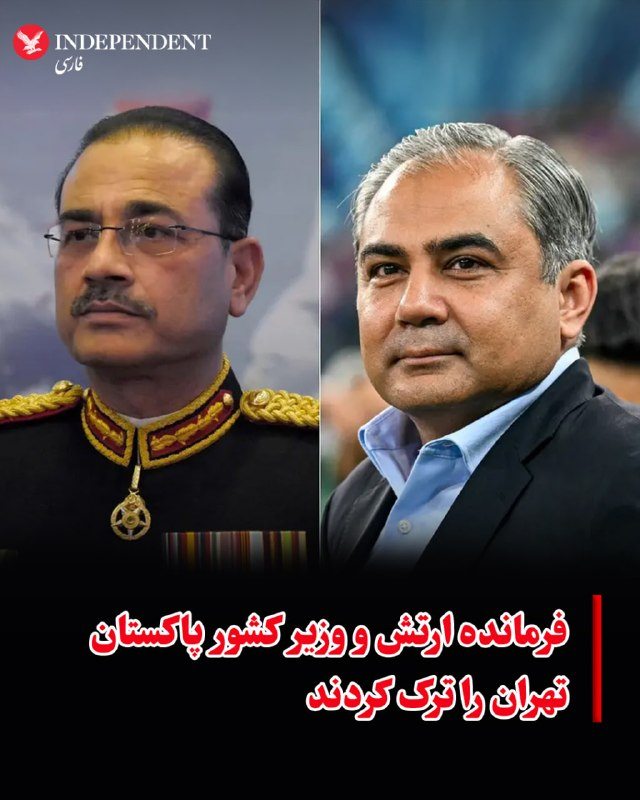

♦️عاصم منیر، فرمانده ارتش پاکستان، به‌همراه محسن نقوی، وزیر کشور، روز شنبه دوم خردادماه پس از پایان سفر خود تهران را ترک کردند.
فرمانده ارتش پاکستان در این سفر یک‌روزه با شماری از مقام‌های ارشد جمهوری اسلامی از جمله مسعود پزشکیان، رئیس‌جمهور، محمدباقر قالیباف، رئیس مجلس و عباس عراقچی، وزیر امور خارجه دیدار و گفتگو کرد.
وزیر کشور پاکستان نیز که از هفته گذشته در تهران حضور داشت، در جریان این سفر در رایزنی‌های مختلف دوجانبه شرکت کرده بود. جزئیات بیشتری از محورهای این دیدارها منتشر نشده است.
‌🇸🇦 Indypersian

🤖 @VahidOOnLine

## VahidOOnLine — post 241713

  <a href="telegram/content/VahidOOnLine_241713_1779545372.mp4" target="_blank">🎬 Download video</a>

ویدیوی رسیده به ایران اینترنشنال نشان می‌دهد دانش‌آموزان نورآباد لرستان روز شنبه همزمان با دیگر شهرهای این استان به اعتراضات علیه حضوری شدن اعتراضات پیوستند.
‌🏁 🇬🇧 IranintlTV

🤖 @VahidOOnLine

## VahidOOnLine — post 241712

  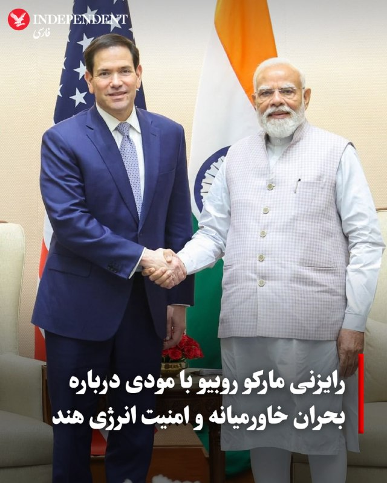

♦️ مارکو روبیو، وزیر امور خارجه آمریکا، روز شنبه دوم خرداد، در جریان سفر خود به هند با نارندرا مودی، نخست‌وزیر این کشور، درباره بحران خاورمیانه و به‌ویژه هزینه‌های انرژی گفتگو کرد.

تامی پیگات، سخنگوی وزارت امور خارجه آمریکا، اعلام کرد که روبیو در این دیدار تاکید کرده است ایالات متحده اجازه نخواهد داد جمهوری اسلامی بازار جهانی انرژی را به گروگان بگیرد. او همچنین تصریح کرد که فرآورده‌های انرژی آمریکا پتانسیل بالایی برای تنوع بخشیدن به منابع تامین انرژی هند دارند.

هند به شدت به واردات نفت و گاز از خاورمیانه وابسته است؛ به طوری که بر اساس آمار اداره اطلاعات انرژی آمریکا، پس از چین، دومین واردکننده بزرگ نفت خام از طریق تنگه هرمز به شمار می‌رود. طبق داده‌های موجود، ۷۴ درصد از کل نفت خام عبوری از این تنگه در سه‌ماهه اول سال گذشته میلادی تنها به چهار کشور چین، هند، ژاپن و کره جنوبی ارسال شده است.

روبیو همچنین در این دیدار به نمایندگی از دونالد ترامپ، از نخست‌وزیر هند برای سفر به کاخ سفید دعوت به عمل آورد.
‌🇸🇦 Indypersian

🤖 @VahidOOnLine

## VahidOOnLine — post 241711

  

همزمان با افزایش تنش‌ها و احتمال ازسرگیری درگیری‌ها، حبیب‌الله سیاری، معاون هماهنگ‌کننده ارتش جمهوری اسلامی، گفت نیروهای مسلح برای مقابله با هرگونه تهدید آمادگی دارند و منتظر فرمان مجتبی خامنه‌ای هستند.

او گفت: «نیروهای مسلح در پاسداری از تمامیت ارضی و استقلال کشور، مهیای خلق بیت‌المقدس‌هایی دیگر در برابر هر فتنه و جنگ تحمیلی هستند و این را دنیا بداند که هویت ما با ایثار و وطن‌پرستی گره خورده است.»
‌🏁 🇬🇧 IranintlTV

🤖 @VahidOOnLine

## VahidOOnLine — post 241710

  <a href="telegram/content/VahidOOnLine_241710_1779545374.mp4" target="_blank">🎬 Download video</a>

⭕️ معاون سازمان ملی بهره‌وری: بهره‌وری در ایران نزدیک صفر است

♦️اسماعیل حبیبی، معاون سازمان ملی بهره‌وری ایران در گفتگو با صداوسیما اعلام کرد بهره‌وری کلی در ایران «نزدیک صفر» است.
او گفت این عدد نشان می‌دهد «از منابع خود به خودی استفاده نمی‌کنیم» و با اشاره به روندهای تامین انرژی در کشور، نمونه‌هایی از عدم بهره‌وری را تشریح کرد.
حبیبی از وضعیت موجود با عنوان «دومینوی عدم بهره‌وری» نام برد و توضیح داد مشکلات موجود در بخش‌های مختلف، به‌صورت زنجیره‌ای بر یکدیگر اثر گذاشته و موجب کاهش کارایی در حوزه انرژی و سایر بخش‌ها شده است.
حبیبی همچنین گفت: «ایران از نظر منابع در رتبه پنجم جهان قرار دارد، اما از نظر تولید ناخالص داخلی (GDP) در رتبه ۳۷ است.»
اظهارات معاون سازمان ملی بهره‌وری در حالی مطرح می‌شود که طی سال‌های اخیر، بحران انرژی، قطعی برق، کمبود گاز و فرسودگی زیرساخت‌ها بارها به‌عنوان نشانه‌هایی از ناکارآمدی و ضعف بهره‌وری در اقتصاد ایران مورد بحث قرار گرفته است.
‌🇸🇦 Indypersian

🤖 @VahidOOnLine

## VahidOOnLine — post 241709

روایت شما از زندگی در آتش‌بس- شنبه ۲ خرداد ۱۴۰۵

🔹 امروز شنبه ۲ خرداد، ما دانش‌آموزان مقابل آموزش‌وپرورش استان آذربایجان غربی در ارومیه تجمع کردیم برای غیرحضوری شدن امتحانات.
🔹 من تمام دوره‌های درسم را از تلگرام دانلود می‌کردم. دروس تخصصی را از یوتیوب تماشا می‌کردم. چند دوره هم از اینستاگرام خریده بودم و حالا کنکور دارم و باید با هیچی درس بخونم. به امید آزادی.
🔹 از رفسنجان، بعد از چند وقت قطع بودن امروز ۲ خرداد وصل شدم. خواستم بگم مردم امیدتونو از دست ندین، نور بر تاریکی پیروز است.
🔹 حتی اینترنت پرو که با ۱۰ برابر قیمت اینترنت قبلی فروخته می‌شود هم با اشکال و ناپایدار وصل می‌شود. کلاً با روح و روان آدم بازی می‌کنن.
🔹 یوتیوبرم، فقط ماهی ۳ میلیون باید هزینه فیلترشکن کنم که بتونم ویدیو آپلود کنم.
🔹 من یه دختر ۱۵ ساله هستم و هیچی از نوجوونیم نفهمیدم. فکر و ذکرم شده قیمت دلار و نگرانی برای آینده‌ام. انقدر همه‌چی گرون شده که شخصاً خجالت می‌کشم از خانوادم چیزی بخوام. به امید روزهای بهتر،
‌🏁 🇬🇧 IranintlTV

🤖 @VahidOOnLine

## VahidOOnLine — post 241708

  <a href="telegram/content/VahidOOnLine_241708_1779545376.mp4" target="_blank">🎬 Download video</a>

شیخ تمیم بن حمد آل ثانی، امیر قطر، در تماس تلفنی با دونالد ترامپ، رئیس‌جمهور آمریکا، درباره تنش‌های منطقه‌ای و ابتکارهای دیپلماتیکی که با محوریت پاکستان برای جلوگیری از تشدید بحران در حال انجام است، گفت‌وگو کرده است.
در این تماس، دو طرف تلاش‌ها برای کاهش تنش‌ها و حفظ ثبات منطقه را بررسی کردند و بر حمایت از میانجی‌گری پاکستان میان ایالات متحده و جمهوری‌اسلامی تاکید شد.
همچنین در این گفت‌وگو بر اهمیت ادامه مذاکرات و گفت‌وگوهای دیپلماتیک برای حل مسائل جاری، حفاظت از کشتیرانی دریایی و تضمین امنیت مسیرهای راهبردی آبی تأکید شد؛ موضوعی که به ثبات بازار جهانی انرژی و زنجیره تأمین نیز مرتبط است.
‌🏁 🇬🇧 ManotoTV

🤖 @VahidOOnLine

## VahidOOnLine — post 241707

  <a href="telegram/content/VahidOOnLine_241707_1779545377.mp4" target="_blank">🎬 Download video</a>

بر اساس گزارشی که در روزنامه تایمز منتشر شده، یک تحقیق مخفیانه نشان می‌دهد یک شبکه مرتبط با جمهوری‌اسلامی از طریق تلگرام تلاش کرده شهروندان بریتانیایی را برای سازماندهی تجمعات خیابانی ضد اسرائیلی و پخش پوسترهای تبلیغاتی جذب کند.
در این گزارش آمده است که خبرنگار تایمز به‌صورت مخفیانه وارد ارتباط با فردی شده که خود را «مهدی» معرفی کرده و مدعی بوده در ایران مستقر است و با ساختارهای امنیتی جمهوری‌اسلامی در ارتباط است. این فرد در پیام‌های خود پیشنهاد پرداخت پول در ازای سازماندهی تجمع، جذب افراد جدید و اجرای فعالیت‌های تبلیغاتی در لندن را مطرح کرده است.
همچنین از این خبرنگار خواسته شده ابتدا برای اثبات اعتماد، اقدام به نصب پوستر در خیابان‌های لندن و فیلم‌برداری از آن کند. این پوسترها شامل پیام‌های سیاسی علیه اسرائیل بوده است.
در ادامه، درخواست‌هایی برای گسترش فعالیت و حتی طراحی پروژه‌های آنلاین نیز مطرح شده و در نهایت حساب تلگرامی مربوطه به‌طور ناگهانی حذف شده است.
‌🏁 🇬🇧 ManotoTV

🤖 @VahidOOnLine

## VahidOOnLine — post 241706

  <a href="telegram/content/VahidOOnLine_241706_1779545377.mp4" target="_blank">🎬 Download video</a>

ویدیوی رسیده نشان می‌دهد دانش‌آموزان بروجرد در تجمع روز شنبه برای اعتراض به حضوری شدن امتحانات، فریاد «مجازی مجازی» سر دادند.
‌🏁 🇬🇧 IranintlTV

🤖 @VahidOOnLine

## WithYashar — post 12171

اسرائیل همچنان درحال بمباران مواضع حزب‌الله
@withyashar

## WithYashar — post 12170

Voice message

## WithYashar — post 12169

سخنگوی وزارت امور خارجهٔ ایران: این یادداشت تفاهم شامل ۱۴ بند برای پایان دادن به جنگ است و جزئیات آن طی یک بازهٔ ۳۰ تا ۶۰ روزه مورد بحث و بررسی قرار خواهد گرفت.
@withyashar

## WithYashar — post 12168

مارکو روبیو: مقداری پیشرفت در مذاکرات با ایران حاصل شده است.

همچنین این احتمال وجود دارد که آمریکا طی روزهای آینده دربارهٔ ایران چیزی برای اعلام داشته باشد.
@withyashar

## WithYashar — post 12167

یک مقام ایرانی به شبکه الجزیره: قطر نقش کلیدی در تهیه پیش‌نویس این یادداشت تفاهم ایفا کرد و بین میانجی‌ها و واشنگتن ارتباط وجود داشت
@withyashar

## WithYashar — post 12166

حزب‌الله اعلام کرد که پیامی از وزیر امور خارجه رژیم جمهوری اسلامی دریافت کرده است که در آن آمده ایران به حمایت از این گروه ادامه خواهد داد و آن را رها نخواهد کرد.
@withyashar

## WithYashar — post 12165

سخنگوی وزارت خارجه: پیشنهاد ۱۴ بندی ایران که چندین بار رفت و برگشت شده و در خصوص بندهای مختلف آن دیدگاه‌های طرفین تبادل شده است و در این چند روز راجع به برخی نکات و عبارت پردازی‌هایی که راجع به آن اختلاف نظر کماکان وجود داشت بحث و پیشنهاداتی مطرح شد که همچنان برخی از آن در حال بررسی و اعلام نظر است.
@withyashar

## WithYashar — post 12164

## WithYashar — post 12163

ادعای الجزیره: مقام ایرانی تایید کرد با واسطه پاکستانی به توافق رسیدند و منتظر جواب آمریکا هستند! @withyashar یک مقام ایرانی به الجزیره گفت: این یادداشت تفاهم شامل پایان جنگ، لغو محاصره، باز کردن تنگه هرمز و خروج نیروهای آمریکایی از منطقه جنگی است.

## WithYashar — post 12162

ادعای الجزیره: مقام ایرانی تایید کرد با واسطه پاکستانی به توافق رسیدند و منتظر جواب آمریکا هستند!
@withyashar
یک مقام ایرانی به الجزیره گفت: این یادداشت تفاهم شامل پایان جنگ، لغو محاصره، باز کردن تنگه هرمز و خروج نیروهای آمریکایی از منطقه جنگی است.

## WithYashar — post 12161

خبرنگار الجزیره در تهران:
شکاف‌های غیرقابل عبور در مذاکرات ایران و آمریکا وجود داره؛ لحظه بحران در راه است.
@withyashar

## WithYashar — post 12160

دیوید کیز، سخنگو و مشاور رسانه‌ای سابق نتانیاهو : 24 ساعت آینده تو ایران کاملاً حیاتیه یا هم شاید اصلاً نباشه، راستش خودم هم دقیق نمی‌دونم
@withyashar

## WithYashar — post 12159

رویترز: رئیس تیم مذاکره‌کننده ایران به مقام‌های ارشد نظامی پاکستان توضیح داد که ایران قصد ندارد در مذاکرات با آمریکا هیچ‌گونه امتیازی بدهد.
@withyashar

## WithYashar — post 12158

  

پست جدید ترامپ در تروث
@withyashar

## WithYashar — post 12157

Pishro x khalse x fadaei x tataloo x mj x ho3ein x erfan x sorena… – Minefield Remix ( IG @yashar)

## WithYashar — post 12156

## WithYashar — post 12155

  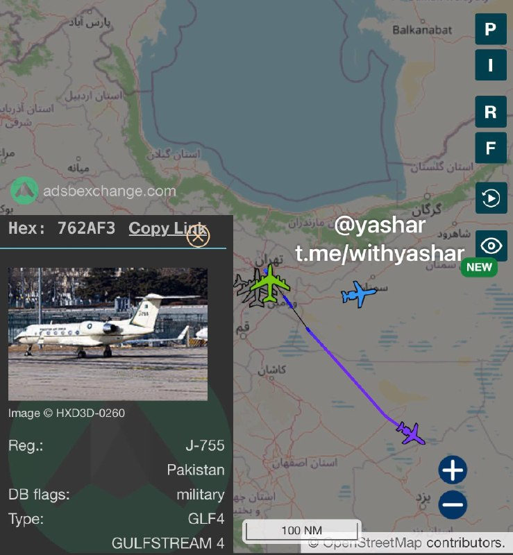

هواپیما دوم هیئت پاکستانی هم سیکتیر رو زد 😅✌🏾
@withyashar

## WithYashar — post 12154

ترامپ بیدار شد 😈

## WithYashar — post 12153

  <a href="telegram/content/WithYashar_12153_1779545380.mp4" target="_blank">🎬 Download video</a>

@withyashar

## WithYashar — post 12152

یاشار تو خرم اباد مردم جمع شدن دارن شعار میدن
چهارمحال بختیاری و لرستانم همینه

## mwarmonitor — post 9540

«سؤال در مورد موضوع ایرانه و همون‌طور که گفتم، پیشرفت‌هایی حاصل شده؛ یه سری پیشرفت‌ها صورت گرفته. حتی همین الان که دارم با شما صحبت می‌کنم، کارهایی داره انجام میشه. این احتمال وجود دارد که اواخر امروز، فردا یا چند روز آینده، حرفی برای گفتن داشته باشیم. اما این موضوع همون‌طور که رئیس‌جمهور گفتن، باید به هر طریقی حل بشه. ایران هرگز نمی‌تونه سلاح هسته‌ای داشته باشه. تنگه‌ها باید بدون پرداخت عوارض باز باشن. آن‌ها باید اورانیوم غنی‌شده‌شون رو، اورانیوم با غنای بالاشون رو تحویل بدن؛ ما باید به این موضوع بپردازیم، باید به مسئله غنی‌سازی بپردازیم. این‌ها نکات مورد تأکید همیشگی رئیس‌جمهور هستند و ترجیح ایشون همیشه پرداختن به این مسئله از طریق دیپلماتیکه. ترجیح رئیس‌جمهور همیشه حل مشکلاتی از این دست، از طریق یک راه‌حل دیپلماتیک مذاکره‌شده است. این چیزیه که در حال حاضر داریم روش کار می‌کنیم، اما این مشکل همون‌طور که رئیس‌جمهور به وضوح اعلام کردن، به هر طریقی حل خواهد شد. ما امیدواریم که این کار از مسیر دیپلماتیک انجام بشه؛ این چیزیه که داریم روش کار می‌کنیم و شاید در مقطعی که برای این بازدید این‌جا هستم، موضوعی برای گفتگو در این رابطه وجود داشته باشه»

@mwarmonitor

## mwarmonitor — post 9539

  <a href="telegram/content/mwarmonitor_9539_1779545381.mp4" target="_blank">🎬 Download video</a>

🎬 Video

## mwarmonitor — post 9538

⏳

## mwarmonitor — post 9537

🔴مقام ایرانی به الجزیره: یادداشت تفاهم شامل پایان جنگ، رفع محاصره، باز شدن تنگه هرمز و خروج نیروهای آمریکا از منطقه جنگی است.

‏🔸یادداشت تفاهم شامل موضوعات هسته‌ای نمی‌شود، زیرا این مسائل پیچیده هستند و به زمان کافی برای مذاکره نیاز دارند.

‏🔸 پس از ۳۰ روز از توافق، می‌توان باب مذاکرات هسته‌ای را باز کرد.

‏🔸قرار بود فرمانده ارتش پاکستان در تهران این یادداشت تفاهم را اعلام کند، اما او برای هماهنگی با واشنگتن تهران را ترک کرد.

‏🔸 قطر نقش اساسی در تدوین این یادداشت تفاهم داشته و میانجی‌ها نیز با واشنگتن در ارتباط بوده‌اند.

🔸 ایران نمی‌تواند امتیازاتی بیش از آنچه در یادداشت تفاهم آمده ارائه دهد.

@mwarmonitor

## mwarmonitor — post 9536

  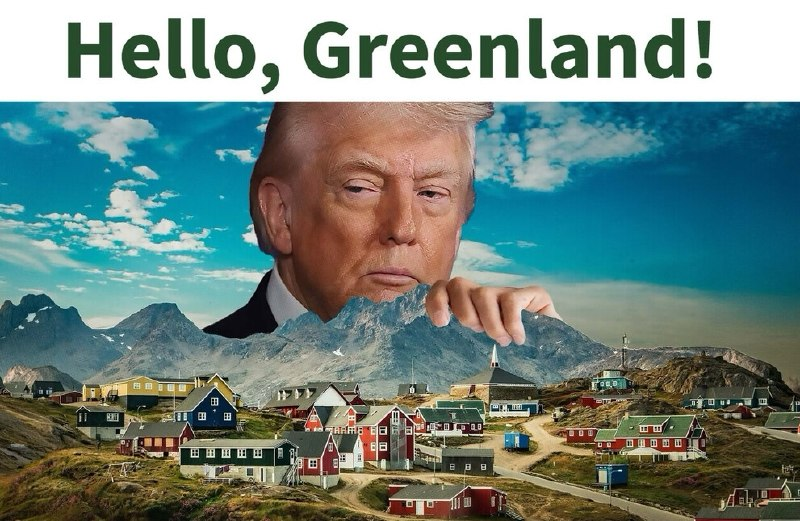

🔴ترامپ در سوشال تروث

@mwarmonitor

## mwarmonitor — post 9535

  

🔴ترامپ در سوشال تروث

@mwarmonitor

## mwarmonitor — post 9534

  

🚨نیویورک پست: ادعا می‌شود محمدباقر السعدی، مظنون عراقیِ مرتبط با سپاه پاسداران انقلاب اسلامی، در تلافی کشته‌شدن قاسم سلیمانی در سال ۲۰۲۰، قصد ترور ایوانکا ترامپ را داشته است. مقام‌ها می‌گویند او نقشه‌هایی از محل سکونت او در فلوریدا در اختیار داشته و خانواده…

## mwarmonitor — post 9533

🔴محاصره دریایی ایران توسط آمریکا؛ شمار کشتی‌های تغییر مسیر داده شده به ۱۰۰ فروند رسید

🔸ستاد فرماندهی مرکزی ایالات متحده (سنتکام)

🔰تامپا، فلوریدا — نیروهای ستاد فرماندهی مرکزی ایالات متحده (سنتکام) در تاریخ ۲۳ مه، در جریان اجرای محاصره دریایی علیه ایران، به حد نصاب جدیدی در تغییر مسیر بیش از ۱۰۰ فروند کشتی تجاری دست یافتند.
نیروهای آمریکایی بر اساس فرمان اجرایی رئیس‌جمهور، از تاریخ ۱۳ آوریل اجرای این محاصره را علیه کشتی‌های تجاری که به بنادر ایران وارد یا از آن خارج می‌شوند، آغاز کردند. طی شش هفته گذشته، بیش از ۱۵,۰۰۰ سرباز، ملوان، تفنگدار دریایی و نیروی هوایی، مسیر ۱۰۰ فروند کشتی را تغییر داده، ۴ فروند را متوقف (غیرفعال) کرده و به ۲۶ فروند کشتی حامل کمک‌های بشردوستانه اجازه عبور داده‌اند.

🔹دریادار برد کوپر، فرمانده سنتکام در این باره گفت:
«نیروهای ما کار فوق‌العاده‌ای انجام می‌دهند. آن‌ها این مأموریت را با دقت و حرفه‌ای‌گری بالا اجرا کرده و بسیار مؤثر عمل کرده‌اند؛ به طوری که اجازه هیچ‌گونه تجارتی را به بنادر ایران و بالعکس نداده‌اند و این امر ایران را تحت فشار اقتصادی قرار داده است.»
بیش از ۲۰۰ فروند هواپیما و ناو جنگی ایالات متحده از این مأموریت پشتیبانی می‌کنند؛ از جمله گروه ضربت ناو هواپیمابر آبراهام لینکلن، گروه ضربت ناو هواپیمابر جورج اچ.دبلیو. بوش، گروه آماده باش دوزیست تریپولی به همراه سی‌ویکمین واحد اعزامی تفنگداران دریایی، و چندین ناوشکن مجهز به موشک‌های هدایت‌شونده.
این محاصره دریایی علیه کشتی‌های تمامی کشورها که به بنادر و مناطق ساحلی ایران وارد یا از آن خارج می‌شوند، از جمله تمامی بنادر ایران در خلیج فارس و دریای عمان، در حال اجرا است.

@mwarmonitor

## mwarmonitor — post 9532

  

خب عاصم منیر رفت

## mwarmonitor — post 9531

🔸فرانسه ورود ایتامار بن‌گویر، وزیر امنیت ملی اسرائیل، به خاک خود را ممنوع کرده است. ژان-نوئل بارو، وزیر خارجه فرانسه، اعلام کرد این تصمیم به دلیل رفتار اسرائیل با فعالان ناوگان کمک‌رسانی به غزه گرفته شده است. او افزود پاریس و رم از اتحادیه اروپا می‌خواهند علیه او تحریم‌هایی اعمال کند.

@mwarmonitor

## mwarmonitor — post 9530

  

خب عاصم منیر رفت

## mwarmonitor — post 9529

  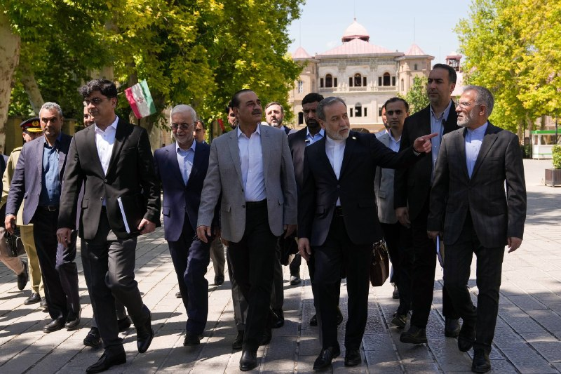

📝عباس نگاهی به آسمانِ ناامن می‌اندازد و می‌گوید: «حالا که این منیر اینجاست، بریم یه هوا بخوریم یه دوری بیرون بزنیم.» بدبخت را به عنوان گنبد آهنیِ گوشتی سپر کرده‌اند، چون خودشان هم خوب می‌دانند تنهایی حتی جرعت قدم زدن تو خونه ندارند، چه برسه به محوطه باز؛ آن هم وقتی که با هر صدای غرشِ باد، سایهٔ پهپادهای اسرائیل را بالای سرشان می‌بینند! این کمدیِ سیاه به قدری مضحک است که یک لشکر کت‌شلواری را دور خودشان دیوار کرده‌اند تا شاید پهپادهای نقطه‌زن در تفکیکِ اهداف دچار خطای محاسباتی شوند. خلاصه که این پیاده‌رویِ لرزان، هواخوری نیست؛ یک دوشِ آبِ سردِ دسته‌جمعی زیر تیغِ عزرائیلِ است!

@mwarmonitor

## mwarmonitor — post 9528

🔴ایالات متحده و اسرائیل در حال بررسی این موضوع هستند که آیا رهبر عالی، مجتبی خامنه‌ای را حذف کنند یا نه. 🔸بر اساس گزارش اسرائیل هیوم، آن‌ها می‌سنجند که آیا بقای او نوعی ثبات قابل‌کنترل ایجاد می‌کند، یا این‌که حذفش می‌تواند ساختار حاکمیتی ایران را بیش از پیش…

## mwarmonitor — post 9527

🔴ایالات متحده و اسرائیل در حال بررسی این موضوع هستند که آیا رهبر عالی، مجتبی خامنه‌ای را حذف کنند یا نه.

🔸بر اساس گزارش اسرائیل هیوم، آن‌ها می‌سنجند که آیا بقای او نوعی ثبات قابل‌کنترل ایجاد می‌کند، یا این‌که حذفش می‌تواند ساختار حاکمیتی ایران را بیش از پیش تضعیف کند.

@mwarmonitor

## FoxNewsTwitter — post 342159

  <a href="telegram/content/FoxNewsTwitter_342159_1779545387.mp4" target="_blank">🎬 Download video</a>

Fox News (Twitter/X)

WATCH: Newly released dashcam footage shows the moment Britney Spears was pulled over and arrested on suspicion of DUI in California back in March.

Her breath tests showed blood alcohol levels below California’s legal limit, but officers said they also found an unprescribed bottle of Adderall in the vehicle and concluded she was under the influence of alcohol and a stimulant.

Spears pleaded guilty earlier this month to reckless driving involving alcohol and drugs and avoided jail time.

## FoxNewsTwitter — post 342158

  

Fox News (Twitter/X)

“Full of fat, lazy trash who would rather not be in uniform.”

Resurfaced posts tied to Maine Democratic Senate candidate Graham Platner are back in the spotlight after he called the U.S. Army “absolute trash.”

The posts, made under the Reddit account “P-Hustle,” have become a major issue in Maine’s Senate race against GOP Sen. Susan Collins.

Platner has previously apologized for the comments, saying they were made during a period of combat trauma and do not reflect who he is today.

## pm_afshaa — post 91275

  <a href="telegram/content/pm_afshaa_91275_1779545389.webm" target="_blank">🎬 Download video</a>

⭕️ حتما عضو بشید، چنل جذابیه 
⭕️ @kanfigpx 
✊چنل مردمی ( دُنیـ‌ای آزاد )
✊ @kanfigpx تامین خبر واقعی، و از همه مهمتر، متصل بودنِ شما به دنیای آزاد با ما 
✌ @kanfigpx خبرهای دسته اول و فوری رو با ما داشته باشین
😎 @kanfigpx تنها کانالی که بدون وقفه ۹۰ روزه…

## pm_afshaa — post 91274

  <a href="telegram/content/pm_afshaa_91274_1779545389.webm" target="_blank">🎬 Download video</a>

⭕️ حتما عضو بشید، چنل جذابیه 
⭕️

@kanfigpx

✊چنل مردمی ( دُنیـ‌ای آزاد )
✊

@kanfigpx

تامین خبر واقعی، و از همه مهمتر، متصل بودنِ شما به دنیای آزاد با ما 
✌

@kanfigpx

خبرهای دسته اول و فوری رو با ما داشته باشین
😎

@kanfigpx

تنها کانالی که بدون وقفه ۹۰ روزه در حال فعالیت هست و کانفیگ‌هاشون هم از خودشونه بدون واسطه ازشون خرید کنین با خیال راحت و کیفیت تضمینی و با قیمت کاملا منطقی و پایین
🔥

@kanfigpx

## pm_afshaa — post 91273

سکوت بی‌بی عجیبه😁

## pm_afshaa — post 91272

  <a href="telegram/content/pm_afshaa_91272_1779545390.webm" target="_blank">🎬 Download video</a>

🔴الجزیره: مقام ایرانی تایید کرد با واسطه پاکستانی به توافق رسیدند و منتظر جواب آمریکا هستن.

این یادداشت تفاهم شامل پایان جنگ، لغو محاصره، باز کردن تنگه هرمز و خروج نیروهای آمریکایی از منطقه جنگی است.

💧 Rainbet.com the #1 Non-KYC Crypto Casino & Sportsbook @rainbetcom

😁 @Pm_Afshaa

## pm_afshaa — post 91271

  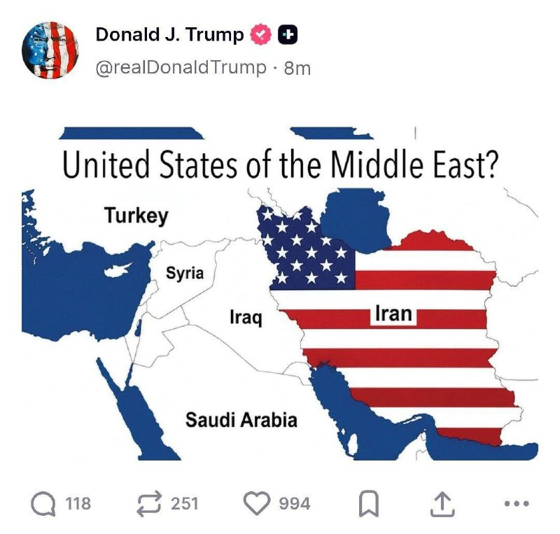

پست جدید ترامپ:ایالاتِ متحده‌ی خاورمیانه؟

💧 Rainbet.com the #1 Non-KYC Crypto Casino & Sportsbook @rainbetcom

😁 @Pm_Afshaa

## pm_afshaa — post 91270

  <a href="telegram/content/pm_afshaa_91270_1779545391.webm" target="_blank">🎬 Download video</a>

🔴خبرنگار الجزیره در تهران:
شکاف‌های غیرقابل عبور در مذاکرات ایران و آمریکا وجود داره؛ لحظه بحران در راه است.

💧 Rainbet.com the #1 Non-KYC Crypto Casino & Sportsbook @rainbetcom

😁 @Pm_Afshaa

## pm_afshaa — post 91269

  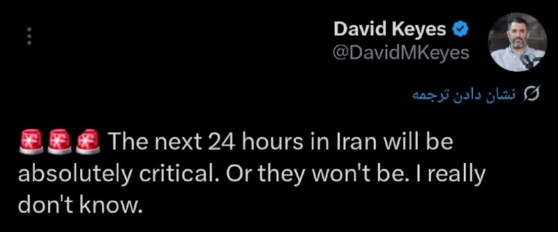

دیوید کیز، سخنگو و مشاور رسانه‌ای سابق نتانیاهو : 24 ساعت آینده تو ایران کاملاً حیاتیه یا هم شاید اصلاً نباشه، راستش خودم هم دقیق نمی‌دونم

💧 Rainbet.com the #1 Non-KYC Crypto Casino & Sportsbook @rainbetcom

😁 @Pm_Afshaa

## pm_afshaa — post 91268

ویدیویی از درگیری دانش آموزان با نیروهای سرکوب در خرم اباد 
💧 Rainbet.com the #1 Non-KYC Crypto Casino & Sportsbook @rainbetcom 
😁 @Pm_Afshaa

## pm_afshaa — post 91267

ویدیویی از درگیری دانش آموزان با نیروهای سرکوب در خرم اباد 
💧 Rainbet.com the #1 Non-KYC Crypto Casino & Sportsbook @rainbetcom 
😁 @Pm_Afshaa

## pm_afshaa — post 91266

  <a href="telegram/content/pm_afshaa_91266_1779545392.mp4" target="_blank">🎬 Download video</a>

ویدیویی از درگیری دانش آموزان با نیروهای سرکوب در خرم اباد

💧 Rainbet.com the #1 Non-KYC Crypto Casino & Sportsbook @rainbetcom

😁 @Pm_Afshaa

## pm_afshaa — post 91265

🔴امروز دانش‌آموزان شهر خرم‌آباد در استان لرستان با حضور در مقابل ساختمون آموزش و پرورش این شهر، نسبت به اقدامات آموزش و پرورش دست به تجمع اعتراضی زدن. تجمع دانش‌آموزان خرم‌آبادی با دخالت نیروهای بسیج و انتظامی به خشونت کشیده شده و نیروهای پلیس با باتوم و گاز اشک آور به بچه‌های مردم حمله کردن

💧 Rainbet.com the #1 Non-KYC Crypto Casino & Sportsbook @rainbetcom

😁 @Pm_Afshaa

## pm_afshaa — post 91262

  <a href="telegram/content/pm_afshaa_91262_1779545393.webm" target="_blank">🎬 Download video</a>

🔴عاصم منیر فرمانده ارتش پاکستان هم‌اکنون تهران به مقصد پاکستان ترک کرد.

💧 Rainbet.com the #1 Non-KYC Crypto Casino & Sportsbook @rainbetcom

😁 @Pm_Afshaa

## iaghapour — post 2627

⭕️ رکورددار تاریکی دیجیتال: ایران طولانی‌ترین قطعی اینترنت جهان را تجربه می‌کند!

روزنامه معتبر اسپانیایی «ال‌پایس» در گزارشی تکان‌دهنده اعلام کرده است که ایران با گذشت حدود ۸۰ روز خاموشی دیجیتال، رکورد طولانی‌ترین قطعی سراسری اینترنت در تاریخ یک جامعه دیجیتال را به نام خود ثبت کرده است. این محدودیت‌ها که ابتدا با توجیه شرایط امنیتی و جنگی آغاز شد، همچنان ادامه دارد.

طبق گزارش این رسانه و به نقل از نت‌بلاکس، این وضعیت حالا حتی از قطعی طولانی‌مدت اینترنت میانمار در سال ۲۰۲۱ نیز فراتر رفته و زندگی میلیون‌ها ایرانی را در بن‌بست قرار داده است:

🔹 آوارگی برای یک اتصال پایدار: ال‌پایس داستان تلخ افرادی را روایت می‌کند که برای حفظ شغل خود مجبور به مهاجرت موقت شده‌اند. مانند معلم زبانی که برای رهایی از اضطراب قطعی اینترنت، با هزینه ۴۰۰ دلار در ماه به زیرزمینی تاریک در ارمنستان پناه برده است.

🔸 ضربه مهلک به کسب‌وکارهای زنان: تداوم این اختلالات، آسیب‌های ویرانگری به مشاغل کوچک وارد کرده است؛ به‌ویژه کسب‌وکارهایی که توسط زنان اداره می‌شوند و حیات آن‌ها کاملاً به پلتفرم‌های آنلاین و شبکه‌های اجتماعی گره خورده بود.

🔹 فلج شدن زندگی روزمره: از کار از راه دور و تبادلات مالی گرفته تا ساده‌ترین ارتباطات انسانی و دسترسی به اطلاعات، همگی تحت تأثیر این محدودیت‌های بی‌سابقه مختل شده‌اند.

گزارش این روزنامه نشان می‌دهد که جهان در حال تماشای انزوای دیجیتال جامعه‌ای است که شهروندانش برای دسترسی به ابتدایی‌ترین حق ارتباطی خود، ناچارند هزینه‌های سنگین روانی، مالی و حتی مهاجرتی بپردازند./ دیجیاتو

🆔 @iAghapour

## DEJradio — post 4881

  <a href="telegram/content/DEJradio_4881_1779545394.mp4" target="_blank">🎬 Download video</a>

🚨
⭕️ تمرین هلی‌کوپترهای آمریکایی در عراق نزدیک مرز ایران

منابع محلی عراقی ویدیوهایی منتشر کرده‌اند که بر اساس آن‌ها ادعا می‌شود هلی‌کوپترهای آمریکایی در نزدیکی مرز ایران، تمرین هلی‌برن نیرو انجام داده‌اند.

اگرچه تاکنون هیچ منبع رسمی این خبر را تأیید نکرده است، اما مشابه این‌ تمرین،‌ در جریان جنگ ۴۰ روزه و در عملیات نجات خلبانان آمریکایی سقوط‌کرده در ایران انجام شده بود. با این حال، برخی فرماندهان ارشد جمهوری اسلامی و شماری از رسانه‌های بین‌المللی مدعی‌اند هدف اصلی آن عملیات، دستیابی به اورانیوم غنی‌شده بوده است.

دونالد ترامپ رئیس جمهوری آمریکا جمعه شب اول خرداد ۱۴۰۵ تهدید کرد «با جمهوری اسلامی همان کاری را می‌کنیم که با ونزوئلا کردیم.» در جریان عملیات دستگیری نیکلاس مادورو نیز هلی‌کوپترهای بلک‌هاوک و آپاچی ماموریت تهاجم را بر عهده داشتند و نیرو در کاخ ریاست جمهوری ونزوئلا هلی‌برن شد.

ساعاتی بعد از تهدید ترامپ، سازمان هواپیمایی کشوری جمهوری اسلامی اعلام کرد پروازها در آسمان غرب ایران ممنوع است.

#جنگ #عراق
@DEJradio

## DEJradio — post 4880

  <a href="telegram/content/DEJradio_4880_1779545396.mp4" target="_blank">🎬 Download video</a>

🔺🎥 دانش‌آموزان در چند شهر ایران نسبت به نحوه برگزاری امتحانات اعتراض کرده‌اند.

خبرگزاری فارس وابسته به سـ.ـپاه پاسداران هشدار داده است اگر این وضعیت مدیریت نشود، تبدیل به تهدیدی خطرناک خواهد شد!

#اعتراضات_سراسری
@DEJradio

## mamlekate — post 103572

  <a href="telegram/content/mamlekate_103572_1779545397.mp4" target="_blank">🎬 Download video</a>

جواد ظریف، انتخابات ۱۴۰۳: پزشکیان کسی‌ست که اینترنت شما را فیلتر نمی‌کند و بعد به شما فیلترشکن بفروشد.

@mamlekate

## VahidOnline — post 75647

  <a href="telegram/content/VahidOnline_75647_1779545398.mp4" target="_blank">🎬 Download video</a>

مارکو روبیو، وزیر امور خارجه ایالات متحده که در سفر هند به سر می‌برد:

ممکن است امروز خبرهایی (درباره ایران) منتشر شود. ممکن است نشود. امیدوارم منتشر شود. هنوز مطمئن نیستم. پیشرفت‌هایی حاصل شده است. همین الان که با شما صحبت می‌کنم، کارهایی در حال انجام است. این احتمال وجود دارد که شاید امروز، فردا، شاید چند روز دیگر حرفی برای گفتن داشته باشیم، اما این مسئله باید به هر نحوی حل شود.

ایران هرگز نمی‌تواند سلاح هسته‌ای داشته باشد.
تنگه هرمز باید بدون عوارض باز باشد.
آنها باید اورانیوم غنی‌شده خود را بدهند.
ما باید به موضوع غنی‌سازی بپردازیم.

ترجیح رئیس‌جمهور این است که به شیوه‌ای دیپلماتیک با آن برخورد شود. این چیزی است که ما در حال حاضر روی آن کار می‌کنیم.
EricLDaugh

📡 @VahidOnline

## VahidOnline — post 75646

  

عباس عراقچی، وزیر خارجه جمهوری اسلامی، در پیامی به شیخ نعیم قاسم، دبیرکل حزب‌الله لبنان، گفت: «جمهوری اسلامی دست از حمایت حزب‌الله نخواهد کشید و همچنان از جنبش‌های مطالبه‌گر حق و آزادی پشتیبانی می‌کند. تهران پیوند آتش‌بس لبنان با هر توافق احتمالی را به‌عنوان شرط مطرح کرده است.»
@VahidOOnLine

📡 @VahidOnline

## VahidOnline — post 75645

  

پرویز قلیچ‌خانی، کاپیتان پیشین تیم ملی فوتبال ایران و فعال سیاسی چپگرا در ۸۱ سالگی درگذشت. او به آلزایمرمبتلا بود.

نجمه موسوی-پیمبری، «یار و همراه» پرویز قلیچ‌خانی به بی‌بی‌سی فارسی گفت: «قهرمان ملی و چهره همیشه زنده ایران در تاریخ بیست و سوم ماه مه ٢٠٢٦ مصادف با دوم خرداد ١٤٠٥ در بیمارستانی در حومه پاریس درگذشت.»

آقای قلیچ‌خانی، پیش از انقلاب، علاوه بر تیم ملی، در باشگاه‌های تاج، پرسپولیس و پاس هم بازی کرد. او تنها بازیکنی است که با تیم ایران سه بار قهرمان جام ملت‌های آسیا شده است. پرویز قلیچ‌خانی بعد از انقلاب هم در خارج از کشور، مجله آرش را با گرایش سیاسی چپ اداره می‌کرد.

او فوتبال را از کوچه‌های محله صابون پزخانه میدان شوش تهران شروع کرد و بعد از مدتی کوتاه فوتبالیستی ماهر و بالاخره کاپیتان تیم ملی ایران شد.
ولی هنوز طعم قهرمانی فوتبال را درست نچشیده بود که توجهش به سیاست جلب شد و از پشت میله های زندان سر درآورد.
پس از انقلاب از فوتبالیست حرفه‌ای به فعال سیاسی و روزنامه‌نگار خارج‌نشین تبدیل شد.
@VahidHeadline

📡 @VahidOnline

## VahidOnline — post 75635

شبکه العربیه به نقل از منابع آگاه گزارش داد عاصم منیر، رییس ستاد کل ارتش پاکستان، پیام‌های آمریکا را به تهران منتقل کرده است و بخشی از این پیام حاوی تهدید به ازسرگیری جنگ بوده است.
در این پیام‌ها همچنین تاکید شده در صورت موافقت جمهوری اسلامی با توافق، حل مسائل اختلافی در مرحله بعدی انجام خواهد شد.
به گفته این منابع، آمریکا در پیام‌های خود تصریح کرده است تهران باید اکنون با توافق موافقت کند یا با پیامدهای منفی روبه‌رو شود.
@VahidOOnLine
شبکه العربیه، روز شنبه دوم خرداد ماه، به نقل از «یک منبع بلندپایه ایرانی» گزارش داد پیشنهاد ارائه‌شده از سوی تهران تاکنون نتوانسته رضایت آمریکا را جلب کند و همچنان از دید واشنگتن «غیرقابل قبول» تلقی می‌شود.
@VahidOOnLine
عاصم منیر، رییس ستاد کل ارتش پاکستان، پس از سفری یک روزه به تهران، ایران را ترک کرد.
به گزارش ایرنا، او به همراه محسن نقوی، وزیر کشور پاکستان که از هفته گذشته در تهران به سر می‌برد، پایتخت ایران را ترک کرده است.
عاصم منیر در جریان این سفر با محمدباقر قالیباف، رییس مجلس، مسعود پزشکیان، رییس‌جمهوری ایران و عباس عراقچی، وزیر امور خارجه دیدار و گفت‌وگو کرد.
@VahidHeadline
محمدباقر قالیباف در دیدار با عاصم منیر گفت نیروهای مسلح جمهوری اسلامی در دوران آتش‌بس بازسازی شده‌اند و در صورت آغاز دوباره جنگ، واکنش ایران شدیدتر خواهد بود.
او گفت: «نیروهای مسلح ما در دوران آتش‌بس به نحوی خود را بازسازی کرده‌اند که در صورت حماقت ترامپ و آغاز مجدد جنگ، حتما برای آمریکا کوبنده‌تر و تلخ‌تر از روز اول جنگ خواهند بود.»
قالیباف با اشاره به نقش پاکستان در میانجی‌گری افزود: «در آتش‌بسی بودیم که شما واسطه‌اش بودید و آمریکا با نقص عهد، محاصره دریایی کرد و حالا به‌دنبال برداشتن آن است.»
@VahidOOnLine
شیخ تمیم بن حمد آل ثانی، امیر قطر، روز شنبه دوم خرداد ماه در تماس تلفنی با دونالد ترامپ، رئیس‌جمهوری آمریکا، آخرین تحولات و رویدادهای فوری منطقه را بررسی کرد.
بر اساس بیانیه رسمی دیوان امیری قطر، این گفتگو بر «تلاش‌های منطقه‌ای و بین‌المللی برای حفظ آرامش کنونی و کاهش تنش‌ها» متمرکز بوده است.
«امنیت دریانوردی، حفظ ایمنی آبراه‌های راهبردی و تضمین تداوم روان زنجیره‌های تامین جهانی و انتقال انرژی» از دیگر محورهای این گفتگو توصیف شده است.
به گزارش رسانه‌های قطری، امیر قطر در این تماس بر موضع ثابت دوحه در اولویت دادن به راه‌حل‌های مسالمت‌آمیز برای بحران‌ها تاکید و اعلام کرد قطر از همه ابتکارهایی که با هدف مهار بحران‌ها از طریق گفتگو و دیپلماسی انجام می‌شود، حمایت می‌کند.
این خبر در حالی منتشر می‌شود که رسانه‌ها از گفتگوی تلفنی وزیرامورخارجه قطر با عباس عراقچی خبر داده‌اند.
همزمان گزارش‌ها از رایزنی‌های گسترده کشورهای منطقه برای جلوگیری از حملات احتمالی آمریکا به ایران خبر می‌دهد.
این در حالیست که شبکه خبری العربیه پیشتر از هشدار واشنگتن به تهران مبنی بر از سرگیری حملات به ایران خبر داده بود.
@VahidOOnLine

📡 @VahidOnline

## VahidOnline — post 75634

  

سخنگوی سازمان هواپیمایی ایران اعلام کرد این سازمان هیچ اطلاعیه رسمی هوانوردی جدیدی درباره اعمال محدودیت در آسمان کشور صادر نکرده است و شرایط پروازی عادی است.

او با تاکید بر تداوم وضعیت عادی پروازها گفت: «شرایط آسمان کشور همچنان مانند روال گذشته است و پروازها طبق برنامه انجام می‌شود.»

سخنگوی سازمان هواپیمایی بدون اشاره به جزئیات اطلاعیه هوانوردی (نوتام)، افزود: «نوتامی که اخیرا در فضای مجازی منتشر شده، تکذیب می‌شود.»

سازمان هواپیمایی کشوری ایران روز جمعه یکم خرداد در اطلاعیه‌ای اعلام کرده بود فعالیت فرودگاه‌های واقع در بخش غربی محدوده پروازی ایران، موسوم به «FIR تهران»، تا دوشنبه متوقف شده و تنها شمار محدودی از فرودگاه‌ها مجاز به فعالیت هستند.

بر اساس آن اطلاعیه، فرودگاه‌های ارومیه، کرمان، آبادان، شیراز، یزد، کرمانشاه، رشت و اهواز از این محدودیت مستثنی شده‌اند و فعالیت آنها نیز فقط از طلوع تا غروب آفتاب مجاز اعلام شده بود.
@VahidOOnLine

📡 @VahidOnline

## kianmeli1 — post 87580

‏🔴حبیب‌الله سیاری، معاون هماهنگ‌کننده ارتش جمهوری اسلامی: نیروهای مسلح برای مقابله با هرگونه تهدید آمادگی دارند و منتظر فرمان مجتبی خامنه‌ای هستند
https://t.me/kianmeli1

## kianmeli1 — post 87579

  

🔴پست جدید ترامپ
https://t.me/kianmeli1

## kianmeli1 — post 87578

🔴خبرگزاری صداوسيما: عاصم منیر، فرمانده ارتش پاکستان، ایران را ترک کرد‌.
https://t.me/kianmeli1

## IranIntlTV — post 338600

  <a href="telegram/content/IranIntlTV_338600_1779545401.mp4" target="_blank">🎬 Download video</a>

ایرانیان مقیم مالمو در سوئد، با شرکت در تجمع اعتراضی از کشورهای اروپایی درخواست کردند تا روابط سیاسی با حکومت جمهوری اسلامی را قطع و سفارت‌های این حکومت را نیز تعطیل کنند. جمعی از این تجمع‌کنندگان در گفت‌وگو با مهران عباسیان، خبرنگار ایران‌اینترنشنال، همبستگی خود را با مردم داخل ایران اعلام کردند.
@iranintltv

## IranIntlTV — post 338599

  <a href="telegram/content/IranIntlTV_338599_1779545403.mp4" target="_blank">🎬 Download video</a>

یک شهروند ۱۵ ساله با ارسال پیامی به ایران اینترنشنال می‌گوید که به دلیل گرانی‌ها خجالت می‌‌کشد از خانواده‌اش چیزی بخواهد. پیام او با هوش مصنوعی خوانده شده است.

## IranIntlTV — post 338598

  

عباس عراقچی، وزیر خارجه جمهوری اسلامی، در پیامی به شیخ نعیم قاسم، دبیرکل حزب‌الله لبنان، گفت: «جمهوری اسلامی دست از حمایت حزب‌الله نخواهد کشید و همچنان از جنبش‌های مطالبه‌گر حق و آزادی پشتیبانی می‌کند. تهران پیوند آتش‌بس لبنان با هر توافق احتمالی را به‌عنوان شرط مطرح کرده است.»
https://iranintl.com/202605234240

## IranIntlTV — post 338597

  

عباس عراقچی، وزیر خارجه جمهوری اسلامی، در پیامی به شیخ نعیم قاسم، دبیرکل حزب‌الله لبنان، گفت: «جمهوری اسلامی دست از حمایت حزب‌الله نخواهد کشید و همچنان از جنبش‌های مطالبه‌گر حق و آزادی پشتیبانی می‌کند. تهران پیوند آتش‌بس لبنان با هر توافق احتمالی را به‌عنوان شرط مطرح کرده است.»
https://iranintl.com/202605234240

## IranIntlTV — post 338596

  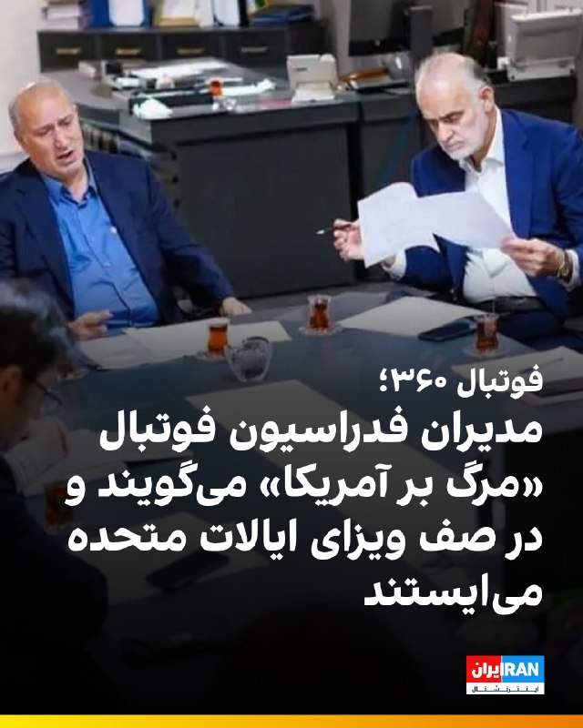

🔻فوتبال ۳۶۰ در گزارشی با انتقاد از رفتار دوگانه مدیران فدراسیون فوتبال نوشت گروهی در فدراسیون در حالی که شعار «مرگ بر آمریکا» سر می‌دهند، «اما در عین شگفتی، چمدان بسته و منتظر ویزای آمریکا برای سفر به این کشور مانده‌اند و به طرق مختلف سعی در گرفتن ویزا داشته‌اند.»

🔹به نوشته این رسانه، «یکی از افراد رده‌بالای این فدراسیون پس از آنکه ۲ بار درخواست ویزای آمریکایش رد شده، برای سومین بار درخواست ویزا داده است.»

🔹فریده شجاعی، یکی از اعضای هیات‌رییسه فدراسیون فوتبال، پیش‌تر گفته بود که «از همه اعضای هیات‌رییسه خواسته شده برای ویزای آمریکا اقدام کنند» و همگی منتظر هستند تا وضعیت ویزا مشخص شود.

🔹هرچند فدراسیون فوتبال در تکذیبیه‌ای، «انتظار اعضای هیات‌رییسه برای ویزای آمریکا» را مستند به «فکت‌های جعلی» دانسته و نوشته است که «اکثریت قریب به اتفاق اعضای هیات‌رییسه فدراسیون هیچ‌گونه برنامه‌ای برای سفر به آمریکا جهت همراهی تیم ملی نداشته و ندارند.»

🔹فوتبال ۳۶۰ همچنین نوشته: «آمریکا که قرار است در شعارها «دشمن» باشد، اما ظاهرا در عمل برای برخی چنین نیست.»

🔹گزارش کامل را در سایت بخوانید.

@iranintltvsport

## IranIntlTV — post 338595

  <a href="telegram/content/IranIntlTV_338595_1779545406.mp4" target="_blank">🎬 Download video</a>

بر اساس گزارش منابع محلی که به ایران اینترنشنال رسیده، اکبر محمدی، متولد ۱۴ شهریور ۱۳۶۴ و ساکن محله دهنوی اصفهان، پس از بازداشت و انتقال به زندان دستگرد جان خود را از دست داده است. بر اساس این گزارش، او سوم اردیبهشت‌ماه همراه برادرش بازداشت شد. منابع محلی می‌گویند اکبر در تماس با خانواده از بیماری و محرومیت از رسیدگی پزشکی در زندان خبر داده و گفته بود اجازه مراجعه به بهداری یا دریافت دارو نداشته است. به گفته این منابع، حال او پس از مدتی وخیم شد و بعد از دو هفته به بیمارستان الزهرای اصفهان منتقل شد، اما پس از چند روز به کما رفت و در نهایت بر اثر عفونت شدید ریه جان باخت. منابع محلی می‌گویند اکبر محمدی از پیگیران اخبار اعتراضات و انتشار تصاویر جان‌باختگان محله دهنو بود، و نیروهای بسیجی محله با او درگیر شده و سپس در خانه‌اش بازداشت شد.

## IranIntlTV — post 338594

  

العربیه گزارش داد جمهوری اسلامی دو پیشنهاد به میانجی پاکستانی ارائه کرده که بر اساس آن، در ازای پرداخت غرامت از سوی آمریکا، تنگه هرمز را باز کند و پیش از امضای هرگونه توافقی، پرونده تحریم‌ها و دارایی‌های مسدود شده مورد بحث قرار گیرد.

دونالد ترامپ، رییس‌جمهوری آمریکا، پیش‌تر گفته بود که حاضر به پرداخت غرامت به تهران نیست.
https://iranintl.com/202605232546

## IranIntlTV — post 338593

  

اسماعیل بقائی، سخنگوی وزارت امور خارجه جمهوری اسلامی، گفت: «ما به توافق خیلی دور و خیلی نزدیک هستیم.» او افزود: «ما تجربه ضد و نقیض گویی طرف آمریکایی را داریم و دیدگاه‌های خود را بارها تغییر داده‌اند.»

سخنگوی وزارت خارجه جمهوری اسلامی درباره سفر عاصم منیر، رییس ستاد کل ارتش پاکستان، به تهران، گفت: «پاکستان به عنوان میانجی نقش مهمی را ایفا کرده و هدف از این سفر ادامه تبادل پیام‌ها بین ایران و آمریکا بود.»

بقائی درباره مذاکرات گفت: «تمرکز ما در این مرحله بر خاتمه جنگ است براساس پیشنهاد ۱۴ بندی تهران که چندین بار رفت و برگشت شده و در خصوص بندهای مختلف آن دیدگاه‌های طرفین تبادل شده است.»
https://iranintl.com/202605233506

## IranIntlTV — post 338592

  <a href="telegram/content/IranIntlTV_338592_1779545409.mp4" target="_blank">🎬 Download video</a>

یک معترض در تجمع ایرانیان مقیم مالمو در سوئد، با اشاره به قطع اینترنت در ایران به مهران عباسیان، خبرنگار ایران‌اینترنشنال، گفت: «وقتی در ایران مردم تیر می‌خورند ما اینجا می‌میریم، این باعث شده متحدتر شویم و هر هفته به اینجا بیاییم تا صدای مردم باشیم.»
@iranintltv

## IranIntlTV — post 338591

  <a href="telegram/content/IranIntlTV_338591_1779545410.mp4" target="_blank">🎬 Download video</a>

گفت‌وگوی ویژه با لرد موریس گلاسمن، عضو مجلس اعیان بریتانیا

لرد موریس گلاسمن که همواره تلاش‌های زیادی برای قرار گرفتن سپاه پاسداران در فهرست سازمان‌های تروریستی داشته است در این مصاحبه درباره آینده ایران و همچنین سیاست‌های بریتانیا در قبال جنگ ایران و آمریکا می‌گوید.

تماشای نسخه کامل این گفت‌وگو در یوتیوب:

https://youtu.be/GWHQiOMqYpc

@iranintltv

## IranIntlTV — post 338590

  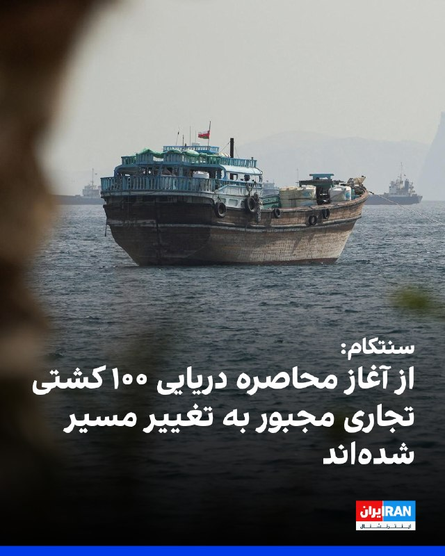

سنتکام، فرماندهی مرکزی ایالات متحده، اعلام کرد که در شش هفته گذشته، بیش از ۱۵ هزار سرباز، ملوان، تفنگدار دریایی و نیروی هوایی آمریکا مسیر حرکت ۱۰۰ شناور را تغییر داده‌اند، چهار شناور را از کار انداخته‌اند و اجازه عبور به ۲۶ کشتی حامل کمک‌های بشردوستانه داده‌اند.

سنتکام افزود: «بیش از ۲۰۰ هواگرد و ناو جنگی آمریکا از این مأموریت پشتیبانی می‌کنند.»

فرماندهی مرکزی ایالات متحده نوشت: «این محاصره علیه شناورهای متعلق به تمامی کشورها که وارد بنادر و مناطق ساحلی ایران می‌شوند یا از آنها خارج می‌شوند، از جمله تمامی بنادر ایران در خلیج فارس و دریای عمان، اعمال می‌شود.»
https://iranintl.com/202605232997

## IranIntlTV — post 338589

  <a href="telegram/content/IranIntlTV_338589_1779545412.mp4" target="_blank">🎬 Download video</a>

ایرانیان مقیم اروپا در شهرهای مختلف ایتالیا، آلمان و سوئد با برگزاری تجمع و راهپیمایی در همبستگی با معترضان داخل ایران، خواستار قطع روابط سیاسی با حکومت جمهوری اسلامی و تعطیلی سفارت‌ها شدند.
مهران عباسیان و احمد صمدی، خبرنگاران ایران‌اینترنشنال، گزارش می‌دهند
@iranintltv

## IranIntlTV — post 338588

  

فداحسین مالکی، عضو کمیسیون امنیت ملی و سیاست خارجی مجلس، گفت در صورت ازسرگیری جنگ، چین و روسیه جمهوری اسلامی را تنها نخواهند گذاشت و آمریکا «با یک آرایش دفاعی نوین مواجه خواهد شد.»

او گفت: «تداوم سفرهای دیپلماتیک و رایزنی‌های فشرده میان ایران، چین و روسیه نشان‌دهنده یک واقعیت راهبردی است؛ اینکه اگر آمریکا مرتکب خطای محاسباتی شود و شعله جنگ مجددی را بیفروزد، قطعا با یک آرایش دفاعی نوین مواجه خواهد شد و جمهوری اسلامی در این تقابل هرگز تنها نخواهد بود.»

مالکی افزود در شرایط کنونی که بحران میان جمهوری اسلامی و آمریکا به دلیل روحیه تهاجمی و رفتارهای خارج از عرف دونالد ترامپ، رییس‌جمهوری آمریکا، پیچیده‌تر شده، تهدید امنیت تنگه هرمز عملا معادلات انرژی، تجاری و اقتصادی جهان را با چالشی جدی مواجه کرده است.
https://iranintl.com/202605238565

## IranIntlTV — post 338587

  <a href="telegram/content/IranIntlTV_338587_1779545415.mp4" target="_blank">🎬 Download video</a>

خانواده‌های جان‌باختگان و بسیاری از کاربران شبکه‌های اجتماعی، با انتشار نام، تصاویر و ویدیوهایی از معترضان کشته‌شده در ۱۸ و ۱۹ دی‌ماه، یاد آنان را گرامی داشتند و از ادامه راه آنان گفتند. این کارزار با استقبال گسترده کاربران همراه شد و بسیاری به آن پیوستند.

آیه دریس، عضو تحریریه ایران‌اینترنشنال، گزارش می‌دهد
@iranintltv

## IranIntlTV — post 338586

  <a href="telegram/content/IranIntlTV_338586_1779545416.mp4" target="_blank">🎬 Download video</a>

عبدالله ناصری، فعال سیاسی، مجتبی خامنه‌ای را چهره‌ای تندروتر و متوهم‌تر از علی خامنه‌ای توصیف کرد. او همچنین درباره زنده بودن رهبر سوم جمهوری اسلامی ابراز تردید کرد.

جزییات بیشتر در گفت‌وگو با علی شیرازی، عضو تحریریه ایران اینترنشنال
@iranintltv

## IranIntlTV — post 338585

  <a href="https://t.me/IranintlTV/338585" target="_blank">📎 Download file</a>

🎧نسخه صوتی اخبار نیمروزی | شنبه ۲ خرداد
@iranintlTV

## IranIntlTV — post 338584

  <a href="telegram/content/IranIntlTV_338584_1779545418.mp4" target="_blank">🎬 Download video</a>

حجت میرزایی، اقتصاددان و مدیر پیشین صندوق‌های بازنشستگی کشور، اعلام کرد با تداوم شرایط کنونی، شمار افراد زیر خط فقر در سال جاری به ۴۰ میلیون نفر خواهد رسید. این اقتصاددان تاکید کرد در سناریوهای بدبینانه، نرخ تورم سال جاری ممکن است سه‌رقمی شود.
گفت‌وگو با آرش آزرمی، دبیر بخش اقتصادی ایران‌اینترنشنال
@iranintltv

## IranIntlTV — post 338583

  <a href="telegram/content/IranIntlTV_338583_1779545420.mp4" target="_blank">🎬 Download video</a>

همزمان با سایر شهرهای استان لرستان، دانش‌آموزان دورود نیز تجمعات اعتراضی تشکیل دادند و خواستار مجازی شدن امتحانات خود شدند. این اعتراضات در یاسوج، خرم‌آباد و بروجرد نیز روز شنبه برگزار شده است.

## IranIntlTV — post 338582

  <a href="telegram/content/IranIntlTV_338582_1779545421.mp4" target="_blank">🎬 Download video</a>

ویدیوی رسیده به ایران اینترنشنال نشان می‌دهد دانش‌آموزان نورآباد لرستان روز شنبه همزمان با دیگر شهرهای این استان به اعتراضات علیه حضوری شدن اعتراضات پیوستند.

## IranIntlTV — post 338581

  <a href="telegram/content/IranIntlTV_338581_1779545423.mp4" target="_blank">🎬 Download video</a>

تجمع دانش‌آموزان در شهرکرد، بروجرد، دورود، خرم‌آباد، بروجرد و یاسوج در اعتراض به بلاتکلیفی تحصیلی و امتحانات حضوری ادامه یافت. ویدیوهای رسیده به ایران‌اینترنشنال نشان می‌دهد ماموران با گاز اشک‌آور به دانش‌آموزان معترض حمله کردند.
گفت‌وگو با آسیه امینی، تحلیل‌گر مسائل اجتماعی
@iranintltv

## ManotoTV — post 105762

  <a href="telegram/content/ManotoTV_105762_1779545425.mp4" target="_blank">🎬 Download video</a>

بر اساس گزارش ان‌بی‌سی، دونالد ترامپ جونیور، پسر بزرگ رئیس‌جمهور آمریکا، با بتینا اندرسون در فلوریدا ازدواج کرده است، اما دونالد ترامپ احتمالاً در مراسم این آخر هفته شرکت نخواهد کرد.
ترامپ در گفت‌وگو با خبرنگاران گفته مراسم «یک رویداد کوچک و خصوصی» است و به دلیل شرایط کاری در کاخ سفید و مسائل سیاسی از جمله وضعیت جمهوری‌اسلامی، امکان حضور ندارد. او تأکید کرده که در این مقطع زمانی نمی‌تواند از واشنگتن خارج شود و مسئولیت‌های دولت را اولویت می‌داند.
ترامپ همچنین با اشاره به فشارهای رسانه‌ای گفته است که چه در صورت حضور و چه عدم حضور در مراسم، مورد انتقاد قرار خواهد گرفت. او در شبکه اجتماعی خود نیز ازدواج پسرش را تبریک گفته اما تأکید کرده که به دلیل «مسائل دولت و شرایط حساس فعلی» در مراسم حاضر نخواهد شد.

## ManotoTV — post 105761

  <a href="telegram/content/ManotoTV_105761_1779545425.mp4" target="_blank">🎬 Download video</a>

شیخ تمیم بن حمد آل ثانی، امیر قطر، در تماس تلفنی با دونالد ترامپ، رئیس‌جمهور آمریکا، درباره تنش‌های منطقه‌ای و ابتکارهای دیپلماتیکی که با محوریت پاکستان برای جلوگیری از تشدید بحران در حال انجام است، گفت‌وگو کرده است.
در این تماس، دو طرف تلاش‌ها برای کاهش تنش‌ها و حفظ ثبات منطقه را بررسی کردند و بر حمایت از میانجی‌گری پاکستان میان ایالات متحده و جمهوری‌اسلامی تاکید شد.
همچنین در این گفت‌وگو بر اهمیت ادامه مذاکرات و گفت‌وگوهای دیپلماتیک برای حل مسائل جاری، حفاظت از کشتیرانی دریایی و تضمین امنیت مسیرهای راهبردی آبی تأکید شد؛ موضوعی که به ثبات بازار جهانی انرژی و زنجیره تأمین نیز مرتبط است.

## ManotoTV — post 105760

  <a href="telegram/content/ManotoTV_105760_1779545426.mp4" target="_blank">🎬 Download video</a>

بر اساس گزارشی که در روزنامه تایمز منتشر شده، یک تحقیق مخفیانه نشان می‌دهد یک شبکه مرتبط با جمهوری‌اسلامی از طریق تلگرام تلاش کرده شهروندان بریتانیایی را برای سازماندهی تجمعات خیابانی ضد اسرائیلی و پخش پوسترهای تبلیغاتی جذب کند.
در این گزارش آمده است که خبرنگار تایمز به‌صورت مخفیانه وارد ارتباط با فردی شده که خود را «مهدی» معرفی کرده و مدعی بوده در ایران مستقر است و با ساختارهای امنیتی جمهوری‌اسلامی در ارتباط است. این فرد در پیام‌های خود پیشنهاد پرداخت پول در ازای سازماندهی تجمع، جذب افراد جدید و اجرای فعالیت‌های تبلیغاتی در لندن را مطرح کرده است.
همچنین از این خبرنگار خواسته شده ابتدا برای اثبات اعتماد، اقدام به نصب پوستر در خیابان‌های لندن و فیلم‌برداری از آن کند. این پوسترها شامل پیام‌های سیاسی علیه اسرائیل بوده است.
در ادامه، درخواست‌هایی برای گسترش فعالیت و حتی طراحی پروژه‌های آنلاین نیز مطرح شده و در نهایت حساب تلگرامی مربوطه به‌طور ناگهانی حذف شده است.

## ManotoTV — post 105759

  <a href="telegram/content/ManotoTV_105759_1779545426.mp4" target="_blank">🎬 Download video</a>

در حالی‌که برخی مقام‌های آمریکایی از احتمال توقف موقت فروش تسلیحات به تایوان به دلیل نیاز ارتش آمریکا در عملیات علیه ایران خبر داده بودند، یک منبع آگاه رویترز این ادعا را رد کرد و گفت این روند کاملاً طولانی‌مدت و اداری است و ارتباطی با جنگ ایران ندارد.
بر اساس این گزارش، تایوان همچنان منتظر تأیید بسته تسلیحاتی تا سقف ۱۴ میلیارد دلار از سوی آمریکا است. این در حالی است که چین به‌شدت با فروش سلاح به تایوان مخالفت کرده و آن را اقدامی علیه حاکمیت خود می‌داند.
کاخ سفید اعلام کرده تصمیم نهایی درباره این بسته در آینده نزدیک گرفته خواهد شد، اما سیاست کلی آمریکا در حمایت از توان دفاعی تایوان بدون تغییر باقی مانده است. تایوان نیز می‌گوید هیچ اطلاع رسمی از تعلیق یا تأخیر در این روند دریافت نکرده است.

## FarsiVOA — post 218439

  <a href="telegram/content/FarsiVOA_218439_1779545427.mp4" target="_blank">🎬 Download video</a>

ارتش اسرائیل اعلام کرد نیروهای تیپ «همخنص» که در شمال نوار غزه فعالیت می‌کنند، روز گذشته، جمعه، «یک تروریست را در حالی‌که از خط زرد عبور کرده و به نیروهای اسرائیل نزدیک شده بود و تهدیدی فوری به‌شمار می‌رفت» شناسایی و حذف کردند.

ارتش اسرائیل تاکید کرد نیروهای این ارتش تحت فرماندهی جنوب، مطابق با توافق در منطقه مستقر هستند و به فعالیت خود برای رفع هرگونه تهدید فوری ادامه می‌دهند.

## FarsiVOA — post 218438

  

⚡️مارکو روبیو، وزیر امور خارجه ایالات متحده، که برای سفری چهار روزه به هند رفته است روز شنبه ۲ خرداد با تکرار مواضع رسمی و قطعی آمریکا در مذاکرات جاری با رژیم ایران گفت این مذاکرات پیشرفت‌هایی داشته است.

او افزود که «احتمالا طی امروز یا دو روز آینده» خبرهایی درباره نتایج این مذاکرات و تصمیم پرزیدنت ترامپ درباره ایران منتشر خواهد شد.

## FarsiVOA — post 218437

پرزیدنت ترامپ در جدیدترین موضع‌گیری درباره توافق: مقامات تهران مشتاقانه به دنبال توافق هستند

## FarsiVOA — post 218436

  

فرماندهی مرکزی ایالات متحده، سنتکام، اعلام کرد نیروهای این فرماندهی در جریان اجرای محاصره دریایی آمریکا علیه جمهوری اسلامی، مسیر ۱۰۰ کشتی تجاری را تغییر داده‌اند.

سنتکام این اقدام را یک «نقطه عطف» در عملیات دریایی خود توصیف کرده است.

@FarsiVOA

## FarsiVOA — post 218430

مارکو روبیو، وزیر امور خارجه آمریکا، روز شنبه برای انجام سفری چهارروزه وارد هند شد.

@FarsiVOA

## FarsiVOA — post 218429

  <a href="telegram/content/FarsiVOA_218429_1779545429.mp4" target="_blank">🎬 Download video</a>

ویدیوهای منتشر شده در شبکه‌های اجتماعی امروز، دوم خرداد ۱۴۰۵، دانش‌آموزان را در خرم‌آباد نشان می‌دهد که در اعتراض به شرایط امتحانات مقابل اداره آموزش‌وپرورش لرستان تجمع کردند. دانش‌آموزان در چند شهر ایران به حضوری شدن امتحانات اعتراض دارند.

## FarsiVOA — post 218428

  <a href="telegram/content/FarsiVOA_218428_1779545431.mp4" target="_blank">🎬 Download video</a>

دانش‌آموزان در یاسوج با شعار «محصل داد بزن، حقتو فریاد بزن» در اعتراض به حضوری شدن امتحانات تجمع کردند. این اعتراضات در چند شهر دیگر ایران نیز برگزار شده است.

## DW_Farsi — post 125053

🔶 نیویورک پست از طرح ترور دختر ترامپ توسط سپاه خبر داد

بر اساس گزارش نیویورک پست، محمدباقر سعد داوود الساعدی ۳۲ ساله که به تازگی بازداشت شده است، "متعهد شده بود" ایوانکا ترامپ، دختر دونالد ترامپ، را بکشد و حتی نقشه خانه او در فلوریدا را نیز در اختیار داشته است. منابعی که نامشان ذکر نشده، این ادعا را مطرح کرده‌اند.

بنا بر این گزارش، این شهروند عراقی، در واکنش به کشته شدن قاسم سلیمانی، فرمانده نیروی قدس سپاه پاسداران انقلاب اسلامی، در حمله پهپادی آمریکا در بغداد در شش سال پیش، خانواده دونالد ترامپ را هدف تعیین کرده بود.

انتفاض قنبر، معاون پیشین وابسته نظامی سفارت عراق در واشنگتن، به نیویورک پست گفت: «بعد از کشته شدن قاسم، او [الساعدی] به اطرافیان می‌گفت "باید ایوانکا را بکشیم تا خانه ترامپ را همان‌طور که او خانه ما را سوزاند، بسوزانیم".»

قنبر افزود: «شنیدیم که او نقشه خانه ایوانکا در فلوریدا را داشته است.» به گفته این روزنامه، یک منبع دیگر نیز طرح الساعدی برای کشتن ایوانکا ترامپ را تایید کرده است.
@dw_farsi

## DW_Farsi — post 125052

🔶 سینمای ایران؛ فرش قرمز در جشنواره کن، زندان در تهران

🔻 گزارشی از آتفه چهارمحالیان

در جشنواره کن امسال، سینمای ایران بار دیگر در یکی از مهم‌ترین رویدادهای سینمایی جهان بر سکو ایستاد؛ حضوری که هم‌زمان قابی گویا از شکاف عمیق میان سینمای مستقل و حکومت جمهوری اسلامی بود.

امسال در هفتادونهمین دوره جشنواره فیلم کن، مستند "تمرین‌هایی برای یک انقلاب" ساخته پگاه آهنگرانی، با روایتی از دهه‌ها اعتراض و سرکوب در ایران، جایزه "چشم طلایی" بهترین مستند را دریافت کرد. آهنگرانی هنگام دریافت جایزه، فیلمش را به مردم ایران و مادران دادخواه تقدیم کرد؛ زنانی که به تعبیر او فرزندانشان را "در راه آزادی" از دست داده‌اند.

در حاشیه این مراسم، اصغر فرهادی نیز که با فیلم "داستان‌های موازی" در بخش اصلی جشنواره حضور داشت، در نشستی خبری، کشته‌شدن معترضان در اعتراضات دی ماه و قربانیان جنگ اخیر را "دردناک و فراموش‌نشدنی" توصیف کرد. فیلم‌سازانی چون مهسا کرم‌پور و محمدرضا فرزاد نیز در بخش‌های جانبی این جشنواره حاضر بودند.
@dw_farsi

## DW_Farsi — post 125051

🔶 بانک جهانی: ۲۷ کشور خواستار استفاده از منابع مالی بحران شده‌اند

بر اساس یک سند داخلی که خبرگزاری رویترز مشاهده کرده، از شروع جنگ ایران در ۲۸ فوریه سال جاری، ۲۷ کشور اقداماتی را برای فعال‌کردن ابزارهای مالی بحران آغاز کرده‌اند تا بتوانند به‌سرعت از منابع موجود در برنامه‌های بانک جهانی استفاده کنند.

نام این کشورها و مبالغ درخواست‌شده اعلام نشده اما در گزارش آمده است که سه کشور از آغاز جنگ آمریکا و اسرائیل علیه جمهوری اسلامی موفق شده‌اند که ابزارهای جدید مالی را تصویب کنند اما سایر کشورها همچنان در حال تکمیل مراحل اداری هستند.

بر اساس این سند، این ۲۷ کشور بخشی از ۱۰۱ کشوری هستند که به نوعی از ابزارهای مالی از پیش‌ برنامه‌ریزی‌شده برای شرایط بحرانی دسترسی دارند.

در این میان، ۵۴ کشور در طرح "گزینه واکنش سریع" ثبت‌نام کرده‌اند که اجازه می‌دهد تا ۱۰ درصد از منابع تخصیص‌یافته اما پرداخت‌نشده خود را در شرایط بحران استفاده کنند.

این گزارش می‌افزاید، جنگ و اختلال در بازار انرژی، زنجیره تامین جهانی را تحت تاثیر قرار داده و فشار اقتصادی بر کشورهای مختلف، از جمله کنیا و عراق را افزایش داده است.

بانک جهانی ظرفیت حمایت اضطراری خود را ۲۰ تا ۲۵ میلیارد دلار اعلام کرده که در صورت استفاده از ابزارهای دیگر می‌تواند به حدود ۱۰۰ میلیارد دلار افزایش یابد.
@dw_farsi

## DW_Farsi — post 125050

🔶 آمریکا قوانین درخواست "گرین‌کارت" را سخت‌تر کرد

بر اساس تصمیم دولت آمریکا، متقاضیان دریافت اقامت دائم در ایالات متحده در آینده عمدتا باید از خارج از این کشور اقدام کنند.

در دستورالعملی که از سوی اداره مهاجرت صادر شده آمده است، افرادی که می‌خواهند برای دریافت گرین‌کارت و در نتیجه اقامت دائم درخواست بدهند، باید معمولاً از روند کنسولی در کشور خود استفاده کنند. دولت آمریکا با این اقدام عملاً موانع بیشتری بر سر راه دریافت گرین‌کارت ایجاد کرده است.

تا کنون گردشگران، دانشجویان یا دیگر افرادی که دارای مجوز اقامت محدود در آمریکا بودند، تحت شرایطی می‌توانستند در داخل ایالات متحده نیز برای دریافت گرین‌کارت اقدام کنند.
@dw_farsi

## DW_Farsi — post 125049

  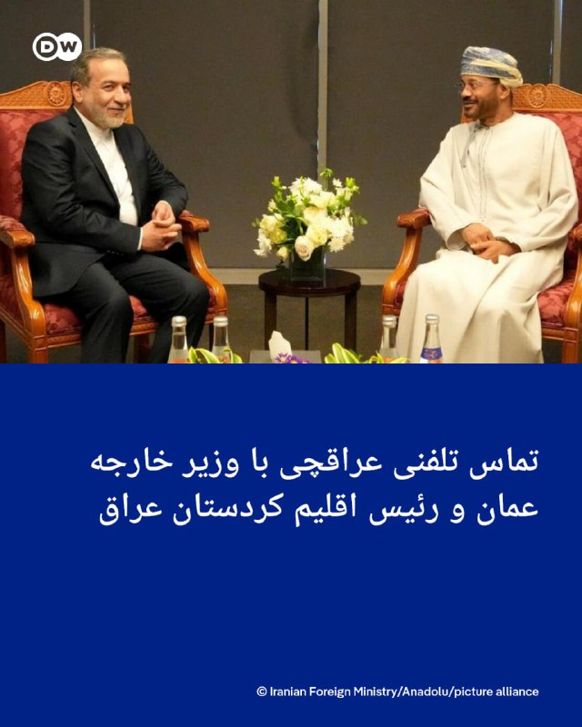

🔶 تماس تلفنی عراقچی با وزیر خارجه عمان و رئيس اقلیم کردستان عراق

وزارت خارجه ایران صبح روز شنبه ۲ خرداد (۲۳ مه) اعلام کرد که عباس عراقچی، وزیر خارجه، در تماس تلفنی با بدر بن حمد البوسعیدی، همتای عمانی خود درباره تلاش‌های دیپلماتیک جاری برای جلوگیری از تشدید تنش‌ها گفت‌وگو کرده است.

در این گفت‌وگو، دو طرف درباره ادامه روند دیپلماسی و راه‌های کاهش تنش در منطقه تبادل نظر کردند.

وزارت خارجه ایران درباره جزئیات این گفت‌وگو توضیح بیشتری ارائه نکرده است. در روزهای گذشته گزارش‌هایی منتشر شده مبنی بر اینکه ایران قصد دارد در رایزنی با مقامات عمانی درباره موضوعاتی، از جمله بسته‌شدن تنگه هرمز و دریافت عوارض احتمالی گفت‌وگو کند.

عراقچی همچنین در تماس تلفنی جداگانه با نچیروان بارزانی، رئیس اقلیم کردستان عراق، درباره مناسبات جمهوری اسلامی و اقلیم کردستان، از جمله مراودات اقتصادی و تجاری و تقویت هماهنگی‌ها برای حفظ امنیت مرزهای مشترک و "مقابله با تروریسم" گفت‌وگو کرد.

در این گفت‌وگو به علاوه، طرفین درباره تحولات منطقه‌ای تبادل نظر کردند.

بر اساس گزارش‌ها، ایران در جریان جنگ با اسرائيل و آمریکا و همچنین پس از آن در دوره آتش‌بس شکننده، به‌طور مداوم برخی پایگاه‌ها در اقلیم کردستان عراق و محل استقرار گروه‌هایی از احزاب کرد ایرانی را هدف حملات موشکی و پهپادی قرار داده است.

@dw_farsi

## Persian_Trend_Official — post 14734

  <a href="telegram/content/Persian_Trend_Official_14734_1779545433.mp4" target="_blank">🎬 Download video</a>

💢تیراندازی از صداوسیما به میان جمعیت رسید ...

🫆:Tony

📌 @persian_trend_official
پرشین ترند | متفاوت‌ترین کانال نظامی

## Persian_Trend_Official — post 14733

🔴 حزب‌الله: عراقچی بر حمایت «تزلزل‌ناپذیر» ایران تأکید کرده است

💢حزب‌الله لبنان اعلام کرد پیامی از عباس عراقچی، وزیر خارجه ایران، دریافت کرده که در آن تهران بر حمایت «قاطع و تزلزل‌ناپذیر» خود از این گروه تأکید کرده است.

♦️بر اساس بیانیه حزب‌الله:

▪️ ایران اعلام کرده حمایت خود از حزب‌الله را ادامه خواهد داد

▪️ تهران خواستار گنجانده‌شدن لبنان در هرگونه توافق آتش‌بس مرتبط با جنگ ایران شده است
🫆:Tony

📌 @persian_trend_official
پرشین ترند | متفاوت‌ترین کانال نظامی

## Persian_Trend_Official — post 14732

  <a href="telegram/content/Persian_Trend_Official_14732_1779545434.mp4" target="_blank">🎬 Download video</a>

📝 Nick

📌 @persian_trend_official
پرشین ترند | متفاوت‌ترین کانال نظامی

## Persian_Trend_Official — post 14731

  <a href="telegram/content/Persian_Trend_Official_14731_1779545436.webm" target="_blank">🎬 Download video</a>

🔴بقائی: تنگه هرمز به آمریکا ربطی ندارد

♦️سخنگوی وزارت خارجه:

🔹تنگه هرمز به آمریکا ربطی ندارد. بین ما و عمان به عنوان کشورهای ساحلی باید سازوکاری تعریف شود. ما با سازمان‌های ذی‌صلاح در گفتگو هستیم. ما آگاه نسبت به اهمیت این آبراه برای جامعه بین‌المللی هستیم.

🔹جامعه بین المللی می‌داند که ناامنی ناشی از اقدام تجاوزکارانه آمریکا و رژیم صهیونیستی است. درک می‌کنند که اقدام مسئولانه ایران و عمان برای ایجاد سازوکاری جهت تردد ایمن کشتی‌ها از این آبراه به نفع جامعه بین‌المللی است.

🫆:Tony

📌 @persian_trend_official
پرشین ترند | متفاوت‌ترین کانال نظامی

## Persian_Trend_Official — post 14730

  <a href="telegram/content/Persian_Trend_Official_14730_1779545437.webm" target="_blank">🎬 Download video</a>

🔴 الجزیره: تفاهم اولیه میان ایران و پاکستان حاصل شده؛ تهران منتظر پاسخ آمریکاست 💢یک منبع ایرانی به الجزیره گفته است تهران و پاکستان بر سر یک «یادداشت تفاهم» به توافق رسیده‌اند و اکنون ایران در انتظار پاسخ نهایی آمریکا است. ♦️بر اساس این گزارش: ▪️ این تفاهم…

## Persian_Trend_Official — post 14729

  

🔴 الجزیره: تفاهم اولیه میان ایران و پاکستان حاصل شده؛ تهران منتظر پاسخ آمریکاست

💢یک منبع ایرانی به الجزیره گفته است تهران و پاکستان بر سر یک «یادداشت تفاهم» به توافق رسیده‌اند و اکنون ایران در انتظار پاسخ نهایی آمریکا است.

♦️بر اساس این گزارش:

▪️ این تفاهم شامل پایان جنگ، بازگشایی تنگه هرمز و خروج نیروهای آمریکایی از منطقه است
▪️ موضوع هسته‌ای در این توافق گنجانده نشده و به مذاکرات طولانی‌تری نیاز دارد
▪️ طبق این طرح، پس از ۳۰ روز از اجرای توافق، گفت‌وگوها درباره پرونده هسته‌ای آغاز خواهد شد

♦️این منبع همچنین تأکید کرده:

▪️ مذاکرات فعلی بیشتر بر توقف درگیری‌ها و کاهش تنش منطقه‌ای متمرکز بوده است
▪️ نقش پاکستان در میانجیگری میان تهران و واشینگتن همچنان کلیدی است
▪️ هنوز مشخص نیست آمریکا با تمامی بندهای این تفاهم موافقت خواهد کرد یا نه

🫆:Tony

📌 @persian_trend_official
پرشین ترند | متفاوت‌ترین کانال نظامی

## Persian_Trend_Official — post 14728

  <a href="telegram/content/Persian_Trend_Official_14728_1779545438.webm" target="_blank">🎬 Download video</a>

💢فرمانده ارتش پاکستان ایران را ترک کرد

💢عاصم منیر فرمانده ارتش پاکستان پس از دیدار دوم با عراقچی ایران را ترک کرده است/تستیم

🫆:Tony

📌 @persian_trend_official
پرشین ترند | متفاوت‌ترین کانال نظامی

## Persian_Trend_Official — post 14727

  

🔴بن‌گویر از ورود به خاک فرانسه منع شد

💢‏وزیر امور خارجه فرانسه: «ایتمار بن‌گویر» وزیر امنیت داخلی اسرائیل از امروز از ورود به خاک ما منع شده است.

🫆:Tony

📌 @persian_trend_official
پرشین ترند | متفاوت‌ترین کانال نظامی

## Persian_Trend_Official — post 14726

💢ادعای منابع دیپلماتیک به العربیه: ایران ۲ پیشنهاد به میانجی پاکستانی ارائه کرده است

💢ایران خواستار بحث درباره پرونده تحریم‌ها و دارایی‌های مسدودشده پیش از امضای هرگونه توافق شده است

🫆:Tony

📌 @persian_trend_official
پرشین ترند | متفاوت‌ترین کانال نظامی

## Persian_Trend_Official — post 14725

🔴سخنگوی وزارت خارجه:

♦️ما به توافق خیلی دور و خیلی نزدیک هستیم

💢هدف از سفر فرمانده ارتش پاکستان تبادل پیام‌ها میان‌ ایران و آمریکا بود.

طی روزهای گذشته پیرامون مسائلی که اختلاف نظر وجود داشت بحث شد.

💢با مواضع متناقض آمریکا نمی‌توانیم‌ بگوییم که این روند تغییر می‌کند. دیدگاه‌ها نزدیک شده است اما نه به معنای توافق بلکه بتوانیم به یک راه‌حل برسیم.

🫆:Tony

📌 @persian_trend_official
پرشین ترند | متفاوت‌ترین کانال نظامی

## Persian_Trend_Official — post 14724

  <a href="telegram/content/Persian_Trend_Official_14724_1779545439.webm" target="_blank">🎬 Download video</a>

یارو میگه تمام نیازهای جامعه در شبکه داخلی برآورده میشه و نیازی به اینترنت نیست.‌ بعد توی توییتر داره اینو میگه. 😐

‏همون‌طور که آپارات جای یوتیوب رو نگرفت، بله هم جای واتساپ رو نخواهد گرفت. (تلگرام رو نگفتم که بهش توهین نشه)

📝 Nick

📌 @persian_trend_official
پرشین ترند | متفاوت‌ترین کانال نظامی

## RadioFarda — post 157483

پاراگراف اول؛ جنگ، گذار و رقابت شرق و غرب؛ جمهوری اسلامی در پی بقا

🔸جنگ آمریکا و اسرائیل با ایران تمام شده یا فقط شکل آن تغییر کرده است؟ در تهران هنوز از «پیروزی» صحبت می‌شود، در اسرائیل از «بازدارندگی»، در واشینگتن از «مهار» و در پکن و مسکو از «خویشتن‌داری». اما پشت این ادعاها و واژه‌های دیپلماتیک، پرسشی جدی‌تر در حال شکل‌گیری است؛ این‌که ایران پس از این جنگ دقیقاً در کجای جهان امروز ایستاده است؟

🔸آیا چین و روسیه واقعاً در کنار جمهوری اسلامی ایستادند یا صرفاً مراقب بودند موازنهٔ قدرت به‌هم نخورد؟ چرا مسکو و پکن، برخلاف انتظار تهران، وارد یک حمایت تمام‌قد نشدند؟ آیا جمهوری اسلامی ایران برای آن‌ها یک شریک راهبردی است یا تنها بخشی از بازی بزرگ‌ترشان با ایالات متحده؟

🔸در همین حال، کشورهای عربی منطقه نیز آرام‌آرام در حال بازتنظیم روابط خود هستند؛ از عربستان تا امارات و قطر. منطقه‌ای که زمانی در قالب دوگانه‌هایی چون «محور مقاومت» و «پیمان‌های دوستی» تعریف می‌شد، اکنون وارد مرحله‌ای پیچیده‌تر شده است؛ جایی که بازیگران هم‌زمان با تهران گفت‌وگو می‌کنند، با واشینگتن معامله می‌کنند و در عین حال نسبت به اسرائیل نیز حساس و نگران‌اند.

🔸در این میان، آیا جمهوری اسلامی ایران پس از این جنگ ضعیف‌تر شده یا وابسته‌تر؟ آیا اسرائیل در حال تعریف نسخه‌ای جدید از بازدارندگی در خاورمیانه است؟ و آیا ایران وارد دوره‌ای از «تنهایی راهبردی» شده است؛ جایی که حتی نزدیک‌ترین متحدانش نیز حاضر نیستند هزینهٔ رویارویی مستقیم را برای آن بپردازند؟

🔸در برنامهٔ رادیویی «پارارگراف اول»، حمیدرضا عزیزی، پژوهشگر غیرمقیم در شورای خاورمیانه در امور جهانی و پژوهشگر حوزهٔ بین‌الملل از برلین، در کنار محسن صلح‌دوست، استادیار روابط بین‌الملل در دانشگاه چینی-بریتانیایی شیان جیائوتونگ-لیورپول از شهر سوجو، به شکل‌گیری یک خاورمیانهٔ جدید در دورهٔ گذار نظام بین‌الملل و موقعیت ایران برای هر کدام از بازیگران پرداخته‌اند.

🔸 گزارش کامل را در وب‌سایت رادیوفردا بخوانید.

@RadioFarda

## RadioFarda — post 157482

آیا هوش مصنوعی آثار نویسنده برنده نوبل را می‌نویسد؟

🔸اظهارات اخیر اولگا توکارچوک، نویسندهٔ برندهٔ نوبل ادبیات، دربارهٔ هوش مصنوعی و استفاده از این ابزار مدرن برای نوشتن، بحث‌هایی را در محافل ادبی، رسانه‌ها و شبکه‌های اجتماعی پیرامون حد و حدود مداخلهٔ هوش مصنوعی در خلق ادبی به راه انداخته است.

🔸در سال ۲۰۱۸، توکارچوک پانزدهمین زنی بود که به دریافت نوبل ادبیات نائل شد و از آن زمان تاکنون میلیون‌ها نسخه از آثارش در سراسر جهان فروش رفته و کتاب‌هایش به بیش از ۴۰ زبان از جمله فارسی ترجمه شده‌اند.

🔸این نویسنده دربارهٔ هوش مصنوعی چه گفت و اساساً نویسندگان بزرگ جهان با هوش مصنوعی چگونه تعامل می‌کنند؟

🔸اظهارات اولگا توکارچوک که روز ۲۹ اردیبهشت در پنلی در کنفرانس ایمپکت در شهر پوزنان لهستان بیان شد، بار دیگر این نویسندهٔ برجستهٔ لهستانی را در مرکز یک جنجال فرهنگی قرار داد.

🔸رویداد ایمپکت (Impact) در پوزنان از بزرگ‌ترین رویدادهای تجاری در لهستان است.

🔸برگزارکنندگان این رویداد سال‌ها است که بر رویکردی چندرشته‌ای نسبت به جهان تأکید دارند و در مجموعه‌ای از مناظره‌ها، پنل‌ها و مصاحبه‌ها، در کنار شناخته‌شده‌ترین کارآفرینان، هنرمندان، نویسندگان، بازیگران، کارگردانان و برندگان جایزهٔ نوبل نیز دیدگاه‌های خود را دربارهٔ جهان مطرح می‌کنند.

🔸 گزارش کامل را در وب‌سایت رادیوفردا بخوانید.

@RadioFarda

## RadioFarda — post 157481

دادگاه برای شش متهم پرونده اکباتان حکم صادر کرد؛ قوه قضاییه: پرونده هنوز باز است

🔸سه روز پس از انتشار خبر صدور حکم قطعی برای متهمان «پرونده شهرک اکباتان»، قوه قضاییه در اطلاعیه‌ای رسمی می‌گوید که پرونده این افراد در دادگاه انقلاب «هنوز مفتوح است».

🔸وب‌سایت خبری امتداد در داخل ایران و گروه حقوق بشری هرانا، مستقر در آمریکا، روز چهارشنبه، ۳۰ اردیبهشت، خبر دادند که دادگاهی در تهران حکم جدید متهمان پرونده موسوم به «اکباتان» را صادر کرده که بر اساس آن سه تن از آنها تبرئه شده‌اند.

🔸بر اساس این حکم جدید، سه تن دیگر از این متهمان بازداشت‌شده در اعتراضات سال ۱۴۰۱ هم به پرداخت دیه و پنج سال حبس محکوم شدند.

🔸هر شش متهم این پرونده به اتهام نقش داشتن در کشته شدن آرمان علی‌وردی، از نیروهای بسیج، قبلا به اعدام محکوم شده بودند، اما دیوان عالی کشور این احکام را لغو کرد.

🔸حال قوه قضاییه جمهوری اسلامی در اطلاعیه‌ای رسمی که روز شنبه، دوم خردادماه، منتشر کرد می‌گوید که حکم صادره به دادگاه کیفری تعلق دارد، و پرونده این افراد «در دادگاه انقلاب... هم‌چنان مفتوح بوده و در آستانه صدور رأی است».
قوه قضاییه در ادامه ادعا کرده است که این اطلاعیه حاوی پاسخ به «انتقادات» در مورد پرونده آرمان علی‌وردی است، انتقاداتی چون این که چرا «قاتلان آرمان علی‌وردی اعدام نشدند» و «رای صادره صرفا به دیه و حبس منتهی شده است».

🔸در اطلاعیه رسمی نیامده است که این منتقدان چه کسانی هستند و ایرادات‌شان به صدور حکم در کجا آمده است.

🔸 گزارش کامل را در وب‌سایت رادیوفردا بخوانید.

@RadioFarda

## IranianMinds — post 20612

🔴العربیه گزارش داد:

جمهوری اسلامی دو پیشنهاد به میانجی پاکستانی ارائه کرده که بر اساس آن، در ازای پرداخت غرامت از سوی آمریکا، تنگه هرمز را باز کند و پیش از امضای هرگونه توافقی، پرونده تحریم‌ها و دارایی‌های مسدود شده مورد بحث قرار گیرد.
دونالد ترامپ هم پیش‌تر گفته بود که حاضر به پرداخت غرامت به تهران نیست.

@IranianMinds

## IranianMinds — post 20611

  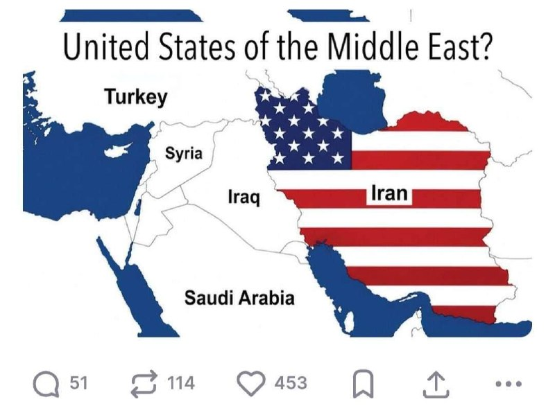

🔴پست جدید ترامپ که ایران را، آمریکا در خاورمیانه خطاب کرده است.

@IranianMinds

## IranianMinds — post 20610

  

اکانت اسرائیل به فارسی:

پزشکیان با مجتبی ملاقات کرد😂😂😂

@IranianMinds

## IranianMinds — post 20609

🔴فارس:

با وجود رسیدن به توافقاتی در چند موضوع، به دلیل رفتار متناقض واشنگتن، به توافق نزدیک نیستیم.

@IranianMinds

## IranianMinds — post 20607

  <a href="telegram/content/IranianMinds_20607_1779545440.mp4" target="_blank">🎬 Download video</a>

🔴امروز دانش آموزان شهر خرم‌آباد در استان لرستان در مقابل ساختمان آموزش و پرورش دست به تجمع اعتراضی زدند.

@IranianMinds

## IranianMinds — post 20606

  

🔴دیوید کیز:

ایران با تمام خواسته‌‌های آمریکا موافقت کرد، البته به این شرط که اجازه داشته باشد آن‌ها را زیر پا بگذارد و برای نابودی آمریکا تلاش کند. پیشرفتی کوچک اما مهم!!!

@IranianMinds

## IranianMinds — post 20605

  

🔴 فرانسه ورود بن گویر وزیر امنیت ملی اسرائیل به کشورش رو ممنوع کرد.

@IranianMinds

## IranianMinds — post 20604

🔴کانال ۱۱ اسرائیل گزارش داد:

اسرائیل هرگونه توافق با رژیم تروریستی اسلامی را به خروج اورانیوم غنی شده از ایران و نظارت دقیق بر برنامه هسته‌ای تهران مشروط می‌داند.

@IranianMinds

## IranianMinds — post 20603

  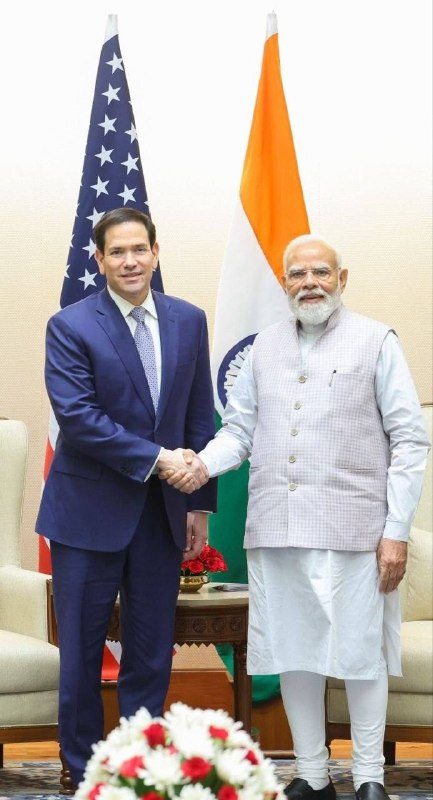

🔴 دیدار امروز مارکو روبیو و نخست وزیر هند

@IranianMinds

## IranianMinds — post 20602

🔴صدا و سیما:

عاصم منیر تهران را ترک کرد.

@IranianMinds

## BBCPersian — post 281878

  

🔻پرویز قلیچ‌خانی، کاپیتان پیشین تیم ملی فوتبال ایران و فعال سیاسی چپگرا در ۸۱ سالگی درگذشت. او به آلزایمرمبتلا بود.
نجمه موسوی-پيمبری، «يار و همراه» پرویز قلیچ‌خانی به بی‌بی‌سی فارسی گفت: «قهرمان ملی و چهره هميشه زنده ايران در تاريخ بيست و سوم ماه مه ٢٠٢٦ مصادف با دوم خرداد ١٤٠٥ در بيمارستانی در حومه پاريس درگذشت.»
آقای قلیچ‌خانی، پیش از انقلاب، علاوه بر تیم ملی، در باشگاه‌های تاج، پرسپولیس و پاس هم بازی کرد. او تنها بازیکنی است که با تیم ایران سه بار قهرمان جام ملت‌های آسیا شده است. پرویز قلیچ‌خانی بعد از انقلاب هم در خارج از کشور، مجله آرش را با گرایش سیاسی چپ اداره می‌کرد.
او فوتبال را از کوچه‌های محله صابون پزخانه میدان شوش تهران شروع کرد و بعد از مدتی کوتاه فوتبالیستی ماهر و بالاخره کاپیتان تیم ملی ایران شد.
ولی هنوز طعم قهرمانی فوتبال را درست نچشیده بود که توجهش به سیاست جلب شد و از پشت میله های زندان سر درآورد.
پس از انقلاب از فوتبالیست حرفه‌ای به فعال سیاسی و روزنامه‌نگار خارج‌نشین تبدیل شد.

@BBCPersian

## BBCPersian — post 281877

فعالان حامی فلسطین که پس از توقیف کشتی کمک‌رسانی به غزه توسط نیروهای اسرائیلی در آب‌های بین‌المللی بازداشت شده بودند و به زندانی در اسرائیل منتقل شده بودند، و اکنون اخراج شدند، می‌گویند که در زمان بازداشت در اسرائیل مورد آزار و اذیت قرار گرفته‌اند.
ارتش اسرائیل هم این گفته‌ها را رد کرد و به بی‌بی‌سی گفت که دستوراتش «دربرگیرنده رفتار محترمانه و مناسب با افراد حاضر در ناوگان بوده است».

جزئیات بیشتر را در لینک زیر بخوانید:
https://bbc.in/4tT9kXp

@BBCPersian

## BBCPersian — post 281876

🔻پلی بر رودخانه سن در پاریس تبدیل به یک غار عظیم بادی شد.

فیلمبرداری به شیوه تایم‌لپس نشان می‌دهد که این پل چگونه به هیبت یک غار درمی‌آید.

«پونت نوف»، پل نهم سن در قرن ۱۷ ساخته شده است.

این اثر با عنوان «غار» کار هنرمند فرانسوی، ژان رنه، با نام مستعار جی‌آر، جدیدترین اثر از مجموعه‌ای از چیدمان‌های هنری در مقیاس بزرگ در پایتخت فرانسه است که ۱۲۰ متر طول و بین ۱۲ تا ۱۸ متر ارتفاع دارد.

جی‌آر به خبرگزاری آسوشیتدپرس گفت که این اثر «خشن و وحشی در کنار ظرافت لطیف» پاریس، ترس را در عین یک جذابیت ناشناخته القا می‌کند.

این غار از ۶ ژوئن/۱۶ خرداد به روی عموم باز می‌شود. این چیدمان تا ۲۸ ژوئن/ ۷ تیر برقرار خواهد بود.

🎥APTN
@BBCPersian

## BBCPersian — post 281875

🔻فرمانده کل قوای پاکستان تهران را ترک کرد

فیلد مارشال عاصم منیر، فرمانده کل ارتش و نیروهای مسلح پاکستان، پس از سفری یک روزه به تهران ایران را ترک کرد.

به گزارش ایرنا، او «با همراهی محسن نقوی، وزیر کشور پاکستان که از هفته گذشته در تهران به سر می‌برد، تهران را ترک کردند.»

آقای منیردر این سفر با محمدباقر قالیباف، رئیس مجلس، مسعود پزشکیان، رئیس جمهور و عباس عراقچی، وزیر خارجه دیدار و گفتگو کرد.

این دومین سفر آقای منیر در چند هفته گذشته به ایران است.

پاکستان میانجی مذاکرات ایران و آمریکا است.

https://bbc.in/4uXuJ2G
@BBCPersian

## BBCPersian — post 281874

  <a href="telegram/content/BBCPersian_281874_1779545446.mp4" target="_blank">🎬 Download video</a>

پنتاگون مجموعه‌ای تازه از اسناد مربوط به اشیای ناشناس پرنده را منتشر کرده که شامل مدارک، فایل‌های صوتی و ۵۱ ویدیو از مشاهدات این اشیا در طول بیش از ۸۰ سال گذشته و از جمله در ایران و سوریه است.
 
در این گزارش‌ها، شاهدان از دیدن گوی‌ها، دیسک‌ها و توپ‌های آتشین از دهه ۱۹۴۰ تا امروز خبر داده‌اند. در یکی از جدیدترین موارد، یک مقام ارشد اطلاعاتی آمریکا گفته در سال ۲۰۲۵ داخل بالگرد نظامی، تعداد زیادی گوی نارنجی را دیده که با سرعت بالا در همه جهات حرکت می‌کردند و حتی برای لحظاتی به شکل یک مثلث کنار هم قرار گرفتند و سپس ناپدید شدند. این پدیده بیش از یک ساعت ادامه داشته است.
  
دونالد ترامپ، رییس جمهور آمریکا پس از انتشار این اسناد گفت: «با این مدارک و ویدیوها، مردم خودشان می‌توانند تصمیم بگیرند که واقعا چه خبر است». پنتاگون اعلام کرده انتشار فایل‌های مربوط به اشیای ناشناس پرنده ادامه خواهد داشت و اسناد بیشتری به‌زودی منتشر می‌شود.

@bbcpersian

## BBCPersian — post 281873

  

🔻مارکو روبیو، وزیر خارجه آمریکا، که برای سفری چهار روزه در هند است با نارندرا مودی، نخست‌وزیر، دیدار و گفت‌وگو کرد.

آقای روبیو در این دیدار گفته است آمریکا اجازه نمی‌دهد که ایران بازار انرژی در دنیا را به «گروگان» بگیرد.

او همچنین بر اهمیت همکاری راهبردی هند و آمریکا در منطقه اقیانوس‌های هند و آرام تاکید کرد.

به گفته سفیر آمریکا در هند، آقای روبیو به نمایندگی از دونالد ترامپ، رئیس جمهور آمریکا، آقای مودی را برای یک سفر رسمی به آمریکا دعوت کرده است.

📸Indian Government
https://bbc.in/4us85PY
@BBCPersian

## Dirty_Kids — post 390014

کانال یازده اسراییل گفته
اون قسمت هایی از مذاکره که آمریکا ، اسراییل رو در جریان نمیزاره ، از طریق جاسوسان موساد در نظام ، اسراییل در جریان مذاکرات قرار میگیره :))))))))))

@Dirty_Kids 👻

## Dirty_Kids — post 390013

  <a href="telegram/content/Dirty_Kids_390013_1779545448.mp4" target="_blank">🎬 Download video</a>

تو اسناد جدیدی که وزارت دفاع آمریکا از پرونده‌های UFO 🛸 منتشر کرده، اسم ایران هم به چشم می‌خوره!

«4 شیء ناشناسِ پرنده به‌صورت گروهی، 26 آگوست 2022، روی آب‌های ایران مشاهده شدن»

@Dirty_Kids 👻

## Dirty_Kids — post 390012

  

پست جدید ترامپ:

ایالاتِ متحده‌ی خاورمیانه؟

@Dirty_Kids 👻

## Hranews — post 113114

  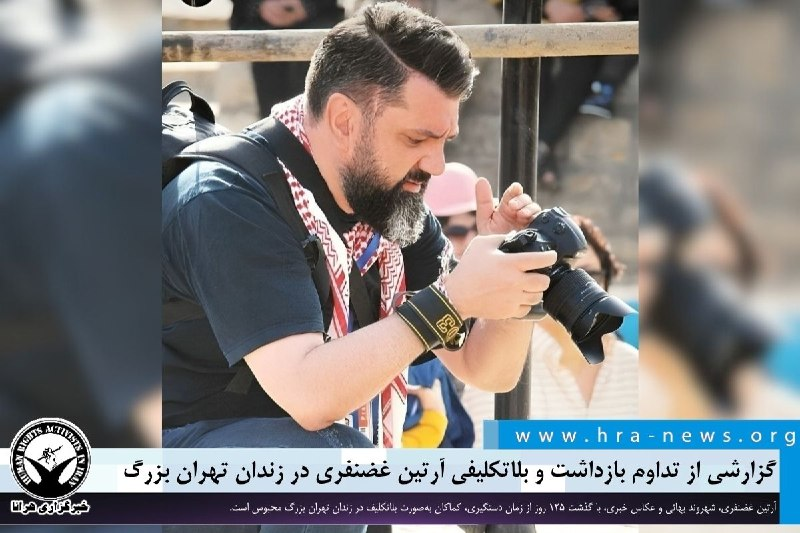

گزارشی از تداوم بازداشت و بلاتکلیفی آرتین غضنفری در زندان تهران بزرگ

❗️
❗️
❗️
❗️
❗️– آرتین غضنفری، شهروند بهائی و عکاس خبری، با گذشت ۱۲۵ روز از زمان دستگیری، کماکان به‌صورت بلاتکلیف در زندان تهران بزرگ محبوس است.

به گزارش خبرگزاری هرانا، ارگان خبری مجموعه فعالان حقوق بشر در ایران، آرتین غضنفری، شهروند بهائی کماکان در بازداشت است.

یک منبع مطلع نزدیک به خانواده این شهروند بهائی، ضمن تایید این خبر به هرانا گفت: آقای غضنفری از بیماری‌های متعددی، از جمله نارسایی قلبی، آسم و فشار خون بالا رنج می‌برد و به‌صورت روزانه نیازمند مصرف دارو است. با این حال، علیرغم پیگیری‌های مکرر خانواده از مراجع قضایی، مسئولان مربوطه با آزادی موقت وی موافقت نکرده‌اند.

وی افزود: همچنین، قرار بازداشت آرتین را بدون ارائه توضیحی روشن، برای چندمین بار تمدید شده است. تداوم این وضعیت، نگرانی‌های خانواده وی را افزایش داده است.

ادامه مطلب

#آرتین_غضنفری

↘️
@hranews_bot تماس ✉️ - @Hranews کانال هرانا 🆑

## Hranews — post 113113

  

با حکم دادگاه انقلاب؛‌ حجت آل‌محمدی به ۲۱ سال حبس محکوم شد

❗️
❗️
❗️
❗️
❗️– حجت آل‌محمدی، زندانی سیاسی محبوس در زندان شیبان اهواز، توسط دادگاه انقلاب این شهر به ۲۱ سال حبس محکوم شده است.

به گزارش خبرگزاری هرانا، ارگان خبری مجموعه فعالان حقوق بشر در ایران، حجت آل‌محمدی به #حبس محکوم شد.

براساس اطلاعات دریافتی هرانا، آقای آل‌محمدی توسط شعبه سوم دادگاه انقلاب اهواز به ۲۱ سال حبس محکوم شده است. این رای هفته گذشته در زندان به او ابلاغ شده است.

ادامه مطلب

#حجت_آل‌محمدی

↘️
@hranews_bot تماس ✉️ - @Hranews کانال هرانا 🆑

## Hranews — post 113112

  

صبح امروز، گروهی از کارکنان شرکت‌های تعاونی سهام عدالت، با برگزاری تجمع اعتراضی مقابل درب شمالی شماره دو وزارت امور اقتصادی و دارایی در تهران، خواستار پرداخت حقوق معوقه و رسیدگی به وضعیت امنیت شغلی خود شدند.
#تجمع_اعتراضی

↘️
@hranews_bot تماس ✉️ - @Hranews کانال هرانا 🆑

## Hranews — post 113111

  

تصویر منتشرشده از دادنامه شعبه ششم دادگاه عمومی حقوقی مجتمع قضایی کرج، نشان ‌دهنده صدور حکمی است که در آن دعوای یک زن برای «استرداد مال منقول» (یک دستگاه موتور سیکلت) رد شده است. قاضی صادر کننده رای، در بخش استدلال خود صراحتا قید کرده است که «مالکیت نسوان نسبت به موتور سیکلت عرفاً قابل پذیرش نیست». رئیس شعبه با این استناد، دفاعیات خواهان را «فاقد وجاهت قانونی» دانسته و حکم بر بطلان دعوی صادر کرده است. این استدلال عرفی در حالی مبنای رد مالکیت قرار گرفته که در قوانین مدنی و تجاری کشور، هیچ منع قانونی برای خرید، فروش و مالکیت اموال منقول بر اساس جنسیت وجود ندارد./ آوش

این تصمیم قضایی در حالی اتخاذ شده است که طبق ماده ۳۰ قانون مدنی، هر فردی حق دارد بر اموال خود مالکیت داشته باشد و قانون در این زمینه تفاوتی میان زن و مرد قائل نشده است. همچنین بر اساس ماده ۱۱۱۸ قانون مدنی، #زنان از حق کامل برای خرید و فروش برخوردارند.

↘️
@hranews_bot تماس ✉️ - @Hranews کانال هرانا 🆑

## Hranews — post 113110

به اتهام “همکاری با شبکه‌های معاند”؛ دو زن مجموعا به ۵۳ سال حبس محکوم شدند

❗️
❗️
❗️
❗️
❗️– رئیس کل دادگستری استان سمنان از صدور احکام طولانی مدت حبس و مجازات‌های تکمیلی برای دو زن به نام‌های لیلا رمضانی و فاطمه ملک‌احمدی به دلیل آنچه “همکاری با شبکه‌های معاند و اقدام علیه امنیت ملی” عنوان کرده است، خبر داد. بر این اساس، لیلا رمضانی به ۲۶ سال و فاطمه ملک‌احمدی به ۲۷ سال حبس و انفصال از خدمات دولتی، ممنوعیت خروج از کشور و محرومیت از عضویت در احزاب و گروه‌های سیاسی و اجتماعی محکوم شده‌اند.

ادامه مطلب

#لیلا_رمضانی #فاطمه_ملک‌احمدی #حبس

↘️
@hranews_bot تماس ✉️ - @Hranews کانال هرانا 🆑

## Hranews — post 113109

مرگ یک نوجوان در مشهد هنگام فرار از تعرض؛ دو متهم بازداشت شدند

❗️
❗️
❗️
❗️
❗️– یک نوجوان ۱۷ ساله در مشهد، پس از آنچه تلاش برای تعرض جنسی از سوی دو مرد عنوان شده، با سقوط از پنجره یک واحد مسکونی جان خود را از دست داد. در این رابطه، دو مرد بازداشت شدند.

ادامه مطلب

#نوجوان #تعرض_جنسی

↘️
@hranews_bot تماس ✉️ - @Hranews کانال هرانا 🆑

## manototv — post 105762

  <a href="telegram/content/manototv_105762_1779545451.mp4" target="_blank">🎬 Download video</a>

بر اساس گزارش ان‌بی‌سی، دونالد ترامپ جونیور، پسر بزرگ رئیس‌جمهور آمریکا، با بتینا اندرسون در فلوریدا ازدواج کرده است، اما دونالد ترامپ احتمالاً در مراسم این آخر هفته شرکت نخواهد کرد.
ترامپ در گفت‌وگو با خبرنگاران گفته مراسم «یک رویداد کوچک و خصوصی» است و به دلیل شرایط کاری در کاخ سفید و مسائل سیاسی از جمله وضعیت جمهوری‌اسلامی، امکان حضور ندارد. او تأکید کرده که در این مقطع زمانی نمی‌تواند از واشنگتن خارج شود و مسئولیت‌های دولت را اولویت می‌داند.
ترامپ همچنین با اشاره به فشارهای رسانه‌ای گفته است که چه در صورت حضور و چه عدم حضور در مراسم، مورد انتقاد قرار خواهد گرفت. او در شبکه اجتماعی خود نیز ازدواج پسرش را تبریک گفته اما تأکید کرده که به دلیل «مسائل دولت و شرایط حساس فعلی» در مراسم حاضر نخواهد شد.

## manototv — post 105761

  <a href="telegram/content/manototv_105761_1779545451.mp4" target="_blank">🎬 Download video</a>

شیخ تمیم بن حمد آل ثانی، امیر قطر، در تماس تلفنی با دونالد ترامپ، رئیس‌جمهور آمریکا، درباره تنش‌های منطقه‌ای و ابتکارهای دیپلماتیکی که با محوریت پاکستان برای جلوگیری از تشدید بحران در حال انجام است، گفت‌وگو کرده است.
در این تماس، دو طرف تلاش‌ها برای کاهش تنش‌ها و حفظ ثبات منطقه را بررسی کردند و بر حمایت از میانجی‌گری پاکستان میان ایالات متحده و جمهوری‌اسلامی تاکید شد.
همچنین در این گفت‌وگو بر اهمیت ادامه مذاکرات و گفت‌وگوهای دیپلماتیک برای حل مسائل جاری، حفاظت از کشتیرانی دریایی و تضمین امنیت مسیرهای راهبردی آبی تأکید شد؛ موضوعی که به ثبات بازار جهانی انرژی و زنجیره تأمین نیز مرتبط است.

## manototv — post 105760

  <a href="telegram/content/manototv_105760_1779545452.mp4" target="_blank">🎬 Download video</a>

بر اساس گزارشی که در روزنامه تایمز منتشر شده، یک تحقیق مخفیانه نشان می‌دهد یک شبکه مرتبط با جمهوری‌اسلامی از طریق تلگرام تلاش کرده شهروندان بریتانیایی را برای سازماندهی تجمعات خیابانی ضد اسرائیلی و پخش پوسترهای تبلیغاتی جذب کند.
در این گزارش آمده است که خبرنگار تایمز به‌صورت مخفیانه وارد ارتباط با فردی شده که خود را «مهدی» معرفی کرده و مدعی بوده در ایران مستقر است و با ساختارهای امنیتی جمهوری‌اسلامی در ارتباط است. این فرد در پیام‌های خود پیشنهاد پرداخت پول در ازای سازماندهی تجمع، جذب افراد جدید و اجرای فعالیت‌های تبلیغاتی در لندن را مطرح کرده است.
همچنین از این خبرنگار خواسته شده ابتدا برای اثبات اعتماد، اقدام به نصب پوستر در خیابان‌های لندن و فیلم‌برداری از آن کند. این پوسترها شامل پیام‌های سیاسی علیه اسرائیل بوده است.
در ادامه، درخواست‌هایی برای گسترش فعالیت و حتی طراحی پروژه‌های آنلاین نیز مطرح شده و در نهایت حساب تلگرامی مربوطه به‌طور ناگهانی حذف شده است.

## manototv — post 105759

  <a href="telegram/content/manototv_105759_1779545452.mp4" target="_blank">🎬 Download video</a>

در حالی‌که برخی مقام‌های آمریکایی از احتمال توقف موقت فروش تسلیحات به تایوان به دلیل نیاز ارتش آمریکا در عملیات علیه ایران خبر داده بودند، یک منبع آگاه رویترز این ادعا را رد کرد و گفت این روند کاملاً طولانی‌مدت و اداری است و ارتباطی با جنگ ایران ندارد.
بر اساس این گزارش، تایوان همچنان منتظر تأیید بسته تسلیحاتی تا سقف ۱۴ میلیارد دلار از سوی آمریکا است. این در حالی است که چین به‌شدت با فروش سلاح به تایوان مخالفت کرده و آن را اقدامی علیه حاکمیت خود می‌داند.
کاخ سفید اعلام کرده تصمیم نهایی درباره این بسته در آینده نزدیک گرفته خواهد شد، اما سیاست کلی آمریکا در حمایت از توان دفاعی تایوان بدون تغییر باقی مانده است. تایوان نیز می‌گوید هیچ اطلاع رسمی از تعلیق یا تأخیر در این روند دریافت نکرده است.

## alonews — post 122058

  <a href="telegram/content/alonews_122058_1779545453.webm" target="_blank">🎬 Download video</a>

👈نورالدین الدغیر خبرنگار الجزیره در تهران:
منبعی به من گفت که فرمانده ارتش پاکستان قرار بود یادداشت تفاهمی بین ایران و آمریکا را از تهران اعلام کند، اما برای تکمیل هماهنگی‌ها با ترامپ، تهران را ترک کرد.

🔴منبع تأیید کرد که پرونده جنگ با تمام جزئیات آن مرحله اول را تشکیل می‌دهد و آنچه به مسائل هسته‌ای و تحریم‌ها مرتبط است، به پس از ۳۰ روز از توافق موکول می‌شود.

✅ @AloNews خبر جنگ

## alonews — post 122057

  <a href="telegram/content/alonews_122057_1779545453.webm" target="_blank">🎬 Download video</a>

👈مارکو روبیو، وزیر خارجه آمریکا: تنگه هرمز باید باز شود؛ ایران نباید سلاح هسته ای داشته باشد؛

🔴ایران باید ذخایر اورانیوم غنی شده خود را تحویل دهد؛ معضل غنی‌سازی ایران باید در مذاکرات در نظر گرفته شود

✅ @AloNews خبر جنگ

## alonews — post 122056

  <a href="telegram/content/alonews_122056_1779545453.mp4" target="_blank">🎬 Download video</a>

👈روبیو : شاید امروز یا چند روز دیگه درباره ایران خبرای جدیدی بیاد یه پیشرفت‌هایی شده
- ولی ایران نباید سلاح هسته‌ای داشته باشه و ترامپ میخواد قضیه دیپلماتیک حل بشه

✅ @AloNews خبر جنگ

## alonews — post 122055

  <a href="telegram/content/alonews_122055_1779545455.webm" target="_blank">🎬 Download video</a>

🔴فوری / روبیو: فرصتی برای پذیرش توافق توسط ایران در نزدیک‌ترین زمان وجود دارد 
✅ @AloNews خبر جنگ

## alonews — post 122054

اخبار جنگ الونیوز AloNews pinned a photo

## alonews — post 122053

  

قیمت استثنایی گیگی
9️⃣
8️⃣
1️⃣

تحویل زیر یک دقیقه
✅
دارای لینک سابسکریشن جهت دیدن حجم و کنترل مصرف
✅
بدون قطعی 
✅
بدون محدودیت کاربر و زمان
✅
جمینایو چت جی بی تی و... کامل اوکیه با سرورامون
✅

🏪پشتیبانی کامل
✅
شروع فعالیت از سال 2022 
✅
پرداخت ریالی
✅

ضریب و این چیزا ندارن و تا آخرین مگابایت برای پشتیبانیش درختمتیم
🥂

💤این تخفیف فقط تا ۱۲ شب فعاله
💤

⭐️ @Napsternetiran_bot
〰️〰️〰️〰️〰️〰️〰️

🔶 @Napsternetvirani

## alonews — post 122052

  <a href="telegram/content/alonews_122052_1779545456.webm" target="_blank">🎬 Download video</a>

👈سخنگوی وزارت خارجه: تفاهم‌نامه چهارده بندی هم موضوع هسته‌ای مورد اشاره قرار می‌گیرد و هم موضوع آزادسازی اموال بلوکه‌شده. 
✅ @AloNews خبر جنگ

## alonews — post 122051

  <a href="telegram/content/alonews_122051_1779545456.webm" target="_blank">🎬 Download video</a>

🔴فوری / روبیو: فرصتی برای پذیرش توافق توسط ایران در نزدیک‌ترین زمان وجود دارد

✅ @AloNews خبر جنگ

## alonews — post 122050

  <a href="telegram/content/alonews_122050_1779545456.webm" target="_blank">🎬 Download video</a>

👈سخنگوی وزارت خارجه: تفاهم‌نامه چهارده بندی هم موضوع هسته‌ای مورد اشاره قرار می‌گیرد و هم موضوع آزادسازی اموال بلوکه‌شده.

✅ @AloNews خبر جنگ

## alonews — post 122049

  <a href="telegram/content/alonews_122049_1779545457.webm" target="_blank">🎬 Download video</a>

👈یک مقام ایرانی به شبکه الجزیره: قطر نقش کلیدی در تهیه پیش‌نویس این یادداشت تفاهم ایفا کرد و بین میانجی‌ها و واشنگتن ارتباط وجود داشت

✅ @AloNews خبر جنگ

## alonews — post 122048

  <a href="telegram/content/alonews_122048_1779545457.webm" target="_blank">🎬 Download video</a>

👈سخنگوی وزارت خارجه: پیشنهاد ۱۴ بندی ایران که چندین بار رفت و برگشت شده و در خصوص بندهای مختلف آن دیدگاه‌های طرفین تبادل شده است و در این چند روز راجع به برخی نکات و عبارت پردازی‌هایی که راجع به آن اختلاف نظر کماکان وجود داشت بحث و پیشنهاداتی مطرح شد که همچنان برخی از آن در حال بررسی و اعلام نظر است.

✅ @AloNews خبر جنگ

## alonews — post 122047

  <a href="telegram/content/alonews_122047_1779545457.webm" target="_blank">🎬 Download video</a>

👈بقائی: حضور هیئت قطری در تهران برای تسهیل برخی بندهای یادداشت تفاهم بود

🔴میانجی ما در مفهوم دقیق کلمه رسما همان پاکستان است. طرف‌های دیگری هم هستند که تلاش می‌کنند کمک کنند. ما از آنها تشکر می‌کنیم.

🔴قطر یکی از این کشورها است.کشورهای منطقه به دنبال کاهش تنش هستند.

🔴کشورهای منطقه شاهد بودند که تجاوز آمریکا و رژیم اسرائیل می‌تواند چه آثاری داشته‌باشد.

🔴حضور هیئت قطری هم برای کمک به حل‌فصل برخی بندهای تفاهم بود.

✅ @AloNews خبر جنگ

## alonews — post 122046

  <a href="telegram/content/alonews_122046_1779545457.webm" target="_blank">🎬 Download video</a>

👈العربیه: تهران در ازای پرداخت غرامت از سوی آمریکا به ایران، پیشنهاد بازگشایی تنگه هرمز را ارائه کرده است.

✅ @AloNews خبر جنگ

## alonews — post 122045

  <a href="telegram/content/alonews_122045_1779545457.webm" target="_blank">🎬 Download video</a>

🔴فوری / مقام ایرانی به الجزیره گفت: ایران نمی‌تواند امتیازاتی بیشتر از آنچه در یادداشت تفاهم آمده است، بدهد. 
✅ @AloNews خبر جنگ

## alonews — post 122044

  <a href="telegram/content/alonews_122044_1779545458.webm" target="_blank">🎬 Download video</a>

👈 یک مقام ایرانی به الجزیره گفت: این یادداشت تفاهم شامل مسائل هسته‌ای نمی‌شود زیرا این مسائل پیچیده هستند و به زمان کافی برای مذاکره نیاز دارند. 
🔴30 روز پس از توافق، می‌توان درهای مذاکرات هسته‌ای را باز کرد. 
✅ @AloNews خبر جنگ

## alonews — post 122043

  <a href="telegram/content/alonews_122043_1779545458.webm" target="_blank">🎬 Download video</a>

👈بقائی: تنگه هرمز به آمریکا ربطی ندارد و این موضوع بین ما و کشورهای ساحلی است

✅ @AloNews خبر جنگ

## alonews — post 122042

  <a href="telegram/content/alonews_122042_1779545458.webm" target="_blank">🎬 Download video</a>

👈 یک مقام ایرانی به الجزیره گفت: این یادداشت تفاهم شامل مسائل هسته‌ای نمی‌شود زیرا این مسائل پیچیده هستند و به زمان کافی برای مذاکره نیاز دارند.

🔴30 روز پس از توافق، می‌توان درهای مذاکرات هسته‌ای را باز کرد.

✅ @AloNews خبر جنگ

## alonews — post 122041

  <a href="telegram/content/alonews_122041_1779545458.webm" target="_blank">🎬 Download video</a>

🔴فوری / ادعای الجزیره: مقام ایرانی تایید کرد با واسطه پاکستانی به توافق رسیدند و منتظر جواب آمریکا هستند! 
✅ @AloNews خبر جنگ

## alonews — post 122040

  <a href="telegram/content/alonews_122040_1779545458.webm" target="_blank">🎬 Download video</a>

🔴فوری / ادعای الجزیره: مقام ایرانی تایید کرد با واسطه پاکستانی به توافق رسیدند و منتظر جواب آمریکا هستند!

✅ @AloNews خبر جنگ

## alonews — post 122039

  <a href="telegram/content/alonews_122039_1779545458.webm" target="_blank">🎬 Download video</a>

👈 ترامپ درباره رو کانا: یک دموکرات!

🔴اجازه ندهید این دروغگو و آدم کثیف در فاکس نیوز باشد!

✅ @AloNews خبر جنگ

<!-- MSG END -->

<!-- NAV START -->

<a href="https://github.com/kiavash-sh/aio-downloader/blob/main/telegram/content/archive_1.md" style="display:inline-block; padding:6px 12px; margin:0 4px; background-color:#2ea44f; color:white; text-decoration:none; border-radius:4px; font-weight:bold;">صفحه بعد</a>

<!-- NAV END -->
