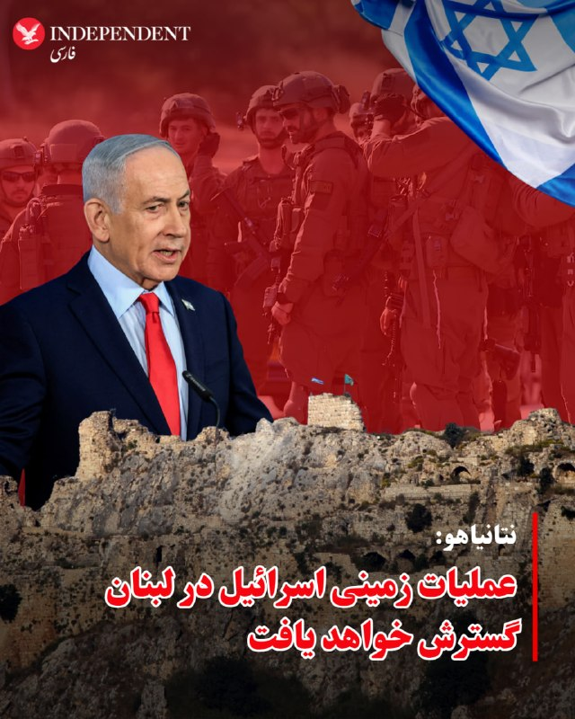
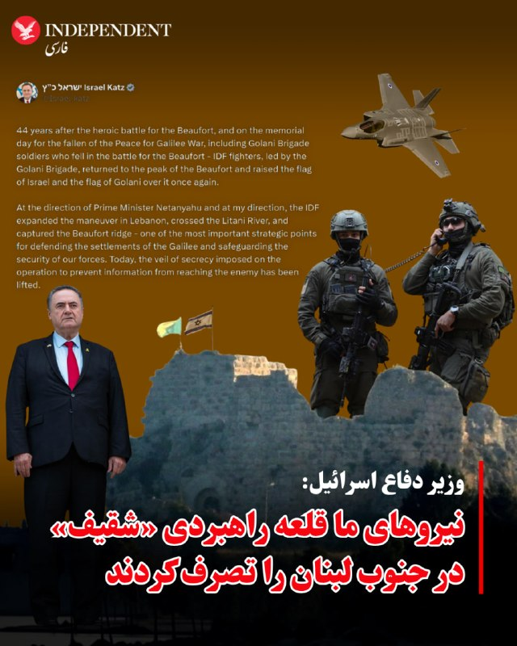
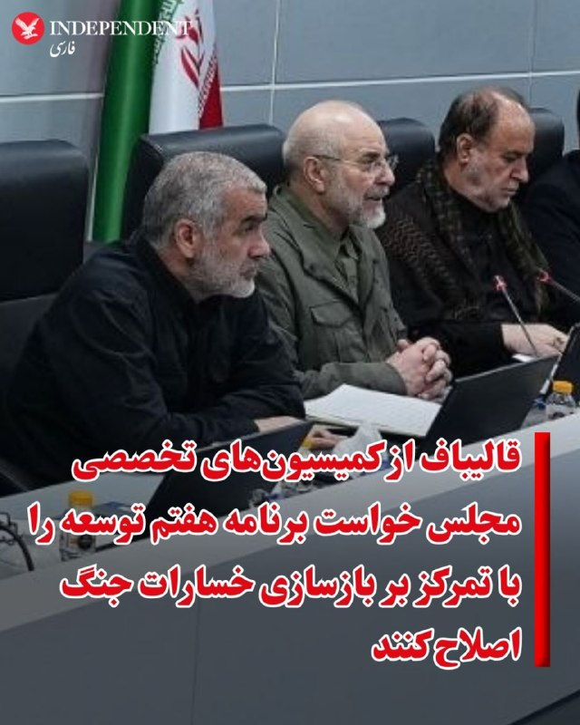
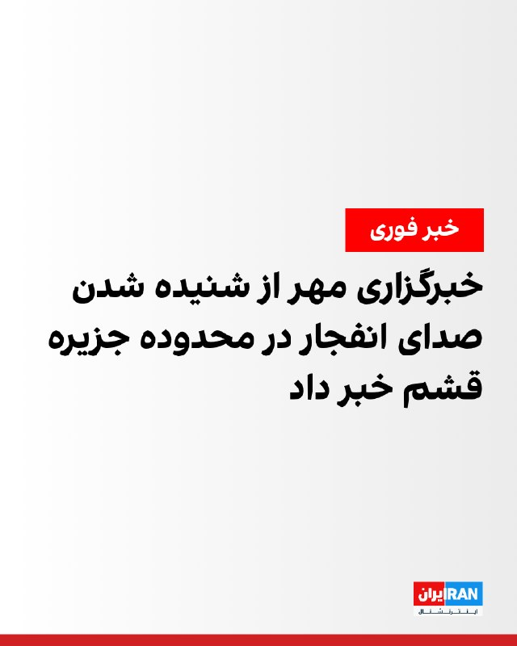
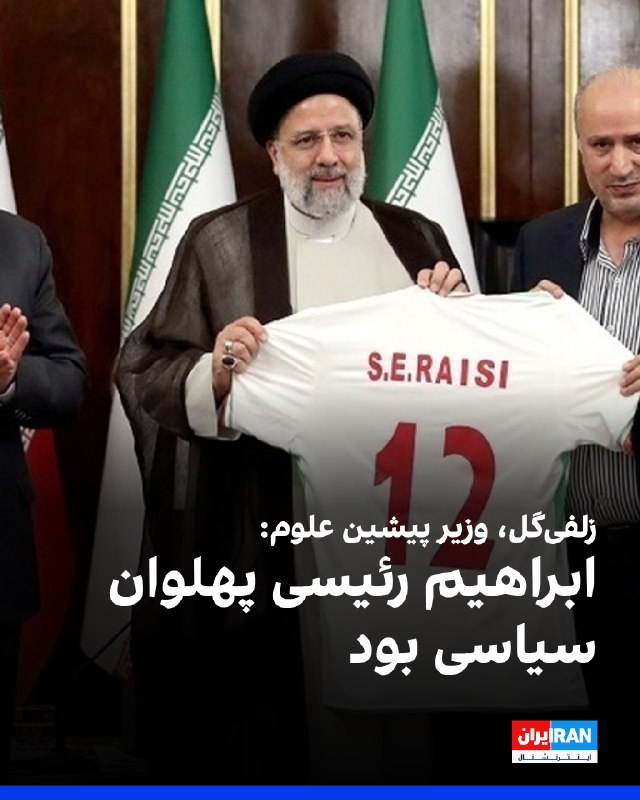
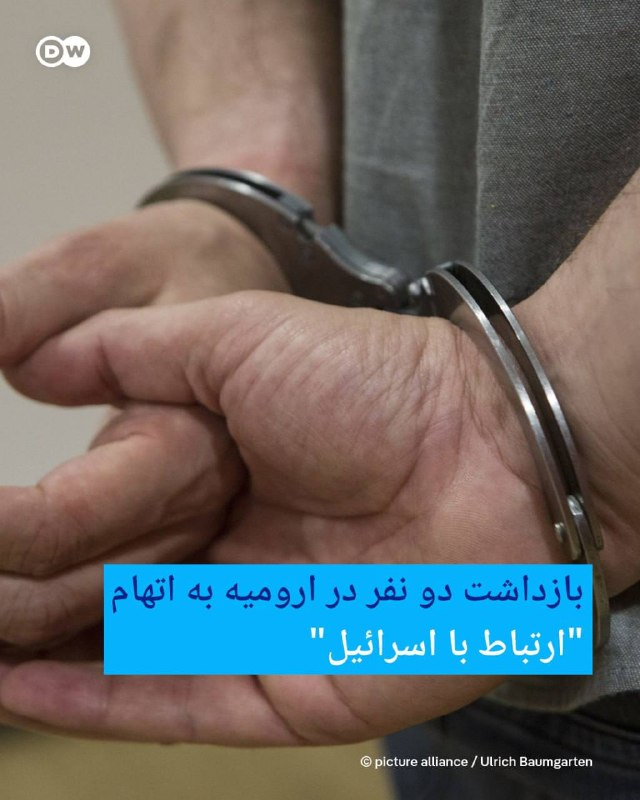
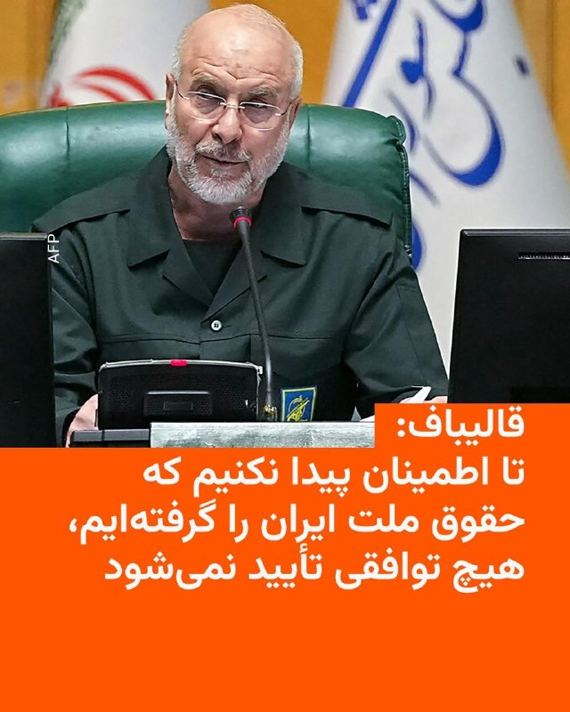
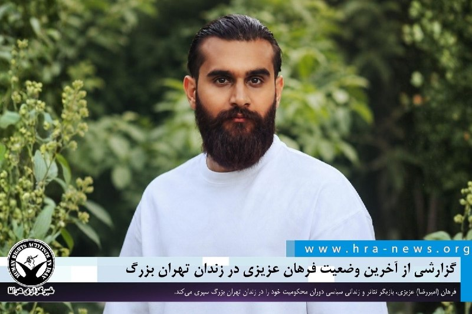

# خواننده تلگرام

<!-- TOP_NAV START -->

<a href="https://github.com/kiavash-sh/aio-downloader/blob/main/telegram/content/archive_1.md" style="display:inline-block; padding:6px 12px; margin:0 4px; background-color:#2ea44f; color:white; text-decoration:none; border-radius:4px; font-weight:bold;">صفحه بعد</a>

<!-- TOP_NAV END -->

<!-- MSG START -->

---
📅 بروزرسانی: 1405/03/10 14:58
---

## VahidOOnLine — post 243040

  <a href="telegram/content/VahidOOnLine_243040_1780226915.mp4" target="_blank">🎬 Download video</a>

ویدیوی منتشرشده، حمل پیکر جاویدنام محسن جبارزاده را نشان می‌دهد. جبارزاده، ۴۱ ساله و متاهل، ۱۹ دی‌ ۱۴۰۴ در خیابان سلسبیل تهران هدف گلوله جنگی ماموران قرار گرفت و کشته شد.
‌🏁 🇬🇧 IranintlTV

🤖 @VahidOOnLine

## VahidOOnLine — post 243039

  

⭕️نتانیاهو: عملیات زمینی اسرائیل در لبنان گسترش خواهد یافت

♦️بنیامین نتانیاهو، نخست‌وزیر اسرائیل روز یکشنبه دهم خرداد اعلام کرد که به ارتش این کشور دستور داده است حضور نیروها در مخفیگاه و مواضع حزب‌الله در شمال رود لیتانی را گسترش دهد و عملیات زمینی در لبنان را تعمیق کند.

نتانیاهو تصرف قلعه راهبردی بوفور (شقیف) را «تغییری بنیادین» در سیاست اسرائیل توصیف کرد و گفت: «ابتکار عمل در تمامی جبهه‌ها در اختیار اسرائیل قرار دارد».

اظهارات نخست‌وزیر اسرائیل در حالی مطرح می‌شود که درگیری‌ها میان ارتش این کشور و حزب‌الله در جنوب لبنان همچنان ادامه دارد و عملیات نظامی اسرائیل در این منطقه وارد مرحله تازه‌ای شده است.
‌🇸🇦 Indypersian

🤖 @VahidOOnLine

## VahidOOnLine — post 243038

  

♦️وزیر امور خارجه فرانسه روز یکشنبه ۱۰ خرداد گفت که پس از تصرف قلعه قرون وسطایی «بوفورت» در لبنان توسط نیروهای اسرائیلی، فرانسه درخواست جلسه اضطراری شورای امنیت سازمان ملل را داده است.

ژان نوئل بارو گفت: «من درخواست جلسه اضطراری شورای امنیت سازمان ملل را کرده‌ام زیرا در حالی که ما حق اسرائیل را مانند همه کشورها برای دفاع از خود به رسمیت می‌شناسیم، هیچ چیز نمی‌تواند ادامه عملیات نظامی اسرائیل در لبنان و اشغال روزافزون خاک لبنان توسط آن را توجیه کند.»

اسرائیل کاتس، وزیر دفاع اسرائیل روز یکشنبه دهم خرداد با انتشار پیامی در اکس اعلام کرد که نیروهای ارتش این کشور قلعه تاریخی و راهبردی شقیف (بوفورت) در جنوب لبنان را تصرف کرده‌اند.

خبرگزاری فرانسه روز یکشنبه تصاویری از برافراشته شدن پرچم ارتش اسرائیل بر فراز این قلعه را در حالی که صدای گلوله‌باران و ستون‌های دود در مناطق اطراف نیز مشاهده می‌شود، منتشر کرد.
‌🇸🇦 Indypersian

🤖 @VahidOOnLine

## VahidOOnLine — post 243037

  

خبرگزاری مهر از شنیده شدن صدای انفجار در محدوده جزیره قشم خبر داد و نوشت که ساکنان مناطق مرکزی و جنوبی این جزیره آن را تایید کرده‌اند اما ماهیت صدا هنوز مشخص نشده است.
همزمان صداوسیما اعلام کرد صداهای شنیده‌شده در قشم و بندرعباس، ناشی از «امحای مهمات باقی‌مانده از جنگ» است.
‌🏁 🇬🇧 IranintlTV

🤖 @VahidOOnLine

## VahidOOnLine — post 243036

  

بنیامین نتانیاهو، نخست‌وزیر اسرائیل، گفت دستور داده استقرار ارتش اسرائیل در مواضع حزب‌الله در شمال رود لیتانی گسترش یابد و عملیات زمینی در لبنان تعمیق شود. او تصرف قلعه بوفور را «تغییری بنیادین» در سیاست اسرائیل خواند و افزود ابتکار عمل در همه جبهه‌ها در دست اسرائیل است.
‌🏁 🇬🇧 IranintlTV

🤖 @VahidOOnLine

## VahidOOnLine — post 243035

  

⭕️وزیر دفاع اسرائیل: نیروهای ما قلعه راهبردی «شقیف» در جنوب لبنان را تصرف کردند

♦️اسرائیل کاتس، وزیر دفاع اسرائیل روز یکشنبه دهم خرداد با انتشار پیامی در اکس اعلام کرد که نیروهای ارتش این کشور قلعه تاریخی و راهبردی شقیف (بوفورت) در جنوب لبنان را تصرف کرده‌اند.
وزیر دفاع اسرائیل همچنین از گسترش عملیات زمینی ارتش این کشور علیه حزب‌الله خبر داد و گفت «نیروهای ما پس از عبور از رودخانه لیتانی، کنترل این موقعیت مهم را به دست گرفته‌اند».

کاتس در این پیام نوشت: «۴۴ سال پس از نبرد بوفورت، نیروهای ما بار دیگر به این قلعه بازگشتند و پرچم اسرائیل را بر فراز آن برافراشتند.»

تصاویر خبرگزاری فرانسه نیز برافراشته شدن پرچم ارتش اسرائیل بر فراز این قلعه را نشان می‌دهد؛ هرچند هم‌زمان صدای گلوله‌باران و ستون‌های دود در مناطق اطراف نیز مشاهده می‌شود.

قلعه «شقیف» به‌دلیل اشراف بر بخش‌های وسیعی از جنوب لبنان، یکی از مهم‌ترین مواضع راهبردی این منطقه محسوب می‌شود.
‌🇸🇦 Indypersian

🤖 @VahidOOnLine

## VahidOOnLine — post 243034

  

سایت هرانا گزارش داد زهرا شهباز طبری، زندانی سیاسی محبوس در زندان لاکان رشت، پس از نقض حکم پیشین در دیوان عالی کشور، بار دیگر از سوی شعبه دوم دادگاه انقلاب رشت به ریاست محمدعلی درویش‌گفتار، به اتهام «بغی از طریق عضویت و فعالیت در سازمان مجاهدین خلق» به اعدام محکوم شد.
این زندانی سیاسی ۶۸ ساله، در فروردین ۱۴۰۴ در منزل شخصی خود در رشت بازداشت شده بود.
‌🏁 🇬🇧 IranintlTV

🤖 @VahidOOnLine

## VahidOOnLine — post 243033

  

فاطمه مهاجرانی، سخنگوی دولت گفت: «فعلا خبری از افزایش مبلغ کالابرگ نیست، البته مطلوب دولت این است که بتواند مبلغ کالابرگ را افزایش دهد اما باید مطلوبات را با مقدورات هماهنگ کنیم.»

او ادامه داد: «اتفاقی که الان در جنوب کشور و دریا در حال رخ دادن است، روی اقتصاد ما تاثیر می‌گذارد.»
iranintl
‌🏁 🇬🇧 IranintlTV

🤖 @VahidOOnLine

## VahidOOnLine — post 243032

  

♦️محمدباقر قالیباف، رئیس‌ مجلس شورای اسلامی در جلسه مجازی روز یکشنبه مجلس گفت: «باید اصلاح برنامه‌ هفتم با تمرکز بر بازسازی خسارات جنگ در دستور کار کمیسیون‌های تخصصی قرار گیرد.»
قالیباف با اشاره به پیام مجتبی خامنه‌ای درخصوص توجه مجلس به مسائل پساجنگ از همۀ‌ ‌کمیسیون‌های‌ تخصصی ‌مرتبط مجلس خواست تا با هماهنگی با دولت طرح‌های لازم را برای اصلاح بندهای ناظر به «نوسازی و بازسازی خسارات جنگ تحمیلی دوم و سوم» به‌صورت «دقیق، قابل سنجش و زمان‌بندی‌شده» آماده کنند تا در اولین فرصتی که شورای‌عالی امنیت ملی به تقاضای هیئت‌رئیسۀ‌ مجلس برای تشکیل جلسات صحن علنی پاسخ مثبت داد، فرایند تصویب آنها آغاز شود.
رسانه‌های ایران گزارش دادند که روز یکشنبه ۱۰ خرداد جلسه مجازی صحن مجلس به ریاست قالیباف و مشارکت برخط ۱۸۷ نماینده و ۱۴ نماینده به‌صورت حضوری برگزار شد.
‌🇸🇦 Indypersian

🤖 @VahidOOnLine

## VahidOOnLine — post 243031

⭕️مراسم تولد جاویدنام مصطفی نوری شیرازی در کنار مزارش برگزار شد

♦️تصاویری که روز یکشنبه دهم خرداد در شبکه‌های اجتماعی منتشر شده نشان می‌دهد، جمعی از بستگان و آشنایان جاویدنام مصطفی نوری شیرازی با حضور بر مزار فرزندشان، مراسم سالروز تولد این جوان جان‌باخته را برگزار کردند.

مصطفی نوری شیرازی، جوان ۲۳ ساله اهل نور در استان مازندران، شامگاه جمعه ۱۹ دی‌ماه ۱۴۰۴ با شلیک مستقیم گلوله جنگی نیروهای سرکوبگر جمهوری اسلامی جان باخت.
به گفته نزدیکان این جوان، ابتدا او را به بیمارستان خمینی‌شهر نور منتقل کردند اما ساعاتی بعد در بیمارستان جان سپرد.
‌🇸🇦 Indypersian

🤖 @VahidOOnLine

## VahidOOnLine — post 243030

محمدعلی زلفی‌گل، وزیر علوم در دولت ابراهیم رئیسی گفت: «شما در مناظرات انتخاباتی دیدید که رئیسی هیچ‌گاه حاضر نبود دست به کاری بزند یا حرفی بزند که از منش انسانی، تقوا، ایمان و اخلاق به دور باشد؛ رئیسی شهادت‌گونه زندگی کرد و یک پهلوان سیاسی بود.»

او ادامه داد: «من شهادت می‌دهم که رئیسی فقط کارها را برای خدا، مردم و نظام جمهوری اسلامی انجام می‌داد.»
‌🏁 🇬🇧 IranintlTV

🤖 @VahidOOnLine

## VahidOOnLine — post 243029

  <a href="telegram/content/VahidOOnLine_243029_1780226925.mp4" target="_blank">🎬 Download video</a>

ویدیوهایی که تازه به دست ایران‌اینترنشنال رسیده، برگزاری مراسم چهلم جاویدنام احمد طراقیان را بر سر مزارش نشان می‌دهد.
طراقیان، ۳۲ ساله، شامگاه ۱۹ دی‌ ۱۴۰۴ در شهر کرج، با شلیک گلوله جنگی به ناحیه سر هدف قرار گرفت و جان باخت.
‌🏁 🇬🇧 IranintlTV

🤖 @VahidOOnLine

## VahidOOnLine — post 243028

  <a href="telegram/content/VahidOOnLine_243028_1780226928.mp4" target="_blank">🎬 Download video</a>

ویدیوی رسیده به ایران‌اینترنشنال، برگزاری مراسم تولد جاویدنام مصطفی نوری شیرازی را بر سر مزارش نشان می‌دهد.
مصطفی نوری، جوان ۲۳ ساله اهل شهر نور در استان مازندران، جمعه ۱۹ دی‌ماه ۱۴۰۴ با شلیک مستقیم نیروهای سرکوبگر جان باخت. او را به بیمارستان خمینی‌شهر نور بردند اما جان باخت.
‌🏁 🇬🇧 IranintlTV

🤖 @VahidOOnLine

## VahidOOnLine — post 243027

  

♦️ارتش اسرائیل روز یکشنبه ۱۰ خرداد به غیرنظامیان لبنانی ساکن جنوب رودخانه زهرانی هشدار داد که منطقه را تخلیه کنند و اعلام کرد که عملیات علیه حزب‌الله را تشدید می‌کند.

آویخای ادرعی، سخنگوی عرب زبان ارتش اسرائیل در شبکه‌های اجتماعی نوشت: «ساکنان جنوب لبنان، شما باید فوراً به شمال زهرانی نقل مکان کنید.»

به گزارش خبرگزاری فرانسه، در حالی که تلاش‌ها برای برای دستیابی به آتش‌بس در لبنان ادامه دارد، اسرائیل روز جمعه حملات سنگین خود به جنوباین کشور را ادامه داد.
‌🇸🇦 Indypersian

🤖 @VahidOOnLine

## VahidOOnLine — post 243026

  <a href="telegram/content/VahidOOnLine_243026_1780226933.mp4" target="_blank">🎬 Download video</a>

⭕️انقلاب ملی ایران؛ جاوید نام محسن نمازی به ضرب گلوله سرکوبگران در تهران کشته شد

♦️تصاویری که روز شنبه نهم خرداد در شبکه‌های اجتماعی منتشر شده، جاوید نام محسن نمازی را نشان می‌دهد که در کلاس مدرسه درحال گذراندن شور و حال جوانی است.
محسن نمازی ۱۸ ساله، شامگاه پنجشنبه ۱۸ دی‌ماه ۱۴۰۴ در جریان انقلاب ملی ایرانیان به‌ضرب گلوله جنگی نیروهای سرکوبگر جمهوری اسلامی در منطقه بهارستان تهران کشته شد.
‌🇸🇦 Indypersian

🤖 @VahidOOnLine

## WithYashar — post 13021

روابط‌عمومی ۳پا : صدای انفجار در بندرعباس مربوط به خنثی‌سازی مهمات عمل‌نکرده است.
@withyashar

## WithYashar — post 13020

نیویورک‌تایمز: ترامپ شروط توافق احتمالی با جمهوری اسلامی رو سخت‌تر کرده و نسخه اصلاح‌شده رو برای بررسی دوباره به تهران فرستاده.

طبق این گزارش، اختلاف‌ها به‌ویژه بر سر آزادسازی منابع مالی ایران ادامه داره و واشینگتن تلاش می‌کنه با افزایش فشار، روند مذاکرات رو تسریع کنه.
@withyashar

## WithYashar — post 13019

Voice message

## WithYashar — post 13018

به عنوان خردادی میگم حالا که موضوعش پیش اومد😂
ما اخلاقمون دقیقاااا همون عربس که داره مسافر میبره قاهره
کار خودمونو میکنیما ولی پستی بلندی زیاد داره مسیرمون

## WithYashar — post 13017

دم کسایی‌که حمایت میکنند گرم 🙌🏾❤️‍🩹

## WithYashar — post 13016

ی روز درمیون ب صد نفر میفرستم

## WithYashar — post 13015

لینک کانال تلگرامتو

## WithYashar — post 13014

چیزی ‌نیست صدای
“واریز ناموفق: موجودی کافی نیسته!”
@withyashar 🤣

## WithYashar — post 13013

صدای انفجار در قشم🚨
@withyashar

## WithYashar — post 13012

چندین گزارش صدای مهیب در بندر عباس
@withyashar 🚨

## WithYashar — post 13011

🇺🇸 دونالد ترامپ ( ۷۹ سال )
۲۴ خرداد ۱۳۲۵
🇺🇸 مارکو روبیو ( ۵۵ سال )
۷ خرداد ۱۳۵۰
🇺🇸 پیت هگست ( ۴۵ سال )
۱۶ خرداد ۱۳۵۹
@withyashar 😃

## WithYashar — post 13010

یاشار در داخل ایران فاز مردم مثل آب و هوای خردادی هاست واقعا!!! مودی و اصلا مشخص نیست مردم هم خودشون چی میخوان!!!

## WithYashar — post 13009

## WithYashar — post 13008

https://youtu.be/tRWhvFylQtk

## WithYashar — post 13007

سلام خواهشا بگید مگه چندسالتونه ک جام جهانی 1997 هم دیدید..نمیخوره بهتون ک سن بالا باشد

## mwarmonitor — post 9941

🔴مارک لوین: «به برنامه خوش آمدید، آمریکا. همیشه مایه خرسندی است که مرد دانا و خردمندِ آمریکا را در برنامه داشته باشیم؛ "ویکتور دیویس هنسون". او یک دوست خوب، پژوهشگر ارشد اندیشکده "هوور" است و پادکست بسیار موفقی هم دارد.
ویکتور، ممنون که به برنامه آمدی. خب، بگذار این سوال را از تو بپرسم: اگر بتوانی خودت را جای رژیم ایران بگذاری، فکر می‌کنی آن‌ها در حال حاضر چطور به این وضعیت نگاه می‌کنند؟»
🔵 ویکتور دیویس هنسون:
«خب، ما دقیقاً نمی‌دانیم، چون این یک جنگ بسیار غیرمعمول است. ما هیچ نیروی زمینی در آنجا نداریم و هیچ خبرنگار مستقری هم نیست؛ بنابراین میزان دقیق خسارت‌ها را نمی‌دانیم. اما به نظر من، آن‌ها از نظر اقتصادی به شدت آسیب دیده‌اند و ۹۰ درصد از توان نظامی‌شان بی‌تحرک و منفعل شده است.
اما آن‌ها فکر می‌کنند هنوز به اندازه کافی موشک در اختیار دارند. همچنین گمان می‌کنند که کشورهای حوزه خلیج [فارس] بسیار آسیب‌پذیر هستند و معتقدند که تردد در تنگه هرمز، جریان شکننده‌ای است که می‌توانند در آن آشوب و هرج‌ومرج ایجاد کنند. با این کار، فرآیندها را به تاخیر بیندازند، شاید به رکود اقتصادی جهانی دامن بزنند و وضعیت را تا زمان انتخابات میان‌دوره‌ای کش بدهند.
آن‌ها همچنین در حال انجام بازی بسیار عجیبی هستند. آن‌ها سیگنال‌هایی می‌فرستند مبنی بر اینکه افرادی که با ما گفتگو می‌کنند — یعنی همان به‌اصطلاح "رهبران منتخب" — با سپاه پاسداران اختلاف نظر دارند. ما به دلیل اینکه افراد زیادی را حذف کرده‌ایم، دقیقاً نمی‌دانیم این ادعا تا چه حد درست است، اما این شک و شبهه به وجود می‌آید که این گفتگوکنندگان نقش "پلیس خوب" را بازی می‌کنند و سپاه پاسداران و حکومت مذهبی که هر از گاهی تلاش می‌کنند به یک ناو حمله‌ور شوند یا به کویتی‌ها یا دیگران ضربه بزنند، نقش "پلیس بد" را دارند؛ در حالی که آن‌ها در واقع با یکدیگر هماهنگ و همسو هستند.
سپس مذاکره‌کنندگان به ما می‌گویند: "خب، ما نمی‌توانیم این افراد را کنترل کنیم، ما متاسفیم، ما نمی‌دانیم آن‌ها در خلیج [فارس] چه کار می‌کنند، مین‌گذاری می‌کنند و غیره... اما مذاکرات را خراب نکنید." و این رویکرد به هر کدام از آن‌ها در رقابت برای کسب قدرت، نوعی اعتبار می‌دهد.
اما در یک مقطعی، ما باید این روند را متوقف کنیم. و راه‌های زیادی برای متوقف کردن آن وجود دارد مارک؛ زیرا این موضوع از نظر نظامی مشکلی نیست، بلکه یک مسئله سیاسی است که با اقتصاد جهانی، انتخابات میان‌دوره‌ای و مسائل دیگر گره خورده است. اما من فکر می‌کنم رئیس‌جمهور می‌تواند راهی برای حل این معادله پیچیده پیدا کند، اگر به طور غیررسمی به آن‌ها بگوید که این حماقت‌ها یک ضرب‌الاجل و پایان مشخصی دارد و پشیمان خواهید شد. و اینکه ما آن‌قدر به اقتصاد و نیروی نظامی شما آسیب خواهیم زد که بهبود و بازسازی آن برای شما یک ربع قرن (۲۵ سال) طول بکشد؛ و ما یک نیروی باقی‌مانده را در آنجا حفظ خواهیم کرد که به همراه متحدانمان، آن تنگه را باز نگه دارد.
من فکر می‌کنم او (رئیس‌جمهور) می‌تواند این را به آن‌ها بگوید، چون ما نمی‌توانیم به این وضعیت ادامه دهیم. چرا که آن‌ها "بقاء" و دوام آوردن خود را به معنای "پیروزی" تفسیر می‌کنند. می‌دانم این حرف شبیه به دنیای رمان‌های اورول (تخیلی و عجیب) به نظر می‌رسد، اما واقعاً همین‌طور فکر می‌کنند. هر روزی که آن‌ها همچنان پابرجا هستند، می‌گویند: "ببینید، ما در برابر ابرقدرتِ تاریخ تمدن ایستادگی کردیم و هنوز اینجا هستیم و آن‌ها نتوانستند ما را متوقف کنند." آن‌ها این واقعیت را در نظر نمی‌گیرند که تمام خویشتن‌داری ما، در واقع محدودیتی است که خودمان بر خودمان اعمال کرده‌ایم؛ این خویشتن‌داری دلایل انسان‌دوستانه و سیاسی دارد، اما دلیل نظامی ندارد. و...»

@mwarmonitor

## mwarmonitor — post 9940

🔸ترامپ در سوشال تروث @mwarmonitor

## mwarmonitor — post 9939

  

🔸ترامپ در سوشال تروث

@mwarmonitor

## mwarmonitor — post 9938

انفجار در قشم

## mwarmonitor — post 9937

انفجار در قشم

## mwarmonitor — post 9936

🔸وزیر خارجه فرانسه: باز کردن تنگه هرمز یک اولویت اصلی است، چون ما قصد نداریم بهای جنگی را که جنگ ما نیست همچنان بپردازیم.

@mwarmonitor

## mwarmonitor — post 9935

🔴متحدان آمریکا در همه‌جا نگران هستند که ایالات متحده در ایستادگی در برابر استبداد، بیش از حد سکوت کرده است. بلومبرگ

@mwarmonitor

## mwarmonitor — post 9934

🔴ترامپ می‌گوید برای امضای توافق با ایران «عجله‌ای ندارد»: «هیچ سلاح هسته‌ای وجود نخواهد داشت». نیویورک پست

@mwarmonitor

## mwarmonitor — post 9933

🔹تری اینگست (خبرنگار فاکس نیوز در تل‌آویو):
«بله بچه‌ها، صبح بخیر. گزارش‌ها حاکی از آن است که رئیس‌جمهور ترامپ در مذاکرات با ایران بر مواضع خود پافشاری می‌کند و در جریان جلسه اواخر هفته گذشته در اتاق وضعیت (Situation Room)، خواستار چندین اصلاحیه در توافق پیشنهادی شده است. اکنون، رئیس‌جمهور در آخر هفته با فاکس نیوز گفتگو کرده و اشاره داشته که ایالات متحده به یک توافق خوب بسیار نزدیک است.»
🔸 دونالد ترامپ (رئیس‌جمهور آمریکا):
«بنابراین، ما داریم چیزی را که می‌خواهیم به آرامی به دست می‌آوریم. آن‌ها مذاکره‌کنندگان بسیار سرسختی هستند؛ زمان زیادی طول می‌کشد. من عجله‌ای ندارم. دوست دارم بگویم عجله دارم چون می‌دانید، قیمت بنزین به شدت کاهش خواهد یافت، اما اگر بخواهید عجله کنید، توافق خوبی به دست نخواهید آورد. و... آهسته اما مطمئن، فکر می‌کنم داریم به آنچه می‌خواهیم می‌رسیم. و اگر آنچه را که می‌خواهیم به دست نیاوریم، آن را به شکل دیگری پایان خواهیم داد.»
🔹تری اینگست :
«رئیس‌جمهور ترامپ به وضوح نشان داد که اگر ایران توافق او را امضا نکند، گزینه نظامی همچنان روی میز باقی می‌ماند. وزیر جنگ، پیت هگست به سنگاپور سفر کرد؛ جایی که او نیز خواسته رئیس‌جمهور ترامپ برای دستیابی به توافق با ایران را تکرار نمود و افزود که توانمندی‌های نظامی ایالات متحده، قوی‌ترین انگیزه برای ایران است تا از جاه‌طلبی‌های هسته‌ای خود دست بکشد.»
📌 پیت هگست (وزیر جنگ آمریکا):
«بنابراین ایران به وضوحِ هرچه تمام‌تر می‌داند که انتظارات ما چیست و این بر عهده تیم مذاکره‌کننده است که آن را محقق کند. آن‌ها دارند به سمت ما می‌آیند (به مواضع ما نزدیک می‌شوند)، گفتگوها سازنده بوده است. فکر می‌کنم آن‌ها... آن‌ها می‌دانند که این روند باید به کدام سمت برود.»
🔹تری اینگست:
«علاوه بر ایران، ما همچنین تحولات مربوط به درگیری میان اسرائیل و بزرگترین گروه نیابتی ایران، یعنی حزب‌الله را رصد می‌کنیم. پهپادها و راکت‌ها در طول آخر هفته آسمان شمال اسرائیل را در نوردیدند، در حالی که اسرائیل حملات هوایی جدیدی را آغاز کرد و نیروهای زمینی را به عمق بیشتری در جنوب لبنان فرستاد.»
🔸 بنیامین نتانیاهو (نخست‌وزیر اسرائیل):
«از اینجا، نبرد علیه حزب‌الله در شمال مدیریت می‌شود. و باید به شما بگویم که نتایج بسیار چشمگیری در اینجا به دست آمده است. نیروهای ما از (رودخانه) لیتانی عبور کرده‌اند؛ آن‌ها به سمت موقعیت‌های تحت کنترل پیشروی کرده‌اند.»
🔹 تری اینگست :
«بر باور اینجاست که اگر توافقی میان ایالات متحده و ایران حاصل شود، می‌تواند به درگیری‌ها در امتداد مرزهای شمالی اسرائیل پایان دهد. حتی در پنج دقیقه گذشته، آژیرهای خطر در بخش‌های شمالی این کشور در میان حملات جدید حزب‌الله به صدا درآمدند. بچه‌ها؟»
🔹 مجری استودیو فاکس نیوز:
«بسیار خب، تری اینگست، به صورت زنده از تل‌آویو. تری، ازت ممنونم.»

@mwarmonitor

## mwarmonitor — post 9932

  <a href="telegram/content/mwarmonitor_9932_1780226937.mp4" target="_blank">🎬 Download video</a>

🎬 Video

## mwarmonitor — post 9931

📌ارتش اوکراین اعلام کرد که پالایشگاه نفت «ساراتوف» متعلق به شرکت روس‌نفت (Rosneft PJSC) در جنوب‌غربی روسیه و همچنین یک واحد پمپاژ نفت در منطقه‌ای دیگر را هدف حمله قرار داده است، در حالی که مقام‌های محلی از وقوع آتش‌سوزی‌های ناشی از حمله پهپادی در طول شب خبر دادند. بلومبرگ

@mwarmonitor

## mwarmonitor — post 9930

  

🔸بردِ درگیری دوباره در حال گسترش است، آتش بی‌وقفه در شمال: ارتش اسرائیل (IDF) در حال حمله به اهداف حزب‌الله در جنوب لبنان است. کانال ۱۳ اسرائیل

@mwarmonitor

## mwarmonitor — post 9929

🔴یکی از مهم‌ترین شبه‌نظامیان مورد حمایت ایران در عراق (کتائب حزب الله) پیشنهاد داده است که «پهپادها و موشک‌ها را» از سایر گروه‌های شبه‌نظامی که «تصمیم گرفته‌اند سلاح‌های خود را زمین بگذارند» خریداری کند. جوروزالم پست

@mwarmonitor

## FoxNewsTwitter — post 342442

‌Fox News (Twitter/X)

👉 Full story here:

## FoxNewsTwitter — post 342441

  

Fox News (Twitter/X)

President Trump floats scrapping America's 250th anniversary concert for a massive MAGA rally after multiple artists pull out of the Great American State Fair lineup. Freedom 250 organizers later confirmed the president will personally kick off the celebration with an opening ceremony speech on June 24.

Artists who withdrew include Martina McBride, Bret Michaels, Young MC, Morris Day and The Time, and C+C Music Factory. Trump called them 'overpriced singers, who nobody wants to hear, whose music is boring.'

## pm_afshaa — post 91932

  <a href="telegram/content/pm_afshaa_91932_1780226942.webm" target="_blank">🎬 Download video</a>

🔴آکسیوس به نقل از یک مقام آمریکایی:
ترامپ به خطوط قرمز خود پایبند است و توافقی رو منعقد نخواهد کرد که تضمینی برای نداشتن ایران به سلاح هسته‌ای نباشه.

💧 Rainbet.com the #1 Non-KYC Crypto Casino & Sportsbook @rainbetcom

😁 @Pm_Afshaa

## pm_afshaa — post 91931

🔴الجزیره: روابط روسیه و ایران آنطور که به نظر می‌رسد نیست هدف مسکو تضمین عدم انزوا، فرسایش یا شکست استراتژیک ایران است

💧 Rainbet.com the #1 Non-KYC Crypto Casino & Sportsbook @rainbetcom

😁 @Pm_Afshaa

## pm_afshaa — post 91930

  <a href="telegram/content/pm_afshaa_91930_1780226943.webm" target="_blank">🎬 Download video</a>

🔴قالیباف: تا اطمینان پیدا نکنیم که حقوق ملت رو گرفتیم، توافق نخواهیم کرد.

💧 Rainbet.com the #1 Non-KYC Crypto Casino & Sportsbook @rainbetcom

😁 @Pm_Afshaa

## pm_afshaa — post 91929

  <a href="telegram/content/pm_afshaa_91929_1780226943.webm" target="_blank">🎬 Download video</a>

🔴آکسیوس: ترامپ هنوز توافق با ایران رو نهایی نکرده و خواهان اعمال اصلاحاتی در متن تفاهم، به‌ویژه درباره اورانیوم غنی‌شده ایران و تنگه هرمز شده. به گفته منابع آمریکایی، این درخواست دور جدیدی از مذاکرات رو آغاز کرده و احتمالا پاسخ جمهوری اسلامی چند روز زمان…

## pm_afshaa — post 91928

  <a href="telegram/content/pm_afshaa_91928_1780226944.webm" target="_blank">🎬 Download video</a>

🔴جلسه صحن مجلس به‌صورت مجازی و با حضور قالیباف برگزار شد.

💧 Rainbet.com the #1 Non-KYC Crypto Casino & Sportsbook @rainbetcom

😁 @Pm_Afshaa

## pm_afshaa — post 91927

  <a href="telegram/content/pm_afshaa_91927_1780226945.webm" target="_blank">🎬 Download video</a>

🔴روزنامه کیهان:
به دلیل نقض آتش‌بس در لبنان، میتونیم جنگ علیه اسرائیل رو آغاز کنیم.

💧 Rainbet.com the #1 Non-KYC Crypto Casino & Sportsbook @rainbetcom

😁 @Pm_Afshaa

## pm_afshaa — post 91926

  <a href="telegram/content/pm_afshaa_91926_1780226946.webm" target="_blank">🎬 Download video</a>

🔴آکسیوس: ترامپ هنوز توافق با ایران رو نهایی نکرده و خواهان اعمال اصلاحاتی در متن تفاهم، به‌ویژه درباره اورانیوم غنی‌شده ایران و تنگه هرمز شده.

به گفته منابع آمریکایی، این درخواست دور جدیدی از مذاکرات رو آغاز کرده و احتمالا پاسخ جمهوری اسلامی چند روز زمان خواهد برد.

💧 Rainbet.com the #1 Non-KYC Crypto Casino & Sportsbook @rainbetcom

😁 @Pm_Afshaa

## pm_afshaa — post 91925

  <a href="telegram/content/pm_afshaa_91925_1780226946.webm" target="_blank">🎬 Download video</a>

🔴خبرگزاری مهر: شنیده شدن صدای انفجار در محدوده جزیره قشم.

صدای یک انفجار در قشم از سوی چندین منبع محلی گزارش شده.

💧 Rainbet.com the #1 Non-KYC Crypto Casino & Sportsbook @rainbetcom

😁 @Pm_Afshaa

## DEJradio — post 5170

⭕️ ترامپ: ارتش جمهوری اسلامی را عامدانه هدف نگرفتیم تا اشتباه عراق تکرار نشود

دونالد ترامپ گفت آمریکا عامدانه از هدف قرار دادن کامل ارتش جمهوری اسلامی خودداری کرده است.
به گفتۀ رئیس جمهوری اسالات متحده، = نابود کردن کامل ساختارهای نظامی یک کشور می‌تواند پیامدهای بلندمدت داشته باشد.
او در گفت‌وگو با فاکس‌نیوز گفت این که در جنگ‌ همه چیز را نابود کنی اشتباه است، چون آن را به کشوری تبدیل می‌کنی که تا ۴۰ سال بعد هم توان بازسازی خود را ندارد.
ترامپ با اشاره به عراق گفت عملکرد آمریکا در آن جنگ «یک اشتباه بزرگ» بود.
رئیس جمهوری آمریکا افزود واشینگتن ارتش جمهوری اسلامی را «تا حدی به حال خود گذاشت.
ترامپ گفت ارتش به نسبت دیگر نیروهای مسلح جمهوری اسلامی، تا اندازه‌ای «میانه‌رو» محسوب می‌شود.
رئیس‌جمهوری آمریکا از سویی تکرار کرد توان دریایی و نیروی هوایی جمهوری اسلامی کاملا نابود شده‌ است.

#خبر #دژ #ترامپ
@DEJradio

## DEJradio — post 5169

  <a href="telegram/content/DEJradio_5169_1780226947.webm" target="_blank">🎬 Download video</a>

👑
🔺 حمایت ایرانیان مقیم مالمو - سوئد از انقلاب شیر و خورشید مردم ایران

#همبستگی #مالمو
@DEJradio

## IranIntlTV — post 339872

  <a href="telegram/content/IranIntlTV_339872_1780226948.mp4" target="_blank">🎬 Download video</a>

در پی راه‌اندازی کارزار ایران‌اینترنشنال برای شناسایی جاویدنامان شهر رشت، شهروندان ویدیوها و اطلاعات تازه‌ای درباره آتش‌سوزی بازار این شهر در ۱۸ دی ۱۴۰۴ ارسال کرده‌اند.

فرنوش فرجی، عضو تحریریه ایران‌اینترنشنال، گزارش می‌دهد
@iranintltv

## IranIntlTV — post 339871

  <a href="telegram/content/IranIntlTV_339871_1780226951.mp4" target="_blank">🎬 Download video</a>

ویدیوی منتشرشده، حمل پیکر جاویدنام محسن جبارزاده را نشان می‌دهد. جبارزاده، ۴۱ ساله و متاهل، ۱۹ دی‌ ۱۴۰۴ در خیابان سلسبیل تهران هدف گلوله جنگی ماموران قرار گرفت و کشته شد.

## IranIntlTV — post 339870

  <a href="telegram/content/IranIntlTV_339870_1780226953.mp4" target="_blank">🎬 Download video</a>

با توقف منچسترسیتی برابر بورنموث در لیگ برتر انگلیس، قهرمانی آرسنال یک هفته مانده به پایان فصل قطعی شد. هواداران این تیم خود را برای برپایی جشن قهرمانی در خیابان‌های لندن آماده می‌کنند.
آیدین مقیمی، خبرنگار ایران‌اینترنشنال، گزارش می‌دهد
@iranintltv

## IranIntlTV — post 339869

  

خبرگزاری مهر از شنیده شدن صدای انفجار در محدوده جزیره قشم خبر داد و نوشت که ساکنان مناطق مرکزی و جنوبی این جزیره آن را تایید کرده‌اند اما ماهیت صدا هنوز مشخص نشده است.
همزمان صداوسیما اعلام کرد صداهای شنیده‌شده در قشم و بندرعباس، ناشی از «امحای مهمات باقی‌مانده از جنگ» است.
https://iranintl.com/202605311776

## IranIntlTV — post 339868

  <a href="telegram/content/IranIntlTV_339868_1780226956.mp4" target="_blank">🎬 Download video</a>

یک شهروند با ارسال ویدیویی به ایران‌اینترنشنال می‌گوید نان سنگک در تهران گران شده است. نانوایی که در این ویدیو حضور دارد می‌گوید با گرانی گندم، سهمیه آرد را کم کرده‌اند.

## IranIntlTV — post 339867

  

بنیامین نتانیاهو، نخست‌وزیر اسرائیل، گفت دستور داده استقرار ارتش اسرائیل در مواضع حزب‌الله در شمال رود لیتانی گسترش یابد و عملیات زمینی در لبنان تعمیق شود. او تصرف قلعه بوفور را «تغییری بنیادین» در سیاست اسرائیل خواند و افزود ابتکار عمل در همه جبهه‌ها در دست اسرائیل است.
https://iranintl.com/202605313134

## IranIntlTV — post 339866

  

سایت هرانا گزارش داد زهرا شهباز طبری، زندانی سیاسی محبوس در زندان لاکان رشت، پس از نقض حکم پیشین در دیوان عالی کشور، بار دیگر از سوی شعبه دوم دادگاه انقلاب رشت به ریاست محمدعلی درویش‌گفتار، به اتهام «بغی از طریق عضویت و فعالیت در سازمان مجاهدین خلق» به اعدام محکوم شد.
این زندانی سیاسی ۶۸ ساله، در فروردین ۱۴۰۴ در منزل شخصی خود در رشت بازداشت شده بود.
https://iranintl.com/202605311737

## IranIntlTV — post 339865

  <a href="telegram/content/IranIntlTV_339865_1780226961.mp4" target="_blank">🎬 Download video</a>

سرخط خبرهای یکشنبه ۱۰ خرداد
@iranintltv

## IranIntlTV — post 339864

  

فاطمه مهاجرانی، سخنگوی دولت گفت: «فعلا خبری از افزایش مبلغ کالابرگ نیست، البته مطلوب دولت این است که بتواند مبلغ کالابرگ را افزایش دهد اما باید مطلوبات را با مقدورات هماهنگ کنیم.»

او ادامه داد: «اتفاقی که الان در جنوب کشور و دریا در حال رخ دادن است، روی اقتصاد ما تاثیر می‌گذارد.»
iranintl.com/202605312740

## IranIntlTV — post 339863

  <a href="telegram/content/IranIntlTV_339863_1780226964.mp4" target="_blank">🎬 Download video</a>

محمدباقر قالیباف، رییس مجلس، در نطق پیش از دستور نخستین جلسه سال سوم مجلس دوازدهم گفت علی خامنه‌ای در دوران رهبری خود پایه‌گذار «ایران قوی، مستقل و مقتدر» بود و آنچه امروز در عرصه‌های نظامی و در صحنه عمومی ایران دیده می‌شود، نتیجه مدیریت و رهبری اوست.
@iranintltv

## IranIntlTV — post 339862

  

محمدعلی زلفی‌گل، وزیر علوم در دولت ابراهیم رئیسی گفت: «شما در مناظرات انتخاباتی دیدید که رئیسی هیچ‌گاه حاضر نبود دست به کاری بزند یا حرفی بزند که از منش انسانی، تقوا، ایمان و اخلاق به دور باشد؛ رئیسی شهادت‌گونه زندگی کرد و یک پهلوان سیاسی بود.»

او ادامه داد: «من شهادت می‌دهم که رئیسی فقط کارها را برای خدا، مردم و نظام جمهوری اسلامی انجام می‌داد.»
https://iranintl.com/202605314899

## IranIntlTV — post 339861

  

🔻در پی قهرمانی پاری‌سن‌ژرمن مقابل آرسنال در فینال لیگ قهرمانان اروپا، درگیری میان هواداران فوتبال و پلیس در شهرهای مختلف فرانسه به بازداشت بیش از ۴۰۰ نفر انجامید.

🔹هزاران نیروی پلیس برای مهار ناآرامی‌هایی که موجب اختلال در خدمات اتوبوس، قطار و مترو در پاریس شد، در پایتخت مستقر بودند.

🔹وزارت کشور اعلام کرده است: «جشن‌ها در برخی شهرها، از جمله پاریس، با ناآرامی‌هایی همراه بود که مداخله نیروهای انتظامی را ضروری کرد.»

🔹گزارش‌ها حاکی است دامنه ناآرامی‌ها به شهرهای لو آور (غرب)، آژن (جنوب‌غرب)، مون‌پلیه (جنوب) و دیژون (شرق) نیز کشیده شده است. پیش‌تر نیز از درگیری میان هواداران و پلیس در چند شهر دیگر فرانسه خبر داده شده بود.

🔹با وجود اینکه این دومین قهرمانی پیاپی پاری‌سن‌ژرمن بود، برای دومین سال متوالی نیز جشن‌های فوتبالی به خشونت کشیده شد. سال ۲۰۲۵ نیز پس از قهرمانی این تیم، جشن‌ها به درگیری‌هایی مرگبار انجامیده بود.

🔹جزییات بیشتر را در سایت بخوانید.

@iranintltvsport

## IranIntlTV — post 339860

  <a href="telegram/content/IranIntlTV_339860_1780226968.mp4" target="_blank">🎬 Download video</a>

جاویدنامان انقلاب ملی ایرانیان
«کمیل جمشیدی» شامگاه ۱۹ دی‌ماه در شهرک اندیشه بر اثر اصابت گلوله ماموران خامنه‌ای از ناحیه‌ گردن جان باخت. نامش در حافظه‌ی این سرزمین می‌ماند و یادش چراغ راه آزادی‌خواهان است.
@iranintltv

## IranIntlTV — post 339859

  <a href="telegram/content/IranIntlTV_339859_1780226970.mp4" target="_blank">🎬 Download video</a>

ویدیوهایی که تازه به دست ایران‌اینترنشنال رسیده، برگزاری مراسم چهلم جاویدنام احمد طراقیان را بر سر مزارش نشان می‌دهد.
طراقیان، ۳۲ ساله، شامگاه ۱۹ دی‌ ۱۴۰۴ در شهر کرج، با شلیک گلوله جنگی به ناحیه سر هدف قرار گرفت و جان باخت.

## IranIntlTV — post 339858

  <a href="telegram/content/IranIntlTV_339858_1780226974.mp4" target="_blank">🎬 Download video</a>

وال‌استریت پس از حملات یازده سپتامبر، فقط شش روز تعطیل بود، اما روسیه پس از حمله به اوکراین، یک ماه بازار مسکو را تعطیل کرد. بورس‌های امارات پس از حملات موشکی و پهپادی جمهوری اسلامی فقط دو روز معاملات را متوقف کردند، در حالیکه بورس تهران، در یک رکورد تاریخی، بیش از هشتاد روز تعطیل بود. در این قسمت چرتکه، محمد ماشین‌چیان رویکرد آمریکایی و روسی به بازار را در مقیاس ایران و امارات بررسی می‌کند.

تماشای نسخه کامل «چرتکه» را در یوتیوب ایران‌اینترنشنال⁩:

https://youtu.be/gPWijjjbR5M
@iranintltv

## IranIntlTV — post 339857

  <a href="telegram/content/IranIntlTV_339857_1780226975.mp4" target="_blank">🎬 Download video</a>

مسعود پزشکیان، رییس‌جمهور دولت جمهوری اسلامی است، در نشستی با وزیر علوم گفت که صداوسیما با ارائه تحلیل‌ها و روایت‌های نادرست و فاقد پشتوانه علمی، تصویر غیرواقعی از وضعیت کشور ارائه می‌دهد.
گفت‌وگو با رضا علیجانی، تحلیل‌گر و فعال سیاسی
@iranintltv

## IranIntlTV — post 339856

  <a href="telegram/content/IranIntlTV_339856_1780226978.mp4" target="_blank">🎬 Download video</a>

🔻عباس جدیدی، قهرمان پیشین کشتی ایران در گفتگویی با خبرآنلاین، با انتقاد به علیرضا دبیر، رییس فدراسیون کشتی به دلیل فعالیت‌های عوام‌فریبانه، گفت: «ما با همین زیرساختهایی که داشتیم همین نتایجی که الان گرفتیم و خیلی‌ها دارند به آن می‌نازند. همین نتایج را با همان زیرساخت‌ها به دست آوردیم، پس مشکل ما زیرساخت نبود. آقا ساخته‌اید! دستتان هم درد نکند، اما یک‌سری ناترازی‌ها و ایرادات اصل کاری و بنیادی را بخواهید پشت زیرساخت‌ها پنهان کنید، برای کاستی‌ها ویریت درست کنید، این یعنی دروغ گفتن به مردم.»

@iranintltvsport

## IranIntlTV — post 339855

  <a href="telegram/content/IranIntlTV_339855_1780226980.mp4" target="_blank">🎬 Download video</a>

ویدیوی رسیده به ایران‌اینترنشنال، برگزاری مراسم تولد جاویدنام مصطفی نوری شیرازی را بر سر مزارش نشان می‌دهد.
مصطفی نوری، جوان ۲۳ ساله اهل شهر نور در استان مازندران، جمعه ۱۹ دی‌ماه ۱۴۰۴ با شلیک مستقیم نیروهای سرکوبگر جان باخت. او را به بیمارستان خمینی‌شهر نور بردند اما جان باخت.

## Shin_Persian — post 6323

  

Shin ✓ @hey_itsmyturn
Sun, 31 May 2026 10:49:34 UTC

State-owned Mehr News reports an explosion in Qeshm island, Hormozgan Province, #Iran

فارسی

خبرگزاری دولتی مهر از وقوع انفجاری در جزیره قشم، استان هرمزگان، #Iran گزارش می‌دهد.

𝕏 · @shin_persian

## Shin_Persian — post 6322

متد جدید فرانتینگ توسط Patterniha:

https://github.com/patterniha/MITM-DomainFronting

## FarsiVOA — post 219155

🔺اتحادیه اروپا توقف موقت افزایش سقف قیمت نفت روسیه را بررسی می‌کند

▪️اتحادیه اروپا در حال بررسی توقف موقت سازوکار بازنگری سقف قیمت نفت روسیه است. بلومبرگ این این موضوع را با تداوم جنگ خاورمیانه و جهش جهانی قیمت نفت مرتبط دانست.

▪️سازوکار فعلی اتحادیه اروپا هر شش ماه یک‌بار و به‌صورت خودکار سقف قیمت نفت خام روسیه را بازبینی می‌کند؛ به‌گونه‌ای که سقف قیمت همواره ۱۵ درصد پایین‌تر از میانگین قیمت نفت اورال روسیه در دوره مرجع تعیین شود.

▪️سقف فعلی ۴۴ دلار و ۱۰ سنت برای هر بشکه است و بازبینی بعدی آن برای تابستان امسال برنامه‌ریزی شده است.

▪️در این چارچوب، شرکت‌های اروپایی اجازه ندارند به نفتی که بالاتر از سقف مصوب فروخته می‌شود، خدمات بیمه و حمل‌ونقل دریایی ارائه کنند.

⬇️ بیشتر بخوانید:
https://ir.voanews.com/a/eu-weighs-temporary-freeze-on-russia-oil-price-cap-over-iran-war/8155759.html

## FarsiVOA — post 219154

🔺گزارش روزنامه شرق از بحران خاموش ترک درمان در ایران

▪️روزنامه شرق در گزارشی از گسترش پدیده‌ای نوشت که آن را «بحران خاموش ترک درمان» نامیده است؛ وضعیتی که در آن بیماران به دلیل افزایش هزینه‌ها، درمان‌‌ و مراقبت از بیماری‌های مزمن را به تعویق می‌اندازند یا به‌کلی کنار می‌گذارند.

▪️بر اساس این گزارش، فشار همزمان تورم درمانی، کاهش قدرت خرید خانوارها، رشد قیمت دارو و تجهیزات پزشکی و پوشش محدود بیمه‌ها باعث شده درمان برای بسیاری از خانواده‌ها از یک حق ضروری به کالایی وابسته به توان مالی تبدیل شود.

▪️در بخش دیابت، شرق به نقل از رئیس انجمن دیابت ایران نوشت قیمت نوار تست قند خون در ماه‌های اخیر چهار برابر شده است.

⬇️ بیشتر بخوانید:
https://ir.voanews.com/a/8155757.html

## FarsiVOA — post 219153

آغاز عملیات گسترده ارتش اسرائیل در محور «قلعه بوفور» و «وادی سلوقی» در جنوب لبنان؛

ارتش اسرائیل از آغاز یک عملیات لشکری گسترده توسط فرماندهی شمال در منطقه «قلعه بوفورت» و «دره سلوقی» در جنوب لبنان خبر داد. این عملیات با هدف انهدام زیرساخت‌های نظامی، از بین بردن نیروهای حزب‌الله، تقویت کنترل عملیاتی در جنوب لبنان و رفع تهدید مستقیم از منطقه «انگشت جلیل» و شهرک «مطله» آغاز شده است.

این تحرکات از چند روز گذشته آغاز شده و طی آن نیروهای پیاده و زرهی گسترده‌ای از جمله «تیپ گولانی»، «تیپ ۷»، «تیپ گیفعاتی»، «تیپ آتش» و «یگان چندبعدی» تحت فرماندهی لشکر ۳۶ و با هدایت اطلاعاتی سازمان اطلاعات نظامی (آمان)، عملیات تهاجمی خود را برای گسترش خط دفاعی پیش‌رو آغاز کرده‌اند.

تمرکز اصلی این فعالیت‌ها بر به دست گرفتن کنترل ارتفاعات بوفور و منطقه وادی سلوقی، ضربه سنگین به سازمان تروریستی حزب‌الله و انهدام زیرساخت‌های کلیدی این گروه است که تحت حمایت جمهوری اسلامی در این ارتفاعات ساخته شده بودند؛ مواضعی که حزب‌الله از آن‌ها برای هدایت نبردها و اجرای حملات متعدد استفاده می‌کرد.
@FarsiVOA

## DW_Farsi — post 125338

🔶 آژانس اتمی خواستار بازدید از نیروگاه هسته‌ای زاپوریژیا شد

آژانس بین‌المللی انرژی اتمی خواستار دسترسی به سالن توربین نیروگاه هسته‌ای زاپوریژیا شده است؛ سالنی که در جریان جنگ روسیه علیه اوکراین، اخیراً مورد اصابت یک پهپاد قرار گرفت.

این نهاد نظارتی سازمان ملل در شبکه ایکس اعلام کرد که از حمله‌ای مطلع شده که در نتیجه آن سوراخی در دیوار این سالن ایجاد شده است. به گفته آژانس، این نخستین حمله پهپادی در محوطه نیروگاه زاپوریژیا از آوریل ۲۰۲۴ به این سو بوده است.

نیروگاه زاپوریژیا با شش راکتور و ظرفیت اسمی شش هزار مگاوات، بزرگ‌ترین نیروگاه هسته‌ای اروپا به شمار می‌رود. این نیروگاه متعلق به اوکراین است، اما از مارس ۲۰۲۲ تحت کنترل روسیه قرار دارد.

این نیروگاه در حال حاضر برق تولید نمی‌کند و چندین تلاش اوکراین برای بازپس‌گیری آن نیز تاکنون ناکام مانده است.

@dw_farsi

## DW_Farsi — post 125337

  

🔶 بازداشت دو نفر در ارومیه به اتهام "ارتباط با اسرائیل"

اطلاعات سپاه با صدور بیانیه‌ای مدعی شد که دو فرد "مرتبط با اسرائیل" را در ارومیه شناسایی و دستگیر کرده است.

خبرگزاری دولتی ایرنا با انتشار این خبر ادعا کرد که افراد دستگیرشده "اقدام به ارسال اطلاعات و مختصات برخی اماکن از جمله مدارس، مساجد و حوزه‌های مقاومت بسیج از طریق پیام‌رسان تلگرام کرده بودند".

در بیانیه اطلاعات سپاه آمده است که این افراد، "پس از حملات صورت‌گرفته، از محل‌های آسیب‌دیده تصویربرداری کرده و تصاویر را برای عوامل مرتبط ارسال می‌کردند".

ارتباط با اسرائیل یا جاسوسی از جمله عناوین اتهامی رایج در جریان جنگ ۱۲ روزه و جنگ اخیر میان جمهوری اسلامی و آمریکا بوده است. محافل رسمی حکومت ایران، به رغم وجود صدها عکس و فیلم و سند از حمله به شهروندان، اعتراضات ۱۸ و ۱۹ دی ۱۴۰۴ و حتی کشتار هزاران نفر از شهروندان را نیز اغلب به اسرائیل و موساد نسبت می‌دهند.

@dw_farsi

## DW_Farsi — post 125336

  

🔶 پلمب یک کافه‌ در تهران به‌ اتهام عجیب "ترویج شیطان‌پرستی"

رسانه‌های ایران از پلمب یک کافه در منطقه ولیعصر تهران توسط پلیس نظارت بر اماکن عمومی تهران بزرگ خبر دادند.

پلیس اماکن، این کافه را به "ترویج فرقه‌های انحرافی" متهم کرده و گفته "این کافه با برگزاری برنامه‌هایی با ظاهر موسیقی غربی، بستری برای حرکات نابهنجار" و "تحرکات شیطانی" فراهم کرده بود.

بر اساس ادعای پلیس اماکن، مشتریان این کافه، "شامل دختران و پسران جوان، در وضعیتی غیرطبیعی و با حرکاتی عجیب و غریب مشاهده شده بودند".
طبق ادعای رسانه‌های حکومتی ایران، ماموران پلیس اماکن، "دستور پلمب واحد صنفی را صادر کردند".

ایجاد محدودیت‌ها و مقابله حکومت با آزادی‌های اجتماعی در هفته‌های اخیر به ویژه پس از برقراری آتش‌بس شکننده میان جمهوری اسلامی با آمریکا شدت گرفته است. جمهوری اسلامی در میانه جنگ، سعی کرده بود با سهل‌گیری‌های بی‌سابقه، از جمله گاهی با عدم مداخله در پوشش و حجاب اجباری، به ویژه در تجمعات حکومتی، از خود چهره‌ای معتدل نمایش دهد.

@dw_farsi

## Persian_Trend_Official — post 15388

صدای ۳ انفجار در مرکز شهر تهران شنیده شده 🫆: Ⓜ 🆔:@persian_trend_official پرشین ترند | متفاوت‌ترین کانال نظامی

## Persian_Trend_Official — post 15387

  <a href="telegram/content/Persian_Trend_Official_15387_1780226986.mp4" target="_blank">🎬 Download video</a>

همه چیز از این روز لعنتی شروع شد !
7 اکتبر 2023

## RadioFarda — post 157742

پیگیری خانواده‌های جان‌باختگان پرواز ۷۵۲ به اصلاح مقررات هوایی بین‌المللی انجامید

🔸انجمن خانواده‌های جان‌باختگان پرواز پی‌اس۷۵۲ اعلام کرد که پس از شش سال و نیم پیگیری و رایزنی، ضمیمهٔ ۱۳ کنوانسیون شیکاگو، مربوط به تحقیقات ایمنی سوانح هوایی، اصلاح می‌شود، تغییری که به گفتهٔ این انجمن می‌تواند مانع تکرار وضعیتی شود که در آن کشور متهم یا دارای تضاد منافع، خود مسئول هدایت تحقیقات ایمنی شود.

🔸پرواز پی‌اس۷۵۲ هواپیمایی اوکراین بامداد ۱۸ دی ۱۳۹۸، دقایقی پس از برخاستن از فرودگاه تهران، با شلیک دو موشک سپاه پاسداران سرنگون شد و همهٔ ۱۷۶ سرنشین آن جان باختند.

🔸بر اساس مقررات موجود در ضمیمهٔ ۱۳ کنوانسیون شیکاگو، مسئولیت اصلی تحقیقات ایمنی بر عهدهٔ کشوری قرار گرفت که سانحه در قلمرو آن رخ داده بود؛ یعنی جمهوری اسلامی ایران.

🔸انجمن خانواده‌های جان‌باختگان در بیانیهٔ خود نوشت که این چارچوب حقوقی، که طی دهه‌ها برای رسیدگی به فجایع هوانوردی به کار می‌رفت، در پروندهٔ سرنگونی پرواز پی‌اس۷۵۲ «اَلکن و ناکافی» بود و عملاً «پروندهٔ تحقیقات دربارهٔ قتلی جمعی به دست قاتلان افتاد».

🔸بر اساس نامه‌ای که به گفتهٔ انجمن از سوی وزیر ترابری کانادا دریافت شده، اصلاحیهٔ تازه ایکائو برای نخستین بار به مسئله تضاد منافع در تحقیقات ایمنی پس از سرنگونی هواپیما پرداخته است.

🔸این اصلاحیه همچنین راهکارهایی برای حفظ استقلال تحقیقات پیشنهاد می‌دهد؛ از جمله واگذاری تحقیقات ایمنی به دولتی دیگر و ارائهٔ به‌موقع اطلاعات واقعی و تأییدشده به افکار عمومی.

🔸 گزارش کامل را در وب‌سایت رادیوفردا بخوانید.

@RadioFarda

## RadioFarda — post 157741

  

🔸نیروی دریایی سپاه پاسداران روز یک‌شنبه اعلام کرد که ۲۸ کشتی «با هماهنگی» این نیروی نظامی حکومت ایران از تنگه هرمز عبور کرده‌اند.

🔸این آمار عبور کشتی‌ها از این تنگه استراتژیک در یک شبانه‌روز گذشته است.

🔸در بیانیه سپاه آمده است:‌ «طی شبانه‌روز گذشته ۲۸ فروند کشتی اعم از نفتکش، کانتینربَر و سایر کشتی‌های تجاری پس از کسب مجوز با هماهنگی و تأمین امنیت نیروی دریایی سپاه از تنگه هرمز عبور کردند.»

🔸ساعتی پیشتر روزنامه اسرائیلی «اسرائیل هیوم» نوشته بود که ده‌ها نفتکش حامل نفت و گاز طبیعی مایع در هفتهٔ گذشته با اجازه آمریکا و پرداخت عوارض به ایران از تنگهٔ هرمز عبور کرده‌اند.

🔸این در حالی است که دولت آمریکا بارها اعلام کرده است با پرداخت عوارض به ایران برای عبور از تنگه هرمز مخالف است.

@RadioFarda

## RadioFarda — post 157740

🔸جلسه مجازی صحن مجلس شورای اسلامی به ریاست محمدباقر قالیباف و مشارکت آنلاین ۱۸۷ نماینده و حضور ۱۴ نماینده برگزار شد. 🔸در این جلسه که اولین جلسه از سومین سال مجلس دوازدهم بود، اعضای جدید هیئت رئیسه مجلس سوگند یاد کردند. 🔸جلسه روز یک‌شنبه، دهم خردادماه، همچون…

## RadioFarda — post 157739

  

🔸جلسه مجازی صحن مجلس شورای اسلامی به ریاست محمدباقر قالیباف و مشارکت آنلاین ۱۸۷ نماینده و حضور ۱۴ نماینده برگزار شد.

🔸در این جلسه که اولین جلسه از سومین سال مجلس دوازدهم بود، اعضای جدید هیئت رئیسه مجلس سوگند یاد کردند.

🔸جلسه روز یک‌شنبه، دهم خردادماه، همچون جلسات معدود گذشته در مکانی مخفی برگزار شد.

🔸محمدباقر قالیباف در همین جلسه تأکید کرد که «تا اطمینان پیدا نکنیم که حقوق ملت ایران را گرفته‌ایم، هیچ توافقی تأیید نمی‌شود».

🔸قالیباف که از او به عنوان رئیس هیئت مذاکره‌کننده ایران نیز یاد می‌شود در این جلسه بیانیه‌ای را قرائت کرد و در آن ادعا کرد که «در حال عقب نشاندن دشمن در یک جنگ تاریخ‌ساز هستیم».

@RadioFarda

## IranianMinds — post 21136

صدا سیما:
صداهای شنیده‌شده در قشم و بندرعباس ناشی از امحای مهمات باقی‌مانده از جنگ است

@IranianMinds

## IranianMinds — post 21126

  <a href="telegram/content/IranianMinds_21126_1780226990.mp4" target="_blank">🎬 Download video</a>

🔴عملیات ارتش اسرائیل در رشته کوه بوفور و منطقه وادی سلوکی در جنوب لبنان.

@IranianMinds

## IranianMinds — post 21125

  <a href="telegram/content/IranianMinds_21125_1780226993.mp4" target="_blank">🎬 Download video</a>

🔴قالیباف:
دشمن بعد از شکست نظامی، با فشارهای اقتصادی و جنگ رسانه‌ای به دنبال ایجاد تفرقه و وارد کردن ایران به تسلیم شدن است، اما مردم ما با اتحاد نقشه‌هایشان را خنثی کردند.

ای حرومزاده جنایتکار.

@IranianMinds

## IranianMinds — post 21124

  

🔴اکانت اسرائیل به فارسی:

رهبر کشته شده و رهبر مفقودالاثر جمهوری اسلامی در یک قاب😂😂😂

@IranianMinds

## IranianMinds — post 21123

🔴ترامپ به فاکس نیوز:

ایران پرچم سفید تسلیم را بالا خواهد برد

ما در ایران در حال پیروزی هستیم. ما یک پیروزی کامل و تمام‌عیار داشته‌ایم.

@IranianMinds

## IranianMinds — post 21122

🔴مجلس جمهوری اسلامی امروز به صورت مجازی برگزار شد.

@IranianMinds

## IranianMinds — post 21121

🛑دونالد ترامپ:

در حال حاضر هم به توافق نزدیکیم هم به جنگ.

@IranianMinds

## BBCPersian — post 282493

  <a href="telegram/content/BBCPersian_282493_1780226997.mp4" target="_blank">🎬 Download video</a>

🔻محمد باقر قالیباف در نطق پیش از دستور آغاز سومین سال مجلس گفت پیام رهبر جمهوری اسلامی به نمایندگان مجلس «چراغ راه آینده و نقشه راه مجلس دوازدهم» است.
رئیس مجلس گفت «هم‌افزایی با دولت و سایر دستگاه‌ها در عین استقلال قوه‌ مقننه» وظیفه مجلس است و اقدامات مجلس باید «نسبت مستقیم و مشهود» با مسائل اصلی کشور و نیازهای مردم داشته باشد.
او تاکید کرد که «ما چک سفید امضا به کسی نمی دهیم اما در تله‌ درگیری‌های فرسایشی نیز نباید بیفتیم.»
او همچنین گفت که «هیچ اعتمادی به حرف‌ها و وعده‌های دشمن» نیست و «آنچه برای ما ملاک است دستاوردهای عینی است که باید کسب کنیم.»
رئیس مجلس تاکید کرد که «تا اطمینان پیدا نکنیم که حقوق ملت ایران را گرفته‌ایم، هیچ توافقی را تأیید نخواهیم کرد.»
جلسه مجازی صحن مجلس امروز برگزار شد و اعضای هیئت رئیسه سوگند خوردند. در این جلسه «۱۸۷ نماینده برخط و ۱۴ نماینده حضوری» شرکت کردند.

https://trib.al/IVF8y7w
@BBCPersian

## BBCPersian — post 282492

  <a href="telegram/content/BBCPersian_282492_1780227001.mp4" target="_blank">🎬 Download video</a>

هشت دانش‌آموز دبیرستانی از یک ترن هوایی که بیش از دو ساعت متوقف شده بود، نجات داده شدند. 

آنها همراه اردوی مدرسه به اسکله «پلژر پیر» در شهر ساحلی گالوستون در ایالت تگزاس آمریکا رفته بودند که دچار این حادثه شدند. 

این ترن هوایی در ارتفاع ۳۰ متری پرشیب‌ترین بخش ریل متوقف شد. نیروهای امدادی با استفاده از یک بالابر متحرک، هر هشت دانش‌آموز را نجات دادند. 

هیچ مصدومیتی از این حادثه گزارش نشد.

@bbcpersian

## idfinfarsi — post 11684

  <a href="telegram/content/idfinfarsi_11684_1780227003.mp4" target="_blank">🎬 Download video</a>

مستند از حملات ارتش اسرائیل در صور: نیروی هوایی در این لحظات مقرهای سازمان تروریستی حزب‌الله را هدف قرار می‌دهد

## Dirty_Kids — post 390626

  <a href="telegram/content/Dirty_Kids_390626_1780227005.mp4" target="_blank">🎬 Download video</a>

طرفداران پاریسن ژرمن. دیروز. آدم یک سری حرفها دوست داره در موردشون بزنه حیف که جرم حساب میشه! قحبه‌زاده‌های...

@Dirty_Kids 👻

## Dirty_Kids — post 390625

  <a href="telegram/content/Dirty_Kids_390625_1780227007.mp4" target="_blank">🎬 Download video</a>

خیلی خوب بود این ویدیو :)))

@Dirty_Kids 👻

## Dirty_Kids — post 390624

  <a href="telegram/content/Dirty_Kids_390624_1780227009.mp4" target="_blank">🎬 Download video</a>

این شما و این پاریس و مسلمانان افراطی!
یادمان باشد که مسائل داخلی فرانسه فقط به مردم فرانسه مربوط میشود .
این صحنه‌ها هم بخشی از فرهنگ پاریسی است.
#فرانسه

@Dirty_Kids 👻

## Dirty_Kids — post 390623

  <a href="telegram/content/Dirty_Kids_390623_1780227012.mp4" target="_blank">🎬 Download video</a>

در جریان تجمعات شبانه، یه آخوند وقتی دختر دید کنترلشو از دست داد و از ماتریکس خارج شد!

@Dirty_Kids 👻

## Dirty_Kids — post 390622

  <a href="telegram/content/Dirty_Kids_390622_1780227013.webm" target="_blank">🎬 Download video</a>

🆕 اپلیکیشن MelBet 
✅

🎁 کد هدیه 100 دلاری: Sport100

🌀 کاملترین برنامه موبایل

🤝 اسپانسر رسمی لالیگا

🥇صرافی معتبر

🌐 ربات راهنما

🇮🇷 برای تغییر زبان برنامه، زبان موبایل خود را تغییر دهید.

✅ ورود به اپلیکیشن بدون فیلترشکن

## Dirty_Kids — post 390621

⚠️ خیلیا نمیدونن که اگه ثبت‌نامشون رو با لینک زیر انجام بدن... 
⁉️

💥 بونوس خوش‌آمد گویی تا %220 بیشتر میگیرن!
فقط کافیه به لینک زیر مراجعه کنید و وارد ملبت بشید و به راحتی ثبتنام کنید! 👌

🌐 لینک بدون فیلتر سایت معتبر ملبت 👇

🌐 www.MelBet1.com

🎁 بعد از ثبتنام، وارد حسابت شو و توی بخش "بونوس‌ها" فعالش کن 
🎚️

نکته: فقط این هفته فعاله، پس از دستش نده 
🙂

🎁 کد هدیه 100 دلاری فراموش نشه: Sport100

✅ معرفی سایت و اپلیکیشن مل‌بت

💯 ورود به سایت مل‌بت (بدون فیلترشکن)

## Dirty_Kids — post 390620

  <a href="telegram/content/Dirty_Kids_390620_1780227013.mp4" target="_blank">🎬 Download video</a>

🔴 دخترا جدیدا با این ترفند یه کاری میکنن که دوس پسرشون تو خیابون حتما دستشو بگیره:

@Dirty_Kids 👻

## Hranews — post 113267

  

جلسه دادگاه رسیدگی به اتهامات ۴ فعال ترک (آذربایجانی) برگزار شد

❗️
❗️
❗️
❗️
❗️ – جلسه رسیدگی به اتهامات عباس لسانی، علی خیرجو، یوسف کاری و بهزاد دشتی، فعالان ترک (آذربایجانی) روز گذشته در شعبه ۲۸ دادگاه انقلاب برگزار شد.

به گزارش خبرگزاری هرانا، ارگان خبری مجموعه فعالان حقوق بشر در ایران، روز شنبه ۹ خرداد ۱۴۰۵، جلسه دادگاه رسیدگی به اتهامات عباس لسانی، علی خیرجو، یوسف کاری و بهزاد دشتی، فعالان ترک (آذربایجانی) برگزار شد.

این جلسه در شعبه ۲۸ دادگاه انقلاب تهران به ریاست قاضی عموزاده برگزار شد و آقایان لسانی، خیرجو و کاری در اعتراض به آنچه «روند دادرسی غیرعادلانه» عنوان کرده‌اند، از حضور در جلسه خودداری کردند.

ادامه مطلب

#عباس_لسانی
#علی_خیرجو
#یوسف_کاری
#بهزاد_دشتی

↘️
@hranews_bot تماس ✉️ -  @Hranews  کانال هرانا 🆑

## Hranews — post 113266

اجرای حکم اعدام ۵ زندانی در زندان عادل آباد شیراز

❗️
❗️
❗️
❗️
❗️– سحرگاه امروز، حکم #اعدام پنج زندانی که پیشتر از بابت جرائم غیر سیاسی از جمله اتهامات مرتبط با جرائم مواد مخدر به اعدام محکوم شده بودند، در زندان عادل‌آباد شیراز به اجرا در آمد.

ادامه مطلب

↘️
@hranews_bot تماس ✉️ -  @Hranews  کانال هرانا 🆑

## Hranews — post 113265

  

در پی نقض حکم؛ زهرا شهباز طبری مجددا به اعدام محکوم شد

❗️
❗️
❗️
❗️
❗️ – زهرا شهباز طبری، زندانی سیاسی محبوس در زندان لاکان رشت، پس از نقض حکم اعدام پیشین در دیوان عالی کشور، بار دیگر توسط شعبه دوم دادگاه انقلاب این شهر به #اعدام محکوم شد.

به گزارش خبرگزاری هرانا، ارگان خبری مجموعه فعالان حقوق بشر در ایران، زهرا شهباز طبری مجددا به اعدام محکوم شد.

شعبه دوم دادگاه انقلاب رشت به ریاست محمدعلی درویش‌گفتار، مجددا وی را با اتهام بغی از طریق عضویت و فعالیت در سازمان مجاهدین خلق ایران، به اعدام محکوم کرده است. این حکم در تاریخ ۲۵ فروردین‌ماه ۱۴۰۵ علیه این زندانی سیاسی صادر و اخیرا به او ابلاغ شده است.

ادامه مطلب

#زهرا_شهباز_طبری

↘️
@hranews_bot تماس ✉️ -  @Hranews  کانال هرانا 🆑

## Hranews — post 113264

  

گزارشی از آخرین وضعیت فرهان عزیزی در زندان تهران بزرگ

❗️
❗️
❗️
❗️
❗️ – فرهان (امیررضا) عزیزی، کارگردان و بازیگر تئاتر دوران محکومیت خود را در زندان تهران بزرگ سپری می‌کند. وی پیش‌تر، توسط دادگاه انقلاب تهران به ۱۵ ماه سال #حبس تعلیقی و هشت ماه حبس تعزیری محکوم شده بود.

به گزارش خبرگزاری هرانا، ارگان خبری مجموعه فعالان حقوق بشر در ایران، فرهان (امیررضا) عزیزی، زندانی سیاسی دوران محکومیت خود را در زندان تهران بزرگ سپری می‌کند.

یک منبع مطلع نزدیک به خانواده این بازیگر تئاتر ضمن تایید این خبر به هرانا گفت: “آقای عزیزی توسط شعبه هفتم دادگاه انقلاب تهران محاکمه شد. اواسط اردیبهشت ماه امسال با رای صادره توسط شعبه قضایی مذکور، این زندانی سیاسی از بابت اتهاماتی همچون اجتماع و تبانی و تبلیغ علیه نظام به ۱۵ ماه حبس تعلیقی و هشت ماه حبس تعزیری محکوم شده است.”

ادامه مطلب

#فرهان_عزیزی
#امیررضا_عزیزی

↘️
@hranews_bot تماس ✉️ -  @Hranews  کانال هرانا 🆑

## alonews — post 123921

  <a href="telegram/content/alonews_123921_1780227016.webm" target="_blank">🎬 Download video</a>

👈دسترسی دیتاسنتر همراه اول به اینترنت برقرار شد

🔴اولین نشانه بازگشت اینترنت به دیتاسنتر ها باید منتظر باشیم و وضعیت بقیه دیتاسنتر ها رو هم ببینیم

✅ @AloNews خبر جنگ

## alonews — post 123920

  <a href="telegram/content/alonews_123920_1780227017.webm" target="_blank">🎬 Download video</a>

👈منابع عبری: عملیات در جنوب لبنان بیش از یک سال پیش برنامه‌ریزی شده بود

✅ @AloNews خبر جنگ

## alonews — post 123919

  <a href="telegram/content/alonews_123919_1780227017.webm" target="_blank">🎬 Download video</a>

👈تسنیم: تبادل پیام‌ها میان ایران و آمریکا درباره متن تفاهم‌نامه احتمالی همچنان ادامه دارد و دو طرف به صورت متناوب اصلاحیه‌هایی را مطرح می‌کنند.

🔴 تا این لحظه هیچ تفاهمی نهایی نشده و احتمال منتفی شدن هرگونه تفاهم نیز قاعدتاً وجود دارد.

✅ @AloNews خبر جنگ

## alonews — post 123918

  <a href="telegram/content/alonews_123918_1780227017.webm" target="_blank">🎬 Download video</a>

👈وزیر خارجه فرانسه: باز کردن تنگه هرمز یک اولویت اصلی است زیرا ما قصد نداریم همچنان بهای جنگی را بپردازیم که جنگ ما نیست

✅ @AloNews خبر جنگ

## alonews — post 123917

  <a href="telegram/content/alonews_123917_1780227018.webm" target="_blank">🎬 Download video</a>

👈سرباز ارتش دفاعی اسرائیل، گروهبان مایکل تایویکین، ۲۱ ساله، از واحد شناسایی تیپ گیواتی، در حمله پهپاد انفجاری حزب‌الله در جنوب لبنان کشته شد و چهار نفر دیگر به طور سطحی زخمی شدند.

🔴 تایویکین، فرزند تنها، در سال ۲۰۲۰ همراه با مادرش از اوکراین به اسرائیل مهاجرت کرده بود.

✅ @AloNews خبر جنگ

## alonews — post 123916

  <a href="telegram/content/alonews_123916_1780227018.webm" target="_blank">🎬 Download video</a>

👈آرتی: حمله اوکراین به تأسیسات جانبی نیروگاه زاپوروژیه و افزایش ریسک ایمنی

🔴 شبکه آرتی (RT) از حمله جدید اوکراین به محوطه نیروگاه اتمی زاپوروژیه خبر داد که در آن، گاراژ و خودروهای خدماتی این مجموعه هدف قرار گرفتند.

🔴این حمله تلفات جانی نداشت اما به انهدام ۸ خودرو (۶ اتوبوس و ۲ ون) منجر شد و به گفته این رسانه، خطرات برای عملکرد ایمن و باثبات بزرگترین نیروگاه هسته‌ای اروپا را افزایش داده است

✅ @AloNews خبر جنگ

## alonews — post 123915

📱لطفا توییتر الونیوز رو دنبال کنین 
🔴پست های انگلیسی در رابطه با جنایت های حکومت به انگلیسی نوشته شده و افراد مهم منشن و هشتگ های مهم قرار داده شده. 
🔴ریپست کنین. مهمترین کمک این روزها جلوگیری از پروپاگاندا حکومت علیه این قتل عام مردم هستش. خونشون نباید پایمال…

## alonews — post 123914

  <a href="telegram/content/alonews_123914_1780227018.webm" target="_blank">🎬 Download video</a>

👈صدای یک انفجار در محدوده شهرستان قشم از سوی چندین منبع محلی گزارش شده است. ساکنان مناطق مرکزی و جنوبی جزیره، وقوع این صوت ناگهانی را تأیید کرده‌اند. 
🔴 بر اساس این گزارش، هنوز ماهیت این صداها به طور دقیق مشخص نیست. 
✅ @AloNews خبر جنگ

## alonews — post 123913

  <a href="telegram/content/alonews_123913_1780227019.webm" target="_blank">🎬 Download video</a>

👈صدای یک انفجار در محدوده شهرستان قشم از سوی چندین منبع محلی گزارش شده است. ساکنان مناطق مرکزی و جنوبی جزیره، وقوع این صوت ناگهانی را تأیید کرده‌اند.

🔴 بر اساس این گزارش، هنوز ماهیت این صداها به طور دقیق مشخص نیست.

✅ @AloNews خبر جنگ

## alonews — post 123912

  <a href="telegram/content/alonews_123912_1780227019.webm" target="_blank">🎬 Download video</a>

👈نتانیاهو: به ارتش اسرائیل دستور داده‌ام دامنه عملیات نظامی در لبنان را گسترش دهد

✅ @AloNews خبر جنگ

## alonews — post 123911

  <a href="telegram/content/alonews_123911_1780227019.webm" target="_blank">🎬 Download video</a>

👈آکسیوس مدعی شد: یک مقام ارشد در دولت ترامپ اعلام کرد که احتمال دارد تا پایان هفته آینده وضعیت توافق احتمالی میان آمریکا و ایران روشن شود و واشنگتن برای دریافت پاسخ تهران آماده صبر کردن است

✅ @AloNews خبر جنگ

## alonews — post 123910

  <a href="telegram/content/alonews_123910_1780227020.webm" target="_blank">🎬 Download video</a>

👈رادیوی ارتش اسرائیل: حزب‌الله حدود ۱۰ موشک به سمت کریات شمونه، مطله و چندین شهرک در جلیل علیا پرتاب کرد.

🔴آژیرهای هشدار در طول یک ساعت گذشته به طور مداوم در جلیل علیا به صدا درآمده است

✅ @AloNews خبر جنگ

## alonews — post 123909

  <a href="telegram/content/alonews_123909_1780227020.webm" target="_blank">🎬 Download video</a>

👈حزب‌الله: مناطق زیربنایی ارتش اسرائیل را در منطقه کریوت در شمال شهر حیفا را با موشک بمباران کردیم

✅ @AloNews خبر جنگ

## alonews — post 123908

  <a href="telegram/content/alonews_123908_1780227020.webm" target="_blank">🎬 Download video</a>

👈قالیباف: سربازان دیپلماسی هیچ اعتمادی به وعده‌های دشمن ندارند؛ ملاک برای ما دستاورد‌های عینی است

🔴 تا اطمینان پیدا نکنیم که حقوق ملت ایران را گرفته‌ایم، هیچ توافقی را تأیید نخواهیم کرد؛ تضمین این راهبرد جان ما است که کف دست گرفته‌ایم

🔴 خود و همکارانم را به پرهیز از اختلافات پوچ سیاسی توصیه می‌کنم

✅ @AloNews خبر جنگ

## alonews — post 123907

  <a href="telegram/content/alonews_123907_1780227021.webm" target="_blank">🎬 Download video</a>

👈جبهه داخلی اسرائیل: به صدا درآمدن آژیرهای هشدار در کریات شمونه و حومه آن در جلیل علیا به دنبال پرتاب موشک از لبنان.

✅ @AloNews خبر جنگ

## alonews — post 123906

  <a href="telegram/content/alonews_123906_1780227021.webm" target="_blank">🎬 Download video</a>

👈قیمت طلا و سکه امروز‌ ۱۰ خردادماه ۱۴۰۵

✅ @AloNews خبر جنگ

## alonews — post 123905

  <a href="telegram/content/alonews_123905_1780227021.webm" target="_blank">🎬 Download video</a>

👈آشوب و درگیری شبانه در پاریس پس از قهرمانی پاری ‌سن‌ژرمن؛ پلیس ۴۰۰ نفر را بازداشت کرد

🔴پلیس فرانسه بیش از ۴۰۰ نفر را که در درگیری‌های خشونت‌آمیز پاریس و دیگر شهرهای فرانسه دست داشتند، بازداشت کرد؛ ناآرامی‌هایی که شامگاه شنبه پس از قهرمانی تیم پاری سن‌ژرمن در لیگ قهرمانان اروپا آغاز شد.

✅ @AloNews خبر جنگ

## alonews — post 123904

  <a href="telegram/content/alonews_123904_1780227022.mp4" target="_blank">🎬 Download video</a>

👈بحث چالشی مجری صداوسیما و سخنگوی دولت درباره تشکیل ستاد فضای مجازی و موضوع اینترنت

✅ @AloNews خبر جنگ

## alonews — post 123902

  <a href="telegram/content/alonews_123902_1780227025.webm" target="_blank">🎬 Download video</a>

🔴تأیید هویت یک دانشجوی کشته‌شده دی‌ماه؛ جاویدنام شهاب خورشید، دانشجوی معماری

🔴«شهاب خورشید» ۲۲ ساله و دانشجوی رشته معماری، شامگاه ۱۹ دی‌ماه حوالی ساعت ۲۲ در جریان اعتراضات میدان کاج سعادت‌آباد تهران هدف شلیک گلوله نیروهای امنیتی قرار گرفت و در همان محل جان باخت.

🔴طبق گزارش ها گلوله از ناحیه پشت کتف به او اصابت کرده و همچنین دو گلوله جنگی قلب و ریه‌های او را هدف قرار داده است. بنا بر اطلاعات دریافتی، پیکر شهاب روز بعد در کهریزک به خانواده تحویل داده شد.

🔴بر اساس روایت‌های منتشرشده، شهاب پیش از پیوستن به تجمعات گفته بود: «یا همه‌چیز عوض می‌شه یا من می‌میرم». او ساکن فاز یک شهرک غرب تهران و اصالتاً اهل اهواز معرفی شده و بنا بر گفته نزدیکان، از بدو تولد با دیابت درگیر بوده و انسولین مصرف می‌کرده است.

🔴همچنین گزارش‌ها حاکی است پس از کشته‌شدن او، فشارها و محدودیت‌هایی بر خانواده اعمال شده و خانواده اجازه نیافته‌اند برای او مزار جداگانه‌ای در نظر بگیرند. بنا بر همین گزارش‌ها، پیکر شهاب در بهشت زهرا، قطعه ۲۱۱، ردیف ۲۳، شماره ۱۱ به خاک سپرده شده و گفته می‌شود در قبر خانوادگی سه‌طبقه دفن شده است.

🤔عرزشی های حرام زاده این تروریست بود که بهش شلیک کردین؟ داعش ما ایرانی ها شمایین

✅@AloNews

<!-- MSG END -->

<!-- NAV START -->

<a href="https://github.com/kiavash-sh/aio-downloader/blob/main/telegram/content/archive_1.md" style="display:inline-block; padding:6px 12px; margin:0 4px; background-color:#2ea44f; color:white; text-decoration:none; border-radius:4px; font-weight:bold;">صفحه بعد</a>

<!-- NAV END -->
