# خواننده تلگرام

<!-- TOP_NAV START -->

<a href="https://github.com/kiavash-sh/aio-downloader/blob/main/telegram/content/archive_1.md" style="display:inline-block; padding:6px 12px; margin:0 4px; background-color:#2ea44f; color:white; text-decoration:none; border-radius:4px; font-weight:bold;">صفحه بعد</a>

<!-- TOP_NAV END -->

<!-- MSG START -->

---
📅 بروزرسانی: 1405/02/31 11:30
---

## VahidOOnLine — post 241288

  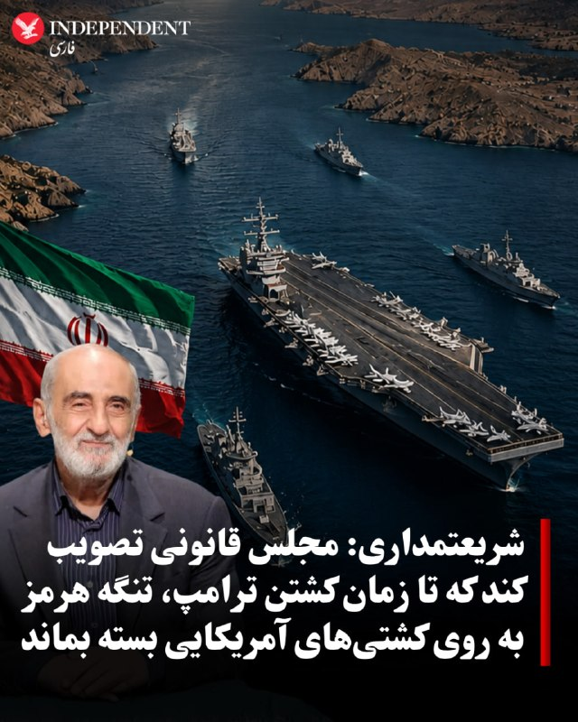

♦️حسین شریعتمداری، مدیرمسئول روزنامه کیهان، در یادداشتی خواستار تصویب قانونی در مجلس جمهوری اسلامی شد که بر اساس آن، تنگه هرمز تا زمان «کشته‌شدن دونالد ترامپ» به روی شناورهای آمریکایی و متحدان واشنگتن بسته بماند.

 او همچنین پیشنهاد کرد از تمامی شناورها «حق عبور» دریافت شود و شناورهای متعلق به اسرائیل یا حامل کالا و نفت برای این کشور نیز تا «محو کامل اسرائیل از جغرافیای جهان» مصادره شوند.
‌🇸🇦 Indypersian

🤖 @VahidOOnLine

## VahidOOnLine — post 241287

  

صنایع هوافضای اسرائیل در گزارش مالی سه‌ماهه نخست سال ۲۰۲۶ از ثبت رکوردهای تازه در فروش، سود خالص و حجم سفارش‌ها خبر داد. این آمار تحت تاثیر افزایش تقاضا برای سامانه‌های دفاعی، به‌ویژه پس از درگیری با جمهوری اسلامی، بوده است.

بر اساس گزارش مالی صنایع هوافضای اسرائیل که شامگاه چهارشنبه منتشر شد، فروش این شرکت در سه‌ماهه نخست سال ۲۰۲۶ از مرز دو میلیارد دلار گذشت و سود خالص آن حدود ۳۴ درصد افزایش یافت. همچنین حجم سفارش‌های ثبت‌شده این شرکت به حدود ۳۳ میلیارد دلار رسید؛ رقمی که بالاترین سطح در تاریخ صنایع هوافضای اسرائیل توصیف شده و معادل حدود چهار سال و نیم فعالیت این شرکت است.
‌🏁 🇬🇧 IranintlTV

🤖 @VahidOOnLine

## VahidOOnLine — post 241286

  <a href="telegram/content/VahidOOnLine_241286_1779350436.mp4" target="_blank">🎬 Download video</a>

⭕️ثبت تصاویر کم‌نظیر از عبور هم‌زمان دو پلنگ ایرانی در جنگل‌های هیرکانی

♦️معاون اداره‌کل محیط‌زیست گیلان روز پنجشنبه ۳۱ اردیبهشت اعلام کرد دوربین‌های تله‌ای نصب‌شده در جنگل‌های هیرکانی، تصاویر کم‌نظیر و ارزشمندی از عبور هم‌زمان دو پلنگ را در فاصله زمانی کوتاه ثبت کرده‌اند.

 به گفته مقام‌های محیط‌زیست، ثبت این تصاویر نشانه‌ای مهم از پویایی زیستگاه و ادامه حضور گونه‌های شاخص حیات‌ وحش در جنگل‌های هیرکانی به شمار می‌رود.

پلنگ ایرانی از گونه‌های در معرض تهدید محسوب می‌شود و جنگل‌های هیرکانی یکی از زیستگاه‌های اصلی آن هستند.
‌🇸🇦 Indypersian

🤖 @VahidOOnLine

## VahidOOnLine — post 241285

  <a href="telegram/content/VahidOOnLine_241285_1779350438.mp4" target="_blank">🎬 Download video</a>

♦️محسن نقوی، وزیرکشور پاکستان که برای دومین بار در یک هفته اخیر به تهران سفر کرده است، با عباس عراقچی، زیر امور خارجه جمهوری اسلامی دیدار کرد.
پیش از این، اسماعیل بقایی، سخنگوی وزارت امورخارجه اعلام کرده بود سفر محسن نقوی، وزیر کشور پاکستان به ایران، با هدف «تسهیل تبادل پیام‌ها و ارائه توضیحات تکمیلی برای شفاف‌سازی متن‌های ارسالی میان طرفین» انجام شده است.
همزمان، خبرگزاری ایسنا گزارش کرد فیلد مارشال، عاصم منیر، فرمانده ارتش پاکستان روز پنجشنبه ۳۱ اردیبهشت ماه به تهران سفر می‌کند.
‌🇸🇦 Indypersian

🤖 @VahidOOnLine

## VahidOOnLine — post 241284

  <a href="telegram/content/VahidOOnLine_241284_1779350440.mp4" target="_blank">🎬 Download video</a>

رسانه‌های اسرائیل به نقل از سی‌ان‌ان گزارش دادند تماس تلفنی اخیر دونالد ترامپ و بنیامین نتانیاهو درباره ایران، «پرتنش» بوده است. بر اساس این گزارش، نتانیاهو خواهان ازسرگیری حملات به ایران شده اما ترامپ خواستار زمان بیشتر برای ادامه دیپلماسی بوده است.
به گزارش رسانه‌های اسرائیل، نتانیاهو گفته تعلل آمریکا به سود ایران است، در حالی که ترامپ تأکید کرده ترجیح می‌دهد فرصت بیشتری به مسیر دیپلماتیک داده شود.
همزمان، وال‌استریت ژورنال گزارش داد اسرائیل نسبت به پایبندی جمهوری اسلامی به هرگونه توافق هسته‌ای تردید دارد و مقام‌های اسرائیلی از آنچه «وقت‌کشی دیپلماتیک ایران» می‌خوانند ابراز نارضایتی کرده‌اند.

دو طرف است
‌🏁 🇬🇧 ManotoTV

🤖 @VahidOOnLine

## VahidOOnLine — post 241283

  <a href="telegram/content/VahidOOnLine_241283_1779350440.mp4" target="_blank">🎬 Download video</a>

روزنامه تلگراف در گزارشی به واحد مخفی دلفین‌های نیروی دریایی آمریکا پرداخت؛ واحدی که از دوران جنگ سرد برای شناسایی مین‌های دریایی و کمک به عملیات مین‌روبی ایجاد شده است.
بر اساس این گزارش، دلفین‌های پوزه‌بطری با استفاده از توانایی مکان‌یابی صوتی، مین‌ها و اجسام زیر آب را با دقت بالا شناسایی کرده و محل آن‌ها را به نیروهای نظامی اطلاع می‌دهند تا به‌صورت ایمن خنثی شوند.
تلگراف تأکید کرده این دلفین‌ها برای منفجر کردن مین‌ها آموزش نمی‌بینند، بلکه وظیفه آن‌ها شناسایی تهدیدها و کمک به باز نگه داشتن مسیرهای دریایی است.
این گزارش همزمان با افزایش تنش‌ها در تنگه هرمز منتشر شده و به نقش احتمالی این واحد ویژه در تأمین امنیت کشتیرانی در من اشاره می‌کند.
‌🏁 🇬🇧 ManotoTV

🤖 @VahidOOnLine

## VahidOOnLine — post 241282

  <a href="telegram/content/VahidOOnLine_241282_1779350441.mp4" target="_blank">🎬 Download video</a>

دومین زمین‌لرزه در کمتر از ۱۰ ساعت گذشته، دریای خزر در حوالی شهرستان مرزی آستارا را لرزاند. بنا بر گزارش رسانه‌های داخلی، این زمین‌لرزه ۳.۸ ریشتر قدرت داشته است.
هنوز گزارشی از خسارات احتمالی یا تلفات منتشر نشده است.
‌🏁 🇬🇧 ManotoTV

🤖 @VahidOOnLine

## VahidOOnLine — post 241281

  <a href="telegram/content/VahidOOnLine_241281_1779350441.mp4" target="_blank">🎬 Download video</a>

وب‌سایت وای‌نت به نقل از یک مقام ارشد اسرائیلی گزارش داد که «جنگ بعدی با ایران، آخرین جنگ نخواهد بود» و تا زمانی که جمهوری اسلامی در قدرت باشد، احتمال تکرار درگیری‌ها وجود دارد.
این مقام گفته است باید «انتظارات عمومی بازتنظیم شود» زیرا حتی در صورت حمله‌ای دیگر، تهدیدها علیه اسرائیل پایان نخواهد یافت. به گفته او، در صورت ادامه وضعیت کنونی، ممکن است درگیری‌ها هر سال یا حتی در بازه‌های کوتاه‌تر تکرار شوند.
این مقام اسرائیلی همچنین مدعی شد هدف از این سیاست، مهار تهدید هسته‌ای و برنامه موشک‌های بالستیک ایران علیه موجودیت اسراییل است.
‌🏁 🇬🇧 ManotoTV

🤖 @VahidOOnLine

## VahidOOnLine — post 241280

  <a href="telegram/content/VahidOOnLine_241280_1779350442.mp4" target="_blank">🎬 Download video</a>

♦️ویدیویی از حمایت چند دختر محجبه از جمهوری اسلامی در جریان یک تجمع حکومتی در ایران، در شبکه‌های اجتماعی مورد توجه قرار گرفته است.

در این ویدیو، دختران و زنان جوانی که خود را اتباع عمان، سنگال، غنا، کنیا، بورکینافاسو، ساحل عاج، نیجریه، تانزانیا و مالی معرفی می‌کنند، با دادن شعارهایی به زبان فارسی از جمهوری اسلامی حمایت می‌کنند.
‌🇸🇦 Indypersian

🤖 @VahidOOnLine

## VahidOOnLine — post 241279

  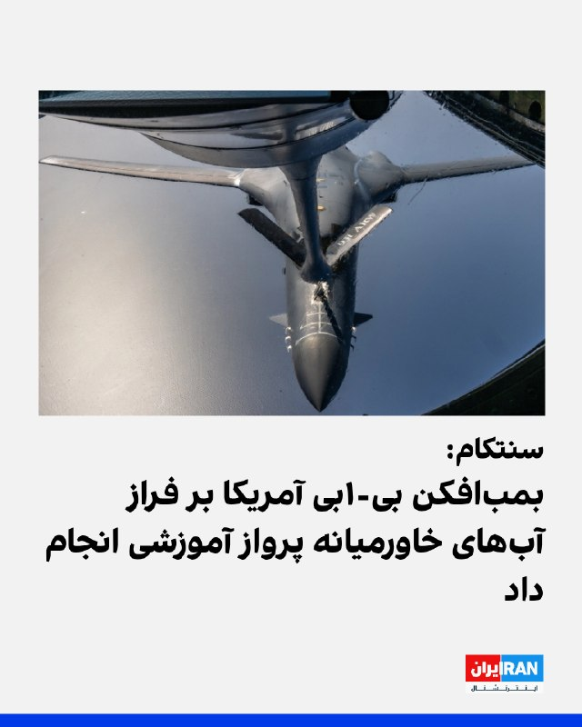

سنتکام با انتشار تصویری نوشت که یک فروند بمب‌افکن «بی-۱بی لنسر» نیروی هوایی آمریکا در جریان یک پرواز آموزشی بر فراز آب‌های منطقه‌ای در خاورمیانه، از یک هواپیمای سوخت‌رسان «کی‌سی-۱۳۵ استراتوتنکر» سوخت‌گیری هوایی کرد.
‌🏁 🇬🇧 IranintlTV

🤖 @VahidOOnLine

## VahidOOnLine — post 241278

  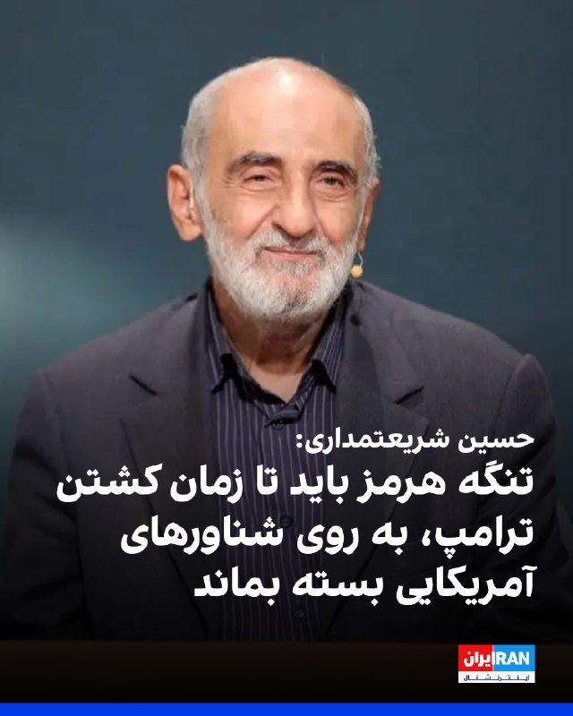

حسین شریعتمداری، نماینده رهبر جمهوری اسلامی در روزنامه کیهان، در یادداشتی خواستار تصویب قانونی از سوی مجلس جمهوری اسلامی شد که بر اساس آن تنگه هرمز تا زمان کشتن دونالد ترامپ، رییس‌جمهوری آمریکا، بر روی شناورهای آمریکایی و متحدان این کشور بسته بماند.

شریعتمداری در این یادداشت همچنین خواهان «دریافت حق عبور (ترانزیت) از تمامی شناورها بدون استثناء» شد.

نماینده رهبر جمهوری اسلامی در روزنامه کیهان، همچنین خواستار تصویب قانونی شد که بر اساس آن، تمام شناورهای متعلق به اسرائیل و یا حامل نفت و کالا برای این کشور تا «محو کامل آن از جغرافیای جهان»، مصادره شود.
‌🏁 🇬🇧 IranintlTV

🤖 @VahidOOnLine

## VahidOOnLine — post 241277

  

حسین شریعتمداری، نماینده رهبر جمهوری اسلامی در روزنامه کیهان، در یادداشتی خواستار تصویب قانونی از سوی مجلس جمهوری اسلامی شد که بر اساس آن تنگه هرمز تا زمان کشتن دونالد ترامپ، رییس‌جمهوری آمریکا، بر روی شناورهای آمریکایی و متحدان این کشور بسته بماند.

شریعتمداری در این یادداشت همچنین خواهان «دریافت حق عبور (ترانزیت) از تمامی شناورها بدون استثناء» شد.

نماینده رهبر جمهوری اسلامی در روزنامه کیهان، همچنین خواستار تصویب قانونی شد که بر اساس آن، تمام شناورهای متعلق به اسرائیل و یا حامل نفت و کالا برای این کشور تا «محو کامل آن از جغرافیای جهان»، مصادره شود.
‌🏁 🇬🇧 IranintlTV

🤖 @VahidOOnLine

## VahidOOnLine — post 241276

  <a href="telegram/content/VahidOOnLine_241276_1779350445.mp4" target="_blank">🎬 Download video</a>

⭕️ترامپ: درباره بسته تسلیحاتی با رئیس‌جمهوری تایوان گفت‌وگو خواهم کرد

♦️دونالد ترامپ روز پنجشنبه ۳۱ اردیبهشت اعلام کرد با لای چینگ‌ته، رئیس‌جمهوری تایوان، درباره موضوع فروش تسلیحات به این کشور گفتگو خواهد کرد.

ترامپ یک هفته پس از سفر به چین و در حالی‌که تایوان از احتمال کاهش حمایت‌های آمریکا ابراز نگرانی کرده است، گفت: «با او صحبت خواهم کرد. من با همه صحبت می‌کنم. اوضاع را کاملا تحت کنترل داریم.»

رئیس جمهوری آمریکا با اشاره به دیدار اخیر خود با شی‌ جین‌پینگ در پکن افزود: «دیدار فوق‌العاده‌ای با رئیس‌جمهور شی داشتیم؛ واقعا شگفت‌انگیز بود. روی مسئله تایوان کار خواهیم کرد.»

 این اظهارات در حالی مطرح می‌شود که کاخ سفید در حال بررسی بسته جدید فروش تسلیحات به تایوان است؛ موضوعی که یکی از محورهای اصلی تنش میان آمریکا و چین محسوب می‌شود.
‌🇸🇦 Indypersian

🤖 @VahidOOnLine

## VahidOOnLine — post 241275

  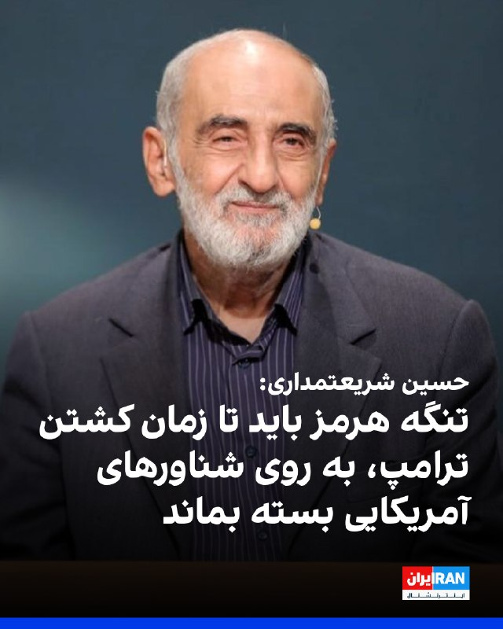

حسین شریعتمداری، مدیرمسئول روزنامه کیهان، در یادداشتی خواستار تصویب قانونی از سوی مجلس جمهوری اسلامی شد که بر اساس آن تنگه هرمز تا زمان کشتن دونالد ترامپ، رییس‌جمهوری آمریکا، بر روی شناورهای آمریکایی و متحدان این کشور بسته بماند.

شریعتمداری در این یادداشت همچنین خواهان «دریافت حق عبور (ترانزیت) از تمامی شناورها بدون استثناء» شد.

نماینده رهبر کشته شده جمهوری اسلامی در موسسه کیهان، همچنین خواستار تصویب قانونی شد که بر اساس آن، تمام شناورهای متعلق به اسرائیل و یا حامل نفت و کالا برای این کشور تا «محو کامل آن از جغرافیای جهان»، مصادره شود.
‌🏁 🇬🇧 IranintlTV

🤖 @VahidOOnLine

## VahidOOnLine — post 241274

  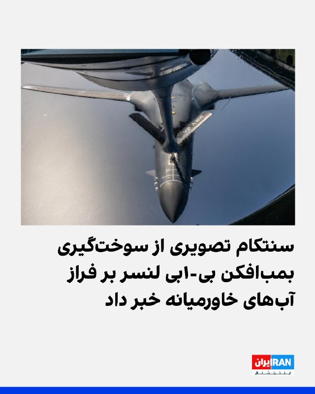

سنتکام، فرماندهی مرکزی ایالات متحده، تصویری از سوخت‌گیری یک فروند بمب‌افکن بی-۱بی لنسر نیروی هوایی آمریکا در جریان یک پرواز آموزشی بر فراز آب‌های منطقه‌ای در خاورمیانه، از یک فروند هواپیمای سوخت‌رسان کی‌سی-۱۳۵ استراتوتانکر منتشر کرد.
‌🏁 🇬🇧 IranintlTV

🤖 @VahidOOnLine

## VahidOOnLine — post 241273

  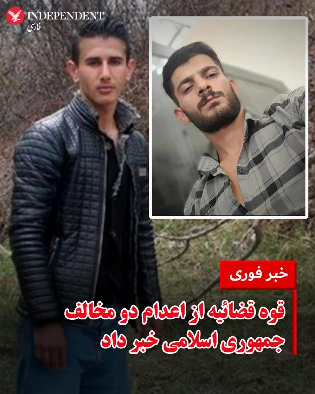

♦️خبرگزاری میزان، وابسته به قوه قضائیه، صبح پنجشنبه ۳۱ اردیبهشت ماه، از اجرای حکم اعدام دو زندانی سیاسی کرد به نام‌های رامین زله و کریم معروف‌پور خبر داد.
به گزارش میزان، این دو نفر به جرم «تشکیل گروه با هدف برهم زدن امنیت کشور، قیام مسلحانه از طریق تشکیل گروه‌های مجرمانه، تیراندازی و اقدام به ترور در راستای اهداف گروهک تروریستی» اعدام شدند.
به نوشته میزان، رامین زله، «در اعترافات خود بیان کرده برای ترور فرمانده پایگاه سپاه یکی از شهرستان‌های غرب کشور با افرادی از جمله کریم معروف‌پور همکاری داشته است.»
جمهوری اسلامی از زمان آغاز جنگ روند اعدام مخالفان سیاسی را تشدید کرده است. گزارشگر ویژه حقوق بشر سازمان ملل ماه گذشته اعلام کرد دست‌کم ۲۱ نفر تنها در ماه مارس به‌اتهام ارتکاب جرایم امنیتی و سیاسی اعدام شده‌اند.
‌🇸🇦 Indypersian

🤖 @VahidOOnLine

## VahidOOnLine — post 241272

  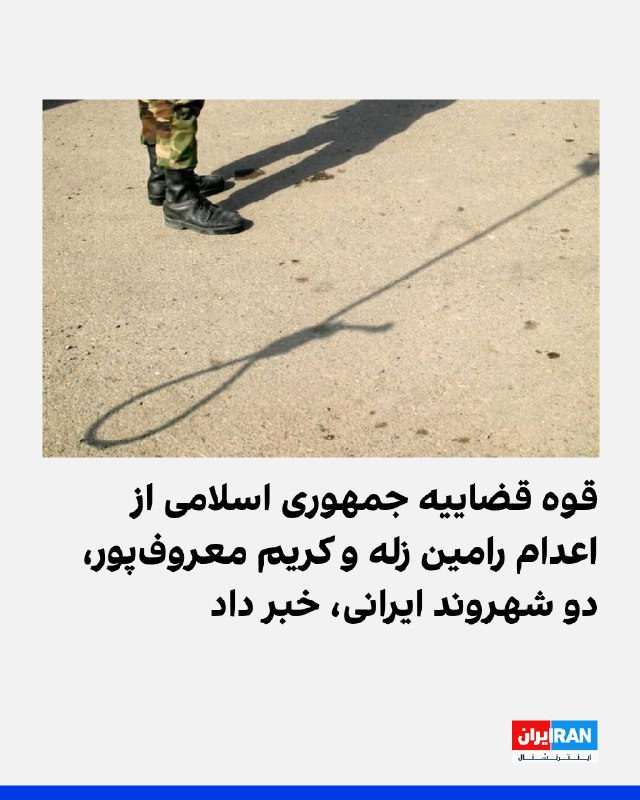

خبرگزاری میزان، رسانه قوه قضاییه جمهوری اسلامی، اعلام کرد رامین زله و کریم معروف‌پور، دو شهروند ایرانی، به اتهام «تشکیل گروه با هدف برهم زدن امنیت کشور»، صبح پنجشنبه، ۳۱ اردیبهشت ۱۴۰۵، اعدام شدند.

رامین زله در مرداد ۱۴۰۳ و کریم معروف‌پور در فروردین ۱۴۰۰ بازداشت شده بودند.
‌🏁 🇬🇧 IranintlTV

🤖 @VahidOOnLine

## VahidOOnLine — post 241271

  

♦️ایلان ماسک روز چهارشنبه برنامه عرضه عمومی سهام شرکت اسپیس‌ایکس را اعلام کرد؛ اقدامی که می‌تواند این شرکت فضایی را به نخستین شرکتی با ارزش بیش از یک تریلیون دلار در زمان ورود به بازار بورس تبدیل کند.

به گزارش رویترز بخش عمده ارزش‌گذاری اسپیس‌ایکس برطرح‌هایی استوار است که هنوز به‌طور کامل شکل نگرفته‌اند؛ از جمله ماموریت‌های مریخ و مراکز داده هوش مصنوعی در فضا. در حال حاضر، تنها بخش اینترنت ماهواره‌ای «استارلینک» سودده است و در سه‌ماهه نخست سال حدود ۱.۲ میلیارد دلار سود عملیاتی ثبت کرده، اما شرکت در مجموع نزدیک به دو میلیارد دلار زیان عملیاتی داشته است.

اسپیس‌ایکس قصد دارد از اواسط ژوئن (اواخر خرداد) وارد بازار بورس شود. تحلیلگران می‌گویند این عرضه می‌تواند ایلان ماسک را به نخستین تریلیونر جهان تبدیل کند؛ هرچند بخشی از پاداش‌های او به تحقق اهدافی بلندپروازانه مانند ایجاد پایگاه دائمی انسان در مریخ وابسته شده است.
‌🇸🇦 Indypersian

🤖 @VahidOOnLine

## VahidOOnLine — post 241270

  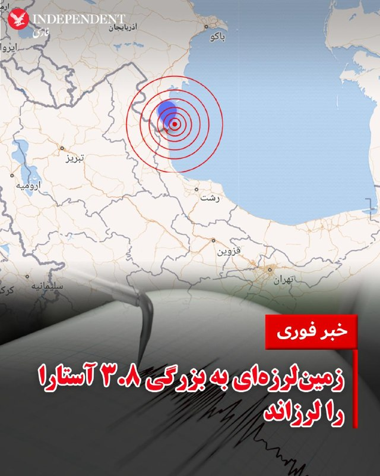

♦️خبرگزاری مهر، صبح پنجشنبه ۳۱ اردیبهشت ماه، از وقوع زمین‌لرزه‌ای به بزرگی ۳.۸ در دریای خزر حوالی شهر آستارا خبر داد. به گزارش مهر، شهر آستارا در استان گیلان «برای دومین بار طی ۱۰ ساعت گذشته» لرزیده‌ است. عمق این زمین‌لرزه ۱۸ کیلومتر اعلام شده است.
‌🇸🇦 Indypersian

🤖 @VahidOOnLine

## VahidOOnLine — post 241269

  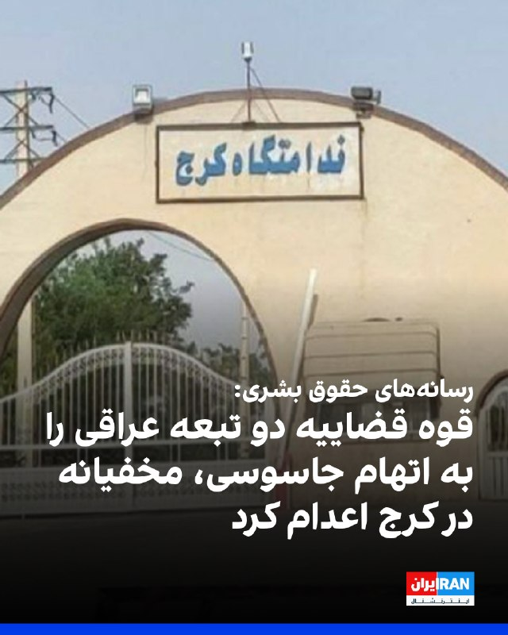

به گزارش رسانه‌های حقوق بشری، جمهوری اسلامی سحرگاه روز دوشنبه ۱۷ فروردین، دو زندانی تبعه عراق به‌نام‌های علی نادر العبیدی، ۲۷ ساله و فاضل شیخ کریم، ۲۹ ساله را به اتهام «جاسوسی» به صورت مخفیانه در زندان مرکزی کرج اعدام کرد.
به گزارش سازمان حقوق بشر ایران، هر دو زندانی از شهروندان عرب و اهل شهر عماره عراق بودند.
طبق گزارش هه‌نگاو به نقل از منابع آگاه، ماموران اداره اطلاعات سال گذشته این دو شهروند عراقی را در شهر کرج بازداشت کردند و یکی از شعبه‌های دادگاه انقلاب آنها را به اتهام جاسوسی به اعدام محکوم کرد.
طبق گزارش هه‌نگاو، این دو زندانی به مدت ۱۱ ماه در بازداشتگاه اداره اطلاعات و اطلاعات سپاه تحت شکنجه قرار داشتند و مدتی قبل از اجرای حکم به زندان مرکزی کرج منتقل شده بودند.
هنوز اجرای حکم اعدام این دو شهروند عراقی از سوی رسانه‌های داخلی ایران و یا نهادهای رسمی قوه قضاییه و همچنین کشور عراق اعلام نشده است.
با اعدام علی نادر العبیدی و فاضل شیخ کریم، شمار زندانیانی که از زمان آغاز جنگ اخیر با اتهام‌های مرتبط با جاسوسی اعدام شده‌اند، به دست‌کم هشت نفر رسید.

‌🏁 🇬🇧 IranintlTV

🤖 @VahidOOnLine

## WithYashar — post 11814

ادعای یدیعوت آحارانوت به نقل از یک مقام امنیتی اسرئیل:

ما ممکن است جنگ‌هایی را با سرعت بیشتری علیه ایران آغاز کنیم تا برنامه هسته‌ای و موشک‌هایش تهدیدی ایجاد نکند.
@withyashar

## WithYashar — post 11813

سید محسن نقوی وزیر کشور پاکستان با سید عباس عراقچی وزیر امور خارجه دیدار و گفت‌وگو کرد.
@withyashar
پاکستانی ها از‌ عمانی ها هم پیگیر ترن ، پلنگ مارو ول کرد تو ما رو ول نکردی !!!

## WithYashar — post 11811

سازمان هواشناسی: امروز برای استانهای شمال غرب ، مناطقی در غرب ، دامنه های البرز ، شمال و شمال شرق کشور در برخی ساعات بارندگی ، رعد و برق و وزش باد شدید پیش بینی می شود.
@withyashar
هوا هنوز مساعد حمله چکشی نیست

## WithYashar — post 11810

خبرگزاری نور: سخنگوی وزارت خارجه ایران، بقائی، گزارش داد که پاسخ ایالات متحده به طرح ۱۴ نقطه‌ای خود را دریافت کرده‌اند و در حال بررسی آن هستند.
«بر اساس همان متن اولیه ۱۴ نقطه‌ای از ایران، تبادل پیام‌ها چندین بار انجام شده است و ما دیدگاه‌های طرف آمریکایی را دریافت کرده‌ایم و در حال حاضر در حال بررسی آن‌ها هستیم.»
@withyashar

## WithYashar — post 11809

  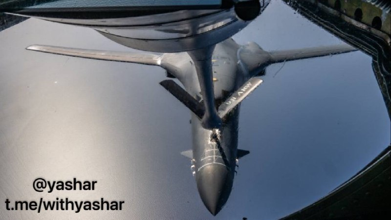

سنتکام با انتشار این عکس تایید کرد : یک بمب‌افکن B-1B لنسر متعلق به نیروی هوایی آمریکا، در جریان یک پرواز آموزشی بر فراز آب‌های منطقه‌ای خاورمیانه، از یک هواپیمای سوخت‌رسان KC-135 استراتوتنکر سوخت‌گیری کرد.
@withyashar
در این ویدیو اتاق جنگ چند روز پیشاین هواپیما رو رهگیری کردیم …

https://www.instagram.com/reel/DYQCr39RJ4i/?igsh=MThycjJiYWZmbnJ3dA==

## WithYashar — post 11808

رایزنی‌های مصر، عربستان و قطر درباره آخرین تحولات مذاکرات تهران-واشنگتن

وزیر خارجه مصر با همتایان سعودی و قطری خود درباره آخرین تحولات مربوط به مذاکرت تهران-واشنگتن گفت‌وگو و تاکید کرد که استمرار این مذاکرات اهمیت داشته و در هر توافقی در آینده حاصل می‌شود، باید دغدغه‌های امنیتی کشورهای منطقه در نظر گرفته شوند.
@withyashar

## WithYashar — post 11807

  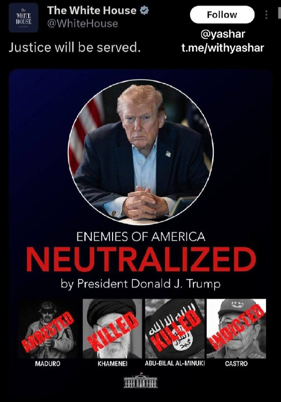

حساب رسمی کاخ سفید تصویری از ترامپ منتشر کرد که زیر آن، خامنه‌ای و یکی از رهبران داعش با برچسب «کشته‌شده»، مادورو با برچسب «بازداشت‌شده» و کاسترو با برچسب «تحت پیگرد» دیده می‌شن.

کاخ سفید در این پست نوشت: «عدالت اجرا خواهد شد.»

@withyashar

## mwarmonitor — post 9396

  

✈️⛽️ یک دسته از تانکرهای سوخت‌رسان نیروی هوایی آمریکا از پایگاه هوایی Lajes Field به پرواز درآمده‌اند؛ این هواپیماها در حال سوخت‌رسانی به جنگنده‌ها هستند و احتمالاً به سمت پایگاه‌های آمریکا در خاورمیانه حرکت می‌کنند. 🔸پایگاه هوایی Lajes Field در جزایر آزور…

## mwarmonitor — post 9394

  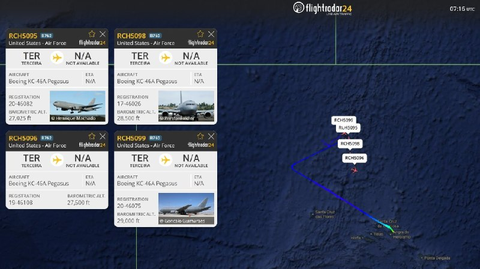

✈️⛽️ یک دسته از تانکرهای سوخت‌رسان نیروی هوایی آمریکا از پایگاه هوایی Lajes Field به پرواز درآمده‌اند؛ این هواپیماها در حال سوخت‌رسانی به جنگنده‌ها هستند و احتمالاً به سمت پایگاه‌های آمریکا در خاورمیانه حرکت می‌کنند.

🔸پایگاه هوایی Lajes Field در جزایر آزور (میان اقیانوس اطلس) قرار دارد و متعلق به پرتغال است.
این پایگاه روی جزیره ترسیرا (Terceira) واقع شده و یکی از نقاط راهبردی هوایی میان آمریکا، اروپا و غرب آسیاست.

@mwarmonitor

## mwarmonitor — post 9393

🔴ترامپ برای ادامه جنگ با ایران، در حال از دست دادن آرای خود در کنگره است

📝نویسندگان: اندرو سولندر، کیت سانتالیز AXIOS

🔰دموکرات‌های مجلس نمایندگان یک قدم دیگر به برگزاری یک رأی‌گیری موفقیت‌آمیز درباره اختیارات جنگی با ایران نزدیک شده‌اند؛ چرا که آخرین مخالف آن‌ها در حزب قصد دارد رأی خود را تغییر دهد و دست‌کم یک نماینده جمهوری‌خواه نیز اعلام کرده که ممکن است اقدام مشابهی انجام دهد.

چرا این موضوع اهمیت دارد؟
اگرچه این رأی‌گیری تا حد زیادی نمادین خواهد بود — زیرا پرزیدنت ترامپ می‌تواند این مصوبه را وتو کند — اما دموکرات‌ها بر این باورند که این اقدام، یک سرزنش و مخالفت جدی و حیاتی علیه این درگیری نظامی خواهد بود.
جیم هایمز (نماینده دموکرات از ایالت کنتیکت) و عضو ارشد کمیته اطلاعات مجلس نمایندگان که یکی از رهبران این طرح است، به اکسیوس گفت که نسبت به شانس تصویب این قطعنامه در روز پنجشنبه «حس بسیار خوبی دارد».
یک نماینده دموکرات ارشد دیگر نیز در پاسخ به این سوال که آیا رهبری حزب به این رأی‌گیری اطمینان دارد یا خیر، به اکسیوس گفت: «بله».
جریان اصلی خبر
جرد گلدن (نماینده دموکرات از ایالت مین)، تنها دموکراتی که پیش از این همواره علیه قطعنامه‌های اختیارات جنگ با ایران رأی داده بود، به اکسیوس گفت که «قصد دارد روز پنجشنبه به این طرح رأی مثبت دهد».
گلدن اشاره کرد که «بیش از ۶۰ روز» از آغاز این درگیری گذشته است؛ بر اساس «قانون اختیارات جنگی»، این دقیقاً همان بازه زمانی است که اگر کنگره اعلام جنگ نکند، رئیس‌جمهور باید عملیات نظامی را متوقف کند.
وی افزود: «دولت می‌تواند به کنگره بیاید و برای دریافت مجوز تلاش کند»، و اضافه کرد که این مصوبه برعکس طرحی که هفته گذشته به رأی گذاشته شد، طرحی «شفاف و بدون حاشیه» است.
نگاه نزدیک‌تر
دان بیکن (نماینده جمهوری‌خواه از ایالت نبراسکا)، یک میانه‌روی حامی مداخله نظامی که در گذشته به قطعنامه‌های اختیارات جنگ با ایران رأی منفی داده بود، به اکسیوس گفت که ترامپ «برای استفاده از زور به اختیارات بیشتری نیاز دارد» اما با این حال در مورد رأی پیش‌رو «کاملاً مردد» است.
او گفت: «رأی سختی است، چون ما قانون اساسی و اختیارات ماده یک را داریم. رئیس‌جمهور این طرح را دوست ندارد. مسلماً او ترجیح می‌دهد کنگره را در کنار خود نداشته باشد [تا دستش بازتر باشد].»
بیکن که در پایان امسال بازنشسته می‌شود، بارها از رئیس‌جمهور به دلیل آنچه که سوءاستفاده از قدرت خوانده، انتقاد کرده است.
فلاش‌بک (مرور گذشته)
تلاش دموکرات‌ها برای تصویب قطعنامه اختیارات جنگی در هفته گذشته، در یک رأی‌گیری بی‌سابقه با نتیجه مساوی ۲۱۲ به ۲۱۲ شکست خورد.
در آن رأی‌گیری، گلدن رأی منفی داد، در حالی که نمایندگان جمهوری‌خواه، توماس ماسی (از کنتاکی)، برایان فیتزپاتریک (از پنسیلوانیا) و تام برت (از میشیگان) رأی مثبت دادند.
نیمی از دموکرات‌ها و جمهوری‌خواهان (حدود ۶ نماینده) در آن جلسه غایب بودند، از جمله تام کین جونیور (جمهوری‌خواه از نیوجرسی) و فردریکا ویلسون (دموکرات از فلوریدا) که هر دو چندین هفته است در رأی‌گیری‌ها غایب هستند.

جیم هایمز به اکسیوس گفت: «مثل هر چیز دیگری در این مجلس، همه چیز به غایبان بستگی دارد.»
مجلس نمایندگان ابتدا قرار بود روز چهارشنبه درباره این قطعنامه رأی‌گیری کند، اما رهبری جمهوری‌خواهان به دلیل فاصله اندک آرا، آن را به تعویق انداخت.
بعدازظهر چهارشنبه، ۲۰ نماینده مجلس در رأی‌گیری‌ها حاضر نشدند — ۷ دموکرات و ۱۳ جمهوری‌خواه.

📌گرگ میکس (نماینده دموکرات از نیویورک) و عضو ارشد کمیته امور خارجی مجلس نمایندگان به اکسیوس گفت: «اگر امروز رأی‌گیری می‌شد، قطعنامه تصویب می‌شد؛ به همین دلیل آن را عقب کشیدند.»

@mwarmonitor

## pm_afshaa — post 91144

🔴یدیعوت آحارونوت به نقل از یک مقام امنیتی: باید جنگ‌ها رو سریع‌تر علیه جمهوری اسلامی راه بندازیم تا برنامه هسته‌ای و موشک‌هایشون دیگه تهدیدی نباشن

💧 Rainbet.com the #1 Non-KYC Crypto Casino & Sportsbook @rainbetcom

😁 @Pm_Afshaa

## pm_afshaa — post 91143

🔴میدل ایست آی:سه منبع گفتند که انتظار دارند جنگ در هفته‌های آینده و پس از پایان دوره حج، از سر گرفته شود

💧 Rainbet.com the #1 Non-KYC Crypto Casino & Sportsbook @rainbetcom

😁 @Pm_Afshaa

## pm_afshaa — post 91142

رامین زله و کریم معروف پور از معترضین دی ماه امروز صبح اعدام شدن 
💧 Rainbet.com the #1 Non-KYC Crypto Casino & Sportsbook @rainbetcom 
😁 @Pm_Afshaa

## pm_afshaa — post 91141

  

رامین زله و کریم معروف پور از معترضین دی ماه امروز صبح اعدام شدن

💧 Rainbet.com the #1 Non-KYC Crypto Casino & Sportsbook @rainbetcom

😁 @Pm_Afshaa

## pm_afshaa — post 91140

🔴آکسیوس:نتانیاهو به مذاکرات اعتماد ندارد و معتقد است اسرائیل باید به حمله به ایران ادامه دهد تا نیروی نظامی آن را تضعیف کرده و زیرساخت‌های مهم را آسیب بزند

💧 Rainbet.com the #1 Non-KYC Crypto Casino & Sportsbook @rainbetcom

😁 @Pm_Afshaa

## pm_afshaa — post 91139

🔴یدیعوت آحارونوت: مقامات اسرائیل از اقدامات ترامپ راضی نیستن

💧 Rainbet.com the #1 Non-KYC Crypto Casino & Sportsbook @rainbetcom

😁 @Pm_Afshaa

## VahidOnline — post 75589

  

قوه قضائیه جمهوری اسلامی دو زندانی را به اتهام عضویت در «گروه‌های تروریستی تجزیه‌طلب» و «قیام مسلحانه از طریق تشکیل گروه‌های مجرمانه» اعدام کرد.

ارگان رسمی دستگاه قضایی ایران، میزان، هویت این دو نفر را رامین زله و کریم معروف‌پور معرفی کرده و نوشته که آنها صبح روز پنج‌شنبه، ۳۱ اردیبهشت، اعدام شدند.

میزان نوشته که رامین زله «پس از طی دوره‌های آموزشی از طرف گروهک ماموریت پیدا کرده بود تا در ناآرامی‌های کشور به عنوان لیدر شرکت کند».
ارگان رسمی قوه قضائیه ایران همچنین نوشته که این دو نفر «اعتراف» کرده بودند که «برای ترور فرمانده پایگاه سپاه یکی از شهرستان‌های غرب کشور» با یکدیگر «همکاری» داشته و برای این کار، «سلاح» نگهداری می‌کردند.

از زمان حملات آمریکا و اسرائیل به ایران، جمهوری اسلامی اجرای احکام اعدام را افزایش داده است و در برخی روزها چند نفر را اعدام کرده است.
@VahidHeadline

📡 @VahidOnline

## IranIntlTV — post 338204

  

صنایع هوافضای اسرائیل در گزارش مالی سه‌ماهه نخست سال ۲۰۲۶ از ثبت رکوردهای تازه در فروش، سود خالص و حجم سفارش‌ها خبر داد. این آمار تحت تاثیر افزایش تقاضا برای سامانه‌های دفاعی، به‌ویژه پس از درگیری با جمهوری اسلامی، بوده است.

بر اساس گزارش مالی صنایع هوافضای اسرائیل که شامگاه چهارشنبه منتشر شد، فروش این شرکت در سه‌ماهه نخست سال ۲۰۲۶ از مرز دو میلیارد دلار گذشت و سود خالص آن حدود ۳۴ درصد افزایش یافت. همچنین حجم سفارش‌های ثبت‌شده این شرکت به حدود ۳۳ میلیارد دلار رسید؛ رقمی که بالاترین سطح در تاریخ صنایع هوافضای اسرائیل توصیف شده و معادل حدود چهار سال و نیم فعالیت این شرکت است.
https://iranintl.com/202605219713

## IranIntlTV — post 338203

  

🔻انتشار گزارش‌هایی درباره احتمال ممنوعیت ورود پرچم شیر و خورشید به ورزشگاه‌های میزبان جام جهانی، موجی از واکنش‌ها را میان ایرانیان و فعالان سیاسی ایجاد کرده است. در تازه‌ترین اقدام، یک نهاد مدنی برای مقابله با این تصمیم احتمالی، در مراجع قضایی آمریکا شکایت ثبت کرده است.

🔹اندیشکده «آوای آزادی» شکایتی را علیه فدراسیون بین‌المللی فوتبال، فیفا، در دادگاه فدرال حوزه مرکزی ایالت کالیفرنیا ثبت کرده است. هدف از این اقدام حقوقی، صدور دستور توقف اقدامی است که به جلوگیری فیفا از ورود پرچم شیر و خورشید به ورزشگاه‌های جام جهانی منجر شود.

🔹این اقدام پس از آن صورت گرفت که نشریه اتلتیک در گزارشی نوشت فیفا تحت فشار و به درخواست فدراسیون فوتبال جمهوری اسلامی، قصد دارد مانع ورود پرچم شیر و خورشید به استادیوم‌های محل برگزاری مسابقات شود.

🔹یکی از دغدغه‌های اصلی مقام‌های جمهوری اسلامی، احتمال شکل‌گیری فضای اعتراضی و سر دادن شعارهای ضدحکومتی در جریان این مسابقات است.

🔹جزییات بیشتر را در سایت بخوانید.

@iranintltvsport

## IranIntlTV — post 338202

  <a href="telegram/content/IranIntlTV_338202_1779350455.mp4" target="_blank">🎬 Download video</a>

در حالی که پاکستان نقش میانجی اصلی را در مذاکرات میان واشینگتن و تهران ایفا می‌کند، هم‌زمان به حمایت گسترده نظامی از عربستان سعودی، یکی از رقبای اصلی جمهوری اسلامی، ادامه داده است.
@iranintltv

## IranIntlTV — post 338201

  <a href="telegram/content/IranIntlTV_338201_1779350456.mp4" target="_blank">🎬 Download video</a>

جاویدنامان انقلاب ملی ایرانیان
«محمد گلی»، آتش‌نشان ۴۳ ساله و اهل نجف‌آباد اصفهان، در ۱۸ دی ماه جان خود را فدای مردم معترض کرد. نامش در حافظه‌ این سرزمین می‌ماند و یادش چراغ راه آزادی‌خواهان است.
@iranintltv

## IranIntlTV — post 338200

  <a href="telegram/content/IranIntlTV_338200_1779350458.mp4" target="_blank">🎬 Download video</a>

کانال ۱۲ اسرائیل گزارش داد بنیامین نتانیاهو و دونالد ترامپ در تماسی پرتنش، بر سر طرح میانجی‌ها برای جلوگیری از آغاز دوباره جنگ اختلاف‌نظر داشتند. بر اساس این گزارش، نتانیاهو همچنان خواهان ادامه فشار نظامی بر جمهوری اسلامی است، در حالی که میانجی‌ها از جمله قطر و پاکستان، به‌ دنبال طرحی برای پایان جنگ و آغاز مذاکرات ۳۰ روزه هستند.

ارزیابی بن سبطی، پژوهش‌گر مسائل ایران و اسرائیل
@iranintltv

## IranIntlTV — post 338199

  <a href="telegram/content/IranIntlTV_338199_1779350459.mp4" target="_blank">🎬 Download video</a>

دونالد ترامپ، رییس‌جمهوری آمریکا، گفت با افرادی «منطقی‌تر» در تهران گفت‌وگو کرده و اکنون منتظر دریافت پاسخ جمهوری اسلامی درباره توافق است. ترامپ تاکید کرد اگر این صبر به جلوگیری از جنگ کمک کند، ارزشمند خواهد بود.

گفت‌وگو با حسین علیزاده، تحلیل‌گر مسائل بین‌الملل
@iranintltv

## IranIntlTV — post 338198

  <a href="telegram/content/IranIntlTV_338198_1779350461.mp4" target="_blank">🎬 Download video</a>

گیلا گاملیل، وزیر علوم و فناوری اسرائیل، در گفت‌وگو با بابک اسحاقی، خبرنگار ایران‌اینترنشنال، گفت جمهوری اسلامی به‌جای تمرکز بر معیشت مردم، به تامین مالی گروه‌های تروریستی می‌پردازد. او افزود حکومت ایران هر روز در حال تضعیف است و او می‌داند که «این حکومت شر در آخر از بین خواهد رفت».
@iranintltv

## IranIntlTV — post 338197

  <a href="telegram/content/IranIntlTV_338197_1779350462.mp4" target="_blank">🎬 Download video</a>

۲۱ ماه می، روز جهانی تنوع فرهنگی است. بسیاری از خانواده‌های مهاجر افغان نگران‌اند فرزندانشان به‌تدریج از زبان و هویت فرهنگی خود فاصله بگیرند. در این میان، شماری از فعالان فرهنگی تلاش می‌کنند پیوند نسل تازه را با فرهنگ افغانستان حفظ کنند.

نبی قانع‌زاده، آموزگار و فعال فرهنگی در فنلاند، یکی از همین افراد است.
@iranintltv

## IranIntlTV — post 338196

  

سنتکام با انتشار تصویری نوشت که یک فروند بمب‌افکن «بی-۱بی لنسر» نیروی هوایی آمریکا در جریان یک پرواز آموزشی بر فراز آب‌های منطقه‌ای در خاورمیانه، از یک هواپیمای سوخت‌رسان «کی‌سی-۱۳۵ استراتوتنکر» سوخت‌گیری هوایی کرد.
https://iranintl.com/202605216479

## IranIntlTV — post 338195

  <a href="https://t.me/IranintlTV/338195" target="_blank">📎 Download file</a>

🎧نسخه صوتی اخبار بامدادی | پنجشنبه ۳۱ اردیبهشت
@iranintlTV

## IranIntlTV — post 338193

  

حسین شریعتمداری، نماینده رهبر جمهوری اسلامی در روزنامه کیهان، در یادداشتی خواستار تصویب قانونی از سوی مجلس جمهوری اسلامی شد که بر اساس آن تنگه هرمز تا زمان کشتن دونالد ترامپ، رییس‌جمهوری آمریکا، بر روی شناورهای آمریکایی و متحدان این کشور بسته بماند.

شریعتمداری در این یادداشت همچنین خواهان «دریافت حق عبور (ترانزیت) از تمامی شناورها بدون استثناء» شد.

نماینده رهبر جمهوری اسلامی در روزنامه کیهان، همچنین خواستار تصویب قانونی شد که بر اساس آن، تمام شناورهای متعلق به اسرائیل و یا حامل نفت و کالا برای این کشور تا «محو کامل آن از جغرافیای جهان»، مصادره شود.
https://iranintl.com/202605218562

## IranIntlTV — post 338191

  <a href="telegram/content/IranIntlTV_338191_1779350465.mp4" target="_blank">🎬 Download video</a>

بر اساس گزارش کانال ۹ استرالیا، نیروهای دفاعی این کشور از یک پایگاه محرمانه در خاورمیانه ده‌ها ماموریت برای ردیابی موشک‌ها و پهپادهای جمهوری اسلامی انجام دادند.

جزییات بیشتر با علیرضا محبی، خبرنگار ایران‌اینترنشنال
@iranintltv

## IranIntlTV — post 338189

  <a href="telegram/content/IranIntlTV_338189_1779350466.mp4" target="_blank">🎬 Download video</a>

رویترز گزارش داد پاکستان حدود ۸ هزار نیروی نظامی به همراه جنگنده‌های جی‌اف ۱۷، پهپاد و سامانه‌های پدافند هوایی اچ‌کیو ۹ ساخت چین را به عربستان سعودی اعزام کرده است.

جواد همدانی، خبرنگار ایران‌اینترنشنال، گزارش می‌دهد
@iranintltv

## IranIntlTV — post 338188

  <a href="telegram/content/IranIntlTV_338188_1779350467.mp4" target="_blank">🎬 Download video</a>

دونالد ترامپ، رییس‌جمهوری آمریکا، در گفت‌وگو با خبرنگاران گفت آمریکا در حال کمک به مردم کوبا و «آزاد کردن» این کشور است.

گفت‌وگو با امید معماریان، تحلیل‌گر سیاسی
@iranintltv

## IranIntlTV — post 338187

  <a href="telegram/content/IranIntlTV_338187_1779350468.mp4" target="_blank">🎬 Download video</a>

مصطفی دانشگر، تحلیل‌گر سیاسی، گفت دونالد ترامپ تا زمانی تهدیدهایش را به تعویق می‌اندازد که محاصره دریایی برای دستیابی به اهداف آمریکا کارآیی داشته باشد و چندصدایی در راس قدرت جمهوری اسلامی، واشینگتن را به تحقق اهدافش نردیک‌تر کند.
@iranintltv

## IranIntlTV — post 338186

  

خبرگزاری میزان، رسانه قوه قضاییه جمهوری اسلامی، اعلام کرد رامین زله و کریم معروف‌پور، دو شهروند ایرانی، به اتهام «تشکیل گروه با هدف برهم زدن امنیت کشور»، صبح پنجشنبه، ۳۱ اردیبهشت ۱۴۰۵، اعدام شدند.

رامین زله در مرداد ۱۴۰۳ و کریم معروف‌پور در فروردین ۱۴۰۰ بازداشت شده بودند.
https://iranintl.com/202605215737

## IranIntlTV — post 338185

  <a href="telegram/content/IranIntlTV_338185_1779350471.mp4" target="_blank">🎬 Download video</a>

سرخط خبرهای پنجشنبه ۳۱ اردیبهشت
@iranintltv

## IranIntlTV — post 338184

  

به گزارش رسانه‌های حقوق بشری، جمهوری اسلامی سحرگاه روز دوشنبه ۱۷ فروردین، دو زندانی تبعه عراق به‌نام‌های علی نادر العبیدی، ۲۷ ساله و فاضل شیخ کریم، ۲۹ ساله را به اتهام «جاسوسی» به صورت مخفیانه در زندان مرکزی کرج اعدام کرد.
به گزارش سازمان حقوق بشر ایران، هر دو زندانی از شهروندان عرب و اهل شهر عماره عراق بودند.
طبق گزارش هه‌نگاو به نقل از منابع آگاه، ماموران اداره اطلاعات سال گذشته این دو شهروند عراقی را در شهر کرج بازداشت کردند و یکی از شعبه‌های دادگاه انقلاب آنها را به اتهام جاسوسی به اعدام محکوم کرد.
طبق گزارش هه‌نگاو، این دو زندانی به مدت ۱۱ ماه در بازداشتگاه اداره اطلاعات و اطلاعات سپاه تحت شکنجه قرار داشتند و مدتی قبل از اجرای حکم به زندان مرکزی کرج منتقل شده بودند.
هنوز اجرای حکم اعدام این دو شهروند عراقی از سوی رسانه‌های داخلی ایران و یا نهادهای رسمی قوه قضاییه و همچنین کشور عراق اعلام نشده است.
با اعدام علی نادر العبیدی و فاضل شیخ کریم، شمار زندانیانی که از زمان آغاز جنگ اخیر با اتهام‌های مرتبط با جاسوسی اعدام شده‌اند، به دست‌کم هشت نفر رسید.

https://iranintl.com/202605215092

## IranIntlTV — post 338183

  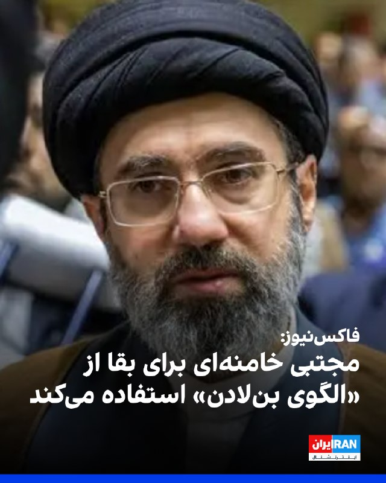

فاکس‌نیوز در گزارشی در مصاحبه با عمر محمد، کارشناس مبارزه با تروریسم، با اشاره به اینکه مجتبی خامنه‌ای نزدیک به سه ماه است که در مخفیگاه به سر می‌برد، نوشت این سبک زندگی یادآور سال‌های پایانی زندگی اسامه بن‌لادن، رهبر پیشین القاعده، است.
این کارشناس مبارزه با تروریسم به فاکس نیوز گفت: «آمریکا رهبر جمهوری اسلامی را به همان سطح از ناپدید شدن عملیاتی کشانده که بن‌لادن ۱۰ سال در ابوت‌آباد با آن زندگی کرد.»
او گفت: «بن‌لادن در ابوت‌آباد بدون هیچ ارتباط مخابراتی زندگی می‌کرد و ارتباطاتش فقط به‌صورت دستی و از طریق دو پیک مورد اعتماد انجام می‌شد.»
به گفته محمد، درسی که تهران از ابوت‌آباد گرفته این است که امن‌ترین مخفیگاه الزاماً غارهای دورافتاده نیست، بلکه یک مجتمع دیوارکشی‌شده در یک شهر نظامی است.
این کارشناس مبارزه با تروریسم افزود بن‌لادن تنها حدود یک کیلومتر با مهم‌ترین آکادمی نظامی پاکستان فاصله داشت و پشت دیوارهای بلند پنهان بود. به باور او، نمونه مشابه در ایران می‌تواند سایت‌های مستحکم زیرزمینی در کنار تاسیسات سپاه باشد.

https://iranintl.com/202605215168

## IranIntlTV — post 338182

  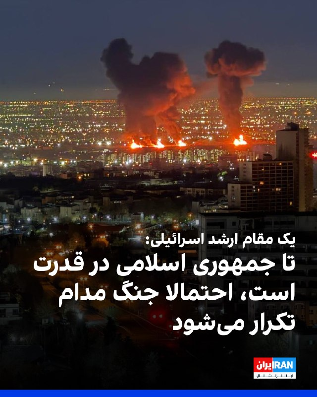

وای‌نت به نقل از یک مقام ارشد اسرائیلی گزارش داد جنگ بعدی با جمهوری اسلامی آخرین جنگ نخواهد بود و تا زمانی که حکومت ایران در قدرت باقی بماند، احتمال تکرار درگیری‌ها در هر سال و یا بیشتر وجود دارد.
این مقام اسرائیلی تاکید کرد که باید انتظارات عمومی در این مورد را «بازتنظیم» کرد.
این مقام ارشد اسرائیلی گفت درگیری‌ها به طور مکرر ادامه پیدا خواهد کرد، تا اطمینان حاصل شود که تهدید هسته‌ای و موشک‌های بالستیک، موجودیت کشور اسرائیل را به خطر نمی‌اندازد.

https://iranintl.com/202605211464

## ManotoTV — post 105710

  <a href="telegram/content/ManotoTV_105710_1779350473.mp4" target="_blank">🎬 Download video</a>

رسانه‌های اسرائیل به نقل از سی‌ان‌ان گزارش دادند تماس تلفنی اخیر دونالد ترامپ و بنیامین نتانیاهو درباره ایران، «پرتنش» بوده است. بر اساس این گزارش، نتانیاهو خواهان ازسرگیری حملات به ایران شده اما ترامپ خواستار زمان بیشتر برای ادامه دیپلماسی بوده است.
به گزارش رسانه‌های اسرائیل، نتانیاهو گفته تعلل آمریکا به سود ایران است، در حالی که ترامپ تأکید کرده ترجیح می‌دهد فرصت بیشتری به مسیر دیپلماتیک داده شود.
همزمان، وال‌استریت ژورنال گزارش داد اسرائیل نسبت به پایبندی جمهوری اسلامی به هرگونه توافق هسته‌ای تردید دارد و مقام‌های اسرائیلی از آنچه «وقت‌کشی دیپلماتیک ایران» می‌خوانند ابراز نارضایتی کرده‌اند.

دو طرف است

## ManotoTV — post 105709

  <a href="telegram/content/ManotoTV_105709_1779350474.mp4" target="_blank">🎬 Download video</a>

روزنامه تلگراف در گزارشی به واحد مخفی دلفین‌های نیروی دریایی آمریکا پرداخت؛ واحدی که از دوران جنگ سرد برای شناسایی مین‌های دریایی و کمک به عملیات مین‌روبی ایجاد شده است.
بر اساس این گزارش، دلفین‌های پوزه‌بطری با استفاده از توانایی مکان‌یابی صوتی، مین‌ها و اجسام زیر آب را با دقت بالا شناسایی کرده و محل آن‌ها را به نیروهای نظامی اطلاع می‌دهند تا به‌صورت ایمن خنثی شوند.
تلگراف تأکید کرده این دلفین‌ها برای منفجر کردن مین‌ها آموزش نمی‌بینند، بلکه وظیفه آن‌ها شناسایی تهدیدها و کمک به باز نگه داشتن مسیرهای دریایی است.
این گزارش همزمان با افزایش تنش‌ها در تنگه هرمز منتشر شده و به نقش احتمالی این واحد ویژه در تأمین امنیت کشتیرانی در من اشاره می‌کند.

## ManotoTV — post 105708

  <a href="telegram/content/ManotoTV_105708_1779350474.mp4" target="_blank">🎬 Download video</a>

دومین زمین‌لرزه در کمتر از ۱۰ ساعت گذشته، دریای خزر در حوالی شهرستان مرزی آستارا را لرزاند. بنا بر گزارش رسانه‌های داخلی، این زمین‌لرزه ۳.۸ ریشتر قدرت داشته است.
هنوز گزارشی از خسارات احتمالی یا تلفات منتشر نشده است.

## ManotoTV — post 105707

  <a href="telegram/content/ManotoTV_105707_1779350475.mp4" target="_blank">🎬 Download video</a>

وب‌سایت وای‌نت به نقل از یک مقام ارشد اسرائیلی گزارش داد که «جنگ بعدی با ایران، آخرین جنگ نخواهد بود» و تا زمانی که جمهوری اسلامی در قدرت باشد، احتمال تکرار درگیری‌ها وجود دارد.
این مقام گفته است باید «انتظارات عمومی بازتنظیم شود» زیرا حتی در صورت حمله‌ای دیگر، تهدیدها علیه اسرائیل پایان نخواهد یافت. به گفته او، در صورت ادامه وضعیت کنونی، ممکن است درگیری‌ها هر سال یا حتی در بازه‌های کوتاه‌تر تکرار شوند.
این مقام اسرائیلی همچنین مدعی شد هدف از این سیاست، مهار تهدید هسته‌ای و برنامه موشک‌های بالستیک ایران علیه موجودیت اسراییل است.

## FarsiVOA — post 218277

🔺جهش ۴۰ درصدی فروش خودروهای برقی در خاورمیانه

▪️آژانس بین‌المللی انرژی از جهش ۴۰ درصدی فروش خودروهای برقی در خاورمیانه طی سال ۲۰۲۵ خبر داد.

▪️سال گذشته ۷۵ هزار دستگاه خودرو برقی در خاورمیانه به فروش رفته که نیمی از آنها در امارات و ۴۵ درصد در عربستان و قطر ثبت شده است.

▪️فروش خودروهای برقی در آسیای مرکزی نیز به شدت اوج گرفته و به ۶۰ هزار دستگاه در سال گذشته رسیده است.

▪️بازار ترکیه کماکان صدرنشین فروش خودروهای برقی منطقه است و پارسال ۲۴۰ هزار دستگاه خودرو برقی در این کشور به فروش رسیده که دو برابر سال ۲۰۲۴ است.

⬇️ بیشتر بخوانید:
https://ir.voanews.com/a/8152358.html

## FarsiVOA — post 218276

  

وزارت خارجه مصر اعلام کرد که وزیر خارجه این کشور در دو تماس جداگانه با همتایان قطری و سعودی خود درباره مذاکرات جاری میان تهران و واشنگتن گفت‌وگو کرد.

در بیانیه وزارت خارجه مصر آمده که این تماس‌ها از سوی بدر عبدالعاطی در روز چهارشنبه صورت گرفته است. این بیانیه می‌افزاید: «در این دو تماس، هماهنگی مستمر درباره تحولات شتابان منطقه و تلاش‌های مشترک برای مهار وضعیت کنونی تنش و کاهش تنش مورد بحث قرار گرفت.»

بر اساس این گزارش، عبدالعاطی «از موضع رئیس‌جمهور آمریکا، دونالد ترامپ، در فراهم کردن فرصت برای گفت‌وگو و دیپلماسی به منظور حل اختلافات و جلوگیری از گرفتار شدن منطقه در خطر کشیده شدن به رویارویی‌های گسترده‌تر، قدردانی کرد.»

وزیر خارجه مصر همچنین بر «اهمیت بسیار بالای ادامه مسیر مذاکرات آمریکا - ایران تا دستیابی به توافقی متوازن که منافع همه طرف‌ها را تأمین کند»، تأکید کرد.

او با این حال گفت که «هرگونه توافق باید نگرانی‌های امنیتی کشورهای منطقه، به‌ویژه امنیت و ثبات کشورهای خلیج فارس را مدنظر قرار دهد، زیرا این موضوع یکی از ارکان اساسی امنیت ملی مصر و جهان عرب به شمار می‌رود.»
@FarsiVOA

## FarsiVOA — post 218275

  

رسانه‌های ایران گزارش دادند که عاصم منیر، رئیس ستاد ارتش پاکستان روز پنجشنبه به تهران سفر خواهد کرد. این سفر در ادامه سفرهای مکرر مقامات بلندپایه پاکستانی به تهران در چارچوب میانجیگری برای پایان جنگ علیه جمهوری اسلامی است.

خبرگزاری ایسنا نوشت که منیر در جریان این سفر با مقامات حکومت ایران گفت‌وگو خواهد کرد.

روز چهارشنبه نیز وزیر کشور پاکستان در تهران بود و شامگاه چهارشنبه سخنگوی وزارت خارجه جمهوری اسلامی اعلام کرد که مقامات حکومت ایران در حال بررسی آخرین نظرات دولت آمریکا درباره مذاکرات برای پایان دادن به جنگ هستند.

دونالد ترامپ، رئیس‌جمهور آمریکا، روز دوشنبه با اعلام توقف موقت یک حمله برنامه‌ریزی‌شده به حکومت ایران، اعلام کرد که این تصمیم برای به نتیجه رسیدن مذاکرات جاری بوده است.

آقای ترامپ اعلام کرده که آماده است چند روزی صبر کند تا «پاسخ‌های درست» را از تهران دریافت کند، اما هشدار داده که اگر توافقی حاصل نشود، حملات از سر گرفته خواهند شد.
@FarsiVOA

## FarsiVOA — post 218274

  

وزارت تجارت بریتانیا از امضای قرارداد لغو بخشی از تعرفه‌ کالاهای صادراتی این کشور با اعضای شورای همکاری خلیج فارس خبر داد. طبق توافق، سالانه ۵۸۰ میلیون پوند (۷۸۰ میلیون دلار) تعرفه کشورهای عرب حوزه خلیج فارس بر صادرات کالاهای بریتانیایی لغو شد.

وزارت بازرگانی بریتانیا می‌گوید ارزش این قرارداد با کشورهای عربستان، امارات، قطر، بحرین، عراق و عمان بر اقتصاد این کشور پنج میلیارد دلار خواهد بود.

این قرارداد در میانه تنش‌های منطقه، انسداد تنگه هرمز توسط جمهوری اسلامی و محاصره دریایی جمهوری اسلامی توسط آمریکا امضا شد. پیشتر بریتانیا قراردادهای مشابهی با هند و کره جنوبی امضا کرده بود.
@FarsiVOA

## FarsiVOA — post 218273

  

🔺جمهوری اسلامی دو زندانی سیاسی کرد را اعدام کرد

▪️دستگاه قضایی جمهوری اسلامی از اعدام دو زندانی سیاسی کرد به نام‌های رامین زله و کریم معروف‌پور خبر داد.

▪️آقای زله در مرداد ۱۴۰۳، توسط نیروهای امنیتی بدون ارائه حکم قضایی بازداشت شده بود، و «از طریق ویدئو کنفرانس در یک جلسه دادرسی چند دقیقه‌ای» محاکمه شده بود و از حق دسترسی به وکیل هم محروم بود.

▪️همچنین آقای معروف‌پور نیز فروردین ۱۴۰۰ توسط نیروهای امنیتی در سردشت و تحت ضرب و شتم بازداشت شد.

▪️شهروندان کُرد در ایران پس از انقلاب ۱۳۵۷، به‌طور مکرر و گسترده با اتهاماتی نظیر «اقدام علیه امنیت ملی از طریق عضویت در احزاب کُرد مخالف نظام» و عنوان کیفری «بغی» با احکام سنگین، از جمله اعدام، مواجه شده‌اند.

⬇️ بیشتر بخوانید:
https://ir.voanews.com/a/iran-executed-two-kurdish-citizens-ramin-zele-and-karim-maroufpour/8152357.html

## FarsiVOA — post 218272

  

سخنگوی وزارت خارجه جمهوری اسلامی اعلام کرد که مقامات حکومت ایران در حال بررسی آخرین نظرات دولت آمریکا درباره مذاکرات برای پایان دادن به جنگ هستند.

اسماعیل بقایی شامگاه چهارشنبه به صداوسیمای جمهوری اسلامی گفت: «از طریق واسطه پاکستانی و متمرکز بر طرح اولیه ۱۴ بندی ایران، تبادل پیام‌ها [میان تهران و واشنگتن] در چند نوبت انجام شده است. ما نقطه نظرات طرف آمریکایی را دریافت کردیم و در حال بررسی هستیم.»

او درباره حضور وزیر کشور پاکستان در ایران نیز گفت که «برای تسهیل این تبادل پیام‌ها» بوده است.

وزیر کشور پاکستان روز چهارشنبه در تهران حضور داشت و دومین سفر او به ایران طی یک هفته اخیر محسوب می‌شد.

دونالد ترامپ، رئیس‌جمهور آمریکا، روز دوشنبه با اعلام توقف موقت یک حمله برنامه‌ریزی‌شده به حکومت ایران، اعلام کرد که این تصمیم برای به نتیجه رسیدن مذاکرات جاری بوده است.

آقای ترامپ اعلام کرده که آماده است چند روزی صبر کند تا «پاسخ‌های درست» را از تهران دریافت کند، اما هشدار داده که اگر توافقی حاصل نشود، حملات از سر گرفته خواهند شد.
@FarsiVOA

## DW_Farsi — post 124948

  

🔶 جام‌های ۱۹۷۰ و ۱۹۷۴؛ گرد مولر، "بمب‌افکن" تیم ملی آلمان

گرد مولر که در نوک حمله‌ی تیم فوتبال باشگاه بایرن مونیخ و تیم ملی فوتبال آلمان بازی می‌کرد، در فاصله‌ی سال‌های ۱۹۶۶ تا ۱۹۷۴، در تیم ملی آلمان جزو محور اسطوره‌ای "مایر ـ بکن‌باوئر ـ مولر" به شمار می‌رفت و در تاریخ فوتبال آلمان و جهان رکوردهای شگفت‌انگیزی برجای گذاشت.

اگر چه ستاره گرد مولر در سال ۱۹۶۶ درخشیدن گرفت، اما هلوت شون، سرمربی تیم ملی فوتبال آلمان او را پس از جام جهانی ۱۹۶۶ انگلیس به تیم ملی دعوت کرد. با این حساب، گرد مولر در دو دوره جام جهانی (۱۹۷۰ و ۱۹۷۴) حضور داشت.

او که در تاریخ ۳ نوامبر سال ۱۹۴۵ در نوردلینگن (آلمان) متولد شد، برای نخستین بار در ۲۱ سالگی پیراهن تیم ملی فوتبال آلمان را به تن کرد و ۸ سال در خدمت این تیم بود؛ در این ۸ سال روی هم ۶۲ بازی برای تیم ملی فوتبال آلمان انجام داد و ۶۸ گل به ثمر رساند، یعنی به طور میانگین بیش از یک گل در هر بازی.

@dw_farsi

## DW_Farsi — post 124947

  

🔶 استقبال اردوغان از تمدید آتش‌بس آمریکا با ایران در گفت‌وگو با ترامپ

دفتر ریاست‌جمهوری ترکیه اعلام کرد رجب طیب اردوغان روز چهارشنبه ۲۰ مه در تماس تلفنی با دونالد ترامپ، از تمدید آتش‌بس میان آمریکا و ایران استقبال و تأکید کرد، مسائل مورد اختلاف میان دو طرف قابل حل و فصل است.

ترکیه که عضو ناتو و همسایه ایران است، در هفته‌های گذشته با هدف پایان دادن به جنگ، با ایران، واشنگتن و پاکستان که میانجیگری مذاکرات میان ایران و آمریکا را بر عهده دارد، در تماس بوده است.

در بیانیه‌ای که دفتر اردوغان منتشر کرده، آمده است: «رئیس‌جمهور [ترکیه] در این گفت‌وگو اظهار داشت که تصمیم برای تمدید آتش‌بس را تحولی مثبت می‌داند و باور دارد که راه‌حلی منطقی برای مسائل مورد اختلاف امکان‌پذیر است.»

در این بیانیه همچنین گفته شده است که اردوغان در گفت‌وگو با ترامپ بازگشت ثبات به سوریه را "دستاوردی مهم" برای منطقه توصیف کرده و خواستار اقداماتی برای جلوگیری از وخیم‌تر شدن اوضاع لبنان در پی ادامه حملات متقابل اسرائیل و حزب‌الله شده است.

@dw_farsi

## DW_Farsi — post 124946

  

🔶 سنتکام: پس از ورود به یک نفتکش ایرانی، آن را وادار به تغییر مسیر کردیم

ارتش ایالات متحده روز چهارشنبه ۲۰ مه اعلام کرد که تفنگداران دریایی این کشور یک نفتکش با پرچم ایران را که مظنون به تلاش برای نقض محاصره دریایی بود، در دریای عمان متوقف و بازرسی کردند.

ستاد فرماندهی مرکزی آمریکا (سنتکام) با انتشار ویدئویی در شبکه‌ اجتماعی ایکس اعلام کرد این نفتکش با نام "ام/‌تی سلستیال سی" که مظنون به تلاش به نقض محاصره دریایی و حرکت به سوی یکی از بنادر ایران بود، متوقف شد و تحت بازرسی قرار گرفت و سپس مسیر آن تغییر داده شد. در بیانیه سنتکام آمده است که نیروهای آمریکایی "پس از جستجو و هدایت، خدمه را برای تغییر مسیر کشتی آزاد کردند".

سنتکام افزوده است: «نیروهای آمریکایی همچنان به اجرای کامل محاصره دریایی ادامه می‌دهند، تاکنون ۹۱ کشتی تجاری را برای اطمینان از رعایت آن، تغییر مسیر داده‌اند.»

پس از اعمال محاصره دریایی آمریکا علیه بنادر ایران که اواسط آوریل، چند روز پس از برقراری آتش‌بس، صورت گرفت تا کنون دستکم پنج کشتی تجاری توقیف یا مورد بازرسی قرار گرفته‌اند.

@dw_farsi

## DW_Farsi — post 124945

  

🔶 "اختلاف‌نظر" ترامپ و نتانیاهو در تماس تلفنی "پرتنش" درباره آینده جنگ با ایران

وبسایت "اکسیوس" و روزنامه "وال‌استریت ژورنال" روز چهارشنبه در گزارش‌هایی جداگانه به نقل از منابع ناشناس خبر دادند دونالد ترامپ و بنیامین نتانیاهو در تماس تلفنی اخیر خود بر سر نحوه ادامه برخورد با ایران دچار اختلاف شدند.

گفته می‌شود این اختلاف بر سر دیدگاه‌های متفاوت درباره یک پیشنهاد اصلاح‌شده برای پایان دادن به تنش با ایران بوده است. به نوشته اکسیوس و به نقل از یکی از منابع، نخست‌وزیر اسرائیل پس از گفت‌وگوی تلفنی با ترامپ "کاملا برآشفته" شده بود. طبق این گزارش‌ها، قطر و پاکستان به همراه برخی شرکای دیگر، یک پیشنهاد صلح به‌روزشده ارائه کرده بودند که هدف آن کاهش اختلافات میان واشنگتن و تهران بود.

در همین حال یک مقام آمریکایی نیز در گفت‌وگو با شبکه "سی‌ان‌ان‌" این موضوع را تأیید کرده و اظهار داشت ترامپ روز سه‌شنبه تماس تلفنی پرتنشی با نتانیاهو داشت که منعکس‌کننده دیدگاه‌های متفاوت آنها در مورد چگونگی پیشبرد جنگ با ایران بوده است.

@dw_farsi

## DW_Farsi — post 124944

  

🔶 ترامپ: برای توافق عجله‌ای ندارم، اما پاسخ‌های ایران باید صد در صد درست باشند

دونالد ترامپ، رئیس جمهور آمریکا‌، روز چهارشنبه ۲۰ مه (۳۰ اردیبهشت) در گفت‌وگو با خبرنگاران در پایگاه نظامی مشترک "اندروز" در حومه واشنگتن اظهار داشت که مذاکرات با ایران "در لب مرز" بین رسیدن به توافق برای پایان دادن جنگ و از سرگیری مجدد حملات قرار دارد.

او گفت ایالات متحده "کاملا آماده" است و اگر پاسخ‌های درستی از تهران نگیرد، وارد عمل خواهد شد. ترامپ افزود برای توافق با ایران "عجله‌ای ندارد" و واشنگتن می‌تواند چند روز صبر کند تا "پاسخ‌های درست" را دریافت کند.

ترامپ تأکید کرد: «باید پاسخ‌های درست را دریافت کنیم؛ پاسخ‌هایی که باید به‌طور کامل، صددرصد خوب باشند.»

رئیس جمهور آمریکا گفت اگر ایران به توافق برسد "مقدار زیادی در زمان، انرژی و جان انسان‌ها صرفه‌جویی می‌شود" و این اتفاق می‌تواند "خیلی سریع یا ظرف چند روز" رخ دهد.

@dw_farsi

## DW_Farsi — post 124943

🔶 گام نخست کنگره آزادی ایران؛امید به اتحاد، چالش حضور اتنیک‌ها

نخستین انتخابات "کنگره آزادی ایران" با انتقاد شماری از فعالان اتنیکی به دلیل غیبت نمایندگانشان روبه‌رو شدە است. به گفتە منتقدان نحوە عبور از این چالش عیار تکثرگرایی و آینده این ائتلاف را خواهد آزمود.

تلاش برای همگرایی و ایجاد ائتلاف میان نیروهای متکثر مخالف جمهوری اسلامی، همواره یکی از پرچالش‌ترین عرصه‌های سیاست‌ورزی در دهه‌های اخیر در ایران بوده است. تشکیل "کنگره آزادی ایران" و برگزاری نخستین انتخابات شورای مرکزی و هیئت نظارت آن، تازه‌ترین گام در این مسیر پرفرازونشیب است. پروژه‌ای که هدف خود را عبور از ساختارهای فردمحورِ سنتی و رسیدن به پلتفرمی کثرت‌گرا و دموکراتیک عنوان می‌کند.

با این حال اعلام نتایج این انتخابات و غیبت نمایندگان برخی اتنیک‌ها در ارکان کلیدی آن، بلافاصله انتقاد برخی از فعالان سیاسی را بر انگیخت و پرسش‌هایی درباره میزان پایبندی این کنگره به شعار تکثرگرایی مطرح کرد.

دویچه‌وله فارسی برای بررسی دقیق‌تر دستاوردها، چالش‌ها و حواشی این رویداد، با پنج تن از چهره‌های سیاسی و مدنی گفت‌وگو کرده است.

@dw_farsi

## Persian_Trend_Official — post 14568

  

قابل توجه وطن پرستان گوبلزی !

یه زمانی دادستانی انقلاب توی روزنامه آگهی میزد اولیا این کودکان زیر سن قانونی با در دست داشتن شناسنامه به دفتر مرکزی زندان اوین مراجعه کنن تا اجساد فرزندانشون رو دریافت کنند !

اکثر این افراد زیر سن قانونی بودن و حتی از حق داشتن وکیل و یک دادگاه منصفانه محروم بودند !

اعدام شدن بدون اینکه حتی دادگاه نامشون رو احراز کرده باشه یا شناسایی شده باشند !

📌 @persian_trend_official
پرشین ترند | متفاوت‌ترین کانال نظامی

## Persian_Trend_Official — post 14567

  <a href="telegram/content/Persian_Trend_Official_14567_1779350481.webm" target="_blank">🎬 Download video</a>

بدون شرح

## RadioFarda — post 157411

انتشار جزئیاتی از اختلاف ترامپ و نتانیاهو بر سر ایران؛ ترامپ: چند روز صبر می‌کنیم

🔸 رئیس‌جمهور آمریکا شامگاه چهارشنبه، ۳۰ اردیبهشت، گفت حاضر است «چند روز» برای پاسخ تازه ایران به پیشنهاد واشینگتن دربارهٔ توافق پایان جنگ صبر کند، اما هشدار داد که این پاسخ باید «صد درصد درست» باشد.

🔸 همزمان جزئیات بیشتری از آخرین مکالمهٔ تلفنی دونالد ترامپ با بنیامین نتانیاهو، نخست‌وزیر اسرائیل، در رسانه‌های آمریکا منتشر شده است که حاکی از اختلاف نظر این دو شریک جنگ با ایران است.

🔸 پس از آن که وب‌سایت خبری اکسیوس برای اولین بار از مکالمه «پرتنش» نتانیاهو با ترامپ در روز سه‌شنبه نوشت، حال شبکه تلویزیونی سی‌ان‌ان هم گزارش کرده است که «تنش» از اختلاف نظر این دو دربارهٔ شیوهٔ برخورد با ایران در روزها و هفته‌های آینده سرچشمه گرفته است.

🔸گزارش کامل را در وب‌سایت رادیو فردا می‌توانید بخوانید.

@RadioFarda

## RadioFarda — post 157410

  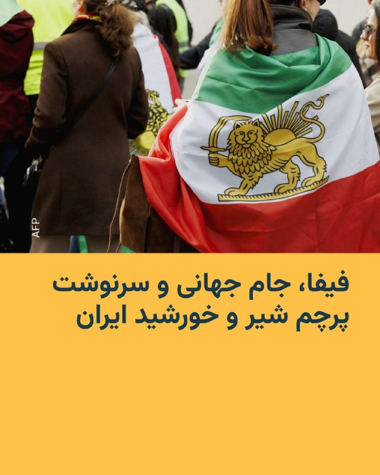

🔸 گزارش‌ها حاکی است که فدراسیون جهانی فوتبال، فیفا، بار دیگر قصد دارد نمایش پرچم شیروخورشید را در جریان جام جهانی ۲۰۲۶ ممنوع کند. این اقدام جنجال‌های دوره جام جهانی قطر را دوباره زنده کرده و با واکنش ایرانیان خارج از کشور و چهره‌های مخالف جمهوری اسلامی روبه‌رو شده است.

🔸 روزنامه «اتلتیک» روز ۲۹ اردیبهشت گزارش داد که فیفا با استناد به آیین‌نامه رفتاری ورزشگاه‌ها، نمایش «بنرها، پرچم‌ها، پوشش‌ها و دیگر اقلامی را که ماهیتی سیاسی، توهین‌آمیز یا تبعیض‌آمیز دارند» در محل مسابقات ممنوع می‌کند.

🔸 برخلاف جام جهانی قطر که اجرای این محدودیت‌ها یکدست نبود، احتمال دارد این ممنوعیت در جام جهانی ۲۰۲۶ به‌صورت سراسری اعمال شود.

🔸 در این گزارش آمده است که فدراسیون فوتبال جمهوری اسلامی ایران فهرستی از خواسته‌ها را درباره حضور تیم ملی به فیفا ارائه کرده که از جمله شامل احترام به پرچم رسمی جمهوری اسلامی ایران بوده است.

@RadioFarda

## RadioFarda — post 157408

🔸ایتامار بن‌ گویر، وزیر امنیت ملی اسرائیل در شبکه اجتماعی ایکس ویدیویی از اعضای بازداشت‌شده کاروان کمک‌رسانی به غزه منتشر کرده که با انتقادهای زیادی همراه شده است.

🔸در این ویدئو دیده می‌شود که به اعضای این کاروان دستبند زده شده و آنها بر روی زمین زانو زده‌اند. هم‌چنین تصاویری از برخوردهای خشونت‌آمیز با آن‌ها دیده می‌شود.

🔸بن گویر که به‌عنوان یک چهره سیاسی راست افراطی شناخته می‌شود ضمن انتشار این ویدئو نوشته است: «ما این‌گونه حامیان تروریسم را می‌پذیریم»

🔸این ویدئو با انتقاد وزیر خارجه اسرائیل و مقامات چندین کشور مواجه شده، از جمله جورجا ملونی، نخست‌وزیر ایتالیا، ضمن محکوم کردن این اقدامات خواستار عذرخواهی شده است.

@RadioFarda

## RadioFarda — post 157407

  

🔸قوه قضائیه جمهوری اسلامی دو زندانی را به اتهام عضویت در «گروه‌های تروریستی تجزیه‌طلب» و «قیام مسلحانه از طریق تشکیل گروه‌های مجرمانه» اعدام کرد.

🔸ارگان رسمی دستگاه قضایی ایران، میزان، هویت این دو نفر را رامین زله و کریم معروف‌پور معرفی کرده و نوشته که آنها صبح روز پنج‌شنبه، ۳۱ اردیبهشت، اعدام شدند.

🔸میزان نوشته که رامین زله «پس از طی دوره‌های آموزشی از طرف گروهک ماموریت پیدا کرده بود تا در ناآرامی‌های کشور به عنوان لیدر شرکت کند».

🔸ارگان رسمی قوه قضائیه ایران همچنین نوشته که این دو نفر «اعتراف» کرده بودند که «برای ترور فرمانده پایگاه سپاه یکی از شهرستان‌های غرب کشور» با یکدیگر «همکاری» داشته و برای این کار، «سلاح» نگهداری می‌کردند.

🔸از زمان حملات آمریکا و اسرائیل به ایران، جمهوری اسلامی اجرای احکام اعدام را افزایش داده است و در برخی روزها چند نفر را اعدام کرده است. طی این مدت، در بعضی هفته‌ها، چند روز پشت سر هم، اخبار اجرای احکام اعدام منتشر شده است.

🔸خبرگزاری حقوق بشری هرانا که در آمریکا مستقر است، نوشته هویت «۵۰ فردی» که از ابتدای جنگ در ایران اعدام شده‌اند را احراز کرده است.

@RadioFarda

## RadioFarda — post 157406

  

🔸سردار آزمون، فوتبالیست سرشناس ایرانی، پس از حذف از تیم ملی، در پستی از علاقه خود به فوتبال و مردم ایران گفته و نوشته است: «هر جايي كه فوتبال بازی كنم، هويت من، قلب من و افتخار من ايران است.»

🔸مهاجم باشگاه شباب الاهلی در لیگ برتر امارت در پستی که به تازگی در اینستاگرام منتشر کرده توضیح داده که این پست را در ارتباط با کسانی نوشته است که «به خاطر بعضی سوءتفاهم‌ها نسبت به من قضاوتی عجولانه كردند.»

🔸این مهاجم شناخته‌شده که به‌عنوان دومین گلزن برتر تاریخ تیم ملی ایران پس از علی دایی شناخته می‌شود، در این پست هم‌چنین گفته است: «وقتي پيراهن تيم ملی كشورم رو پوشيدم، به خودم قول دادم هر بار كه برای ايران بازی می‌كنم، با تمام وجود تلاش كنم تا باعث خوشحالی مردمی كه با عشق فوتبال رو دنبال می‌كنن بشم بخصوص بچه‌هايی كه توی دورترين شهرها و روستاها با پيروزی ما خوشحال ميشن.»

🔸انتشار تصاویر دیدار این فوتبالیست با مقامات حکومت امارات در روزهای نخست جنگ در صفحه اینستاگرام او حاشیه‌ساز شد تا جایی که برخی حامیان حکومت خواستار تعلیق او از تیم ملی و ضبط اموالش در ایران شدند.

@RadioFarda

## RadioFarda — post 157405

  <a href="https://t.me/radiofarda/157405" target="_blank">📎 Download file</a>

📻بشنوید: سرخط خبرها با رادیوفردا، ۳۱ اردیبهشت ۱۴۰۵‌

@RadioFarda

## IranianMinds — post 20477

  

زندگی در ایران عزیزمون اینطوری شده که اگه «یه خرید» بری و برگردی؛ «یه دهک» جابجا میشی!

@IranianMinds

## IranianMinds — post 20476

  

🔴 از ۷ اکتبر تا به امروز رو باهم یه مرور دوباره بکنیم:

@IranianMinds

## IranianMinds — post 20475

  

🔴 شریعتمداری :

باید یه قانون‌ تصویب کنیم که تنگه هرمز تا زمانی که ترامپ کشته نشه بسته بمونه !

@IranianMinds

## IranianMinds — post 20474

  

⚫️ امروز صبح جمهوری اسلامی دو‌ نفر دیگه از هموطن هامونو هم کشت ، خبرگزاری میزان قوه قضائیه اعلام کرد رامین زله و کریم معروف پور از معترضین دی ماه امروز صبح اعدام شدن.

@IranianMinds

## BBCPersian — post 281669

🔻یک نهاد حقوقی حامی فلسطینی‌ها گفته است که فعالان بازداشت‌شده از ناوگان کمک‌رسانی به غزه، نیروهای اسرائیلی را به رفتار خشونت‌آمیز و شکنجه روانی متهم کرده‌اند.

سه نفر از آن‌ها مجبور شدند به بیمارستان منتقل شوند، هرچند بعدا از بیمارستان مرخص شدند.

وکلا ده‌ها مورد مشکوک به شکستگی دنده و مشکلات تنفسی را ثبت کرده‌اند؛ آسیب‌هایی که احتمال می‌رود در پی اصابت گلوله‌های لاستیکی ایجاد شده باشد.

مقام‌های اسرائیلی تاکنون در این باره اظهار نظری نکرده‌اند.

ایتامار بن‌گویر، وزیر امنیت ملی اسرائیل، پس از انتشار ویدیویی که در آن فعالان منتقل‌شده به زندان را به تمسخر می‌گیرد، با موج گسترده‌ای از انتقادها روبه‌رو شده است.

بنیامین نتانیاهو، نخست‌وزیر اسرائیل، گفته است که رفتار او با ارزش‌های اسرائیلی همخوانی ندارد.

این اقدام وزیر امنیت ملی اسرائیل همچنین با واکنش‌های گسترده‌ای روبرو شده است.
https://bbc.in/4eURa3N
@BBCPersian

## BBCPersian — post 281668

  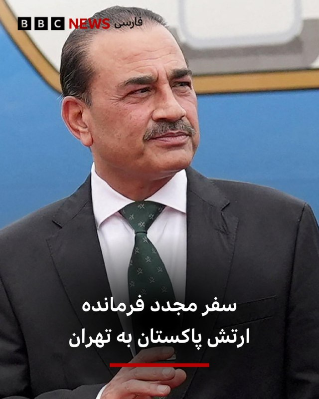

‌ ‌ ‌ ‌
رسانه‌های ایران گفته‌اند که فیلد مارشال عاصم منیر،‌ فرمانده ارتش پاکستان امروز به تهران سفر می‌کند.

براساس این گزارش‌ها این سفر در ادامه گفت‌و‌گوها و رایزنی‌ها با مقامات ایران صورت می گیرد.

پاکستان در مذاکرات ایران و آمریکا نقش میانجی را دارد.

دیروز محسن نقوی، وزیر کشور پاکستان برای دومین بار در هفته جاری به تهران سفر کرد. او در این سفر با اسکندرمومنی، وزیر کشور و همچنین مسعود پزشکیان، رئیس جمهور گفت‌و‌گو کرده است.

گفته شده است که آقای نقوی در این دیدار پیام‌های مقامات پاکستان د رمورد اهمیت ادامه گفت‌و‌گوها را به مقامات ایران منتقل کرد.

فرمانده ارتش پاکستان پیشتر و در ۲۸ فروردین هم به تهران سفر کرده بود.

https://bbc.in/3RTCqZh
📷Reuters
@BBCPersian

## BBCPersian — post 281667

🔻آنتونیو کاستا، رئیس شورای اروپا، می‌گوید که «از رفتار بن گویر، وزیر اسرائیلی با اعضای ناوگان دریایی وحشت‌زده شده است.»

آقای کاستادر پستی در شبکه اجتماعی ایکس نوشت: «این رفتار کاملاً غیرقابل قبول است. ما خواستار آزادی فوری آنها هستیم.»

ایتامار بن‌گویر،‌ وزیر امنیت ملی اسرائیل که از جناح راست تندرو این کشور است در ویدیویی و در حالی که پرچم بزرگی از اسرائیل را در دست دارد، به زبان عبری به آن‌ها می‌گوید: «به اسرائیل خوش آمدید، این ما هستیم که صاحب اختیاریم.»

انتشار این ویدئو واکنش‌های زیادی را در پی داشت از جمله جورجا ملونی، نخست‌وزیر ایتالیا، و پدرو سانچز، نخست‌وزیر اسپانیا نیز این اقدام را محکوم کرده‌اند.
https://bbc.in/3Rdii4i
@BBCPersian

## BBCPersian — post 281659

‌ ‌ ‌
علی زیدی، نخست‌وزیر جدید عراق، در دوره‌ای حساس و پیچیده زمام قدرت را به دست می‌گیرد که در آن چالش‌های امنیتی داخلی با بحران‌های پیچیده منطقه‌ای درهم تنیده‌اند.

این وضعیت در پی جنگ آمریکا و اسرائیل با ایران و ورود گسترده گروه‌های مسلح عراقی نزدیک به تهران به این جنگ شکل گرفته است. این گروه‌ها با حمله به منافع آمریکا در مناطق مختلف عراق، از جمله اقلیم کردستان و همچنین در کشورهای همسایه، نقش فعالی در درگیری‌ها ایفا کرده‌اند.

از زمان اعلام حمایت دونالد ترامپ، رئیس‌جمهور آمریکا، از نامزدی علی زیدی و تبریک آقای ترامپ پس از معرفی او از سوی «چارچوب هماهنگی» نیروهای شیعه، پرسش‌های زیادی درباره توانایی این چهره خارج از ساختار سنتی سیاست عراق برای اجرای خواسته‌های واشنگتن مطرح شده است. یکی از مهم‌ترین مطالبات آمریکا خلع سلاح گروه‌های شیعه و انحلال شاخه‌های نظامی ان‌هاست.

https://bbc.in/49cr6xk
📸GettyImages/ Reuters/ Anadolu via Getty Images/ AFP via Getty Images
@BBCPersian

## BBCPersian — post 281658

  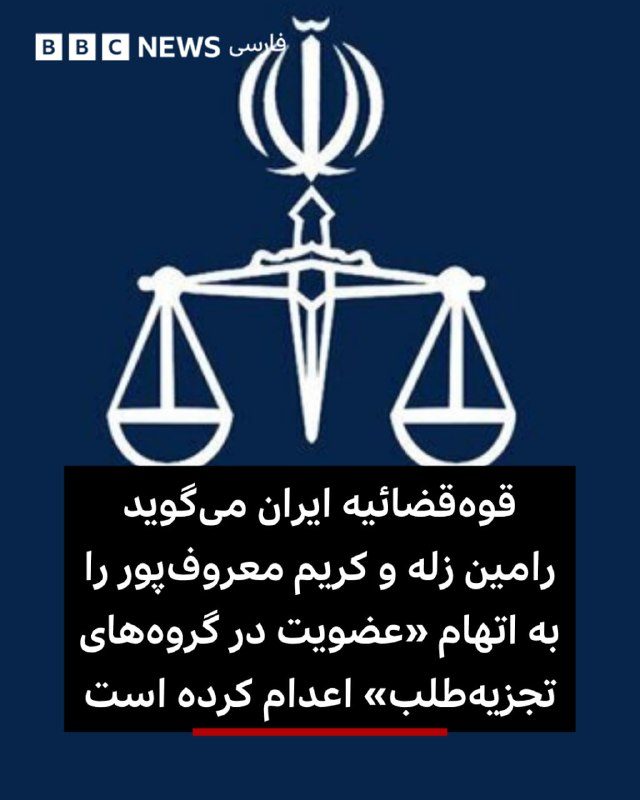

‌ ‌ ‌
خبرگزاری میزان، رسانه وابسته به قوه‌قضائیه جمهوری اسلامی اعلام کرد که «رامین زله» و «کریم معروف‌پور» را به جرم «عضویت در گروهک‌های تروریستی تجزیه طلب» و «تشکیل گروه با هدف برهم زدن امنیت کشور»، «قیام مسلحانه از طریق تشکیل گروه‌های مجرمانه» ، «تیراندازی و اقدام به ترور» اعدام کرده است.

قوه‌قضائیه ایران اعلام کرده که مبنای صدور حکم اعدام برای این دو زندانی «اعترافات» و «اقرار» آنها در زمان بازداشت بوده است.

نهادهای حقوق بشر از دادرسی‌های ناعادلانه، نقض حقوق متهم و موج اعدام‌ها بر اساس «اعترافات» زیر شکنجه و فشار برای صدور احکام اعدام در ایران ابراز نگرانی کرده‌اند.

هرانا، ارگان فعالان حقوق بشر نوشته که آقای زله در تاریخ ۱ مرداد ۱۴۰۳، توسط نیروهای امنیتی بدون ارائه حکم قضایی در خانه‌اش بازداشت و به زندان نقده منتقل شده بود.

برخی رسانه‌ها هم گزارش کرده‌اند که آقای معروف‌پور در فروردین ۱۴۰۰ بازداشت شده بود.

https://bbc.in/4uohfgj
📷 mehrnews
@BBCPersian

## BBCPersian — post 281656

  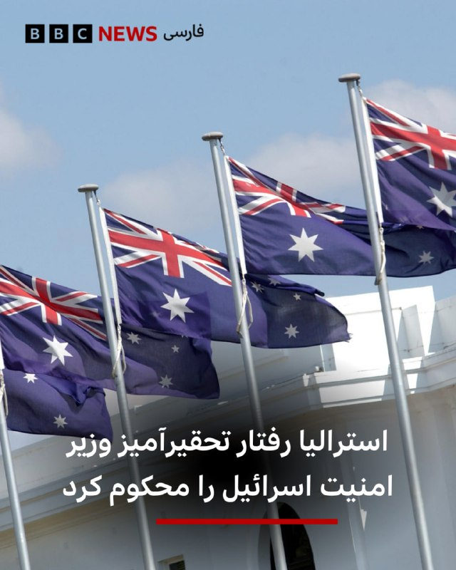

‌ ‌ ‌ ‌
پنی وانگ، وزیر خارجه استرالیا در واکنش به ویدیوی جنجالی از بدررفتاری وزیر امنیت ملی اسرائیل با فعالان ناوگان کمک به غزه، گفته با احضار سفیر اسرائیل به وزارت خارجه مراتب اعتراض و محکومیت استرالیا را به به وی ابلاغ کرده است.

خانم وانگ در شبکه ایکس نوشت: «تصاویری که از سوی وزیر اسرائیلی، بن گویر ـ که از سوی استرالیا تحریم شده ـ منتشر شده، شوکه‌کننده و غیرقابل قبول است. ما اقدامات او و رفتار تحقیرآمیز مقام‌های اسرائیلی با بازداشت‌شدگان را محکوم می‌کنیم.»

وزیر خارجه استرالیا گفته از سفیر خود در اسرائیل هم خواسته که اعتراض این کشور را به دولت اسرائیل اعلام کند.

در این ویدیو جنجالی ده‌ها فعال که در قالب ناوگان کمک به غزه راهی آبهای نزدیک به سواحل غزه شده بودند، دیده می‌شوند که با دستان بسته روی زمین زانو زده‌اند.

ایتامار بن‌گویر،‌وزیر امنیت ملی اسرائیل که از جناح راست تندرو این کشور است در ویدیو و در حالی که پرچم بزرگی از اسرائیل را در دست دارد، به زبان عبری به آن‌ها می‌گوید: «به اسرائیل خوش آمدید، این ما هستیم که صاحب اختیاریم.»

https://bbc.in/3PscmDX
📷BBC
@BBCPersian

## BBCPersian — post 281655

🔻انفجارهای کنترل شده در عسلویه

فرماندار منطقه عسلویه از تلاش برای امحای مهمات‌های عمل نکرده در جریان جنگ ۳۹ روزه خبر داده و به ساکنان این منطقه نفتی و گازی در جنوب ایران اطلاع داده است که صبح پنجشنبه - ۳۱ اردیبهشت - باید منتظر شنیدن صدای انفجارهای کنترل شده در نقاطی از عسلویه باشند.

https://bbc.in/4uqOS1f
@BBCPersian

## Dirty_Kids — post 389859

پس‌از اینکه حجاب تو تجمعات حکومتی آزاد شد، کرکتر منچیکو (منچ آنلاین) هم تو مایکت کشف حجاب کرد :)))

@Dirty_Kids 👻

## Dirty_Kids — post 389858

  <a href="telegram/content/Dirty_Kids_389858_1779350487.mp4" target="_blank">🎬 Download video</a>

حمله واشقانی به شهبازی

مملکت مگه صاحاب نداره؟ خیلی کار احمقانه‌ای کردی
گلنوش خسروی ملی پوش فوتبال: از حرف مجری تلویزیون ترسیده بودیم و به ما می‌گفتن اگه برگردیم اتفاقی برای ما می‌افتد

+ کص‌ننه جفتتون

@Dirty_Kids 👻

## Dirty_Kids — post 389857

  

داغش؟ یارو سه ماهه تو فریزره، الان دیگه باید برفکش رو باور کنی.

@Dirty_Kids 👻

## Dirty_Kids — post 389856

  <a href="telegram/content/Dirty_Kids_389856_1779350489.mp4" target="_blank">🎬 Download video</a>

من هرروز صبح:

@Dirty_Kids 👻

## Hranews — post 113070

  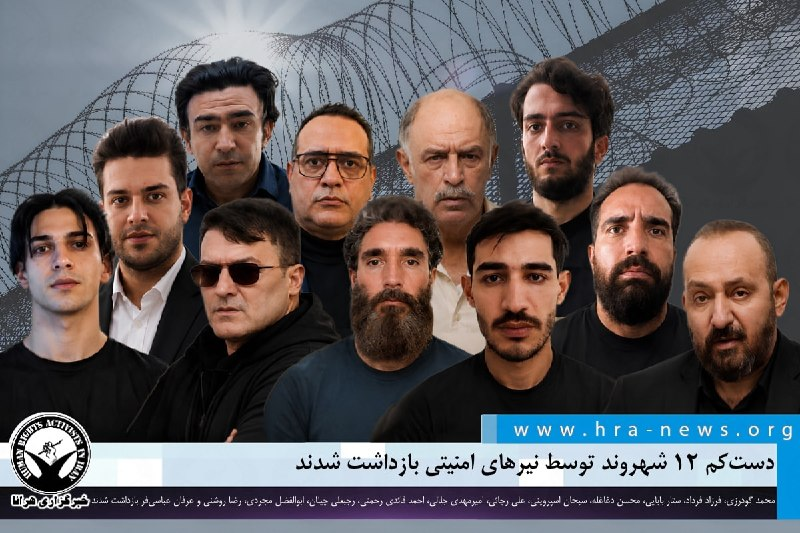

دستکم ۱۲ شهروند توسط نیروهای امنیتی بازداشت شدند

❗️
❗️
❗️
❗️
❗️– طی روزهای اخیر، محمد گودرزی، فرزاد فرداد، ستار بابایی، محسن دغاغله، سبحان اسپروینی، علی رجائی، امیرمهدی جلالی، احمد قائدی رحمتی، رجبعلی چیلان، ابوالفضل مجردی، رضا روشنی و عرفان عباسی‌فر، توسط نیروهای امنیتی در شهرهای مختلف بازداشت شده‌اند. همچنان اطلاعی از وضعیت و سرنوشت این افراد در دست نیست.

به گزارش خبرگزاری هرانا، ارگان خبری مجموعه فعالان حقوق بشر در ایران، دستکم ۱۲ شهروند در شهرهای مختلف توسط نیروهای امنیتی بازداشت شدند.

هویت این افراد، محمد گودرزی، فرزاد فرداد، ستار بابایی، محسن دغاغله، سبحان اسپروینی، علی رجائی، امیرمهدی جلالی، احمد قائدی رحمتی، رجبعلی چیلان، ابوالفضل مجردی، رضا روشنی و عرفان عباسی‌فر، توسط هرانا احراز شده است.

ادامه مطلب

#محمد_گودرزی #فرزاد_فرداد #ستار_بابایی
#محسن_دغاغله #سبحان_اسپروینی #علی_رجائی
#امیرمهدی_جلالی #احمد_قائدی_رحمتی #رجبعلی_چیلان
#ابوالفضل_مجردی #رضا_روشنی #عرفان_عباسی‌فر

↘️
@hranews_bot تماس ✉️ - @Hranews کانال هرانا 🆑

## Hranews — post 113069

  

رامین زله و کریم معروف‌پور اعدام شدند

❗️
❗️
❗️
❗️
❗️– قوه قضاییه اعلام کرد که سحرگاه امروز، رامین زله و کریم معروف‌پور، بابت اتهاماتی از جمله عضویت در گروه‌های مخالف نظام و اقدام مسلحانه اعدام شدند. بر اساس داده‌های گردآوری‌شده توسط هرانا، همزمان با آغاز درگیری‌های نظامی، روند صدور و اجرای احکام #اعدام در پرونده‌های سیاسی و امنیتی افزایش یافته و تاکنون ۳۴ زندانی با این اتهامات در این بازه زمانی اعدام شده‌اند.

ادامه مطلب

#رامین_زله #کریم_معروف‌پور

↘️
@hranews_bot تماس ✉️ - @Hranews کانال هرانا 🆑

## manototv — post 105711

  <a href="telegram/content/manototv_105711_1779350490.mp4" target="_blank">🎬 Download video</a>

سی‌ان‌ان به نقل از منابع اطلاعاتی آمریکا گزارش داد جمهوری اسلامی بازسازی زیرساخت‌های نظامی و تولید پهپاد را سریع‌تر از برآوردهای اولیه از سر گرفته است.
بر اساس این گزارش، ایران در جریان آتش‌بس شش‌هفته‌ای که از اوایل آوریل آغاز شد، بخشی از تولید پهپادهای خود را دوباره راه‌اندازی کرده است. منابع آگاه گفته‌اند این موضوع نشان می‌دهد تهران در حال بازسازی سریع توان نظامی آسیب‌دیده خود در حملات آمریکا و اسرائیل است.
چهار منبع مطلع نیز به سی‌ان‌ان گفته‌اند ارزیابی نهادهای اطلاعاتی آمریکا نشان می‌دهد روند بازسازی ارتش ایران بسیار سریع‌تر از آن چیزی است که پیش‌تر تخمین زده می‌شد
به گفته این منابع، بازسازی پایگاه‌های موشکی، سکوهای پرتاب و ظرفیت تولید سامانه‌های تسلیحاتی نشان می‌دهد ایران همچنان در صورت ازسرگیری حملات، تهدیدی جدی برای متحدان منطقه‌ای آمریکا خواهد بود.
یکی از مقام‌های آمریکایی نیز گفته است برخی برآوردهای اطلاعاتی نشان می‌دهد ایران ممکن است ظرف شش ماه توان کامل حملات پهپادی خود را بازیابی کند.

## manototv — post 105710

  <a href="telegram/content/manototv_105710_1779350490.mp4" target="_blank">🎬 Download video</a>

رسانه‌های اسرائیل به نقل از سی‌ان‌ان گزارش دادند تماس تلفنی اخیر دونالد ترامپ و بنیامین نتانیاهو درباره ایران، «پرتنش» بوده است. بر اساس این گزارش، نتانیاهو خواهان ازسرگیری حملات به ایران شده اما ترامپ خواستار زمان بیشتر برای ادامه دیپلماسی بوده است.
به گزارش رسانه‌های اسرائیل، نتانیاهو گفته تعلل آمریکا به سود ایران است، در حالی که ترامپ تأکید کرده ترجیح می‌دهد فرصت بیشتری به مسیر دیپلماتیک داده شود.
همزمان، وال‌استریت ژورنال گزارش داد اسرائیل نسبت به پایبندی جمهوری اسلامی به هرگونه توافق هسته‌ای تردید دارد و مقام‌های اسرائیلی از آنچه «وقت‌کشی دیپلماتیک ایران» می‌خوانند ابراز نارضایتی کرده‌اند.

دو طرف است

## manototv — post 105709

  <a href="telegram/content/manototv_105709_1779350491.mp4" target="_blank">🎬 Download video</a>

روزنامه تلگراف در گزارشی به واحد مخفی دلفین‌های نیروی دریایی آمریکا پرداخت؛ واحدی که از دوران جنگ سرد برای شناسایی مین‌های دریایی و کمک به عملیات مین‌روبی ایجاد شده است.
بر اساس این گزارش، دلفین‌های پوزه‌بطری با استفاده از توانایی مکان‌یابی صوتی، مین‌ها و اجسام زیر آب را با دقت بالا شناسایی کرده و محل آن‌ها را به نیروهای نظامی اطلاع می‌دهند تا به‌صورت ایمن خنثی شوند.
تلگراف تأکید کرده این دلفین‌ها برای منفجر کردن مین‌ها آموزش نمی‌بینند، بلکه وظیفه آن‌ها شناسایی تهدیدها و کمک به باز نگه داشتن مسیرهای دریایی است.
این گزارش همزمان با افزایش تنش‌ها در تنگه هرمز منتشر شده و به نقش احتمالی این واحد ویژه در تأمین امنیت کشتیرانی در من اشاره می‌کند.

## manototv — post 105708

  <a href="telegram/content/manototv_105708_1779350491.mp4" target="_blank">🎬 Download video</a>

دومین زمین‌لرزه در کمتر از ۱۰ ساعت گذشته، دریای خزر در حوالی شهرستان مرزی آستارا را لرزاند. بنا بر گزارش رسانه‌های داخلی، این زمین‌لرزه ۳.۸ ریشتر قدرت داشته است.
هنوز گزارشی از خسارات احتمالی یا تلفات منتشر نشده است.

## manototv — post 105707

  <a href="telegram/content/manototv_105707_1779350492.mp4" target="_blank">🎬 Download video</a>

وب‌سایت وای‌نت به نقل از یک مقام ارشد اسرائیلی گزارش داد که «جنگ بعدی با ایران، آخرین جنگ نخواهد بود» و تا زمانی که جمهوری اسلامی در قدرت باشد، احتمال تکرار درگیری‌ها وجود دارد.
این مقام گفته است باید «انتظارات عمومی بازتنظیم شود» زیرا حتی در صورت حمله‌ای دیگر، تهدیدها علیه اسرائیل پایان نخواهد یافت. به گفته او، در صورت ادامه وضعیت کنونی، ممکن است درگیری‌ها هر سال یا حتی در بازه‌های کوتاه‌تر تکرار شوند.
این مقام اسرائیلی همچنین مدعی شد هدف از این سیاست، مهار تهدید هسته‌ای و برنامه موشک‌های بالستیک ایران علیه موجودیت اسراییل است.

## alonews — post 121488

  <a href="telegram/content/alonews_121488_1779350492.webm" target="_blank">🎬 Download video</a>

👈امروز هشتاد و سومین روز قطعی اینترنت تو ایرانه، بیشتر از ۱۹۶۸ ساعت ادامه داره

✅ @AloNews خبر جنگ

## alonews — post 121487

  <a href="telegram/content/alonews_121487_1779350492.webm" target="_blank">🎬 Download video</a>

👈سایت عبری والا: منابع اسرائیلی می‌گویند آمریکایی‌ها در مذاکرات با ایران یک قدم به جلو برداشته‌اند، بنابراین برآوردها این است که حمله‌ای به ایران در ۲۴ ساعت آینده تکرار نخواهد شد

✅ @AloNews خبر جنگ

## alonews — post 121486

  <a href="telegram/content/alonews_121486_1779350492.mp4" target="_blank">🎬 Download video</a>

👈نتانیاهو : اگه ما نبودیم آمریکا اصلا به وجود نمیومد

🔴 ما شما رو آوردیم تو این دنیا و هر وقت بخوایم میتونیم ببریمتون

✅ @AloNews خبر جنگ

## alonews — post 121485

  <a href="telegram/content/alonews_121485_1779350494.webm" target="_blank">🎬 Download video</a>

👈رسانه‌های عبری: فرمانده گردان ۴۰۱ که در لبنان به شدت زخمی شده است، پس از اینکه تحت عمل جراحی برای خارج کردن ترکش‌ها از سرش قرار گرفت، هنوز تحت بیهوشی و تنفس مصنوعی قرار دارد

✅ @AloNews خبر جنگ

## alonews — post 121484

  <a href="telegram/content/alonews_121484_1779350494.webm" target="_blank">🎬 Download video</a>

👈زمین لرزه ۴ ریشتری بامداد امروز فراشبند در استان فارس خسارتی در بر نداشت.

✅ @AloNews خبر جنگ

## alonews — post 121483

  <a href="telegram/content/alonews_121483_1779350494.webm" target="_blank">🎬 Download video</a>

👈خبرگزاری CNN:ایران با سرعتی فراتر از پیش‌بینی‌ها در حال بازسازی پایگاه صنعتی–نظامی خود است و تولید پهپادها را نیز از سر گرفته

✅ @AloNews خبر جنگ

## alonews — post 121482

  <a href="telegram/content/alonews_121482_1779350495.webm" target="_blank">🎬 Download video</a>

👈 یدیعوت آحارونوت به نقل از یک مقام امنیتی: باید جنگ‌ها رو سریع‌تر علیه جمهوری اسلامی راه بندازیم تا برنامه هسته‌ای و موشک‌هایشون دیگه تهدیدی نباشن

✅ @AloNews خبر جنگ

## alonews — post 121481

  <a href="telegram/content/alonews_121481_1779350495.mp4" target="_blank">🎬 Download video</a>

👈معاون رئیس دفتر کاخ سفید در امور سیاست‌گذاری، استیون میلر: ایران باید انتخاب کند: یا می‌تواند با یک سندی که برای آمریکا رضایت‌بخش است موافقت کند، یا با مجازاتی از سوی نیروهای نظامی ما مواجه شود که نمونه‌ای مشابه آن در تاریخ معاصر دیده نشده است.

✅ @AloNews خبر جنگ

## alonews — post 121480

  <a href="telegram/content/alonews_121480_1779350497.webm" target="_blank">🎬 Download video</a>

👈سردار وحیدی و وزیر کشور پاکستان دیدار نداشته‌اند؛ ادعای شبکه العربیه نادرست است

🔴براساس بررسی‌های بعمل آمده سردار وحیدی برنامه دیداری با وزیر کشور پاکستان نداشته و تصاویر منتشر شده هم برای سال ۲۰۲۴ و مربوط به دوران وزارت کشوری او در دولت رئیسی است.

✅ @AloNews خبر جنگ

## alonews — post 121479

  <a href="telegram/content/alonews_121479_1779350497.webm" target="_blank">🎬 Download video</a>

👈 ۵ سناریوی نیوزویک برای آینده رویارویی ایران و آمریکا

🔴 در بحبوحه تلاش‌های دیپلماتیک برای مهار تنش‌های منطقه‌ای، وزیر کشور پاکستان برای دومین‌بار در کمتر از یک هفته به تهران سفر کرد.

🔴 همزمان، مجلس سنای آمریکا در اقدامی کم‌سابقه با ۵۰ رأی موافق، اختیارات نظامی ترامپ علیه ایران را محدود کرد؛ هرچند پیش‌ بینی می‌شود ترامپ آن را وتو کند.

🔴 در همین حال، تماس‌های تلفنی مداوم میان ترامپ و نتانیاهو ادامه دارد.

🔴 همچنین احتمال سفر سید عباس عراقچی به نیویورک برای شرکت در نشست شورای امنیت به ریاست چین مطرح است.

🔴 گزارش‌های رسانه‌ای از آماده‌سازی آمریکا و اسرائیل برای حمله نظامی و تردید در پیشرفت مذاکرات حکایت دارد.

🔴 «نیوزویک» نیز پنج سناریو برای آینده این بحران ترسیم کرده که از «دیپلماسی توأم با اجبار» و حملات نظامی تا «جنگ فرسایشی مزمن» و تداوم «آتش‌بس صوری» را شامل می‌شود.

✅ @AloNews خبر جنگ

## alonews — post 121478

  <a href="telegram/content/alonews_121478_1779350497.webm" target="_blank">🎬 Download video</a>

👈وزیر امور خارجه لهستان: کاردار اسرائیل به دلیل بازداشت فعالان ناوگان آزادی احضار شد و از اسرائیل خواستیم فوراً شهروندانمان را آزاد کند

🔴 به شهروندانمان توصیه می‌کنیم به اسرائیل سفر نکنند.

✅ @AloNews خبر جنگ

## alonews — post 121477

  <a href="telegram/content/alonews_121477_1779350497.mp4" target="_blank">🎬 Download video</a>

👈دیدار وزیر کشور پاکستان با عراقچی

✅ @AloNews خبر جنگ

## alonews — post 121476

  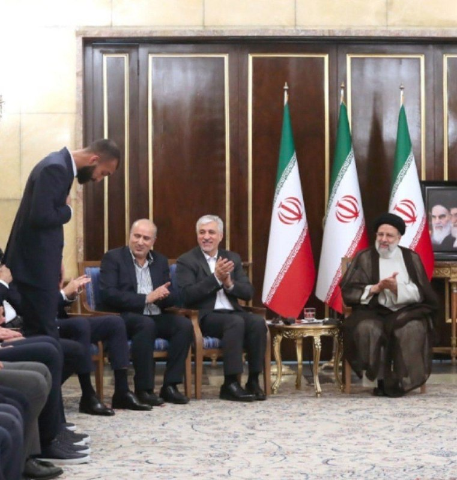

روزبه چشمی به دلیل مصدومیت جام جهانی را از دست داد

@AloSport

## alonews — post 121475

  <a href="telegram/content/alonews_121475_1779350499.webm" target="_blank">🎬 Download video</a>

👈ایندیپندت: ترامپ بعد از جلسه با معاونش ونس تصمیم گرفت که ۱ فرصت دیگه به مذاکره بده

✅ @AloNews خبر جنگ

## alonews — post 121474

  <a href="telegram/content/alonews_121474_1779350499.webm" target="_blank">🎬 Download video</a>

👈تصویری از وکلای کاربلد متهمین قتل یک بسیجی که توانستند حکم قاتلین را از اعدام به پنج سال زندان و پرداخت دیه کامل کاهش دهند

✅ @AloNews خبر جنگ

## alonews — post 121473

  <a href="telegram/content/alonews_121473_1779350500.webm" target="_blank">🎬 Download video</a>

👈ادعای «میدل ایست آی»: به ترامپ هشدار داده شده آغاز جنگ در ایام حج، آمریکا را در جهان اسلام منفورتر می‌کند و به همین دلیل حمله به ایران به تعویق افتاده است

✅ @AloNews خبر جنگ

## alonews — post 121472

  <a href="telegram/content/alonews_121472_1779350500.mp4" target="_blank">🎬 Download video</a>

👈غرفه‌های همسریابی یا همون .... در تجمعات شبانه تهران برپا شد

✅ @AloNews خبر جنگ

## alonews — post 121471

  <a href="telegram/content/alonews_121471_1779350501.webm" target="_blank">🎬 Download video</a>

👈احتمال شنیده شده صدای انفجار در شهر ابریشم و جنوب اصفهان

✅ @AloNews خبر جنگ

## alonews — post 121470

  <a href="telegram/content/alonews_121470_1779350502.webm" target="_blank">🎬 Download video</a>

👈خبرگزاری نور: سخنگوی وزارت خارجه ایران، بقائی، گزارش داد که پاسخ ایالات متحده به طرح ۱۴ نقطه‌ای خود را دریافت کرده‌اند و در حال بررسی آن هستند.

🔴«بر اساس همان متن اولیه ۱۴ نقطه‌ای از ایران، تبادل پیام‌ها چندین بار انجام شده است و ما دیدگاه‌های طرف آمریکایی را دریافت کرده‌ایم و در حال حاضر در حال بررسی آن‌ها هستیم.»

✅ @AloNews خبر جنگ

## alonews — post 121469

  <a href="telegram/content/alonews_121469_1779350502.webm" target="_blank">🎬 Download video</a>

👈 «میدل ایست آی»: سه منبع گفتند که انتظار دارند جنگ در هفته‌های آینده و پس از پایان دوره حج، از سر گرفته شود!

🔴ایالات متحده در گذشته از سیگنال‌های فریبنده و حیله‌های دیگر استفاده کرده تا سعی کند طرف مقابل را دچار احساس امنیت کاذب کند.

✅ @AloNews خبر جنگ

<!-- MSG END -->

<!-- NAV START -->

<a href="https://github.com/kiavash-sh/aio-downloader/blob/main/telegram/content/archive_1.md" style="display:inline-block; padding:6px 12px; margin:0 4px; background-color:#2ea44f; color:white; text-decoration:none; border-radius:4px; font-weight:bold;">صفحه بعد</a>

<!-- NAV END -->
