# خواننده تلگرام

<!-- TOP_NAV START -->

<a href="https://github.com/kiavash-sh/aio-downloader/blob/main/telegram/content/archive_1.md" style="display:inline-block; padding:6px 12px; margin:0 4px; background-color:#2ea44f; color:white; text-decoration:none; border-radius:4px; font-weight:bold;">صفحه بعد</a>

<!-- TOP_NAV END -->

<!-- MSG START -->

---
📅 بروزرسانی: 1405/03/03 23:43
---

## VahidOOnLine — post 241995

  

اکسیوس به نقل از دو مقام آمریکایی گزارش داد دونالد ترامپ شنبه در یک کنفرانس تلفنی با رهبران چند کشور عربی و دیگر کشورهای مسلمان گفت اگر توافقی برای پایان جنگ ایران حاصل شود، می‌خواهد این کشورها توافق‌های صلح با اسرائیل امضا کنند.

اکسیوس نوشت این اظهارات نشان‌دهنده گام بعدی بزرگی است که ترامپ پس از پایان جنگ در خاورمیانه دنبال می‌کند.

ترامپ در این تماس با رهبران عربستان سعودی، امارات متحده عربی، قطر، پاکستان، ترکیه، مصر، اردن و بحرین درباره توافق در حال شکل‌گیری با جمهوری اسلامی گفت‌وگو کرد.
‌🏁 🇬🇧 IranintlTV

🤖 @VahidOOnLine

## VahidOOnLine — post 241994

  

♦️خبرگزاری حکومتی تسنیم، شامگاه یکشنبه سوم خرداد ماه، به نقل از دادگاه انقلاب تهران اعلام کرد، رای اولیه پرونده موسوم به «بچه‌های اکباتان» صادر شده و طی آن چهار نفر از «متهمان اصلی» به اتهام «افساد فی‌الارض» به اعدام محکوم شده‌اند.

به گزارش تسنیم،  اتهامات ۹ نفر از متهمان این پرونده که به دلیل کشته شدن «آرمان علی‌وردی» بسیجی حامی حکومت زندانی شده‌اند مواردی چون  «وارد کردن ضربات چاقو،اخلال در نظم عمومی، اخلال گسترده در امنیت کشور، اجتماع و تبانی برای ارتکاب جرم علیه امنیت داخلی کشور، توزیع کوکتل مولوتف، وارد کردن ضربات سنگ به آرمان علی وردی، ضرب و شتم آرمان علی‌وردی و فعالیت تبلیغی علیه نظام» عنوان شده است.

بر اساس این گزارش، دادگاه انقلاب تهران متهمان ردیف اول تا چهارم پرونده را به اتهام «افساد فی‌الارض» به اعدام محکوم کرد و متهمان ردیف پنجم تا نهم نیز به حبس از یک تا پنج سال و مجازات‌های تکمیلی محکوم شدند.
‌🇸🇦 Indypersian

🤖 @VahidOOnLine

## VahidOOnLine — post 241993

♦️ده‌ها هزار نفر روز یکشنبه سوم خرداد ماه، در سی‌امین دوره «جشن خیابانی فرهنگ‌ها» در برلین شرکت کردند. رویدادی که با حضور حدود ۷۰ گروه در لباس‌های رنگارنگ در خیابان‌های پایتخت آلمان برگزار شد.
پلیس برلین آماری از شمار شرکت‌کنندگان ارائه نکرد، اما فضای این مراسم را «آرام، پرشور و کارناوالی» توصیف کرد. دمای هوا در زمان برگزاری این رویداد به ۲۸ درجه سانتی‌گراد رسید.
برگزارکنندگان اعلام کردند این جشنواره با هدف «ارسال پیامی درباره تنوع و گشودگی» برگزار می‌شود و حدود پنج هزار و ۸۰۰ شرکت‌کننده از ۶۷ گروه بین‌المللی، رقص، موسیقی و لباس‌های سنتی فرهنگ‌های مختلف جهان را به نمایش گذاشتند.
رژه خیابانی فرهنگ‌ها از سال ۱۹۹۶ به‌صورت سالانه در تعطیلات پنطیکاست برگزار می‌شود و به یکی از نمادهای چندفرهنگی بودن برلین تبدیل شده است. شرکت‌کنندگان در این مراسم تلاش می‌کنند از طریق رقص، موسیقی و هنر، ریشه‌های فرهنگی و تنوع قومی خود را به نمایش بگذارند.
‌🇸🇦 Indypersian

🤖 @VahidOOnLine

## VahidOOnLine — post 241992

  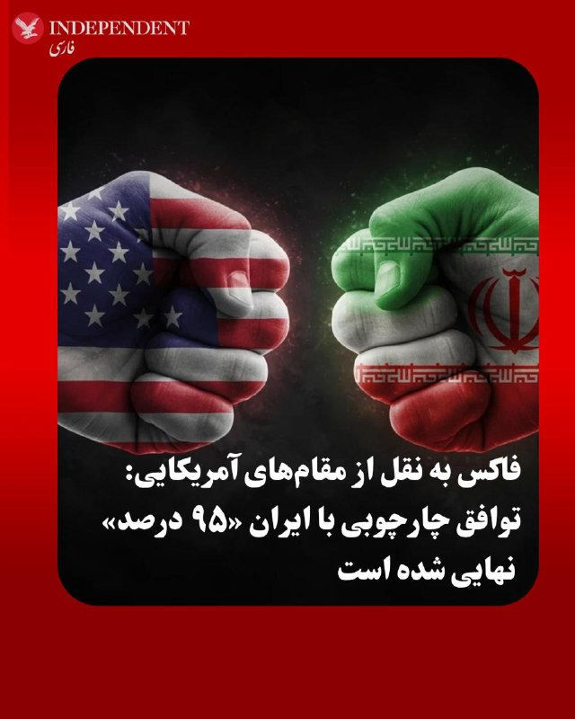

♦️شبکه خبری فاکس‌ روز یکشنبه سوم خرداد ماه، به نقل مقام‌هایی آمریکایی گزارش کرد چارچوب توافق میان واشنگتن و تهران تا روز یکشنبه «۹۵ درصد» نهایی شده، اما مذاکره‌کنندگان همچنان بر سر برخی «عبارت‌بندی‌ها» درباره ذخایر هسته‌ای ایران و تنگه هرمز در حال چانه‌زنی هستند.

مقام آمریکایی به فاکس گفت: «ما عقب‌نشینی نخواهیم کرد. هنوز به توافق نرسیده‌ایم و امروز یا فردا توافقی امضا نخواهد شد.» او افزود تمایل دونالد ترامپ این است که «پنج تا هفت روز دیگر» برای نهایی شدن توافق فرصت بدهد.
این مقام تاکید کرد مذاکرات بر اساس سیاست «نه گرد و غبار، نه دلار» پیش می‌رود و ایران «در اصل» با چارچوب توافق موافقت کرده است.

فاکس در ادامه به نقل از این مقام نوشت: «بر سر ذخایر هسته‌ای و تنگه هرمز به توافق رسیده‌ایم، اما هنوز در حال مذاکره درباره متن و عبارت‌ها هستیم.»
این مقام افزود: «ما فرصت دستیابی به توافقی را داریم که هزینه‌ها را برای آمریکایی‌ها کاهش دهد و همزمان مانع دستیابی ایران به سلاح هسته‌ای شود.»
‌🇸🇦 Indypersian

🤖 @VahidOOnLine

## VahidOOnLine — post 241991

  

بدر البوسعیدی، وزیر خارجه عمان گفت‌وگوی خود با کاظم غریب‌آبادی، معاون وزیر خارجه جمهوری اسلامی را «خوب» توصیف کرد.

او یکشنبه در شبکه ایکس نوشت: «ما بر اهمیت تعامل دیپلماتیک در همه زمینه‌ها تاکید کردیم. عمان به حمایت از تلاش‌ها برای کاهش تنش، پیشبرد همزیستی مسالمت‌آمیز منطقه‌ای، امنیت و آزادی دریانوردی ادامه خواهد داد.»
‌🏁 🇬🇧 IranintlTV

🤖 @VahidOOnLine

## VahidOOnLine — post 241990

  

به گزارش کانال ۱۲ اسرائیل، مقام‌های ارشد اسرائیلی نگران‌اند توافق در حال شکل‌گیری میان آمریکا و ایران ممکن است آزادی عمل اسرائیل علیه حزب‌الله در لبنان را به‌شدت محدود کند.

در این گزارش آمده است توافق پیشنهادی شامل پایان کامل درگیری‌ها در لبنان همزمان با پایان جنگ آمریکا و جمهوری اسلامی خواهد بود؛ موضوعی که باعث شد بنیامین نتانیاهو در تماس تلفنی روز گذشته خود با دونالد ترامپ نگرانی‌هایش را مطرح کند.

بر اساس این گزارش، نتانیاهو بر حفظ آزادی عملیاتی اسرائیل در لبنان تمرکز کرده و یک مقام ارشد اسرائیلی بعدا اعلام کرده است ترامپ موافقت کرده اسرائیل «آزادی عمل خود را در برابر تهدیدها در همه جبهه‌ها، از جمله لبنان، حفظ کند.»
‌🏁 🇬🇧 IranintlTV

🤖 @VahidOOnLine

## VahidOOnLine — post 241989

  <a href="telegram/content/VahidOOnLine_241989_1779653642.mp4" target="_blank">🎬 Download video</a>

یک مقام ارشد در دولت ترامپ به شبکه ان بی سی گفته:
«توافق با ایران امروز امضا نخواهد شد، اما در مسیر دستیابی به توافق پیشرفت‌هایی حاصل شده است.»
این اظهارات پس از آن مطرح شد که ترامپ پیش‌تر گفته بود به نمایندگان خود دستور داده است که «برای رسیدن به توافق عجله نکنند».
پیش از آن نیز مارکو روبیو گفته بود که ممکن است «خبرهای خوبی» در راه باشد، هرچند تأکید کرد که هنوز «پیشرفت نهایی» در گفت‌وگوها با جمهوری‌اسلامی حاصل نشده است.
‌🏁 🇬🇧 ManotoTV

🤖 @VahidOOnLine

## VahidOOnLine — post 241988

  <a href="telegram/content/VahidOOnLine_241988_1779653642.mp4" target="_blank">🎬 Download video</a>

دونالد ترامپ، رئیس‌جمهور آمریکا در پلتفرم تروث سوشال خود نوشت:
«اگر با ایران به توافق برسم، توافقی خوب و درست خواهد بود؛ نه مثل توافقی که باراک اوباما انجام داد و به ایران مقادیر عظیمی پول نقد و مسیری آشکار و باز برای دستیابی به سلاح هسته‌ای داد.»
او افزود: «توافق ما دقیقاً برعکس آن است، اما هنوز کسی آن را ندیده یا از جزئیاتش خبر ندارد. حتی هنوز به‌طور کامل نهایی و مذاکره نشده است. بنابراین به حرف بازنده‌هایی که از چیزی انتقاد می‌کنند که هیچ اطلاعی درباره‌اش ندارند گوش ندهید. برخلاف کسانی که پیش از من بودند و باید سال‌ها پیش این مشکل را حل می‌کردند، من توافق بد انجام نمی‌دهم»
‌🏁 🇬🇧 ManotoTV

🤖 @VahidOOnLine

## VahidOOnLine — post 241987

  

♦️وزیران خارجه هشت کشور عربی و اسلامی روز یکشنبه با انتشار بیانیه‌ای رفتار ایتامار بن‌گویر، وزیر امنیت ملی  اسرائیل با فعالان بازداشت‌شده کاروان دریایی عازم غزه را «هولناک، توهین‌آمیز و غیرقابل‌قبول» توصیف و آن را به‌شدت محکوم کردند.
این واکنش پس از انتشار ویدیویی از سوی بن‌گویر مطرح شد که در آن او فعالانی را که روی زمین نگه داشته شده بودند، مورد تمسخر قرار می‌داد. برخی از بازداشت‌شدگان، که قصد داشتند کمک‌های بشردوستانه به غزه منتقل کنند، بعدا اعلام کردند در بازداشتگاه مورد ضرب‌وشتم قرار گرفته‌اند، ادعایی که سازمان زندان‌های اسرائیل آن را رد کرده است.
به گزارش خبرگزاری عربستان سعودی، وزیران خارجه کشورهای عربستان سعودی، مصر، اردن، قطر، امارات متحده عربی، ترکیه، اندونزی و پاکستان، آمده است: «تحقیر علنی و عامدانه بازداشت‌شدگان از سوی بن‌گویر، تعرضی شرم‌آور به کرامت انسانی و نقض آشکار تعهدات اسرائیل طبق قوانین بین‌المللی، از جمله حقوق بشردوستانه و حقوق بین‌الملل حقوق بشر است.»
‌🇸🇦 Indypersian

🤖 @VahidOOnLine

## WithYashar — post 12371

  

ترامپ تو تروث: از شما بابت توجهتون به این موضوع متشکرم.
@withyashar 😂🤯

## WithYashar — post 12370

حوصلم سر رفت

## WithYashar — post 12369

رسانه وزارت خارجه ایران: در موضوع آزادسازی دارایی‌ها که مورد اختلاف است در حال حاضر راه‌حلی برای آن وجود ندارد
@withyashar

## WithYashar — post 12368

چرچیله زمانه را بشناس… 😃

## WithYashar — post 12367

## mwarmonitor — post 9658

  <a href="telegram/content/mwarmonitor_9658_1779653644.mp4" target="_blank">🎬 Download video</a>

📝 وقتی سرداران جیره خوار مایلند تخیلات خود را فراتر از مرزهای بالیوود ببرند، کمدی سیاهی خلق می‌شود که چشم واقعیت را کور می‌کند. در این افسانه‌های سفارشی، در حالی که پدرش، سنگین‌ترین سلاحی که لمس کرده همان تفنگِ تکیه‌گاهی خطبه‌های نماز جمعه است که مبادا تعادلش به هم بخورد، شازده‌پسرِ قندعسل، «آقا مجتبی»، در ۱۷ سالگی یک‌باره تبدیل به ترمیناتور خط مقدم می‌شود! نوجوانی که بزرگ‌ترین حماسه‌اش آمپول‌بازی با آقا سعید طوسی در کوچه‌های تحت حفاظت و امنِ پایتخت بود، در جفنگیات این کاسه لیسان، قطار فشنگ حمایل می‌کند و لشکرهای جنگ را مثل نقل و نبات نجات می‌دهد. این دست‌وپا زدن‌های مضحک برای تراشیدن کارنامه‌ای حماسی، بیش از آنکه ابهتی کاذب به همراه داشته باشد، یادآور این حقیقت تلخ و کنایه‌آمیز است که برای قهرمان جلوه دادنِ کسانی که فرسنگ‌ها دور از بوی باروت بزرگ شده‌اند، باید کلِ تاریخ را با وقاحت بازنویسی کرد.

@mwarmonitor

## FoxNewsTwitter — post 342186

  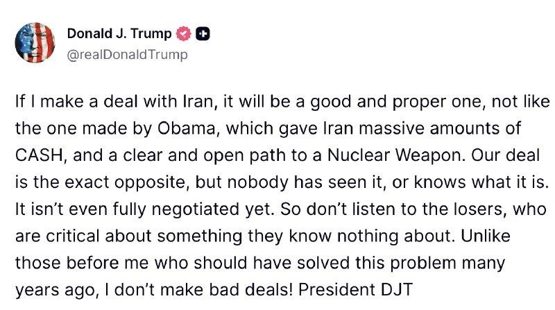

Fox News (Twitter/X)

President Trump says critics are attacking an Iran deal that “isn’t even fully negotiated yet.”

In a lengthy statement, Trump defended ongoing talks while sharply criticizing the Obama administration’s nuclear agreement with Tehran, claiming it handed Iran “massive amounts of CASH” and enabled its nuclear ambitions.

“If I make a deal with Iran, it will be a good and proper one,” Trump wrote before insisting: “I don’t make bad deals.”

The statement comes as the White House continues negotiations amid mounting pressure over Iran’s nuclear program.

## pm_afshaa — post 91416

  <a href="telegram/content/pm_afshaa_91416_1779653648.webm" target="_blank">🎬 Download video</a>

🔴محسن رضایی:
در صورت تعرض به تنگه هرمز و ورود به خلیج‌ فارس، محاصره دریایی رو خواهیم شکست و پاسخی سخت، دردناک و کم‌نظیر به آمریکا خواهیم داد؛ ممکنه از ان‌پی‌تی هم خارج بشیم.

💧 Rainbet.com the #1 Non-KYC Crypto Casino & Sportsbook @rainbetcom

😁 @Pm_Afshaa

## pm_afshaa — post 91415

  <a href="telegram/content/pm_afshaa_91415_1779653649.webm" target="_blank">🎬 Download video</a>

🔴خبرگزاری i24NEWS: مقامات آمریکایی میگن ایران تا زمانی که انتقال ذخایر اورانیوم غنی‌شده خود را آغاز نکنه، هیچ‌گونه تسهیلاتی در زمینه تحریم‌ها یا آزادسازی وجوه مسدود شده دریافت نخواهد کرد.

💧 Rainbet.com the #1 Non-KYC Crypto Casino & Sportsbook @rainbetcom

😁 @Pm_Afshaa

## pm_afshaa — post 91414

  <a href="telegram/content/pm_afshaa_91414_1779653650.webm" target="_blank">🎬 Download video</a>

🔴کانال 12 اسرائیل:
مقام‌های ارشد اسرائیلی نگران‌ هستن توافق در حال شکل‌گیری میان آمریکا و جمهوری اسلامی ممکنه آزادی عمل اسرائیل علیه حزب‌الله در لبنان رو به‌شدت محدود کنه.

💧 Rainbet.com the #1 Non-KYC Crypto Casino & Sportsbook @rainbetcom

😁 @Pm_Afshaa

## pm_afshaa — post 91413

  <a href="telegram/content/pm_afshaa_91413_1779653651.webm" target="_blank">🎬 Download video</a>

🔴سی‌ان‌ان: ایران هیچ پولی یا لغو تحریمی رو در این توافق دریافت نخواهد کرد.

💧 Rainbet.com the #1 Non-KYC Crypto Casino & Sportsbook @rainbetcom

😁 @Pm_Afshaa

## pm_afshaa — post 91412

  <a href="telegram/content/pm_afshaa_91412_1779653652.webm" target="_blank">🎬 Download video</a>

🔴ترامپ:
اگر با ایران معامله‌ای انجام دهم، معامله‌ای خوب و درست خواهد بود، نه مانند معامله‌ای که اوباما انجام داد و به ایران مقادیر زیادی پول نقد و مسیری واضح و باز به سمت سلاح هسته‌ای داد. معامله ما دقیقاً برعکس است، اما هنوز کسی آن را ندیده یا نمی‌داند چیست. حتی هنوز به طور کامل مذاکره هم نشده است.

پس به بازنده‌هایی که از چیزی که هیچ نمی‌دانند انتقاد می‌کنند، گوش ندهید. برخلاف کسانی که قبل از من بودند و باید این مشکل را سال‌ها پیش حل می‌کردند، من معامله‌های بد انجام نمی‌دهم!

💧 Rainbet.com the #1 Non-KYC Crypto Casino & Sportsbook @rainbetcom

😁 @Pm_Afshaa

## pm_afshaa — post 91411

  <a href="telegram/content/pm_afshaa_91411_1779653652.webm" target="_blank">🎬 Download video</a>

🔴باراک راوید، خبرنگار اکسیوس:
با اینکه آمریکا خوشبینه توافق چند روز دیگه امضا بشه، هنوز نهایی نشده و ممکنه از هم بپاشه.

یک مقام ارشد گفته: وضعیت خوبه، ولی راه‌هایی هست که می‌تونه توافق رو ضعیف کنه

💧 Rainbet.com the #1 Non-KYC Crypto Casino & Sportsbook @rainbetcom

😁 @Pm_Afshaa

## DEJradio — post 4927

  <a href="telegram/content/DEJradio_4927_1779653653.mp4" target="_blank">🎬 Download video</a>

👑🎥 تجمع ایرانیان میهن دوست در شهر وین اتریش

#همبستگی #وین
@DEJradio

## VahidOnline — post 75689

  

پست ترامپ
روی تصویر بمب نوشته: از توجه شما به این موضوع سپاسگزارم.
realDonaldTrump

📡 @VahidOnline

## VahidOnline — post 75688

  

مارکو روبیو، وزیر خارجه آمریکا، در گفت‌وگویی کوتاه با نیویورک تایمز گفت: «ما موضوع را به بعد موکول نمی‌کنیم. مذاکرات هسته‌ای مسائل بسیار فنی هستند. شما نمی‌توانید یک موضوع هسته‌ای را در ۷۲ ساعت و روی یک دستمال کاغذی حل کنید.»
او افزود: «در حال حاضر، هفت یا هشت کشور منطقه از این رویکرد حمایت می‌کنند و ما آماده‌ایم این مسیر را ادامه دهیم.»

این در حالی است که آقای روبیو ساعاتی پیش گفته بود که ممکن است تا شامگاه یک‌شنبه خبری دربارهٔ توافقی با ایران اعلام شود که می‌تواند به‌طور رسمی به جنگ خاورمیانه پایان دهد.
@VahidHeadline

📡 @VahidOnline

## IranIntlTV — post 338809

  

اکسیوس به نقل از دو مقام آمریکایی گزارش داد دونالد ترامپ شنبه در یک کنفرانس تلفنی با رهبران چند کشور عربی و دیگر کشورهای مسلمان گفت اگر توافقی برای پایان جنگ ایران حاصل شود، می‌خواهد این کشورها توافق‌های صلح با اسرائیل امضا کنند.

اکسیوس نوشت این اظهارات نشان‌دهنده گام بعدی بزرگی است که ترامپ پس از پایان جنگ در خاورمیانه دنبال می‌کند.

ترامپ در این تماس با رهبران عربستان سعودی، امارات متحده عربی، قطر، پاکستان، ترکیه، مصر، اردن و بحرین درباره توافق در حال شکل‌گیری با جمهوری اسلامی گفت‌وگو کرد.
https://iranintl.com/202605246245

## IranIntlTV — post 338808

  <a href="telegram/content/IranIntlTV_338808_1779653659.mp4" target="_blank">🎬 Download video</a>

نیویورک‌تایمز به نقل از یک مقام آمریکایی گزارش داد توافق میان تهران و واشینگتن هنوز امضا نشده و برای تایید نهایی رهبران دو کشور به چند روز زمان نیاز دارد.

بر اساس این گزارش، توافق احتمالی به برنامه موشکی جمهوری اسلامی و توقف کامل غنی‌سازی اورانیوم نمی‌پردازد.

گفت‌وگو با حسین علیزاده، تحلیل‌گر مسائل بین‌الملل
@iranintltv

## IranIntlTV — post 338807

  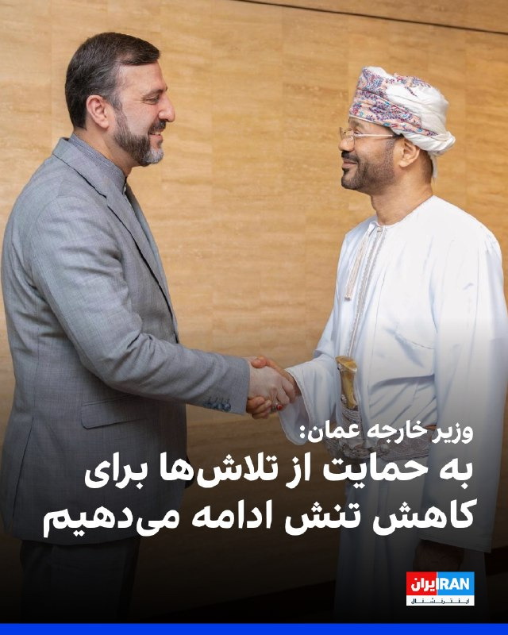

بدر البوسعیدی، وزیر خارجه عمان گفت‌وگوی خود با کاظم غریب‌آبادی، معاون وزیر خارجه جمهوری اسلامی را «خوب» توصیف کرد.

او یکشنبه در شبکه ایکس نوشت: «ما بر اهمیت تعامل دیپلماتیک در همه زمینه‌ها تاکید کردیم. عمان به حمایت از تلاش‌ها برای کاهش تنش، پیشبرد همزیستی مسالمت‌آمیز منطقه‌ای، امنیت و آزادی دریانوردی ادامه خواهد داد.»
https://iranintl.com/202605241490

## IranIntlTV — post 338806

  <a href="https://t.me/IranintlTV/338806" target="_blank">📎 Download file</a>

🎧نسخه صوتی چشم‌انداز: بندهای پنهان توافق ترامپ و جمهوری اسلامی
@iranintlTV

## IranIntlTV — post 338805

  

به گزارش کانال ۱۲ اسرائیل، مقام‌های ارشد اسرائیلی نگران‌اند توافق در حال شکل‌گیری میان آمریکا و ایران ممکن است آزادی عمل اسرائیل علیه حزب‌الله در لبنان را به‌شدت محدود کند.

در این گزارش آمده است توافق پیشنهادی شامل پایان کامل درگیری‌ها در لبنان همزمان با پایان جنگ آمریکا و جمهوری اسلامی خواهد بود؛ موضوعی که باعث شد بنیامین نتانیاهو در تماس تلفنی روز گذشته خود با دونالد ترامپ نگرانی‌هایش را مطرح کند.

بر اساس این گزارش، نتانیاهو بر حفظ آزادی عملیاتی اسرائیل در لبنان تمرکز کرده و یک مقام ارشد اسرائیلی بعدا اعلام کرده است ترامپ موافقت کرده اسرائیل «آزادی عمل خود را در برابر تهدیدها در همه جبهه‌ها، از جمله لبنان، حفظ کند.»
https://iranintl.com/202605247829

## IranIntlTV — post 338804

  <a href="telegram/content/IranIntlTV_338804_1779653664.mp4" target="_blank">🎬 Download video</a>

محسن رضایی، مشاور مجتبی خامنه‌ای، تهدید کرد در صورت اقدام علیه تنگه هرمز و ورود به خلیج فارس، «پاسخ سخت» داده می‌شود و با شکستن محاصره دریایی اقدامات تقابلی آغاز خواهد شد. او یکی از گزینه‌های راهبردی جمهوری اسلامی در صورت تداوم این روند را احتمال خروج از پیمان منع گسترش سلاح‌های هسته‌ای عنوان کرد.

گفت‌وگو با عطا محامد، کارشناس روابط بین‌الملل
@iranintltv

## IranIntlTV — post 338803

  <a href="telegram/content/IranIntlTV_338803_1779653666.mp4" target="_blank">🎬 Download video</a>

نیویورک‌تایمز به نقل از یک مقام آمریکایی گزارش داد آمریکا و جمهوری اسلامی بر سر چارچوبی در حال تفاهم هستند که در آن تنگه هرمز بازگشایی می‌شود و تهران متعهد خواهد شد ذخایر اورانیوم با غنای بالای خود را «نابود» کند.

ارزیابی شهرام خلدی، پژوهش‌گر تاریخ خاورمیانه و روابط بین‌الملل
@iranintltv

## Shin_Persian — post 6212

Shin ✓ @hey_itsmyturn
Sun, 24 May 2026 19:26:45 UTC

If he strikes tonight, I'll follow him to the hell and back :))

فارسی

اگر او امشب حمله کند، من تا جهنم و برگشت دنبالش خواهم رفت :))

𝕏 · @shin_persian

## ManotoTV — post 105816

  <a href="telegram/content/ManotoTV_105816_1779653669.mp4" target="_blank">🎬 Download video</a>

گفت‌وگو با کیوان عباسی بنیان‌گذار تلویزیون منوتو;
«می‌گفت بعضی تصاویر آن‌قدر هولناک بود که باور نمی‌کردیم در ایران ضبط شده باشد…
و تأکید کرد جنایت‌های دی‌ماه نباید فراموش شوند.»

## ManotoTV — post 105815

  <a href="telegram/content/ManotoTV_105815_1779653671.mp4" target="_blank">🎬 Download video</a>

گفت‌وگو با کیوان عباسی بنیان‌گذار تلویزیون منوتو
«می‌گفت هیچ حسرتی ندارد…
و هرچه توانسته برای ساختن و ادامه دادن انجام داده است.»

## ManotoTV — post 105814

  <a href="telegram/content/ManotoTV_105814_1779653675.mp4" target="_blank">🎬 Download video</a>

یک مقام ارشد در دولت ترامپ به شبکه ان بی سی گفته:
«توافق با ایران امروز امضا نخواهد شد، اما در مسیر دستیابی به توافق پیشرفت‌هایی حاصل شده است.»
این اظهارات پس از آن مطرح شد که ترامپ پیش‌تر گفته بود به نمایندگان خود دستور داده است که «برای رسیدن به توافق عجله نکنند».
پیش از آن نیز مارکو روبیو گفته بود که ممکن است «خبرهای خوبی» در راه باشد، هرچند تأکید کرد که هنوز «پیشرفت نهایی» در گفت‌وگوها با جمهوری‌اسلامی حاصل نشده است.

## ManotoTV — post 105813

  <a href="telegram/content/ManotoTV_105813_1779653675.mp4" target="_blank">🎬 Download video</a>

دونالد ترامپ، رئیس‌جمهور آمریکا در پلتفرم تروث سوشال خود نوشت:
«اگر با ایران به توافق برسم، توافقی خوب و درست خواهد بود؛ نه مثل توافقی که باراک اوباما انجام داد و به ایران مقادیر عظیمی پول نقد و مسیری آشکار و باز برای دستیابی به سلاح هسته‌ای داد.»
او افزود: «توافق ما دقیقاً برعکس آن است، اما هنوز کسی آن را ندیده یا از جزئیاتش خبر ندارد. حتی هنوز به‌طور کامل نهایی و مذاکره نشده است. بنابراین به حرف بازنده‌هایی که از چیزی انتقاد می‌کنند که هیچ اطلاعی درباره‌اش ندارند گوش ندهید. برخلاف کسانی که پیش از من بودند و باید سال‌ها پیش این مشکل را حل می‌کردند، من توافق بد انجام نمی‌دهم»

## FarsiVOA — post 218566

  <a href="telegram/content/FarsiVOA_218566_1779653676.mp4" target="_blank">🎬 Download video</a>

⚡️شهرام همایون در عمق میدان می‌گوید من نمی‌فهمم چطورالآن خانم یاسمین پهلوی پُستی می‌گذارد که «ترامپ بزن، بزن» یا بگوید «مرگ بر سه فاسد»! چون در خانواده پهلوی این چیز‌ها نبود
@FarsiVOA

## FarsiVOA — post 218565

🔺محققان آمریکایی: هکرهای مرتبط با رژیم ایران، ایالات متحده، اسرائیل و امارات را هدف قرار داده‌اند

◾️شرکت امنیت سایبری «پالو آلتو نتورکس» در گزارش جدیدی اعلام کرد یک گروه جاسوسی سایبری مرتبط با رژیم ایران در جریان یک کمپین چند ماهه همزمان با تشدید تنش‌های منطقه‌ای اخیر، نهادهایی را در ایالات متحده، اسرائیل و امارات متحده عربی بود، هدف قرار داده است.

⬇️ بیشتر بخوانید:

https://ir.voanews.com/a/8153350.html

## DW_Farsi — post 125108

  

🔶 صدور احکام سنگین در بحرین برای ۱۱ متهم به همکاری با سپاه

خبرگزاری دولتی بحرین گزارش داد که دادگاهی در این کشور ۹ نفر را به اتهام همکاری به سپاه پاسداران به حبس ابد و دو نفر دیگر در همین پرونده را به سه سال زندان محکوم کرده است.

این خبرگزاری یکشنبه ۲۴ مه اعلام کرد، اتهام این افراد همکاری با سپاه و انجام اقداماتی است که دادگاه آن را رشته "عملیات خصمانه و تروریستی" علیه بحرین خوانده است.

بر اساس بیانیه‌ای که در این زمینه در بحرین منتشر شده، این متهمان در زمینه "جمع‌آوری اطلاعات از مراکز حساس و حیاتی و به علاوه، تسهیل انتقال مبالغ مالی مرتبط با این اقدامات" فعال بوده‌اند.
@dw_farsi

## Persian_Trend_Official — post 14891

  

🔴 ترامپ

🔻نوشته ی روی بمب

💢از توجه شما به این موضوع سپاسگزارم

🫆:Tony

📌 @persian_trend_official
پرشین ترند | متفاوت‌ترین کانال نظامی

## Persian_Trend_Official — post 14890

i24NEWS⭕️

آمریکا آزادسازی پول‌های ایران را به انتقال اورانیوم غنی‌شده گره زده است

▪️ مقام‌های آمریکایی می‌گویند ایران تا زمانی که انتقال ذخایر اورانیوم غنی‌شده را آغاز نکند، هیچ کاهش تحریمی یا دسترسی به دارایی‌های بلوکه‌شده دریافت نخواهد کرد
▪️ در مقابل، ایران اصرار دارد آزادسازی بخشی از منابع مالی باید جزو توافق اولیه باشد
▪️ این اختلاف اکنون یکی از اصلی‌ترین موانع توافق میان تهران و واشینگتن محسوب می‌شود

🫆:Tony

📌 @persian_trend_official
پرشین ترند | متفاوت‌ترین کانال نظامی

## Persian_Trend_Official — post 14889

https://youtube.com/live/vCQOD_eWyqM?feature=share

## Persian_Trend_Official — post 14888

https://youtube.com/live/vCQOD_eWyqM?feature=share

## Persian_Trend_Official — post 14887

  <a href="telegram/content/Persian_Trend_Official_14887_1779653679.mp4" target="_blank">🎬 Download video</a>

🔴صیغه کوتاه مدت روزانه و ماهانه در تجمعات خیابانی همچنان برقرار است...

🫆:Tony

📌 @persian_trend_official
پرشین ترند | متفاوت‌ترین کانال نظامی

## Persian_Trend_Official — post 14886

  

سردار نقدی: دشمن اگر خطایی کند، ضربهٔ جبران‌ناپذیری می‌خورد

♦️مشاور عالی فرماندهٔ کل سپاه: ما توانستیم یک بازدارندگی در مقابل دشمن بدست بیاوریم آن هم از این جهت که دشمن متوجه شد که نمی‌تواند مقابل ما به نتیجه مطلوب خود برسد.

♦️یک بعد دیگر بازدارندگی هم این بود که دشمن بداند که اگر بخواهد خطایی کند ضربهٔ جبران‌ناپذیری را خواهد خورد.

♦️امروز این بازدارندگی برای دشمن مشخص شده بگونه‌ای که ۲۸۲ نقطه نظامی آن‌ها منهدم و نیز صدها کشته به دست دشمن باقی مانده است به نحوی که بسیاری از آن‌ها را مخفی کرده‌اند.

♦️روزانه یک هواپیمای ۴۰ تخته بیمارستانی از امارات و یک ۱۰ تخته از کویت مجروحان دشمن را برای درمان به بیمارستان‌های آمریکایی در آلمان منتقل می‌کردند.

⚠️پ ن :تعداد کشته شدگان نظامی امریکا ۱۳ نفر است.
🫆:Tony

📌 @persian_trend_official
پرشین ترند | متفاوت‌ترین کانال نظامی

## RadioFarda — post 157525

  

🔸مارکو روبیو، وزیر خارجه آمریکا، روز یکشنبه سوم خرداد به روزنامه نیویورک تایمز گفت که توافق با ایران حمایت منطقه‌ای را جلب کرده است، اما رسیدن به یک توافق هسته‌ای را نمی‌توان «طی ۷۲ ساعت» انجام داد.

🔸اظهارات او پس از آن مطرح شد که دونالد ترامپ، رئیس‌جمهور آمریکا، ساعتی پیش اعلام کرد به مذاکره‌کنندگان خود گفته برای دستیابی به توافق با ایران جهت پایان دادن به جنگ سه‌ماهه «عجله نکنند.»

🔸روبیو در گفت‌وگویی کوتاه با نیویورک تایمز گفت: «ما موضوع را به بعد موکول نمی‌کنیم. مذاکرات هسته‌ای مسائل بسیار فنی هستند. شما نمی‌توانید یک موضوع هسته‌ای را در ۷۲ ساعت و روی یک دستمال کاغذی حل کنید.»

🔸او افزود: «در حال حاضر، هفت یا هشت کشور منطقه از این رویکرد حمایت می‌کنند و ما آماده‌ایم این مسیر را ادامه دهیم.»

🔸این در حالی است که آقای روبیو ساعاتی پیش گفته بود که ممکن است تا شامگاه یک‌شنبه خبری دربارهٔ توافقی با ایران اعلام شود که می‌تواند به‌طور رسمی به جنگ خاورمیانه پایان دهد.

@RadioFarda

## IranianMinds — post 20696

🔴یک مقام آمریکایی به شبکه فاکس‌نیوز گفت:
ممکن است ترامپ به ایران یک هفته دیگر وقت بدهد تا بتوانند به یک توافق قابل قبول برسند.

@IranianMinds

## IranianMinds — post 20695

  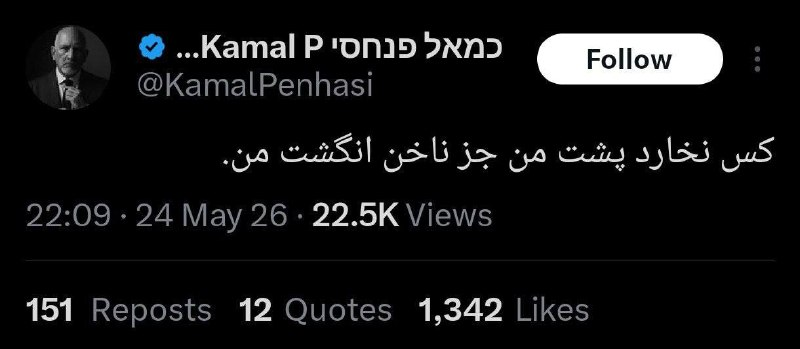

🔴 توئیت کمال پنحاسی، سخنگوی فارسی‌زبان ارتش اسرائیل:

کس نخارد پشت من، جز ناخن انگشت من.

@IranianMinds

## IranianMinds — post 20694

  

🔴 پست جدید ترامپ :

از توجه شما به این موضوع سپاسگزارم!

@IranianMinds

## IranianMinds — post 20693

  

این چیه دیگه 😂😂

@IranianMinds

## IranianMinds — post 20692

🔴 فاکس‌ نیوز به نقل از مقام‌های آمریکایی:

تهران به‌طور اولیه با چارچوب توافق موافقت کرده و ۹۵٪ آن تکمیل شده است و اکنون بر سر جزئیات و نحوه نگارش در حال مذاکره هستیم.

@IranianMinds

## IranianMinds — post 20691

🔴 مارکو روبیو:

دوران به گروگان گرفته شدن کشورها توسط گروه‌های تروریستی در حال نزدیک شدن به پایان است.

@IranianMinds

## BBCPersian — post 281963

  <a href="telegram/content/BBCPersian_281963_1779653685.mp4" target="_blank">🎬 Download video</a>

آخرین خبرهای مهم روز یکشنبه ۳ خرداد ماه ۱۴۰۵ از تلویزیون بی‌بی‌سی فارسی

https://bbc.in/42XnQmy

https://bbc.in/3WtLd3k
@BBCPersian

## Dirty_Kids — post 390102

وقتی کانفیگ جدید میگیرم، با ته‌مونده کانفیگ قبلی میرم اینستا که بار روانی کمتری داشته باشه! :|

@Dirty_Kids 👻

## Dirty_Kids — post 390101

  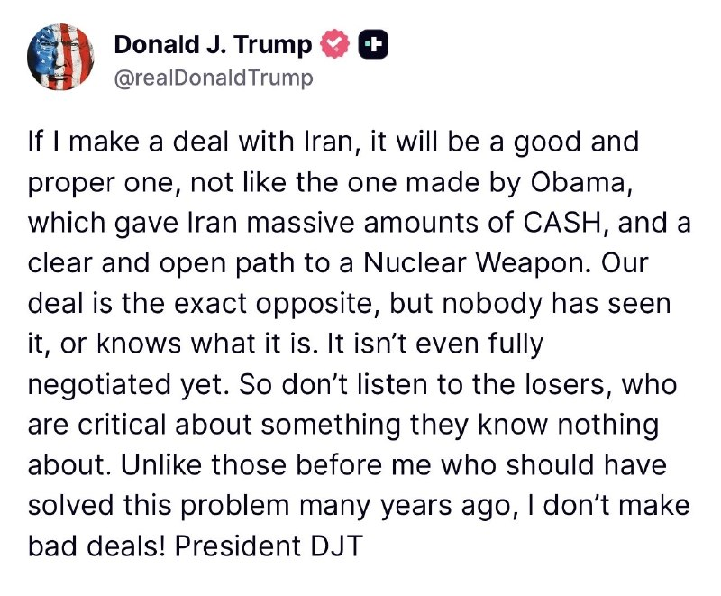

ترامپ:

«اگه من با رژیم هزارپدر شیعه‌سانان رافضی توافق کنم، یه توافق خوب و درست‌وحسابی خواهد بود‌ نه مثه اون توافقی که اوبامای قرمساق کرد و کوهی از پول نقد داد به روافض و یه مسیر صاف و باز رو براشون گذاشت تا برسن به سلاح هسته‌ای.[کسشر نگو شیر سابق، هر توافقی با رژیم خدعه‌گر رافضی سرش گرده]

توافق ما دقیقاً برعکس اونه، اما هنوز هیچ‌کس ندیدتش و نمی‌دونه چیه. حتی هنوز مذاکراتش هم کاملاً تموم نشده.

پس به حرف این بازنده‌ها گوش ندید که دارن از چیزی انتقاد می‌کنن که اصلاً هیچی ازش نمی‌دونن.[خب خودت که می‌دونی بگو ببینیم چه کسشری توشه]

برخلاف اون قرمساق‌هایی که قبل از من بودن و باید این مشکل رو سال‌ها پیش حل می‌کردن، من توافق بد امضا نمی‌کنم. [دمت گرم، اینو راست می‌گی خدایی، تو این پنج‌سال و نیم ندیدم توافق کسشر امضا کنی]
رئیس‌جمهور، دی‌جی‌تی، سل سابق خاک‌سفید»

@Dirty_Kids 👻

## Dirty_Kids — post 390100

  <a href="telegram/content/Dirty_Kids_390100_1779653689.mp4" target="_blank">🎬 Download video</a>

خبرنگار: به توافق نزدیک شدیم؛ نظر شما چیه؟

سیاری، رئیس ستاد و معاون هماهنگ کننده ارتش: توافق؟ من اصلا نمی‌دونم توافق چیه.. توافق نَ‌مَ‌نَ‌دی

@Dirty_Kids 👻

## Dirty_Kids — post 390099

  

عموی عزیزم دونالد ترامپ
هم بابامو کشت هم خودش منتقم خون بابام شد

@Dirty_Kids 👻

## Dirty_Kids — post 390098

کاش حداقل روبیو که رفته هند، اونا رو متقاعد کنه موشک بزنن پاکستان.

@Dirty_Kids 👻

## Hranews — post 113144

  

روح الله کرکی، زندانی سیاسی به اعدام محکوم شد

❗️
❗️
❗️
❗️
❗️ – روح الله کرکی، زندانی سیاسی محبوس در زندان شیبان اهواز به اعدام محکوم شد.

به گزارش خبرگزاری هرانا، ارگان خبری مجموعه فعالان حقوق بشر در ایران، روح الله کرکی به اعدام محکوم شد.

بر اساس اطلاعات دریافتی هرانا، روح الله کرکی به اعدام محکوم شده است. چندی پیش، کیفرخواست پرونده این شهروند از بابت اتهامات «انتشار و افشای اسناد محرمانه»، «همکاری با سازمان مجاهدین خلق»، «جاسوسی برای اسرائیل و تبادل اطلاعات نظامی و امنیتی»، «توهین به مقدسات و مقامات» و «اقدام علیه امنیت ملی» صادر و به دادگاه کیفری دو اهواز ارجاع شده بود.
#روح_الله_کرکی

ادامه مطلب

↘️
@hranews_bot تماس ✉️ -  @Hranews  کانال هرانا 🆑

## Hranews — post 113143

  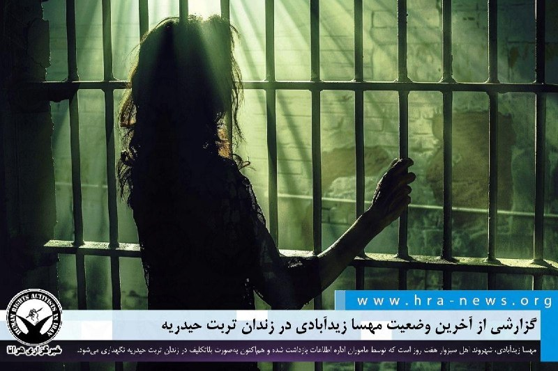

گزارشی از آخرین وضعیت مهسا زیدآبادی در زندان تربت حیدریه

❗️
❗️
❗️
❗️
❗️ – مهسا زیدآبادی، شهروند اهل سبزوار هفت روز است که توسط ماموران اداره اطلاعات بازداشت شده و هم‌اکنون به‌صورت بلاتکلیف در زندان تربت حیدریه نگهداری می‌شود.

به گزارش خبرگزاری هرانا، ارگان خبری مجموعه فعالان حقوق بشر در ایران، مهسا زیدآبادی کماکان در بازداشت به‌سر می برد.

بر اساس اطلاعات دریافتی هرانا، خانم زیدآبادی روز دوشنبه ۲۸ اردیبهشت ماه، به اداره اطلاعات سبزوار احضار و پس از مراجعه به این نهاد امنیتی بازداشت شد. وی پس از دستگیری به زندان تربت حیدریه منتقل شده است.
#مهسا_زیدآبادی

ادامه مطلب

↘️
@hranews_bot تماس ✉️ -  @Hranews  کانال هرانا 🆑

## Hranews — post 113142

گزارشی از تجمع اعتراضی بازنشستگان تامین اجتماعی در ۳ شهر

❗️
❗️
❗️
❗️
❗️ – روز جاری، گروهی از بازنشستگان تامین اجتماعی در شهرهای تهران، رشت و شوش تجمعات اعتراضی برگزار کردند.
#تجمع

ادامه مطلب

↘️
@hranews_bot تماس ✉️ -  @Hranews  کانال هرانا 🆑

## Hranews — post 113141

یک مرد به اتهام قتل همسرش در دادگاه کیفری تهران محاکمه شد

❗️
❗️
❗️
❗️
❗️ – مردی که متهم است همسرش را با خوراندن قرص برنج به قتل رسانده است، در دادگاه کیفری استان تهران محاکمه شد.

#زنکشی

ادامه مطلب

↘️
@hranews_bot تماس ✉️ -  @Hranews  کانال هرانا 🆑

## manototv — post 105816

  <a href="telegram/content/manototv_105816_1779653692.mp4" target="_blank">🎬 Download video</a>

گفت‌وگو با کیوان عباسی بنیان‌گذار تلویزیون منوتو;
«می‌گفت بعضی تصاویر آن‌قدر هولناک بود که باور نمی‌کردیم در ایران ضبط شده باشد…
و تأکید کرد جنایت‌های دی‌ماه نباید فراموش شوند.»

## manototv — post 105815

  <a href="telegram/content/manototv_105815_1779653695.mp4" target="_blank">🎬 Download video</a>

گفت‌وگو با کیوان عباسی بنیان‌گذار تلویزیون منوتو
«می‌گفت هیچ حسرتی ندارد…
و هرچه توانسته برای ساختن و ادامه دادن انجام داده است.»

## manototv — post 105814

  <a href="telegram/content/manototv_105814_1779653698.mp4" target="_blank">🎬 Download video</a>

یک مقام ارشد در دولت ترامپ به شبکه ان بی سی گفته:
«توافق با ایران امروز امضا نخواهد شد، اما در مسیر دستیابی به توافق پیشرفت‌هایی حاصل شده است.»
این اظهارات پس از آن مطرح شد که ترامپ پیش‌تر گفته بود به نمایندگان خود دستور داده است که «برای رسیدن به توافق عجله نکنند».
پیش از آن نیز مارکو روبیو گفته بود که ممکن است «خبرهای خوبی» در راه باشد، هرچند تأکید کرد که هنوز «پیشرفت نهایی» در گفت‌وگوها با جمهوری‌اسلامی حاصل نشده است.

## manototv — post 105813

  <a href="telegram/content/manototv_105813_1779653699.mp4" target="_blank">🎬 Download video</a>

دونالد ترامپ، رئیس‌جمهور آمریکا در پلتفرم تروث سوشال خود نوشت:
«اگر با ایران به توافق برسم، توافقی خوب و درست خواهد بود؛ نه مثل توافقی که باراک اوباما انجام داد و به ایران مقادیر عظیمی پول نقد و مسیری آشکار و باز برای دستیابی به سلاح هسته‌ای داد.»
او افزود: «توافق ما دقیقاً برعکس آن است، اما هنوز کسی آن را ندیده یا از جزئیاتش خبر ندارد. حتی هنوز به‌طور کامل نهایی و مذاکره نشده است. بنابراین به حرف بازنده‌هایی که از چیزی انتقاد می‌کنند که هیچ اطلاعی درباره‌اش ندارند گوش ندهید. برخلاف کسانی که پیش از من بودند و باید سال‌ها پیش این مشکل را حل می‌کردند، من توافق بد انجام نمی‌دهم»

## alonews — post 122437

  <a href="telegram/content/alonews_122437_1779653700.webm" target="_blank">🎬 Download video</a>

👈نیویورک‌پست: احتمال رسیدن به توافق بین ایالات متحده و ایران به طور فزاینده‌ای کاهش یافته است

✅ @AloNews خبر جنگ

## alonews — post 122436

  <a href="telegram/content/alonews_122436_1779653700.webm" target="_blank">🎬 Download video</a>

👈بنیامین نتانیاهو، نخست‌وزیر اسرائیل، به طور خصوصی اذعان می‌کند که اسرائیل در حال حاضر توانایی محدودی برای تأثیرگذاری بر رئیس‌جمهور ترامپ دارد و فشار آوردن به رئیس‌جمهور آمریکا دشوار شده است، طبق گزارش کانال ۱۳ اسرائیل

✅ @AloNews خبر جنگ

## alonews — post 122435

  <a href="telegram/content/alonews_122435_1779653700.webm" target="_blank">🎬 Download video</a>

👈سردار نقدی: اسرائیل و آمریکا ۲۱۰۰ پرتابه و ۳۰۰ موشک زمین‌به‌زمین به جزیرهٔ بوموسی شلیک کرد اما رزمندگان ما بدون هیچ ضعفی ایستادگی کردند

✅ @AloNews خبر جنگ

## alonews — post 122434

  <a href="telegram/content/alonews_122434_1779653700.webm" target="_blank">🎬 Download video</a>

👈واکنش پسر ترامپ به منتقدان توافق با ایران:

🔴ما باید افرادی که فقط با حمله زمینی به ایران خوشحال می‌شوند را نادیده بگیریم.

✅ @AloNews خبر جنگ

## alonews — post 122433

  <a href="telegram/content/alonews_122433_1779653701.mp4" target="_blank">🎬 Download video</a>

🔴زنده یاد مانوک خدابخشیان:
خدمت دوستانی که پنیک کردن از مذاکرات

✅@AloNews

## alonews — post 122432

  <a href="telegram/content/alonews_122432_1779653704.webm" target="_blank">🎬 Download video</a>

👈سخنگوی کمیسیون امنیت ملی مجلس با تاکید بر اینکه اداره تنگه هرمز به وضعیت قبل از جنگ باز نخواهد گشت، تصریح کرد که این تنگه تحت مدیریت ایران است

✅ @AloNews خبر جنگ

## alonews — post 122431

  <a href="telegram/content/alonews_122431_1779653704.webm" target="_blank">🎬 Download video</a>

🔴فوووووری / پست جدید ترامپ!!!!!!!!!! 
✅ @AloNews خبر جنگ

## alonews — post 122429

  <a href="telegram/content/alonews_122429_1779653704.webm" target="_blank">🎬 Download video</a>

🔴فوووووری / پست جدید ترامپ!!!!!!!!!!

✅ @AloNews خبر جنگ

## alonews — post 122428

  <a href="telegram/content/alonews_122428_1779653705.webm" target="_blank">🎬 Download video</a>

👈توییتِ سخنگوی فارسی زبان ارتش اسرائیل و طعنه به ترامپ

✅ @AloNews خبر جنگ

## alonews — post 122427

  <a href="telegram/content/alonews_122427_1779653705.mp4" target="_blank">🎬 Download video</a>

🔴این ویدیوی کوتاه که توسط حکومت جمهوری اسلامی و برای ایجاد رعب و وحشت تولید و منتشر شده است، بخشی از روایت ۳ دقیقه و ۴۶ ثانیه‌ای بازجو خبرنگار،«محمد نگینی‌پور» است.

🔴این حجم از کانتینرهایی که گوینده ویدیو هم به زیاد بودن آن اذعان دارد حامل پیکر عزیزان کشته شده در اعتراضات اخیر و سندی واضح برای محاکمه عاملان و آمران این جنایت علیه بشریت است. صدا و سیما هر تولیدی که در رابطه با کشتار مردم دارد سندی روشن از قتل‌ عام شهروندان بی سلاح توسط حکومت است و باید ثبت و نگهداری و مستند شود.

🔴تاریخ انتشار این ویدیو در صفحه شخصی شبکه اجتماعی این بازجو خبرنگار ۲۴ دی ۱۴۰۴ است ولی ویدیو روز ۲۰ دی ضبط شده است.

🔴محمد نگینی‌پور، مستندساز است که پیشتر در رسانه‌های وابسته به سپاه پاسداران از جمله خبرگزاری های فارس، تسنیم و مهر و شبکه افق صداو سیمای حکومتی فعالیت داشته است.

✅@AloNews

## alonews — post 122426

  <a href="telegram/content/alonews_122426_1779653708.webm" target="_blank">🎬 Download video</a>

👈 واکنش دیوید ونس، پادکستر و تحلیلگر مشهور آمریکایی به خبر احتمال توافق ایران و آمریکا:

🔴ایران ۱ - ۰ آمریکا

✅ @AloNews خبر جنگ

## alonews — post 122425

  <a href="telegram/content/alonews_122425_1779653708.webm" target="_blank">🎬 Download video</a>

👈 یک مقام ارشد آمریکایی به شبکه فاکس نیوز گفت که هیچ توافقی «امروز یا فردا» امضا نخواهد شد و افزود که رئیس‌جمهور ترامپ تمایل دارد به فرآیند چند روز دیگر برای رسیدن به نتیجه نهایی بدهد.

🔴این مقام گفت که رویکرد دولت توسط سیاست «بدون گرد و غبار، بدون دلار» هدایت می‌شود، به این معنی که ایران بدون برآوردن کامل تعهدات خود، از تخفیف تحریم‌ها یا منافع مالی بهره‌مند نخواهد شد.

🔴تفاهماتی در مورد انبار اورانیوم غنی‌شده و بازگشایی تنگه هرمز حاصل شده است، در حالی که نگارش نهایی همچنان در حال مذاکره است.

🔴آمریکا آماده است تا در صورت شکست مذاکرات یا تولید آنچه آن را «توافق بد» می‌داند، حملات نظامی را از سر گیرد.

✅ @AloNews خبر جنگ

## alonews — post 122424

  <a href="telegram/content/alonews_122424_1779653709.webm" target="_blank">🎬 Download video</a>

👈آی ۲۴ نیوز: مقامات آمریکایی می‌گویند ایران تا زمانی که انتقال ذخایر اورانیوم غنی‌شده خود را آغاز نکند، هیچ‌گونه تسهیلاتی در زمینه تحریم‌ها یا آزادسازی وجوه مسدود شده دریافت نخواهد کرد.

🔴در عین حال، ایران بر این باور است که آزادسازی وجوه باید بخشی از هر توافق‌نامه چارچوبی باشد.

✅ @AloNews خبر جنگ

## alonews — post 122423

  <a href="telegram/content/alonews_122423_1779653709.webm" target="_blank">🎬 Download video</a>

🔴کشتی HMS Lyme Bay در حال بارگیری مهمات، تدارکات و پهپادهای دریایی شکار مین در جبل‌الطارق مشاهده شد، در حالی که در مسیر حرکت به سمت منطقه تنگه هرمز است.

✅@AloNews

## alonews — post 122422

  <a href="telegram/content/alonews_122422_1779653710.webm" target="_blank">🎬 Download video</a>

⚫
🏆 به دنیای هیجان‌انگیز فوتبال خوش اومدی!

⭐️اینجا قراره باهم لحظه‌به‌لحظه‌ی جام جهانی رو زندگی کنیم؛
از بازی‌های حساس و نتایج داغ گرفته تا حاشیه‌ها، کری‌خونی‌ها و اتفاقاتی که همه درباره‌ش حرف میزنن! 
🔥
🔥

✅ پوشش کامل مسابقات

💀 ترول تیم‌ها و بازیکن‌ها

🎥 ویدیوها و لحظه‌های فان فوتبالی

📊 آمار، ترکیب‌ها و اخبار فوری

🌍 حواشی جذاب از سراسر جام جهانی

📢اینجا فقط یک کانال خبری نیست؛
یک جمع فوتبالیه برای کسایی که فوتبال رو با هیجان، شوخی و احساس واقعی دنبال میکنن 
📛
💟

🆘
🔞 آماده باش چون قراره جام جهانی رو متفاوت تجربه کنیم!

⚡ @Vaarzesh_Plus

⚡ @Vaarzesh_Plus

## alonews — post 122421

  <a href="telegram/content/alonews_122421_1779653710.webm" target="_blank">🎬 Download video</a>

👈وزیر خارجه عمان: گفت‌و‌گو‌های خوبی با غریب‌آبادی داشتیم

🔴 همچنان به حمایت از تلاش‌ها برای کاهش تنش، پیشبرد همزیستی مسالمت‌آمیز منطقه‌ای، امنیت و آزادی کشتیرانی ادامه خواهیم داد

✅ @AloNews خبر جنگ

## alonews — post 122420

  <a href="telegram/content/alonews_122420_1779653711.webm" target="_blank">🎬 Download video</a>

👈ادعای بلومبرگ: با ادامه مذاکرات، ابرنفتکش حامل نفت خام عراق از خلیج فارس خارج شد

✅ @AloNews خبر جنگ

## alonews — post 122419

  <a href="telegram/content/alonews_122419_1779653711.webm" target="_blank">🎬 Download video</a>

👈دونالد ترامپ جونیور در اکس نوشت:
این یک پیروزی بزرگ برای آمریکاست. ما باید افرادی که فقط با حمله زمینی به ایران خوشحال می‌شوند را نادیده بگیریم.

🔴پدر من قول داده بود که جلوی دستیابی ایران به سلاح هسته‌ای را بگیرد و این دقیقاً همان چیزی است که او به آن دست می‌یابد!

✅ @AloNews خبر جنگ

## alonews — post 122418

  <a href="telegram/content/alonews_122418_1779653711.webm" target="_blank">🎬 Download video</a>

👈اکسیوس: ترامپ از چندین رهبر مسلمان و عرب خواست تا در صورت پایان یافتن جنگ ایران با یک توافق، به توافقنامه‌های ابراهیم با اسرائیل بپیوندند

✅ @AloNews خبر جنگ

## alonews — post 122417

  <a href="telegram/content/alonews_122417_1779653712.webm" target="_blank">🎬 Download video</a>

👈روبیو: ایالات متحده کاملاً از تلاش‌های دولت مشروع لبنان برای بازسازی، بهبود و ثبات حمایت می‌کند.

🔴اقدامات اخیر حزب‌الله یک کمپین عمدی برای بی‌ثبات کردن لبنان و حفظ نفوذ خود به قیمت جان مردم لبنان است.

🔴حزب‌الله در تلاش است لبنان را دوباره به هرج و مرج و ویرانی بکشاند.

🔴ایالات متحده قاطعانه در کنار دولت لبنان می‌ایستد تا اقتدار خود را بازیابد و آینده‌ای بهتر برای مردمش بسازد.

🔴دوران گروگان‌گیری کشورها توسط گروه‌های تروریستی به پایان خود نزدیک می‌شود.

✅ @AloNews خبر جنگ

---
📅 بروزرسانی: 1405/03/03 22:29
---

## VahidOOnLine — post 241986

  

♦️یک منبع آمریکایی، شامگاه یکشنبه سوم خرداد ماه در گفتگو با شبکه خبری العربیه اعلام کرد پیش‌نویس توافق میان واشنگتن و تهران شامل بندهایی درباره آتش‌بس و پایان درگیری‌ها در لبنان است.

به گفته این منبع، توافق آمریکا و ایران همان بندهای مرتبط با آتش‌بس را که در ۱۵ مه مطرح شده بود، در بر می‌گیرد و بر «پایان جنگ منطقه‌ای» تمرکز دارد.

این منبع افزود پیش‌نویس توافق شامل تعهد به پایان دادن به خصومت‌ها در لبنان است، اما بندی درباره خلع سلاح حزب‌الله و جمع‌آوری سلاح‌های این گروه در لبنان در آن وجود ندارد.

این منبع همچنین گفت توافق احتمالی میان آمریکا و ایران شامل بازگشایی تنگه هرمز و کنار گذاشتن اورانیوم غنی‌شده از سوی تهران خواهد بود.
‌🇸🇦 Indypersian

🤖 @VahidOOnLine

## VahidOOnLine — post 241985

  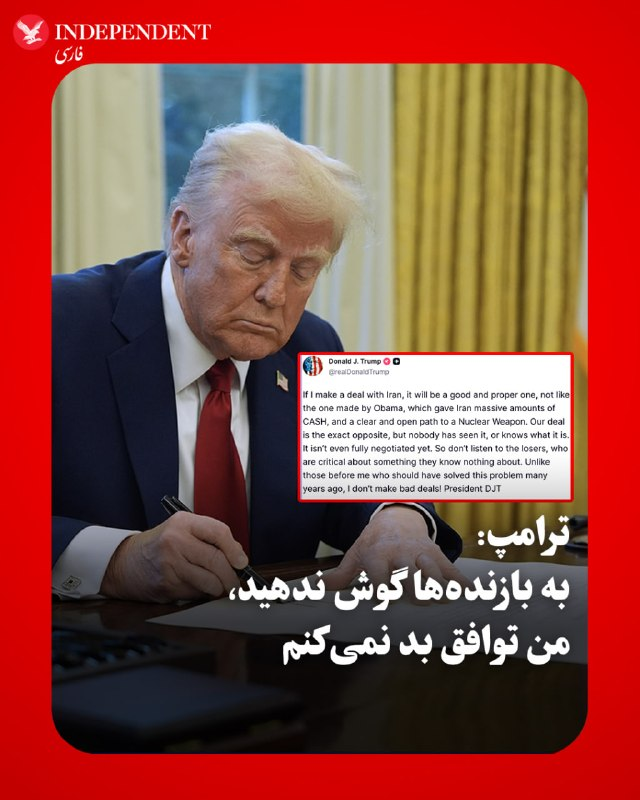

♦️دونالد ترامپ، رئیس‌جمهوری آمریکا، شامگاه یکشنبه سوم خرداد در شبکه اجتماعی تروث سوشال نوشت اگر با ایران به توافق برسد، این توافق «خوب و درست» خواهد بود و شباهتی به توافق هسته‌ای دوره باراک اوباما نخواهد داشت.
ترامپ در این پیام نوشت: «اگر با ایران توافقی انجام دهم، توافقی خوب و درست خواهد بود؛ نه مانند توافقی که اوباما انجام داد و پول نقد عظیمی به ایران داد و مسیری روشن و آشکار برای دستیابی به سلاح هسته‌ای در اختیارش گذاشت.»
او افزود: «توافق ما دقیقا برعکس آن است، اما هنوز کسی آن را ندیده و نمی‌داند چیست. این توافق حتی هنوز به‌طور کامل مذاکره هم نشده است.»
رئیس‌جمهوری آمریکا همچنین منتقدان مذاکرات با ایران را «بازنده» توصیف کرد و گفت: «به بازنده‌هایی گوش ندهید که درباره چیزی انتقاد می‌کنند که هیچ اطلاعی از آن ندارند.»
ترامپ در پایان نوشت: «برخلاف کسانی که پیش از من بودند و باید سال‌ها پیش این مشکل را حل می‌کردند، من توافق بد انجام نمی‌دهم.»
‌🇸🇦 Indypersian

🤖 @VahidOOnLine

## VahidOOnLine — post 241984

  

دونالد ترامپ در تروث‌سوشال نوشت اگر با جمهوری اسلامی توافقی انجام دهد، توافقی خوب و درست خواهد بود؛ نه مانند توافق اوباما که مبالغ هنگفتی پول نقد به تهران داد و مسیری آشکار برای دستیابی این کشور به سلاح هسته‌ای فراهم کرد.

او افزود توافق دولتش دقیقا برعکس آن است، اما هنوز کسی آن را ندیده و نمی‌داند شامل چه مواردی است و این توافق هنوز به‌طور کامل نهایی نشده است.

ترامپ گفت به کسانی که درباره موضوعی که اطلاعی از آن ندارند انتقاد می‌کنند گوش ندهید و تاکید کرد برخلاف دولت‌های پیشین، توافق بد انجام نخواهد داد.
‌🏁 🇬🇧 IranintlTV

🤖 @VahidOOnLine

## VahidOOnLine — post 241983

  

♦️روزنامه نیویورک تایمز عصر یکشنبه سوم خرداد ما به نقل از یک مقام ارشد آمریکایی گزارش کرد، ایالات متحده و ایران بر سر توافقی برای کاهش تنش‌ها و پایان دادن به جنگ در خاورمیانه به تفاهم رسیده‌اند. توافقی که شامل بازگشایی تنگه هرمز و تعهد ایران به کنار گذاشتن ذخایر اورانیوم با غنای بالا می‌شود.
این مقام آمریکایی به نیویورک تایمز گفت، هنوز هیچ توافقی امضا نشده و نهایی شدن آن نیازمند تایید نهایی دونالد ترامپ، رئیس‌جمهوری آمریکا و مجتبی خامنه‌ای، رهبر جمهوری اسلامی است و این روند ممکن است چند روز طول بکشد.
با اینهمه این مقام کاخ سفید گفته است، سازوکار کنار گذاشتن اورانیوم غنی‌شده همچنان در حال مذاکره است.
ترامپ روز شنبه اعلام کرده بود دو کشور «تا حد زیادی» بر سر یک تفاهم‌نامه مرتبط با «صلح» مذاکره کرده‌اند، اما روز یکشنبه گفت به مذاکره‌کنندگان آمریکایی دستور داده «برای رسیدن به توافق عجله نکنند.»
این مقام آمریکایی همچنین به نیویورک تایمز گفت در صورت نهایی شدن توافق، آمریکا می‌تواند محاصره بنادر ایران را که برای فشار به تهران و بازگشایی تنگه هرمز اعمال کرده بود، پایان دهد.
‌🇸🇦 Indypersian

🤖 @VahidOOnLine

## VahidOOnLine — post 241982

  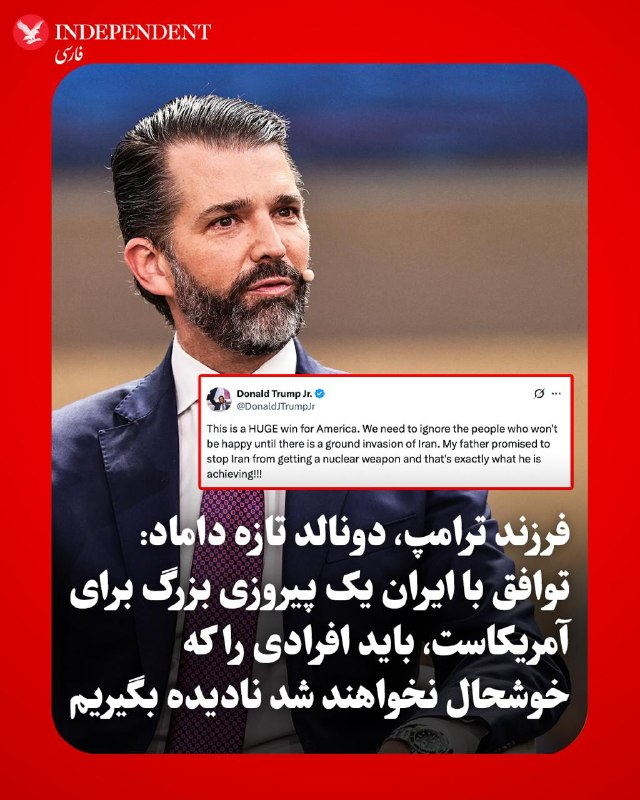

♦️دونالد ترامپ جوان، پسر رئیس‌جمهوری آمریکا، روز یکشنبه با بازنشر پیامی در شبکه اجتماعی اکس، توافق احتمالی با ایران را «یک پیروزی بزرگ برای آمریکا» توصیف کرد و نوشت مخالفان این توافق فقط به‌دنبال حمله زمینی به ایران هستند.
فرزند رئیس جمهوری امریکا که به تازگی جشن ازدواجش را برگزاری کرده است، نوشت: «این یک پیروزی بزرگ برای آمریکاست. باید کسانی را که تا زمانی که حمله زمینی به ایران انجام نشود، راضی نخواهند شد نادیده بگیریم. پدرم قول داده بود مانع دستیابی ایران به سلاح هسته‌ای شود و دقیقا همین کار را انجام می‌دهد.»
ترامپ جوان این اظهارات را در بازنشر پیامی مطرح کرد که در آن گفته شده بود توافقِ در حال شکل‌گیری با ایران، بسیار فراتر از برجام است و برخلاف توافق هسته‌ای دوره باراک اوباما، می‌تواند مانع دستیابی تهران به سلاح هسته‌ای شود.
دونالد ترامپ جوان و بتینا اندرسون در تعطیلات آخر هفته آمریکا با برگزاری مراسمی خصوصی در جزیره‌ای اختصاصی در باهاما با یکدیگر ازدواج کردند.
رئیس جمهوری آمریکا پیش‌تر اعلام کرده بود برای رهبری مذاکرات با ایران، در جشن عروسی فرزندش شرکت نخواهد کرد.
‌🇸🇦 Indypersian

🤖 @VahidOOnLine

## VahidOOnLine — post 241981

  <a href="telegram/content/VahidOOnLine_241981_1779649177.mp4" target="_blank">🎬 Download video</a>

تماسی با خانواده جاویدنام مهدی اسکندریان:
«روی صحبتم با طرفداران جمهوری اسلامیه…
با کشتن جاویدنام‌ها فقط آدم‌های بیشتری را علیه خودتان ساختید؛
و خانواده‌های دادخواه این درد را فراموش نخواهند کرد.»
‌🏁 🇬🇧 ManotoTV

🤖 @VahidOOnLine

## VahidOOnLine — post 241980

  

♦️دو ورزشکار زن ایرانی با کسب عنوان نایب‌قهرمانی در «هفتمین دوره رقابت‌های ترامپولین قهرمانی آسیا»، نخستین مدال رشته ورزشی ژیمناستیک زنان ایران را بر گردن آویختند.

به گزارش خبرگزاری مهر، «یلدا حسن‌شوکتی» و «شقایق چراغی» روز یکشنبه سوم خرداد ماه، در رشته هماهنگ دو نفره بزرگسالان موفق به کسب عنوان نایب‌قهرمانی آسیا شدند.

نخستین حضور زنان ژیمناستیک کار ایرانی در رقابت‌های جهانی به در المپیک ۱۹۶۴ توکیو باز می‌گردد. جمیله سروری عضو کاروان المپیک ایران در آن دوره، با فقط ۱۴ سال به عنوان جوان‌ترین ورزشکار کاروان ایران در تاریخ المپیک شناخته شد.
‌🇸🇦 Indypersian

🤖 @VahidOOnLine

## VahidOOnLine — post 241979

  <a href="telegram/content/VahidOOnLine_241979_1779649179.mp4" target="_blank">🎬 Download video</a>

♦️در پی حمله‌ای تروریستی به قطار حامل نیروهای نظامی پاکستان در شهر کویته پاکستان، دست‌کم ۲۴ نفر کشته و بیش از ۵۰ نفر زخمی شدند. مقام‌های پاکستانی اعلام کردند تعدادی از نیروهای ارتش در میان قربانیان هستند.
به گفته یک مقام محلی استان بلوچستان پاکستان، این قطار حامل نیروهای ارتش و اعضای خانواده‌های آن‌ها بود و از کویته به سمت پیشاور در حرکت بود که در منطقه «چمن پاتک» هدف خودرویی بمب‌گذاری‌شده قرار گرفت. در نتیجه این انفجار، یکی از واگن‌ها واژگون شد و خودروهای اطراف نیز آسیب دیدند.
گروه جدایی‌طلب «ارتش آزادی‌بخش بلوچستان» مسئولیت این حمله را بر عهده گرفته است. این گروه که آمریکا آن را سازمانی تروریستی می‌داند، در سال‌های اخیر حملات خود علیه نیروهای امنیتی و شرکت‌های خارجی فعال در بلوچستان را افزایش داده است.
شهباز شریف، نخست‌وزیر پاکستان، این حمله را «اقدامی تروریستی و بزدلانه» توصیف کرد و گفت چنین حملاتی اراده مردم پاکستان را تضعیف نخواهد کرد.
‌🇸🇦 Indypersian

🤖 @VahidOOnLine

## VahidOOnLine — post 241978

  <a href="telegram/content/VahidOOnLine_241978_1779649180.mp4" target="_blank">🎬 Download video</a>

کاخ سفید می‌گوید مذاکرات با جمهوری اسلامی به مرحله حساسی رسیده اما هنوز توافق نهایی نشده و ممکن است چند روز دیگر طول بکشد. بر اساس پیش‌نویس توافق، جمهوری اسلامی درباره محدودیت غنی‌سازی و کنار گذاشتن ذخایر اورانیوم مذاکره می‌کند و در مقابل احتمال کاهش تحریم‌ها وجود دارد. ترامپ تأکید کرده آمریکا برای توافق عجله ندارد و محاصره دریایی فعلاً ادامه خواهد داشت. همزمان اسرائیل نسبت به توافق احتمالی ابراز نگرانی کرده و خواستار حذف کامل برنامه غنی‌سازی جمهوری اسلامی شده است.
‌🏁 🇬🇧 ManotoTV

🤖 @VahidOOnLine

## WithYashar — post 12366

وزیر امور خارجه ایالات متحده مارکو روبیو گفت که توافق احتمالی با ایران حمایت منطقه‌ای دریافت کرده است، اما هشدار داد که یک توافق هسته‌ای نمی‌تواند «در ۷۲ ساعت روی پشت یک دستمال کاغذی» به دست آید.
@withyashar

## WithYashar — post 12365

## WithYashar — post 12364

  

ترامپ در شبکه Truth Social:

اگر من با ایران به توافق برسم، آن یک توافق خوب و اصولی خواهد بود؛ نه مثل توافقی که اوباما انجام داد و به ایران مقادیر زیادی پول نقد داد و یک مسیر کاملاً باز برای دستیابی به سلاح هسته‌ای فراهم کرد.

توافق ما دقیقاً برعکس آن است، اما هنوز کسی آن را ندیده و نمی‌داند دقیقاً چیست. حتی به طور کامل هم نهایی نشده است. پس به افراد شکست‌خورده‌ای که درباره چیزی که از آن هیچ اطلاعی ندارند انتقاد می‌کنند، گوش ندهید.

برخلاف کسانی که قبل از من بودند و باید سال‌ها پیش این مشکل را حل می‌کردند، من توافق‌های بد امضا نمی‌کنم.
@withyashar

## WithYashar — post 12363

ترامپ:محاصره دریایی علیه ایران به صورت کامل ادامه دارد
@withyashar

## WithYashar — post 12362

## WithYashar — post 12361

## WithYashar — post 12360

نیویورک تایمز: یک مقام آمریکایی می‌گوید ایالات متحده و ایران در اصول برای بازگشایی تنگه هرمز توافق کرده‌اند
@withyashar

## WithYashar — post 12359

## WithYashar — post 12358

مقام آمریکایی به CNN:

تحریم‌ها علیه ایران نمی‌تواند قبل از مهار برنامه هسته‌ای آن کاهش یابد

وی گفت: ما در مورد آزادسازی وجوه ایران به عنوان بخشی از توافق مذاکره نکرده‌ایم.

@withyashar

## WithYashar — post 12357

رسانه‌های داخلی: آمریکا مانع آزادسازی پول‌های مسدود شدست، احتمال لغو توافق وجود دارد
@withyashar

## WithYashar — post 12356

به قول مانوک اگه الان آشمز شدید این رو هم ببینید…
@withyashar

## WithYashar — post 12355

طبق گزارش فاکس نیوز، ترامپ می‌خواهد توافق پیشنهادی توسط مذاکره‌کنندگان او، از جمله استیو ویتکوف و جرد کوشنر، اجرا شود؛ اگر این شرایط برآورده نشوند، هیچ توافقی صورت نخواهد گرفت.
@withyashar

## mwarmonitor — post 9657

🔴وزیر خارجه ایالات متحده، می‌گوید که یک توافق با ایران از حمایت منطقه‌ای برخوردار شده است، اما تأکید می‌کند که دستیابی به یک توافق هسته‌ای «در ۷۲ ساعت و روی پشت یک دستمال کاغذی» ممکن نیست.

@mwarmonitor

## mwarmonitor — post 9656

  

🔴اگر من با ایران توافقی کنم، توافقی خوب و مناسب خواهد بود؛ نه مثل توافقی که اوباما انجام داد، که مقادیر انبوهی پول نقد و یک مسیر واضح و باز برای رسیدن به سلاح هسته‌ای در اختیار ایران قرار داد.
توافق ما دقیقاً برعکس آن است، اما هیچ‌کس هنوز آن را ندیده و نمی‌داند چیست. این توافق حتی هنوز به طور کامل مذاکره نشده است. بنابراین به بازنده‌هایی که از چیزی که هیچ اطلاعی درباره‌اش ندارند انتقاد می‌کنند، گوش ندهید. برخلاف کسانی که قبل از من بودند و باید این مشکل را سال‌ها پیش حل می‌کردند، من توافق بد امضا نمی‌کنم!

رئیس‌جمهور دونالد جی ترامپ (DJT)

@mwarmonitor

## pm_afshaa — post 91410

🔴ترامپ:محاصره دریایی علیه ایران به صورت کامل ادامه دارد

💧 Rainbet.com the #1 Non-KYC Crypto Casino & Sportsbook @rainbetcom

😁 @Pm_Afshaa

## pm_afshaa — post 91409

🔴علی هاشم، خبرنگار الجزیره:کمتر از 24 ساعت پس از آنکه خوش‌بینی‌هایی درباره احتمال تفاهم ایران و آمریکا مطرح شد،نشانه‌های منفی از راه رسیده است و امضای توافق نامشخص است

💧 Rainbet.com the #1 Non-KYC Crypto Casino & Sportsbook @rainbetcom

😁 @Pm_Afshaa

## pm_afshaa — post 91408

رسانه‌های داخلی: آمریکا مانع آزادسازی پول‌های مسدود شدست، احتمال لغو توافق وجود دارد

💧 Rainbet.com the #1 Non-KYC Crypto Casino & Sportsbook @rainbetcom

😁 @Pm_Afshaa

## DEJradio — post 4926

👑🎥 تجمع ایرانیان مقیم هانوفر آلمان در حمایت از انقلاب شیر و خورشید ایران.

#همبستگی #هانوفر
@DEJradio

## DEJradio — post 4925

  <a href="telegram/content/DEJradio_4925_1779649181.webm" target="_blank">🎬 Download video</a>

🔸
🚨 خبر ۲۱
یکشنبه ۳ خرداد ۱۴۰۵

#خبر۲۱

@DEJradio

## VahidOnline — post 75687

  

ترامپ: اگر توافق کنم توافقی خوب خواهد بود

ترجمه ماشین:
اگر با ایران توافقی انجام بدهم، توافقی خوب و درست خواهد بود؛ نه مثل توافقی که اوباما انجام داد و مبالغ عظیمی پول نقد به ایران داد و مسیری روشن و باز به سوی سلاح هسته‌ای پیش پای ایران گذاشت.

توافق ما دقیقا برعکس آن است، اما هیچ‌کس آن را ندیده و نمی‌داند چیست.
حتی هنوز به‌طور کامل هم مذاکره و نهایی نشده است.
بنابراین به بازنده‌هایی که درباره چیزی انتقاد می‌کنند که هیچ اطلاعی از آن ندارند گوش نکنید.
برخلاف کسانی که پیش از من بودند و باید سال‌ها پیش این مشکل را حل می‌کردند، من توافق‌های بد انجام نمی‌دهم!

رئیس‌جمهور دی‌جی‌تی
realDonaldTrump

📡 @VahidOnline

## kianmeli1 — post 87644

🔴سی‌ان‌ان: انتظار نمی‌رود توافقی میان ایران و آمریکا امروز به امضا برسد

با وجود ادعای ترامپ مبنی بر «مذاکره‌یِ بخش اعظمِ توافق»، منابع ارشد در دولت آمریکا تأکید کردند امروز هیچ توافقی امضا نخواهد شد. اختلاف‌ها بر سر جزئیاتِ نحوه امحای اورانیوم و مدت‌زمانِ تعلیقِ غنی‌سازی همچنان پابرجاست.

طبق این گزارش، کاهشِ تحریم‌ها و آزادسازیِ دارایی‌های مسدودشده، مشروط به دو گامِ حیاتی است:

بازگشاییِ کاملِ تنگه هرمز و پایبندیِ ایران به محدودیت‌های جدیدِ هسته‌ای.
مبلغِ دقیقِ آزادسازیِ دارایی‌ها نیز هنوز تعیین نشده است. هرچند طرفین به پیشرفتِ صلح اشاره دارند، اما واشنگتن هشدار داده که در این روندِ پیچیده، تعجیل نخواهد کرد.
https://t.me/kianmeli1

## kianmeli1 — post 87643

  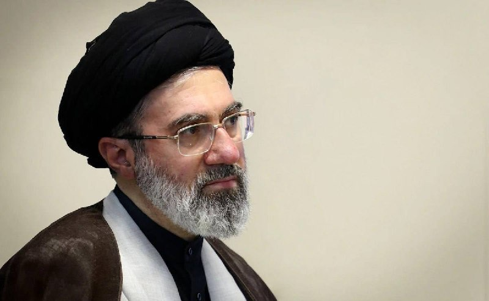

🔴شبکه سی‌بی‌اس گزارش داده که دولت ترامپ معتقد است مجتبی خامنه‌ای با چارچوب کلی پیش‌نویس توافق میان ایران و آمریکا موافقت کرده است.
بر اساس این گزارش، ایران در اصل پذیرفته ذخایر اورانیوم با غنای بالای خود را کنار بگذارد و در مقابل، محاصره دریایی آمریکا لغو شود.
با این حال، پیش‌نویس توافق هنوز باید در ساختار رهبری ایران، از جمله شورای عالی امنیت ملی و فرماندهی سپاه پاسداران، بررسی و تأیید شود.
https://t.me/kianmeli1

## kianmeli1 — post 87642

  <a href="telegram/content/kianmeli1_87642_1779649183.mp4" target="_blank">🎬 Download video</a>

🔴 طبق گزارش فاکس نیوز، ترامپ می‌خواهد توافق پیشنهادی توسط مذاکره‌کنندگان او، از جمله استیو ویتکوف و جرد کوشنر، اجرا شود؛ اگر این شرایط برآورده نشوند، هیچ توافقی صورت نخواهد گرفت
https://t.me/kianmeli1

## kianmeli1 — post 87641

  <a href="telegram/content/kianmeli1_87641_1779649184.mp4" target="_blank">🎬 Download video</a>

🔴تهران و واشینگتن هنوز امضای توافق را اعلام نکرده‌اند. جزئیات توافق احتمالی هم هنوز به طور رسمی اعلام نشده است. گرچه گمانه‌زنی‌ها بر این بود که رسیدن به توافق امروز اعلام خواهد شد، اما کاخ سفید گفته است امضای توافق ممکن است چند روز دیگر انجام شود.
https://t.me/kianmeli1

## kianmeli1 — post 87640

  

🔴رسانه آکسیوس، روز یکشنبه سوم خرداد ماه، به نقل از یک مقام ارشد دولت دونالد ترامپ گزارش داد، «چند مورد جزئیات حل‌نشده» میان تهران و واشنگتن باقی‌مانده است و به همین دلیل توافق میان ایران و آمریکا احتمالا امروز امضا نخواهد شد.

این مقام آمریکایی به آکسیوس گفت هنوز بر سر برخی بخش‌های توافق «رفت‌وبرگشت» وجود دارد و اختلاف‌ها بیشتر بر سر عباراتی است که برای هر یک از دو طرف اهمیت دارد: «برخی کلمات برای ما مهم هستند و برخی کلمات برای آن‌ها.»

آکسیوس به نقل از این مقام ارشد کاخ سفید نوشت، ساختار تصمیم‌گیری در جمهوری اسلامی «سریع عمل نمی‌کند» و روند دریافت همه تاییدیه‌های لازم چند روز زمان خواهد برد.

به گفته این مقام، ارزیابی واشنگتن این است که «مجتبی خامنه‌ای»، رهبر جمهوری اسلامی، چارچوب کلی توافق را تایید کرده، اما اینکه این روند به توافق نهایی منجر شود، «همچنان یک سوال باز» است.
https://t.me/kianmeli1

## IranIntlTV — post 338802

  

دونالد ترامپ در تروث‌سوشال نوشت اگر با جمهوری اسلامی توافقی انجام دهد، توافقی خوب و درست خواهد بود؛ نه مانند توافق اوباما که مبالغ هنگفتی پول نقد به تهران داد و مسیری آشکار برای دستیابی این کشور به سلاح هسته‌ای فراهم کرد.

او افزود توافق دولتش دقیقا برعکس آن است، اما هنوز کسی آن را ندیده و نمی‌داند شامل چه مواردی است و این توافق هنوز به‌طور کامل نهایی نشده است.

ترامپ گفت به کسانی که درباره موضوعی که اطلاعی از آن ندارند انتقاد می‌کنند گوش ندهید و تاکید کرد برخلاف دولت‌های پیشین، توافق بد انجام نخواهد داد.
https://iranintl.com/202605243731

## IranIntlTV — post 338801

  <a href="https://t.me/IranintlTV/338801" target="_blank">📎 Download file</a>

🎧نسخه صوتی تیتراول با نیوشا صارمی: تهران و واشینگتن در آستانه تصمیم نهایی توافق؛ هشدار نتانیاهو:آزادی عمل داریم
@iranintlTV

## IranIntlTV — post 338800

بخش مهمی از تفاهم‌نامه تهران و واشینگتن مربوط به مسائل و امتیازهای اقتصادی است. آمریکا در ازای بازگشایی تنگه هرمز، محاصره بنادر ایران را به تدریج لغو خواهد کرد و معافیت‌های تحریمی برای فروش آزاد نفت ایران صادر می‌شود. اگرچه تهران خواستار آزادسازی فوری منابع مالی و رفع دائمی تحریم‌‌ها بود، اما آزادسازی دارایی‌های بلوکه‌شده و رفع کامل تحریم‌ها به توافق نهایی موکول شده است.

گفت‌وگو با سارا بازوبندی، کارشناس اقتصادی
@iranintltv

## IranIntlTV — post 338799

تهران و واشینگتن هنوز امضای توافق را اعلام نکرده‌اند. جزئیات توافق احتمالی هم هنوز به طور رسمی اعلام نشده است. گرچه گمانه‌زنی‌ها بر این بود که رسیدن به توافق امروز اعلام خواهد شد، اما کاخ سفید گفته است امضای توافق ممکن است چند روز دیگر انجام شود.

گفت‌وگو با نوید محبی، تحلیل‌گر سیاسی
@iranintltv

## Shin_Persian — post 6211

  

Shin ✓ @hey_itsmyturn Sun, 24 May 2026 18:20:14 UTC President Trump @POTUS: "If I make a deal with Iran, it will be a good and proper one, not like the one made by Obama, which gave Iran massive amounts of CASH, and a clear and open path to a Nuclear Weapon.…

## Shin_Persian — post 6210

Shin ✓ @hey_itsmyturn
Sun, 24 May 2026 18:20:14 UTC

President Trump @POTUS:
"If I make a deal with Iran, it will be a good and proper one, not like the one made by Obama, which gave Iran massive amounts of CASH, and a clear and open path to a Nuclear Weapon. Our deal is the exact opposite, but nobody has seen it, or knows what it is. It isn’t even fully negotiated yet. So don’t listen to the losers, who are critical about something they know nothing about. Unlike those before me who should have solved this problem many years ago, I don’t make bad deals! President DJT"

فارسی

رئیس‌جمهور ترامپ @POTUS:

«اگر من با ایران بر سر توافقی مذاکره کنم، آن توافق خوب و مناسب خواهد بود، نه مانند توافقی که اوباما منعقد کرد، که مقادیر عظیمی پول نقد به ایران داد و مسیری شفاف و باز برای دستیابی به سلاح هسته‌ای فراهم کرد. توافق ما دقیقاً برعکس است، اما هیچ‌کس آن را ندیده و نمی‌داند چیست. هنوز حتی به طور کامل مذاکره نشده است. بنابراین به بازنده‌هایی که از چیزی که هیچ اطلاعی از آن ندارند انتقاد می‌کنند، گوش ندهید. برخلاف کسانی که پیش از من بودند و باید این مشکل را سال‌ها پیش حل می‌کردند، من توافق بد امضا نمی‌کنم! رئیس‌جمهور دی‌جی‌تی (دونالد جی. ترامپ)»

𝕏 · @shin_persian

## ManotoTV — post 105812

  <a href="telegram/content/ManotoTV_105812_1779649189.mp4" target="_blank">🎬 Download video</a>

تماسی با خانواده جاویدنام مهدی اسکندریان:
«روی صحبتم با طرفداران جمهوری اسلامیه…
با کشتن جاویدنام‌ها فقط آدم‌های بیشتری را علیه خودتان ساختید؛
و خانواده‌های دادخواه این درد را فراموش نخواهند کرد.»

## ManotoTV — post 105811

  <a href="telegram/content/ManotoTV_105811_1779649190.mp4" target="_blank">🎬 Download video</a>

کاخ سفید می‌گوید مذاکرات با جمهوری اسلامی به مرحله حساسی رسیده اما هنوز توافق نهایی نشده و ممکن است چند روز دیگر طول بکشد. بر اساس پیش‌نویس توافق، جمهوری اسلامی درباره محدودیت غنی‌سازی و کنار گذاشتن ذخایر اورانیوم مذاکره می‌کند و در مقابل احتمال کاهش تحریم‌ها وجود دارد. ترامپ تأکید کرده آمریکا برای توافق عجله ندارد و محاصره دریایی فعلاً ادامه خواهد داشت. همزمان اسرائیل نسبت به توافق احتمالی ابراز نگرانی کرده و خواستار حذف کامل برنامه غنی‌سازی جمهوری اسلامی شده است.

## FarsiVOA — post 218564

🔺حکم جدید قاضی صلواتی برای پرونده «شهرک اکباتان»: تخفیف لازم نیست، اعدامشان کنید

◾️ابوالقاسم صلواتی، قاضی بدنام قوه قضائیه جمهوری اسلامی، معروف به «قاضی مرگ»، حکم صادره توسط دادگاه کیفری، مبنی بر «نقض اعدام» متهمان پرونده «شهرک اکباتان» را رد، و برای چهار متهم این پرونده دوباره حکم اعدام صادر کرد.

⬇️ بیشتر بخوانید:

https://ir.voanews.com/a/8153336.html

## FarsiVOA — post 218563

🔺دونالد ترامپ: توافق بد نمی‌کنم

◾️دونالد ترامپ رئیس جمهوری آمریکا، اعلام کرد که اگر با [رژیم] ایران توافقی انجام دهد، توافقی خوب و مناسب خواهد بود، «نه مانند توافقی که اوباما انجام داد و به [رژیم] ایران مقادیر زیادی پول نقد و مسیری روشن و باز به سوی سلاح هسته‌ای داد.»

⬇️ بیشتر بخوانید:

https://ir.voanews.com/a/8153347.html

## FarsiVOA — post 218562

تشدید تنش‌ها در عراق؛ حملات تازه به اقلیم همزمان با بحران خلع سلاح گروه‌های مسلح

## FarsiVOA — post 218561

فقط ۱۸ روز تا آغاز جام جهانی باقی مانده اما تیم ملی جمهوری اسلامی همچنان درگیر بحران ویزا، تحریم، جابه‌جایی کمپ و مشکلات مالی است. از انتقال کمپ از آریزونا به مرز مکزیک گرفته تا گزارش‌هایی درباره صادر نشدن ویزای بعضی بازیکنان و آماده‌باش بازیکنان خط‌خورده برای جایگزینی احتمالی.

## FarsiVOA — post 218560

گزارش نرگس صبا از ذخیره اورانیوم با غنای بالای ایران در برنامه تفسیر خبر

## FarsiVOA — post 218559

در گفت‌وگو با علی دادپی، اقتصاددان ساکن تگزاس، به تنگنای اقتصادی جمهوری اسلامی در شرایط محاصره دریایی برای امضای توافق پایان جنگ پرداختیم و بررسی کردیم چرا زمان به سود آمریکا در حرکت است و جمهوری اسلامی، همانند تجربه برجام، توان استفاده مؤثر از این فرصت را ندارد.

## FarsiVOA — post 218558

خبرگزاری میزان، وابسته به قوه قضائیه جمهوری اسلامی، اعلام کرد مجتبی کیان، شهروند بازداشتی به اتهام ارسال اطلاعات مراکز تولید صنایع دفاعی به آمریکا و اسرائیل اعدام شده است

## FarsiVOA — post 218557

گزارش مایکل لیپین، خبرنگار صدای آمریکا، از کاخ سفید

## FarsiVOA — post 218556

دیدگاه های قانون گذران آمریکا و تفاهم نامه دولت ترامپ با جمهوری اسلامی

## FarsiVOA — post 218555

بررسی امنیت ملی، انگیزه ترور، و تحولات جاری خاورمیانه

## FarsiVOA — post 218554

🔺گزارش زنده مایکل لیپین، خبرنگار صدای آمریکا از نزدیک کاخ سفید

## FarsiVOA — post 218551

اسپیس‌ایکس تصاویری از دوربین‌های نصب‌شده روی استارشیپ و فضاپیمای وی۳ منتشر کرد.

اسپیس‌ایکس می‌گوید این دوربین‌های ارتقا یافته قادرند در تمام مراحل پرواز، ویدیوی 4K را از طریق استارلینک پخش کنند.

@FarsiVOA

## DW_Farsi — post 125107

  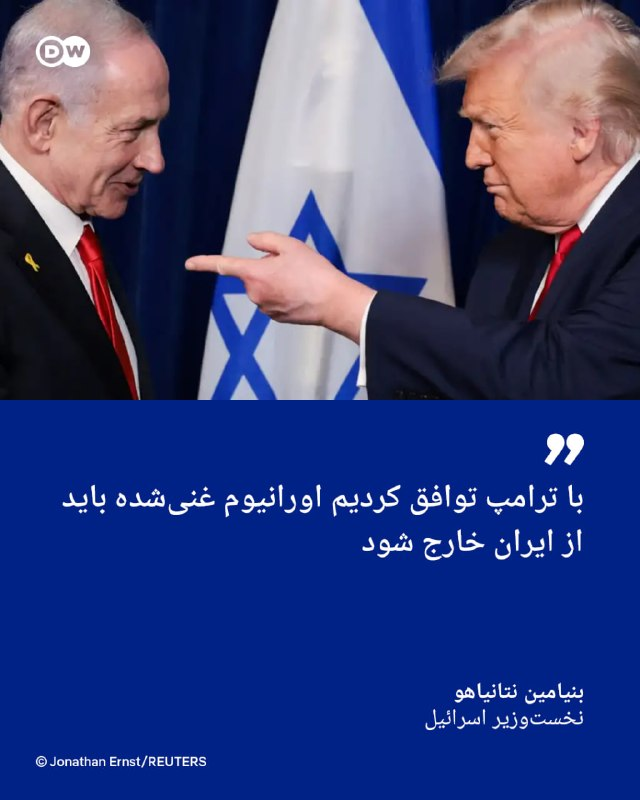

🔶 نتانیاهو: با ترامپ توافق کردیم اورانیوم غنی‌شده باید از ایران خارج شود

نخست‌وزیر اسرائيل در پستی تازه در شبکه اجتماعی ایکس با اشاره به این که شامگاه شنبه ۲۳ مه تلفنی با دونالد ترامپ، رئيس‌ جمهور آمریکا گفت‌وگو کرد نوشت، با او به توافق رسیده که هر گونه توافق نهایی با ایران باید خطر هسته‌ای این کشور را "ریشه‌کن" کند.

بنیامین نتانیاهو در این پیام که یکشنبه ۲۴ مه نوشته شده در این مورد توضیح داد: «این به معنای برچیدن سایت‌های غنی‌سازی هسته‌ای ایران و خارج کردن مواد هسته‌ای غنی‌شده از خاک این کشور است.»

نتانیاهو با ابراز قدردانی از همکاری آمریکا در حملات نظامی اخیر به جمهوری اسلامی نوشت: «سیاست من، همانند پرزیدنت ترامپ، بدون تغییر باقی می‌ماند: ایران به سلاح هسته‌ای دست نخواهد یافت.»

او همچنین بار دیگر بر حق اسرائیل برای دفاع از خود در برابر همه تهدیدها، از جمله تهدید لبنان، تأکید کرد.
@dw_farsi

## DW_Farsi — post 125106

  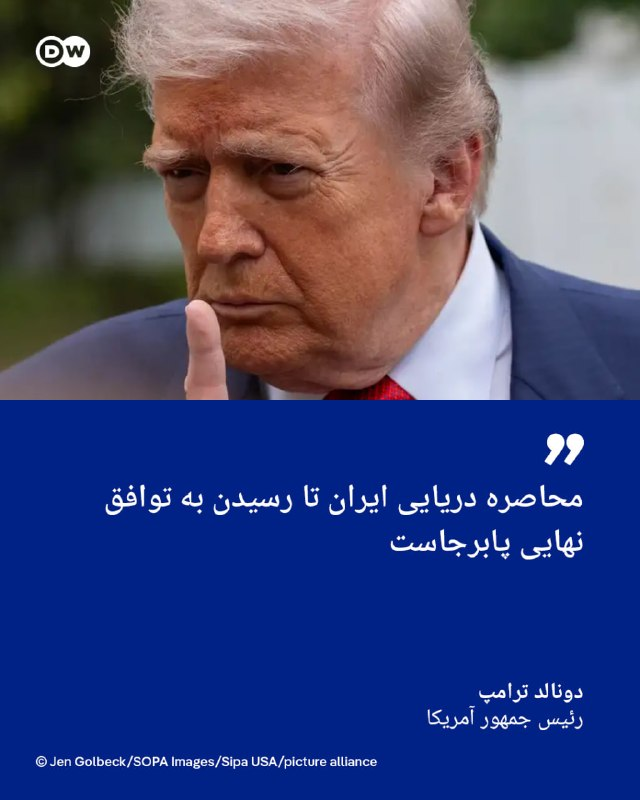

🔶 ترامپ: محاصره دریایی ایران تا رسیدن به توافق نهایی پابرجاست

رئیس‌جمهور آمریکا در پیامی تازه مذاکرات جاری توافق‌محور میان ایران و کشورش را "سازنده" خواند و نوشت، اما محاصره دریایی بنادر ایران توسط نیروی دریایی آمریکا تا رسیدن به توافق نهایی به قوت خود باقی خواهد ماند.

دونالد ترامپ در تروث سوشال یادآور شد: «من به نمایندگانم ابلاغ کرده‌ام که برای رسیدن به توافق عجله نکنند، چرا که زمان به نفع ماست... هر دو طرف باید زمان بگذارند و کار را درست انجام دهند. هیچ اشتباهی نباید رخ دهد.»

او با تکرار این که هر توافقی با ایران بهتر از توافق موسوم به برجام در سال ۲۰۱۵ در دوران ریاست جمهوری باراک اوباما در آمریکاست مدعی شد: «رابطه ما با ایران در حال تبدیل شدن به رابطه‌ای بسیار حرفه‌ای‌تر و سازنده‌تر است. با این حال، آن‌ها باید درک کنند که نمی‌توانند سلاح یا بمب هسته‌ای تولید یا تهیه کنند.»

رئیس‌ جمهور آمریکا در ادامه از کشورهای خاورمیانه بابت "حمایت و همکاری" با ایالات متحده تشکر کرد و افزود که این همکاری‌ها با پیوستن آن‌ها به "پیمان‌های تاریخی ابراهیم" که همانا عادی‌سازی روابط با اسرائيل است تقویت خواهد شد.
@dw_farsi

## DW_Farsi — post 125105

  <a href="telegram/content/DW_Farsi_125105_1779649192.mp4" target="_blank">🎬 Download video</a>

🎥 ادعای مدیرعامل سروش‌پلاس؛ "هیچ نظارت پیشینی روی پیام‌ها و تماس‌های کاربران وجود ندارد"

امین شریفی، مدیرعامل سروش‌پلاس، مدعی شده پیام‌رسان‌های داخلی "نظارت پیشینی" بر پیام‌ها و تماس‌های کاربران ندارند؛ یعنی به گفته او، پیام‌ها پیش از ارسال یا دریافت، کنترل و سانسور نمی‌شوند.

با این حال کارشناسان امنیت دیجیتال می‌گویند این موضوع، احتمال نظارت نهادهای امنیتی پس از ارسال پیام‌ها را رد نمی‌کند.

شریفی در یک مصاحبه گفته دسترسی به اطلاعات کاربران فقط با حکم قضایی و در پرونده‌های مشخص انجام می‌شود.
اما کارشناسان امنیت سایبری هشدار می‌دهند پیام‌رسان‌های داخلی مانند "بله"، "روبیکا" و "سروش" از استانداردهای لازم برای حفاظت از حریم خصوصی برخوردار نیستند و امکان نظارت و سانسور در آن‌ها وجود دارد.
 
این نگرانی‌ها پس از آن شدت گرفت که جمهوری اسلامی در دوره محدودیت گسترده اینترنت، شهروندان را به استفاده از پیام‌رسان‌های داخلی تشویق کرد.
 
محققان امنیت دیجیتال نیز "بله" را ابزاری برای نظارت دولتی معرفی کرده‌اند که از پیام‌های کاربران در برابر شنود محافظت نمی‌کند.
@dw_farsi

## Persian_Trend_Official — post 14884

ساعت 23 به وقت تهران لایو شروع میشه

## Persian_Trend_Official — post 14883

  

این رو مبنای شکست و پیروزی جمهوری اسلامی در نظر میگیریم

و هر توافقی رو با این متن مقایسه میکنیم
از توجه شما به این موضوع متشکرم
الیاس فرخ

## Persian_Trend_Official — post 14882

🔴 روبیو: توافق هسته‌ای با ایران را نمی‌توان «در ۷۲ ساعت روی یک تکه کاغذ» نهایی کرد

♦️مارکو روبیو، وزیر خارجه آمریکا، اعلام کرد توافق احتمالی با ایران از حمایت کشورهای منطقه برخوردار شده است، اما هشدار داد:

▪️ «توافق هسته‌ای را نمی‌شود ظرف ۷۲ ساعت و روی پشت یک دستمال کاغذی نهایی کرد»
▪️ او گفت مذاکرات پیچیده است و هنوز کار زیادی باقی مانده
▪️ روبیو همچنین از «پیشرفت قابل‌توجه اما نه نهایی» در گفت‌وگوها خبر داد
🫆:Tony

📌 @persian_trend_official
پرشین ترند | متفاوت‌ترین کانال نظامی

## Persian_Trend_Official — post 14881

  

#طنز

بیو ترامپ چند روز دیگه:

📝 Nick

📌 @persian_trend_official
پرشین ترند | متفاوت‌ترین کانال نظامی

## Persian_Trend_Official — post 14879

  

🔴 ترامپ:

اگر با ایران توافقی انجام دهم، توافقی خوب و درست خواهد بود؛ نه مثل توافق اوباما که به ایران حجم عظیمی پول نقد داد و مسیر آشکار دستیابی به سلاح هسته‌ای را برایش باز کرد.
توافق ما دقیقاً برعکس آن است، اما هنوز کسی آن را ندیده و از جزئیاتش خبر ندارد. این توافق حتی هنوز کاملاً نهایی هم نشده است.
پس به حرف بازنده‌هایی که درباره چیزی که هیچ اطلاعی از آن ندارند انتقاد می‌کنند گوش ندهید.
برخلاف کسانی که قبل از من بودند و باید سال‌ها پیش این مسئله را حل می‌کردند، من توافق بد انجام نمی‌دهم.

🫆:Tony

📌 @persian_trend_official
پرشین ترند | متفاوت‌ترین کانال نظامی

## Persian_Trend_Official — post 14878

🔴العربی الجديد:

♦️انفجار انتحاری در قطاری در ایالت بلوچستان پاکستان؛ بیش از ۲۰ کشته و بیش از ۵۰ زخمی / انتخاب

🫆:Tony

📌 @persian_trend_official
پرشین ترند | متفاوت‌ترین کانال نظامی

## Persian_Trend_Official — post 14877

  <a href="telegram/content/Persian_Trend_Official_14877_1779649195.webm" target="_blank">🎬 Download video</a>

🔴 کانال ۱۳ اسرائیل: نفوذ نتانیاهو بر ترامپ به‌شدت کاهش یافته است

▪️ نتانیاهو در جلسات اخیر گفته توان اسرائیل برای تأثیرگذاری بر ترامپ اکنون بسیار محدود شده است
▪️ مقام‌های اسرائیلی معتقدند ترامپ به‌سمت توافق موقت با ایران حرکت می‌کند
▪️ اسرائیل فعلاً تلاش می‌کند فقط بر محتوای توافق اثر بگذارد؛ به‌ویژه درباره لبنان، شمال اسرائیل و خروج اورانیوم غنی‌شده از ایران

همزمان:

▪️ نتانیاهو امشب جلسه جدید کابینه امنیتی محدود برگزار کرده است
▪️ اسرائیلی‌ها می‌گویند جرد کوشنر و استیو ویتکاف نقش مهمی در منصرف‌کردن ترامپ از گزینه جنگ داشته‌اند
▪️ با وجود تماس‌های ادامه‌دار میان ترامپ و نتانیاهو، در تل‌آویو این باور در حال تقویت است که تغییر نظر ترامپ بعید شده است

🫆:Tony

📌 @persian_trend_official
پرشین ترند | متفاوت‌ترین کانال نظامی

## RadioFarda — post 157524

پرویز قلیچ‌خانی؛ فوتبالیستی که به میدان سیاست رفت

🔸پرویز قلیچ‌خانی، کاپیتان پیشین تیم ملی فوتبال ایران، فعال سیاسی و مدیرمسئول مجله «آرش»، پس از یک دوره بیماری روز دوم خرداد در هشتاد سالگی در پاریس درگذشت.

🔸آقای قلیچ‌خانی که بود؟ چه جایگاهی در ورزش ایران داشت؟ و سرنوشت او در دنیای سیاست چگونه رقم خورد؟

🔸ستاره‌ای که «از فقر برآمد»
پرویز قلیچ‌خانی در ۱۳ آذر ۱۳۲۴ در محلهٔ صابون‌پزخانه نزدیک میدان شوش تهران در خانواده‌ای کم‌درآمد متولد شد و در همان نوجوانی وارد دنیای ورزش شد. کارشناسان ورزشی قلیچ‌خانی را به دلیل قابلیت‌ها و مهارت‌های برجسته اش در تکنیک‌های فوتبال، به عنوان یکی از بهترین بازیکنان تاریخ فوتبال ایران ستوده‌اند.

🔸مهدی اصلانی، نویسنده و زندانی سیاسی پیشین که آقای قلیچ‌خانی را از نزدیک می‌شناخت، به رادیوفردا می‌گوید که این چهره ورزشی، از فقر برآمد و به ستاره فوتبال تبدیل شد: «پرویز قلیچ‌خانی از سر سفره فقر برخاست، تهیدستی را نفس کشید و پس از آن‌که در ۱۸ سالگی، در المپیک توکیو، به ستاره اول فوتبال ایران بدل شد، غم سفره‌های خالی تا پایان عمر با او ماند.»

🔸قلیچ‌خانی تنها بازیکنی بود که با تیم ملی فوتبال ایران سه بار قهرمان جام ملت‌های آسیا شد. گلی که او نزدیک به شصت سال پیش، در ورزشگاه امجدیه تهران در جریان فینال یکی از دوره‌های این جام وارد دروازه تیم ملی اسرائیل کرد، برای خیلی‌ها ماندگارترین تصویر از قلیچ‌خانی است.

کامل این مطلب را در وب‌سایت رادیوفردا بخوانید.

@RadioFarda

## IranianMinds — post 20690

  

🔴 ترامپ :

اگه با ایران معامله کنم، یه معامله درست و حسابی می‌کنم، نه مثل اون آشغالی که اوباما کرد و کلی پول نقد بهشون داد و راه رو برای ساخت سلاح هسته‌ای کاملاً باز گذاشت. معامله ما دقیقاً برعکسه، ولی هنوز هیچ‌کس ندیدنش و نمیدونه چیه. حتی هنوز کامل مذاکره هم نشده. پس به این بازنده‌ها گوش نکنید که دارن درباره چیزی نظر میدن که هیچی ازش بلد نیستن. برخلاف اونایی که قبل از من بودن و باید سال‌ها پیش این مشکل رو حل میکردن، من معامله بد نمی‌کنم!

@IranianMinds

## BBCPersian — post 281962

  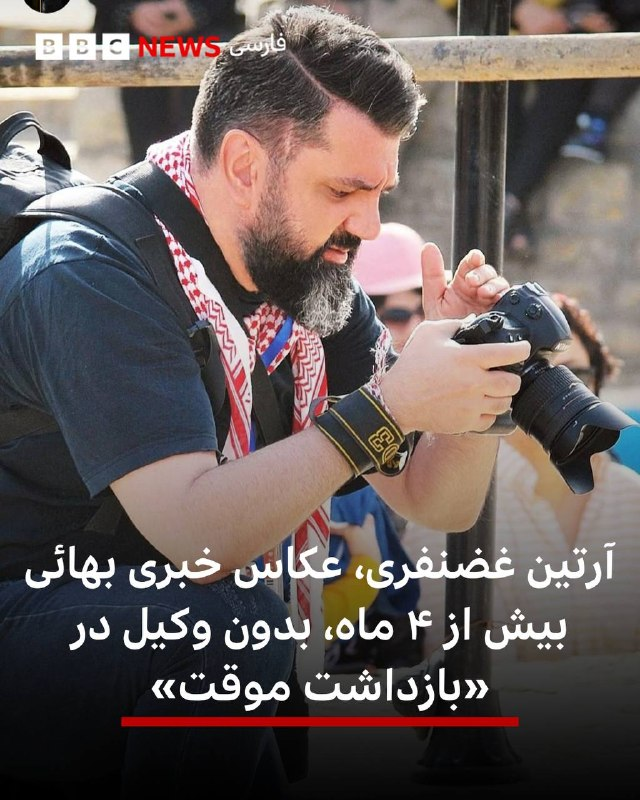

‏⭕️با گذشت ۱۸ هفته از بازداشت آرتین غضنفری، عکاس خبری نگرانی‌ها از وضعیت پرونده و سلامتی او افزایش یافته است.

‏یک منبع آگاه درباره او که ۱۲۶ روز بدون دسترسی به وکیل در بازداشت به‌سر می‌برد، به بی‌بی‌سی گفت: بازداشت موقت او چندبار تمدید شده و او امکان دسترسی به وکیل را «در مرحله دادسرا نیافته و کیفرخواست او به شعبه ۱۵ دادگاه انقلاب به ریاست قاضی ابوالقاسم صلواتی ارسال شده است.»

‏بازداشت طولانی، محدود کردن دسترسی بازداشتی به حقوق قانونی، بازداشت‌های متداوم بهائیان در ماه‌های اخیر، موجب ابراز نگرانی سازمان‌های حقوق‌بشری و فدراسیون بین‌المللی روزنامه‌نگاران و پارلمان اروپا از «پرونده‌سازی» علیه آرتین غضنفری و دیگر شهروندان بهائی در ایران شده است.

‏آرتین غضنفری، عکاس خبری، تهیه‌کننده پادکست «ماه سیزدهم» و شهروند بهائی پس از یورش ماموران به محل زندگی او در تهران در ۲۹ دی ۱۴۰۴ و تفتیش و ضبط بعضی وسایل شخصی و تجهیزات کاری بازداشت شد.

‏بیشتر:
instagram.com/p/DYuz4MKiLKn/
@bbcpersian

## Dirty_Kids — post 390096

  

‏عزیزان، یه قرمساقی به اسم علی‌هاشم خبرنگار الجزیره که دیروز گفته بود کار تمومه و تفاهم‌نامه امروز امضا می‌شه نوشته که :

«کمتر از ۲۴ ساعت بعد از احتمال تفاهم روافض قحبه و آمریکا، نشونه‌های منفی از راه رسیدن.

منبع آگاه رافضی می‌گه نشونه‌هایی از عقب‌نشینی آمریکا در دو موضوع اصلی دیده می‌شه: سازوکار آزادسازی دارایی‌ها و دامنه آتش‌بس در لبنان.»

روافض به همه‌ی میانجی‌های قرمپف از جمله پاکستان قرمدنگ اطلاع داده که اگه همه‌ی بندهای تفاهم کاملاً مورد توافق و تضمین واقع نشن، تفاهم‌نامه رو امضا نخواهند کرد.

پاکستان قرمساق پیشنهاد کرده که حداقل فعلاً بندهای مورد توافق جلو بره و مسائل اختلافی به تعویق بیفته تا این قرمساق‌های کیری پاکستانی بتونن این وسط یه چیزی به‌نام‌خودشون ثبت کنن، اما روافض کیرشون رو‌ گذاشتن کف دستشون [احسنت بهشون] و گفتن کسشر نگید بابا این بندهای مورد اختلاف، اساسی و غیرقابل مصالحه هستند.

@Dirty_Kids 👻

## Dirty_Kids — post 390095

وقتی دم جام‌جهانی میخوای هم از فوتبالی‌ها ویو بگیری هم مبارزا رو بکشونی سمتت و هم میخوای جقی‌هارو راضی نگه‌داری:

@Dirty_Kids 👻

## Hranews — post 113140

مرگ و مصدومیت ۴ کارگر در سایه فقدان ایمنی کار

❗️
❗️
❗️
❗️
❗️ – در سایه فقدان ایمنی محیط و شرایط نامناسب کار، امروز یکشنبه ۳ خردادماه، چهار #کارگر در شهرهای کاشان و پرند دچار حادثه شدند. در این حوادث سه کارگر مصدوم و یک تن دیگر جان خود را از دست داد.

ادامه مطلب

↘️
@hranews_bot تماس ✉️ -  @Hranews  کانال هرانا 🆑

## Hranews — post 113139

یک زن در بجنورد توسط پسرش به قتل رسید

❗️
❗️
❗️
❗️
❗️ – مردی در بجنورد مادر خود را با استفاده از سلاح سرد به قتل رساند. متهم پس از بازداشت و به مرجع قضایی معرفی شده است.

ادامه مطلب

↘️
@hranews_bot تماس ✉️ -  @Hranews  کانال هرانا 🆑

## manototv — post 105812

  <a href="telegram/content/manototv_105812_1779649197.mp4" target="_blank">🎬 Download video</a>

تماسی با خانواده جاویدنام مهدی اسکندریان:
«روی صحبتم با طرفداران جمهوری اسلامیه…
با کشتن جاویدنام‌ها فقط آدم‌های بیشتری را علیه خودتان ساختید؛
و خانواده‌های دادخواه این درد را فراموش نخواهند کرد.»

## manototv — post 105811

  <a href="telegram/content/manototv_105811_1779649198.mp4" target="_blank">🎬 Download video</a>

کاخ سفید می‌گوید مذاکرات با جمهوری اسلامی به مرحله حساسی رسیده اما هنوز توافق نهایی نشده و ممکن است چند روز دیگر طول بکشد. بر اساس پیش‌نویس توافق، جمهوری اسلامی درباره محدودیت غنی‌سازی و کنار گذاشتن ذخایر اورانیوم مذاکره می‌کند و در مقابل احتمال کاهش تحریم‌ها وجود دارد. ترامپ تأکید کرده آمریکا برای توافق عجله ندارد و محاصره دریایی فعلاً ادامه خواهد داشت. همزمان اسرائیل نسبت به توافق احتمالی ابراز نگرانی کرده و خواستار حذف کامل برنامه غنی‌سازی جمهوری اسلامی شده است.

## alonews — post 122414

  <a href="telegram/content/alonews_122414_1779649199.webm" target="_blank">🎬 Download video</a>

👈رسانه‌های داخلی: آمریکا مانع آزادسازی پول‌های مسدود شدست، احتمال لغو کلی توافق وجود داره!

✅ @AloNews خبر جنگ

## alonews — post 122413

  <a href="telegram/content/alonews_122413_1779649199.mp4" target="_blank">🎬 Download video</a>

👈معاون هماهنگ کننده‌ی فرمانده‌ی ارتش : نمیدونم توافق چی هست، سر چی هست

✅ @AloNews خبر جنگ

## alonews — post 122412

  <a href="telegram/content/alonews_122412_1779649200.webm" target="_blank">🎬 Download video</a>

👈 منبع آمریکایی به الحدث درباره لبنان: توافق آمریکا و ایران شامل همان بندهای ۱۵ مه مربوط به آتش‌بس است.

🔴 پیش‌نویس توافق آمریکا و ایران شامل تعهد به پایان دادن به خصومت‌ها در لبنان است.

🔴 اسرائیل به واشنگتن اعلام کرده که هر توافقی با تهران باید آزادی عمل آن را در لبنان تضمین کند.

🔴 پیش‌نویس توافق بین واشنگتن و تهران شامل خلع سلاح «حزب‌الله» در لبنان نیست.

✅ @AloNews خبر جنگ

## alonews — post 122411

  <a href="telegram/content/alonews_122411_1779649201.webm" target="_blank">🎬 Download video</a>

👈 ادعای منبع آمریکایی به الحدث: مخالفت‌های درونی در حزب جمهوری‌خواه با برخی بندهای توافق با ایران، اعلام رسمی آمریکا را به تأخیر انداخته است

✅ @AloNews خبر جنگ

## alonews — post 122410

  <a href="telegram/content/alonews_122410_1779649201.webm" target="_blank">🎬 Download video</a>

👈وزیر امور خارجه ایالات متحده مارکو روبیو گفت که توافق احتمالی با ایران حمایت منطقه‌ای دریافت کرده است، اما هشدار داد که یک توافق هسته‌ای نمی‌تواند «در ۷۲ ساعت روی پشت یک دستمال کاغذی» به دست آید.

✅ @AloNews خبر جنگ

## alonews — post 122409

  <a href="telegram/content/alonews_122409_1779649201.webm" target="_blank">🎬 Download video</a>

👈نیویورک تایمز به نقل از مقامات آمریکایی: محاصره دریایی بنادر ایران امروز با سرعت بیشتری ادامه یافت

✅ @AloNews خبر جنگ

## alonews — post 122408

  <a href="telegram/content/alonews_122408_1779649201.webm" target="_blank">🎬 Download video</a>

👈 ترامپ: اگر با ایران معامله‌ای انجام دهم، معامله‌ای خوب و درست خواهد بود، نه مانند معامله‌ای که اوباما انجام داد و به ایران مقادیر زیادی پول نقد و مسیری واضح و باز به سمت سلاح هسته‌ای داد. معامله ما دقیقاً برعکس است، اما هنوز کسی آن را ندیده یا نمی‌داند چیست. حتی هنوز به طور کامل مذاکره هم نشده است.

🔴پس به بازنده‌هایی که از چیزی که هیچ نمی‌دانند انتقاد می‌کنند، گوش ندهید. برخلاف کسانی که قبل از من بودند و باید این مشکل را سال‌ها پیش حل می‌کردند، من معامله‌های بد انجام نمی‌دهم!

✅ @AloNews خبر جنگ

## alonews — post 122407

  <a href="telegram/content/alonews_122407_1779649201.webm" target="_blank">🎬 Download video</a>

👈نیویورک تایمز: یک مقام آمریکایی می‌گوید ایالات متحده و ایران در اصول برای بازگشایی تنگه هرمز توافق کرده‌اند

✅ @AloNews خبر جنگ

## alonews — post 122406

  <a href="telegram/content/alonews_122406_1779649201.mp4" target="_blank">🎬 Download video</a>

👈ترامپ:هند می‌تواند ۱۰۰٪ به من و کشورمان اعتماد کند.

🔴اگر به کمک نیاز دارند، می‌دانند به کجا تماس بگیرند — همین‌جا تماس می‌گیرند.

✅ @AloNews خبر جنگ

## alonews — post 122405

  <a href="telegram/content/alonews_122405_1779649203.webm" target="_blank">🎬 Download video</a>

👈العربی الجديد: تلفات انفجار انتحاری در قطار در ایالت بلوچستان بیش از ۶۰ کشته و بیش از ۱۰۰ زخمی است

✅ @AloNews خبر جنگ

## alonews — post 122404

  <a href="telegram/content/alonews_122404_1779649204.webm" target="_blank">🎬 Download video</a>

👈 رسانه وزارت خارجه ایران: در موضوع آزادسازی دارایی‌ها که مورد اختلاف است در حال حاضر راه‌حلی برای آن وجود ندارد

✅ @AloNews خبر جنگ

<!-- MSG END -->

<!-- NAV START -->

<a href="https://github.com/kiavash-sh/aio-downloader/blob/main/telegram/content/archive_1.md" style="display:inline-block; padding:6px 12px; margin:0 4px; background-color:#2ea44f; color:white; text-decoration:none; border-radius:4px; font-weight:bold;">صفحه بعد</a>

<!-- NAV END -->
