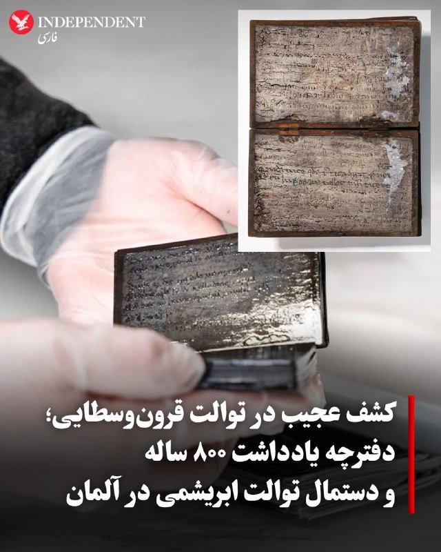
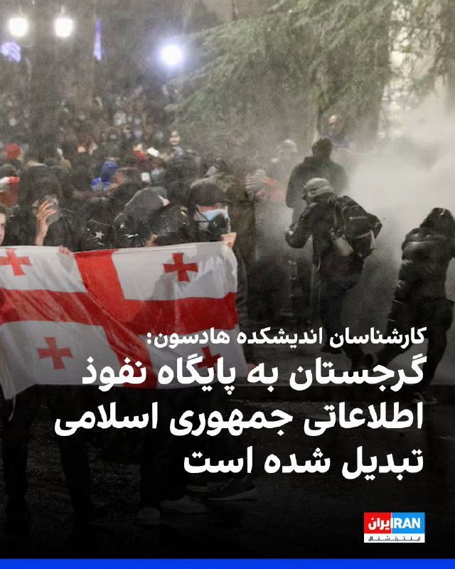

# خواننده تلگرام

<!-- TOP_NAV START -->

<a href="https://github.com/kiavash-sh/aio-downloader/blob/main/telegram/content/archive_1.md" style="display:inline-block; padding:6px 12px; margin:0 4px; background-color:#2ea44f; color:white; text-decoration:none; border-radius:4px; font-weight:bold;">صفحه بعد</a>

<!-- TOP_NAV END -->

<!-- MSG START -->

---
📅 بروزرسانی: 1405/03/01 05:26
---

## VahidOOnLine — post 241451

  

♦️به گزارش فاکس، هالیوود بدون اتلاف وقت در حال تبدیل ماموریت نجات نیروهای آمریکایی در ایران به یک فیلم سینمایی است.
ارتش ایالات متحده در ماه آوریل یک عملیات نجات بسیار پیچیده را انجام داد تا خدمه یک جنگنده اف-۱۵ که در ایران سقوط کرده بود را نجات دهد.
خلبان توسط نیروهای ویژه نجات نیروی هوایی آمریکا پیدا و خارج شد. جست‌وجو برای افسر تسلیحات حدود ۳۶ ساعت طول کشید و در نهایت نیروهای ویژه سطح یک وارد عملیات شدند تا این افسر ناشناس را نجات دهند.
به گزارش فاکس، این عملیات یکی از جسورانه‌ترین و چشمگیرترین مأموریت‌های نجات در تاریخ نظامی مدرن توصیف شده است.
اکنون قرار است این داستان به فیلم تبدیل شود.
هالیوود به‌سرعت در حال ساخت این ماجرا برای پرده سینما است.
بر اساس گزارش ددلاین در روز دوشنبه، مایکل بی، کارگردان مشهور هالیوود، کارگردانی فیلمی درباره این عملیات را بر عهده خواهد داشت. این فیلم بر اساس کتابی در دست انتشار از میچل زوکوف درباره این ماموریت ساخته می‌شود.
مایکل بی سابقه طولانی در ساخت فیلم‌های پرفروش دارد. از آثار مهم او می‌توان به «پرل هاربر»، «ترانسفورمرز» و «آرماگدون» اشاره کرد.
فیلم‌های او تاکنون بیش از ۱۰ میلیارد دلار در جهان فروش داشته‌اند.
سینما سابقه طولانی در تبدیل رویدادهای مهم نظامی به فیلم‌های پرفروش دارد. آثاری مانند «سی دقیقه پس از نیمه‌شب، «نجات سرباز رایان» و «سقوط بلک‌هاوک» نمونه‌های معروفی هستند.
مأموریت نجات در ایران از نظر هالیوود یک داستان کامل برای فیلم سینمایی است: جنگ گسترده، سقوط جنگنده، عملیات سریع نجات خلبان، عملیات طولانی‌تر و خشن‌تر برای نجات افسر تسلیحات، و تصاویر و پیامدهای دراماتیک در زمین.
به گزارش فاکس، زمان مشخصی برای اکران فیلم اعلام نشده، اما بعید است قبل از اواخر ۲۰۲۷ منتشر شود.
‌🇸🇦 Indypersian

🤖 @VahidOOnLine

## VahidOOnLine — post 241450

  

♦️باستان‌شناسان در شهر پادربورن آلمان، در جریان کاوش‌های خود به یافته‌ای بی‌نظیر دست یافتند؛ یک دفترچه یادداشت مومی که پس از ۸ قرن همچنان سالم باقی مانده است. این دفترچه ۱۰ صفحه‌ای که درون یک کیف چرمی ظریف قرار داشت، در اعماق یک توالت قدیمی کشف شد.
دلیل اصلی سالم ماندن این اثر ارگانیک، محیط «بی‌هوازی» این مکان بوده که از تجزیه چوب، چرم و موم جلوگیری کرده است. به گفته مرمت‌گران، با وجود گذشت سده‌ها، این یافته همچنان بوی نامطبوعی به همراه داشت.
این دفترچه که به خط لاتین نوشته شده، متعلق به طبقه نخبگان یا بازرگانان متمول آن دوران بوده است. نقش «گل زنبق» حک‌شده روی کیف چرمی و حتی بقایای پارچه‌های ابریشمی که به نظر می‌رسد به عنوان دستمال توالت لوکس استفاده می‌شده، نشان‌دهنده جایگاه اجتماعی بالای صاحب این اشیاء است. کارشناسان اکنون در حال استفاده از تکنولوژی‌های پیشرفته برای رمزگشایی از یادداشت‌های درهم‌تنیده این بازرگان قرون‌وسطایی هستند؛ یادداشت‌هایی که احتمالاً روایتگر معاملات تجاری و افکار شخصی او در قرن سیزدهم میلادی است.
‌🇸🇦 Indypersian

🤖 @VahidOOnLine

## VahidOOnLine — post 241449

  

واشینگتن فری‌بیکن در گزارشی به نقل از کارشناسان سیاست‌گذاری اندیشکده هادسون نوشت دولت گرجستان که زمانی متحدی قدرتمند برای آمریکا بود، اکنون تحت رهبری حزب اقتدارگرای «رویای گرجستان»، این کشور را به مکانی برای فعالیت‌های اطلاعاتی و تروریستی سپاه تبدیل کرده است.
بر اساس گزارش تحقیقی اخیر اندیشکده هادسون، گرجستان اکنون «بستر راهبردی جدیدی برای ایران در اوراسیا» فراهم کرده که به «زمینی حاصلخیز برای جذب نیروهای اطلاعاتی و بسیج شبه‌نظامیان» تبدیل شده است. این تغییر چشمگیر به سپاه امکان داده است تا منابع اطلاعاتی گرجی را که می‌توانند آزادانه در اروپا و حتی آمریکا رفت‌وآمد و در جهت اقدامات تروریستی فعالیت کنند، جذب کند.
واشینگتن فری‌بیکن به نقل از قانون‌گذاران و کارشناسان اندیشکده هادسون نوشت روابط جمهوری اسلامی و دولت تحت رهبری حزب «رویای گرجستان» سال‌ها در حال شکل‌گیری بوده است، اما در جریان جنگ آمریکا با ایران به شکلی نگران‌کننده تشدید شد و این متحد سابق آمریکا به روسیه اجازه داد از حریم هوایی‌اش برای انتقال هوایی تجهیزات به تهران استفاده کند.
‌🏁 🇬🇧 IranintlTV

🤖 @VahidOOnLine

## VahidOOnLine — post 241448

♦️پاریسی‌ها صبح پنج‌شنبه با منظره‌ای شگفت‌انگیز در قلب شهر بیدار شدند؛ هنرمند مشهور فرانسوی، «جِـی‌آر» (JR)، با نصب سازه‌ای عظیم و بادی، پل تاریخی «پون‌نوف» (Pont Neuf) را به یک غار سنگی خیره‌کننده تبدیل کرده است.
این اثر هنری که با نام «غار پون‌نوف» شناخته می‌شود، با استفاده از پارچه‌های چاپ‌شده و هوای فشرده ساخته شده و ۱۲۰ متر طول دارد. این سازه که تا ۱۸ متر ارتفاع می‌گیرد، جلوه‌ای کوهستانی به قدیمی‌ترین پل قرن هفدهمی پاریس بخشیده است.
 «جِـی‌آر» هدف از این پروژه را بازتعریف معماری شهری و پیوند دوباره طبیعت با محیط تاریخی شهر اعلام کرده است.
‌🇸🇦 Indypersian

🤖 @VahidOOnLine

## VahidOOnLine — post 241447

  

♦️کریستیانو رونالدو، ستاره پرتغالی النصر، پس از پیروزی ۴ بر ۱ تیمش مقابل ضمک و مسجل شدن عنوان قهرمانی لیگ حرفه‌ای عربستان سعودی، این موفقیت بزرگ را در کنار خانواده‌اش جشن گرفت. النصر در هفته پایانی فصل ۲۰۲۵–۲۶ موفق شد با درخشش رونالدو که دو گل از چهار گل تیمش را به ثمر رساند، با ۸۶ امتیاز بالاتر از الهلال بر سکوی نخست لیگ عربستان سعودی بایستد.
این نخستین قهرمانی رونالدو در لیگ عربستان سعودی پس از سه فصل حضور در این کشور است؛ جامی که النصر را پس از ۷ سال انتظار، دوباره به اوج فوتبال سعودی بازگرداند. فوق‌ستاره پرتغالی با این دو گل، آمار گل‌های دوران حرفه‌ای خود را به عدد خیره‌کننده ۹۷۳ رساند تا سی‌وهفتمین جام دوران درخشان ورزشی‌اش را در ریاض بالای سر ببرد.
‌🇸🇦 Indypersian

🤖 @VahidOOnLine

## VahidOOnLine — post 241446

  

♦️مجلس نمایندگان روز پنج‌شنبه رای‌گیری درباره یک قطعنامه مربوط به اختیارات جنگ را که با رهبری دموکرات‌ها و با هدف محدود کردن اقدام نظامی دونالد ترامپ علیه رژیم ایران ارائه شده بود، به تعویق انداخت.
گزارش شده است که جمهوری‌خواهان مجلس به دلیل مشکلات حضور نمایندگان، رای‌گیری را عقب انداخته‌اند.
به گزارش فاکس، ترامپ و رهبران جمهوری‌خواه استدلال کرده‌اند که رئیس‌جمهور اختیار یک‌جانبه برای مقابله نظامی با تهران را دارد. آن‌ها همچنین هشدار داده‌اند که پایان دادن به جنگ، حکومت ایران را تقویت می‌کند و این موضوع به ضرر امنیت ملی ایالات متحده و متحدان غربی خواهد بود.
جمهوری‌خواهان مجلس هفته گذشته به‌طور بسیار نزدیک یک قطعنامه مشابه درباره اختیارات جنگ را رد کرده بودند. جرد گلدن (نماینده دموکرات از ایالت مین)، در آن رای برخلاف حزب خود عمل کرده و با این طرح مخالفت کرده بود، با این استدلال که این قطعنامه شامل مهلت خروج نیروها در تاریخ ۳۰ مارس است که مدت آن گذشته است.
با این حال، گلدن گفته بود از نسخه بعدی «قطعنامه پاک» درباره اختیارات جنگ که به صحن بیاید حمایت خواهد کرد.
چهار سناتور جمهوری‌خواه در رای‌گیری اخیر برای پیشبرد یک قطعنامه اختیارات جنگ به دموکرات‌ها پیوستند. سناتور بیل کسیدی (جمهوری‌خواه از لوئیزیانا)، که در انتخابات مقدماتی حزب جمهوری‌خواه شکست خورده بود، برای نخستین بار از این قطعنامه حمایت کرد.
‌🇸🇦 Indypersian

🤖 @VahidOOnLine

## VahidOOnLine — post 241445

  

وبسایت خبری «ددلاین» گزارش داد شرکت فیلمسازی «یونیورسال پیکچرز» با همراهی مایکل بی، کارگردان آمریکایی، در حال تهیه یک فیلم سینمایی درباره نجات دو خلبان آمریکایی است که پس از سرنگونی جنگنده «اف۱۵-ای» در عملیات «خشم حماسی» در داخل خاک ایران گرفتار شده بودند.
بر اساس این گزارش، این فیلم بر پایه کتابی در دست انتشار از «میچل زوکاف» ساخته می‌شود که انتشارات «هارپرکالینز» قرار است آن را در سال ۲۰۲۷ منتشر کند.
این پروژه در حال حاضر در مرحله توسعه قرار دارد و جزئیات بیشتری از زمان تولید یا گروه بازیگران آن اعلام نشده است.

‌🏁 🇬🇧 IranintlTV

🤖 @VahidOOnLine

## VahidOOnLine — post 241436

این نام‌ها فقط بخشی از یک فهرست نیستند؛
هرکدام دنیایی بودند پر از صدا، خنده، کار، عشق و امید. یکی تازه ازدواج کرده بود، یکی برای آینده‌اش برنامه مهاجرت داشت، یکی مغازه کوچکش را می‌چرخاند و یکی برای نجات جان دیگری دوید. اما خیابان‌های آن روزها، میان رویا و مرگ فاصله‌ای نگذاشتند.
جاویدنامان انقلاب ملی ایرانیان:
سپهر شکری، احمد شاهعلی، امیرمحمد (آرش) یزدانی همت‌آبادی، عرشیا حضوری، علی بهروز، علیرضا جواهری‌پی، مجید استیر و محمد بهروزی
روایت این جوانان کوتاه است، اما زخمی که بر حافظه ایران گذاشتند، کوتاه نخواهد شد.
#جاویدنامان_انقلاب_ملی_ایرانیان
‌🏁 🇬🇧 IranintlTV

🤖 @VahidOOnLine

## VahidOOnLine — post 241429

## WithYashar — post 11910

وبسایت خبری «ددلاین» گزارش داد شرکت فیلمسازی «یونیورسال پیکچرز» با همراهی مایکل بی، کارگردان آمریکایی، در حال تهیه یک فیلم سینمایی درباره نجات دو خلبان آمریکایی است که پس از سرنگونی جنگنده «اف۱۵-ای» در عملیات «خشم حماسی» در داخل خاک ایران گرفتار شده بودند.
بر اساس این گزارش، این فیلم بر پایه کتابی در دست انتشار از «میچل زوکاف» ساخته می‌شود که انتشارات «هارپرکالینز» قرار است آن را در سال ۲۰۲۷ منتشر کند.
@withyashar

## WithYashar — post 11909

## WithYashar — post 11908

اتاق جنگ با یاشار : آمریکا حتماً داره آخرین اولتیماتوم رو میده….
@withyashar

## WithYashar — post 11907

اتاق جنگ با شما : سیریک جنگنده اومد ارتفاع پاین تو شهر مانور داد الان
@withyashar

## WithYashar — post 11906

درود ياشار جان
سيريك الان نزديك صبحه و يهو صدا جنگنده اومد،رسما ا بالا سرمون رد شد،و چند ديقه بعد پنجره ها لرزيد

## WithYashar — post 11905

  <a href="telegram/content/WithYashar_11905_1779414994.mp4" target="_blank">🎬 Download video</a>

اتاق جنگ با یاشار : یه خبرایی هست …
@withyashar

## WithYashar — post 11903

Martik (t.me/withyashar) – Parandeh (IG @yashar)

## FoxNewsTwitter — post 342084

  <a href="telegram/content/FoxNewsTwitter_342084_1779414996.mp4" target="_blank">🎬 Download video</a>

Fox News (Twitter/X)

A former U.S. attorney who once prosecuted federal crimes in Texas is now facing felony charges herself.

Authorities say Jennifer Lowery allegedly left the scene of a Houston crash that injured another driver despite remaining nearby for several minutes after the collision.

Investigators say CCTV footage appears to show Lowery driving away without checking on the injured person or rendering aid.

The former U.S. attorney for the Southern District of Texas has now been charged with felony failure to stop and render aid.

## FoxNewsTwitter — post 342083

  <a href="telegram/content/FoxNewsTwitter_342083_1779414997.mp4" target="_blank">🎬 Download video</a>

Fox News (Twitter/X)

"Completely barbaric."

Former Navy SEAL Rob O'Neill, the man who is credited with killing Osama bin Laden, ripped Graham Platner for the Senate hopeful's controversial post trashing a soldier who was wounded in a clash with Taliban fighters.

In a 2019 Reddit post, Platner said of the soldier: "Dumb motherf----- didn't deserve to live. At least his stupidity and fat a-- wheezing are available for all future infantrymen to witness and hold in contempt. Poor marksmanship on the Taliban's part is the only reason this mouthbreather made it home, he managed to make every possible s--- decision possible when it comes to small unit combat."

## IranIntlTV — post 338338

  

واشینگتن فری‌بیکن در گزارشی به نقل از کارشناسان سیاست‌گذاری اندیشکده هادسون نوشت دولت گرجستان که زمانی متحدی قدرتمند برای آمریکا بود، اکنون تحت رهبری حزب اقتدارگرای «رویای گرجستان»، این کشور را به مکانی برای فعالیت‌های اطلاعاتی و تروریستی سپاه تبدیل کرده است.
بر اساس گزارش تحقیقی اخیر اندیشکده هادسون، گرجستان اکنون «بستر راهبردی جدیدی برای ایران در اوراسیا» فراهم کرده که به «زمینی حاصلخیز برای جذب نیروهای اطلاعاتی و بسیج شبه‌نظامیان» تبدیل شده است. این تغییر چشمگیر به سپاه امکان داده است تا منابع اطلاعاتی گرجی را که می‌توانند آزادانه در اروپا و حتی آمریکا رفت‌وآمد و در جهت اقدامات تروریستی فعالیت کنند، جذب کند.
واشینگتن فری‌بیکن به نقل از قانون‌گذاران و کارشناسان اندیشکده هادسون نوشت روابط جمهوری اسلامی و دولت تحت رهبری حزب «رویای گرجستان» سال‌ها در حال شکل‌گیری بوده است، اما در جریان جنگ آمریکا با ایران به شکلی نگران‌کننده تشدید شد و این متحد سابق آمریکا به روسیه اجازه داد از حریم هوایی‌اش برای انتقال هوایی تجهیزات به تهران استفاده کند.
https://iranintl.com/202605224852

## IranIntlTV — post 338337

  

وبسایت خبری «ددلاین» گزارش داد شرکت فیلمسازی «یونیورسال پیکچرز» با همراهی مایکل بی، کارگردان آمریکایی، در حال تهیه یک فیلم سینمایی درباره نجات دو خلبان آمریکایی است که پس از سرنگونی جنگنده «اف۱۵-ای» در عملیات «خشم حماسی» در داخل خاک ایران گرفتار شده بودند.
بر اساس این گزارش، این فیلم بر پایه کتابی در دست انتشار از «میچل زوکاف» ساخته می‌شود که انتشارات «هارپرکالینز» قرار است آن را در سال ۲۰۲۷ منتشر کند.
این پروژه در حال حاضر در مرحله توسعه قرار دارد و جزئیات بیشتری از زمان تولید یا گروه بازیگران آن اعلام نشده است.

https://iranintl.com/202605221100

## IranIntlTV — post 338336

  

وبسایت خبری «ددلاین» گزارش داد شرکت فیلمسازی «یونیورسال پیکچرز» با همراهی مایکل بی، کارگردان آمریکایی، در حال تهیه یک فیلم سینمایی درباره نجات دو خلبان آمریکایی است که پس از سرنگونی جنگنده «اف۱۵-ای» در عملیات «خشم حماسی» در داخل خاک ایران گرفتار شده بودند.
بر اساس این گزارش، این فیلم بر پایه کتابی در دست انتشار از «میچل زوکاف» ساخته می‌شود که انتشارات «هارپرکالینز» قرار است آن را در سال ۲۰۲۷ منتشر کند.
این پروژه در حال حاضر در مرحله توسعه قرار دارد و جزئیات بیشتری از زمان تولید یا گروه بازیگران آن اعلام نشده است.

https://iranintl.com/202605221100

## IranIntlTV — post 338328

این نام‌ها فقط بخشی از یک فهرست نیستند؛
هرکدام دنیایی بودند پر از صدا، خنده، کار، عشق و امید. یکی تازه ازدواج کرده بود، یکی برای آینده‌اش برنامه مهاجرت داشت، یکی مغازه کوچکش را می‌چرخاند و یکی برای نجات جان دیگری دوید. اما خیابان‌های آن روزها، میان رویا و مرگ فاصله‌ای نگذاشتند.
جاویدنامان انقلاب ملی ایرانیان:
سپهر شکری، احمد شاهعلی، امیرمحمد (آرش) یزدانی همت‌آبادی، عرشیا حضوری، علی بهروز، علیرضا جواهری‌پی، مجید استیر و محمد بهروزی
روایت این جوانان کوتاه است، اما زخمی که بر حافظه ایران گذاشتند، کوتاه نخواهد شد.
#جاویدنامان_انقلاب_ملی_ایرانیان

## IranIntlTV — post 338321

## IranIntlTV — post 338312

این نام‌ها فقط بخشی از یک فهرست نیستند؛
هرکدام دنیایی بودند پر از صدا، خنده، کار، عشق و امید. یکی تازه ازدواج کرده بود، یکی برای آینده‌اش برنامه مهاجرت داشت، یکی مغازه کوچکش را می‌چرخاند و یکی برای نجات جان دیگری دوید. اما خیابان‌های آن روزها، میان رویا و مرگ فاصله‌ای نگذاشتند.
جاویدنامان انقلاب ملی ایرانیان:
سپهر شکری، احمد شاهعلی، امیرمحمد (آرش) یزدانی همت‌آبادی، عرشیا حضوری، علی بهروز، علیرضا جواهری‌پی، مجید استیر و محمد بهروزی
روایت این جوانان کوتاه است، اما زخمی که بر حافظه ایران گذاشتند، کوتاه نخواهد شد.
#جاویدنامان_انقلاب_ملی_ایرانیان

## FarsiVOA — post 218342

🔺عملیات تجارت دریایی بریتانیا: تهدیدها در تنگه هرمز و آب‌های خاورمیانه همچنان «بحرانی» است

▪️آژانس «عملیات تجارت دریایی بریتانیا» روز پنجشنبه ۳۱ اردیبهشت گفت که تهدیدها در تنگه هرمز و خلیج فارس و آب‌های خاورمیانه همچنان در سطح «بحرانی» است.

⬇️ بیشتر بخوانید:
https://ir.voanews.com/a/8152728.html
@FarsiVOA

## FarsiVOA — post 218341

  

⚡️مارک لوین، حقوق‌دان و مفسر مشهور رادیویی آمریکایی و از حامیان سرشناس دونالد ترامپ، رئیس جمهوری آمریکا، پنج‌شنبه شب در شبکه اجتماعی ایکس نوشت: «وقت نابودی رژیم ایران است. بیایید تمامش کنیم. بیاید کار را یکسره کنیم. وقت دارد می‌گذرد.»
@FarsiVOA

## FarsiVOA — post 218340

🔺کارشناس امور نظامی: جمهوری اسلامی قادر به جایگزین کردن موشک‌های پیشرفته خود نیست

▪️یک کارشناس برجسته دفاعی روز پنجشنبه با رد گزارش‌هایی که می‌گویند جمهوری اسلامی از زمان شروع آتش‌بس، بخش‌هایی از زیرساخت‌های نظامی خود را سریع‌تر از حد انتظار بازسازی کرده است، گفت توانایی تولید موشک جمهوری اسلامی به شدت در اثر حملات نظامی اخیر آمریکا و اسرائيل فلج شده است.

⬇️ بیشتر بخوانید:
https://ir.voanews.com/a/8152727.html
@FarsiVOA

## FarsiVOA — post 218339

🔺جمهوری‌خواهان رأی‌گیری بر سر اختیارات جنگی ترامپ علیه جمهوری اسلامی را لغو کردند

▪️رهبران جمهوری‌خواه مجلس نمایندگان آمریکا، روز پنجشنبه ۳۱ اردیبهشت، رأی‌گیری برنامه‌ریزی‌شده در مورد قطعنامه‌ای را که قرار بود اختیارات دونالد ترامپ، رئیس‌جمهوری آمریکا برای اقدام نظامی علیه جمهوری اسلامی را بدون تأیید کنگره محدود کند، لغو کردند.

⬇️ بیشتر بخوانید:
https://ir.voanews.com/a/8152513.html
@FarsiVOA

## IranianMinds — post 20513

  <a href="telegram/content/IranianMinds_20513_1779415000.mp4" target="_blank">🎬 Download video</a>

نه ببین اعتراض مسالمت آمیز باشه ما کاری نداریم 🤡

یه عده دانش آموز تو شهر کرد اومدن که فقط به حضوری شدن امتحانات اعتراض کنن و صداشونو برسونن بعد مامورای حکومتی با شوکر بهشون حمله کردن !

@IranianMinds

## IranianMinds — post 20512

💯 اگر هنوز ۵۰۰ هزارتومان رو نگرفتی همین الان عضو شو‌ و جایزتو بگیر
نیازی هم به واریز نیست

👍 تنها سایت مورد #تایید ما با بونوس های واقعی

🌐 Winro.io

## IranianMinds — post 20511

  <a href="telegram/content/IranianMinds_20511_1779415001.webm" target="_blank">🎬 Download video</a>

⭕️ تنها جایی که در لحظه عضویت بهت 500 هزارتومان موجودی میده اینجاس 
❌

🎉 کافیه فقط عضو بشی تا #وینرو بهت 
🤩 
🤩 
🤩 هزارتومان جایزه بده ، نیازی هم به واریز نیست.

⌛ پشتیبانی 24 ساعته

🍆تنها سایت مورد اعتماد ما با بونوس های کاملا واقعی و رویایی:

🌐 Winro.io

🌐 Winro.io
کانال بونوس های رایگان a31

📱 @winro_io

## BBCPersian — post 281744

🔻یک معبد در غرب ژاپن که گفته می‌شود «شعله‌ای جاودان» را در خود جای داده بود، صبح چهارشنبه ۳۰ اردیبهشت/ ۲۰ مه در آتش سوخت.

ویدئوها نشان می‌دهند که تالار «ریکادو» در معبد دای‌شواین در استان هیروشیما کاملا در میان شعله‌ها می‌سوزد و سازه آن تقریبا به طور کامل از بین رفته است. بنا بر گزارش رسانه‌های ژاپنی، مقام‌ها اعلام کردند که این حادثه هیچ مصدومی نداشته است.

این تالار به خاطر نگهداری از شعله‌ای «خاموش‌نشدنی» شهرت داشت؛ شعله‌ای که بنا بر اعلام انجمن گردشگری میاجیما، نخستین بار در سال ۸۰۶ میلادی توسط یک راهب بودایی روشن شده بود. گفته می‌شود این آتش بیش از ۱۲۰۰ سال بدون وقفه روشن مانده و بعدها برای روشن کردن شعله جاودان پارک یادبود صلح هیروشیما که یادبود قربانیان بمباران اتمی سال ۱۹۴۵ است، از آن استفاده شده بود.

رسانه‌های محلی به نقل از مقام‌های آتش‌نشانی گزارش دادند که احتمال دارد تالار ریکادو بر اثر همین شعله مقدس دچار آتش‌سوزی شده باشد. با این حال، این شعله حفظ شده و به مکانی امن منتقل شده است.

@BBCPersian

## BBCPersian — post 281738

🔻جانی حسین تعریف می‌کند که در نخستین سفر زیارتی‌اش به مکه، زمانی که دختری ۱۳ ساله بود، دچار سردرگمی عجیبی شده بود. او می‌گوید: «یادم هست مادرم را در حال گریه دیدم، اما نمی‌دانستم چرا گریه می‌کند و همین برایم بسیار غم‌انگیز بود.»

هر سال میلیون‌ها نفر برای انجام مناسک عمره به عربستان سعودی سفر می‌کنند، زیارتی مستحب که مسلمانان می‌توانند در هر زمانی از سال آن را به‌جا آورند، برخلاف حج که فریضه‌ای واجب به شمار می‌رود، یک‌ بار در طول عمر انجام می‌شود. هر دو آیین شامل هفت بار طواف به دور کعبه، مقدس‌ترین زیارتگاه اسلام، است.

برای بیشتر مردم، این تجربه آمیزه‌ای رنگارنگ از صداهاست: بانگ اذان که در فضای مسجدالحرام می‌پیچد و با صدای گام‌ها و زمزمه دعاهای هزاران زائر درهم می‌آمیزد. اما برای گروهی از مسلمانان، این تجربه تقریبا در سکوت کامل سپری می‌شود.

متن کامل خبر را از لینک زیر بخوانید:

https://bbc.in/4dAMwWi
📷GettyImages/ Al Isharah

@BBCPersian

## BBCPersian — post 281737

🔻وزارت خارجه ایران: مذاکرات جاری فقط بر پایان جنگ متمرکز است و صحبتی درباره دخایر اورانیوم نیست

🔻اسماعیل بقایی، سخنگوی وزارت امورخارجه ایران به رسانه‌های این کشور گفته است: «در این مرحله تمرکز مذاکرات بر خاتمه جنگ در همه جبهه‌ها به شمول لبنان است و ادعاهایی که درباره مباحث هسته‌ای، از جمله موضوع مواد غنی شده یا بحث غنی‌سازی، در رسانه‌ها مطرح شده، صرفا گمانه‌زنی رسانه‌ای بوده و فاقد اعتبار است.»

اشاره آقای بقایی به گمانه‌زنی‌هایی است که در پی اظهارات روز پنجشنبه دونالد ترامپ شکل گرفته است.

همان طور که برایتان اینجا گزارش کردیم رئیس جمهور آمریکا، روز پنجشنبه در کاخ سفید در پاسخ به سوال خبرنگاران درباره ذخایر اورانیوم غنی شده ایران گفت: «ما آن را به دست خواهیم آورد. به آن نیازی نداریم، ما آن را نمی‌خواهیم. حتی احتمالاً پس از اینکه به آن دست یافتیم، آن را نابود خواهیم کرد، اما اجازه نخواهیم داد که آنها به آن دست یابند.»

https://bbc.in/3ReBBKB
@BBCPersian

---
📅 بروزرسانی: 1405/03/01 03:19
---

## VahidOOnLine — post 241417

  

دونالد ترامپ پنجشنبه ۳۱ اردیبهشت در گفت‌وگو با خبرنگاران در کاخ سفید اعلام کرد که مطمئن نیست بتواند این آخر هفته در مراسم ازدواج پسر بزرگش، دونالد ترامپ جونیور، شرکت کند. او دلیل این تردید را درگیری‌های مرتبط با ایران و دیگر مشغله‌های کاری عنوان کرد.
ترامپ در توضیح این موضوع در دفتر بیضی گفت: «او دوست دارد من در مراسم باشم»، اما افزود: «به او گفتم این زمان‌بندی برای من مناسب نیست، چون موضوعی به نام ایران و مسائل دیگر دارم.»
بر اساس این اظهارات، مراسم ازدواج دونالد ترامپ جونیور، ۴۷ ساله، و بتینا اندرسون، ۳۹ ساله، قرار است در باهاما برگزار شود. این زوج از سال ۲۰۲۴ وارد رابطه شدند و در دسامبر ۲۰۲۵ نامزد کردند.
پسر رییس‌جمهوری آمریکا پیش‌تر با ونسا ترامپ ازدواج کرده بود و این زوج پنج فرزند دارند. او همچنین با کیمبرلی گیلفویل نامزد بود که اکنون به عنوان سفیر آمریکا در یونان فعالیت می‌کند.

‌🏁 🇬🇧 IranintlTV

🤖 @VahidOOnLine

## VahidOOnLine — post 241416

  

♦️شبکه العربیه پنجشنبه‌شب ۳۱ اردیبهشت گزارش‌های منتشرشده در برخی رسانه‌های جمهوری اسلامی درباره دستیابی به توافق در مذاکرات ایران و آمریکا را تکذیب و آن‌ها را «جعلی و نادرست» توصیف کرد.
العربیه اعلام کرد برخی رسانه‌های جمهوری اسلامی اخباری را بدون بررسی صحت آن یا انتشارش در پلتفرم‌های رسمی این شبکه، به العربیه نسبت داده‌اند و این اقدام را «غیرحرفه‌ای» توصیف کرد. این شبکه تاکید کرد هیچ گزارشی درباره دستیابی به توافق هسته‌ای یا حل‌وفصل اختلافات میان واشنگتن و تهران منتشر نکرده است.
این واکنش در حالی مطرح می‌شود که مذاکرات هسته‌ای آمریکا و ایران با میانجی‌گری پاکستان در هفته‌های اخیر وارد مرحله حساسی شده و همزمان گزارش‌های ضدونقیضی درباره روند مذاکرات منتشر شده است. در روزهای اخیر، برخی رسانه‌ها از نزدیک شدن دو طرف به یک تفاهم احتمالی خبر داده بودند.
‌🇸🇦 Indypersian

🤖 @VahidOOnLine

## VahidOOnLine — post 241415

  

♦️«تانکرترکرز»، سامانه رصد موقعیت نفتکش‌ها، بامداد جمعه اول خرداد با انتشار تصاویری هوایی در شبکه اجتماعی اکس اعلام کرد نیروی دریایی آمریکا شماری از نفتکش‌های ناقض تحریم را در سواحل شرقی عمان متوقف کرده است. بر اساس تصاویر منتشرشده، یک نفتکش آفرامکس که معمولا نفت ایران را حمل می‌کند، پس از بازگردانده شدن به دریای عرب از سوی یک ناو آمریکایی تعقیب شد.

این گزارش همچنین می‌گوید چندین نفتکش مرتبط با ایران که هنوز در فهرست تحریم‌های آمریکا قرار نگرفته‌اند، وارد محدوده محاصره شده‌اند. به گفته تانکرترکرز، اکنون ۴۹ نفتکش از این نوع در این محدوده حضور دارند.

فرماندهی مرکزی ایالات متحده، سنتکام، روز پنجشنبه ۳۱ اردیبهشت اعلام کرد در جریان محاصره دریایی بنادر ایران، ۹۴ کشتی تجاری تغییر مسیر داده‌اند و چهار کشتی دیگر نیز زمین‌گیر و ناچار به توقف شده‌اند.
‌🇸🇦 Indypersian

🤖 @VahidOOnLine

## VahidOOnLine — post 241414

  

دادستان‌های آلمان اعلام کردند یک تبعه دانمارکی به نام علی اس. که خرداد گذشته در دانمارک بازداشت شده بود، به اتهام جاسوسی از رییس اصلی‌ترین نهاد یهودیان آلمان و سه نفر دیگر برای اطلاعات سپاه و تلاش برای مشارکت در قتل متهم شده است.
دادستان‌های آلمانی گفتند به موجب کیفرخواستی که ۱۷ اردیبهشت در دادگاه ایالتی هامبورگ ثبت کرده‌اند، این تبعه دانمارکی به همکاری به عنوان مامور اطلاعات سپاه، فعالیت مخفیانه با هدف خرابکاری و تلاش برای مشارکت در قتل و آتش‌سوزی متهم شده است.
طبق این کیفرخواست، همچنین یک تبعه افغانستان با نام تواب م. که آبان‌ماه ۱۴۰۴ در دانمارک بازداشت شده بود نیز به عنوان همد‌ست مورد ادعای او در این پرونده به تلاش برای مشارکت در قتل متهم شده است.
به گفته دادستان‌ها، علی اس. ارتباط نزدیکی با نیروی قدس سپاه داشت و در آغاز سال ۲۰۲۵ از او خواسته شده بود درباره یوزف شوستر، رییس شورای مرکزی یهودیان آلمان، و فولکر بک، رییس انجمن آلمانی-اسراییلی و نماینده پیشین برجسته پارلمان آلمان، و همچنین دو فروشنده یهودی مواد غذایی در برلین که نامشان فاش نشده، اطلاعات جمع‌آوری کند.
‌🏁 🇬🇧 IranintlTV

🤖 @VahidOOnLine

## WithYashar — post 11902

  <a href="https://t.me/withyashar/11902" target="_blank">📎 Download file</a>

🌐 @withyashar

🌐 instagram.com/yashar

## WithYashar — post 11901

## FoxNewsTwitter — post 342082

  

Fox News (Twitter/X)

WATCH LIVE: SpaceX launches its massive, next-generation Starship V3 rocket from Starbase, Texas https://twitter.com/i/broadcasts/1qJVmQdOpXDGB

## FoxNewsTwitter — post 342081

  <a href="telegram/content/FoxNewsTwitter_342081_1779407398.mp4" target="_blank">🎬 Download video</a>

Fox News (Twitter/X)

FOX NEWS REPORT: The White House says it won't ease pressure on Iran's nuclear program, and President Trump is rejecting any Iranian effort to impose tolls in the Strait of Hormuz.

Travelers from countries impacted by the Ebola outbreak will now be routed through Dulles Airport in Virginia for enhanced health screenings.

@BillMelugin_ has the latest.

## FoxNewsTwitter — post 342080

  

Fox News (Twitter/X)

Former “The Hills” star Spencer Pratt — who is now running for mayor of Los Angeles — says Jesus Christ is his political role model.

He was then prodded on whether there are any modern politicians he views as role models.

“No, I’m not a politician,” Pratt responded. “I don’t want to be a politician. I want to be a fighter for the people.”

## VahidOnline — post 75603

  <a href="telegram/content/VahidOnline_75603_1779407401.mp4" target="_blank">🎬 Download video</a>

تصویرسازی از مجتبی خامنه‌ای

وزارت جنگ آمریکا روز پنجشنبه ۳۱ اردیبهشت، با انتشار ویدیویی بر ضرورت افزایش بودجه دفاعی کشور تاکید کرد.

در این ویدیو که ترکیبی از صحنه‌های واقعی، گفته‌های پیت هگست، وزیر جنگ آمریکا و تصاویر کارتونی است، تصویری از مجتبی خامنه‌ای، رهبر جدید جمهوری اسلامی نیز در کنار یک سامانه موشکی دیده می‌آشود در حالی که یک پایش قطع شده است.
@VahidOOnLine

📡 @VahidOnline

## IranIntlTV — post 338309

  

دونالد ترامپ پنجشنبه ۳۱ اردیبهشت در گفت‌وگو با خبرنگاران در کاخ سفید اعلام کرد که مطمئن نیست بتواند این آخر هفته در مراسم ازدواج پسر بزرگش، دونالد ترامپ جونیور، شرکت کند. او دلیل این تردید را درگیری‌های مرتبط با ایران و دیگر مشغله‌های کاری عنوان کرد.
ترامپ در توضیح این موضوع در دفتر بیضی گفت: «او دوست دارد من در مراسم باشم»، اما افزود: «به او گفتم این زمان‌بندی برای من مناسب نیست، چون موضوعی به نام ایران و مسائل دیگر دارم.»
بر اساس این اظهارات، مراسم ازدواج دونالد ترامپ جونیور، ۴۷ ساله، و بتینا اندرسون، ۳۹ ساله، قرار است در باهاما برگزار شود. این زوج از سال ۲۰۲۴ وارد رابطه شدند و در دسامبر ۲۰۲۵ نامزد کردند.
پسر رییس‌جمهوری آمریکا پیش‌تر با ونسا ترامپ ازدواج کرده بود و این زوج پنج فرزند دارند. او همچنین با کیمبرلی گیلفویل نامزد بود که اکنون به عنوان سفیر آمریکا در یونان فعالیت می‌کند.

https://iranintl.com/202605211033

## IranIntlTV — post 338308

  

دادستان‌های آلمان اعلام کردند یک تبعه دانمارکی به نام علی اس. که خرداد گذشته در دانمارک بازداشت شده بود، به اتهام جاسوسی از رییس اصلی‌ترین نهاد یهودیان آلمان و سه نفر دیگر برای اطلاعات سپاه و تلاش برای مشارکت در قتل متهم شده است.
دادستان‌های آلمانی گفتند به موجب کیفرخواستی که ۱۷ اردیبهشت در دادگاه ایالتی هامبورگ ثبت کرده‌اند، این تبعه دانمارکی به همکاری به عنوان مامور اطلاعات سپاه، فعالیت مخفیانه با هدف خرابکاری و تلاش برای مشارکت در قتل و آتش‌سوزی متهم شده است.
طبق این کیفرخواست، همچنین یک تبعه افغانستان با نام تواب م. که آبان‌ماه ۱۴۰۴ در دانمارک بازداشت شده بود نیز به عنوان همد‌ست مورد ادعای او در این پرونده به تلاش برای مشارکت در قتل متهم شده است.
به گفته دادستان‌ها، علی اس. ارتباط نزدیکی با نیروی قدس سپاه داشت و در آغاز سال ۲۰۲۵ از او خواسته شده بود درباره یوزف شوستر، رییس شورای مرکزی یهودیان آلمان، و فولکر بک، رییس انجمن آلمانی-اسراییلی و نماینده پیشین برجسته پارلمان آلمان، و همچنین دو فروشنده یهودی مواد غذایی در برلین که نامشان فاش نشده، اطلاعات جمع‌آوری کند.
https://iranintl.com/202605212861

## FarsiVOA — post 218338

⚡️دونالد ترامپ: جمهوری اسلامی اورانیوم غنی شده را در چارچوب هر توافقی در اختیار نخواهد داشت
@FarsiVOA

## FarsiVOA — post 218337

⚡️طعنه‌ وزارت جنگ آمریکا به مجتبی خامنه‌ای
وزارت جنگ آمریکا ویدیویی از توضیحات پیت هگست، وزیر جنگ منتشر کرد که در آن او به اقدامات وزارت جنگ برای مدرن‌سازی، استفاده از فناوری‌های پیشرفته هوش مصنوعی، و تکنولوژی‌های فضایی اشاره می‌کند. این ویدیو طعنه‌هایی تصویری نیز به جمهوری اسلامی و مجتبی خامنه‌ای دارد.
@FariVOA

## FarsiVOA — post 218336

⚡️آیا پاکستان می‌تواند میانجی موفقی باشد؟
@FarsiVOA

## FarsiVOA — post 218335

⚡️کاهش قابل توجه مهاجرت به بریتانیا؛ پایین‌ترین آمار در چهار سال اخیر
@FardiVOA

## IranianMinds — post 20510

  

🔴حساب احمد وحیدی، فرمانده سپاه تروریستی پاسداران بسته شد.

@IranianMinds

## BBCPersian — post 281736

  

‌🔸سه هفته مانده به آغاز جام جهانی فوتبال که به طور مشترک در آمریکا، کانادا و مکزیک برگزار می‌شود، تیم ملی فوتبال ایران به تمرینات خود در آنتالیا ترکیه ادامه می‌دهد.

در تازه‌ترین اخبار مربوط به این تیم، شهریار مغانلو، مهاجم شاغل در لیگ امارات، به اردوی تیم ایران اضافه خواهد شد و روزبه چشمی که گزارش شده از ناحیه همسترینگ مصدوم شده، برای آغاز درمان از اردوی تیم ملی جدا خواهد شد.

پیوستن شهریار مغانلو به جمع مهاجمان تیم ملی ایران در حالی است که خط خوردن نام سردار آزمون، فوق ستاره این تیم، همچنان یکی از حواشی اصلی تیم ایران است.

در تحولی دیگر،‌ همزمان با مراجعه اعضای تیم ایران برای درخواست ویزا از کنسولگری‌های آمریکا و کانادا در آنتالیا، یک عضو هیات رئیسه فدراسیون فوتبال ایران از سفر به آمریکا انصراف داده است.

به گزارش خبرگزاری ایرنا، محمدرحمان سالاری، عضو هیات رئیسه فدراسیون فوتبال، با ارسال نامه‌ای به مهدی تاج، رئیس فدراسیون فوتبال، از سفر به آمریکا و حضور در جام‌جهانی «انصراف داده است».

لینک خبر:
https://bbc.in/49eO8DO

📷DeFodi Images via Getty Images
@BBCPersian

---
📅 بروزرسانی: 1405/03/01 02:19
---

## VahidOOnLine — post 241413

♦️تیم فوتبال النصر در هفته پایانی لیگ حرفه‌ای عربستان سعودی پنجشنبه‌شب ۳۱ اردیبهشت‌ماه با نتیجه ۴ بر ۱ ضمک را شکست داد و با ۸۶ امتیاز بالاتر از الهلال به مقام قهرمانی رسید. گل‌های النصر را سادیو مانه، کینگزلی کومان و کریستیانو رونالدو (دو بار) به ثمر رساندند.

رونالدو با دو گلی که در این مسابقه زد، تعداد گل‌های دوران حرفه‌ای خود را به ۹۷۳ رساند. این سی‌وهفتمین جام دوران حرفه‌ای او و نخستین قهرمانی لیگش پس از قهرمانی با یوونتوس در سری‌آ ایتالیا در سال ۲۰۲۰ است.

در دیگر دیدار هفته پایانی، الهلال با نتیجه ۱ بر صفر الفیحا را شکست داد و با ۸۴ امتیاز در رده دوم قرار گرفت. الاهلی، قهرمان دو دوره اخیر لیگ نخبگان آسیا، نیز با ۸۱ امتیاز فصل را در جایگاه سوم به پایان رساند.

رونالدو همچنین النصر را پس از ۷ سال دوباره به قهرمانی لیگ عربستان سعودی رساند.
‌🇸🇦 Indypersian

🤖 @VahidOOnLine

## VahidOOnLine — post 241412

  

♦️به گزارش نیویورک تایمز، شرکت آمریکایی اکسون موبیل به توافقی برای استخراج نفت در ونزوئلا نزدیک شده است؛ اقدامی که حدود دو دهه پس از آن انجام می‌شود که این غول نفتی عملا از ونزوئلا اخراج شد. این توافق چند ماه پس از برکناری نیکلاس مادورو، رهبر ونزوئلا، با حمایت آمریکا مطرح شده است. اخیرا پروازهای مستقیم میان ونزوئلا و آمریکا نیز برقرار شده و نرخ تورم در ونزوئلا حدود پنج ماه پس از بازداشت مادورو و محاکمه او در آمریکا، کاهش یافته است.
‌🇸🇦 Indypersian

🤖 @VahidOOnLine

## VahidOOnLine — post 241411

  

♦️العربیه به نقل از یک منبع بلندپایه گزارش داد عاصم منیر، فرمانده ارتش پاکستان، که قرار بود پنجشنبه ۳۱ اردیبهشت به تهران سفر کند، سفرش به تاخیر افتاده است.
پیش‌تر رسانه‌های ایرانی گزارش داده بودند عاصم منیر قرار است در چارچوب رایزنی‌های منطقه‌ای و هم‌زمان با ادامه مذاکرات غیرمستقیم تهران و واشنگتن، به ایران سفر کند. فداحسین مالکی، عضو کمیسیون امنیت ملی مجلس، نیز اعلام کرده بود فرمانده ارتش پاکستان حامل «پیام جدیدی» از سوی آمریکا برای مقام‌های جمهوری اسلامی است.
العربیه همچنین گزارش داد سفر احتمالی منیر به تهران ممکن است در صورت دستیابی دو طرف به «چارچوب توافق» انجام شود. این گزارش در حالی منتشر شده که رویترز به نقل از یک منبع ارشد ایرانی نوشته بود هنوز توافق نهایی میان تهران و واشنگتن حاصل نشده، اما اختلاف‌ها کاهش یافته است.
تا زمان انتشار این خبر، مقام‌های ایرانی و پاکستانی درباره دلیل این تاخیر اظهارنظر رسمی نکرده‌اند.
‌🇸🇦 Indypersian

🤖 @VahidOOnLine

## VahidOOnLine — post 241410

  

♦️به گزارش نشنال، چندین عضو سپاه پاسداران جمهوری اسلامی روز پنج‌شنبه از سوی دادستانی کویت به‌دلیل ارتباط با یک عملیات نفوذ مسلحانه به خاک این کشور، به دادگاه معرفی شدند.
کویت اعلام کرد که اوایل ماه جاری میلادی یک طرح سپاه پاسداران در جزیره بوبیان را خنثی کرده است. به گفته مقام‌های کویت، چهار مهاجم مرتبط با سپاه پاسداران روز سوم مه پس از تلاش برای نفوذ به این جزیره با یک قایق ماهیگیری و با هدف انجام «اقدامات خصمانه» بازداشت شدند.
خبرگزاری رسمی کویت، کونا، گزارش داد دو نفر دیگر موفق به فرار شدند و یک نیروی امنیتی کویت نیز زخمی شد. گفته می‌شود متهمان به ارتباط با سپاه پاسداران اعتراف کرده‌اند.
دادستانی عمومی کویت اعلام کرد متهمان با اتهام اجرای طرحی برای انجام اقدام خصمانه علیه کویت از طریق استفاده از قایق، سامانه‌های ناوبری و تجهیزات ارتباطی روبه‌رو هستند.
در بیانیه دادستانی آمده است که این افراد همچنین به تلاش برای قتل نیروهای امنیتی کویت از طریق هدف قرار دادن آنان با سلاح گرم، که همراه خود وارد کشور کرده بودند، متهم شده‌اند.
دادستانی همچنین این افراد را به نقض حاکمیت کویت از طریق عبور غیرقانونی از مرز، نفوذ به منطقه نظامی ممنوعه و هدف قرار دادن مراکز نظامی و حاکمیتی متهم کرده است.
هفته گذشته، رژیم ایران خواستار آزادی چهار عضو سپاه پاسداران شد که در جریان درگیری در این جزیره بازداشت شده بودند.
عباس عراقچی، وزیر خارجه جمهوری اسلامی، گفت تهران «حق پاسخ‌گویی را برای خود محفوظ می‌داند» و اتهام‌های کویت را «بی‌اساس» خواند.
همسایگان عرب کویت در خلیج فارس تلاش برای نفوذ به این کشور را محکوم کردند و حمایت خود را از کویت اعلام کردند. جاسم البدیوی، دبیرکل شورای همکاری خلیج فارس، گفت این عملیات نشان‌دهنده «تلاشی سازمان‌یافته» از سوی رژیم ایران برای بی‌ثبات کردن منطقه است.
جزیره بوبیان در شمال خلیج فارس و نزدیک مرز عراق قرار دارد و محل اجرای پروژه‌های مهم بندری و زیرساختی است. کویت هنوز اعلام نکرده است که آیا این پرونده را به شورای امنیت سازمان ملل ارجاع خواهد داد یا نه، اما مقام‌های این کشور گفته‌اند این گزینه همچنان روی میز است.
‌🇸🇦 Indypersian

🤖 @VahidOOnLine

## VahidOOnLine — post 241409

  

ایسنا گزارش داد تبادل پیام و متن بین جمهوری اسلامی و آمریکا با میانجی‌گری طرف پاکستانی همچنان ادامه دارد و به گفته منابع پاکستانی، سفر عاصم منیر، فرمانده ارتش پاکستان، به ایران در صورت نهایی شدن چارچوب مورد نظر دو طرف انجام خواهد شد.
طبق این گزارش، محسن نقوی، وزیر کشور پاکستان، که هفته جاری برای بار دوم صبح روز چهارشنبه به تهران سفر کرد، حامل پیامی از سوی طرف آمریکایی برای تهران بود.

‌🏁 🇬🇧 IranintlTV

🤖 @VahidOOnLine

## VahidOOnLine — post 241408

♦️ محمد مخبر، مشاور رهبر جمهوری اسلامی، پنجشنبه‌شب ۳۱ اردیبهشت‌ماه در گفتگو با صدا و سیما گفت که از زمان مرگ ابراهیم رئیسی، رئیس دولت سیزدهم، تاکنون هیچ‌گاه باور نکرده است سقوط هلیکوپتر او یک «حادثه عادی» بوده باشد.

مخبر گفت این موضوع را پیش‌تر با علی خامنه‌ای نیز مطرح کرده و در دیداری با او گفته است: «ما الان مستندی نداریم که ترور انجام گرفته باشد، اما هرچه برای من توضیح دادند که قضیه عادی بوده، بر ابهاماتم اضافه شده است.»

او افزود: «هیچ‌وقت تا الان قبول نکردم که این فقط یک حادثه و سقوط عادی بوده است.» مجری برنامه نیز از او پرسید که آیا همچنان همین باور را دارد که مخبر پاسخ داد: «بله.»

هلیکوپتر حامل ابراهیم رئیسی، رئیس دولت سیزدهم، حسین امیرعبداللهیان، وزیر خارجه، و هیئت همراه آنان عصر یکشنبه ۳۰ اردیبهشت ۱۴۰۳ در مسیر بازگشت به تبریز در شمال‌غرب ایران ناپدید شد. ساعاتی بعد، لاشه هلیکوپتر و اجساد سرنشینان پیدا شد. محمدعلی آل هاشم، امام جمعه تبریز، مالک رحمتی، استاندار آذربایجان شرقی، خلبان، کمک‌خلبان، اعضای تیم پرواز و چند عضو تیم حفاظت نیز در این حادثه کشته شدند.
‌🇸🇦 Indypersian

🤖 @VahidOOnLine

## VahidOOnLine — post 241407

  

♦️دونالد ترامپ، رئیس‌جمهوری آمریکا، با انتشار پیامی در شبکه «تروث سوشال» اعلام کرد ایالات متحده ۵ هزار نیروی اضافی به لهستان اعزام خواهد کرد.
او نوشت: «در پی برگزاری موفق انتخابات و انتخاب کارول ناوروتسکی به‌عنوان رئیس‌جمهوری لهستان؛ فردی که با افتخار از او حمایت کردم و با توجه به روابط ما با او، خوشحال هستم اعلام کنم ایالات متحده ۵ هزار نیروی اضافی به لهستان اعزام خواهد کرد.»
‌🇸🇦 Indypersian

🤖 @VahidOOnLine

## VahidOOnLine — post 241406

  

لیندزی گراهام، سناتور جمهوری‌خواه آمریکا، در پستی در ایکس نوشت ترامپ تاکید کرده است بدون توانایی غنی‌سازی، مسیری برای دستیابی به سلاح هسته‌ای وجود ندارد و به دلیل سابقه «تقلب» جمهوری اسلامی، تهران نباید اجازه ادامه غنی‌سازی را داشته باشد.
او با هشدار درباره اینکه جمهوری اسلامی می‌تواند از حدود ۴۴۰ کیلوگرم اورانیوم با غنای بالا برای ساخت «بمب کثیف» یا غنی‌سازی بیشتر تا سطح ۹۰ درصد برای تولید سلاح هسته‌ای استفاده کند، گفت ترامپ همچنان تاکید دارد که جمهوری اسلامی نباید اجازه حفظ این مواد را داشته باشد.
او همچنین جلوگیری از ادامه حمایت جمهوری اسلامی از گروه‌های نیابتی را از خطوط قرمز مذاکرات دانست و نوشت: «زمان همه‌چیز را مشخص خواهد کرد.»

‌🏁 🇬🇧 IranintlTV

🤖 @VahidOOnLine

## VahidOOnLine — post 241405

  <a href="telegram/content/VahidOOnLine_241405_1779403773.mp4" target="_blank">🎬 Download video</a>

تماسی از ایران:
«می‌گفت ما سال‌ها درد و رنج رو تحمل کردیم، اما هنوز ایستادیم…
می‌گفت مردم ایران بیشتر از هر کسی این پیروزی رو می‌خوان، و حتما پیروز می‌شن.»
‌🏁 🇬🇧 ManotoTV

🤖 @VahidOOnLine

## VahidOOnLine — post 241404

  <a href="telegram/content/VahidOOnLine_241404_1779403775.mp4" target="_blank">🎬 Download video</a>

‌
‌
محمد مخبر، معاون ابراهیم رئیسی، گفت هرگز باور نکرده سقوط بالگرد حامل رئیسی «حادثه‌ای عادی» بوده باشد و افزود هرچه توضیحات بیشتری درباره عادی بودن ماجرا شنیده، «ابهاماتش بیشتر شده است.»

مخبر همچنین گفت به علی خامنه‌ای گفته احتمال «دخالت نرم‌افزاری» در ارتباطات میان بالگردها وجود داشته است.

این اظهارات در حالی مطرح می‌شود که گزارش نهایی ستاد کل نیروهای مسلح، علت سقوط بالگرد حامل ابراهیم رئیسی را «شرایط پیچیده جوی و مه غلیظ» اعلام کرده و هرگونه خرابکاری، ترور، جنگ الکترونیک یا نقص فنی را رد کرده است.

بر اساس این گزارش، مسیر پرواز تغییر غیرعادی نداشته و کاهش دید ناشی از مه، علت اصلی برخورد بالگرد با کوه عنوان شده است.
‌🏁 🇬🇧 ManotoTV

🤖 @VahidOOnLine

## VahidOOnLine — post 241403

  <a href="telegram/content/VahidOOnLine_241403_1779403776.mp4" target="_blank">🎬 Download video</a>

دونالد ترامپ اعلام کرد آمریکا ۵ هزار نیروی نظامی دیگر به لهستان اعزام خواهد کرد.

ترامپ در پیامی گفت این تصمیم پس از پیروزی کارول ناوروتسکی در انتخابات ریاست‌جمهوری لهستان و با توجه به روابط واشینگتن با او اتخاذ شده است.

او نوشت: «بر اساس پیروزی موفقیت‌آمیز کارول ناوروتسکی، رئیس‌جمهوری کنونی لهستان، که با افتخار از او حمایت کردم، خوشحالم اعلام کنم آمریکا ۵ هزار نیروی اضافی به لهستان اعزام خواهد کرد.»
‌🏁 🇬🇧 ManotoTV

🤖 @VahidOOnLine

## VahidOOnLine — post 241402

  

♦️ولادیمیر پوتین، رئیس‌جمهوری روسیه، پنج‌شنبه ۳۱ اردیبهشت، پس از برگزاری رزمایش گسترده هسته‌ای مشترک با بلاروس گفت استفاده از سلاح هسته‌ای «آخرین و استثنایی‌ترین راه‌حل» برای تامین امنیت ملی ما است.
پوتین در جریان این رزمایش که با مشارکت حدود ۶۴ هزار نیرو، زیردریایی‌ها و موشک‌های هایپرسونیک برگزار شد، تاکید کرد سه‌گانه هسته‌ای روسیه و بلاروس باید همچنان «ضامن قابل اعتماد حاکمیت» دو کشور و عامل حفظ توازن قدرت در جهان باقی بماند.
رییس جمهوری روسیه همچنین گفت: «ما مطلقا کسی را تهدید نمی‌کنیم، اما چنین سلاحی در اختیار داریم و آماده‌ایم از میهن مشترک خود از برست تا ولادی‌وستوک دفاع کنیم.»
در این رزمایش، نیروهای روسیه و بلاروس تمرین مشترک مدیریت نیروهای هسته‌ای راهبردی و تاکتیکی، از جمله استفاده از تسلیحات مستقر در خاک بلاروس و شلیک موشک‌های بالستیک و کروز را انجام دادند.
کشورهای اروپایی و ناتو این رزمایش را «تحریک‌آمیز» توصیف کرده‌اند. مارک روته، دبیرکل ناتو، نیز هشدار داده هرگونه حمله به اعضای این پیمان با پاسخی «ویرانگر» روبه‌رو خواهد شد.
‌🇸🇦 Indypersian

🤖 @VahidOOnLine

## WithYashar — post 11900

عروسیه ولی بزا بگو درگیری بین نیرو های سپاه و اسراییل🤣🤣

## WithYashar — post 11899

## WithYashar — post 11898

رسانه‌های ایرانی: تبادل پیام‌های میان آمریکا و ایران از طریق پاکستان ادامه دارد. وزیر کشور پاکستان با ادامه مذاکرات روز جمعه در ایران خواهد ماند. عاصم منیر، فرمانده ارتش پاکستان در صورت دست‌یابی به «چارچوب توافق» به تهران سفر خواهد کرد.
@withyashar

## WithYashar — post 11897

النصر با کریستیانو رونالدو قهرمان لیگ عربستان شد.
@withyashar

## WithYashar — post 11896

صدای پدافند در تهران
@withyashar

## WithYashar — post 11895

اتاق جنگ با شما : سلام همچنان صدای پدافند میاد اصفهان.
@withyashar

## WithYashar — post 11894

اتاق جنگ با شما : درود خسته نباشی برادر به نظرم درگیری هست بین بندرعباس و سیریک تو دریا داخل تنگه مدام صدای بمب میاد
@withyashar

## WithYashar — post 11893

صدای انفجار یا پدافند شدید در قشم
@withyashar

## WithYashar — post 11892

لیندزی گراهام: ترامپ تاکید کرده است بدون توانایی غنی‌سازی، مسیری برای دستیابی به سلاح هسته‌ای وجود ندارد و به دلیل سابقه «تقلب» جمهوری اسلامی، تهران نباید اجازه ادامه غنی‌سازی را داشته باشد.
این موضوع، همراه با هدف اعلام‌شده برای اطمینان از اینکه ایران نتواند از گروه‌های نیابتی تروریستی حمایت کند، از نظر من خطوط قرمز مذاکرات هستند و دلایل محکمی هم دارند.
زمان مشخص خواهد کرد
@withyashar

## WithYashar — post 11891

حملات هوایی سنگین اسرائیل به جنوب لبنان
منابع لبنانی از آغاز دور دیگر حملات جنوبی لبنان خبر دادند.
تا این لحظه شهرک‌های زوطر، کفرا و شوکین هدف این حملات قرار گرفته‌اند.
@withyashar

## WithYashar — post 11890

۸ سوخت رسان در آسمان منطقه !!!!
@withyashar

## WithYashar — post 11889

Voice message

## WithYashar — post 11888

پدافند اصفهان فعال شده

## mwarmonitor — post 9449

🔴سناتور لیندسی گراهام: رئیس‌جمهور ترامپ امروز بار دیگر به‌طور قاطع و بدون ابهام تأکید کرد که به ایران اجازه داده نخواهد شد بیش از ۹۰۰ پوند اورانیوم با غنای بالا در اختیار داشته باشد. ایران می‌تواند از آن برای ساخت یک «بمب کثیف» استفاده کند یا در آینده بالقوه آن را تا سطح ۹۰ درصد به سلاح هسته‌ای تبدیل کند. او امروز دوباره عزم خود را برای جلوگیری از داشتن هرگونه مسیر ایران به سوی سلاح هسته‌ای تقویت کرد. بدون توانایی غنی‌سازی، مسیری به سوی سلاح هسته‌ای وجود ندارد. رئیس‌جمهور با توجه به سابقه تقلب ایران، به‌طور جدی بر این موضوع پافشاری کرده است که ایران نباید اجازه غنی‌سازی داشته باشد.

🔸به نظر من، این موارد—همراه با هدف اعلام‌شده برای اطمینان از اینکه ایران نتواند به حمایت از نیروهای نیابتی تروریستی ادامه دهد—به‌درستی خطوط قرمز مذاکرات هستند.

زمان نشان خواهد داد.

@mwarmonitor

## mwarmonitor — post 9448

و وضعیتی که الان در آن قرار داریم این است که به نظر نمی‌رسد بتوانیم به توافقی برسیم. فکر می‌کنم باید به همان جایی که از آن شروع کردیم برگردیم، تعهد خود را به اهداف اولیه [در قبال] این رژیم تجدید کنیم، و این عملیات مشترک را با اسرائیلی‌ها و ایالات متحده انجام…

## mwarmonitor — post 9447

🔴مجری فاکس نیوز ؛ بنابر این پرزیدنت ترامپ اصرار دارد که ایالات متحده همچنان کارت‌های بازی (برگ برنده) را در برابر ایران در دست دارد و مدعی است که عجله‌ای برای توافق ندارد. این در حالی است که کاخ سفید گزارش جدید خبرگزاری رویترز را رد می‌کند؛ گزارشی که ادعا…

## mwarmonitor — post 9446

🔴مجری فاکس نیوز ؛ بنابر این پرزیدنت ترامپ اصرار دارد که ایالات متحده همچنان کارت‌های بازی (برگ برنده) را در برابر ایران در دست دارد و مدعی است که عجله‌ای برای توافق ندارد. این در حالی است که کاخ سفید گزارش جدید خبرگزاری رویترز را رد می‌کند؛ گزارشی که ادعا دارد رهبر ایران دستورالعمل جدیدی صادر کرده مبنی بر اینکه مواد هسته‌ای این کشور باید در داخل ایران باقی بماند. برای بحث در این باره، ژنرال بازنشسته چهار ستاره و تحلیلگر ارشد استراتژیک فاکس نیوز، ژنرال جک کین همراه ماست.
ژنرال، دولت [آمریکا] با آنچه رهبر ایران گفته مخالفت می‌کند. من دقیقاً نمی‌دانم این به چه معناست. اما اساساً رهبر ایران می‌گوید مواد هسته‌ای [در کشور] باقی می‌ماند. شما چه شنیده‌اید؟

🔵 ژنرال کین ؛ خب، من فکر نمی‌کنم این [حرف] منطقی باشد. فکر می‌کنم آنچه شنیده‌ام این است که احتمالاً [مواد هسته‌ای] به یک طرف سوم منتقل می‌شود. و قطعاً ایرانی‌ها می‌خواهند غنی‌سازی را برای به اصطلاح «اهداف غیرنظامی» حفظ کنند؛ همان غنی‌سازی ۳.۶۷ درصدی که در توافق برجام (توافق دوران اوباما) بود. من نمی‌توانم تصور کنم که این برای دولت [ترامپ] قابل قبول باشد، زیرا اگر هرگونه توانایی برای غنی‌سازی اورانیوم به آن‌ها بدهید، آن‌ها می‌توانند در مقطعی آن را به اورانیوم با درجه تسلیحاتی ارتقا دهند، که مشخصاً هدف آن‌ها هم همین است. بنابراین، هنوز باید چیزهای بیشتری دیده شود تا مشخص شود یک توافق خوب چه ویژگی‌هایی دارد.
اما مشکل من با توافق در شرایط فعلی این است که ما ایران را آسیب‌دیده اما پابرجا رها می‌کنیم، و آن‌ها از این وضعیت خارج شده و با این دیدگاه خود را متقاعد می‌کنند که ایالات متحده را مجبور به عقب‌نشینی کرده‌اند. و در نتیجه‌ی آن، ما قطعاً یک طناب نجات به این رژیم می‌دهیم؛ برای اینکه چه کار کنند؟ برای اینکه خود را بازیابی کنند.
و در این توافق، دارایی‌های آزادشده حدود ۱۰۰ میلیارد دلار است. احتمال دارد که بخشی از آن را در همان ابتدا به آن‌ها بدهیم و همچنین برخی از تحریم‌ها را کاهش دهیم. و قطعاً ما رفتار آن‌ها را زیر نظر خواهیم داشت، اما با این وجود، این یک طناب نجات برای رژیم است که بقای آن‌ها را برای سال‌های آینده تمدید می‌کند. در نهایت دولت بعدی [آمریکا] مجبور خواهد شد با آن‌ها دست‌وپنجه نرم کند.
این آن نقطه‌ای نیست که ما از آن شروع کردیم. به یاد داشته باشید، ما شروع کردیم تا این رژیم را تضعیف کنیم، آن را تحت فشار شدید قرار دهیم و توانایی‌هایش را برای متجاوز بودن در منطقه و حمایت از گروه‌های نیابتی‌اش قطعاً از بین ببریم. و بدیهی است که هیچ‌گونه توانایی هسته‌ای به هیچ شکلی نداشته باشد و برنامه موشک‌های بالستیک خود را نیز به طور بسیار قابل توجهی کاهش دهد.
و ایده این بود که رژیم را از نظر نظامی و همچنین اقتصادی تضعیف کنیم، تا در نهایت در مسیر فروپاشی قرار گیرد. و ما قرار بود این کار را به مردم ایران بسپاریم تا به آن‌ها برای انجام همین امر کمک کنیم.
اما اگر در اینجا به یک توافق برسیم، داریم دارایی‌های آزاد شده و میلیاردها میلیارد دلار به آن‌ها می‌دهیم که به آن‌ها امکان بازیابی می‌دهد و طناب نجاتشان را طولانی‌تر می‌کند. به نظر من، این آن نقطه‌ای نیست که ما کار را با آن شروع کردیم.
به نظر من اکنون شش هفته است که برای رسیدن به توافق تلاش می‌کنیم. در حالی که تا الان عملیات نظامی تا حد زیادی به پایان رسیده بود. و به عقیده من، تا آن زمان بخشی از فشارهایی که دولت [آمریکا] حس می‌کند، کاملاً برطرف شده بود.

@mwarmonitor

## mwarmonitor — post 9445

## FoxNewsTwitter — post 342079

  

Fox News (Twitter/X)

Two-time NASCAR Cup Series champion Kyle Busch died Thursday afternoon, sending shockwaves through the racing world.

Busch, 41, was hospitalized Thursday due to an undisclosed but "severe illness," according to a statement from his family.

Busch won 63 races over 762 career starts, winning the championship in 2015 and 2019.

## FoxNewsTwitter — post 342078

  

Fox News (Twitter/X)

Trump’s 250-foot triumphal arch just cleared a key hurdle.

The U.S. Commission of Fine Arts has approved the design, advancing a massive monument planned for an entrance to Washington, D.C.

The arch will feature a Lady Liberty-style figure holding a torch, gilded eagles, gold lettering reading “One Nation Under God” and “Liberty and Justice for All,” and a public observation deck with 360-degree views, though the four lions originally planned for the base have been removed.

📸: U.S. Commission of Fine Arts

## kianmeli1 — post 87548

🔴مشاغل باقی مانده در ایران:
۱-کانفینگ فروش
۲-عرق فروش
۳-موادفروش
۴-اسنپ
۵-آدم فروش
۶-ناخن کار
https://t.me/kianmeli1

## IranIntlTV — post 338307

  <a href="telegram/content/IranIntlTV_338307_1779403778.mp4" target="_blank">🎬 Download video</a>

مشاور دیپلماتیک رییس امارات متحده عربی حملات سپاه پاسداران را «تجاوزی وحشیانه» به کشورهای عربی توصیف کرد و گفت اعتبار تهران از بین رفته است.

او همچنین تاکید کرد بازسازی اعتماد با شعار ممکن نیست.

گفت‌وگو با غسان عاشور، تحلیل‌گر مسائل خاورمیانه
@iranintltv

## IranIntlTV — post 338306

  <a href="telegram/content/IranIntlTV_338306_1779403779.mp4" target="_blank">🎬 Download video</a>

آژانس بین‌المللی انرژی هشدار داد ادامه تنش‌ها در خاورمیانه و اختلال در عبور نفتکش‌ها از تنگه هرمز می‌تواند بازار جهانی نفت را تابستان امسال با کمبود شدید عرضه روبه‌رو کند.

گفت‌وگو با مهدی مصلحی، کارشناس بازار نفت
@iranintltv

## IranIntlTV — post 338305

  <a href="telegram/content/IranIntlTV_338305_1779403781.mp4" target="_blank">🎬 Download video</a>

رویترز به نقل از یک مقام ارشد جمهوری اسلامی گزارش داد اختلافات با آمریکا کاهش یافته، اما هنوز توافقی حاصل نشده است.

پولیتیکو نیز نوشت مساله برنامه هسته‌ای ایران و بازگشایی تنگه هرمز همچنان از محورهای اختلاف در مذاکرات است.

جزییات بیشتر با امیر گیتی، عضو تحریریه ایران‌اینترنشنال
@iranintltv

## IranIntlTV — post 338304

  <a href="telegram/content/IranIntlTV_338304_1779403782.mp4" target="_blank">🎬 Download video</a>

همزمان با گمانه‌زنی‌ها درباره اقدام بعدی دونالد ترامپ در برابر جمهوری اسلامی در صورت شکست مذاکرات، مخالفان او در کنگره آمریکا همچنان برای کاهش اختیارات جنگی رییس‌جمهوری تلاش می‌کنند.

گزارش مرضیه حسینی، خبرنگار ایران‌اینترنشنال
@iranintltv

## IranIntlTV — post 338303

  

ایسنا گزارش داد تبادل پیام و متن بین جمهوری اسلامی و آمریکا با میانجی‌گری طرف پاکستانی همچنان ادامه دارد و به گفته منابع پاکستانی، سفر عاصم منیر، فرمانده ارتش پاکستان، به ایران در صورت نهایی شدن چارچوب مورد نظر دو طرف انجام خواهد شد.
طبق این گزارش، محسن نقوی، وزیر کشور پاکستان، که هفته جاری برای بار دوم صبح روز چهارشنبه به تهران سفر کرد، حامل پیامی از سوی طرف آمریکایی برای تهران بود.

https://iranintl.com/202605216298

## IranIntlTV — post 338302

  <a href="telegram/content/IranIntlTV_338302_1779403784.mp4" target="_blank">🎬 Download video</a>

دونالد ترامپ بار دیگر تاکید کرد جمهوری اسلامی اجازه دستیابی به سلاح هسته‌ای را ندارد.

او در پاسخ به خبرنگاران گفت ایالات متحده اورانیوم غنی‌شده ایران را خارج و نابود می‌کند.

گزارش اردوان روزبه، خبرنگار ایران‌اینترنشنال
@iranintltv

## IranIntlTV — post 338301

  

لیندزی گراهام، سناتور جمهوری‌خواه آمریکا، در پستی در ایکس نوشت ترامپ تاکید کرده است بدون توانایی غنی‌سازی، مسیری برای دستیابی به سلاح هسته‌ای وجود ندارد و به دلیل سابقه «تقلب» جمهوری اسلامی، تهران نباید اجازه ادامه غنی‌سازی را داشته باشد.
او با هشدار درباره اینکه جمهوری اسلامی می‌تواند از حدود ۴۴۰ کیلوگرم اورانیوم با غنای بالا برای ساخت «بمب کثیف» یا غنی‌سازی بیشتر تا سطح ۹۰ درصد برای تولید سلاح هسته‌ای استفاده کند، گفت ترامپ همچنان تاکید دارد که جمهوری اسلامی نباید اجازه حفظ این مواد را داشته باشد.
او همچنین جلوگیری از ادامه حمایت جمهوری اسلامی از گروه‌های نیابتی را از خطوط قرمز مذاکرات دانست و نوشت: «زمان همه‌چیز را مشخص خواهد کرد.»

https://iranintl.com/202605211326

## Shin_Persian — post 6130

  

Shin ✓ @hey_itsmyturn
Thu, 21 May 2026 21:44:53 UTC

Blast sound in Qeshm, Hormozgan Province, #Iran
Unclear reason.

فارسی

صدای انفجار در قشم، استان هرمزگان، #Iran
دلیل آن نامشخص است.

𝕏 · @shin_persian

## Shin_Persian — post 6129

Shin ✓ @hey_itsmyturn
Thu, 21 May 2026 21:20:44 UTC

Explosions heard in #DeirEzZor
#Syria 🇸🇾

فارسی

صدای انفجارهایی در #دیرالزور شنیده شد
#سوریه 🇸🇾

𝕏 · @shin_persian

## ManotoTV — post 105732

  <a href="telegram/content/ManotoTV_105732_1779403786.mp4" target="_blank">🎬 Download video</a>

تماسی از ایران:
«می‌گفت ما سال‌ها درد و رنج رو تحمل کردیم، اما هنوز ایستادیم…
می‌گفت مردم ایران بیشتر از هر کسی این پیروزی رو می‌خوان، و حتما پیروز می‌شن.»

## ManotoTV — post 105731

  <a href="telegram/content/ManotoTV_105731_1779403788.mp4" target="_blank">🎬 Download video</a>

‌
‌
محمد مخبر، معاون ابراهیم رئیسی، گفت هرگز باور نکرده سقوط بالگرد حامل رئیسی «حادثه‌ای عادی» بوده باشد و افزود هرچه توضیحات بیشتری درباره عادی بودن ماجرا شنیده، «ابهاماتش بیشتر شده است.»

مخبر همچنین گفت به علی خامنه‌ای گفته احتمال «دخالت نرم‌افزاری» در ارتباطات میان بالگردها وجود داشته است.

این اظهارات در حالی مطرح می‌شود که گزارش نهایی ستاد کل نیروهای مسلح، علت سقوط بالگرد حامل ابراهیم رئیسی را «شرایط پیچیده جوی و مه غلیظ» اعلام کرده و هرگونه خرابکاری، ترور، جنگ الکترونیک یا نقص فنی را رد کرده است.

بر اساس این گزارش، مسیر پرواز تغییر غیرعادی نداشته و کاهش دید ناشی از مه، علت اصلی برخورد بالگرد با کوه عنوان شده است.

## ManotoTV — post 105730

  <a href="telegram/content/ManotoTV_105730_1779403789.mp4" target="_blank">🎬 Download video</a>

دونالد ترامپ اعلام کرد آمریکا ۵ هزار نیروی نظامی دیگر به لهستان اعزام خواهد کرد.

ترامپ در پیامی گفت این تصمیم پس از پیروزی کارول ناوروتسکی در انتخابات ریاست‌جمهوری لهستان و با توجه به روابط واشینگتن با او اتخاذ شده است.

او نوشت: «بر اساس پیروزی موفقیت‌آمیز کارول ناوروتسکی، رئیس‌جمهوری کنونی لهستان، که با افتخار از او حمایت کردم، خوشحالم اعلام کنم آمریکا ۵ هزار نیروی اضافی به لهستان اعزام خواهد کرد.»

## FarsiVOA — post 218334

  

⚡️مارکو روبیو، وزیر امورخارجه آمریکا، روز پنج‌شنبه به خبرنگاران گفت اصرار جمهوری اسلامی به دریافت عوارض از کشتی‌ها برای عبور از تنگه هرمز توافق با رژیم ایران را غیرممکن خواهد کرد. آقای روبیو گفت هیچ‌کس در جهان طرفدار چنین سیستم غیرقانونی نیست و گرفتن عوارض غیرقابل قبول است.
@FarsiVOA

## FarsiVOA — post 218333

  

⚡️دونالد ترامپ، رئیس‌جمهوری آمریکا، روز پنج‌شنبه گفت ۵ هزار نظامی دیگر آمریکایی را به لهستان اعزام می‌کند. آقای ترامپ گفت این کار را «بر اساس انتخاب‌شدن موفقیت‌آمیز کارول ناوروتسکی، که اکنون رئیس‌جمهوری لهستان است و من با افتخار از او حمایت کردم، و با توجه به رابطه‌ای که با او داریم» گرفته است.
@FarsiVOA

## Persian_Trend_Official — post 14645

  <a href="telegram/content/Persian_Trend_Official_14645_1779403790.mp4" target="_blank">🎬 Download video</a>

شبتون بخیر 🙏🌙

📝 Nick
📌 @persian_trend_official
پرشین ترند | متفاوت‌ترین کانال نظامی

## Persian_Trend_Official — post 14644

دوستان عزیز
از سمت هاست دانلودمون‌ یک مشکلی پیش اومده که لایو امشب آپلود نمیشه
فردا اول وقت پیگیری میکنم و براتون میزارمش 🙏❤️
ارادتمند ✌️

📝 Nick

📌 @persian_trend_official
پرشین ترند | متفاوت‌ترین کانال نظامی

## BBCPersian — post 281728

‌🖊ایموجن فولکس
در,برن

🔻سرویس اطلاعات فدرال سوئیس اعلام کرده است که سرانجام پرونده‌های محرمانه و مهر و موم‌شده مربوط به یوزف منگله، جنایتکار بدنام جنگی نازی را منتشر خواهد کرد.

منگله پس از جنگ جهانی دوم از اروپا گریخت، اما سال‌ها شایعه‌هایی وجود داشت مبنی بر این‌ که او مدتی را در سوئیس گذرانده است، آن هم در حالی که حکم بازداشت بین‌المللی برای او صادر شده بود.

منگله پزشکی بود که در واحد وافن اس‌اس آلمان خدمت می‌کرد. او به اردوگاه مرگ آشویتس در لهستان تحت اشغال نازی‌ها اعزام شد؛ جایی که افرادی را برای فرستادن به اتاق‌های گاز انتخاب می‌کرد. برآورد می‌شود حدود یک میلیون و یکصد هزار نفر در آن اردوگاه جان باختند که نزدیک به یک میلیون نفر از آن‌ها یهودی بودند.

او که به «فرشته مرگ» معروف شده بود، زندانیان، به‌ویژه کودکان و دوقلوها را نیز برای آزمایش‌های پزشکی سادیستی انتخاب می‌کرد و سپس آن‌ها را به سوی مرگ می‌فرستاد.

متن کامل خبر را از لینک زیر بخوانید:

📷Getty Images/ Regula Bochsler/ BBC
https://bbc.in/4ujpD0G

@BBCPersian

## BBCPersian — post 281727

🔻نیروی دریایی سپاه پاسداران: ۳۱ کشتی با هماهنگی ما طی شبانه‌روز گذشته از تنگه هرمز عبور کرد

🔻روابط عمومی نیروی دریای سپاه پاسداران، روز پنجشنبه ۳۱ اردیبهشت اعلام کرد که طی شبانه‌روز گذشته به «۳۱ کشتی» اجازه دادند که از تنگه‌هرمز عبور کنند.

در این بیانیه که خبرگزاری ایرنا آن را منتشر کرده است،‌ آمده: «طی شبانه روز گذشته ۳۱ فروند کشتی اعم از نفتکش، کانتینر بر و سایر کشتی‌های تجاری با هماهنگی و تامین امنیت نیروی دریایی سپاه از تنگه هرمز عبور کردند.»

نیروی دریایی سپاه پاسداران،‌ در این بیانیه ارتش آمریکا را «تروریستی» خواند و آن را به «ایجاد ناامنی بی‌سابقه» در خلیج فارس و تنگه هرمز متهم کرد.

سپاه پاسداران می‌گوید که تلاش کرده مسیر مشخص و ایمنی برای عبور و استمرار تجارت جهانی ایجاد کند.

این در حالی است که آمریکا هم می‌گوید که با محاصره بنادر ایران،‌ هیچ کشتی نمی‌تواند دربنادر ایران پهلو بگیرد یا بنادر را ترک کند.

https://bbc.in/3RT3jfU
@BBCPersian

## Dirty_Kids — post 389919

  <a href="telegram/content/Dirty_Kids_389919_1779403790.webm" target="_blank">🎬 Download video</a>

☢️خفن ترین و‌ قدیمی ترین  انالیزور  ایران ینی دکتر بت 
👍 
🔴هیچ سایت بتی دوست نداره شما کانال دکتر بت رو پیدا کنین چون خیلی سود میکنید🤷‍♂ رایگان بهترین شرط هارو براتون میذاره حتی هزار تومن هم دریافت نمیکنه روزانه میتونی از پیش بینی فوتبال باهاش پول در بیاری…

## Dirty_Kids — post 389918

  <a href="telegram/content/Dirty_Kids_389918_1779403791.webm" target="_blank">🎬 Download video</a>

☢️خفن ترین و‌ قدیمی ترین  انالیزور  ایران ینی دکتر بت 
👍

🔴هیچ سایت بتی دوست نداره شما کانال دکتر بت رو پیدا کنین چون خیلی سود میکنید🤷‍♂

رایگان بهترین شرط هارو براتون میذاره
حتی هزار تومن هم دریافت نمیکنه
روزانه میتونی از پیش بینی فوتبال باهاش پول در بیاری 👌
A31
اگ اهل پیش بینی فوتبالی این کانال اصلا از دست ندین👇

✅https://t.me/+4_ADqwB9e-QwYjlk

✅https://t.me/+4_ADqwB9e-QwYjlk

## Dirty_Kids — post 389917

#بخوابیم

## Dirty_Kids — post 389913

  <a href="telegram/content/Dirty_Kids_389913_1779403791.mp4" target="_blank">🎬 Download video</a>

قسمت‌های دیگری از چالش دوربین‌به‌کون که توسط روس‌ها وایرال شده این چالش باعث خشکی کمر آقایون در سراسر دنیا شده.

@Dirty_Kids 👻

## Dirty_Kids — post 389912

  <a href="telegram/content/Dirty_Kids_389912_1779403792.mp4" target="_blank">🎬 Download video</a>

حمله با شوکر به دانش‌آموزان!!!
چرا؟؟ چون اعتراض دارن به امتحان حضوری.
وحشت از مردم داره جرررتون میده.

@Dirty_Kids 👻

## Dirty_Kids — post 389911

‏از وقتی که مجبورم به طور مداوم کانفیگ بخرم تازه دارم درک میکنم خرید ملزومات حجاب اجباری (لباس بلند و شال و مقنعه و...) چقدر تخمیه. یعنی عملا داری پول میدی که محدودتر زندگی کنی.

@Dirty_Kids 👻

## Dirty_Kids — post 389910

ایوان گونچاروف توی کتاب اُبلوموف یه جمله داره که وقتی خوندمش چندبار با خودم تکرار کردم:
"‌در غرب، رویاها برای تبدیل شدن به حقیقت بنا می‌شوند‌‌‌ و‌‌ در‌ شرق رویاها برای فرار از حقیقت!"
به همین دلیل جغرافیا خودِ سرنوشته!

@Dirty_Kids 👻

## Dirty_Kids — post 389909

  <a href="telegram/content/Dirty_Kids_389909_1779403793.mp4" target="_blank">🎬 Download video</a>

چرا چپ از شاه متنفر بودند!

@Dirty_Kids 👻

## manototv — post 105732

  <a href="telegram/content/manototv_105732_1779403794.mp4" target="_blank">🎬 Download video</a>

تماسی از ایران:
«می‌گفت ما سال‌ها درد و رنج رو تحمل کردیم، اما هنوز ایستادیم…
می‌گفت مردم ایران بیشتر از هر کسی این پیروزی رو می‌خوان، و حتما پیروز می‌شن.»

## manototv — post 105731

  <a href="telegram/content/manototv_105731_1779403796.mp4" target="_blank">🎬 Download video</a>

‌
‌
محمد مخبر، معاون ابراهیم رئیسی، گفت هرگز باور نکرده سقوط بالگرد حامل رئیسی «حادثه‌ای عادی» بوده باشد و افزود هرچه توضیحات بیشتری درباره عادی بودن ماجرا شنیده، «ابهاماتش بیشتر شده است.»

مخبر همچنین گفت به علی خامنه‌ای گفته احتمال «دخالت نرم‌افزاری» در ارتباطات میان بالگردها وجود داشته است.

این اظهارات در حالی مطرح می‌شود که گزارش نهایی ستاد کل نیروهای مسلح، علت سقوط بالگرد حامل ابراهیم رئیسی را «شرایط پیچیده جوی و مه غلیظ» اعلام کرده و هرگونه خرابکاری، ترور، جنگ الکترونیک یا نقص فنی را رد کرده است.

بر اساس این گزارش، مسیر پرواز تغییر غیرعادی نداشته و کاهش دید ناشی از مه، علت اصلی برخورد بالگرد با کوه عنوان شده است.

## manototv — post 105730

  <a href="telegram/content/manototv_105730_1779403797.mp4" target="_blank">🎬 Download video</a>

دونالد ترامپ اعلام کرد آمریکا ۵ هزار نیروی نظامی دیگر به لهستان اعزام خواهد کرد.

ترامپ در پیامی گفت این تصمیم پس از پیروزی کارول ناوروتسکی در انتخابات ریاست‌جمهوری لهستان و با توجه به روابط واشینگتن با او اتخاذ شده است.

او نوشت: «بر اساس پیروزی موفقیت‌آمیز کارول ناوروتسکی، رئیس‌جمهوری کنونی لهستان، که با افتخار از او حمایت کردم، خوشحالم اعلام کنم آمریکا ۵ هزار نیروی اضافی به لهستان اعزام خواهد کرد.»

## alonews — post 121680

  <a href="telegram/content/alonews_121680_1779403798.webm" target="_blank">🎬 Download video</a>

👈لبنیات از امروز 20% گرون شد

✅ @AloNews خبر جنگ

## alonews — post 121679

  

یه بسته چیپس ساده شده 525 هزار تومن!!!

هر دونه چیپسی که میخورین 3 هزار تومن ناقابل.

[@AloTweet]

## alonews — post 121678

  <a href="telegram/content/alonews_121678_1779403798.mp4" target="_blank">🎬 Download video</a>

👈حرمله در صدا و سیما: دلم واستون میسوزه ولی دوستون دارم، اما این‌بار بزارین فراخوان بدن ببینیم کت تن کیه.

✅ @AloNews خبر جنگ

## alonews — post 121677

  <a href="telegram/content/alonews_121677_1779403799.webm" target="_blank">🎬 Download video</a>

👈امروز ۱ خرداد تولد ترامپ هست

🔴بفرست برا خردادی‌های مودی

✅ @AloNews خبر جنگ

## alonews — post 121676

  <a href="telegram/content/alonews_121676_1779403799.webm" target="_blank">🎬 Download video</a>

👈منابع خبری از شنیده‌شدن صدای انفجارهای مهیب در دیرالزور سوریه خبر دادند.

✅ @AloNews خبر جنگ

## alonews — post 121675

  <a href="telegram/content/alonews_121675_1779403799.webm" target="_blank">🎬 Download video</a>

👈ایسنا: منابع پاکستانی به برخی رسانه های مستقر در اسلام آباد اعلام کردند در صورت به نتیجه رسیدن گفت وگوهای وزیر کشور در تهران، فیلد مارشال عاصم منیر فرمانده ارتش این کشور به تهران سفر خواهد کرد اما آخرین خبرها تا پنجشنبه شب حاکی از آن است که رایزنی ها بر سر معدود اختلافات هنوز نهایی نشده است.

🔴منابع پاکستانی اعلام کردند سفر فرمانده ارتش پاکستان در صورت نهایی شدن چارچوب مورد نظر میان دو طرف انجام خواهد شد

✅ @AloNews خبر جنگ

## alonews — post 121674

  <a href="telegram/content/alonews_121674_1779403799.mp4" target="_blank">🎬 Download video</a>

👈سوتی بزرگ در صدا و سیما

✅ @AloNews خبر جنگ

<!-- MSG END -->

<!-- NAV START -->

<a href="https://github.com/kiavash-sh/aio-downloader/blob/main/telegram/content/archive_1.md" style="display:inline-block; padding:6px 12px; margin:0 4px; background-color:#2ea44f; color:white; text-decoration:none; border-radius:4px; font-weight:bold;">صفحه بعد</a>

<!-- NAV END -->
