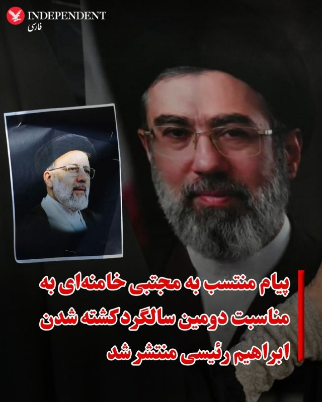
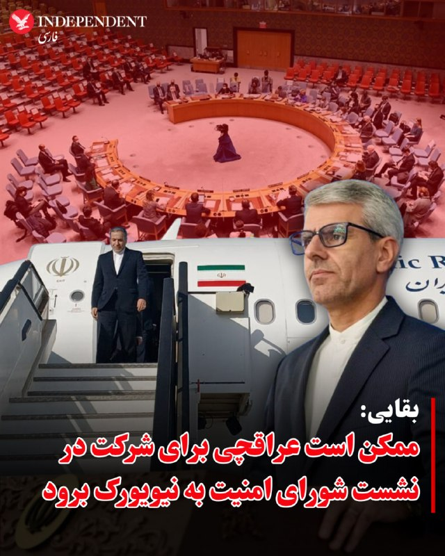
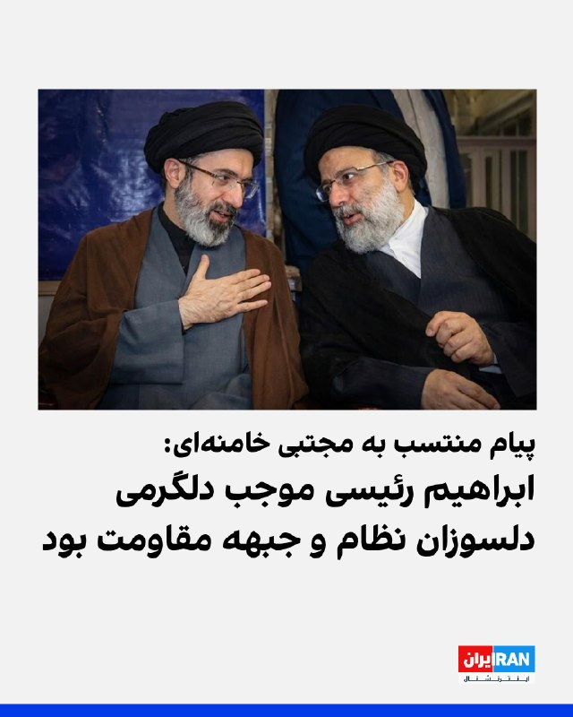
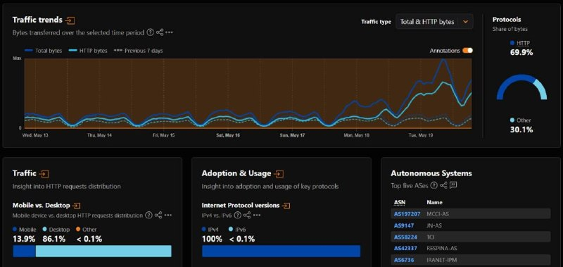
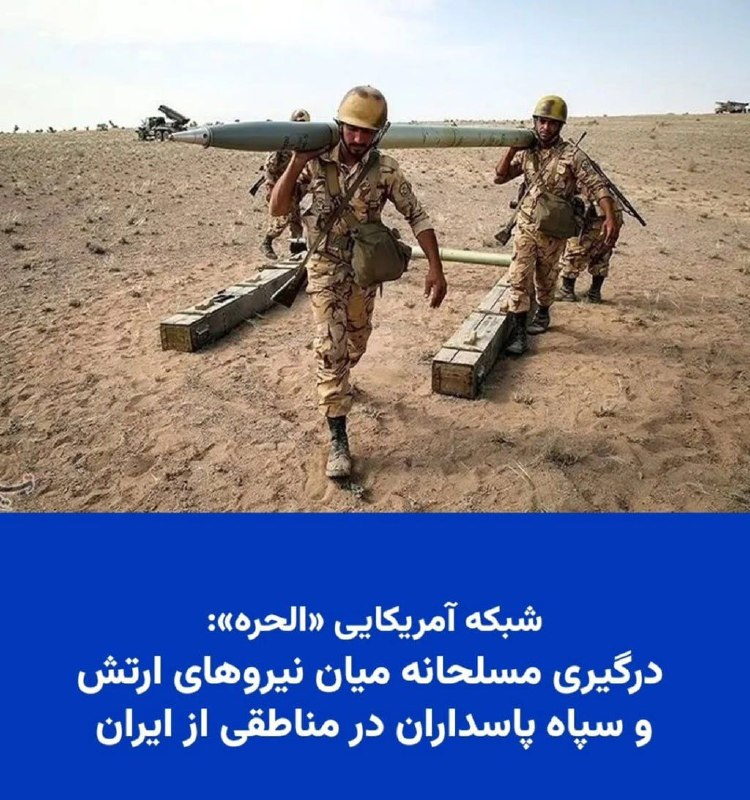

# خواننده تلگرام

<!-- TOP_NAV START -->

<a href="https://github.com/kiavash-sh/aio-downloader/blob/main/telegram/content/archive_1.md" style="display:inline-block; padding:6px 12px; margin:0 4px; background-color:#2ea44f; color:white; text-decoration:none; border-radius:4px; font-weight:bold;">صفحه بعد</a>

<!-- TOP_NAV END -->

<!-- MSG START -->

---
📅 بروزرسانی: 1405/02/30 16:02
---

## VahidOOnLine — post 241133

  <a href="telegram/content/VahidOOnLine_241133_1779280331.mp4" target="_blank">🎬 Download video</a>

امارات متحده عربی، چند روز پس از حمله پهپادی به نیروگاه هسته‌ای براکه در ابوظبی، از عراق خواست فوراً مانع هرگونه «اقدام خصمانه» از خاک خود شود.
وزارت خارجه امارات در بیانیه‌ای تأکید کرد دولت عراق باید بدون قید و شرط از انجام حملات از خاک این کشور جلوگیری کرده و تهدیدها را سریع و مسئولانه مهار کند.
ابوظبی همچنین از عراق خواست برای حفظ امنیت و ثبات منطقه نقش فعال‌تری ایفا کند و جایگاه خود را به‌عنوان «شریکی مسئول» در منطقه تقویت کند.
‌🏁 🇬🇧 ManotoTV

🤖 @VahidOOnLine

## VahidOOnLine — post 241132

  <a href="telegram/content/VahidOOnLine_241132_1779280332.mp4" target="_blank">🎬 Download video</a>

هم‌زمان با قهرمانی آرسنال، کاربران شبکه‌های اجتماعی از عارف جعفرزاده، هوادار این تیم و از جاویدنام‌های رشت، یاد کردند.

عارف جعفرزاده، اهل رشت، در جریان اعتراضات دی‌ماه ۱۴۰۴ جان باخت. بنیاد عبدالرحمن برومند سن او را ۳۴ سال، محل کشته‌شدن را رشت در استان گیلان و تاریخ جان‌باختن او را ۲۰ دی ۱۴۰۴ ثبت کرده و نحوه کشته‌شدن را «اعدام خودسرانه» عنوان کرده است.

علاقه عارف به آرسنال پیش‌تر نیز مورد توجه کاربران قرار گرفته بود. حالا با قهرمانی این تیم، نام او بار دیگر در شبکه‌های اجتماعی بازتاب یافته و کاربران با انتشار تصویری از مزارش نوشته‌اند: «جا دارد قهرمانی آرسنال را به جاویدنام عارف جعفرزاده تبریک بگوییم.»
‌🏁 🇬🇧 ManotoTV

🤖 @VahidOOnLine

## VahidOOnLine — post 241131

  

سنتکام، فرماندهی مرکزی آمریکا، اعلام کرد از زمان آغاز محاصره دریایی جنوب ایران، تا روز چهارشنبه نیروهای این کشور ۹۰ کشتی را تغییر مسیر داده‌اند. سنتکام نوشت: «چهار کشتی نیز برای تضمین اجرای محاصره دریایی از کار انداخته‌ شده‌اند.»

سنتکام همچنین با انتشار همچنین تصویری از یک بالگرد تهاجمی «ای‌اچ-۱ زد وایپر» متعلق به نیروی تفنگداران دریایی آمریکا منتشر کرد و نوشت که در جریان عملیات این محاصره دریایی، این بالگرد در نزدیکی یک کشتی تجاری در حال عبور از آب‌های منطقه‌ای گشت‌زنی می‌کند.
‌🏁 🇬🇧 IranintlTV

🤖 @VahidOOnLine

## VahidOOnLine — post 241130

  <a href="telegram/content/VahidOOnLine_241130_1779280334.mp4" target="_blank">🎬 Download video</a>

رویترز گزارش داد سه نفتکش غول‌پیکر چینی و کره‌جنوبی حامل حدود ۶ میلیون بشکه نفت خاورمیانه، پس از بیش از دو ماه توقف در خلیج فارس، از ۷تنگه هرمز عبور کرده و راهی بازارهای آسیایی شده‌اند.
بر اساس این گزارش، دو نفتکش چینی حامل نفت عراق و قطر و یک نفتکش کره‌جنوبی حامل نفت کویت، از مسیر تعیین‌شده از سوی جمهوری‌اسلامی عبور کرده‌اند.
‌🏁 🇬🇧 ManotoTV

🤖 @VahidOOnLine

## VahidOOnLine — post 241129

⭕️ملاقات ملونی و مودی در رم؛ نخستین سفر رسمی نخست وزیر هند به ایتالیا در ۲۶ سال گذشته

♦️جورجا ملونی، نخست‌وزیر ایتالیا روز چهارشنبه ۳۰ اردیبهشت ماه از نارندرا مودی، نخست وزیر هند در مجموعه تاریخی «ویلا دوریا پامفیلی» دیدار و گفت‌وگو کرد. این سفر، نخستین سفر یک نخست‌وزیر هند به ایتالیا در ۲۶ سال گذشته برای سفری رسمی با هدف ملاقات رهبران دو کشور به شمار می‌رود.

مودی که در حال پایان‌دادن به سفر دوره‌ای اروپایی خود است، پیش‌تر برای نشست گروه ۲۰ در سال ۲۰۲۱ و اجلاس گروه ۷ در سال ۲۰۲۴ به ایتالیا سفر کرده بود.

گسترش همکاری‌های اقتصادی، فناوری و امنیتی از محورهای اصلی گفت‌وگوهای دو طرف عنوان شده است.
‌🇸🇦 Indypersian

🤖 @VahidOOnLine

## VahidOOnLine — post 241128

  

♦️رسانه‌های داخلی ایران و کانال‌های ارتباطی منسوب به مجتبی خامنه‌ای، رهبر جمهوری اسلامی روز چهارشنبه ۳۰ اردیبهشت ماه پیامی منتسب به او را به مناسبت دومین سالگرد کشته شدن ابراهیم رئیسی، رئیس جمهوری پیشین جمهوری اسلامی ایران را منتشر کردند.

در این پیام، مجتبی خامنه‌ای با تقدیر از عملکرد ابراهیم رئیسی، دوره ناتمام ریاست او بر دولت جمهوری اسلامی را «مقیاسی از تلاش و دلسوزی برای ملت و کشور در عین حفظ استقلال» توصیف کرده است.
از زمان انتصاب مجتبی خامنه‌ای به رهبری در بحبوحه جنگ، هیچ صدا و تصویری از او منتشر نشده است. دو روز پیش، حسین کرمان‌پور، مدیر مرکز روابط عمومی و اطلاع‌رسانی وزارت بهداشت گفته بود که نه صورت مجتبی خامنه‌ای آسیب دیده و نه پای او قطع شده است.
‌🇸🇦 Indypersian

🤖 @VahidOOnLine

## VahidOOnLine — post 241127

  

♦️نمایندگان کنست، پارلمان اسرائیل روز چهارشنبه ۳۰ اردیبهشت در شور اول به لایحه قانونی  انحلال مجلس و برگزاری انتخابات زودهنگام رای مثبت دادند.

به گزارش خبرگزاری فرانسه، ۱۱۰ نماینده از مجموع ۱۲۰ عضو کنست به این لایحه که از طرف ائتلاف حاکم، حزب لیکود به رهبری نتانیاهو و دیگر احزاب راست و راست‌گرا، ارائه شده بود، رای مثبت دادند.

در صورت موافقت نمایندگان با این لایحه، پارلمان اسرائیل احتمالا در هفته‌های آینده و برای برگزاری انتخابات زودهنگام، منحل خواهد شد.
‌🇸🇦 Indypersian

🤖 @VahidOOnLine

## VahidOOnLine — post 241126

  

♦️روسیه و چین در یک بیانیه مشترک که در جریان سفر ولادیمیر پوتین به پکن صادر شد، با تاکید بر «دوستی عمیق دو کشور» از آنچه «ماجراجویی‌های نظامی و ترور رهبران کشورهای مستقل» خواندند، انتقاد کردند.

در بیانیه مشترک شی و پوتین که در پایگاه‌های اطلاع‌رسانی دولت‌های دو کشور منتشر شده، پکن و مسکو بدون اشاره مستقیم به آمریکا «ماجراجویی‌های نظامی» را محکوم کرده‌اند و از آنچه  «حملات نظامی غافلگیرانه به کشورهای دیگر»، «استفاده مزورانه از مذاکرات برای آماده‌سازی حملات»، «ترور رهبران کشورهای مستقل»، «بی‌ثبات کردن اوضاع داخلی کشورها» و «تلاش برای تغییر حکومت» انتقاد کردند.

شی و پوتین بدون اشاره به عملیات بازداشت نیکلاس مادورو، رئیس جمهوری پیشین ونزوئلا «ربودن آشکار رهبران کشورها برای محاکمه» را محکوم کردند.

رهبران چین و روسیه این رویه را به‌عنوان «نقض فاحش منشور ملل متحد» توصیف کرده‌اند.
‌🇸🇦 Indypersian

🤖 @VahidOOnLine

## VahidOOnLine — post 241125

  

♦️اسماعیل بقائی، سخنگوی وزارت امور خارجه جمهوری اسلامی، روز چهارشنبه ۳۰ اردیبهشت‌ماه درباره گمانه‌زنی‌ها راجع به سفر عباس عراقچی به نیویورک گفت:  «وزیر خارجه ایران برای شرکت در نشست شورای امنیت سازمان ملل درباره صلح و امنیت بین‌المللی دعوت شده، اما حضور او هنوز قطعی نیست.»

به گفته سخنگوی وزارت امور خارجه جمهوری اسلامی «این نشست به ریاست دوره‌ای چین در شورای امنیت، روز پنجم خرداد برگزار خواهد شد، اما با توجه به برنامه کاری فشرده وزیر امور خارجه»، تصمیم نهایی درباره سفر هنوز گرفته نشده است.»

این اظهارات پس از آن مطرح شد که علی خضریان، عضو کمیسیون امنیت ملی مجلس، در یک برنامه تلویزیونی نسبت به احتمال سفر عراقچی به نیویورک برای مذاکره درباره تنگه هرمز انتقاد کرده بود.
‌🇸🇦 Indypersian

🤖 @VahidOOnLine

## VahidOOnLine — post 241124

  <a href="telegram/content/VahidOOnLine_241124_1779280339.mp4" target="_blank">🎬 Download video</a>

سخنگوی وزارت خارجه جمهوری‌اسلامی اعلام کرده با توجه به ریاست دوره‌ای چین بر شورای امنیت سازمان ملل و برنامه پکن برای برگزاری «نشست ویژه وزیران خارجه درباره صلح و امنیت بین‌المللی»، از عباس عراقچی، وزیر خارجه نظام اسلامی، برای حضور در این نشست در نیویورک دعوت شده است.
‌🏁 🇬🇧 ManotoTV

🤖 @VahidOOnLine

## VahidOOnLine — post 241123

  <a href="telegram/content/VahidOOnLine_241123_1779280340.mp4" target="_blank">🎬 Download video</a>

کناره گیری محمدباقر قالیباف از ریاست هیئت‌ مذاکره کننده جمهوری‌اسلامی در مذاکرات با آمریکا،‌ از سوی رییس مرکز ارتباطات، رسانه و امور فرهنگی مجلس شورای اسلامی تکذیب شده است.
‌🏁 🇬🇧 ManotoTV

🤖 @VahidOOnLine

## VahidOOnLine — post 241122

  <a href="telegram/content/VahidOOnLine_241122_1779280341.mp4" target="_blank">🎬 Download video</a>

خبرگزاری رسمی اردن گزارش داد که نیروهای مسلح این کشور صبح امروز یک پهپاد ناشناس را که وارد حریم هوایی اردن شده بود، سرنگون کردند.
ارتش اردن این پهپاد را در استان جرش، در منطقه بلیلا در شمال کشور، هدف قرار داد. این حادثه تلفات جانی نداشت، اما خسارت‌های جزئی مادی بر جای گذاشت.
‌🏁 🇬🇧 ManotoTV

🤖 @VahidOOnLine

## VahidOOnLine — post 241121

  <a href="telegram/content/VahidOOnLine_241121_1779280342.mp4" target="_blank">🎬 Download video</a>

خبرگزاری رسمی اردن گزارش داد که نیروهای مسلح این کشور صبح امروز یک پهپاد ناشناس را که وارد حریم هوایی اردن شده بود، سرنگون کردند.
ارتش اردن این پهپاد را در استان جرش، در منطقه بلیلا در شمال کشور، هدف قرار داد. این حادثه تلفات جانی نداشت، اما خسارت‌های جزئی مادی بر جای گذاشت.
‌🏁 🇬🇧 ManotoTV

🤖 @VahidOOnLine

## VahidOOnLine — post 241120

  

رسانه رهبر جمهوری اسلامی پیامی منتسب به مجتبی خامنه‌ای به مناسبت دومین سالگرد ابراهیم رئیسی منتشر کرد.

در این پیام آمده است «خصوصیات رئیسی موجب دلگرم شدن دوستان ایران از جمله مجاهدان جبهه قدرتمند مقاومت و بسیاری از دلسوزان نظام می‌شد.»

ویژگی‌های ابراهیم رئیسی در این پیام «مسئولیت‌پذیری، جوانگرایی، توجه به عدالت، دیپلماسی فعال و نافع و به‌ویژه مردمی بودن» عنوان شده است.
‌🏁 🇬🇧 IranintlTV

🤖 @VahidOOnLine

## VahidOOnLine — post 241119

  <a href="telegram/content/VahidOOnLine_241119_1779280343.mp4" target="_blank">🎬 Download video</a>

♦️همزمان با تشدید گمانه‌زنی‌ها درباره حمله مجدد آمریکا به ایران و از سرگیری جنگ، خبرگزاری رویترز روز چهارشنبه ۳۰ اردیبهشت‌ماه تصاویری از حضور تعداد زیادی از هواپیماهای سوخت‌رسان ارتش ایالات متحده در فرودگاه بین‌المللی بن‌گوریون تل آویو را منتشر کرد.

دونالد ترامپ با اینکه گفته است به زودی به جنگ با ایران خاتمه خواهد داد، روز سه‌شنبه بار دیگر اعلام کرد که ممکن است بار دیگر حمله‌ای سخت به ایران را انجام دهد.

مذاکرات پایان دادن به جنگ، با میانجیگری پاکستان از هفته‌ها پیش به بن‌بست رسیده است. بنیامین نتانیاهو، نخست وزیر اسرائیل هم از آمادگی کامل این کشور برای ورود دوباره به جنگ سخن گفته است.
‌🇸🇦 Indypersian

🤖 @VahidOOnLine

## VahidOOnLine — post 241118

  

ایمان شمسایی، رییس مرکز ارتباطات، رسانه و امور فرهنگی مجلس، خبر استعفای محمدباقر قالیباف از ریاست هیات مذاکره‌کننده جمهوری اسلامی را «کذب محض و دروغی آشکار» خواند و منتشرکنندگان آن را به «خیانت» متهم کرد.

او در پیامی نوشت ادعای این جریان «امتداد همان خط تخریبی است که تا دیروز فرماندهان را نشانه می‌رفت و امروز شهدای والامقام را».

شمسایی افزود این جریان سابقه «هجمه» به فرماندهان نظامی، دفتر رهبر جمهوری اسلامی، مراجع تقلید و شورای عالی امنیت ملی را در کارنامه دارد.

در ادامه پیام او آمده است: «شایسته است این آقایان برای توجیه خیانت خود در شرایط جنگی پشت ژست‌های انقلابی پنهان نشوند و بیش از این به توجیه رفتارهای آسیب‌زای خود در شرایط حساس کنونی نپردازند.»

شمسایی تاکید کرد قالیباف همچنان ریاست هیات مذاکره‌کننده حکومت را بر عهده دارد و به‌تازگی نیز به پیشنهاد مسعود پزشکیان و تایید مجتبی خامنه‌ای، به‌عنوان نماینده ویژه جمهوری اسلامی در امور چین منصوب شده است.

در هفته‌های اخیر، گزارش‌های متعددی درباره اختلاف در ساختار حاکمیت جمهوری اسلامی منتشر شده است.
‌🏁 🇬🇧 IranintlTV

🤖 @VahidOOnLine

## VahidOOnLine — post 241117

  <a href="telegram/content/VahidOOnLine_241117_1779280347.mp4" target="_blank">🎬 Download video</a>

خبرگزاری حکومتی تسنیم گزارش داد که محسن نقوی، وزیر کشور پاکستان، برای دیدار و گفت‌وگو با مقام‌های جمهوری‌اسلامی راهی تهران شده است. این دومین سفر نقوی به تهران در طول یک هفته گذشته و در راستای تلاش‌های اسلام‌آباد برای میانجی‌گری میان جمهوری‌اسلامی و آمریکا است.
‌🏁 🇬🇧 ManotoTV

🤖 @VahidOOnLine

## VahidOOnLine — post 241116

  <a href="telegram/content/VahidOOnLine_241116_1779280348.mp4" target="_blank">🎬 Download video</a>

خبرگزاری رسمی اردن گزارش داد که نیروهای مسلح این کشور صبح امروز یک پهپاد ناشناس را که وارد حریم هوایی اردن شده بود، سرنگون کردند.
ارتش اردن این پهپاد را در استان جرش، در منطقه بلیلا در شمال کشور، هدف قرار داد. این حادثه تلفات جانی نداشت، اما خسارت‌های جزئی مادی بر جای گذاشت.
‌🏁 🇬🇧 ManotoTV

🤖 @VahidOOnLine

## VahidOOnLine — post 241115

  <a href="telegram/content/VahidOOnLine_241115_1779280349.mp4" target="_blank">🎬 Download video</a>

دیروز، هم‌زمان با زادروز جاویدنام پیام رخ‌بخش، خانواده و نزدیکان او بر سر مزارش در شیراز حاضر شدند و یادش را گرامی داشتند.

پیام رخ‌بخش، جوان ۳۲ ساله اهل شیراز، در ۱۹ دی‌ماه ۱۴۰۴ در جریان اعتراضات مردمی با شلیک مستقیم نیروهای حکومتی جان باخت.

حضور بر سر مزار جان‌باختگان، برای خانواده‌ها فقط سوگواری نیست؛ ادامه همان دادخواهی‌ای است که جمهوری اسلامی از آن هراس دارد.

#خانه_دوست_کجاست
‌🏁 🇬🇧 ManotoTV

🤖 @VahidOOnLine

## VahidOOnLine — post 241114

  <a href="telegram/content/VahidOOnLine_241114_1779280351.mp4" target="_blank">🎬 Download video</a>

بر اساس یک نظرسنجی جدید، اکثریت بزرگی از جمهوری‌خواهان همچنان عملکرد دونالد ترامپ در مدیریت جنگ ایران را تأیید می‌کنند.
طبق نظرسنجی انجام‌شده توسط خبرگزاری آسوشیتدپرس و مرکز پژوهش‌های امور عمومی نورک، در حالی که تنها یک‌سوم بزرگسالان آمریکایی از رویکرد رئیس‌جمهور حمایت می‌کنند، حدود دو‌سوم جمهوری‌خواهان با نحوه عملکرد او موافق هستند.
با این حال، بر اساس نظرسنجی ماه گذشته، جمهوری‌خواهان جوان‌تر بیشتر احتمال دارد که از عملکرد ترامپ در این موضوع ناراضی باشند.
علاوه بر این، تنها ۶ نفر از هر ۱۰ جمهوری‌خواه (در مقایسه با ۸ نفر از هر ۱۰ نفر در ماه فوریه) از نحوه مدیریت اقتصاد توسط رئیس‌جمهور حمایت می‌کنند؛ اقتصادی که تحت تأثیر جنگ قرار گرفته است.
‌🏁 🇬🇧 ManotoTV

🤖 @VahidOOnLine

## WithYashar — post 11749

العربیه: آمریکا به پاکستان اطلاع داده که در موضوع هسته‌ای و تنگه هرمز هیچ امتیازی نخواهد داد.
@withyashar

## WithYashar — post 11748

شبکه الحدث: جمهوری اسلامی و پاکستان در خصوص مذاکرات دچار اختلاف‌نظر شده‌اند
الحدث گزارش داد در دو هفته گذشته، همکاری میان حکومت ایران و پاکستان با چالش‌هایی روبه‌رو شده و فضای بی‌اعتمادی بر سطح هماهنگی‌های دو طرف سایه انداخته است.
این رسانه افزود میان تهران و اسلام‌آباد درباره کانال‌های مذاکره و محل برگزاری گفت‌وگوها اختلاف‌نظر وجود دارد.
بر اساس این گزارش، پاکستان از ایجاد کانال‌های ارتباطی جدید میان تهران و واشینگتن ابراز نارضایتی کرده است.
@withyashar

## WithYashar — post 11747

## WithYashar — post 11746

## WithYashar — post 11743

فال حافظ محمد رضا پهلوی…
فلک به مردم نادان دهد زمام مراد
تو اهل فضلی و دانش همین گناهت بس
@withyashar
عکس اون روز هم به دقیق ترین حالت ممکن براتون بازسازی کردم
@withyashar

## WithYashar — post 11742

من رفیق نیمه راه نیستم! مرسی از پیغام های زیباتون 😃 تازه خلیلی هم خوش مسافرتم اینو همه دوستام میدونن ، شما هم دیگه متوجه شدید 🤣🙌🏾

## WithYashar — post 11741

## WithYashar — post 11740

## WithYashar — post 11739

## mwarmonitor — post 9343

  

🇺🇸یک بالگرد تهاجمی AH-1Z وایپر نیروی تفنگداران دریایی ایالات متحده در نزدیکی یک کشتی تجاری که در آب‌های منطقه‌ای در حال عبور است، گشت‌زنی می‌کند؛ هم‌زمان نیروهای آمریکایی در حال اجرای محاصره دریایی علیه ایران هستند.
تا تاریخ ۲۰ مه، نیروهای آمریکا برای اطمینان از رعایت این محاصره، مسیر ۹۰ کشتی را تغییر داده و ۴ کشتی را از کار انداخته‌اند.

@mwarmonitor

## mwarmonitor — post 9342

  

🔴ایران تهدید کرد در صورت عملی شدن تهدید «ضربهٔ بزرگ» ترامپ، به کشورهایی خارج از خاورمیانه حمله خواهد کرد. نیویورک پست

@mwarmonitor

## mwarmonitor — post 9341

  

🚢چند نفتکش امروز از تنگه هرمز عبور کردند، از مسیر عوارضی ایران:

🇰🇷 UNIVERSAL WINNER (IMO: 9837602)
از کویت به کره جنوبی

🇭🇰 OCEAN LILY (IMO: 9284960)
از امارات به چین

🇵🇦 DEEPBLUE (IMO: 9350862)
از عمان به امارات

🇨🇾 GRAND LADY (IMO: 9406166)
از چین مقصد نامشخص در خلیج فارس

@mwarmonitor

## mwarmonitor — post 9340

🔴ناو جنگی ترامپ مانند ناو هواپیمابر فورد با سوخت هسته‌ای کار خواهد کرد

📝کالین دمارست AXIOS

🔰به گفته دریاسالار داریل کاودل (Daryl Caudle)، فرمانده عملیات نیروی دریایی، ناو جنگی کلاس ترامپ که هزینه ساخت اولین فروند از آن بیش از ۱۷ میلیارد دلار برآورد شده است، مجهز به پیشران هسته‌ای خواهد بود.

🔸چرا این موضوع اهمیت دارد؟
این اعلامیه به ماه‌ها بحث و گمانه‌زنی درباره نحوه حرکت و سرعت جابه‌جایی این ناو جنگی پایان می‌دهد.
رهبری نیروی دریایی تا اواخر آوریل، پیشران هسته‌ای را «بعید» توصیف کرده بود. مشخصاتی که برای نخستین بار ماه‌ها پیش منتشر شد، مدام در حال تغییر و تحول بوده‌اند.
🔹اظهار نظرها
کاودل در جریان شهادت خود در کنگره گفت: «من بسیار هیجان‌زده‌ام که سرانجام روی این موضوع به توافق رسیدیم که این ناو هسته‌ای خواهد بود.»
او افزود: «ما برای تحویل سریع‌تر، گزینه‌های مختلف از جمله سوخت‌های متعارف را بررسی کردیم و در نهایت دوباره به نقطه اول برگشتیم تا آن را هسته‌ای کنیم. این دقیقاً پاسخ درست است.»
🔸جزئیات بیشتر
این ناو جنگی به همان نیروگاهی مجهز خواهد شد که در ناو هواپیمابر جرالد آر. فورد (Gerald R. Ford) — بزرگترین کشتی جنگی جهان — به کار رفته است؛ یعنی راکتور A1B.
کاودل گفت: «تمام فناوری‌هایی که از منظر بخش راکتور در طراحی ناو جنگی هسته‌ای به کار می‌روند، همگی فناوری‌های انتقالی و اقتباس‌شده از کلاس فورد هستند؛ همان‌طور که بیشتر سیستم‌های رزمی، سیستم‌های راداری و سیستم‌های موشکی نیز همین‌گونه‌اند. آنچه جدید است، شکل بدنه (Hull form) آن است.»
نکته جالب توجه
ناوهای هواپیمابر در حال حاضر تنها کشتی‌های سطحی با پیشران هسته‌ای در ناوگان نیروی دریایی ایالات متحده هستند.
🔹گام بعدی چیست؟
به گزارش نشریه بریکینگ دیفنس (Breaking Defense)، نیروی دریایی خواهان ساخت ۱۵ فروند از این ناوهای جنگی تا سال ۲۰۵۶ است. هزینه ساخت سه فروند اول آن بیش از ۴۳ میلیارد دلار خواهد بود.

@mwarmonitor

## mwarmonitor — post 9339

  

📝 واقعاً مبارکه! بالاخره با اقتدار رسیدیم به قله؛ جایی که خریدن یک رول کیسه فریزر ۵۰۰ عددی، دیگر یک خرید معمولی نیست، بلکه با قیمت یک میلیون و صد و هشتاد و پنج هزار تومان، رسماً یک سرمایه‌گذاری استراتژیک و فوق‌لاکچری حساب می‌شه. اگر این رسیدن به قله نیست پس چیه؟ آدم دلش خون می‌شه وقتی می‌بینه تو همین وضعیت، یه مشت حرومزاده شب‌ها وسط میدان پرچم‌گردانی می‌کنن و شعار شبانه می‌دن، یا اونایی که بی‌خیالِ دنیا، در حال دور دور کردن، کافه‌گردی و شرکت در کلاس‌های جورواجور ادای هستن. مگه میشه یک رول پلاستیک ۱,۱۸۵,۰۰۰ تومان باشه و جگر آدم خون نشه؟ توی این قله‌ای که برای ما ساختید، تف و لعنت کمترین میزان نفرت برای شماست؛ بفرمایید کاپوچینویتان را بنوشید و دور دور کنید، تا می‌تونید کثافت‌کاریاتون رو ادامه بدید و به ریش این مردم بخندید، ولی این نفرتِ انباشته‌شده بالاخره یه جا خفت همه‌تون رو می‌چسبه!

@mwarmonitor

## FoxNewsTwitter — post 341980

  <a href="telegram/content/FoxNewsTwitter_341980_1779280356.mp4" target="_blank">🎬 Download video</a>

Fox News (Twitter/X)

WATCH: New video shows U.S. combat operations in the Middle East unfolding in real time.

CENTCOM enforces the American naval blockade against Iran, sharing that U.S. forces have now redirected 89 commercial vessels to stop traffic in and out of Iranian ports as the operation escalates across the region.

## FoxNewsTwitter — post 341979

‌Fox News (Twitter/X)

Read more:

## FoxNewsTwitter — post 341978

  

Fox News (Twitter/X)

“Dumb motherf****** didn’t deserve to live.”

Far-left Democrat Senate candidate Graham Platner mocking a U.S. soldier who was shot four times in Afghanistan in a resurfaced Reddit comment.

The post made fun of Purple Heart recipient Pfc. Ted Daniels after he took incoming fire during a 2012 clash with the Taliban.

Platner’s now deleted comment went on to say:

"At least his stupidity and fat ass wheezing are available for all future infantrymen to witness and hold in contempt. Poor marksmanship on the Taliban's part is the only reason this mouthbreather made it home, he managed to make every possible s*** decision possible when it comes to small unit combat."

## FoxNewsTwitter — post 341977

  

Fox News (Twitter/X)

NEW: Trump-backed Republicans rack up major primary victories across the country.

Nearly 30 candidates endorsed by President Trump secure wins in congressional and statewide races across Kentucky, Georgia, Pennsylvania, and Alabama, including high-profile Senate and governor contests.

Trump-backed Ed Gallrein defeated incumbent Kentucky GOP Rep. Thomas Massie in what turned out to be the most expensive House primary in U.S. history.

Also in Kentucky, Congressman Andy Barr won the GOP Senate primary and is seen as the heavy favorite to replace outgoing Senator Mitch McConnell.

Alabama Senator Tommy Tuberville had an easy win securing the GOP gubernatorial nomination in his state.

## pm_afshaa — post 91102

  <a href="telegram/content/pm_afshaa_91102_1779280360.webm" target="_blank">🎬 Download video</a>

🔴العربیه: آمریکا به پاکستان اطلاع داده که در موضوع هسته‌ای و تنگه هرمز هیچ امتیازی نخواهد داد.

💧 Rainbet.com the #1 Non-KYC Crypto Casino & Sportsbook @rainbetcom

😁 @Pm_Afshaa

## pm_afshaa — post 91101

  <a href="telegram/content/pm_afshaa_91101_1779280361.webm" target="_blank">🎬 Download video</a>

🔴سی‌بی‌اس به نقل از منابع دیپلماتیک:
اسلام‌آباد تلاش‌های خود را برای حل مناقشه دوچندان کرده است و معتقد است که شروع مجدد جنگ برای همه فاجعه خواهد بود.

💧 Rainbet.com the #1 Non-KYC Crypto Casino & Sportsbook @rainbetcom

😁 @Pm_Afshaa

## pm_afshaa — post 91100

  <a href="telegram/content/pm_afshaa_91100_1779280362.webm" target="_blank">🎬 Download video</a>

🔴نیویورک پست: جمهوری اسلامی تهدید کرده در صورت عملی شدن تهدید «ضربهٔ بزرگ» ترامپ، به کشورهایی خارج از خاورمیانه حمله خواهد کرد.

💧 Rainbet.com the #1 Non-KYC Crypto Casino & Sportsbook @rainbetcom

😁 @Pm_Afshaa

## pm_afshaa — post 91099

  <a href="telegram/content/pm_afshaa_91099_1779280362.webm" target="_blank">🎬 Download video</a>

🔴هاآرتص به نقل از منابع امنیتی:
از حرف‌های ترامپ که گفت تا حمله به ایران چند ساعت دیگه مونده، خیلی تعجب کردیم. حمله دوباره آمریکا به ایران تقریباً باعث میشه اسرائیل هم وارد جنگ بشه. منتظر بودیم حمله به ایران مستقیم و گسترده با اسرائیل هماهنگ بشه.

💧 Rainbet.com the #1 Non-KYC Crypto Casino & Sportsbook @rainbetcom

😁 @Pm_Afshaa

## pm_afshaa — post 91098

  <a href="telegram/content/pm_afshaa_91098_1779280363.webm" target="_blank">🎬 Download video</a>

🔴محسن نقوی، وزیر کشور پاکستان برای دیدار با مسئولان جمهوری اسلامی، برای بار دوم در این هفته عازم تهران شده.

💧 Rainbet.com the #1 Non-KYC Crypto Casino & Sportsbook @rainbetcom

😁 @Pm_Afshaa

## pm_afshaa — post 91097

🔴قوه قضائیه: رشید مظاهری، بازیکن سابق فوتبال، هنگام خروج غیرقانونی از کشور دستگیر شده.

این فرد قصد داشته با تغییر چهره و پول دادن به ماموران مرزبانی، از مرزهای غربی به صورت غیرقانونی از کشور فرار کنه، ولی موقع خروجش دستگیر شده

💧 Rainbet.com the #1 Non-KYC Crypto Casino & Sportsbook @rainbetcom

😁 @Pm_Afshaa

## pm_afshaa — post 91096

🔴وای نت: امارات هماهنگی‌های امنیتی و عملیاتی با اسرائیل را تشدید کرده

💧 Rainbet.com the #1 Non-KYC Crypto Casino & Sportsbook @rainbetcom

😁 @Pm_Afshaa

## pm_afshaa — post 91095

🔴کانال 14 اسرائیل:فرودگاه بن گوریون حتی در صورت از سرگیری جنگ با جمهوری اسلامی تروریست به دلیل کاهش توان موشکی ج.ا به فعالیت خود ادامه خواهد داد

💧 Rainbet.com the #1 Non-KYC Crypto Casino & Sportsbook @rainbetcom

😁 @Pm_Afshaa

## pm_afshaa — post 91094

  

🚨اشتراک استارز ⭐️ فیلترشکن ایران وی پی ان
تخفیف ها تا ساعت ۱۲ امشب هستن و هیچ وقت دیگر بر نمیگردن❌

تعرفه های باور نکردنی🔮

سرورا بدون ضریب هستن و ساب دارن😎🔋

1 gig= 195t🚀

3 gig= 570t 🚀

5 gig= 950t🚀

7 gig = 1300t 🚀

10 gig= 1800t 🚀

قبل خرید میتونید تست بگیرید 🛜
بهترین و ارزون ترین سرور ایران دست ماست

🚨تمامی سرور ها کاربر نامحدود هستن و تاریخ انقضا ندارن✅

جهت خرید به ایدی زیر پیام بدین 👇

@IRAN_VPNADMIN

کانال. و رضایت مشتری ها👇

https://t.me/IRAN_VPNON

## pm_afshaa — post 91093

🔴وای نت:در رویدادی بسیار غیر عادی و عجیب نتانیاهو به دلیل بحث امنیتی اضطراری در رأی‌گیری امروز برای انحلال پارلمان اسرائیل شرکت نخواهد کرد،
همچنین جلسه دادگاه نتانیاهو نیز امروز لغو شده

💧 Rainbet.com the #1 Non-KYC Crypto Casino & Sportsbook @rainbetcom

😁 @Pm_Afshaa

## pm_afshaa — post 91092

🔴وزارت خارجه آمریکا تا سقف 15 میلیون دلار پاداش برای اطلاعات در مورد شبکه مالی سپاه پاسداران تعیین کرد

💧 Rainbet.com the #1 Non-KYC Crypto Casino & Sportsbook @rainbetcom

😁 @Pm_Afshaa

## pm_afshaa — post 91091

🔴ترامپ و نتانیاهو دیشب تماس تلفنی "طولانی و دراماتیک" داشتن

💧 Rainbet.com the #1 Non-KYC Crypto Casino & Sportsbook @rainbetcom

😁 @Pm_Afshaa

## DEJradio — post 4773

⭕️ جمهوری اسلامی واردات مواد پتروشیمی از طریق کولبری و ملوانی را آزاد کرد

وزارت صمت، جمهوری اسلامی واردات مواد اولیه صنایع پتروشیمی و پلیمری از طریق رویه‌های کولبری و ملوانی را مجاز اعلام کرد.
خبرگزاری حکومتی تسنیم، نزدیک به نیروهای امنیتی، نوشت این تصمیم در پی کمبود مواد اولیه در برخی واحدهای تولیدی گرفته شده است.
در سال‌های اخیر کولبران بارها مورد هدف نیروهای مسلح جمهوری اسلامی قرار گرفته و کشته شده‌اند.

#تحریم #قاچاق
@DEJradio

## DEJradio — post 4772

⭕️ عروس و پسر معصومه ابتکار در جست‌وجوی یک زندگی «عادی» در آمریکا بودند

مریم طهماسبی، عروس معصومه ابتکار، در گفت‌وگو با آسوشیتدپرس از درون بازداشتگاه مهاجرتی در تگزاس، گفت خانواده‌اش تنها به‌دنبال «زندگی عادی» در آمریکا بوده‌اند.
او و همسرش عیسی هاشمی مدعی شدند که قصد داشتند تدریس را از سر بگیرند و تصور نمی‌کردند بازداشت شوند.
به گزارش آسوشیتدپرس، این خانواده پس از بازداشت در لس‌آنجلس به‌دلیل ارتباط خانوادگی با معصومه ابتکار، اکنون خواستار آزادی‌اند.
یک قاضی فدرال موقتا دولت آمریکا را از اخراج این خانواده منع کرده است.
وزارت امور خارجۀ ایالات متحده، کارزاری را برای اخراج وابستگان رژیم از آمریکا به راه اندخته است.
معصومه ابتکار، رئیس پیشین سازمان محیط زیست، از کسانی بود که با گروگانگیران اعضای سفارت آمریکا در تهران همکاری کرده بود.

#آقازاده‌ها #صادراتی‌ها #معصومه_ابتکار
@DEJradio

## DEJradio — post 4771

⭕️ اکسیوس: ترامپ به تهران تا آدینه یا ابتدای هفتۀ آینده فرصت داد

وبسایت آمریکایی اکسیوس، به نقل از دو مقام آمریکایی گزارش داد ترامپ تنها «دو تا سه روز، شاید تا آدینه یا شنبه و اوایل هفتۀ آینده» به تهران فرصت داد تا به پیشرفت دیپلماتیک برسد.
به گزارش این وبسایت آمریکایی، دونالد ترامپ پس از تعلیق حملۀ برنامه‌ریزی‌شده به جمهوری اسلامی، نشستی با تیم امنیت ملی خود دربارۀ گزینه‌های نظامی برگزار کرده است.
اکسیوس نوشت بررسی دوباره طرح‌های نظامی نشان می‌دهد ترامپ به‌طور جدی احتمال ازسرگیری جنگ را درنظر دارد.
مقام‌های آمریکایی همچنین گفته‌اند ترامپ پیش از تعلیق حمله، هنوز تصمیم پایانی را برای اقدام نظامی نگرفته بود، اما آمادۀ آن بود.

#ترامپ #توافق #مذاکرات
@DEJradio

## DEJradio — post 4770

⭕️ آمریکا یک نفتکش مرتبط با جمهوری اسلامی را در اقیانوس هند توقیف کرد

وال‌استریت ژورنال گزارش داد آمریکا یک نفتکش دیگر مرتبط با جمهوری اسلامی را در اقیانوس هند توقیف کرده است.
این نفتکش با نام اسکای ویو، پیش‌تر از سوی واشینگتن تحریم شده بود. اسکای ویو در انتقال نفت از مبدأ ایران نقش داشت.
براساس داده‌های رهگیری دریایی، این کشتی احتمالا بیش از یک میلیون بشکه نفت خام حمل می‌کرد.
سنتکام، ستاد فرماندهی مرکزی ارتش آمریکا اعلام کرد مانع حرکت ۸۹ کشتی به مبدأ یا از مقصد بنادر ایران شده است.
به گزارش سنتکام، همۀ این شناورهای مرتبط با جمهوری اسلامی در جریان محاصرۀ دریایی ناگزیر به تغییر مسیر شدند.

#سنتکام #محاصره_دریایی
@DEJradio

## DEJradio — post 4769

⭕️ کره جنوبی یک نفتکش را با هماهنگی جمهوری اسلامی از تنگۀ هرمز عبور می‌دهد

چو هیون، وزیر امور خارجۀ کره جنوبی، اعلام کرد یک نفتکش حامل نفت خام این کشور با هماهنگی مقام‌های جمهوری اسلامی در حال عبور از تنگۀ هرمز است.
این مقام کره‌ای جزئیات بیشتری دربارۀ این نفتکش و شیوۀ هماهنگی ارائه نکرد.
این اظهارات چند هفته پس از حملۀ پهپادی به یک کشتی باری کره جنوبی مطرح می‌شود.
جمهوری اسلامی در حملۀ پیشین به کشتی کره‌ای، متهم شناخته شده بود.
کرۀ جنوبی پس از آن حمله اعلام کرده بود مشارکت در عملیات بازگشایی تنگۀ هرمز به رهبری آمریکا را بررسی می‌کند.

#کره_جنوبی #خلیج_فارس #تنگه_هرمز
@DEJradio

## DEJradio — post 4768

⭕️ جمهوری اسلامی نفت را روی نفتکش‌های فرسوده ذخیره می‌کند

فایننشال تایمز گزارش داد جمهوری اسلامی به‌دلیل محدود شدن صادرات نفت در پی محاصرۀ آمریکا، ناچار شده نفت خود را روی نفتکش‌های فرسوده در خلیج فارس ذخیره کند.
براساس داده‌های سازمان اتحاد علیه ایران هسته‌ای، شمار نفتکش‌های حامل نفت و محصولات پتروشیمی ایران در خلیج فارس به ۳۹ فروند رسید.
بنا بر این گزارش، بخش قابل توجهی از این کشتی‌ها در نزدیکی پایانۀ نفتی جزیرۀ خارگ مستقراند.
فایننشال تایمز همچنین از شناسایی ۱۳ نفتکش دیگر در نزدیکی بندر چابهار خبر داد. این شناورها در امتداد خط محاصرۀ دریایی آمریکا قرار دارند.

#محاصره_دریایی #نفت
@DEJradio

## DEJradio — post 4767

⭕️ عراقچی آمریکا و اسرائیل را به «غافلگیری‌های بیشتر» تهدید کرد

عباس عراقچی، وزیر امور خارجۀ جمهوری اسلامی، با ادعا به «تجربیات» به‌دست‌آمده از جنگ، هشدار داد در صورت ازسرگیری درگیری‌ها، حکومت با «غافلگیری‌های بیشتری» وارد میدان می‌شود.

او همچنین ادعا کرد جمهوری اسلامی نخستین طرفی بوده که موفق به سرنگونی جنگندۀ اف-۳۵ شد.
عراقچی مدعی شد آمریکا در جریان درگیری‌های اخیر ده‌ها هواپیمای نظامی خود را از دست داده است.

#عراقچی #جنگ
@DEJradio

## DEJradio — post 4766

⭕️ نیویورک‌پست: فیفا پرچم شیر و خورشید را در جام جهانی ۲۰۲۶ ممنوع می‌کند

نیویورک‌پست گزارش داد فدراسیون جهانی فوتبال تصمیم گرفته ورود پرچم‌ها و نمادهای شیر و خورشید، به ورزشگاه‌های برگزارکنندۀ جام جهانی ۲۰۲۶ ممنوع شود.
براساس این گزارش، فیفا این نمادها را مغایر قوانین مربوط به اقلام سیاسی و تبعیض‌آمیز دانسته است.
نیویورک‌پست نوشت برخی فعالان ایرانی-آمریکایی هشدار داده‌اند اجرای این ممنوعیت می‌تواند با اعتراض گستردۀ هواداران ایرانی همراه شود.
فدراسیون فوتبال جمهوری اسلامی به‌تازگی با هدف ایجاد محدودیت علیه ایرانیان مخالف رژیم، به فیفا فشار آورده و شروطی را برای حضور در جام جهانی تعیین کرده است.

#شیروخورشید #فوتبال #جام_جهانی
@DEJradio

## DEJradio — post 4765

⭕️ حملۀ مستقیم به نیروگاه برکت امارات می‌تواند فاجعۀ هسته‌ای ایجاد کند

رافائل گروسی، مدیرکل آژانس جهانی انرژی اتمی، دربارۀ پیامدهای حمله به نیروگاه هسته‌ای برکت در امارات هشدار داد.
گروسی در نشست شورای امنیت سازمان ملل گفت هرگونه اصابت مستقیم به این نیروگاه، ممکن است به نشت شدید مواد رادیواکتیو منجر شود.
به گفتۀ گروسی، آسیب به خطوط برق نیروگاه، خطر ذوب شدن قلب راکتورها و تخلیۀ گستردۀ مناطق پیرامونی را افزایش می‌دهد.
مدیرکل آژانس جهانی هسته‌ای تاکید کرد حمله نظامی به تاسیسات هسته‌ای صلح‌آمیز به هیچ عنوان قابل قبول نیست.
محوطه‌ای نزدیک به تأسیسات نیروگاه هسته‌ای برکت امارات، در روزهای پیشین هدف حملۀ پهپادی قرار گرفت.

#پهپاد #امارات
@DEJradio

## DEJradio — post 4764

⭕️ سنتکام: محاصرۀ کامل دریایی علیه جمهوری اسلامی ادامه دارد

سنتکام با انتشار ویدیویی اعلام کرد نیروهای آمریکا همچنان عملیات دریایی و هوایی خود را در منطقۀ خاورمیانه ادامه می‌دهند.
ستاد فرماندهی مرکزی ارتش آمریکا اعلام کرد نیروهای این کشور محاصره‌ای کامل را علیه جمهوری اسلامی را اجرا می‌کنند و مانع انجام تجارت نفتی از بنادر ایران می‌شوند.
براساس این بیانیه، تاکنون ۸۹ کشتی تجاری در سایۀ این محاصره ناگزیر به تغییر مسیر شده‌اند.

#سنتکام #تنگه_هرمز
@DEJradio

## DEJradio — post 4763

🚨 پوتین برای دیدار با شی جین‌پینگ وارد پکن شد

ولادیمیر پوتین، رئیس جمهوری روسیه، برای سفری رسمی و دو روزه وارد پکن شد.
پوتین با شی جین‌پینگ، دربارۀ همکاری‌های اقتصادی، انرژی و مسائل منطقه‌ای و بین‌المللی گفت‌وگو می‌کند.او در فرودگاه پکن مورد استقبال رسمی مقام‌های چینی و گارد تشریفات «ارتش آزادی‌بخش خلق» قرار گرفت.
این سفر همزمان با بیست‌وپنجمین سالگرد پیمان دوستی چین و روسیه انجام می‌شود.

#پوتین #چین #روسیه
@DEJradio

## IranIntlTV — post 338071

  

سنتکام، فرماندهی مرکزی آمریکا، اعلام کرد از زمان آغاز محاصره دریایی جنوب ایران، تا روز چهارشنبه نیروهای این کشور ۹۰ کشتی را تغییر مسیر داده‌اند. سنتکام نوشت: «چهار کشتی نیز برای تضمین اجرای محاصره دریایی از کار انداخته‌ شده‌اند.»

سنتکام همچنین با انتشار همچنین تصویری از یک بالگرد تهاجمی «ای‌اچ-۱ زد وایپر» متعلق به نیروی تفنگداران دریایی آمریکا منتشر کرد و نوشت که در جریان عملیات این محاصره دریایی، این بالگرد در نزدیکی یک کشتی تجاری در حال عبور از آب‌های منطقه‌ای گشت‌زنی می‌کند.
https://iranintl.com/202605209458

## IranIntlTV — post 338070

  <a href="telegram/content/IranIntlTV_338070_1779280366.mp4" target="_blank">🎬 Download video</a>

اویگدور لیبرمن، وزیر دفاع سابق و نماینده فعلی کنست اسرائیل، به بابک اسحاقی، خبرنگار ایران‌اینترنشنال، گفت تغییر حکومت در ایران را برای پایان تنش‌ها در منطقه ضروری می‌داند.
@iranintltv

## IranIntlTV — post 338069

  <a href="telegram/content/IranIntlTV_338069_1779280368.mp4" target="_blank">🎬 Download video</a>

پنتاگون اعلام کرده مشارکت خود در هیات مشترک دفاعی با کانادا را به حالت تعلیق درآورده است. تصمیمی که به گفته مقام‌های آمریکایی در واکنش به کوتاهی اتاوا در عمل به تعهدات مالی و دفاعی اتخاذ شده است.
مهسا مرتضوی، خبرنگار ایران‌اینترنشنال، گزارش می‌دهد
@iranintltv

## IranIntlTV — post 338068

  <a href="telegram/content/IranIntlTV_338068_1779280370.mp4" target="_blank">🎬 Download video</a>

وزارت خارجه آلمان به ایران‌اینترنشنال گفت بررسی بخشی از پرونده‌های ویزای ایرانیان، به‌ویژه متقاضیان کار و دانشجویان را از سفارت آلمان در تهران به سفارت این کشور در ایروان منتقل کرده است.

جزییات بیشتر با احمد صمدی، خبرنگار ایران‌اینترنشنال
@iranintltv

## IranIntlTV — post 338067

  <a href="telegram/content/IranIntlTV_338067_1779280372.mp4" target="_blank">🎬 Download video</a>

مروری بر روزنامه‌های ایران، چهارشنبه ۳۰ اردیبهشت، با مجتبی هاشمی، روزنامه‌نگار
@iranintltv

## IranIntlTV — post 338066

  <a href="telegram/content/IranIntlTV_338066_1779280375.mp4" target="_blank">🎬 Download video</a>

پیام‌های رسیده از سوی شهروندان به ایران‌اینترنشنال، به‌طور گسترده از افزایش حس ناامیدی، بلاتکلیفی و سرخوردگی حکایت دارد.
جزییات بیشتر با سبا حیدرخانی، عضو تحریریه ایران‌اینترنشنال
@Iranintltv

## IranIntlTV — post 338065

  <a href="telegram/content/IranIntlTV_338065_1779280377.mp4" target="_blank">🎬 Download video</a>

شهروندان در پیام‌هایی به ایران‌اینترنشنال از احساس بلاتکلیفی، سرخوردگی و افسردگی در زندگی روزمره خود می‌گویند. آن‌ها وضعیت اقتصادی رو به وخامت را عامل اصلی افزایش ناامیدی و نگرانی درباره آینده عنوان می‌کنند.
@iranintltv

## IranIntlTV — post 338064

  <a href="telegram/content/IranIntlTV_338064_1779280380.mp4" target="_blank">🎬 Download video</a>

پیام‌های ارسالی شهروندان به ایران‌اینترنشنال نشان می‌دهد تلاش جوانان برای مهاجرت، در شرایط نه جنگ و نه صلح، تشدید شده است.

گفت‌وگو با فرزاد فتاحی، عضو تحریریه ایران‌اینترنشنال
@iranintltv

## IranIntlTV — post 338063

کلیات لایحه انحلال پارلمان اسرائیل تصویب شد و در صورت تصویب نهایی، انتخابات زودهنگام برگزار خواهد شد.
هم‌زمان با غیبت بنیامین نتانیاهو و یسرائیل کاتز در پارلمان، کانال ۱۲ اسرائیل از گفت‌وگوی تلفنی دونالد ترامپ و نتانیاهو خبر داد و این تماس را «طولانی و دراماتیک» توصیف کرد.

بابک اسحاقی، خبرنگار ایران‌اینترنشنال، گزارش می‌دهد
@iranintltv

## IranIntlTV — post 338062

  

رسانه رهبر جمهوری اسلامی پیامی منتسب به مجتبی خامنه‌ای به مناسبت دومین سالگرد ابراهیم رئیسی منتشر کرد.

در این پیام آمده است «خصوصیات رئیسی موجب دلگرم شدن دوستان ایران از جمله مجاهدان جبهه قدرتمند مقاومت و بسیاری از دلسوزان نظام می‌شد.»

ویژگی‌های ابراهیم رئیسی در این پیام «مسئولیت‌پذیری، جوانگرایی، توجه به عدالت، دیپلماسی فعال و نافع و به‌ویژه مردمی بودن» عنوان شده است.
https://iranintl.com/202605205759

## IranIntlTV — post 338061

  <a href="telegram/content/IranIntlTV_338061_1779280383.mp4" target="_blank">🎬 Download video</a>

سرخط خبرهای چهارشنبه ۳۰ اردیبهشت
@iranintltv

## IranIntlTV — post 338060

  

ایمان شمسایی، رییس مرکز ارتباطات، رسانه و امور فرهنگی مجلس، خبر استعفای محمدباقر قالیباف از ریاست هیات مذاکره‌کننده جمهوری اسلامی را «کذب محض و دروغی آشکار» خواند و منتشرکنندگان آن را به «خیانت» متهم کرد.

او در پیامی نوشت ادعای این جریان «امتداد همان خط تخریبی است که تا دیروز فرماندهان را نشانه می‌رفت و امروز شهدای والامقام را».

شمسایی افزود این جریان سابقه «هجمه» به فرماندهان نظامی، دفتر رهبر جمهوری اسلامی، مراجع تقلید و شورای عالی امنیت ملی را در کارنامه دارد.

در ادامه پیام او آمده است: «شایسته است این آقایان برای توجیه خیانت خود در شرایط جنگی پشت ژست‌های انقلابی پنهان نشوند و بیش از این به توجیه رفتارهای آسیب‌زای خود در شرایط حساس کنونی نپردازند.»

شمسایی تاکید کرد قالیباف همچنان ریاست هیات مذاکره‌کننده حکومت را بر عهده دارد و به‌تازگی نیز به پیشنهاد مسعود پزشکیان و تایید مجتبی خامنه‌ای، به‌عنوان نماینده ویژه جمهوری اسلامی در امور چین منصوب شده است.

در هفته‌های اخیر، گزارش‌های متعددی درباره اختلاف در ساختار حاکمیت جمهوری اسلامی منتشر شده است.
https://iranintl.com/202605204370

## IranIntlTV — post 338059

  <a href="telegram/content/IranIntlTV_338059_1779280385.mp4" target="_blank">🎬 Download video</a>

تیم فوتبال آرسنال عنوان قهرمانی لیگ برتر انگلستان را به دست آورد. در حاشیه این موفقیت، در شبکه‌های اجتماعی و میان هواداران، توجه ویژه‌ای به یاد جاویدنامان انقلاب ملی ایران دیده شد؛ هوادارانی که نام و تصویرشان در میان طرفداران این تیم زنده نگه داشته شده است. از جمله عارف جعفرزاده، ۳۲ ساله اهل رشت، که تصویر او توسط یک هنرمند انگلیسی بر دیوار ستاره‌های آرسنال در شمال لندن نقش بسته است.
جزییات بیشتر با آیدین مقیمی، خبرنگار ایران‌اینترنشنال
@iranintltv

## IranIntlTV — post 338058

  <a href="telegram/content/IranIntlTV_338058_1779280388.mp4" target="_blank">🎬 Download video</a>

مسعود پزشکیان، رییس دولت جمهوری اسلامی، با هشدار درباره تشدید بحران در صورت عدم مدیریت مصرف آب، برق، گاز و بنزین، از مردم خواست صرفه‌جویی را جدی بگیرند.
گفت‌وگو با علی شیرازی، عضو تحریریه ایران‌اینترنشنال
@iranintltv

## Shin_Persian — post 6112

↩️ Quoted tweet: العربية عاجل ✓ @AlArabiya_Brk Wed, 20 May 2026 11:53:13 UTC مصادر العربية: أميركا أبلغت باكستان بأنها لن تقدم تنازلات في المطالب النووية ومضيق هرمز #العربية_عاجل ↩️ Quoted tweet — see the post below for the reply. English Al Arabiya sources:…

## Shin_Persian — post 6111

↩️ Quoted tweet:
العربية عاجل ✓ @AlArabiya_Brk
Wed, 20 May 2026 11:53:13 UTC

مصادر العربية: أميركا أبلغت باكستان بأنها لن تقدم تنازلات في المطالب النووية ومضيق هرمز #العربية_عاجل

↩️ Quoted tweet — see the post below for the reply.

English

Al Arabiya sources: The United States has informed Pakistan that it will not make concessions regarding nuclear demands and the Strait of Hormuz. #AlArabiya_Breaking

𝕏 · @shin_persian

## Shin_Persian — post 6109

  <a href="telegram/content/Shin_Persian_6109_1779280391.mp4" target="_blank">🎬 Download video</a>

ارتش دفاعی اسرائیل | IDF Farsi ✓ @IDFFarsi Wed, 20 May 2026 12:09:36 UTC سخنگوی ارتش اسرائیل: در فاصله چند متری از یک مسجد: ارتش اسرائیل یک سایت تولید تسلیحات متعلق به سازمان تروریستی حزب‌الله را که در ساختمانی با کاربری درمانگاه احداث شده بود، هدف قرار…

## Shin_Persian — post 6108

ارتش دفاعی اسرائیل | IDF Farsi ✓ @IDFFarsi
Wed, 20 May 2026 12:09:36 UTC

سخنگوی ارتش اسرائیل:

در فاصله چند متری از یک مسجد: ارتش اسرائیل یک سایت تولید تسلیحات متعلق به سازمان تروریستی حزب‌الله را که در ساختمانی با کاربری درمانگاه احداث شده بود، هدف قرار داد

نیروهای ارتش اسرائیل پریروز (دوشنبه)، یک سایت تولید تسلیحات متعلق به سازمان تروریستی حزب‌الله را در منطقه صور در جنوب لبنان هدف قرار دادند.

این سایت در ساختمانی که به‌عنوان یک درمانگاه غیرنظامی مورد استفاده قرار می‌گرفت و در فاصله‌ای بسیار نزدیک از یک مسجد قرار داشت، احداث شده بود. پس از حمله، انفجارهای ثانویه در این محل شناسایی شد که نشان‌دهنده وجود تسلیحات در داخل ساختمان است.

سازمان تروریستی حزب‌الله همچنان به فعالیت در مجاورت و از درون زیرساخت‌های غیرنظامی، از جمله اماکن مذهبی و مراکز درمانی ادامه می‌دهد و از آن‌ها به‌صورت سوءاستفاده‌آمیز برای پیشبرد طرح‌های تروریستی علیه شهروندان کشور اسرائیل و نیروهای ارتش اسرائیل بهره می‌برد.

English

IDF (Israel Defense Forces) Spokesperson:

A few meters from a mosque: The IDF targeted a weapons production site belonging to the Hezbollah terrorist organization, which was established in a building used as a clinic.

The day before yesterday (Monday), IDF forces targeted a weapons production site belonging to the Hezbollah terrorist organization in the Tyre region of southern Lebanon.

This site was established in a building used as a civilian clinic, located in very close proximity to a mosque. Following the strike, secondary explosions were identified at the scene, indicating the presence of weapons inside the building.

The Hezbollah terrorist organization continues to operate adjacent to and from within civilian infrastructure, including religious sites and medical centers, exploitatively utilizing them to advance terrorist plots against citizens of the State of Israel and IDF forces.

𝕏 · @shin_persian

## Shin_Persian — post 6107

  

U.S. Central Command ✓ @CENTCOM Wed, 20 May 2026 11:52:29 UTC A U.S. Marine Corps AH-1Z Viper attack helicopter patrols near a commercial vessel transiting regional waters as American forces enforce the maritime blockade against Iran. As of May 20, U.S.…

## Shin_Persian — post 6106

U.S. Central Command ✓ @CENTCOM
Wed, 20 May 2026 11:52:29 UTC

A U.S. Marine Corps AH-1Z Viper attack helicopter patrols near a commercial vessel transiting regional waters as American forces enforce the maritime blockade against Iran. As of May 20, U.S. forces have redirected 90 ships and disabled 4 to ensure compliance.

فارسی

یک بالگرد تهاجمی AH-1Z وایپر متعلق به سپاه تفنگداران دریایی ایالات متحده (U.S. Marine Corps) در حال گشت‌زنی در نزدیکی یک کشتی تجاری است که از آب‌های منطقه عبور می‌کند، این در حالی است که نیروهای آمریکایی محاصره دریایی علیه ایران را اجرا می‌کنند. تا تاریخ ۲۰ مه، نیروهای آمریکایی برای اطمینان از رعایت قوانین، ۹۰ کشتی را تغییر مسیر داده و ۴ کشتی را از کار انداخته‌اند.

𝕏 · @shin_persian

## Shin_Persian — post 6105

📦 mhrv-rs v1.9.32 released

• Full Tunnel batch protocol now supports zstd compression
• Compression negotiation is backward compatible
• To use this in Full mode, update the app, redeploy CodeFull.gs as a new Apps Script version, and redeploy tunnel-node / the Docker image on your VPS or Cloud Run.
• Compressed batch logging is kept safer
• Thanks to @yyoyoian-pixel for the implementation and empirical testing in PR #1314.

Files (Android APKs, Windows, macOS, Linux, OpenWRT) on the files channel:

👉 v1.9.32 — all files with SHA-256

Channel:
https://t.me/mhrv_rs
or: https://t.me/+R1OyoHX2boA1ZDgx

#v1932

## ManotoTV — post 105683

  <a href="telegram/content/ManotoTV_105683_1779280394.mp4" target="_blank">🎬 Download video</a>

امارات متحده عربی، چند روز پس از حمله پهپادی به نیروگاه هسته‌ای براکه در ابوظبی، از عراق خواست فوراً مانع هرگونه «اقدام خصمانه» از خاک خود شود.
وزارت خارجه امارات در بیانیه‌ای تأکید کرد دولت عراق باید بدون قید و شرط از انجام حملات از خاک این کشور جلوگیری کرده و تهدیدها را سریع و مسئولانه مهار کند.
ابوظبی همچنین از عراق خواست برای حفظ امنیت و ثبات منطقه نقش فعال‌تری ایفا کند و جایگاه خود را به‌عنوان «شریکی مسئول» در منطقه تقویت کند.

## ManotoTV — post 105682

  <a href="telegram/content/ManotoTV_105682_1779280395.mp4" target="_blank">🎬 Download video</a>

یکی از مخاطبان منوتو تصویری از یک فروشگاه در ایران فرستاده که در آن روی بطری روغن خوراکی دزدگیر نصب شده است.

این تصویر در حالی ارسال شده که افزایش قیمت کالاهای اساسی، تورم و کاهش قدرت خرید، فشار معیشتی بر خانوارها را بیشتر کرده است.

مخاطبی که این تصویر را فرستاده، نوشته است نصب دزدگیر روی کالایی مانند روغن، نشان می‌دهد گرانی و بحران اقتصادی تا سفره روزمره مردم پیش رفته است.

## ManotoTV — post 105681

  <a href="telegram/content/ManotoTV_105681_1779280395.mp4" target="_blank">🎬 Download video</a>

هم‌زمان با قهرمانی آرسنال، کاربران شبکه‌های اجتماعی از عارف جعفرزاده، هوادار این تیم و از جاویدنام‌های رشت، یاد کردند.

عارف جعفرزاده، اهل رشت، در جریان اعتراضات دی‌ماه ۱۴۰۴ جان باخت. بنیاد عبدالرحمن برومند سن او را ۳۴ سال، محل کشته‌شدن را رشت در استان گیلان و تاریخ جان‌باختن او را ۲۰ دی ۱۴۰۴ ثبت کرده و نحوه کشته‌شدن را «اعدام خودسرانه» عنوان کرده است.

علاقه عارف به آرسنال پیش‌تر نیز مورد توجه کاربران قرار گرفته بود. حالا با قهرمانی این تیم، نام او بار دیگر در شبکه‌های اجتماعی بازتاب یافته و کاربران با انتشار تصویری از مزارش نوشته‌اند: «جا دارد قهرمانی آرسنال را به جاویدنام عارف جعفرزاده تبریک بگوییم.»

## ManotoTV — post 105680

  <a href="telegram/content/ManotoTV_105680_1779280396.mp4" target="_blank">🎬 Download video</a>

رویترز گزارش داد سه نفتکش غول‌پیکر چینی و کره‌جنوبی حامل حدود ۶ میلیون بشکه نفت خاورمیانه، پس از بیش از دو ماه توقف در خلیج فارس، از ۷تنگه هرمز عبور کرده و راهی بازارهای آسیایی شده‌اند.
بر اساس این گزارش، دو نفتکش چینی حامل نفت عراق و قطر و یک نفتکش کره‌جنوبی حامل نفت کویت، از مسیر تعیین‌شده از سوی جمهوری‌اسلامی عبور کرده‌اند.

## ManotoTV — post 105679

  <a href="telegram/content/ManotoTV_105679_1779280397.mp4" target="_blank">🎬 Download video</a>

سخنگوی وزارت خارجه جمهوری‌اسلامی اعلام کرده با توجه به ریاست دوره‌ای چین بر شورای امنیت سازمان ملل و برنامه پکن برای برگزاری «نشست ویژه وزیران خارجه درباره صلح و امنیت بین‌المللی»، از عباس عراقچی، وزیر خارجه نظام اسلامی، برای حضور در این نشست در نیویورک دعوت شده است.

## ManotoTV — post 105678

  <a href="telegram/content/ManotoTV_105678_1779280398.mp4" target="_blank">🎬 Download video</a>

کناره گیری محمدباقر قالیباف از ریاست هیئت‌ مذاکره کننده جمهوری‌اسلامی در مذاکرات با آمریکا،‌ از سوی رییس مرکز ارتباطات، رسانه و امور فرهنگی مجلس شورای اسلامی تکذیب شده است.

## ManotoTV — post 105675

  <a href="telegram/content/ManotoTV_105675_1779280399.mp4" target="_blank">🎬 Download video</a>

خبرگزاری حکومتی تسنیم گزارش داد که محسن نقوی، وزیر کشور پاکستان، برای دیدار و گفت‌وگو با مقام‌های جمهوری‌اسلامی راهی تهران شده است. این دومین سفر نقوی به تهران در طول یک هفته گذشته و در راستای تلاش‌های اسلام‌آباد برای میانجی‌گری میان جمهوری‌اسلامی و آمریکا است.

## ManotoTV — post 105674

  <a href="telegram/content/ManotoTV_105674_1779280399.mp4" target="_blank">🎬 Download video</a>

خبرگزاری رسمی اردن گزارش داد که نیروهای مسلح این کشور صبح امروز یک پهپاد ناشناس را که وارد حریم هوایی اردن شده بود، سرنگون کردند.
ارتش اردن این پهپاد را در استان جرش، در منطقه بلیلا در شمال کشور، هدف قرار داد. این حادثه تلفات جانی نداشت، اما خسارت‌های جزئی مادی بر جای گذاشت.

## ManotoTV — post 105673

  <a href="telegram/content/ManotoTV_105673_1779280400.mp4" target="_blank">🎬 Download video</a>

دیروز، هم‌زمان با زادروز جاویدنام پیام رخ‌بخش، خانواده و نزدیکان او بر سر مزارش در شیراز حاضر شدند و یادش را گرامی داشتند.

پیام رخ‌بخش، جوان ۳۲ ساله اهل شیراز، در ۱۹ دی‌ماه ۱۴۰۴ در جریان اعتراضات مردمی با شلیک مستقیم نیروهای حکومتی جان باخت.

حضور بر سر مزار جان‌باختگان، برای خانواده‌ها فقط سوگواری نیست؛ ادامه همان دادخواهی‌ای است که جمهوری اسلامی از آن هراس دارد.

#خانه_دوست_کجاست

## ManotoTV — post 105672

  <a href="telegram/content/ManotoTV_105672_1779280403.mp4" target="_blank">🎬 Download video</a>

بر اساس یک نظرسنجی جدید، اکثریت بزرگی از جمهوری‌خواهان همچنان عملکرد دونالد ترامپ در مدیریت جنگ ایران را تأیید می‌کنند.
طبق نظرسنجی انجام‌شده توسط خبرگزاری آسوشیتدپرس و مرکز پژوهش‌های امور عمومی نورک، در حالی که تنها یک‌سوم بزرگسالان آمریکایی از رویکرد رئیس‌جمهور حمایت می‌کنند، حدود دو‌سوم جمهوری‌خواهان با نحوه عملکرد او موافق هستند.
با این حال، بر اساس نظرسنجی ماه گذشته، جمهوری‌خواهان جوان‌تر بیشتر احتمال دارد که از عملکرد ترامپ در این موضوع ناراضی باشند.
علاوه بر این، تنها ۶ نفر از هر ۱۰ جمهوری‌خواه (در مقایسه با ۸ نفر از هر ۱۰ نفر در ماه فوریه) از نحوه مدیریت اقتصاد توسط رئیس‌جمهور حمایت می‌کنند؛ اقتصادی که تحت تأثیر جنگ قرار گرفته است.

## FarsiVOA — post 218216

  <a href="telegram/content/FarsiVOA_218216_1779280404.mp4" target="_blank">🎬 Download video</a>

پرسش میدان: ادامه‌ آتش‌بس؟‌جنگ دوباره؟ صلح ناپایدار؟ تعلیقی که بر زندگی مردم در ایران سایه افکنده چه زمان و چگونه به پایان می‌رسد؟‌ آیا چشم‌اندازی برای ثبات هست؟

## FarsiVOA — post 218215

🔺کپلر: ایران تا دو ماه دیگر نفتی برای تحویل به چین نخواهد داشت

▪️شرکت اطلاعات کالا، کپلر، می‌گوید ذخایر نفت شناور ایران در آب‌های آسیایی در حال تخلیه شدن است و اگر محاصره دریایی آمریکا علیه جمهوری اسلامی ادامه یابد، تا دو ماه دیگر نفتی برای تحویل به چین نخواهد داشت.

▪️بر اساس این گزارش ذخایر نفت شناور ایران در آب‌های آسیایی از زمان آغاز محاصره دریایی ۳۳ میلیون بشکه افت کرده و به ۸۹ میلیون بشکه رسیده است.

▪️کارشناس ارشد کپلر می‌گوید از زمان آغاز محاصره دریایی، هیچ نفتی از ایران نتوانسته از خط محاصره عبور کند و بارگیری روزانه نفت ایران نیز با سقوطی نزدیکی به ۱.۵ میلیون بشکه‌ای به ۶۴۰ هزار بشکه رسیده است.

⬇️ بیشتر بخوانید:
https://ir.voanews.com/a/iran-will-not-have-oil-to-deliver-to-china-in-two-months/8151979.html

## FarsiVOA — post 218214

🔺ناتو: کاهش نیروهای آمریکا در اروپا «تدریجی و ساختارمند» خواهد بود

▪️مارک روته، دبیرکل ناتو، می‌گوید هرگونه تغییر در آرایش نیروهای آمریکا در اروپا «به‌صورت تدریجی و ساختارمند» انجام خواهد شد که به گفته او، بر برنامه‌های دفاعی ناتو اثر منفی نخواهد گذاشت.

▪️این اظهارات پس از گزارش‌هایی مطرح شد که نشان می‌دهد دولت دونالد ترامپ قصد دارد بخشی از نیروهای در دسترس آمریکا برای کمک به ناتو در شرایط بحران را کاهش دهد.

▪️بر این اساس آمریکا قصد دارد شمار نیروهایی را که در یک بحران بزرگ در اختیار مدل نیرویی ناتو قرار می‌دهد، کاهش دهد.

▪️هم‌زمان، فایننشال تایمز گزارش داده وزارت جنگ آمریکا شمار تیپ‌های رزمی آمریکا در اروپا را از چهار به سه کاهش می‌دهد.

⬇️ بیشتر بخوانید:
https://ir.voanews.com/a/8151976.html

## FarsiVOA — post 218213

  

امارات متحده عربی منشأ حملات پهپادی اخیر به نزدیکی نیروگاه اتمی این کشور را عراق عنوان کرد.

امارات روز سه‌شنبه اعلام کرد طی ۴۸ ساعت گذشته شش پهپاد از خاک عراق به این کشور شلیک شده که یکی از آنها منجر به آتش‌سوزی در نزدیکی نیروگاه اتمی براکه در روز یکشنبه شده است.

وزارت دفاع امارات گفت پنج پهپاد رهگیری شدند، اما یکی از آنها به نزدیکی نیروگاه اتمی برخورد کرد. در مجموع هدف نیمی از پهپادهای شلیک شده از عراق، نیروگاه براکه بوده است.
@FarsiVOA

## FarsiVOA — post 218212

  

نیروهای مسلح اردن اعلام کردند صبح چهارشنبه یک پهپاد ناشناس را که وارد حریم هوایی این کشور شده بود، در استان جرش، در شمال اردن، ساقط کرده‌اند.

خبرگزاری رسمی اردن، بترا، به نقل از نیروهای مسلح این کشور گزارش داد که این پهپاد در منطقه بلیلا رهگیری و ساقط شد. بنا بر این گزارش، حادثه تلفات انسانی نداشته و خسارت‌ها به آسیب‌های مادی جزئی محدود بوده است. مقام‌های اردنی درباره مبدأ این پهپاد توضیحی نداده‌اند.

این حادثه در حالی رخ داده که طی روزهای گذشته چند کشور منطقه از رهگیری یا اصابت پهپادهایی خبر داده‌اند که مبدأ یا مسیر آنها به عراق نسبت داده شده است.

امارات متحده عربی روز سه‌شنبه اعلام کرد بررسی‌های فنی و ردیابی‌ها نشان داده پهپادهایی که تأسیسات نیروگاه هسته‌ای براکه را هدف قرار داده بودند، از خاک عراق برخاسته‌اند.

عربستان سعودی هم روز یکشنبه اعلام کرد پدافند هوایی این کشور سه پهپاد را پس از ورود از حریم هوایی عراق رهگیری و منهدم کرده است.

عراق در سال‌های اخیر به یکی از پایگاه‌های اصلی گروه‌های مسلح همسو با جمهوری اسلامی تبدیل شده است.
@FarsiVOA

## FarsiVOA — post 218211

  

وزارت امور خارجه کره جنوبی اعلام کرد یک نفتکش تحت مدیریت یک شرکت کره‌ای، پس از هماهنگی با مقام‌های جمهوری اسلامی، از تنگه هرمز عبور کرده است.

به گفته وزیر خارجه کره جنوبی، این کشتی حامل دو میلیون بشکه نفت خام بود و پس از پایان مشورت‌ها با تهران، مسیر خود را با احتیاط از آبراه هرمز آغاز کرد. مقام‌های سئول گفته‌اند این نفتکش در مسیر تعیین‌شده از سوی ایران حرکت کرده و برای عبور، هزینه‌ای به جمهوری اسلامی پرداخت نشده است.

هم‌زمان، رویترز بر اساس داده‌های کشتیرانی گزارش داد سه ابرنفتکش که بیش از دو ماه در خلیج فارس متوقف مانده بودند، در مجموع با شش میلیون بشکه نفت خام خاورمیانه در حال خروج از تنگه هرمز هستند.

این گزارش شامل نفتکش کره‌ای یونیورسال وینر با دو میلیون بشکه نفت کویت و دو نفتکش مرتبط با چین است که هر کدام حدود دو میلیون بشکه نفت عراق، قطر یا ترکیبی از آن را حمل می‌کنند.

تنگه هرمز همچنان یکی از حساس‌ترین مسیرهای انرژی جهان است؛ آبراهی که در شرایط عادی حدود یک‌پنجم عرضه نفت و انرژی جهان از آن عبور می‌کند.
@FarsiVOA

## FarsiVOA — post 218210

🔺ترامپ در نشست گروه هفت در فرانسه شرکت می‌کندد

▪️دونالد ترامپ، رئیس‌جمهوری آمریکا، در نشست سران گروه هفت در فرانسه شرکت خواهد کرد؛ نشستی که انتظار می‌رود تنش‌ها بر سر ایران و تنگه هرمز از محورهای اصلی آن باشد.

▪️اکسیوس به نقل از یک مقام کاخ سفید گزارش داد که ترامپ قصد دارد در این نشست درباره هوش مصنوعی، تجارت، مبارزه با جرائم سازمان‌یافته، کاهش وابستگی به چین در زنجیره تأمین مواد معدنی حیاتی، و پیوند دادن کمک‌های خارجی آمریکا با اهداف تجاری گفت‌وگو کند.

▪️نشست امسال گروه هفت در شرایطی برگزار می‌شود که روابط واشنگتن با چند متحد اروپایی بر سر جنگ با جمهوری اسلامی و امنیت کشتیرانی در تنگه هرمز دچار تنش شده است.

⬇️ بیشتر بخوانید:
https://ir.voanews.com/a/trump-to-attend-g7-summit-in-france/8151975.html

## FarsiVOA — post 218209

  

وزارت دادگستری آمریکا چهار غول سازنده کانتیتر چینی به همراه هفت مدیر ارشد آنها را را به تبانی برای محدود کردن تولید برای سودجویی بیشتر در دوران همه‌گیری کرونا متهم کرد.

بر اساس اعلامیه دادگستری آمریکا این شرکت‌ها که سهمی ۹۵ درصدی در تولید کانتینر کشتی‌ها در جهان دارند، با تبانی و به قصد سودجویی در سال‌های دوران کرونا، تولید خود را کاهش دادند و قیمت کانتینر کشتی در فاصله سال‌های ۲۰۱۹ تا ۲۰۲۱ دو برابر شد.

اقدام دادگستری آمریکا یکی از مهم‌ترین پرونده‌های ضدانحصار علیه شرکت‌های چینی در سال‌های اخیر محسوب می‌شود، آن هم در شرایطی که دو کشور در تلاش برای تثبیت روابط دوجانبه هستند.
@FarsiVOA

## DW_Farsi — post 124925

  

🔶 قطع اینترنت در ایران وارد هشتادودومین روز شد؛ انتقاد سرافراز از "مدیریت ضعیف"
 
نت‌بلاکس اعلام کرد قطع اینترنت در ایران اکنون وارد هشتادودومین روز شده و پس از ۱۹۴۴ ساعت، کشور همچنان تا حد زیادی از اینترنت جهانی جدا مانده است.
 
نت‌بلاکس می‌گوید در دورانی که قطع چنددقیقه‌ای اینترنت می‌تواند "بحران" تلقی شود، ایران با ادامه این خاموشی دیجیتال رکوردهای تازه‌ای ثبت کرده است. این نهاد هشدار داده که ادامه این وضعیت، هم معیشت مردم را تخریب می‌کند و هم حقوق شهروندی را بیشتر فرسایش می‌دهد.
 
در همین رابطه، محمد سرافراز، عضو شورای عالی فضای مجازی، به روزنامه "شرق" گفته است که "مشکل اصلی، ساختار ناکارآمد، مدیریت ضعیف و دخالت نهادهای دیگر در شورای عالی فضای مجازی است. او تأکید کرده که تصمیم‌های مربوط به قطع اینترنت در خود این شورا گرفته نشده و کارنامه ۱۵ ساله شورا هم نشان می‌دهد این نهاد نتوانسته در جهت هدف اولیه‌اش، یعنی بهره‌گیری حداکثری از فرصت‌های اینترنت، گام‌های بلندی بردارد."
 
@dw_farsi

## DW_Farsi — post 124924

  

🔶 سامانه پاتریوت آلمان به مدت ۶ ماه در اختیار ترکیه قرار خواهد گرفت
 
ترکیه روز چهارشنبه ۳۰ اردیبهشت‌ماه اعلام کرد که آلمان از ماه ژوئن یک سامانه دفاع موشکی پاتریوت را به مدت شش ماه در اختیار این کشور قرار خواهد داد تا جایگزین سامانه‌ قبلی شود.
 
سامانه دفاعی پیشین در چارچوب تدابیر ناتو در جنوب شرقی ترکیه برای تقویت پدافند هوایی در بحبوحه جنگ ایران مستقر شده بود.
 
پدافندهای ناتو در جریان جنگ، چهار موشک بالستیک شلیک‌شده از ایران را سرنگون کرده بودند.
 
وزارت دفاع ترکیه در بیانیه‌ای اعلام کرد: «علاوه بر سامانه پدافند هوایی پاتریوت اسپانیا که هم‌اکنون در کشور ما مستقر است، یکی از دو سامانه پاتریوت اضافی که ناتو به دلیل درگیری‌های میان ایالات متحده، اسرائیل و ایران مستقر کرده بود، با یک سامانه آلمانی جایگزین خواهد شد.»
 
این وزارتخانه افزود: «برنامه‌ریزی شده است که این جایگزینی در ماه ژوئن تکمیل شود و انتظار می‌رود این سامانه حدود شش ماه عملیاتی باقی بماند.»
 
@dw_farsi

## DW_Farsi — post 124923

  

🔶 اردن از سرنگون کردن یک "پهپاد مهاجم" در حریم هوایی خود خبر داد
 
ارتش اردن اعلام کرد که روز چهارشنبه ۳۰ اردیبهشت‌ماه یک پهپاد با خاستگاه "نامشخص" را در حریم هوایی این کشور سرنگون کرده است. گزارشی از تلفات منتشر نشده است.
 
ارتش اردن در بیانیه‌ای اعلام کرد: «صبح امروز، نیروهای مسلح اردن با یک پهپاد با خاستگاه نامشخص که وارد حریم هوایی اردن شده بود، درگیر شدند و آن را در استان جرش سرنگون کردند؛ هیچ‌ موردی از مجروح‌شدن افراد گزارش نشده است.»
 
استان جرش در حدود ۵۰ کیلومتری شمال امان، پایتخت اردن، قرار دارد.
@dw_farsi

## DW_Farsi — post 124922

  

🔶 "نفتکش کره جنوبی در حال عبور از تنگه هرمز است"
 
چو هیون، وزیر امور خارجه کره جنوبی، روز چهارشنبه ۳۰ اردیبهشت‌ماه اعلام کرد که یک نفتکش این کشور هم‌اکنون در حال عبور از تنگه هرمز است. این نخستین مورد از عبور یک کشتی با پرچم کره جنوبی از این آبراه از زمان آغاز جنگ ایران به شمار می‌رود.
 
افزون بر این، یک مقام وزارت امور خارجه کره جنوبی نیز به خبرگزاری فرانسه گفت: «این نخستین کشتی با پرچم کره جنوبی است که از زمان آغاز جنگ ایران از تنگه هرمز عبور می‌کند.»
 
همزمان، وب‌سایت رهگیری کشتی‌ها MarineTraffic نشان می‌دهد که نفتکش Universal Winner با پرچم کره جنوبی در بخش شرقی تنگه هرمز، نزدیک ورودی خلیج عمان، قرار دارد و پس از ترک بندر مینا الاحمدی کویت، به سمت شهر اولسان در جنوب شرقی کره جنوبی در حرکت است.
 
عبور این نفتکش، چند هفته پس از آن انجام می‌شود که یک کشتی تحت مدیریت کره جنوبی در نزدیکی تنگه هرمز هدف شیء ناشناس پرنده قرار گرفت. این حادثه‌ نگرانی‌ها در سئول درباره امنیت کشتیرانی کره جنوبی در منطقه را افزایش داد.
 
@dw_farsi

## DW_Farsi — post 124921

🔶 قوه قضائیه از اجرای حکم اعدام قاتل الهه حسین‌نژاد خبر داد

مرکز رسانه قوه قضائیه روز چهارشنبه ۳۰ اردیبهشت (۲۰ مه) اعلام کرد حکم قصاص نفس قاتل الهه حسین‌نژاد، پس از درخواست اولیای دم و طی کامل مراحل قانونی و تائید در دیوان عالی کشور، اجرا شده است.
 
بر اساس این گزارش، پرونده این قتل در خرداد سال ۱۴۰۴ و پس از گزارش مفقود شدن الهه حسین‌نژاد در محدوده میدان آزادی تهران تشکیل شد.
 
پس از آغاز تحقیقات ویژه قضایی در دادسرای جنایی تهران، بررسی‌های گسترده برای یافتن او در دستور کار قرار گرفت.
 
الهه حسین‌نژاد در روز حادثه برای بازگشت به منزل سوار یک خودرو شده بود. بنا بر اعلام مقام‌های قضایی، راننده این خودرو به عنوان متهم به قتل بازداشت شد. طبق گزارش مقامات و رسانه‌های دولتی در ایران، این متهم پس از آنکه الهه حسین‌نژاد را به قتل رساند، پیکر او را در بیابان‌های اطراف تهران رها کرد.
 
خبر گم شدن الهه حسین‌نژاد در آن‌زمان پس از مراجعه خانواده او به کلانتری و تشکیل پرونده از طرف پلیس، به سرعت در شبکه‌های اجتماعی و خبرگزاری‌های داخلی و خارجی منتشر شده و ناپدید شدن این دختر جوان افکار عمومی را به خود مشغول کرده بود.
 
در اکانت اینستاگرامی که به اسم الهه حسین‌نژاد موجود بود این دختر جوان از خیزش مردمی "زن، زندگی، آزادی" حمایت می‌کرده و پست‌ها و استوری‌هایی در حمایت از برخی هنرمندان حامی جنبش "زن، زندگی، آزادی" از جمله توماج صالحی و مهدی یراحی منتشر کرده بود.
@dw_farsi

## DW_Farsi — post 124920

🔶 پژمان جمشیدی به "۹۹ ضربه شلاق تعزیری" محکوم شد
 
به گزارش پایگاه خبری امتداد، شاکی پرونده پژمان جمشیدی از صدور حکم برای این فوتبالیست سابق و بازیگر کنونی سینما خبر داد. به گفته او جمشیدی به "۹۹ ضربه شلاق تعزیری" محکوم شده است.
 
در این گزارش آمده است که شاکی پرونده، با بیان اینکه "تمام مدارکی که به نفع او است در پرونده وجود دارد"، گفته است: «او را هرگز نمی‌بخشم.»
 
او همچنین گفته است: «یک سال است بدون وکیل تنهایی تمام جلسات دادگاه را شرکت کردم.»
 
شاکی این پرونده همچنین با ادعای این که خود پژمان جمشیدی و وکلای او "بارها پیشنهاد پول دادند" اما او این پیشنهاد را نپذیرفته، افزود: «در جلسه آخر خودش به من گفت آخرین زورت را هم بزن، آخرش فقط همین، واقعا او را نمی‌بخشم.»
 
پاییز سال ۱۴۰۴ خبر متهم شدن پژمان جمشیدی، فوتبالیست سابق و بازیگر کنونی سینما، به "تجاوز جنسی" و در پی آن، بازداشت موقت او، جنجال‌برانگیز شد. سپس وکیل مدافع او در سوم آبان‌ماه اعلام کرد که موکلش با تودیع وثیقه از زندان آزاد شده است.
 
روز ۲۹ مهرماه ۱۴۰۴ قوه قضائیه جمهوری اسلامی با انتشار خبر بازداشت "یک بازیگر مشهور" اعلام کرده بود: «چندی پیش خانمی با مراجعه به مرجع قضایی از یک بازیگر سینما به اتهام تجاوز به عنف شکایت کرد. در پی شکایت شاکی خصوصی و بررسی‌های تخصصی و علمی انجام‌شده، این بازیگر مشهور سینما با احضار به مرجع قضایی تفهیم اتهام و بازداشت شد.»
 
علی القاصی، رئیس کل دادگستری استان تهران نیز پیش‌تر خبر داده بود که دادگاه تجدیدنظر قرار بازداشت موقت پژمان جمشیدی را "نقض کرد تا قرار متناسب صادر شود".
 
@dw_farsi

## DW_Farsi — post 124918

🎥 از ازدواج اجباری تا سکوی قهرمانی

رویا کریمی، بدنساز افغان، در ۱۴ سالگی مجبور به ازدواج شد و در ۱۷ سالگی همراه پسر کوچکش از افغانستان گریخت. او حالا در نروژ، پس از سال‌ها مبارزه با محدودیت‌ها، به قهرمانی در بدنسازی رسیده و صدای زنانی شده است که هنوز از ابتدایی‌ترین حقوق خود محروم‌اند.

@dw_farsi

## DW_Farsi — post 124917

🔶 پوتین در پکن؛ شی: آتش‌بس فوری در خاورمیانه ضروری است
 
شی جین‌پینگ روز چهارشنبه ۲۰ مه (۳۰ اردیبهشت) در تالار بزرگ خلق از ولادیمیر پوتین استقبال رسمی کرد؛ دیداری که تنها چند روز پس از ملاقات او با دونالد ترامپ انجام شد.
 
پوتین و شی در ۱۰ سال اخیر ۴۲ بار باهم ملاقات کرده‌اند. رهبران دو کشور یکدیگر را "دوست عزیز" خطاب می‌کنند.
 
پوتین در این دیدار در تالار بزرگ خلق بر ادامه تماس‌های نزدیک میان دو کشور تاکید کرد و گفت که روابط میان مسکو و پکن هم در سطح شخصی و هم از طریق نهادهای دولتی به‌طور مستمر ادامه دارد.
 
شی جین‌پینگ نیز بر سطح بالای اعتماد سیاسی و همکاری راهبردی میان دو کشور تاکید کرد. پیش‌تر نیز او روابط خود با پوتین را بسیار نزدیک توصیف کرده و از او به عنوان یکی از مهم‌ترین دوستان خود یاد کرده بود.
 
به گفته تحلیلگران، نزدیکی زمان دیدار رهبران آمریکا و روسیه از چین نشان‌دهنده افزایش نقش پکن در معادلات قدرت جهانی است.
 
در دستور کار اصلی این مذاکرات، موضوعات انرژی، امنیت و روابط اقتصادی قرار دارد و درباره مسائل بین‌المللی و منطقه‌ای از جمله جنگ ایران و همچنین اوکراین تبادل نظر خواهد شد.
@dw_farsi

## DW_Farsi — post 124916

  

🔶 وزارت خارجه آمریکا: شهاب دلیلی پس از آزادی از زندان در ایران، به آمریکا بازگشت
 
وزارت امور خارجه ایالات متحده آمریکا روز سه‌شنبه تایید کرد که یک شهروند ایرانی دارای اقامت دائم آمریکا، پس از آزادی از زندان در ایران، به ایالات متحده بازگشته است.
 
یک سخنگوی این وزارتخانه اعلام کرد: «وزارت خارجه با خوشحالی از بازگشت امن شهاب دلیلی پس از بازداشتش در ایران استقبال می‌کند.»
 
او با تاکید بر این که حکومت ایران "باید فورا همه افرادی را که به‌ناحق در ایران بازداشت شده‌اند، آزاد کند"، افزود که دونالد ترامپ، رئیس‌ جمهور ایالات متحده آمریکا و مارکو روبیو، وزیر خارجه آمریکا، "به تلاش برای آزادی همه آمریکایی‌هایی که به‌ناحق بازداشت شده‌اند، ادامه خواهند داد".
 
ارگان خبری مجموعه فعالان حقوق بشر در ایران (هرانا) پیش‌تر اعلام کرده بود که شهاب دلیلی، شهروند ایرانی و دارای اقامت دائم آمریکا که در زندان اوین زندانی بود، پس از گذراندن ۱۰ سال حبس آزاد شد و پس از آزادی، به ایالات متحده بازگشت.
 
@dw_farsi

## Persian_Trend_Official — post 14528

  <a href="telegram/content/Persian_Trend_Official_14528_1779280413.mp4" target="_blank">🎬 Download video</a>

🔴 تسنیم ویدیوی حمله پهپادی به یک نفتکش در تنگه هرمز را منتشر کرد

بر اساس ادعای این رسانه:

▪️ نفتکش قصد داشته بدون هماهنگی با مقام‌های ایرانی از تنگه هرمز عبور کند
▪️ پهپادهای ایرانی این شناور را هدف قرار داده‌اند

تاکنون هیچ منبع مستقل یا مقام بین‌المللی این ویدیو و ادعاهای مطرح‌شده درباره آن را تأیید نکرده است.

🫆:Tony

📌 @persian_trend_official
پرشین ترند | متفاوت‌ترین کانال نظامی

## Persian_Trend_Official — post 14527

  <a href="telegram/content/Persian_Trend_Official_14527_1779280415.mp4" target="_blank">🎬 Download video</a>

💢حزب الله لبنان مجددا تصاویری از حمله با FPV به پرتاب گرهای گنبد آهنین را منتشر کرده است.

▪️این امکان وجود دارد که لانچر ها ماکت بوده باشند.

🫆:Tony

📌 @persian_trend_official
پرشین ترند | متفاوت‌ترین کانال نظامی

## Persian_Trend_Official — post 14526

  

⭕️ احتمالا بخشی از اینترنت زیر ساخت ها در حال اتصال است!

💢بر اساس آماری که چارت های رادار کلادفلیر نمایش می دهند، طی ساعات گذشته پهنای باند اینترنت کشور افزایش چشمگیری داشته و احتمالا این بدین معناست که اینترنت دیتا سنتر های ایرانی در حال اتصال است.

💢هنوز مشخص نیست این اقدام جهت شناسایی باگ های سیستم فیلترینگ و آپدیت فایروال هست یا احتمالا تا ساعات آینده شاهد وصل شدن بخشی از فیلترشکن های قدیمی در داخل ایران خواهیم بود.

🫆:Tony

📌 @persian_trend_official
پرشین ترند | متفاوت‌ترین کانال نظامی

## Persian_Trend_Official — post 14524

  <a href="telegram/content/Persian_Trend_Official_14524_1779280419.webm" target="_blank">🎬 Download video</a>

💢رسانه‌های جمهوری اسلامی عکس‌هایی از مجتبی خامنه‌ای با ابراهیم رئیسی، رئیس‌جمهور سابق ، منتشر کردند.

🫆:Tony

📌 @persian_trend_official
پرشین ترند | متفاوت‌ترین کانال نظامی

## Persian_Trend_Official — post 14523

  <a href="telegram/content/Persian_Trend_Official_14523_1779280419.webm" target="_blank">🎬 Download video</a>

💢کره جنوبی اعلام کرد یکی از نفتکش‌هایش پس از هماهنگی با ایران، با ایمنی از تنگه هرمز عبور کرده است.

💢وزیر امور خارجه چو هیون گفت این نفتکش که حامل ۲ میلیون بشکه نفت خام است، با احتیاط از تنگه عبور می‌کند.

🫆:Tony

📌 @persian_trend_official
پرشین ترند | متفاوت‌ترین کانال نظامی

## Persian_Trend_Official — post 14522

  <a href="telegram/content/Persian_Trend_Official_14522_1779280420.webm" target="_blank">🎬 Download video</a>

🔴خضریان،عضو کمیسیون امنیت ملی مجلس: 💢امیدوارم خبر سفر عراقچی به نیویورک برای مذاکره در خصوص تنگه هرمز دروغ باشد! 💢چرا ما در خصوص موضوع تنگه هرمز باید در خاک دشمن مذاکره کنیم؟ 🫆:Tony 📌 @persian_trend_official پرشین ترند | متفاوت‌ترین کانال نظامی

## Persian_Trend_Official — post 14521

  <a href="telegram/content/Persian_Trend_Official_14521_1779280421.webm" target="_blank">🎬 Download video</a>

💢هم اکنون پخش و بازخوانی پیام از مجتبی خامنه ای به مناسبت درگذشت ابراهیم رئیسی بازهم بدون هیچ نشانه ای از حیات و هویت خودش در صداوسیما ‼️

🫆:Tony

📌 @persian_trend_official
پرشین ترند | متفاوت‌ترین کانال نظامی

## Persian_Trend_Official — post 14520

  <a href="telegram/content/Persian_Trend_Official_14520_1779280421.mp4" target="_blank">🎬 Download video</a>

🔴 نخستین پرواز نسخه دو نفره جنگنده سوخو-۵۷ انجام شد

💢شرکت هواپیماسازی متحد روسیه اعلام کرد نمونه اولیه نسخه دو نفره جنگنده نسل پنجم «سوخو-۵۷» نخستین پرواز آزمایشی خود را با موفقیت انجام داده است.

بر اساس گزارش‌ها:

▪️ این نسخه برای آموزش خلبانان طراحی شده است

▪️ همچنین قرار است نقش هواپیمای فرماندهی برای هدایت عملیات مشترک جنگنده‌ها و پهپادها را ایفا کند

▪️ روسیه به‌دنبال توسعه مفهوم عملیات «سرنشین‌دار ـ بدون‌سرنشین» با استفاده از سوخو-۵۷ است

سوخو-۵۷ پیشرفته‌ترین جنگنده پنهانکار عملیاتی روسیه محسوب می‌شود.

🫆:Tony

📌 @persian_trend_official
پرشین ترند | متفاوت‌ترین کانال نظامی

## Persian_Trend_Official — post 14519

تا لحظاتی دیگر؛ سومین پیام صوتی قالیباف خطاب به مردم 

پ.ن : بوی مشکوکی به مشام میرسه !

## RadioFarda — post 157385

  

📷 Photo

## RadioFarda — post 157384

  <a href="https://t.me/radiofarda/157384" target="_blank">📎 Download file</a>

📻بشنوید: ساعت ۱۴ با رادیوفردا،۳۰ اردیبهشت ۱۴۰۵‌

@Radiofarda

## RadioFarda — post 157383

  

🔸سازمان حقوق بشر ایران از محاکمه دوباره احمدرضا حائری، فعال مدنی محبوس در زندان قزل‌حصار کرج، به‌دلیل فعالیت‌هایش‌ علیه مجازات اعدام خبر داد.

🔸آقای حائری از نخستین اعضای کارزار «سه‌شنبه‌های نه به‌ اعدام» است که روز سه‌شنبه، ۲۹ اردیبهشت‌، بار دیگر محاکمه شده است.

🔸بر اساس این گزارش، این فعال حقوق بشر، به‌دلیل انتشار روایت‌های مختلف درخصوص اعدام و مبارزه با این مجازات و نقض حق دادرسی منصفانه متهمان، در شعبه یک دادسرای عمومی و انقلاب کرج به صورت ویدئو کنفرانس به «تبلیغ علیه نظام» متهم شد.

🔸این محاکمه درحالی انجام شد که احمدرضا حائری اکنون چهارمین سال حبس خود را سپری می‌کند و نهادهای امنیتی و سازمان زندان‌ها در این مدت برای پنجمین بار علیه او پرونده‌ای جدید تشکیل داده‌اند.

🔸او پیش از این به‌دلیل افشاگری درباره نقض حقوق بشر در زندان‌های ایران به اتهام «اجتماع و تبانی به قصد ارتکاب جرم علیه امنیت کشور» به سه سال و هشت ماه حبس و به اتهام «فعالیت‌ تبلیغی علیه نظام» به هشت ماه حبس محکوم شده بود.

@RadioFarda

## RadioFarda — post 157382

دولت واردات مواد اولیه پتروشیمی و پلیمری از طریق کولبری و ملوانی را مجاز اعلام کرد

🔸وزارت صنعت، معدن و تجارت، برای نخستین بار، واردات برخی مواد اولیه مرتبط با حوزهٔ پتروشیمی و پلیمری از طریق رویه‌های ملوانی و کولبری را مجاز اعلام کرد.

🔸خبرگزاری تسنیم، نزدیک به سپاه، روز چهارشنبه ۳۰ اردیبهشت، دلیل صدور این مجوز را مشکل تأمین برخی مواد اولیه در «ماه‌های اخیر» اعلام و هدف آن را «کمک به استمرار فعالیت صنایع پایین‌دستی پتروشیمی و پلیمری» عنوان کرد.

🔸در طی جنگ ۴۰ روزه، آمریکا و اسرائیل خسارت‌های قابل توجهی به زیرساخت‌های نظامی و همچنین غیرنظامی مانند کارخانه‌های فولاد و مراکز پتروشیمی ایران وارد کردند. برخی تأسیسات راهبردی انرژی در مجتمع‌های صنعتی در منطقهٔ ویژهٔ اقتصادی پتروشیمی ماهشهر و عسلویه در میان این اهداف بودند.

🔸این حملات با تمرکز بر مختل‌کردن زیرساخت‌های تأمین یوتیلیتی (آب، برق، بخار و اکسیژن)، خسارات سنگینی به روند تولید صنعت پتروشیمی ایران وارد کرد.

🔸این برای نخستین‌بار است که به‌طور مشخص «مواد اولیه مرتبط با صنایع پتروشیمی و پلیمری» در فهرست کالاهای قابل ورود از مسیر کولبری و ملوانی قرار گرفته است. موارد قبلی عمدتاً مربوط به کالاهای مصرفی، لوازم خانگی، پوشاک، مواد غذایی، لوازم الکترونیک و اقلام اصطلاحاً مرزنشینی بوده است.

@RadioFarda

## RadioFarda — post 157380

🔸پس از واکنش‌ها به انتشار تصاویر سارا کنعانی، هنرمند ساکن تهران، در خبرگزاری ایرنا، عکاس این مجموعه توضیحاتی درباره هدف این گزارش منتشر کرد.

🔸مرضیه موسوی، عکاس این پروژه، در صفحه اینستاگرام خود نوشت موضوع اصلی این مجموعه نه پوشش و ظاهر سارا کنعانی، بلکه روایت نگهداری موقت از نوزادی رهاشده در بیمارستان بوده است؛ کودکی که او در روزهای جنگ برای ۴۰ روز سرپرستی‌اش را برعهده گرفت و نام «آهو» را برایش انتخاب کرد.

🔸ایرنا، خبرگزاری دولت ایران، روز سه‌شنبه گزارشی تصویری از سارا کنعانی منتشر کرده بود؛ هنرمندی که در جریان جنگ ۴۰ روزه، به طور موقت از این نوزاد بی‌سرپرست نگهداری کرده بود.

🔸این خبرگزاری ساعاتی بعد تصاویر منتشرشده از منزل شخصی کنعانی را که به دلیل نوع پوشش او واکنش‌هایی را در شبکه‌های اجتماعی برانگیخته بود، از وب‌سایت خود حذف کرد.

🔸به گفته عکاس این مجموعه، هدف این گزارش پرداختن به مسئله کودکان بی‌سرپرست و زنانی بوده که با وجود دشواری عاطفی جدایی، مسئولیت مراقبت و نگهداری از این کودکان را می‌پذیرند.

@RadioFarda

## RadioFarda — post 157379

سنای آمریکا با پیشبرد قطعنامه محدود کردن اختیارات جنگی رئیس‌جمهور موافقت کرد

🔸سنای آمریکا روز گذشته به پیشبرد قطعنامه‌ای رأی داد که هدف آن محدود کردن اختیارات دونالد ترامپ، رئیس‌جمهور آمریکا، برای «اقدام نظامی علیه ایران بدون مجوز کنگره» است.

🔸این هشتمین بار بود که دموکرات‌های سنا تلاش می‌کردند این طرح را در «رأی‌گیری آیین‌نامه‌ای» پیش ببرند و این بار به‌دلیل حمایت چهار جمهوری‌خواه و شرکت نکردن شماری دیگر در رأی‌گیری موفق شدند. نتیجهٔ این رأی‌گیری ۵۰ رأی موافق در برابر ۴۷ رأی مخالف بود.

🔸این اقدام در حالی صورت گرفت که دونالد ترامپ در روزهای اخیر تأکید کرده اگر جمهوری اسلامی تن به توافق ندهد، به‌طور جدی در حال بررسی حملات دیگری علیه ایران است.

🔸این طرح همچنان باید در رأی‌گیری‌های بعدی در سنا و مجلس نمایندگان تصویب شود و حتی در آن صورت نیز ممکن است با خود رئیس‌جمهور آن را وتو کند.

🔸هدف این قطعنامه جلوگیری از صدور دستور حملات بیشتر از سوی ترامپ بر اساس «قانون اختیارات جنگی» مصوب سال ۱۹۷۳ است. بر اساس این قانون، رؤسای‌جمهور آمریکا برای اعزام نیروهای مسلح به درگیری نظامی برای بیش از ۶۰ روز نیازمند مجوز کنگره هستند.

🔸حامیان این طرح می‌گویند با توجه به آغاز جنگ آمریکا و اسرائیل با ایران از نهم اسفند پارسال، این مهلت به پایان رسیده است. دولت ترامپ اما می‌گوید با توجه به آتش‌بس برقرارشده از ۱۹ فروردین، درگیری‌ها عملاً پایان یافته است.

@RadioFarda

## IranianMinds — post 20432

  <a href="telegram/content/IranianMinds_20432_1779280427.mp4" target="_blank">🎬 Download video</a>

🔴عکس ترامپ روی بیلبورد در اسرائیل:

کار را تمام کن.

@IranianMinds

## IranianMinds — post 20431

  

🔴 خبرگزاری قوه قضائیه:

رشید مظاهری، بازیکن سابق فوتبال، هنگام خروج غیرقانونی از کشور دستگیر شده.

این فرد قصد داشته با تغییر چهره و پول دادن به ماموران مرزبانی، از مرزهای غربی به صورت غیرقانونی از کشور فرار کنه، ولی موقع خروجش دستگیر شده.

@IranianMinds

## IranianMinds — post 20430

🔴 رادار کلودفلر نشون میده امروز سطح دسترسی و‌ ترافیک اینترنت ایرانیا بیشتر شده! @IranianMinds

## IranianMinds — post 20429

  

🔴 رادار کلودفلر نشون میده امروز سطح دسترسی و‌ ترافیک اینترنت ایرانیا بیشتر شده!

@IranianMinds

## IranianMinds — post 20428

  <a href="telegram/content/IranianMinds_20428_1779280431.webm" target="_blank">🎬 Download video</a>

💥 با هر ثبت نام 
🅰️
🅰️
🅰️  هزار تومن جایزه بگیرید

✔️ میتونید شرط‌بندی کنید و بونوس را به موجودی واقعی تبدیل کنید

⚽️  پوشش کامل مسابقات ورزشی 

💯  پیش‌بینی با بهترین ضرایب 

⭐️ تجربه سریع و حرفه‌ای

💰پرداخت مستقیم و سریع بدون واسطه، بدون دردسر، واریز و برداشت در سریع‌ترین زمان ممکن

☑️ کانال تلگرام: 

➡️ @winro_io  

🎁 هدیه خود را با ثبت نام در سایت دریافت کنید: 

➡️ Winro.io
R30
سایت اصلی در روزهای آینده بازگشایی خواهد شد A
💎

## BBCPersian — post 281609

🔻چین و روسیه اختلال در زنجیره تامین و تجارت جهانی را محکوم کردند

🔻چین و روسیه در بخش دیگری از بیانیه مشترکی که از سوی کرملین منتشر شد، از کشورها خواستند به‌صورت «یک‌جانبه» در تجارت بین‌المللی و زنجیره‌های تامین دخالت نکنند؛ اظهاراتی که به نظر می‌رسد اشاره‌ای به بسته شدن تنگه هرمز باشد.

در این بیانیه آمده است: «دو طرف با نگرانی یادآور می‌شوند که اقدامات یک‌جانبه برخی کشورها، اتحادیه‌های بین‌دولتی و متحدان آن‌ها که مانع کشتیرانی بین‌المللی می‌شود، تمامیت زنجیره‌های تامین جهانی و تجارت دریایی را به طور کلی تهدید می‌کند.»

در این بیانیه نامی از تنگه هرمز برده نشده، اما در ادامه تاکید شده است که همکاری در زیرساخت‌های دریایی، از جمله بنادر، باید بر پایه اصول بازار و ملاحظات تجاری باشد تا از سیاسی شدن و تمرکز بیش از حد بر مسائل امنیتی جلوگیری شود.

https://bbc.in/4ulwfeR
@BBCPersian

## BBCPersian — post 281608

  

🔻مسعود پزشکیان، رئیس‌جمهور ایران در اظهاراتی محدودیت‌های عرضه بنزین و حامل‌های دیگر انرژی را تائید کرده و خواستار اعلام آن به شهروندان ایرانی شده است.

او گفت: «مردم باید بدانند که کشور در حوزه تامین بنزین و برخی حامل‌های انرژی با محدودیت‌هایی مواجه است و عبور موفق از این شرایط، نیازمند همراهی عمومی و اصلاح الگوی مصرف است.»

آقای پزشکیان همچنین خواستار «تدوین نظام سهمیه‌بندی و تخصیص استانی بر اساس نیاز واقعی هر منطقه» و همچنین صرفه‌جویی شد.

در این نشست وزیر نفت ایران هم حضور داشت و گزارشی از وضعیت تاسیسات آسیب‌دیده در طول جنگ هم ارائه داد اما جزئیات آن در رسانه‌های ایران هنوز منتشر نشده است.

در جریان جنگ اخیر، چندین زیرساخت مرتبط با انرژی و انبارهای سوخت هدف قرار گرفتند ولی گزارش دقیقی از میزان خسارت و روند بازسازی آن در دست نیست؛ هر چند کاهش منابع مالی روند بازسازی را هم متاثر کرده است.

همزمان محاصره دریایی آمریکا هم، واردات را با اختلال روبرو کرده است.

لینک خبر کامل:

https://bbc.in/4eXJHRE
📷EPA

@BBCPersian

## BBCPersian — post 281600

🔻‌خانواده یک زوج بریتانیایی که به اتهام جاسوسی در ایران زندانی هستند، می‌گویند که این دو نفر برای آزادی خود اعتصاب غذا کرده‌اند.

لیندسی و کریگ فورمن، اهل ساسکس شرقی، در ژانویه سال گذشته هنگام عبور از ایران در یک سفر با موتورسیکلت به دور دنیا دستگیر شدند.

این زوج در فوریه به اتهام جاسوسی به ۱۰ سال زندان محکوم شدند، اتهامی که آن را رد می‌کنند.

وزارت امور خارجه بریتانیا می‌گوید که برای بازگرداندن آنها به بریتانیا تلاش خواهد کرد و حبس آنها را «وحشتناک و غیرقابل توجیه» خوانده است.

گفته می‌شود که کریگ فورمن ۱۲ روز است در اعتصاب غذا به‌سر می‌برد که پس از قطع دسترسی تلفنی این زوج در اوایل ماه مه آغاز شد.

منابع دیگر به خانواده آنها گفته‌اند که لیندسی فورمن، ۵۳ ساله، پس از اینکه به او گفته شد می‌تواند با خانواده‌اش تماس بگیرد، اعتصاب غذا را متوقف کرده بود، اما دوباره آن را از سر گرفته است.

جو بنت، پسر لیندسی، امتناع آنها از خوردن غذا را یک وضعیت فوری که نیازمند رسیدگی سریع است، توصیف کرد.

متن کامل خبر در لینک زیر:

https://bbc.in/4wGvdvM
📷Handout

@BBCPersian

## BBCPersian — post 281599

🔻پیام منتسب به مجتبی خامنه‌ای به مناسبت دومین سال کشته‌شدن رئیسی

🔻رسانه‌های حکومتی ایران امروز پیام منتسب به مجتبی خامنه‌ای، رهبر جمهوری اسلامی را به مناسبت دومین سال کشته‌شدن ابراهیم رئیسی، رئیس جمهور سابق آن کشور منتشر کرده‌اند.

در بخشی از این پیام، پس از تجلیل از رئیسی و اشاره به ویژگی‌هایش، با اشاره به جنگ اخیر آمده است: «اینک ما در برابر حماسه‌آفرینی‌های ملت ایران در مقاومت منحصر به فرد تاریخی مقابل دو ارتش تروریست جهانی هستیم.»

در ادامه این پیام آمده: «این امر، بار تکلیف مسئولان جمهوری اسلامی ـ از رهبری و رؤسای قوا تا همه‌ی سطوح مدیران ـ را سنگین‌تر از گذشته می‌کند.»

او در ادامه این نامه ابراز امیدواری کرده است که از مسائل و دغدغه‌های مردم خصوصا در عرصه اقتصادی و معیشتی، «گره‌گشایی» شود.

https://bbc.in/4tOAHC6
@BBCPersian

## BBCPersian — post 281598

🔻وزیر دفاع فرانسه: از وجود مین در تنگه هرمز مطمئن نیستم

🔻کاترین وترین، وزیر دفاع فرانسه، پس از گزارش رسانه‌های آمریکایی مبنی بر شناسایی حداقل ۱۰ مین در حوالی تنگه هرمز، گفت که فرانسه در حال حاضر هیچ اطمینانی ندارد که در تنگه هرمز مین کار گذاشته شده باشد.

او به رادیو فرانس اینفو گفت: «در حال حاضر، من هیچ اطمینانی در این مورد ندارم، اما در هر صورت، ما در حال آماده شدن برای لزوم پاکسازی احتمالی مین‌ها هستیم.»

او گفت که کشتی‌های مین‌روب به عنوان بخشی از یک ماموریت احتمالی آینده به رهبری فرانسه و بریتانیا به منطقه اعزام شده‌اند و فرانسه یکی از این کشتی‌ها را در پایگاه خود در جیبوتی دارد.

https://bbc.in/4v0II7P
@BBCPersian

## BBCPersian — post 281597

  <a href="telegram/content/BBCPersian_281597_1779280432.mp4" target="_blank">🎬 Download video</a>

🔻فرماندهی مرکزی ایالات متحده آمریکا (سنتکام) ویدیویی منتشر کرده که حضور نیروهای هوایی و دریایی این کشور را در عملیات محاصره دریایی ایران نشان می‌دهد.

حساب ایکس سنتکام گفته اجرای این محاصره توسط ایالات متحده آمریکا ادامه دارد و «جریان تجارت از بنادر ایران» متوقف شده‌است.

سنتکام هم‌چنین می‌گوید تا حالا «۸۹ کشتی تجاری تغییر مسیر داده شده‌اند.»

آمریکا از ۱۳ آوریل (۲۴ فروردین) و در واکنش به اقدام ایران در بستن تنگه هرمز، دست به محاصره دریایی بنادر ایران زده است و اجازه نمی‌دهد هیچ کشتی‌ای با مبدا یا مقصد بنادر ایرانی از تنگه هرمز عبور کند.

@BBCPersian

## BBCPersian — post 281596

  

🔻روسیه و چین در بیانیه مشترک خود درباره «تعمیق روابط همسایگی، دوستی و همکاری»، به‌طور ضمنی از اقدامات نظامی آمریکا انتقاد کردند.

در این بیانیه، دو کشور «ماجراجویی‌های نظامی» در جهان را محکوم کرده‌اند؛ عبارتی که به نظر می‌رسد اشاره‌ای به اقدامات آمریکا در ایران و ونزوئلا در ماه‌های اخیر باشد.

شی جین‌پینگ و ولادیمیر پوتین در این بیانیه از «حملات نظامی غافلگیرانه به کشورهای دیگر»، «استفاده ریاکارانه از مذاکرات برای آماده‌سازی چنین حملاتی»، «ترور رهبران کشورهای مستقل»، «بی‌ثبات کردن اوضاع داخلی کشورها» و «تلاش برای تغییر حکومت» انتقاد کردند.

آن‌ها همچنین از «ربودن آشکار رهبران کشورها برای محاکمه» سخن گفتند؛ عبارتی که ظاهرا به بازداشت نیکلاس مادورو، رئیس‌جمهور ونزوئلا، اشاره دارد.

در بیانیه آمده است که این اقدامات «به‌طور فاحش» اصول منشور سازمان ملل، حقوق بین‌الملل و نظم جهانی پس از جنگ جهانی دوم را نقض می‌کند.

لینک خبر کامل:
https://bbc.in/4tHKVUz
📷U.S. Central Command-Farsi

@BBCPersian

## BBCPersian — post 281595

  

🔻محسن نقوی، وزیر کشور پاکستان برای دومین بار در کمتر از یک هفته بار دیگر وارد تهران شده است.

پاکستان میانجی مذاکرات اخیر میان ایران و آمریکا در اسلام‌آباد بود که بدون نتیجه به پایان رسید.

دوشنبه گذشته وزیر کشور پاکستان در تهران ابراز امیدواری کرد که تلاش کشورش در برقراری صلح و ثبات در منطقه موثر واقع شود.

عباس عراقچی، وزیر خارجه ایرن هم در آن دیدار به آقای نقوی گفت: «رفتارها و مواضع متناقض و زیاده‌خواهانه آمریکا مانعی جدی در مسیر دیپلماسی» است.

📷ICC via Getty Images
https://bbc.in/4uYdZbq

@BBCPersian

## Dirty_Kids — post 389802

  

اونی خبر کسشر رهبر شدن احمدی‌نژا نیویورک تایمز داده بیرون

دیگه فرناز فصیحی و ارباباش وقتی یه خبر رو تولید میکنن قطعا درسته. 😂😂

میگن با موشک زدنش تا اونایی که اسیر کردنش تو خونه بمیرن
احمدی نژادم قهر کرده چرا با موشک منو محکم زدید نزدیک بود خودمم بمیرم برای همین دیگه رهبر نمیشم، اصن قهرم :)))))

اصن آزادش کردنش بعد میخواست چه گهی بخوری مثل رمبو تکی سپاه شکست بده 😂😂

سپاه تروریستی پاسداران، حامی اصلی تریتا پارسی، سخت مشغول کاره تا تبلیغاتش رو توسط فرناز فصیحی در نیویورک تایمز منتشر کنه.😂

@Dirty_Kids 👻

## Dirty_Kids — post 389801

  

‏یک بسته کیسه فریزر رولی
یک میلیون و صد و هشتاد وپنج !
۲۹ اردیبهشت ۱۴۰۵

@Dirty_Kids 👻

## Dirty_Kids — post 389800

  <a href="https://t.me/Dirty_Kids/389800" target="_blank">📎 Download file</a>

📱 اپلیکیشن اندروید بدون فیلتر ریتزوبت

➖➖➖➖➖

🔹 ثبت نام آسان 
✅
🔹 رابط کاربری بسیار راحت و سریع 
✅
🔹 درگاه پرداخت کارت به کارت 
✅
🔹 درگاه پرداخت دلاری سریع 
✅
🔹 بونوس ۱۰۰ درصدی اولین واریز 
✅
🔹 بونوس ۱۰۰ درصدی واریز یکشنبه ها 
✅

➖➖➖➖➖
🌐 https://RitzoBet.com

⚡️ @RitzoBet_ir

## Dirty_Kids — post 389799

  <a href="telegram/content/Dirty_Kids_389799_1779280438.webm" target="_blank">🎬 Download video</a>

⚠️ برای #شرطبندی های فوتبال از سایت معتبر و بین المللی استفاده کنید ✅

🇩🇪 فرایبورگ 
🔢
🔢 
🏴󠁧󠁢󠁥󠁮󠁧󠁿 استون ویلا

سایت #ریتزوبت ، چهار سال هستش داخل ایران فعالیت میکنه 
✅

لایسنس بین المللی داره ، روش های شارژ و برداشت متنوع داره و بونوس 100% ورزشی و کش بک های جذاب
💎

⏪ اپلیکیشن بدون فیلتر ریتزوبت 
📱
⏩
R30

✅ لینک بدون‌ فیلتر ریتزوبت
🤣

🆔 @RitzoBet_ir 
🇮🇷

## Dirty_Kids — post 389798

  

شبکه آمریکایی الحره: میان نیروهای ارتش و سپاه توی ایران درگیری داخلی و مسلحانه رخ داده.

داستان از اینجا شروع میشه که سازمان اطلاعات سپاه، افسران و نیروهای ارتش رو از پایگاه های مشترک نظامی اخراج و اونارو به خیانت و انتقال اطلاعات به اسرائیل و آمریکا متهم کرد!
این اتهامات شامل لو دادن محل استقرار موشک‌های بالستیک و پهپادهای حکومت بوده.
حالا سپاه و ارتش سر این داستان باهم به مشکل خوردن و درگیر شدن

@Dirty_Kids 👻

## Dirty_Kids — post 389797

  <a href="telegram/content/Dirty_Kids_389797_1779280439.mp4" target="_blank">🎬 Download video</a>

🔴 فیلم وایرال شده از آمریکا که حامیان فلسطین و خامنه‌ای تجمع کردن و یه ایرانی میره اون وسط و یه تنه همشونو میگاد.

@Dirty_Kids 👻

## Hranews — post 113060

  

پس از نقض حکم اعدام در دیوان عالی کشور؛ حکم جدید متهمان پرونده “شهرک اکباتان” صادر شد

❗️
❗️
❗️
❗️
❗️– حکم شش تن از متهمان پرونده موسوم به “#شهرک_اکباتان” توسط شعبه ۱۳ دادگاه کیفری یک استان تهران صادر شد. بر اساس رای صادره، میلاد آرمون، علیرضا کفایی و امیرمحمد خوش‌اقبال به اتهام مشارکت در قتل، هر یک به پرداخت دیه و حبس محکوم شدند. همچنین نوید نجاران، حسین نعمتی و علیرضا برمرزپورناک از اتهام مشارکت در قتل تبرئه شدند. حکم اعدام این افراد پیشتر در دیوان عالی کشور نقض شده بود.

به گزارش خبرگزاری هرانا، ارگان خبری مجموعه فعالان حقوق بشر در ایران، حکم متهمان پرونده موسوم به “شهرک اکباتان” توسط شعبه ۱۳ دادگاه کیفری یک استان تهران صادر شد.

بر اساس حکم صادره، میلاد آرمون، علیرضا کفایی و امیرمحمد خوش‌اقبال از بابت اتهام مشارکت در قتل عمد، هر یک به پرداخت سهمی مساوی از دیه کامل یک انسان و تحمل ۵ سال حبس محکوم شدند. همچنین علیرضا برمرزپورناک، حسین نعمتی و نوید نجاران، سه متهم دیگر این پرونده، به دلیل فقدان مدارک دال بر وارد کردن ضربه به ناحیه مشخصی از بدن آرمان علی‌وردی، از اتهام مشارکت در قتل عمد تبرئه شدند.
حکم مذکور در تاریخ ۱۵ بهمن ماه سال گذشته صادر و روز گذشته به وکلای این متهمان ابلاغ شده است.

#میلاد_آرمون #علیرضا_کفایی #امیرمحمد_خوش‌اقبال #علیرضا_برمرزپورناک #حسین_نعمتی #نوید_نجاران

ادامه مطلب

↘️
@hranews_bot تماس ✉️ - @Hranews کانال هرانا 🆑

## Hranews — post 113059

  

گزارشی از بازداشت و آزادی مجید کریمی در تهران

❗️
❗️
❗️
❗️
❗️– روز جمعه ۲۵ اردیبهشت ماه، مجید کریمی، با قرار وثیقه آزاد شد. وی، مورخ ۲۴ اردیبهشت ماه توسط نیروهای امنیتی در تهران بازداشت شده بود.

به گزارش خبرگزاری هرانا، ارگان خبری مجموعه فعالان حقوق بشر در ایران، مجید کریمی آزاد شد.

بر اساس این گزارش، آزادی مجید کریمی روز جمعه ۲۵ اردیبهشت ماه پس از اتمام مراحل بازجویی با قرار وثیقه از یکی از بازداشتگاه های امنیتی تهران صورت گرفته است.

#مجید_کریمی

ادامه مطلب

↘️
@hranews_bot تماس ✉️ - @Hranews کانال هرانا 🆑

## Hranews — post 113057

قوه قضاییه؛ رشید مظاهری به اتهام “فعالیت تبلیغی بر خلاف امنیت ملی” در زندان است

❗️
❗️
❗️
❗️
❗️– مرکز رسانه قوه قضاییه اعلام کرد که رشید مظاهری، بازیکن سابق فوتبال، از بابت اتهاماتی از جمله «فعالیت تبلیغی بر خلاف امنیت ملی» بازداشت و به زندان منتقل شده است.

#رشید_مظاهری

ادامه مطلب

↘️
@hranews_bot تماس ✉️ - @Hranews کانال هرانا 🆑

## manototv — post 105683

  <a href="telegram/content/manototv_105683_1779280443.mp4" target="_blank">🎬 Download video</a>

امارات متحده عربی، چند روز پس از حمله پهپادی به نیروگاه هسته‌ای براکه در ابوظبی، از عراق خواست فوراً مانع هرگونه «اقدام خصمانه» از خاک خود شود.
وزارت خارجه امارات در بیانیه‌ای تأکید کرد دولت عراق باید بدون قید و شرط از انجام حملات از خاک این کشور جلوگیری کرده و تهدیدها را سریع و مسئولانه مهار کند.
ابوظبی همچنین از عراق خواست برای حفظ امنیت و ثبات منطقه نقش فعال‌تری ایفا کند و جایگاه خود را به‌عنوان «شریکی مسئول» در منطقه تقویت کند.

## manototv — post 105682

  <a href="telegram/content/manototv_105682_1779280444.mp4" target="_blank">🎬 Download video</a>

یکی از مخاطبان منوتو تصویری از یک فروشگاه در ایران فرستاده که در آن روی بطری روغن خوراکی دزدگیر نصب شده است.

این تصویر در حالی ارسال شده که افزایش قیمت کالاهای اساسی، تورم و کاهش قدرت خرید، فشار معیشتی بر خانوارها را بیشتر کرده است.

مخاطبی که این تصویر را فرستاده، نوشته است نصب دزدگیر روی کالایی مانند روغن، نشان می‌دهد گرانی و بحران اقتصادی تا سفره روزمره مردم پیش رفته است.

## manototv — post 105681

  <a href="telegram/content/manototv_105681_1779280445.mp4" target="_blank">🎬 Download video</a>

هم‌زمان با قهرمانی آرسنال، کاربران شبکه‌های اجتماعی از عارف جعفرزاده، هوادار این تیم و از جاویدنام‌های رشت، یاد کردند.

عارف جعفرزاده، اهل رشت، در جریان اعتراضات دی‌ماه ۱۴۰۴ جان باخت. بنیاد عبدالرحمن برومند سن او را ۳۴ سال، محل کشته‌شدن را رشت در استان گیلان و تاریخ جان‌باختن او را ۲۰ دی ۱۴۰۴ ثبت کرده و نحوه کشته‌شدن را «اعدام خودسرانه» عنوان کرده است.

علاقه عارف به آرسنال پیش‌تر نیز مورد توجه کاربران قرار گرفته بود. حالا با قهرمانی این تیم، نام او بار دیگر در شبکه‌های اجتماعی بازتاب یافته و کاربران با انتشار تصویری از مزارش نوشته‌اند: «جا دارد قهرمانی آرسنال را به جاویدنام عارف جعفرزاده تبریک بگوییم.»

## manototv — post 105680

  <a href="telegram/content/manototv_105680_1779280446.mp4" target="_blank">🎬 Download video</a>

رویترز گزارش داد سه نفتکش غول‌پیکر چینی و کره‌جنوبی حامل حدود ۶ میلیون بشکه نفت خاورمیانه، پس از بیش از دو ماه توقف در خلیج فارس، از ۷تنگه هرمز عبور کرده و راهی بازارهای آسیایی شده‌اند.
بر اساس این گزارش، دو نفتکش چینی حامل نفت عراق و قطر و یک نفتکش کره‌جنوبی حامل نفت کویت، از مسیر تعیین‌شده از سوی جمهوری‌اسلامی عبور کرده‌اند.

## manototv — post 105679

  <a href="telegram/content/manototv_105679_1779280447.mp4" target="_blank">🎬 Download video</a>

سخنگوی وزارت خارجه جمهوری‌اسلامی اعلام کرده با توجه به ریاست دوره‌ای چین بر شورای امنیت سازمان ملل و برنامه پکن برای برگزاری «نشست ویژه وزیران خارجه درباره صلح و امنیت بین‌المللی»، از عباس عراقچی، وزیر خارجه نظام اسلامی، برای حضور در این نشست در نیویورک دعوت شده است.

## manototv — post 105678

  <a href="telegram/content/manototv_105678_1779280447.mp4" target="_blank">🎬 Download video</a>

کناره گیری محمدباقر قالیباف از ریاست هیئت‌ مذاکره کننده جمهوری‌اسلامی در مذاکرات با آمریکا،‌ از سوی رییس مرکز ارتباطات، رسانه و امور فرهنگی مجلس شورای اسلامی تکذیب شده است.

## manototv — post 105675

  <a href="telegram/content/manototv_105675_1779280448.mp4" target="_blank">🎬 Download video</a>

خبرگزاری حکومتی تسنیم گزارش داد که محسن نقوی، وزیر کشور پاکستان، برای دیدار و گفت‌وگو با مقام‌های جمهوری‌اسلامی راهی تهران شده است. این دومین سفر نقوی به تهران در طول یک هفته گذشته و در راستای تلاش‌های اسلام‌آباد برای میانجی‌گری میان جمهوری‌اسلامی و آمریکا است.

## manototv — post 105674

  <a href="telegram/content/manototv_105674_1779280449.mp4" target="_blank">🎬 Download video</a>

خبرگزاری رسمی اردن گزارش داد که نیروهای مسلح این کشور صبح امروز یک پهپاد ناشناس را که وارد حریم هوایی اردن شده بود، سرنگون کردند.
ارتش اردن این پهپاد را در استان جرش، در منطقه بلیلا در شمال کشور، هدف قرار داد. این حادثه تلفات جانی نداشت، اما خسارت‌های جزئی مادی بر جای گذاشت.

## manototv — post 105673

  <a href="telegram/content/manototv_105673_1779280450.mp4" target="_blank">🎬 Download video</a>

دیروز، هم‌زمان با زادروز جاویدنام پیام رخ‌بخش، خانواده و نزدیکان او بر سر مزارش در شیراز حاضر شدند و یادش را گرامی داشتند.

پیام رخ‌بخش، جوان ۳۲ ساله اهل شیراز، در ۱۹ دی‌ماه ۱۴۰۴ در جریان اعتراضات مردمی با شلیک مستقیم نیروهای حکومتی جان باخت.

حضور بر سر مزار جان‌باختگان، برای خانواده‌ها فقط سوگواری نیست؛ ادامه همان دادخواهی‌ای است که جمهوری اسلامی از آن هراس دارد.

#خانه_دوست_کجاست

## manototv — post 105672

  <a href="telegram/content/manototv_105672_1779280452.mp4" target="_blank">🎬 Download video</a>

بر اساس یک نظرسنجی جدید، اکثریت بزرگی از جمهوری‌خواهان همچنان عملکرد دونالد ترامپ در مدیریت جنگ ایران را تأیید می‌کنند.
طبق نظرسنجی انجام‌شده توسط خبرگزاری آسوشیتدپرس و مرکز پژوهش‌های امور عمومی نورک، در حالی که تنها یک‌سوم بزرگسالان آمریکایی از رویکرد رئیس‌جمهور حمایت می‌کنند، حدود دو‌سوم جمهوری‌خواهان با نحوه عملکرد او موافق هستند.
با این حال، بر اساس نظرسنجی ماه گذشته، جمهوری‌خواهان جوان‌تر بیشتر احتمال دارد که از عملکرد ترامپ در این موضوع ناراضی باشند.
علاوه بر این، تنها ۶ نفر از هر ۱۰ جمهوری‌خواه (در مقایسه با ۸ نفر از هر ۱۰ نفر در ماه فوریه) از نحوه مدیریت اقتصاد توسط رئیس‌جمهور حمایت می‌کنند؛ اقتصادی که تحت تأثیر جنگ قرار گرفته است.

## alonews — post 121292

  <a href="telegram/content/alonews_121292_1779280453.mp4" target="_blank">🎬 Download video</a>

👈ویدیوهای که داخل رسانه‌ها وایرال شده، یه فرد شبیه چهره علی خامنه‌ای، هست و دست راستش هم آسیب دیده

😂میدونم AI هست ولی دلیلش چیه که دارن اینارو رو نشر میدن؟

✅ @AloNews خبر جنگ

## alonews — post 121291

  <a href="telegram/content/alonews_121291_1779280455.webm" target="_blank">🎬 Download video</a>

👈نیروی دریایی سپاه: ۲۶ کشتی با هماهنگی نیرودریایی سپاه عبور کردند

🔴تردد از تنگه هرمز با کسب مجوز و با هماهنگی نیروی دریایی سپاه درحال انجام است

✅ @AloNews خبر جنگ

## alonews — post 121290

  <a href="telegram/content/alonews_121290_1779280455.webm" target="_blank">🎬 Download video</a>

👈 عقاب‌های دفاعی جمهوری‌خواه در حال بحث درباره راه‌هایی برای مقابله با خروج برنامه‌ریزی‌شده نیروهای نظامی پنتاگون از آلمان هستند، طبق گزارش NOTUS.

🔴 قانون‌گذاران در حال بررسی درج مقرراتی در قوانین آینده مربوط به بودجه و سیاست‌های دفاعی هستند که می‌تواند تأمین مالی کاهش نیروها را مسدود کند یا نیاز به بازگشت تغییرات اخیر در استقرار نیروها را ایجاد نماید.

🔴 گزینه دیگری که در حال بحث است، اعمال تعلیق بر نامزدهای وزارت جنگ است که نیاز به تأیید سنا دارند.

✅ @AloNews خبر جنگ

## alonews — post 121289

  <a href="telegram/content/alonews_121289_1779280456.webm" target="_blank">🎬 Download video</a>

👈منابع دیپلماتیک به سی‌بی‌اس نیوز گفتند که سفر وزیر کشور پاکستان به تهران بخشی از تلاشهای فشرده اسلام‌آباد برای میانجیگری برای توافق صلح با افزایش تنش بین آمریکا و ایران است.

🔴یک دیپلمات ارشد پاکستانی گفت پاکستان برای یافتن راه‌حل، تلاش‌های خود را دوچندان کرده است

🔴او افزود: اسلام‌آباد کلافگی‌ها را درک می‌کند، «اما از سرگیری جنگ برای همه یک فاجعه کامل خواهد بود.

✅ @AloNews خبر جنگ

## alonews — post 121288

  <a href="telegram/content/alonews_121288_1779280456.webm" target="_blank">🎬 Download video</a>

👈منابع شبکه العربیه: آمریکا به پاکستان اطلاع داده است که در مسئله هسته‌ای و مسئله تنگه هرمز هیچ امتیازی نخواهد داد

🔴منابع افزودند که ایران تضمین‌های آمریکایی برای پایان جنگ را «کافی نمی‌داند»

🔴آمریکا به پاکستان اطلاع داده است که در مسئله هسته‌ای و مسئله تنگه هرمز هیچ امتیازی نخواهد داد

🔴منابع افزودند که ایران تضمین‌های آمریکایی برای پایان جنگ را «کافی نمی‌داند»

🔴پاکستان از «انعطاف‌پذیری محدود آمریکا» در برخی از نکات اقتصادی مطلع شده است.

🔴آمریکا درخواست‌های خود را در مورد مسئله هسته‌ای و امنیت دریایی در تنگه هرمز تشدید کرده است.

🔴ایران هنوز معتقد است که تضمین‌های آمریکا در مورد یک جنگ جدید کافی نیست

✅ @AloNews خبر جنگ

## alonews — post 121287

  <a href="telegram/content/alonews_121287_1779280456.webm" target="_blank">🎬 Download video</a>

👈سی‌بی‌اس به نقل از منابع دیپلماتیک:
اسلام‌آباد تلاش‌های خود را برای حل مناقشه دوچندان کرده است و معتقد است که شروع مجدد جنگ برای همه فاجعه خواهد بود

✅ @AloNews خبر جنگ

## alonews — post 121286

  <a href="telegram/content/alonews_121286_1779280457.webm" target="_blank">🎬 Download video</a>

👈الحدث درمورد مذاکرات ایران و آمریکا: پاکستان از انعطاف محدود آمریکا در برخی موارد اقتصادی مطلع شده

🔴آمریکا خواسته‌های خود را در بخش هسته‌ای و تنگه هرمز تشدید کرده است.

🔴ایران همچنان معتقد است که تضمین‌های آمریکا درمورد عدم ازسرگیری جنگ کافی نیست

✅ @AloNews خبر جنگ

## alonews — post 121285

  <a href="telegram/content/alonews_121285_1779280457.mp4" target="_blank">🎬 Download video</a>

👈نخست‌وزیر بریتانیا، کیر استارمر، اشتباه کرد و گفت که بریتانیا با کره شمالی توافق تجاری امضا کرده است به جای کره جنوبی.

🔴 او پس از دریافت یادداشتی متوجه اشتباه خود شد و سریعاً آن را اصلاح کرد

✅ @AloNews خبر جنگ

## alonews — post 121284

  <a href="telegram/content/alonews_121284_1779280460.webm" target="_blank">🎬 Download video</a>

👈وزیر نیروهای مسلح فرانسه: ناو هواپیمابر شارل دوگل به منطقه عملیاتی شبه جزیره عربستان رسیده است

✅ @AloNews خبر جنگ

## alonews — post 121283

  <a href="telegram/content/alonews_121283_1779280460.webm" target="_blank">🎬 Download video</a>

👈فرماندهی مرکزی ایالات متحده:
از امروز، نیروهای ایالات متحده ۹۰ کشتی را تغییر مسیر داده و ۴ کشتی را غیرفعال کرده‌اند تا اطمینان حاصل شود که قوانین رعایت می‌شوند

✅ @AloNews خبر جنگ

## alonews — post 121282

  <a href="telegram/content/alonews_121282_1779280460.mp4" target="_blank">🎬 Download video</a>

👈نخست‌وزیر مجارستان، پتر ماجار:
اوکراین قربانی است و حق دارد با هر وسیله‌ای که در اختیار دارد از حاکمیت و تمامیت ارضی خود دفاع کند.

🔴هدف همه، دستیابی به آتش‌بس پایدار و صلحی پایدار است که توسط جامعه بین‌المللی تضمین شود

✅ @AloNews خبر جنگ

## alonews — post 121281

  <a href="telegram/content/alonews_121281_1779280463.webm" target="_blank">🎬 Download video</a>

👈صداو‌سیما: سرریز نفت در خارگ صحت ندارد و دریا سالم است

🔴عبور شناورهای ملیت‌های مختلف به‌ویژه شرق آسیا از تنگۀ هرمز بیشتر شد

✅ @AloNews خبر جنگ

## alonews — post 121280

  <a href="telegram/content/alonews_121280_1779280463.webm" target="_blank">🎬 Download video</a>

👈نیروهای دفاعی اسرائیل: پس از هشدار درباره یک حادثه امنیتی مشکوک که در منطقه نوفیم اعلام شد، نیروهای امنیتی در آن منطقه جستجو کردند و یک ساکن اسرائیلی از جامعه را در نزدیکی حصار شناسایی کردند.

🔴نگرانی از بابت حادثه امنیتی وجود ندارد

✅ @AloNews خبر جنگ

## alonews — post 121279

  <a href="telegram/content/alonews_121279_1779280464.mp4" target="_blank">🎬 Download video</a>

👈دبیرکل ناتو: می‌دانیم که چین در دور زدن تحریم‌ها و تحویل کالاهای دو منظوره فعال بوده است.

🔴من هرگز در مورد نقش چین در جنگ روسیه علیه اوکراین ساده‌لوح نبوده‌ام

✅ @AloNews خبر جنگ

## alonews — post 121278

  <a href="telegram/content/alonews_121278_1779280467.webm" target="_blank">🎬 Download video</a>

👈امارات متحده عربی حملات تروریستی «خیانت‌آمیز» را محکوم کرد، اشاره به پهپادهایی که از خاک عراق پرتاب شده‌اند، از جمله یکی که روز یکشنبه به نیروگاه هسته‌ای باراکه در ابوظبی هدف گرفته شد، و از بغداد خواست فوراً و بدون قید و شرط از تمامی اقدامات خصمانه‌ای که از خاک آن نشأت می‌گیرد جلوگیری کند و فوراً به این تهدیدات رسیدگی نماید.

✅ @AloNews خبر جنگ

## alonews — post 121277

  <a href="telegram/content/alonews_121277_1779280467.webm" target="_blank">🎬 Download video</a>

👈ناتو : رزمایش‌‌های هسته‌ای روسیه رو زیر نظر داریم

✅ @AloNews خبر جنگ

## alonews — post 121276

  <a href="telegram/content/alonews_121276_1779280467.webm" target="_blank">🎬 Download video</a>

👈امارات به عراق هشدار داده جلوی اقدام یا حمله‌ای که از خاکش علیه دیگر کشورها انجام میشه رو بگیره

✅ @AloNews خبر جنگ

## alonews — post 121274

  <a href="telegram/content/alonews_121274_1779280468.mp4" target="_blank">🎬 Download video</a>

👈حزب‌الله از داخل ساختمونای غیرنظامی نیروها رو زیر نظر داشته

🔴 نیروهای یگان چندبعدی اسرائیل هم به تجهیزات دیده‌بانی حمله کردن

✅ @AloNews خبر جنگ

<!-- MSG END -->

<!-- NAV START -->

<a href="https://github.com/kiavash-sh/aio-downloader/blob/main/telegram/content/archive_1.md" style="display:inline-block; padding:6px 12px; margin:0 4px; background-color:#2ea44f; color:white; text-decoration:none; border-radius:4px; font-weight:bold;">صفحه بعد</a>

<!-- NAV END -->
